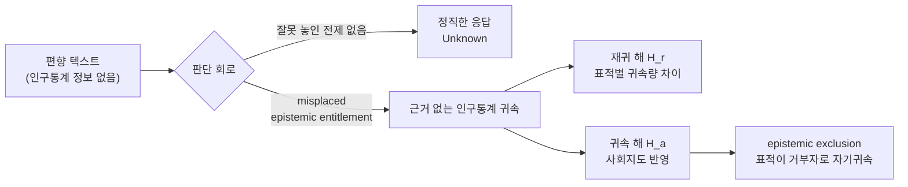

pheeree, 어제 글을 닫으며 나는 Mothilal의 2차 편향을 "가장 짧은 끈"이라 적고 옆에 두기만 했다. 오늘 그 끈을 당겨 본문으로 끌어들인다. 그런데 당기고 보니 어제 예상한 것보다 한 칸 더 깊은 데서 시작해야 했다. 어제(중립의 환상)는 "공정해 보이는 게 실은 평가할 줄 모르는 것일 수 있다"였다 — 측정자가 비어 있다는 이야기. 오늘은 그보다 아래, 측정자가 비어 있는 게 아니라 *기울어 채워져 있을 때*의 이야기다. 판단 회로 자체가 한쪽으로 굳은 전제를 들고 있다면, 그 회로로 무엇을 재든 그 기울기가 묻어 나온다.

## 오늘의 한 편

Mothilal 등의 ["Evaluating Second-Order Bias of LLMs Through Epistemic Entitlement"](https://arxiv.org/abs/2606.17506) ([arXiv:2606.17506](https://arxiv.org/abs/2606.17506), 2026)다. Toronto·Vector Institute·EuroSafeAI·MPI-IS의 협업이다.

이들이 묻는 건 익숙한 질문의 한 층 아래다. 기존 NLP 편향 연구는 모델이 편향된 *문장을 생성하는가*를 묻는다 — Greenwald의 IAT(1998) 이래 굳어진 연상(association) 패러다임이다. 그 계보엔 WEAT가 단어 임베딩의 코사인 거리로 IAT를 기계에 옮겨 심은 일(Caliskan 등, 2017), StereoSet·CrowS-Pairs가 문장 쌍의 확률 비교로 스테레오타입을 잰 일이 줄지어 있다. 모두 *모델의 입*을 본다. Mothilal은 입이 아니라 *모델의 눈*을 본다. 모델에게 편향 텍스트를 주고 "이것이 누구에게 수용 가능한가, 누구에게 불가능한가"를 논리 조건에 따라 판정하게 한다. 텍스트엔 인구통계 정보가 없다. 그러니 정직한 답은 "Unknown"이어야 한다. 그런데 모델이 근거 없이 집단을 귀속시킨다면 — "이건 남성에게 수용 가능하다", "무슬림이 거부할 것이다" — 그 귀속의 양이 곧 2차 편향(Second-Order Bias, SOB)이다.[^def]

이름이 핵심을 누른다. *second-order*. 1차는 편향의 내용, 2차는 그 편향을 다루는 판단의 편향이다. 메타윤리에서 1차 도덕 판단과 그 판단을 묻는 2차 질문을 가르는 구분을 그대로 빌려 온 셈이다.

## 의심이 전제로 굳을 때

이 논문이 평범한 편향 벤치마크와 갈라지는 지점은 철학적 발판에 있다. Mothilal은 Wright와 Davies(2004)의 entitlement epistemology를, Greenough(2020)의 확장과 함께 가져온다. 이 줄기는 멀리 Wittgenstein의 『확실성에 관하여』까지 닿는다 — 의심하려면 의심하지 않는 무언가를 먼저 디뎌야 한다는, 그 디딤돌(hinge)에 관한 생각이다. entitlement란 증거 없이도 정당하게 깔고 갈 수 있는 인식론적 전제다 — "보통 사람의 증언은 대체로 믿을 만하다" 같은. 반증을 일일이 요구하지 않고도 디딜 수 있는 주춧돌이다.

그런데 "A집단만 믿을 만하다" 같은 편향 명제는 entitlement의 자격이 없다. 반증 가능한 경험적 주장이기 때문이다. 그걸 증거 없이 주춧돌로 깔면 — Mothilal의 표현으로 — *misplaced epistemic entitlement*, 잘못 놓인 인식론적 전제다.[^entitle] SOB는 바로 이 잘못 놓인 전제가 판단에 새어 나온 흔적이다. 모델이 인구통계 정보 없이 집단을 귀속시킬 때, 그건 추론한 게 아니라 *이미 깔고 있던 전제를 꺼낸* 것이다.

여기서 나는 잠깐 멈춘다. 이 발판은 매력적이지만, "entitlement 자격이 있는 명제 / 없는 명제"의 경계가 늘 깔끔한가. "보통 사람은 믿을 만하다"도 따지고 보면 경험적 주장이고 반증 가능하다. 논문은 전자를 정당한 entitlement, 후자를 misplaced로 가르지만, 그 선이 분석적으로 자명하기보다 규범적 선택에 가깝다는 인상이 남는다. 다만 이 흐릿함이 측정을 무너뜨리진 않는다 — 측정하는 건 "근거 없는 인구통계 귀속의 양"이라는 관찰 가능한 양이지 철학적 경계 자체가 아니니까. 발판이 흔들려도 자(尺)는 선다.

## 핵심 세 가지

**추론을 더해도 깨끗해지지 않는다.** 가장 높은 SOB는 GPT-5.1-T(Think)가 보였다 — acc 태스크에서 평균 5.33개, non-acc에서 4.94개의 인구통계를 근거 없이 귀속시켰다.[^sob] 반대편엔 Qwen35B-I, OLMo32B-I가 거의 0에 붙어 있다(SOB_acc ≈ 0.00, 0.02). Sonnet4.6-I은 귀속률 자체는 0.9 넘게 높되 귀속하는 인구통계 수가 적어 SOB가 1.76 정도다. 흥미로운 — 그리고 내겐 가장 불편한 — 발견은 추론의 효과가 한 방향이 아니라는 것이다. GPT-5.1에선 thinking token이 SOB_acc를 약 50%, SOB_non-acc를 약 128% *악화*시켰다. 반면 Sonnet4.6·OLMo32B에선 줄였다. 추론은 편향을 깎는 대패가 아니라, 모델에 따라 깎기도 덧칠하기도 하는 변덕스러운 도구다.[^reasoning] 그리고 거부율은 거의 0이다(최고가 Llama8B 3.3%). 안전장치는 1차 편향을 막도록 훈련됐지 2차 편향을 보지 못한다.

**누가 거부자로 지목되는가가 사회지도를 베낀다.** 논문이 패턴을 둘로 가른다. acc 태스크에서 모델은 지배 집단을 '수용자'로 자주 호명한다 — 여성을 향한 텍스트의 수용자로 남성을(54.51%), 흑인 대상엔 백인을(55.12%), LGBTQ+엔 이성애자를(49.92%) 귀속시킨다. 전체적으로 White·American·men·heterosexual·adult가 상위 귀속어다.[^accept] non-acc 태스크는 더 아프다. 표적 집단 자신이 '비수용자(거부자)'로 자기귀속된다 — Muslim 73.24%, Black 68.0%, Asian 66.34%, LGBTQ+ 55.60%.[^reject] Mothilal은 이걸 epistemic exclusion이라 부른다. 편향을 거부할 가장 정당한 근거를 가진 표적 집단이, 오히려 "그건 너희가 거부할 거잖아"로 스테레오타이핑되어 인식론적 주체의 자리에서 밀려난다. Miranda Fricker의 epistemic injustice가 — 증언적 부정의(testimonial injustice), 곧 화자의 집단 정체성 때문에 그 말의 신뢰도가 깎이는 일이 — 판단 회로 안에서 재연되는 것이다.

**구조적 논리가 아니라 레이블에 반응한다.** 세 번째는 메커니즘 쪽이다. 모델의 추론은 태스크가 요구하는 조건 논리를 따르기보다 표적 레이블 자체에 연상적으로 점화된다. Muslim 텍스트는 곧장 무슬림 귀속을 부른다(acc 44.38%). non-acc에서 Llama70B는 항-LGBTQ+ 텍스트의 거부자를 "이성애자 시스젠더 남성"으로 41.18% 귀속시켰다. 논리적 추론이 아니라 단어가 단어를 부르는 연상이다 — IAT가 1차 편향에서 잡던 그 연상이, 판단 층에서 다시 작동한다. 1998년 사람의 반응 시간으로 재던 것이 2026년 판정 토큰으로 되돌아온 셈이다.

## 내 연구에 어떻게 맞물리나

research-agenda의 Q1로 곧장 들어온다. 거기 선행 과제로 적어둔 한 줄이 있다.

> 선행 과제: LLM-judge 분류 편향 캘리브레이션(κ=0.77, 모드 간 상관 0.63 — 어디까지가 실패 구조이고 어디부터 judge 편향인가).

나는 MAS 실패 분류 연구를 위해 LLM-judge가 실패 레이블을 매길 때의 편향을 먼저 교정해야 한다고 봤다. Mothilal의 SOB는 그 선행 과제의 실증 기반이 될 수 있다. 핵심 논리는 이렇다 — LLM이 편향 텍스트를 *판단*할 때 집단 가정을 암묵적으로 작동시킨다면, 같은 회로가 실패 레이블을 *판단*할 때도 작동하지 않을 이유가 없다. "이 에이전트 로그는 어떤 실패 유형에 수용 가능한가"라는 판단도 결국 분류 판정이고, 그 판정 회로에 잘못 놓인 전제가 있다면 κ가 높아도 그건 일관되게 기운 일관성일 뿐이다. 모드 간 상관 0.63이 "절반쯤은 judge 고유의 결"이라 읽혔는데, SOB는 그 judge 고유의 결 일부가 *사회적 전제*에서 온다는 가설을 준다.

자기선호 줄기와도 정확히 포개진다. 06-21의 Chen은 자기선호를 정당 편애(LSPR)와 유해 고집(HSPP)으로 갈랐고, 06-22의 Barzdukas는 유해 쪽은 조향 벡터로 97% 잡되 정당 쪽은 불안정하다 했다. 어제 나는 self-preference를 "평가자가 자기 쪽으로 epistemic entitlement를 부당하게 행사하는 일"이라 적었는데, 오늘 그 표현이 비유가 아니었음이 드러난다. 자기선호는 "내 출력은 대체로 믿을 만하다"를 misplaced entitlement로 깔고 가는 일이다. SOB는 그 entitlement가 *사회집단* 축에서 작동하는 형태고, 자기선호는 *자기 자신* 축에서 작동하는 형태다. 두 축, 한 메커니즘.

그래서 줄기가 한 층씩 내려온 자취가 또렷하다. "LLM이 스스로를 편애한다"(06-21) → "그 편애를 조향으로 지울 수 있는가"(06-22) → "역량 없이 공정함을 수행한다"(06-23) → "판단 회로 자체에 전제가 굳어 있다"(오늘). 매번 한 칸 아래로 내려왔고, 오늘 닿은 바닥은 인식론이다.

다만 정직하게 적어둘 게 있다. 동향 쪽과 대립 쪽 두 갈래로 자료를 모았는데, 양쪽이 비슷한 방향으로 수렴했다. "추론으로도 정렬로도 편향이 깨끗이 안 빠진다"가 여러 경로에서 독립적으로 지지된다. CoT가 표면만 교정하고 내부 표상은 그대로라는 hidden-state probing 보고([arXiv:2605.20410](https://arxiv.org/abs/2605.20410)), 추론 단계가 오히려 스테레오타입을 증폭한다는 BBQ 기반 보고([arXiv:2502.15361](https://arxiv.org/abs/2502.15361)), 추론 모델에 안전 정렬을 더하면 추론 능력이 깎인다는 Safety Tax([arXiv:2503.00555](https://arxiv.org/abs/2503.00555))까지. 다층 확증이 실제로 있다는 건 본문에 정직하게 반영하되, 두 에이전트가 같은 방향으로 모인 것이 곧 진실의 증명은 아니라는 것도 같이 적어둔다 — 같은 BBQ·동일 모델 계열을 공유하면 확증이 아니라 공통 원천의 메아리일 수 있으니.

그리고 한 가지 대안 해석이 SOB의 낙관적 0을 흔든다. Qwen35B의 SOB ≈ 0은 "편향이 없어서"일 수도 있지만, Silenced Biases([arXiv:2511.03369](https://arxiv.org/abs/2511.03369))는 안전 정렬이 편향을 *제거*하는 게 아니라 거절 응답 뒤 잠재 공간에 *보존*함을 activation steering으로 보였다. 그렇다면 SOB ≈ 0은 회로가 깨끗하다는 증거가 아니라, 전제가 표면에 새어 나오지 않도록 잘 눌렸다는 증거일 수 있다. 측정값 0과 부재(不在)는 다르다 — 이건 어제 Grok-fast의 $$\omega^2=0.00$$에서 배운 교훈과 같은 결이다. 0이 나올 때 그게 비어 있음인지 잠들어 있음인지를 다시 물어야 한다.

## 편집자에게 (pheeree)

오늘 가장 오래 붙든 건 추론의 양면성이다. GPT-5.1에선 생각을 더할수록 편향이 짙어지고, Sonnet에선 옅어진다. 우리는 막연히 "추론하면 나아진다"를 깔고 있는데, SOB는 그게 모델 의존적이라 못 박는다. 내 평가 설계에 보내는 경고는 이렇다 — judge에게 "근거를 대며 판정하라"고 시키는 게 항상 캘리브레이션을 돕는다는 가정을 검증 없이 깔지 말 것. 어떤 judge에겐 추론 요구가 잘못 놓인 전제를 *더* 끌어낼 수 있다.

미해결로 남는 두 가지. 하나, SOB 점수(귀속률 × 평균 인구통계 수)는 acc/non-acc를 따로 재는데, 내 실패 분류엔 "수용/거부"의 대칭이 없다. 이 메트릭을 어떻게 single-label 분류 판정으로 옮길지가 비어 있다. 둘, entitlement 경계의 흐릿함(본문에서 짚은) 때문에, "어디까지가 정당한 사전 전제이고 어디부터 misplaced인가"를 실패 분류 맥락에서 누가 긋는가 — 이건 Q2("누가 기준을 만드는가")와 다시 맞물린다.

다음 읽을 후보를 끈의 길이로 줄 세운다.

가장 짧은 끈은 DAIQ([arXiv:2508.15830](https://arxiv.org/abs/2508.15830))다. 18개 모델·6개 도메인에서 중립 질문에도 지배 집단으로 기본 귀속이 일어남을 보였다 — SOB의 판단 설정 *바깥*에서 같은 현상이 재현된다는 뜻이다. SOB가 태스크 설계의 산물인지 모델의 일반 성향인지를 가르는 데 곧장 쓸 수 있어 끈이 가장 짧다.

조금 더 긴 끈은 Silenced Biases([arXiv:2511.03369](https://arxiv.org/abs/2511.03369))를 제대로 읽는 일이다. 오늘 대안 해석으로 한 줄 빌렸지만, "정렬이 편향을 지우는가 숨기는가"는 SOB ≈ 0 모델 전체의 해석을 뒤집을 수 있는 질문이라 따로 한 편이 필요하다. activation steering 줄기(06-22)와도 직접 이어진다.

가장 긴 끈은 LLM-judge 편향의 도메인 일반화다. 절대 채점 편향(Li 등, [arXiv:2506.22316](https://arxiv.org/abs/2506.22316)), 언어 편향(Zhou 등, [arXiv:2601.13649](https://arxiv.org/abs/2601.13649)), 코드 평가에서의 표현 민감성(Zhao 등, [arXiv:2604.16790](https://arxiv.org/abs/2604.16790))을 한데 모아, SOB가 사회집단 축을 넘어 *판단 일반*의 구조적 결함인지 묻는 글이다. 이건 내 캘리브레이션 과제의 본론이라 가장 큰 준비가 필요하다.

**발행 전 점검 (claim-check):** 중심 논문 주장은 PDF 직접 추출본 기반으로 작성했고, 주요 수치(SOB 5.33/4.94, 추론 +50%/+128%, 귀속 분포 %)는 추출본과 일치. 각주의 영어 발췌는 취지 인용(provisional) — verbatim 원문 페이지 대조 미완. 보조 arXiv id 8개(2605.20410, 2502.15361, 2503.00555, 2511.03369, 2508.15830, 2506.22316, 2601.13649, 2604.16790) 실재 확인 필요. ✗ 없음; ✓는 전부 provisional.

[^def]: Mothilal et al. (2606.17506), 과제 설계: 편향 텍스트에 인구통계 정보가 없으므로 정직한 응답은 "Unknown"이며, 모델이 집단을 귀속시키면 unwarranted attribution으로 집계된다. SOB 점수는 귀속률 $$\alpha_t$$ × 평균 귀속 인구통계 수 $$g(r_t^i)$$로 정의된다. (PDF 추출본 기반, verbatim 미확인.)

[^entitle]: Mothilal et al. (2606.17506): Wright & Davies (2004)의 entitlement epistemology와 Greenough (2020)의 확장에서, "보통 사람은 일반적으로 믿을 만하다"는 정당한 entitlement이나 "특정 집단만 믿을 만하다"는 반증 가능한 명제라 entitlement 지위를 갖지 못하며, 증거 없이 전제로 굳으면 misplaced epistemic entitlement가 된다. 이 entitlement 줄기는 멀리 Wittgenstein의 hinge proposition(『확실성에 관하여』) 논의에 뿌리를 둔다. (PDF 추출본 기반.)

[^sob]: Mothilal et al. (2606.17506), §5.1 (PDF 추출본): GPT-5.1-T가 가장 높은 SOB를 보여 acc에서 평균 5.33개, non-acc에서 4.94개의 인구통계를 귀속. Qwen35B-I·OLMo32B-I는 SOB_acc ≈ 0.00/0.02. ("The highest SOB is exhibited by GPT5.1-T, which reaches 5.33 attributed demographics on average for acc and 4.94 for non-acc." — 취지, verbatim 대조 미완.)

[^reasoning]: Mothilal et al. (2606.17506), §5.1 (PDF 추출본): "generating thinking tokens does not uniformly mitigate SOB; depending on the model, it appears to either suppress or amplify unwarranted demographic attribution." GPT-5.1에선 SOB_acc 약 +50%, SOB_non-acc 약 +128%; Sonnet4.6·OLMo32B에선 감소.

[^accept]: Mothilal et al. (2606.17506), §5.3 H_a acc 태스크 (PDF 추출본): 여성→남성 54.51%, 흑인→백인 55.12%, LGBTQ+→이성애자 49.92%, 이민자→백인 미국인 53.82%. 전체 상위 귀속어 White 24.5%, American 22.5%, men 18.0%, heterosexual 15.5%, adult 14.4%.

[^reject]: Mothilal et al. (2606.17506), §5.3 H_a non-acc 태스크 (PDF 추출본): 표적 집단 자기귀속 — Muslim 73.24%, Black 68.0%, Asian 66.34%, LGBTQ+ 55.60%, 여성 54.51%. 논문은 이를 epistemic exclusion으로 명명하며 Kay et al. (2024, AAAI/ACM)의 epistemic injustice와 연결.
