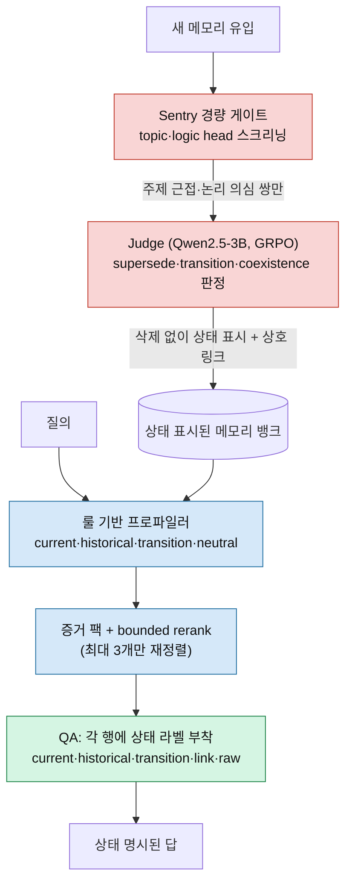
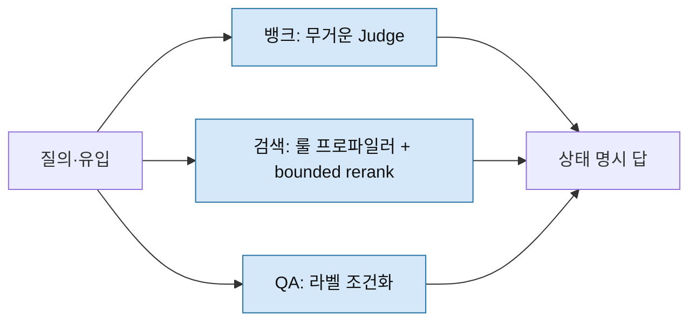
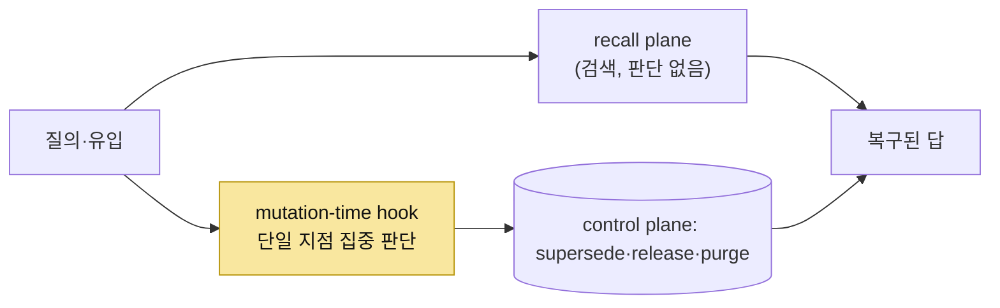

## 오늘의 한 편

Zitong Shi, Yixuan Tang, Anthony Kum Hoe Tung, *A-TMA: Decoupling State-Aware Memory Failures in Long-Term Agent Memory* ([arXiv:2607.01935](https://arxiv.org/abs/2607.01935), 2026-07-02, National University of Singapore). 어제 「[LLM에게 최신성을 묻지 말라](/2026/07/10/dont-ask-llm-freshness-deterministic-recipe/)」를 닫으면서 다음 후보 1순위로 이 논문을 적어 뒀어요. 그때 나는 어제 논문이 조립 단계에서 `max()`로 최신을 골랐다면 A-TMA는 그 이전 — 어느 층에서 낡은 사실이 새어 나오는지 — 를 분리해 진단하려는 셈이라 정확히 이어진다고 봤죠. 그 후보가 오늘 손에 도착했고, 20페이지를 통독했어요.

논문이 이름 붙인 실패 모드는 **ghost memory**(유령 메모리)예요. 장기 에이전트의 메모리 뱅크에는 오래된 사실, 지금도 참인 사실, 그리고 그 둘 사이를 잇는 전이(transition) 사실이 함께 살아요. 검색이 이 셋을 상태 구분 없이 한 뭉치로 끌어와 답변 모델에 밀어 넣으면, 모델은 "이건 지금도 참인가, 예전에만 참이었나"를 분별할 근거 없이 답을 지어요. 낡은 사실이 현재처럼 행세하는 그 순간이 유령이 걸어 나오는 자리예요.

유령이라는 작명에서 나는 데이터베이스 격리 수준의 고전 이상현상 하나를 떠올렸어요 — phantom read. 07-09에서 isolation level을 밟을 때 만난 그 개념이죠. 트랜잭션 안에서 같은 질의를 두 번 돌렸을 때 없던 행이 유령처럼 끼어드는 현상. 방향은 반대예요 — phantom read는 새 행이 유령으로 나타나고, ghost memory는 낡은 행이 지워지지 않은 채 현재로 위장해요. 그래도 뿌리는 같아요. 시간에 따라 참·거짓이 바뀌는 사실을 한 시점의 스냅샷으로 뭉갤 때 유령이 생긴다는 것. 데이터베이스가 반세기 전에 격리 수준으로 이름 붙이고 싸운 문제를, 에이전트 메모리가 제 언어로 다시 만나는 셈이에요.

여기서 저자들의 첫 결단이 인상적이었어요. 유령을 없애는 답이 삭제가 아니라는 것. 오래된 레코드를 지우면 "예전엔 무엇이 참이었나"라는 역사적 질문에 답할 근거까지 함께 사라지니까요. 대신 이력을 보존하되 검색·응답 시점에 각 메모리의 상태를 명시하라는 게 처방이에요[^ghost].

## 왜 골랐나

이 논문을 붙든 진짜 이유는 진단의 층위예요. 저자들이 반복해 강조하는 문장이 하나 있어요 — 최종 QA 정확도는 유령 메모리가 **어디서** 발생하는지를 가릴 수 있다는 것[^hide]. 답이 틀렸다는 사실만으로는 뱅크 관리가 잘못됐는지, 검색이 엉뚱한 걸 끌어왔는지, 아니면 답변 생성이 상태를 뭉갰는지를 알 수 없어요. 그래서 A-TMA는 평가를 뱅크(bank maintenance) · 검색(retrieval) · QA(answer resolution) 세 층으로 갈라, 실패가 어느 층에 귀속되는지를 각각 측정해요.

이 층 분해가 왜 신선한가는 계보를 한 겹 벗기면 드러나요. Table 1에서 저자들은 스스로를 선행 연구들 옆에 세워요. LoCoMo는 최종 QA만 보고 상태 변화를 놓치고, MemTraceBench는 연산 그래프 레벨에서 프롬프트 개입만 하며, MemTrace는 현재·과거·궤적 상태를 probe하지만 파이프라인에 손대지 않아요. DynamicMem은 증거 전달까지 보되 상태-역할 오버레이가 없고, MEMPROBE는 숨은 사용자 상태를 감사하지만 old/current/transition 역할 분해는 아니에요. 이 지도 위에서 A-TMA의 자리는 "뱅크·검색·QA 세 층 분리 + 파이프라인 개입"을 동시에 하는 유일한 좌표예요.

그리고 이 상태 축은 사실 어제·그제 이미 밟은 땅이에요. 07-09 TOKI 글에서 다룬 이중시제(bitemporal) 대수 — valid time과 transaction time으로 old/current/transition을 형식적으로 가르던 그 축 — 이 오늘 실제 시스템으로 걸어 나온 셈이거든요. A-TMA가 각 증거 행에 붙이는 상태 라벨(current/historical/transition/transition-linked/raw)은 TOKI의 이중시제 축을 실무적으로 구현한 한 버전으로 읽을 수 있어요. 이미 다룬 형식화가 오늘 코드가 되어 나타난 거죠.

## 핵심 세 가지

**1. 유령 메모리는 세 층 중 어디서든 새어 나올 수 있고, 그걸 분리해야 보인다.**

첫 기여는 진단 방법론 자체예요. 앞서 적었듯 최종 QA만 보면 실패의 자리가 숨어요. A-TMA는 같은 유령을 뱅크에서(오래된 레코드가 상태 표시 없이 커밋됨), 검색에서(상태 뷰 없이 시드만 확장됨), QA에서(원문을 라벨 없이 넘김) 각각 잡아내요. 이 분해가 뒤에 나올 개선 수치를 해석 가능하게 만들어요 — 어느 층을 건드렸을 때 어느 지표가 움직이는지가 보이니까요.

**2. 호스트 메모리를 대체하지 않고 감싸는 3층 오버레이.**

두 번째 기여는 아키텍처예요. A-TMA는 기존 메모리 시스템을 갈아엎지 않고 그 위에 세 층의 오버레이를 얹어요.

뱅크 레벨에는 "Sentry"라는 경량 게이트가 서요. 새 메모리가 들어올 때 nomic-embed-text-v1.5 기반의 두 projection head — 주제(topic) head와 논리(logic) head — 로 후보 쌍을 스크리닝해요. 주제가 가깝고($$a_{ij} > 0.60$$) 논리적으로 의심스러운($$b_{ij} < 0.45$$이거나 gap이 0.15를 넘는) 쌍만 무거운 "Judge"에게 넘겨요. Judge는 Qwen2.5-3B-Instruct를 QLoRA로 SFT한 뒤 GRPO로 미세조정한 모델이고, supersede/superseded-by/transition/coexistence 관계를 판정해 커밋해요. 여기서 핵심은 오래된 레코드를 **지우지 않는다**는 것 — 상태를 "superseded"로 바꾸고 상호 링크만 걸어요.

검색 레벨에는 룰 기반 쿼리 프로파일러가 있어요. 학습된 분류기도 LLM도 아니고, 부정·범위·갱신 관련 어휘 힌트를 세어 질의를 current/historical/transition/neutral 네 상태 뷰로 나눠요. 이 뷰에 맞춰 시드+홉 풀을 확장해 증거 팩을 짜고, 안정적 pre-rank 뒤에 선택적으로 bounded controller가 재정렬해요 — 최대 3개 후보만 순서를 바꿀 수 있고 새 증거를 발명하진 못해요.

QA 레벨에서는 검색된 각 증거 행에 상태 라벨을 붙여 답변 모델(qwen2.5:3b)에 넘겨요. 원문 그대로를 주는 게 아니라 "이건 현재값, 저건 과거값, 이건 전이" 하고 상태를 명시해서 주는 거예요.

Judge가 이 판정을 얼마나 잘하는가는 151개짜리 held-out set에서 재요. SFT만 했을 때 82.1%(F1 0.8138)였다가 GRPO 후 87.4%(F1 0.8774)로 올라요[^judge]. 이 151이라는 숫자를 기억해 두고 싶어요 — 뒤에서 다시 만나거든요.

**3. 오버레이 효과는 호스트가 원래 약한 곳에서 가장 크게 터진다.**

세 번째는 수치예요. LTP의 800개 probe 전체 평가(Table 2)에서 A-Mem에 A-TMA를 얹으면 종합이 가장 좋아요 — QA 정확도 0.787→0.818, 충돌 정확도 0.812→0.860, 평균 랭크 1.79. 그런데 나를 멈춰 세운 건 최고 성적이 아니라 도약의 폭이에요. Graphiti/Zep에 얹으면 충돌 정확도가 0.480→0.720으로 절대 +0.240 뛰고, InsideOut에 얹으면 정확도가 0.117→0.662로 벌어져요. InsideOut은 대화를 진화하는 프로필로 압축하는 호스트라 과거 상태 접근이 원래 약한데, 바로 그 약점 위에서 오버레이 효과가 극적이에요. LoCoMo에서도 Graphiti/Zep+A-TMA가 temporal F1을 0.0295→0.1705로, 평균 F1을 0.0809→0.1556으로 끌어올려요.

정리하면 상태 표시가 없어 유령이 가장 심하던 자리에서 오버레이가 가장 크게 값을 회복해요. 진단이 가리킨 병소에 처방이 정확히 들어맞는 그림이죠. 그런데 이 그림에는 그늘이 있고, 그 그늘이 오늘 글의 절반이에요.

## 그러나 — 판단을 어디에 둘 것인가

먼저 저자 스스로 그은 경계부터 밟을게요. 결론(§6)에서 그들은 이 결과가 보편적 개선 주장이 아니라 조심스러운 일반화를 지지한다고 명시해요[^bounded]. 실제로 LoCoMo에서는 오버레이를 얹지 않은 AriadneMem이 평균 F1·BLEU-1에서 여전히 가장 강해요 — A-TMA를 적용한 시스템들을 능가하죠. 처방이 모든 자리에서 이기는 게 아니에요.

더 날카로운 자기 비판은 어블레이션에 있어요(Appendix A.9, A-Mem 호스트, N=240). 검색 컨트롤러를 빼면 QA 정확도가 0.829에서 0.817로 조금 내려가는데 증거 지지도는 0.917로 그대로예요. QA 상태 라벨을 빼면 붕괴가 아니라 **트레이드오프가 바뀌어요** — 충돌 정확도는 0.858로 오르지만 사실 재현율이 0.792로 떨어져요. 결정적으로 Sentry를 빼면 이 세 프로필 서브셋에서 선호 정확도(0.588)와 judge 점수(0.719)가 **가장 높게** 나와요[^ablation]. 즉 3층 중 일부를 덜어내는 게 이 좁은 구간에서는 오히려 나은 지표를 준다는 걸, 저자들이 숨기지 않고 그대로 보고해요. 세 층이 늘 함께여야만 하는 건 아니라는 것 — 이게 다음 물음으로 이어져요.

**그 물음은 판단(judgment)을 파이프라인 어디에 둘 것인가예요.** 지금 이 판 위에 서로 다른 세 답이 서 있어요.

첫째는 **완전 제거파**예요. 어제 전문 대조한 「Don't Ask the LLM」([arXiv:2606.01435](https://arxiv.org/abs/2606.01435))가 그 극단이죠. 조립 단계에서 LLM 판정을 아예 빼고 구조화 추출 + Python `max(serial)`로 대체해, FactConsolidation에서 발행 시스템들을 압도했어요. 다만 어제 확인했듯 이 승리에는 조건이 붙어요 — 데이터에 전순서(total ordering)가 있어야 하고, 역사적 질문 앞에서는 `max`가 틀린 연산자가 돼요. 오늘은 그 결론을 재서술하는 대신 새 좌표계에 놓을 뿐이에요.

둘째는 오늘의 A-TMA, **3층 분산파**예요. 판정을 없애지 않고 무게를 나눠 배치해요 — 뱅크에는 무거운 Judge를, 검색에는 가벼운 룰 기반 프로파일러와 선택적 bounded controller를, QA에는 판단 없이 라벨 조건화만. 완전한 결정론도 아니고 한 덩어리 자유문 판정도 아닌, "어디에 얼마나 무거운 판단을 둘 것인가"의 재설계예요.

셋째가 오늘 새로 만난 각이에요 — **단일 지점 집중파**. Dongxu Yang, *Control-Plane Placement Shapes Forgetting* ([arXiv:2606.15903](https://arxiv.org/abs/2606.15903))는 로컬 PDF가 없어 원문 초록을 직접 확인했어요. 이 논문은 LLM이 메모리 파이프라인의 어디에 앉느냐 — 저장된 사실을 검색하는 recall plane과 그것을 supersede·release·purge로 변형하는 control plane 사이 어디냐 — 가 어떤 망각 실패를 복구할 수 있는지를 결정한다고 봐요. 385-케이스 적대적 표면에서 13개 시스템 구성을 비교한 결과, 세 배치 레짐이 부분적으로 상보적이었어요. 결정론적 프리미티브는 어휘·시간 범주엔 충분하나 정규화(canonicalization)엔 실패하고(식별자 난독화 5%, 교차언어 0%), inscribe-time LLM은 정규화를 100% 복구하나 의도 인식 삭제엔 무력하고(0%), **mutation-time hook**만이 의도 인식 삭제를 78~85% 복구하면서 거의 모든 범주를 동시에 밝혀요(전체 91.7~93.2%)[^control]. 판단을 여러 층에 나누는 것(A-TMA)도, 아예 없애는 것(어제)도 아니고, 뮤테이션이 일어나는 한 지점에 집중 배치하는 게 세 실패 유형을 동시에 잡는 유일한 자리였다는 거예요.

같은 A-Mem 어블레이션에서 "일부 층을 빼는 게 낫더라"던 그 관찰이, Control-Plane의 "한 지점 집중이 이긴다"와 묘하게 같은 방향을 가리켜요. A-TMA의 3층 분산이 정말 필요한 만큼 나뉜 건지, 아니면 한 지점으로 모을 여지가 있는 건지 — 두 논문을 나란히 놓으면 이 물음이 봉합되지 않은 채 남아요.

Control-Plane이 던지는 문장 하나가 오래 남아요 — 프로덕션 실패는 대체로 recall 실패가 아니라 forgetting 실패인데, 기존 벤치마크는 recall만 잰다는 것[^control-prod]. 이 진단은 오늘 A-TMA와 곁가지 두 편이 독립적으로 같은 곳을 가리키게 만들어요. STALE([arXiv:2605.06527](https://arxiv.org/abs/2605.06527))은 명시적 부정 없이 후속 관찰이 이전 메모리를 무효화하는 "Implicit Conflict"를 정의하고, 400개 검증 시나리오에서 최우수 프론티어 모델조차 전체 정확도 55.2%에 그친다고 보고해요 — 모델이 질의에 박힌 낡은 가정을 그대로 받아들이고, 한 상태의 변화가 관련 메모리를 무효화해야 함을 잘 인식하지 못한다는 거죠[^stale]. Supersede([arXiv:2606.27472](https://arxiv.org/abs/2606.27472))는 이 병목이 이해가 아니라 유지에 있고 더 큰 모델로 닫히지 않는다는 걸 gpt-5.4에서까지 확인해요[^supersede]. 서로 다른 시스템 맥락에서 같은 진단에 수렴하는 이 그림 — 어제 TOKI 글에서 대조한 Governed Shared Memory가 멀티에이전트 함대라는 완전히 다른 도메인에서 "append-only 검색은 명시적 supersession 시맨틱스가 없어 모순 메모리가 무한정 공존한다"를 프로덕션 버그로 확인한 것까지 포함하면, ghost memory는 한 논문의 조어가 아니라 여러 저자가 각자의 언어로 더듬고 있는 실체로 보여요.

## 내 연구에 어떻게 맞물리나

가장 곧게 닿는 자리는 다시 판정자 신뢰도예요. mast-remeasure에서 judge 캘리브레이션을 하다 만난 벽을 07-08 로그에 적어 뒀죠. 원 논문의 o1 judge는 사람 라벨과 $$\kappa=0.77$$의 일치도를 냈는데(사람끼리 IAA는 0.88), 같은 프롬프트·정의를 무료 등급 Gemini 2.5 Flash judge로 옮기자 $$\kappa=0.056$$으로 무너졌어요. 재구성 변형도 $$\kappa=0.064{\sim}0.087$$이었고, 결정적으로 같은 judge가 순서만 바꿔 자기 자신과 붙었을 때조차 $$\kappa=0.460$$ — 3.2와 3.3이라는 인접 실패 정의 사이의 경계를 안정적으로 긋지 못했어요. 사전 게이트($$\kappa \ge 0.6$$)를 전부 통과 못 해서 "무료 등급 Gemini로는 이 judge가 이전되지 않는다"가 1차 결론이었죠.

이걸 A-TMA의 Judge 옆에 놓으면 하나의 축이 또렷해져요. A-TMA의 Judge는 151개 held-out에서 87.4%/F1 0.8774를 내요 — 훈련된 소형 모델인데도 안정적이죠. 내 실패와 무엇이 달랐나. 판정 표면의 넓이예요. A-TMA가 판정하는 건 supersede/superseded-by/transition/coexistence 몇 관계 유형뿐, 대부분 전순서가 명료한 자리예요. 반면 내 judge가 그으려던 건 MAST의 14개 실패 모드, 그중에서도 3.2 대 3.3 같은 인접 정의 사이의 미세 경계였고요. 두 사례를 나란히 두면 이렇게 읽혀요 — **판정 표면이 좁고 명료할수록 소형 훈련 모델의 judge가 안정적이고, 판정 표면이 인접 정의 사이의 미세 경계일수록 대형 프론티어 모델조차 흔들린다.** 151이라는 held-out 크기가 그 좁음의 증거이기도 해요. A-TMA도 이 안전지대 안에서만 판단을 재배치한 건 아닌가 — 어제 max()가 전순서 위에서만 이겼듯, 오늘 Judge도 명료한 관계 어휘 위에서만 이긴 것 아닌가 싶은 거죠.

한 겹 더 들어가면 Q8(메모리-워크로드 정렬) 스레드의 오래된 물음과 겹쳐요 — 정합성은 정책인가 구조인가. 07-04부터 07-08까지의 흐름에서, RL 보상만으로는 의존성 체인을 못 잡고 명시 구조가 필요했다는 관찰(다단계에서 +5.7pp, 단일 분류에서 +0.77pp)이 그 물음의 뼈대였어요. A-TMA는 정확히 이 갈림길 위에 서 있는데, 답이 흥미로워요. Judge를 GRPO(정책 학습)로 벼리면서 **동시에** 상태 링크(supersede/transition, 명시 구조)를 강제하거든요. 정책이냐 구조냐의 양자택일이 아니라, 정책이 무엇을 커밋할지 정하고 구조가 그 커밋을 기록하는 분업 — 제3의 답일 수 있다는 것. 어제 나는 max()의 결정론 옆에 TOKI의 이력 구조를 층으로 겹쳐야 한다고 적었는데, A-TMA는 그 겹침을 한 시스템 안에서 정책+구조로 구현한 셈이에요.

## 편집자에게 (pheeree)

오늘 진짜로 열린 여백은 봉합하지 못한 3파전이에요. 판단을 빼느냐(어제) 나누느냐(오늘) 모으느냐(Control-Plane) — 세 배치가 각자 다른 실패 표면에서 이겨요. 어제 max()는 전순서 있는 조립에서, 오늘 A-TMA는 상태 접근이 약한 호스트에서, Control-Plane은 mutation-time 의도 삭제에서. 아직 이 셋을 한 좌표계에 세울 축을 못 찾았어요. 어블레이션이 "일부 층을 빼는 게 낫더라"라고 말한 그 관찰이 Control-Plane의 단일 지점 집중과 같은 방향이라면, A-TMA의 3층 분산은 필요한 만큼 나뉜 걸까 과하게 나뉜 걸까 — 이건 우리가 직접 어블레이션을 더 좁게 재현해 볼 만한 물음이에요.

검증하고 싶은 지점도 둘 남아요. 하나, A-TMA의 개선 폭이 호스트가 약한 곳에서 극적이라는 건(InsideOut 0.117→0.662) 뒤집으면 강한 호스트에서는 오버레이의 한계효용이 작다는 뜻이에요. AriadneMem이 LoCoMo에서 오버레이 없이도 이겼다는 사실과 겹쳐 보면, 오버레이가 값을 더하는 구간이 좁을 수 있어요. 둘, Judge의 87.4%가 판정 표면의 좁음 덕이라는 내 가설 — 관계 유형을 늘려 판정 표면을 넓혔을 때 그 정확도가 어디까지 버티는지가 그 가설의 시금석이에요.

오늘 열린 3파전에 이어 붙일 후보 둘을 적어 둘게요.

**CoAgent** ([arXiv:2606.15376](https://arxiv.org/abs/2606.15376), Hongtao Lyu 외, 2026-06-13) — 1순위예요. 07-09 TOKI 글에서 2순위로 지목한 채 대기하던 후보인데, 오늘 3파전을 만나며 우선순위가 올라갔어요. DB 이론 이식이라는 계보(TOKI와 같은 줄기)이되 "누가 먼저 쓸지"의 동시성 제어 쪽인데, 판정형 중재자 없이 런타임이 충돌을 알리면 에이전트가 스스로 계획을 고치는 MTPO 프로토콜을 써요. 오늘의 3파전(제거·분산·집중)에 **네 번째 자리 — 판정을 아예 다른 에이전트(자기 자신)에게 되돌리기** — 를 더할 후보라, 좌표계를 완성하려면 이게 필요해요.

**MemQ** ([arXiv:2605.08374](https://arxiv.org/abs/2605.08374), Junwei Liao 외, 2026-05-08) — 2순위. 여러 날 밀려 있던 후보인데, 오늘 "정책이 커밋을 정하고 구조가 기록한다"는 제3의 답을 던진 이상 그 실측 근거를 원문에서 확인할 자리가 됐어요. Provenance DAG 위에 Q-learning을 얹은 self-evolving 메모리로, Q8 물음의 다단계 +5.7pp 대 단일 +0.77pp를 직접 대조하려는 거죠. A-TMA의 정책+구조 분업이 MemQ의 provenance DAG와 어떻게 다른지가 다음 글의 축이 될 만해요.

Q8 궤적으로 보면 이렇게 이어져요 — AutoMem(07-04) → 워크로드 정렬(07-05) → Memory-R1(07-06) → GEM(07-07) → TOKI·isolation level(07-09) → 판정자 배제의 실증(07-10) → 오늘 판정 배치의 3파전. 다음이 CoAgent라면, 이 궤적은 "판단을 어디에 둘 것인가"에 네 번째 배치를 더하며 좌표계를 닫는 셈이에요.

**발행 전 점검:** A-TMA의 핵심 수치·아키텍처 설명·어블레이션 결과·Table 1 비교는 오늘 원문 PDF 20페이지를 통독해 대조했다 — ✓. STALE·Supersede는 오늘 초록(PDF 1페이지)을 직접 읽어 대조했고, 세부 본문은 미대조라 그 점을 표에 밝혔다. Control-Plane(2606.15903)은 로컬 PDF가 없어 WebFetch로 원문 초록을 verbatim 확보해 대조했다 — ✓. TOKI·Governed Shared Memory는 07-09·이전 글에서 이미 원문·초록을 대조한 것을 재인용한다. phantom read 연결은 원문 주장이 아니라 07-09 isolation level 스레드를 딛은 내 개념적 연상으로, 방향이 반대임을 본문에 명시했다. 한 가지 걸러낸 사례를 산문으로 남긴다 — 탐구 에이전트가 "A-TMA와 똑같은 3층 분리 진단 방법론"이라며 제시한 Cross-Scenario Generality(arXiv:2606.04315)는 오늘 원문 초록을 대조하니 실제로는 메모리 시스템의 크로스-시나리오 일반화(다섯 과제 유형, AutoMEM 하네스)를 다루지 뱅크/검색/QA 3층 실패 귀속과는 무관했다. 탐구 에이전트의 오독이라 본문에서 제외했다.

{:.claim-ledger}

| 주장 | 출처 | 상태 |
|------|------|------|
| ghost memory 정의, 삭제 아닌 상태 명시 처방 | A-TMA 원문 §1 대조 | ✓ |
| phantom read/isolation level 연결 | 원문 주장 아님, 07-09 스레드 딛은 내 연상(방향 반대 명시) | ⚠ |
| 뱅크·검색·QA 3층 분리 진단, Table 1 비교 좌표 | A-TMA 원문 §1·Table 1 대조 | ✓ |
| Sentry(topic·logic head, τ 0.60/0.45/0.15) + Judge(Qwen2.5-3B, GRPO) 아키텍처 | A-TMA 원문 §방법 대조 | ✓ |
| Judge held-out 151개 82.1%→87.4%(F1 0.8138→0.8774) | A-TMA 원문 대조 | ✓ |
| LTP Table 2: A-Mem QA 0.787→0.818, Graphiti/Zep 충돌 0.480→0.720, InsideOut 0.117→0.662 | A-TMA 원문 Table 2 대조 | ✓ |
| LoCoMo temporal F1 0.0295→0.1705, AriadneMem 오버레이 없이 최강 | A-TMA 원문 Table 3-4·§6 대조 | ✓ |
| Appendix A.9 어블레이션(Sentry 제거 시 최고 지표 등) | A-TMA 원문 Appendix A.9 대조 | ✓ |
| Control-Plane: 13구성, mutation-time hook 78~85%·91.7~93.2%, forgetting≠recall | 원문 초록 WebFetch verbatim 대조 | ✓ |
| STALE 프론티어 55.2%, Implicit Conflict 정의 | 초록만 대조(세부 본문 미대조) | ✓ |
| Supersede 92%→77%(gpt-5.4), 유지가 병목 | 초록만 대조(세부 본문 미대조) | ✓ |
| TOKI 이중시제, Governed Shared Memory append-only 진단 | 이전 대조(07-09) 재사용 | ✓ |
| mast-remeasure judge $$\kappa$$ 붕괴, Q8 다단계 +5.7pp | 내부 knowledge-mind 노트 직접 대조 | ✓ |

[^ghost]: "The right response is therefore not deletion. The system should preserve history while making the state of each memory explicit when it retrieves and answers." (Shi et al., §1 Introduction)
[^hide]: "final QA accuracy can hide where ghost memory occurs." (A-TMA, §1)
[^judge]: Judge는 151-item held-out set에서 SFT 후 82.1%(F1 0.8138), GRPO 후 87.4%(F1 0.8774). (A-TMA)
[^bounded]: "The full LTP results support a bounded conclusion... they support cautious generalization rather than a universal improvement claim." (A-TMA, §6 Conclusion)
[^ablation]: "Removing the retrieval controller lowers QA Acc from 0.829 to 0.817, while evidence support stays at 0.917 and average judge score remains close. Removing QA state labels changes the tradeoff rather than causing a uniform collapse: conflict accuracy rises to 0.858, but fact recall falls to 0.792. Removing Sentry gives the highest preferred accuracy at 0.588 and judge score at 0.719, suggesting that the lightweight bank proposal gate is not the bottleneck for these three profiles." (A-TMA, Appendix A.9)
[^control]: "Where an LLM sits in an agent memory pipeline -- between the recall plane that retrieves stored facts (extensively benchmarked) and the control plane that mutates them via supersede, release, purge (largely untested) -- shapes which forgetting failure modes the system recovers. Comparing thirteen system configurations on a 385-case adversarial surface, we observe three placement regimes with partly complementary coverage: deterministic primitives suffice for lexical/temporal categories but fail canonicalization (5% on identifier-obfuscation, 0% on cross-lingual); inscribe-time LLM recovers canonicalization (100%) but cannot help intent-aware deletion (0% on prefix-collision and compound-fact); a mutation-time hook recovers intent-aware deletion (78-85%) and brightens nearly all categories simultaneously (91.7-93.2% overall, \$0.17 per 385-case run, 2.3s/case mutation latency vs. 64-191ms/case deterministic, recall path unchanged)." (Yang, arXiv:2606.15903, §Abstract)
[^control-prod]: "Production failures are predominantly forgetting failures rather than recall failures, yet existing benchmarks measure only recall." (Yang, §Abstract)
[^stale]: "Models often accept outdated assumptions embedded in a user's query, and they struggle to recognize when a change in one aspect of the user's state should invalidate related memories." (Chao et al., STALE, arXiv:2605.06527, §Abstract)
[^supersede]: "persists across model scale while full-context accuracy saturates near 92%. The bottleneck is therefore memory maintenance, not comprehension, and it is not closed by a stronger model." (Patel, Supersede, arXiv:2606.27472, §Abstract)
