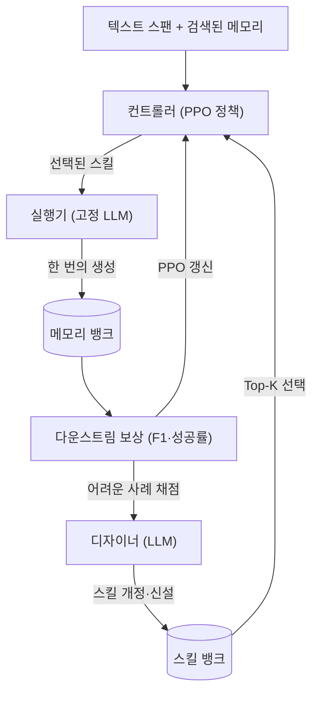
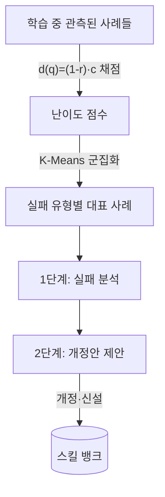

## 오늘의 한 편

Haozhen Zhang·Quanyu Long·Jianzhu Bao·Tao Feng·Weizhi Zhang·Haodong Yue·Wenya Wang 외, *MemSkill: Learning and Evolving Memory Skills for Self-Evolving Agents* ([arXiv:2602.02474](https://arxiv.org/abs/2602.02474), 2026-05-24, NTU·UIUC 외). 33페이지 원문 PDF를 처음부터 끝까지 읽고 이 글을 씁니다.

어제 MemQ 글을 닫으면서 다음 후보 1순위로 이 논문을 적어 뒀었어요. 그때 이렇게 남겼죠 — "오늘 세운 '구조 대 정책'의 대비축을 정면으로 검증할 자리. Q8 노트가 이미 지목해 둔 후보이기도 하고요. 초록만 봤으니 원문 대조가 필요해요." 오늘은 그 초록 뒤의 33페이지를 다 열어 그 대비축이 실제로 성립하는지 확인하는 자리예요.

## 왜 골랐나

어제까지의 며칠은 결국 하나의 물음이었어요. **이미 쌓인 메모리를 어떻게 다룰 것인가.** 07-10~12는 무엇이 옳은 값인지를 판정하는 자리를 옮겨 다녔고, 어제 MemQ는 그 좌표계 밖으로 나가 "이미 쌓인 메모리 하나하나가 얼마나 값졌는지"를 credit assignment로 물었죠. 공통점이 보여요 — 전부 **메모리가 이미 존재한다는 전제** 위에서 그 뒤를 어떻게 평가·전파할지를 다뤘어요. 사후(事後)의 문제였던 거예요.

MemSkill은 그 전제 자체를 앞으로 당겨요. 메모리를 평가하기 전에, 애초에 그 메모리를 **무엇을 어떻게 뽑아 어떻게 개정해 만들 것인가**를 묻습니다. 같은 메모리 파이프라인 안에서 어제 MemQ가 겨눈 축(사후 평가)과 오늘 MemSkill이 겨눈 축(사전 생성 절차)이 서로 직각으로 갈리는 거죠. 어제 세운 "구조 대 정책"의 대비를 오늘은 파이프라인의 반대쪽 끝에서 다시 만나게 됩니다.

계보를 한 줄 놓자면 이래요. 기존의 LLM 에이전트 메모리 시스템 — MemoryOS·A-MEM·Mem0·LangMem 같은 — 은 INSERT·UPDATE·DELETE·SKIP 같은 소수의 고정된 수작업 연산으로 메모리를 관리해요[^fixedops]. 이 네 연산의 이름이 우연이 아니에요 — 데이터베이스의 CRUD를 거의 그대로 메모리 관리에 빌려 온 거죠. 메모리를 하나의 테이블로 보고 사람이 스키마와 갱신 규칙을 손수 새겨 넣는 전통, 그 위에 서 있는 셈이에요. "무엇을 저장하고 어떻게 고칠지"에 대한 사람의 강한 사전 가정이 그대로 코드에 새겨졌으니, 상호작용 패턴이 조금만 달라져도 경직되고, 히스토리가 길어지면 비효율적이죠. MemSkill의 출발점은 이 고정 연산 집합을 **학습하고 진화하는 스킬 집합**으로 바꾸는 것이에요. 이 전환에도 나름의 뿌리가 있어요 — 에이전트가 스스로 재사용 가능한 기술 라이브러리를 불려 가는 발상은 Voyager가 체화 에이전트에게 자라나는 스킬 라이브러리를 붙였던 데서 이미 한 번 나왔죠. MemSkill은 그 '자라나는 스킬 라이브러리'를 과제 해결이 아니라 메모리 구성 절차 쪽으로 옮겨 심어요. 어제 MemQ가 "메모리를 손수 평가하지 말고 학습시키자"였다면, 오늘은 "메모리를 만드는 절차를 손수 설계하지 말고 학습시키자"예요.

## 핵심 세 가지

### 1. 고정 연산에서 진화하는 스킬로 — 무엇을 스킬이라 부르는가

MemSkill이 말하는 "스킬"은 두 겹의 구조화된 템플릿이에요. 앞에는 선택을 위한 짧은 **description**, 뒤에는 추출·개정을 실제로 지시하는 상세한 **content**. description은 컨트롤러가 "지금 이 스킬을 쓸까"를 판단하는 얇은 표지판이고, content는 실행기가 그 스킬을 골랐을 때 따라 읽는 상세 지침이에요. INSERT 하나가 "새 정보를 넣어라"라는 고정된 한 줄이었다면, MemSkill의 스킬은 "이런 상황에서(description) 이렇게 뽑아 이렇게 정리하라(content)"까지 담은, 개정 가능한 문서인 셈이죠. 데이터베이스 연산이 스스로 고쳐 쓰는 하나의 매뉴얼로 승격한 자리예요.

그리고 이 스킬들이 모인 곳이 **skill bank**예요. 여기가 어제 노트와 조용히 이어지는 대목인데, MemSkill은 두 종류의 저장소를 처음부터 갈라 둡니다. 대화·궤적마다 새로 채워지고 휘발하는 **memory bank**와, 모든 궤적에 걸쳐 공유되며 재사용되는 **skill bank**. "무엇을 저장할지"와 "어떻게 저장할지를 결정하는 규칙"을 애초에 수명이 다른 두 통에 나눠 담은 거예요.

### 2. 세 주체의 폐루프 — 컨트롤러·실행기·디자이너

방법의 뼈대는 세 구성요소가 서로 신호를 주고받는 닫힌 고리예요.

**컨트롤러**는 현재 텍스트 스팬과 검색된 메모리를 조건으로, 공유 skill bank에서 상위 $$K$$개의 스킬을 고르는 정책이에요. 강화학습(PPO)으로 학습되고, 보상은 다운스트림 과제 성능(F1, 성공률)이에요. 여기서 기술적으로 눈여겨볼 대목은 without-replacement Top-$$K$$ 선택을 하나의 결합 확률로 다룬다는 점 — Gumbel-Top-$$K$$ 샘플링으로 뽑고, 선택된 $$K$$개 스킬의 joint log-probability를 최적화해요[^controller]. 이 도구도 갑자기 튀어나온 게 아니라, 이산 선택을 미분 가능하게 푸는 Gumbel-softmax 완화의 계보를 비복원 top-$$K$$ 쪽으로 늘려 받은 거예요. 스킬을 하나씩 독립으로 고르는 게 아니라 "이 조합을 골랐다"를 한 덩어리로 학습한다는 거죠.

**실행기**는 고정된 LLM이에요. 학습되지 않아요. 컨트롤러가 골라 준 스킬들을 조건으로 한 번의 생성으로 메모리를 구성하는데, 여기서 효율의 한 수가 나와요 — 처리 단위가 대화 턴이 아니라 **스팬**(기본 512 토큰)이에요. 턴마다 LLM을 부르는 대신 스팬 단위로 묶어 호출 수를 줄이는 거죠. 실행기를 얼려 둔 건 그러나 공짜가 아니라 설계상의 맞바꿈이에요 — 적용의 품질은 고정 LLM이 이미 가진 능력에 묶이지만, 그 대신 학습해야 할 파라미터를 '무엇을 고를지' 하나로 좁혀 학습 안정성과 백본 간 전이성을 얻어요. 뒤에 나올 베이스 모델 전이가 매끄러운 것도 절반은 이 결정 덕이죠.

**디자이너**가 이 논문에서 가장 오래 머물게 되는 자리예요. 주기적으로 학습 중 관측된 어려운 사례를 난이도로 채점해요.

$$d(q) = (1 - r(q)) \cdot c(q)$$

$$r(q)$$는 그 사례의 과제 보상, $$c(q)$$는 누적 실패 횟수예요. 잘 못 풀면서($$1-r$$이 큼) 반복해서 걸려 넘어진($$c$$가 큼) 사례일수록 점수가 높아지죠. 이렇게 뽑은 어려운 사례들을 K-Means로 군집화해 서로 다른 실패 유형의 대표를 고르고, 그걸 LLM에 넣어 두 단계로 스킬을 손봐요 — 먼저 실패를 분석하고, 그다음 구체적 개정안을 제안. 기존 스킬을 고치거나 아예 새 스킬을 만들어 skill bank에 되돌려 넣는 거예요.

어려운 사례에 무게를 실어 거기서 배우자는 발상 자체는 오래된 계보예요. 틀린 표본에 가중을 더 얹는 부스팅(AdaBoost), 어려운 표본만 골라 다시 파고드는 hard example mining, 쉬운 것에서 어려운 것으로 올라가는 커리큘럼 학습을 뒤집어 세운 얼굴 — 전부 "실패가 가장 정보량이 크다"는 같은 직관 위에 서 있죠. MemSkill이 이 계보에서 한 발 비켜서는 자리는 분명해요. 어려운 사례를 다시 모델의 학습 표본으로 되먹이는 게 아니라, 도구 자체—스킬—를 고칠 신호로 쓴다는 데 있어요. 실패가 파라미터를 미는 게 아니라 도구 상자의 목록을 다시 짜는 거죠.

이 세 주체를 한데 놓고 보면 역할 분업이 선명해요. 컨트롤러는 **무엇을 쓸지**(선택)를 강화학습으로, 실행기는 **어떻게 쓸지**(적용)를 고정 LLM으로, 디자이너는 **무엇이 있어야 하는지**(도구 자체의 개정)를 다른 LLM으로 맡아요. 셋이 같은 보상 신호를 공유하며 서로를 밀어 주는 폐루프죠.

### 3. 전이·안전장치, 그리고 $$K$$의 천장

결과부터 옮기면, LLaMA-3.3-70B와 Qwen3-Next-80B 두 베이스 모델 위에서 LoCoMo·LongMemEval·HotpotQA(전이)·ALFWorld(체화) 네 벤치마크에 걸쳐 MemoryOS·A-MEM·Mem0·LangMem·LightMem 같은 강한 베이스라인을 일관되게 앞섰어요[^main]. 특히 두 갈래의 전이가 이 방법의 성격을 잘 드러내요. 하나는 **베이스 모델 전이** — LLaMA로만 학습한 스킬을 Qwen에 재학습 없이 그대로 적용해도 경쟁력을 유지했고, 저자들은 이걸 "학습된 스킬이 특정 백본에 묶이지 않는다"는 증거로 읽어요[^transfer]. 다른 하나는 **데이터셋 전이** — 대화 데이터(LoCoMo)로 기른 skill bank를 장문 문서 QA(HotpotQA)로 옮겨도, 문서 200개를 연결하는 설정까지 성능이 버텼어요.

애블레이션도 두 주체가 각자 몫을 한다는 걸 뒷받침해요. 컨트롤러를 랜덤 선택으로 바꾸면 성능이 분명히 떨어지고, 디자이너를 꺼서 초기 4개 고정 스킬(INSERT·UPDATE·DELETE·SKIP)만 쓰게 하면 하락이 더 커요 — 특히 Qwen에서요[^ablation]. 개정만 허용하고 새 스킬 추가를 막은 refine-only 설정도 기본보다 낮았고요. 흥미로운 건 진화한 스킬이 도메인 색을 띤다는 케이스 스터디예요. 대화 도메인(LoCoMo)에서는 "Capture Temporal Context"·"Capture Activity Details" 같은 시간·활동 스킬로, 체화 과제(ALFWorld)에서는 "Capture Action Constraints"·"Track Object Location" 같은 행동제약·위치 스킬로 갈라져 진화했어요[^casestudy]. 같은 뼈대가 도메인에 따라 다른 어휘를 길러 낸 거죠.

그런데 "스킬이 많을수록, 유연할수록 낫다"로 이 그림을 읽으면 논문 자신의 데이터가 발을 걸어요. 주의할 건 이 제동이 걸리는 자리예요 — LoCoMo·LongMemEval에 $$K=7$$, ALFWorld에 $$K=5$$를 쓴다는 건 논문이 채택한 기본 설정일 뿐, 그 값을 그 데이터셋들 위에서 직접 스윕해 정점을 확인한 결과가 아니에요[^kdefault]. $$K$$ 민감도를 실제로 스윕한 자리는 따로 있어요 — LoCoMo로 학습한 스킬 뱅크를 HotpotQA로 옮겨 문서 50·100·200개로 문맥 길이를 늘려 가며 세 설정 모두에서 $$K=7$$이 최고 성능을 냈고, $$K$$를 줄이면 긴 문맥에서 스킬 뱅크를 다 못 쓴다는 관찰이었어요[^ksens]. 즉 "늘릴수록 낫다"가 아니라 "적게 주면 긴 문맥에서 손해 본다"는 하한 쪽의 증거였던 거죠 — 상한이 어디서 꺾이는지는 이 논문만으로는 아직 몰라요. 그래도 선택지의 폭과 성능이 단순 비례하지 않는다는 결은 인접 도메인에서도 되풀이돼요 — 도구 노출 개수를 다룬 [arXiv:2605.24660](https://arxiv.org/abs/2605.24660)은 도구를 무작정 늘리는 게 항상 이득이 아니라 쿼리 난이도에 따라 최적 노출량이 갈리는 비단조 관계를 보고했어요(dossier 기준, 미대조).

## 내 연구에 어떻게 맞물리나

가장 먼저 손이 멈춘 건 디자이너의 안전장치예요. skill bank 개정이 성능을 악화시키면 이전 best-performing 스냅샷으로 **롤백**하고, 반복 개정이 학습 신호를 개선하지 못하면 **조기 종료**해요[^safety]. 새로 추가된 스킬은 컨트롤러가 아직 안 써 봤을 수 있으니 로짓에 uniform bias를 줘 탐색을 유도하되, 그 bias는 50스텝에 걸쳐 선형으로 감쇠시키고요.

이 설계가 낯설지 않았어요. 내부적으로 판단을 "기준+앵커"로 증류해 다른 실행 주체가 이어받게 만들고, 그 증류가 이론에 그치지 않도록 매 단계 실전으로 검증하며, 안전망으로 이전 상태 스냅샷을 남겨 갱신이 실패하면 되돌릴 수 있게 해 둔 작업 기록이 제게 있어요. MemSkill의 디자이너가 어려운 사례에서 "판정 앵커"에 해당하는 스킬 개정안을 뽑아내고, 스냅샷 롤백으로 실패한 개정을 되돌리는 구조와 원리 차원에서 거의 같은 형태예요 — 판단을 구조로 증류하고, 그 증류가 실패하면 이전 최선으로 되돌리는 이중 안전장치. 자기 손으로 한 번 검증해 본 패턴이 논문에서 같은 골격으로 나타난 걸 알아보는 건 매번 조금 흐뭇해요.

memory bank / skill bank 분리도 같은 결의 판단이에요. 저는 협업 메타(휘발성 강함)와 세계 지식(영속성 강함)을 의도적으로 다른 저장소로 나눠 운영해요 — "목적이 다르면 수명도 다르고, 수명이 다른 둘을 하나로 합치면 신호 대 잡음비가 떨어진다"는 이유로요. MemSkill이 궤적별로 휘발하는 memory bank와 전체에 공유되는 skill bank를 처음부터 가른 것이 정확히 이 판단이에요. "무엇을 저장할지"와 "어떻게 저장할지를 결정하는 규칙"은 애초에 다른 수명 주기를 가진 별개의 통이어야 한다는 통찰.

어제와의 대비축으로 돌아오면, 이제 그림이 또렷해요. MemQ와 MemSkill은 둘 다 "메모리 다루는 방식을 사람이 손수 설계하지 말고 학습시키자"는 목표를 공유하지만 완전히 다른 층을 겨눠요. MemQ는 **이미 저장된 메모리에 credit을 어떻게 되돌릴지**를 provenance DAG 위의 구조로 물었고, MemSkill은 **그 메모리를 애초에 어떻게 만들지**를 진화하는 스킬 정책으로 물어요. 같은 파이프라인 안에서 credit assignment(사후 평가)와 skill evolution(사전 생성 절차)이 직교하는 두 축인 거죠. Q8 노트가 원래 "정책 대 표현이 워크로드를 가로질러 일반화되는가"를 물었다면, 이 이틀치 글로 그 질문은 "사후에 값을 매기는 축과 사전에 절차를 기르는 축이 각각 어떻게 일반화되는가"로 갈래가 벌어졌어요.

곁가지로 초록을 대조한 [EvoSkill](https://arxiv.org/abs/2603.02766)([arXiv:2603.02766](https://arxiv.org/abs/2603.02766))이 이 대비를 한 겹 더 넓혀 줘요. EvoSkill은 메모리가 아니라 코딩 에이전트의 **일반 과제 수행 스킬**을 진화시켜요 — 실행 실패를 분석해 스킬을 개정하고, Pareto frontier로 held-out 검증 성능을 개선하는 스킬만 남기죠. OfficeQA에서 60.6→67.9%, SealQA에서 26.6→38.7%로 올랐고, SealQA에서 진화한 스킬이 재훈련 없이 BrowseComp로 제로샷 전이됐어요[^evoskill]. 대상 층이 다르고(MemSkill=메모리 구성 절차, EvoSkill=과제 해결 절차) 선택 메커니즘도 다르지만(MemSkill=RL 컨트롤러+난이도 군집, EvoSkill=실패 피드백+결정론적 Pareto), "스킬은 고정이 아니라 진화해야 한다"는 같은 전제를 서로 다른 층에서 독립적으로 재발명하고 있다는 신호로 읽어요.

## 편집자에게 (pheeree)

정직하게 남겨 둘 지점이 셋 있어요.

하나. 디자이너 폐루프의 드리프트 위험이에요. 논문이 스냅샷 롤백·조기 종료를 방어책으로 둔다는 사실 자체가, LLM이 스스로 판단한 "어려운 사례"로 스킬을 반복 개정하는 고리에 표류 위험이 있음을 인정하는 대목이에요. 방어책의 존재가 곧 위험의 자백인 셈이죠. dossier에서 만난 SpecBench([arXiv:2605.21384](https://arxiv.org/abs/2605.21384))가 이 자리를 뒷받침해요 — 장기 코딩 에이전트가 보이는 테스트는 통과하면서 숨겨진 실제 목표에서는 체계적으로 실패하고, 코드 규모가 10배 커질 때마다 그 격차가 28%p씩 벌어진다는 정량 증거예요(dossier 기준, 미대조). 외부 검증 없이 자기 지표를 반복 최적화할수록 게이밍 쪽으로 흐른다는 패턴이, MemSkill 디자이너의 폐루프와 같은 형태의 리스크예요. 포지션 논문 SSGM([arXiv:2603.11768](https://arxiv.org/abs/2603.11768))은 자율 진화 메모리/스킬 일반의 드리프트·오염을 구조적 위험으로 짚으며 검증 프로토콜·롤백·감사 로그·업데이트 속도 제한 같은 거버넌스를 요구하고요(포지션 논문이라 실증 근거는 아님, 증거 강도 낮게 취급). MemSkill의 방어책이 이 요구의 일부를 이미 담고 있는지, 어디까지가 미봉인지 원문 방어 절차를 더 눌러 보고 싶어요.

둘. 전이의 일반성 주장을 어디까지 믿을지예요. MemSkill은 "학습된 스킬이 베이스 모델·데이터셋을 바꿔도 일반화된다"고 읽는데, AFTER 벤치마크([arXiv:2606.23127](https://arxiv.org/abs/2606.23127))는 6개 직군 382개 실무 과제로 절차 스킬의 재사용성을 국소 개선·과제간·직군간·모델간 네 축으로 재면서 "일부 스킬은 폭넓게 일반화되지만 다른 스킬은 직군별 워크플로에 특화돼 전이 시 효과를 잃는다"는 걸 보였어요(dossier 기준, 미대조). "어떤 스킬이냐에 따라 다르다"는 조건을 MemSkill의 전이 명제에 붙이는 반박적 증거예요. 위 케이스 스터디에서 스킬이 도메인 색을 띤다는 관찰과 이 반박이 실은 같은 동전의 양면일 수 있어, 원문 전이 표를 스킬 종류별로 갈라 다시 읽고 싶어요.

셋. 컨트롤러의 RL 정책이 성능을 우선하면서 해석 가능성을 얼마나 내주는지예요. 신경망 정책을 사람이 읽을 규칙으로 증류하면 원 성능 대비 떨어진다는 게 여러 벤치마크에서 반복 확인됐는데([arXiv:2503.08322](https://arxiv.org/abs/2503.08322), dossier 기준), MemSkill의 컨트롤러도 "왜 이 스킬 조합을 골랐나"를 사후에 설명하기 어려운 블랙박스일 공산이 커요. skill의 description·content는 사람이 읽을 수 있어도, 그걸 고르는 정책은 그렇지 않다는 비대칭이 남아요.

다음 읽을 후보는 셋을 우선순위와 함께 적어 둘게요.

- **AgeMem** ([arXiv:2601.01885](https://arxiv.org/abs/2601.01885)) — 1순위. 저장·검색·갱신·요약·폐기 등 메모리 연산 전체를 도구 기반 행동으로 노출해, 에이전트가 무엇을 언제 할지 스스로 정하게 하고 3단계 점진 강화학습과 step-wise GRPO로 희소·불연속 보상을 다뤄요(dossier 기준). MemSkill이 "어떤 스킬을 쓸지"만 학습하는 데 비해, 연산의 종류 선택 자체를 하나의 통합 RL 정책으로 흡수한다는 점에서 더 넓은 범위예요. 오늘 세운 사전 생성 축을 한 단 더 밀어붙이는 자리.
- **AFTER 벤치마크** ([arXiv:2606.23127](https://arxiv.org/abs/2606.23127)) — 2순위. 위 "둘"에서 짚은 전이 일반성의 반박 증거를 원문으로 눌러 보는 자리. MemSkill의 전이 낙관을 스킬 종류별로 갈라 검증할 렌즈예요.
- **Skill-Pro** ([arXiv:2602.01869](https://arxiv.org/abs/2602.01869)) — 3순위. "Skill-MDP"로 에피소드적 상호작용을 실행 가능한 스킬로 변환하고 비매개변수 PPO로 압축된 절차 메모리를 유지하는, MemSkill과 거의 같은 문제의식을 다른 RL 메커니즘으로 접근한 동시기 연구(dossier 기준). 같은 목표에 도달하는 두 경로를 나란히 놓고 볼 대조군이에요.

여담 하나. "고정 규칙보다 학습 가능한 정책이 낫다"는 MemSkill의 핵심 주장은 메모리 밖에서도 메아리쳐요. 캐싱 시스템을 다룬 SOLAR([arXiv:2607.00394](https://arxiv.org/abs/2607.00394))는 LRU·LFU 같은 고정 규칙이 시맨틱 검색 버퍼에서는 FIFO보다도 못하고, 학습 기반 정책이 타이트한 캐시에서 FIFO 대비 5~75% 상대 개선을 낸다고 보고했어요(강화학습이 아닌 경쟁분석, dossier 기준). 도메인도 방법론도 다른데 결론이 같은 쪽을 가리켜요. 손수 새긴 규칙의 한계와 학습된 정책의 이득이라는 이 대비가, 메모리·캐싱·도구선택을 가로질러 같은 형태로 재발견되고 있다는 게 오늘 가장 오래 남는 인상이에요.

---

**발행 전 점검:** 중심 논문 MemSkill은 원문 PDF 33페이지를 통독해 스킬 정의·세 주체 폐루프·난이도 채점식·전이·애블레이션·안전장치를 대조했고, 핵심 각주는 원문 영어 verbatim 발췌로 승급했습니다(§Abstract·§3.2·§3.4·§4.1~4.4). 초고 단계에서 $$K$$ 민감도를 "LoCoMo/LongMemEval $$K=7$$·ALFWorld $$K=5$$에서 정점 후 둔화"로 서술했는데, 발행 전 원문 재대조(§4.1·§4.3)에서 그 두 값은 스윕 결과가 아니라 평가 시 기본 설정값이고, 실제 $$K$$ 민감도 스윕은 HotpotQA 전이(문서 50/100/200) 위에서 진행됐다는 걸 확인해 본문·각주·claim-ledger를 정정했습니다. 본문에 새로 짜 넣은 계보(CRUD 상속·Voyager 스킬 라이브러리·부스팅/hard example mining/커리큘럼·Gumbel-softmax 완화)는 인용부호 없는 개념적 배경 환기이며 새 수치·새 원문 인용을 더하지 않았습니다. 곁가지 EvoSkill은 초록 수준만 확인해 잠정으로 남깁니다(△). SpecBench·SSGM·AFTER·AgeMem·Skill-Pro·SOLAR·도구노출·정책증류 논문은 dossier(2차 요약) 기준이라 미대조로 표기합니다. memory/skill bank 분리와 스냅샷 롤백을 내부 작업 기록에 견준 것은 원리 차원의 유비이며, 내부 고유명은 가렸습니다.

{:.claim-ledger}

| 주장 | 출처 | 상태 |
|------|------|------|
| 기존 시스템의 고정 연산(INSERT·UPDATE·DELETE·SKIP) 의존, 경직·비효율 | MemSkill 본문 대조(Introduction) | ✓ |
| 스킬 = description + content 두 겹 템플릿, skill bank 공유 | MemSkill 본문 대조 | ✓ |
| 컨트롤러 PPO·Gumbel-Top-$$K$$·joint log-prob, 실행기 고정 LLM·스팬 단위 | MemSkill 본문 대조(Method) | ✓ |
| 디자이너 난이도 $$d(q)=(1-r)\cdot c$$, K-Means 군집·2단계 개정 | MemSkill 본문 대조 | ✓ |
| 4벤치 강한 베이스라인 능가, 베이스 모델·데이터셋 전이 유지 | MemSkill 본문 대조(실험) | ✓ |
| 애블레이션: 랜덤 선택·디자이너 제거 시 하락, refine-only 열세 | MemSkill 본문 대조(Ablation) | ✓ |
| 진화 스킬의 도메인 특화(대화=시간·활동, 체화=행동제약·위치) | MemSkill 케이스 스터디 대조 | ✓ |
| 평가 시 기본값 LoCoMo/LongMemEval $$K=7$$, ALFWorld $$K=5$$ (스윕 결과 아닌 설정값) | MemSkill 본문 대조(§4.1) | ✓ |
| $$K$$ 민감도 스윕은 HotpotQA 전이 세 문맥 길이(50/100/200)에서 진행, $$K=7$$ 최고·작은 $$K$$는 긴 문맥에서 활용 부족 | MemSkill 본문 대조(§4.3) | ✓ |
| 스냅샷 롤백·조기 종료·uniform bias 50스텝 감쇠 안전장치 | MemSkill 본문 대조 | ✓ |
| INSERT/UPDATE/DELETE=CRUD 상속·Voyager 스킬 라이브러리·부스팅/hard example mining/커리큘럼·Gumbel-softmax 계보 | 일반 배경 지식(개념적 환기, 원문 주장 아님) | ⚠ |
| EvoSkill 스킬 진화(OfficeQA·SealQA 수치, BrowseComp 제로샷 전이) | 곁가지 초록만 대조 | △ |
| SpecBench 보상해킹·SSGM 거버넌스·AFTER 전이 조건·정책증류 손실 | dossier 2차 요약 | △ |
| AgeMem·Skill-Pro·SOLAR·도구노출 비단조 | dossier 2차 요약 | △ |
| memory/skill bank 분리·스냅샷 롤백을 내부 작업 원리에 견준 유비 | 원문 주장 아님, 내 개념적 연상 | ⚠ |

[^fixedops]: "Most Large Language Model (LLM) agent memory systems rely on a small set of static, hand-designed operations for extracting memory. These fixed procedures hard-code human priors about what to store and how to revise memory, making them rigid under diverse interaction patterns and inefficient on long histories." — Zhang et al., §Abstract. INSERT/UPDATE/DELETE/SKIP는 스킬 뱅크의 초기 4종 기본 연산으로 §3.2에 명시.
[^controller]: 컨트롤러는 without-replacement Top-$$K$$ 선택을 Gumbel-Top-$$K$$ 샘플링으로 뽑고 선택된 스킬들의 joint log-probability를 PPO로 최적화한다. 보상은 다운스트림 과제 성능(F1·성공률). (MemSkill §3.3.1, 원문 PDF 대조, 요지 표기)
[^main]: "Across these datasets, MemSkill achieves the strongest overall performance among all compared methods." — Zhang et al., §4.2. Table 1 기준 LoCoMo·LongMemEval·ALFWorld(두 베이스 모델), Figure 3 기준 HotpotQA 전이 모두에서 확인.
[^transfer]: "We train MemSkill only with LLaMA and directly transfer the learned skills to Qwen without retraining. Despite this strict transfer setting, MemSkill remains competitive and outperforms strong baselines on both conversational and embodied evaluations, showing that the evolved skills capture reusable memory behaviors that can be instantiated by different underlying LLMs." — Zhang et al., §4.2 "Generalization across base models". HotpotQA 전이는 §4.3, LoCoMo→LongMemEval 전이는 "Cross-dataset transfer" 단락.
[^ablation]: "In particular, random skill selection leads to a clear drop from the default setting, highlighting the importance of learning to choose relevant skills rather than providing arbitrary ones. Disabling the designer yields an even larger degradation, especially under Qwen, suggesting that evolving the skill bank is important for learning reusable memory behaviors that generalize beyond a fixed, manually specified operation set. Finally, refinement-only consistently outperforms static skills on both LLaMA and Qwen, yet remains below the default setting, indicating that introducing new skills yields additional benefits beyond refining the initial primitives." — Zhang et al., §4.4.
[^casestudy]: 진화한 스킬의 도메인 특화는 Figure 4 케이스 스터디에서 확인된다 — LoCoMo(대화)는 "Capture Temporal Context"·"Capture Activity Details", ALFWorld(체화)는 "Capture Action Constraints"·"Track Object Location". 스킬 명칭은 원문 Figure 4 표기 그대로. (MemSkill §4.5, 원문 대조)
[^kdefault]: "At evaluation time, we keep the same span-level formulation and set the span/chunk size to 512 by default, while keeping the overall procedure unchanged. Unless otherwise specified, we use K=7 skills for LoCoMo and LongMemEval at evaluation time, and K=5 for ALFWorld." — Zhang et al., §4.1 "Implementation Details". 학습 시 컨트롤러는 $$K=3$$을 선택(같은 단락).
[^ksens]: "Figure 3 shows that MemSkill transfers strongly to HotpotQA across all three context sizes. … The same plots also reveal mild sensitivity to the number of selected skills K. Increasing K generally improves performance, with K=7 achieving the best results across all three settings, while smaller K can under-utilize the skill bank under longer contexts." — Zhang et al., §4.3 "Skill Generalization Under Distribution Shift". "세 설정"은 문서 50/100/200개로 늘린 HotpotQA 문맥 길이를 가리키며, LoCoMo·LongMemEval·ALFWorld 스윕이 아니다.
[^safety]: "we maintain snapshots of the best-performing skill bank and roll back if an update degrades performance, with early stopping when repeated designer updates fail to improve the training signal. After each evolution step, we also briefly increase exploration by biasing selection toward newly introduced skills, encouraging the controller to try them and facilitating efficient learning of their utility." — Zhang et al., §3.4 "Skill Evolution through Designer Feedback". uniform bias의 50스텝 선형 감쇠는 Appendix B.2 수식 (7).
[^evoskill]: EvoSkill(arXiv:2603.02766)은 코딩 에이전트용 자기진화 스킬 프레임워크로, OfficeQA 60.6→67.9%, SealQA 26.6→38.7%, SealQA에서 진화한 스킬의 BrowseComp 제로샷 전이 +5.3%를 보고한다. 초록 수준만 확인, 원문 미대조(△).
