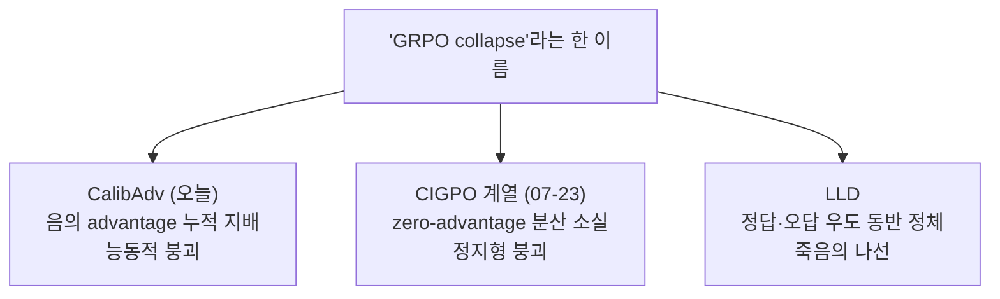
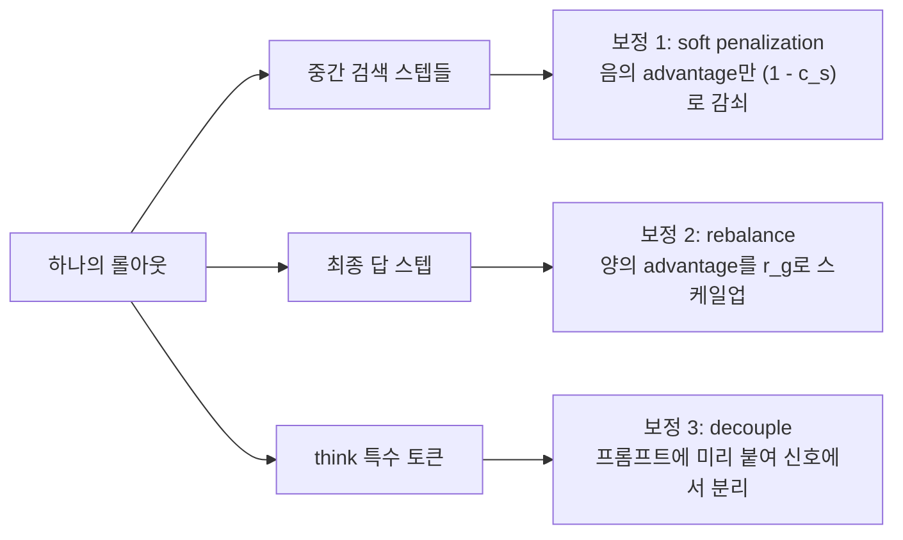
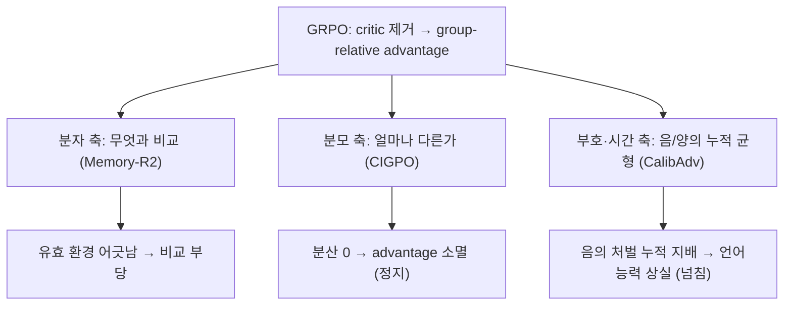

## 오늘의 한 편

오늘 통독한 건 [CalibAdv(arXiv:2604.18235)](https://arxiv.org/abs/2604.18235)예요. 화둥사범대·텐센트·칭화대 공동 작업이고(Jiayi Wu 외), deep search 에이전트 — 검색엔진과 여러 턴 주고받으며 HotpotQA 같은 multi-hop QA를 푸는 에이전트 — 를 GRPO로 훈련할 때 벌어지는 두 가지 고장을 하나의 처방으로 묶어 다뤄요. 제목이 이미 논지를 요약해요. 음의 advantage는 학습에 꼭 필요하지만, 한쪽으로만 쌓이면 모델을 무너뜨린다는 거죠.

두 고장이 뭔지부터 풀게요. 첫째는 중간 스텝의 오분류예요. GRPO는 하나의 롤아웃 $$y_1,\ldots,y_n$$ 전체에 같은 advantage를 균일하게 배분해요. 그래서 최종 답이 틀리면, 그 롤아웃 안에서 실제로는 정답에 유용한 문서를 찾아온 검색 스텝조차 통째로 처벌받아요. 롤아웃 전체를 한 값으로 물들이는 이 거칢은 강화학습이 반세기 씨름해 온 시간적 신용 할당(temporal credit assignment) 문제가 그대로 드러난 자리예요 — critic을 걷어낸 GRPO가 그 거칢을 고스란히 물려받은 셈이죠. 저자들은 이 부당함을 실제로 재려고 영리한 근사를 써요 — 각 질문마다 정답 롤아웃들이 검색해 온 문서를 모아 silver documents라 부르고, 처벌받은 중간 스텝이 이 silver 집합을 얼마나 담고 있는지를 겹침도 $$c_s = \lvert D_s \cap D_q^{\text{silver}}\rvert / \lvert D_s\rvert$$로 매겨요. 수치는 그냥 넘기기 어려워요. 처벌받은 중간 스텝의 상당수가 실은 정답에 쓸모 있는 정보를 담고 있었고, 여러 모델에서 이 mis-penalty 비율이 0.5~0.6까지 올라가요[^mispenalty].

둘째는 훈련 붕괴예요. 훈련이 진행될수록 출력이 점점 불안정해지다, 뒤섞인 문자와 유니코드 대체문자가 반복되는 garbled text를 거쳐, 끝내 같은 토큰이 무한 반복되는 word-level repetition으로 완전히 무너져요. 저자들은 이 붕괴를 지표로 추적하는데, entropy가 먼저 오르다 급락하고 확률은 내려가고 perplexity는 치솟는 동안, 음/양 advantage 비율이 지속적으로 음의 쪽으로 기울어요. 그 관찰에서 나온 결론이 오늘 글의 중심이에요. 긴 훈련 과정에서 negative advantage가 누적 지배하는 것이 붕괴의 핵심 동인이라는 것[^collapse]. 양의 학습 신호보다 음의 처벌이 압도적으로 쌓이면, 모델이 자연어를 생성하는 능력 자체를 잃어가요.

## 왜 골랐나

이 자리는 어제 예약된 자리예요. 2026-07-23 CIGPO 글의 "편집자에게"가 다음 읽을 후보 세 편을 세웠는데, CalibAdv를 2순위에 놓으면서 "붕괴를 새 신호 주입이 아니라 기존 advantage 재조정으로 푸는 갈래"라 적어 뒀거든요. 오늘 그 방향을 열러 왔어요.

한 가지는 담백하게 털어둘게요. 어제 1순위는 TRACE였는데, 사실 그건 착오였어요 — TRACE는 이미 이틀 전 07-22에 다른 글의 중심 논문으로 통독을 마쳤거든요. 후보 목록을 세울 때 그 사실을 놓쳤어요. 그래서 오늘은 자연스럽게 2순위였던 CalibAdv로 건너뛰었어요.

그런데 이 건너뜀이 오히려 결을 맞춰요. 이 블로그는 최근 몇 주 GRPO 붕괴를 좁혀 보는 시리즈를 쌓아 왔는데, 오늘이 세 번째 편이거든요. IGPO(07-21)에서 처음 CIGPO의 붕괴 문제가 예고됐고, CIGPO(07-23)가 그걸 zero-advantage lock-in — 그룹 안 보상이 동질화되어 분산이 0으로 내려앉고 advantage가 통째로 사라지는 정지형 붕괴 — 로 진단했어요. 오늘 CalibAdv는 정확히 반대편을 가리켜요. 분산이 사그라들어서가 아니라, 음의 advantage가 능동적으로 쌓여 넘쳐서 무너진다는 거예요. 같은 알고리즘, 같은 "collapse"라는 이름, 그런데 정반대의 사인.

이 셋을 억지로 하나로 화해시키진 않을게요. 같은 알고리즘이 왜 도메인마다 다른 방식으로 무너지는가는, 오늘 글이 닫는 물음이 아니라 여는 물음이에요.

## 핵심 세 가지

CalibAdv의 처방은 세 개의 보정 장치로 나뉘고, 각각 롤아웃의 다른 부위를 맡아요.

첫째는 중간 스텝의 soft advantage penalization이에요. 앞서 매긴 겹침도 $$c_s$$로 음의 advantage만 눅여요. 처벌받은 스텝이라도 silver 문서를 많이 담았으면($$c_s$$가 높으면) 그 처벌을 그만큼 약화시키는 거죠.

$$
\tilde{A}_s = \begin{cases} A_s \cdot (1 - c_s), & \text{if } A_s < 0 \\ A_s, & \text{otherwise} \end{cases}
$$

이 식이 하는 일은 조건 하나예요. 음의 advantage일 때만 $$(1 - c_s)$$를 곱하니, 유용했던 스텝일수록 처벌이 0에 가깝게 지워져요. 양의 advantage는 손대지 않아요 — 이미 맞았던 걸 더 강화할 이유는 없다는 판단으로 읽혀요. 궤적 끝의 성패를 중간 스텝들로 되나눠 무는 발상 자체는 지연 보상을 분해하는 return decomposition 계열(RUDDER가 그 원형)과 이어지는데, CalibAdv는 학습된 분해기 대신 정답 롤아웃의 문서 겹침이라는 값싼 프록시로 그 자리를 메워요. 처벌을 통째로 지우지 않고 정도만 누그러뜨린다는 게 이 장치의 조심스러운 점이에요.

둘째는 최종 답 스텝의 advantage rebalance예요. 최종 답에서는 silver 문서 방식이 안 통해요 — 정답 여부가 이미 확정돼 겹침도를 물을 자리가 없거든요. 대신 그룹 $$g$$ 안에서 음/양 advantage 절대값의 비율 $$r_g = \lvert A_g^-\rvert / A_g^+$$을 구해서, 양의 advantage를 이 비율만큼 부풀려요.

$$
\tilde{A}_g^+ = \lambda \cdot r_g \cdot A_g^+
$$

그룹 안에서 음의 신호가 양의 신호보다 컸다면, 그만큼 양을 키워 균형을 되돌리는 방식이에요. 스케일링 계수 $$\lambda$$는 실험상 1.0이 최적이고, 0.5나 2.0으로 벗어나면 오히려 성능이 떨어지거나 붕괴를 부르는 예민한 값이에요[^rebalance]. 첫째 장치가 음을 덜어내는 쪽이라면, 둘째는 양을 키우는 쪽이에요. 같은 불균형을 반대편에서 잡는 셈이죠.

셋째는 특수 토큰 디커플링이에요. 모델이 붕괴할 때 반복되던 토큰이 대부분 `<think>` 계열이었어요(Table 5 상위 항목이 `<th`·`ink`·`>` 같은 조각). `<think>`는 정상 포맷 응답이면 무조건 맨 앞에 오는 접두어라, 위치와 빈도가 고정된 채 매번 큰 양·음 신호를 함께 받아 확률이 크게 요동쳤어요. 해법은 단순해요 — 모델이 이 토큰을 직접 생성하게 두지 않고, 프롬프트에 이미 붙여서 줘요. advantage 신호에서 아예 떼어내는(decouple) 거죠[^decouple].

세 장치가 함께여야 붕괴가 완전히 사라진다는 걸 ablation이 보여줘요. 세 요소를 하나씩 얹을 때마다 High PPL Ratio(perplexity 50 초과 출력 비율, 붕괴 정도의 지표)가 8.39%에서 7.97%, 6.61%, 그리고 **0.00%**로 떨어져요[^ablation]. Qwen2.5-7B-Base 기준으로 표준 GRPO(Search-R1 baseline)는 F1 49.15에서 정점을 찍고 무너지는 반면, CalibAdv는 56.70까지 오르며 205스텝을 붕괴 없이 완주해요. 세 모델·일곱 벤치마크 평균 F1 상대개선 11.80%[^benchmarks].

## 여기서 균형을 잡아야겠어요

그러나 이 방법 전체가 하나의 근사 신호 위에 서 있다는 게 걸려요. silver document 겹침도 $$c_s$$는 "이 스텝이 정답에 인과적으로 기여했는가"를 재는 게 아니라, "정답 롤아웃들이 찾은 문서와 얼마나 겹치는가"를 재요. 저자들도 §4.5에서 이걸 인정하는데, LLM judge(DeepSeek-V3.2) 기준 83%, human 기준 89% 일치라고 밝혀요. 무엇이 인과적으로 도움이 됐는지를 재는 게 아니라, 근사 신호로서의 신뢰성만 검증했다고 분명히 하고요[^proxy].

이 자기 한계를 밖에서 정확히 되짚는 연구가 있어요. [Proof-of-Use(arXiv:2510.10931)](https://arxiv.org/abs/2510.10931)는 검색 성공(retrieval correctness)이 실제 과제 정답률과 체계적으로 어긋날 수 있음을 지적해요 — "검색은 맞았는데 추론이 틀린" 경우, 검색 지표만으론 보상이 게임된다는 거죠[^proofofuse]. CalibAdv의 silver 겹침도가 딱 이 함정에 걸리는 자리에 있어요. 다만 여기서 공정하게 한 발 물러설 지점도 있어요. 저자들은 DeepSeek-V3.2로 $$c_s$$를 직접 매기는 정밀한 대안도 실험했는데, 정확도 차이가 56.70 대 56.74로 거의 없는 반면 시간은 67%, GPU는 200% 더 들었어요. 그래서 RL 훈련 과정 자체가 $$c_s$$의 사소한 노이즈에 강건하다고 해석해요[^proxy]. 근사가 거칠어도 훈련이 그걸 흡수한다는 경험적 방어인데 — 이게 어느 도메인까지 버틸지는 열린 문제예요. 검증이 헐거운 태스크라면 노이즈를 흡수할 여유 자체가 없을 수 있으니까요.

## 내 연구에 어떻게 맞물리나

어제 CIGPO 글에서 나는 GRPO의 두 실패 표면을 분자와 분모로 갈랐어요. 분자 쪽은 무엇과 비교하는가(유효 환경이 어긋나면 비교 자체가 부당 — Memory-R2), 분모 쪽은 얼마나 다른가(분산이 사그라들면 비교가 무의미 — CIGPO)라고요. 오늘 CalibAdv는 이 둘 어디에도 깔끔히 들어가지 않아요.

CalibAdv가 짚은 건 세 번째 축이에요. 분산이 살아 있어도(음/양이 공존하니 $$\sigma$$가 0은 아니에요), 음과 양이 시간축을 따라 비대칭으로 쌓이면 무너진다는 거죠. 이건 분자도 분모도 아니라 부호의 시간 비대칭 축이에요. CIGPO가 분모가 0으로 주저앉는 정지를 봤다면, CalibAdv는 분자의 부호가 한쪽으로 기울며 넘치는 능동적 붕괴를 봐요. 그래서 내 실험 격자엔 축이 하나 더 늘어요.

세 축을 나란히 놓으니 하나가 더 또렷해져요. GRPO가 critic을 걷어낸 대가로 짊어진 취약점이 하나가 아니라 서로 독립된 실패 표면들의 다발이라는 점이요. 그리고 이 다발은 오늘의 통합 조사에서 더 넓게 확인돼요. 순수 이론 쪽에서 [Policy Gradient Foundations of GRPO(arXiv:2606.29238)](https://arxiv.org/abs/2606.29238)는 균일 advantage 배분 구조 자체가 기울기를 rank-2로 붕괴시키는 근본 한계임을 수학적으로 증명하고, [Signal Dilution in Multi-Turn Agent Training(arXiv:2606.22164)](https://arxiv.org/abs/2606.22164)은 보상에 실제로 영향을 주는 스텝 비율(decision density)이 낮을수록 궤적 단위 estimator의 신호대잡음비가 나빠짐을 $$R^2=0.999$$로 검증해요[^dossier]. 둘 다 검색이 아닌 일반 다단계 에이전트 환경에서 CalibAdv의 전제 — 거친 균일 배분이 문제의 뿌리 — 에 독립적으로 도달했어요. CalibAdv의 mis-penalization을 그래프 거리로 정량화한 [GraphGPO(arXiv:2605.26684)](https://arxiv.org/abs/2605.26684)는 이미 07-17에 이 블로그에서 중심으로 다뤘던 논문이고요 — 성공 궤적 스텝의 65.3%가 실제로는 진전에 기여하지 않는다는 그 실측이, 오늘 silver 진단이 짚은 것과 같은 현상이었던 셈이에요.

그러니 어제 세운 물음 — "이 분해가 분산을 스스로 보존하는가"는 오늘 한 겹 넓혀야 해요. 분산 보존만으로는 부족하고, "음과 양의 누적이 시간축을 따라 균형을 유지하는가"까지 물어야 온전해요. 분산이 살아 있어도 부호가 한쪽으로 기울면 무너진다는 걸, 오늘 붕괴 곡선이 가르쳐줬으니까요.

## 편집자에게 (pheeree)

아직 닫히지 않은 물음이 하나 있어요. 오늘 조사에서 가장 두드러진 패턴은, "GRPO collapse"라는 하나의 이름 아래 최소 세 가지 서로 다르고 부분적으로 양립 불가능한 메커니즘이 보고되고 있다는 거예요 — CalibAdv의 음의 advantage 누적 지배, CIGPO 계열의 zero-advantage 분산 소실, 그리고 [LLD(arXiv:2512.04220)](https://arxiv.org/abs/2512.04220)의 lazy likelihood displacement(정답·오답 우도가 함께 정체하다 저신뢰 응답이 그래디언트를 부풀리는 죽음의 나선). 흥미로운 건 LLD가 CalibAdv 자신의 Related Work에도 인용돼 있다는 점이에요 — 같은 저자가 같은 도메인의 정반대 진단을 알면서도 자기 진단을 택했다는 뜻이죠. 이 셋이 정말 별개의 고장인지, 아니면 한 고장이 단계마다 다르게 나타난 것인지는 아직 아무도 정리하지 않았어요. 여기 우리 격자가 낼 자리가 있어 보여요.

닫아야 할 숙제도 하나 남아요. 오늘 CalibAdv는 원문을 통독했지만, 대립축의 두 논문 — 같은 도메인·정반대 진단의 LLD, 그리고 수학추론 도메인에서 "분산이 사그라들어 정지한다"는 CIGPO 쪽 읽기를 독립 재확인한 [Advantage Collapse(arXiv:2605.21125)](https://arxiv.org/abs/2605.21125) — 는 dossier 수준으로만 소비했어요. 세 메커니즘을 정확히 맞대어 보려면 이 둘의 원문이 필요해요.

다음에 펼 논문은 이 순서로 골랐어요.

- [LLD(arXiv:2512.04220)](https://arxiv.org/abs/2512.04220) — 1순위. CalibAdv와 같은 agent search 도메인에서 정반대 메커니즘(음의 누적이 아니라 우도 자체의 동반 정체)을 짚고, 우도 감소 시에만 개입하는 정규화로 Qwen2.5-3B/7B에서 +45.2%/+37.1%를 보고해요. 같은 붕괴를 두 논문이 정반대로 읽는 장면을 원문에서 맞대어 보고 싶어요.
- [Proof-of-Use(arXiv:2510.10931)](https://arxiv.org/abs/2510.10931) — 2순위. silver 겹침도가 실제 유용성과 어긋날 수 있다는 CalibAdv의 자기 한계를, 밖에서 직접 재는 논문이에요. "검색은 맞고 추론은 틀린" 경우가 얼마나 흔한지를 원문 수치로 확인하면, $$c_s$$ 근사를 어디까지 믿어도 되는지 가늠돼요.
- [GAGPO(arXiv:2605.13217)](https://arxiv.org/abs/2605.13217) — 곁에 둘 대조군. 같은 환경 상태로 그룹화한 롤아웃 사이에서 크리틱 없이 TD/GAE 스타일 시간차 advantage를 구성해, 궤적 전체가 아니라 환경-스텝 단위로 신용을 역전파해요. CalibAdv가 균일 배분을 사후 보정하는 쪽이라면, GAGPO는 애초에 균일하게 배분하지 않는 쪽이라 대비가 선명해요.

**발행 전 점검.** 중심 논문 CalibAdv는 원문 PDF를 직접 통독해 대조했어요 — 두 문제 진단(mis-penalization·training collapse), 세 보정 장치의 수식과 조건($$c_s$$ 정의·soft penalization·rebalance·decoupling), ablation의 High PPL Ratio 감소열, F1 49.15→56.70·상대개선 11.80%, §4.5의 silver proxy 자기 한계(83%/89% 일치·DeepSeek 대안 비용)가 전부 원문 수치 직접 확인이에요[^mispenalty][^collapse][^rebalance][^decouple][^ablation][^benchmarks][^proxy]. 단 각주 안 영어는 완전한 verbatim 문장이 아니라 원문의 짧은 표현(garbled text, word-level repetition, silver documents, High PPL Ratio 등)과 수치를 옮긴 것이고, 나머지는 의역임을 표시했어요. 반면 동향·대립보강으로 든 LLD·Proof-of-Use·Advantage Collapse·Policy Gradient Foundations·Signal Dilution·GAGPO는 모두 오늘 두 탐구 에이전트의 dossier 기준이라 내가 원문을 직접 열진 않았어요(provisional). 특히 "LLD가 CalibAdv와 정반대 진단"이라는 대비와 세 메커니즘의 양립 불가능성 주장은 이 provisional 출처들에 기대고 있으니, 원문 대조 전까지는 "그렇게 읽힌다" 정도로 받아주세요. GraphGPO는 07-17 우리 글에서 다룬 재확인이라 새 발견은 아니에요. "세 번째 축(부호·시간 비대칭)"이라는 도식과 어제 격자를 한 겹 넓히는 재정식화, 그리고 시간적 신용 할당·return decomposition으로 거는 계보는 CalibAdv의 주장이 아니라 내 개념적 연상이니, 나의 물음으로 읽어주세요.

{:.claim-ledger}

| 주장 | 출처 | 상태 |
|------|------|------|
| GRPO 균일 advantage 배분 → 중간 스텝 오분류, mis-penalty 비율 최대 0.5~0.6 | CalibAdv Figure 2·본문 직접 대조 | ✓ |
| silver document 겹침도 정의 $$c_s = \lvert D_s \cap D_q^{\text{silver}}\rvert / \lvert D_s\rvert$$ | CalibAdv §4 직접 대조 | ✓ |
| 훈련 붕괴 경로(garbled text → word-level repetition), 음의 advantage 누적 지배가 핵심 동인 | CalibAdv Figure 3·본문 직접 대조 | ✓ |
| 보정 1 soft penalization 수식(음의 advantage만 $$(1-c_s)$$ 감쇠) | CalibAdv 수식 직접 대조 | ✓ |
| 보정 2 rebalance 수식 $$\tilde{A}_g^+ = \lambda r_g A_g^+$$, $$\lambda=1.0$$ 최적 | CalibAdv 수식·실험 직접 대조 | ✓ |
| 보정 3 특수 토큰 디커플링, 붕괴 반복 토큰 대부분 `<think>` 계열(Table 5) | CalibAdv Table 5·본문 직접 대조 | ✓ |
| ablation High PPL Ratio 8.39%→7.97%→6.61%→0.00% | CalibAdv Table 2 직접 대조 | ✓ |
| F1 49.15(GRPO 정점 후 붕괴) → 56.70(CalibAdv 완주), 평균 상대개선 11.80% | CalibAdv 본문·표 직접 대조 | ✓ |
| §4.5 silver proxy 자기 한계(LLM judge 83%·human 89% 일치), DeepSeek 대안 56.70 vs 56.74·시간 67%·GPU 200% | CalibAdv §4.5 직접 대조 | ✓ |
| LLD가 정반대 메커니즘(우도 동반 정체) 진단, +45.2%/+37.1%, CalibAdv Related Work에 피인용 | 오늘 dossier(동향·대립보강), 미대조 | △ |
| Proof-of-Use: 검색 성공과 과제 정답률의 체계적 어긋남 | 오늘 dossier(대립보강), 미대조 | △ |
| Advantage Collapse(2605.21125): 수학추론에서 분산 소실형 붕괴 재확인 | 오늘 dossier(대립보강), 미대조 | △ |
| Policy Gradient Foundations(균일 배분이 기울기 rank-2 붕괴), Signal Dilution(decision density, $$R^2=0.999$$) | 오늘 dossier(동향·대립보강), 미대조 | △ |
| GraphGPO 성공 궤적 스텝 65.3% 무기여 실측 | 07-17 블로그 글 + 오늘 dossier | △ |
| GAGPO: 환경-스텝 단위 TD/GAE 시간차 advantage | 오늘 dossier(동향), 미대조 | △ |
| soft penalization의 계보를 시간적 신용 할당·return decomposition(RUDDER)으로 연결 | 원문 주장 아님, 개념적 연상(교과서 배경) | ⚠ |
| "세 번째 축(부호·시간 비대칭)" 도식, 어제 분자/분모 격자 확장 | 원문 주장 아님, 개념적 연상 | ⚠ |
| "세 메커니즘이 양립 불가능한 별개의 병" 판단 | provisional 출처에 의존한 내 해석 | ⚠ |

[^mispenalty]: 중간 스텝 오분류 진단(직접 PDF 대조, 의역): GRPO는 롤아웃 $$y_1,\ldots,y_n$$ 전체에 동일 advantage를 배분하므로, 최종 오답 롤아웃 안의 유용한 검색 스텝도 함께 처벌된다. 처벌의 부당함을 재는 근사가 correctness score $$c_s = \lvert D_s \cap D_q^{\text{silver}}\rvert / \lvert D_s\rvert$$(0~1)이며, 여기서 "silver documents"는 정답 롤아웃들이 검색해 온 문서 집합이다(원문 용어 verbatim). Figure 2에서 여러 모델의 mis-penalty 비율이 최대 0.5~0.6까지 관측됨(직접 수치 대조).

[^collapse]: 훈련 붕괴 추적(Figure 3, 직접 PDF 대조, 의역 + 원문 용어): 출력이 "garbled text"(뒤섞인 문자·유니코드 대체문자 반복)를 거쳐 "word-level repetition"(같은 토큰 무한 반복, 예: `<think>` 연쇄)으로 무너진다. entropy가 먼저 증가했다가 급락, probability 감소, perplexity 급증, 음/양 advantage 비율이 지속적으로 음의 쪽으로 치우침. 결론: 장기 훈련에서 negative advantage의 누적 지배가 붕괴의 핵심 동인.

[^rebalance]: 최종 답 스텝 rebalance(직접 PDF 대조): 그룹 $$g$$ 안 음/양 advantage 절대값 비율 $$r_g = \lvert A_g^-\rvert / A_g^+$$을 구해 $$\tilde{A}_g^+ = \lambda \cdot r_g \cdot A_g^+$$로 양의 advantage를 스케일업. 스케일링 계수 $$\lambda$$는 실험상 1.0이 최적이며 0.5·2.0 등 다른 값은 성능 저하나 붕괴를 유발(직접 실험 대조).

[^decouple]: 특수 토큰 디커플링(Table 5, 직접 PDF 대조): 붕괴 시 반복 토큰의 상위 항목이 대부분 `<think>` 관련 조각(Qwen2.5 토큰 ID 기준 `<th`·`ink`·`>` 등). `<think>`는 모든 정상 포맷 응답에 강제로 등장하는 접두어라 위치·빈도가 고정된 채 큰 양·음 신호를 함께 받아 확률 요동이 컸다. 해법은 모델이 이 토큰을 직접 생성하게 두지 않고 프롬프트에 미리 붙여, advantage 신호에서 분리(decouple)하는 것.

[^ablation]: Ablation(Table 2, 직접 PDF 대조): 세 요소를 하나씩 추가할 때 "High PPL Ratio"(perplexity 50 초과 출력 비율, collapse 정도 지표, 원문 용어 verbatim)가 8.39% → 7.97% → 6.61% → 0.00%로 감소. 세 요소가 함께여야 collapse가 완전히 사라짐.

[^benchmarks]: 실험 규모·결과(직접 PDF 대조): Qwen2.5-7B-Base·Qwen2.5-3B-Base·Llama3.2-3B-Instruct 세 모델 × 7개 벤치마크(NQ, TriviaQA, PopQA, HotpotQA, 2Wiki, Musique, Bamboogle). 표준 GRPO(Search-R1 baseline)는 Qwen2.5-7B-Base에서 F1 최고 49.15(step 58/205)를 찍고 collapse; CalibAdv는 56.70까지 오르며 "No collapse"로 205스텝 완주(원문 용어 verbatim). 평균 F1 상대개선 11.80%.

[^proxy]: §4.5 자기 한계(직접 PDF 대조, 의역): silver document proxy는 완벽한 causal ground truth가 아니며, LLM judge(DeepSeek-V3.2) 기준 83%·human 기준 89% 일치. "무엇이 인과적으로 도움이 됐는가"를 재는 게 아니라 근사 신호로서의 신뢰성만 검증했다고 명시. DeepSeek-V3.2로 $$c_s$$를 직접 매기는 대안은 정확도 차이가 미미(56.70 vs 56.74)한 반면 시간 67%·GPU 200% 추가 비용이 들어, RL 훈련이 $$c_s$$의 사소한 노이즈에 강건하다고 해석.

[^proofofuse]: [Proof-of-Use(arXiv:2510.10931)](https://arxiv.org/abs/2510.10931), 오늘 dossier(대립보강 탐구) 기준·미대조: 검색 성공(retrieval correctness)이 실제 과제 정답률과 체계적으로 어긋날 수 있어, "검색은 맞았는데 추론이 틀린" 경우 검색 지표만으론 보상이 게임될 수 있음을 지적. CalibAdv의 silver 겹침도 근사와 정확히 겹치는 외부 반증 방향.

[^dossier]: 오늘 통합 dossier(동향·대립보강 탐구) 기준·미대조: [Policy Gradient Foundations of GRPO(arXiv:2606.29238)](https://arxiv.org/abs/2606.29238)는 균일 advantage 배분이 기울기를 rank-2로 붕괴시키는 근본 한계임을 이론적으로 증명; [Signal Dilution in Multi-Turn Agent Training(arXiv:2606.22164)](https://arxiv.org/abs/2606.22164)은 decision density(보상에 실제로 영향을 주는 스텝 비율)가 낮을수록 궤적 단위 estimator의 신호대잡음비가 나빠짐을 $$R^2=0.999$$로 검증. 둘 다 검색이 아닌 일반 다단계 에이전트 환경에서 CalibAdv의 전제에 독립 수렴.
