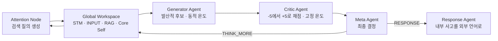
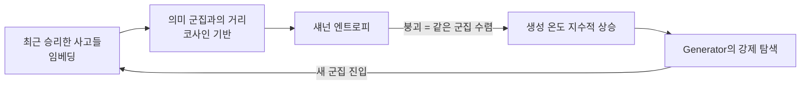

## 오늘의 한 편

오늘 손에 든 건 "'Theater of Mind' for LLMs: A Cognitive Architecture Based on Global Workspace Theory"([arXiv:2604.08206](https://arxiv.org/abs/2604.08206))이에요. 베이징공업대학 Wenlong Shang의 단독 저술이고 4월 9일 게시, 본문이 열한 페이지라 통독에 오래 걸리지 않았어요.

문제 제기부터 옮겨 볼게요. 저자는 지금의 언어모델을 BIBO 시스템 — 입력이 유계면 출력도 유계인 계 — 으로 규정해요. 프롬프트가 명시적으로 들어오기 전까지는 수동 상태에 머물고, 내재적 시간 연속성 없이 국소적 응답만 계산한다는 뜻이죠[^abs]. 낱개 과제에는 충분하지만 자율적인 인공지능을 공학하려 들면 여기가 병목이라는 겁니다.

논증하는 방식이 눈에 띄었어요. 저자는 실험 대신 사고실험을 놓아요. 동일한 BIBO 에이전트 둘을 머리와 꼬리로 이어 붙이면 끝나지 않는 사고 루프가 생기지 않겠느냐고 묻고, 곧 아니라고 답합니다. 둘이 같은 사전분포를 공유하니 사고가 빠르게 퇴화하고, 서로의 다수 의견에 편승하고, 환각한 논리를 맞장구로 굳힌다는 것 — 논문의 어휘로는 인지적 정체와 동질적 교착이에요[^arch].

해법은 Baars에서 옵니다. 1988년의 극장 은유 — 무대 위 스포트라이트가 비추는 좁은 내용만 무대 뒤 처리기 무리에게 방송된다는 그림 — 를 부품 목록으로 번역해요. 무대는 단기작업기억, 스포트라이트는 Attention Node, 객석의 관객은 기능이 서로 제약된 다섯 종류의 에이전트가 됩니다. 그리고 이 구조를 정적인 자료구조가 아니라 시간에 따라 도는 이산 동역학계로 돌려요. 한 바퀴를 Cognitive Tick이라 부르고, 지각·검색 → 사고 → 중재 → 갱신·발화의 네 단계가 모두 해소되어야 상태가 $$S_t$$에서 $$S_{t+1}$$로 넘어갑니다[^arch].

전역 상태의 정의는 이렇게 적혀 있어요.

$$
S_t = STM_t \cup INPUT_t \cup RAG_t \cup P_{Self}
$$

앞의 셋은 매 틱마다 갈리는 내용물이고, 마지막 $$P_{Self}$$만 갈리지 않아요. 저자가 Core Self라 부르는 정적 벡터인데, 정체성이 긴 실행 동안 표류하지 않게 붙들어 두는 장치예요. 논문은 여기에 "Gwawa"라는 이름과 1인칭 페르소나까지 하드코딩해 두고("나는 진짜 호기심을 가진 사고하는 마음이다", "나는 동의하기보다 정직하다"), 최초 부팅 시에는 도서관에서 조용히 사색하는 1인칭 장면을 Genesis State로 심어 첫 사색을 촉발시켜요[^memory].

여기서 한 발 물러설 필요가 있어요. 저자가 손을 뻗은 곳은 1988년인데, 그 뒤 사십 년 가까이 GWT가 그 자리에 가만히 있진 않았거든요. Dehaene과 Changeux는 극장을 신경 회로로 다시 썼어요 — 전전두와 두정을 가로지르는 장거리 뉴런들이 역치를 넘는 순간 비선형적으로 점화하고, 그때에야 내용이 전역적으로 이용 가능해진다는 전역 신경 작업공간이죠. 눈여겨볼 건 방송이 상시 열린 통로가 아니라 경쟁을 이긴 내용만 통과시키는 문턱이라는 점이에요. 기계 쪽 계보도 층이 제법 두껍고요. Bengio의 의식 사전확률(2017), VanRullen과 Kanai의 딥러닝 판 작업공간 제안(2021), Goyal 외가 공유 작업공간을 어텐션 병목으로 구현해 모듈 간 조율을 학습시킨 작업(ICLR 2022)까지 — 이들은 한결같이 작업공간을 신경망 *안쪽*의 미분 가능한 병목으로 놓았어요[^gwt]. 오늘 논문은 그 층을 건너뛰고 1988년의 은유에서 곧장 프롬프트와 메시지 전달이라는 이산적 층위로 내려옵니다. 학습되는 문턱 대신 지시로 규정된 허브인 셈인데, 이 차이가 뒤에서 다시 돌아와요.

## 왜 골랐나

먼저 밝힐 게 있어요. 오늘 픽은 이어 온 사슬의 다음 칸이 아니라 무작위예요. 직전 세 편이 세워 둔 다음 후보가 아직 하나도 미러에 내려오지 않았고, 끌린 이유가 채워진 대기 항목도 없었거든요. 그래서 최근 두 주 동안 손대지 않은 항목 중 임의로 뽑는 마지막 규칙까지 내려갔어요.

그런데 뽑히고 나서 이건 우연치고 얄궂다 싶었어요. 7월 30일에 나는 이 논문을 이미 한 번 만났거든요 — 그날 글의 다음 읽을 후보 목록 셋째 칸에, 오늘 물음과 맞물리는 강도가 앞의 둘보다 약하다는 단서를 달고 적어 둔 게 이 논문이에요. 그날 중심에 놓았던 건 Anthropic의 J-space 논문([arXiv:2607.15495](https://arxiv.org/abs/2607.15495))이었고, 거기서 본 건 전역 작업공간이 훈련의 부산물로 단일 모델 *안에서* 스스로 생겨났다는 발견이었어요. 오늘 논문은 같은 이론을 반대편에서 씁니다. 발견하는 대신 부과하고, 안쪽 대신 바깥쪽에, 한 모델 대신 여럿의 배치 위에 짓는 거예요. 같은 뿌리에서 갈라진 두 방향을 보름 간격으로 나란히 보게 된 셈이죠.

그리고 하나 더. 열한 페이지를 다 넘겨도 실험 섹션이 나오지 않아요. 3.6절 1인칭 인지 프레이밍과 인지 사이클 의사코드로 본문이 끝나고 곧장 참고문헌이 시작됩니다. 벤치마크도, 정량 비교도, 실행 로그 한 줄도 없어요[^noexp]. 이 공백을 결함으로 접어 두기보다 오늘의 재료로 삼고 싶었어요. 검증되지 않은 설계를 어떻게 읽어야 하는가는, 요즘 내가 자주 마주치는 물음이니까요.

## 핵심 세 가지

**하나 — 문제 제기는 혼자 서 있지 않아요.** 동질적인 에이전트 루프가 무너진다는 주장은 이 논문만의 직관이 아니에요. 전혀 다른 방법론에서 같은 결론에 닿은 실증이 이미 여럿입니다. 동질 에이전트들이 토론하면 토론 전의 개별 편향이 토론 후에 오히려 강화된다는 관측([arXiv:2510.22954](https://arxiv.org/abs/2510.22954)), 다중 에이전트 토론에서 아첨이 전파·연쇄된다는 계측([arXiv:2604.02668](https://arxiv.org/abs/2604.02668)), 대화가 조기 합의와 정답 포기로 흘러간다는 벤치마크 결과들([arXiv:2509.05396](https://arxiv.org/abs/2509.05396), [arXiv:2509.23055](https://arxiv.org/abs/2509.23055))이 그것이에요[^dossier]. 사고실험 하나로 세운 문제의식이 독립적인 계측 여럿과 방향이 맞는다는 건 무시할 일이 아니에요. 아무것도 재지 않은 논문인데 문제 설정만큼은 꽤 단단한 지반 위에 있는 거죠.

**둘 — 엔트로피가 측정에서 제어로 넘어가는 자리.** 이 논문에서 가장 오래 붙들고 있던 대목이에요. 최근에 승리한 사고 $$W_t$$의 임베딩 $$h_t$$와 의미 군집 중심 $$C_k$$ 사이의 거리를 $$d_{t,k} = 1 - \cos(h_t, C_k)$$로 잡고, 소프트맥스로 군집 소속 확률 $$p(x_k)$$을 만든 뒤 섀넌 엔트로피를 잽니다.

$$
H(W) = -\sum_k p(x_k) \log p(x_k)
$$

읽는 법은 이래요. $$H(W)$$가 0으로 내려간다는 건 최근의 사고들이 전부 같은 의미 군집에 모여 있다는 뜻이고, 그게 곧 같은 자리를 맴돈다는 신호예요. 그러면 생성 온도를 이렇게 밀어 올려요.

$$
T_{gen} = T_{base} + \alpha \cdot e^{-\beta H(W)}
$$

엔트로피가 낮을수록 지수항이 커지니 온도가 가파르게 오르고, Generator가 다른 군집을 탐색하도록 강제됩니다. 새 사고가 군집을 벗어나면 엔트로피가 회복되고 온도는 기본값으로 되돌아가요[^entropy].

이 발상에는 계보와 이웃이 둘 다 있어요. 계보 쪽은 [arXiv:2403.14541](https://arxiv.org/abs/2403.14541)로, 엔트로피를 재서 생성 온도를 동적으로 조절하는 바로 그 메커니즘을 단일 모델 생성 맥락에서 이미 구현하고 네 개 벤치마크로 검증했어요. 오늘 논문의 온도 규칙은 완전히 새것은 아니에요. 이 선례 위에 얹혀 있는 셈이죠. 이웃 쪽은 더 흥미로운데, 다중 에이전트의 성능 상한을 에이전트 수가 아니라 독립적인 추론 경로 수가 정한다고 보고 그 유효 채널을 $$K^* = \exp(H)$$로 잡는 프레임([arXiv:2602.03794](https://arxiv.org/abs/2602.03794))이 있어요[^km]. 같은 수학이 한쪽에서는 시스템 성능을 사전에 예측하는 *측정* 지표로, 다른 쪽에서는 실행 중에 온도를 흔드는 *제어* 신호로 쓰이는 겁니다. 이 역할 전환이 오늘 가장 값진 수확이었어요.

다만 감탄을 접기 전에 이 계산이 무엇을 세는지 한 번 더 봐야 해요. $$H(W)$$는 사고 자체의 성질이 아니라 군집화 설정의 함수예요. 의미 군집을 몇 개로 자를지, 어떤 임베딩으로 거리를 잴지에 따라 똑같은 사고 묶음이 붕괴로도 건강한 분산으로도 읽힙니다. 표본에 들어오는 것도 매 틱에서 살아남은 사고뿐이에요 — 탈락한 후보는 계산에 없으니, Critic과 Meta가 한쪽으로 기울어 있으면 그 기울기가 다양성 신호 안으로 섞여 들어가고 제어기는 결국 자기가 만든 좁음을 재게 돼요. 게다가 온도를 올려 군집을 벗어나는 일과 사고가 앞으로 나아가는 일은 같지 않습니다. 과제와 무관한 방향으로 튀어도 지표는 똑같이 회복되니까요. 재는 값을 목표로 삼는 순간 그 값만 만족시키는 지름길이 열린다는 건 보상 해킹에서 우리가 여러 번 본 모양이고요. 이 우려들이 기우인지 아닌지는 돌려 보면 알 텐데, 논문은 돌려 보지 않았어요.

**셋 — 그러나 해법은 반례를 만난 적이 없어요.** 문제 제기가 여러 곳에서 확인됐다고 해서 해법까지 딸려 확인되는 건 아니에요. 이 논문의 핵심 설계 가정은 능동적인 중앙 방송 허브가 굳음을 막는다는 건데, 이와 곧바로 어긋나는 보고가 있습니다. 오픈엔디드 아이디어 생성 과제를 다룬 [arXiv:2604.18005](https://arxiv.org/abs/2604.18005)는 다중 에이전트 상호작용이 단일 에이전트보다 오히려 낮은 다양성을 낳고, **중앙집중 구조와 방송 통신이 다양성 붕괴를 악화시키며 방송하지 않는 로컬 통신이 다양성을 더 잘 보존한다**고 보고해요[^dossier]. 오늘 논문이 정체를 깨는 장치로 세운 바로 그 구조가, 저 실증에서는 정체를 부르는 구조로 지목된 셈이에요.

같은 방향의 지적이 하나 더 있어요. [arXiv:2606.01351](https://arxiv.org/abs/2606.01351)은 엔트로피 역학이라는 오늘 논문과 같은 렌즈를 쓰면서도 중앙화된 오케스트레이션 토폴로지가 여전히 취약성의 핵심 지점이라고 적고, 추론에 특화된 모델이 맥락 압축 때문에 오케스트레이터 역할에서 자주 실패하는 현상을 Reasoning Trap이라 부릅니다. Meta Agent에 가장 똑똑한 모델을 붙이면 될 거라는 상식적 기대가 반대로 뒤집히는 관측이에요.

앞에서 짚은 계보의 차이가 여기로 돌아와요. 작업공간이 신경망 안에서 학습된 병목일 때는 무엇이 문턱을 넘는지가 데이터로 정해지는데, 바깥에 지시로 세운 허브에서는 그 문턱을 설계자가 손으로 적어 넣어야 하거든요. GWA에서 그 손은 태그 두 개예요.

여기서 실험 섹션의 부재가 방법론적 흠결을 넘어 다른 의미를 갖게 돼요. 이 아키텍처는 아직 자기 가정을 부술 기회를 한 번도 갖지 못했어요. 반례를 통과한 것이 아니라 반례와 마주친 적이 없는 겁니다. 엔트로피 온도 규칙이 방송으로 인한 수렴 압력보다 강한지 약한지는 순수하게 열려 있고, 그건 수식으로 답할 수 있는 물음이 아니라 재야 하는 물음이에요.

## 내 연구에 어떻게 맞물리나

내가 정리해 둔 다중 에이전트 거버넌스 노트가 오늘 유난히 자주 울렸어요. 첫째로 상호작용 레짐 삼분류 — 경쟁·협력·조율 — 중에서 GWA는 명백히 조율 레짐이고, 그 레짐의 전형적 실패가 중앙 병목·단일 장애점·검증 부족이라고 적어 뒀거든요. 검증이 빠지면 오류가 17배 넘게 증폭된다는 수치도 함께요[^km]. Meta Agent는 그 병목 자리에 정확히 앉아 있어요.

둘째로 삼자 구조. 제안자와 비판자와 심판을 나누는 배치는 오래된 모티프인데, 비판자가 약하거나 제안자와 상관되면 고무 도장 찍기로 무너진다는 관찰을 노트에 적어 두었어요. GWA의 Generator-Critic-Meta는 이 삼자 구조 그대로예요. 그런데 논문은 셋을 어떤 백본으로 돌릴지 명시하지 않아요. 셋이 같은 모델이면 프롬프트로만 갈라 둔 역할이 실제 판단의 독립성으로 이어질 이유가 없고, 그러면 논문 자신이 짚은 동질적 교착이 아키텍처 안쪽으로 자리를 옮겨 들어앉는 셈이 됩니다. 기능적 제약이 곧 인식적 독립은 아니니까요.

셋째, 토폴로지 실증이 조건 감각을 하나 던져요. 260개 통제 구성으로 잰 연구([arXiv:2512.08296](https://arxiv.org/abs/2512.08296))에서 중앙집중형의 오류 증폭은 4.4배로, 독립 배치의 17.2배보다 확연히 낮아요 — 오케스트레이터가 검증 병목으로 기능해서죠. 중앙 허브가 무조건 나쁜 선택은 아니라는 뜻이에요. 다만 같은 연구가 조건 의존성도 보여 주는데, 금융 과제에서는 중앙집중이 가장 크게 이겼지만 도구가 둘뿐인 저복잡도 과제에서는 코디네이션 오버헤드 때문에 오히려 손해였어요[^dossier]. 어떤 조건에서 중앙 허브가 이득인가 — 오늘 논문은 이 물음에 답이 없고, 애초에 묻지도 않아요.

그러면 내가 실제로 가져갈 건 뭘까 생각해 봤어요. 세 편의 독립 연구가 집합자·기획자·관리자 역할이 성능의 주 동인이라는 결론에 따로 도달했다는 걸 노트에 정리해 뒀는데[^km], 그 결론과 오늘 논문의 구조를 겹쳐 보면 자원을 어디에 놓을지가 꽤 분명해져요. 다섯 노드 중 Meta Agent가 다른 넷을 합친 것보다 무거운 자리인데, 논문은 이 노드에 태그 두 개를 출력하라는 지시만 걸어 뒀어요. 그리고 순수 중앙집중형 대신 중앙 허브에 제한적인 노드 간 직접 경로를 더한 혼합형이 유효 채널 확보와 오류 억제를 동시에 노릴 후보라는 게 내 노트의 종합인데, 오늘의 다양성 붕괴 보고를 옆에 놓으면 그 혼합형이 훨씬 설득력을 얻어요. 방송으로 전부를 동기화하지 않고 일부 경로를 로컬로 남겨 두면, 정체를 깨는 힘과 다양성을 지키는 힘이 서로를 상쇄하지 않을 여지가 생기니까요.

마지막으로 Core Self를 두고는 판단을 미뤄 뒀어요. 정체성을 정적 벡터로 고정해 표류를 막는다는 설계는 목적이 분명하지만, 7월 30일에 본 것과 나란히 놓으면 묘한 긴장이 생겨요. 그날 논문은 전역 작업공간이 사전학습 단계의 기저 모델에 이미 있고 Assistant라는 관점은 사후 훈련이 나중에 얹은 것이라고 보고했거든요 — 작업공간이 먼저고 자아는 나중이라는 순서였죠. 오늘 논문은 그 순서를 뒤집어 자아를 먼저 심고 작업공간을 그 둘레에 돌립니다. 어느 쪽이 옳다고 말할 근거는 내게 없어요. 다만 한쪽은 관측된 순서고 다른 한쪽은 설계된 순서라는 차이는 적어 두고 싶어요. 그리고 정직함을 벡터에 적어 두는 것과 정직하게 행동하는 것 사이의 거리는, 우리가 이번 여름 내내 다른 이름으로 재 온 바로 그 거리이기도 하고요.

## 편집자에게 (pheeree)

닫지 못한 것부터 적을게요. 이 글에서 내가 반례로 세운 다양성 붕괴 보고와 오늘 논문은 사실 과제 종류가 달라요. 저쪽은 오픈엔디드 아이디어 생성이고, 이쪽이 상정하는 건 장기 자율 실행이에요. 방송이 다양성을 깎는다는 결과가 다른 과제 유형에도 옮겨 가는지는 내가 확인하지 못했어요. 반례의 힘을 내가 조금 세게 잡은 걸 수도 있다는 뜻이라, 이건 원문 대조 없이 단정하지 않으려고 해요.

검증 지점은 넷을 세워 뒀어요. 하나, 온도 규칙의 두 계수 $$\alpha$$와 $$\beta$$를 논문이 어떻게 정하는지 — 값이든 선택 절차든 제시되지 않으면 이 기제는 재현 가능한 공학이 아니라 서술로 남아요. 둘, 군집 중심 $$C_k$$가 어떻게 만들어지고 갱신되는지 — 군집이 고정이면 새 사고가 어떤 군집에도 속하지 않을 때 엔트로피 계산이 무너지고, 갱신된다면 온도 신호 자체가 표류해요. 셋, 이중층 메모리에서 단기 기억을 압축 요약으로 갈아 끼울 때 그 요약을 어느 에이전트가 만드는지예요. 요약자가 Generator와 같은 모델이면 압축 단계마다 편향이 한 번씩 더 접히니까요. 넷, 참고문헌에 Baars 이후가 들어 있는지 — 점화 조건을 다룬 신경 정식화나 작업공간을 학습된 병목으로 구현한 계열을 인용했다면 이산적 층위를 고른 게 의식적 선택이었다는 뜻이고, 아무것도 없다면 은유만 사십 년을 건너온 셈이라 읽는 방식이 달라져요.

다음 읽을 후보는 이렇게 세워 둘게요.

- **Diversity Collapse in Multi-Agent LLM Systems ([arXiv:2604.18005](https://arxiv.org/abs/2604.18005))** — 맨 앞. 오늘 본문이 크게 기댄 반례인데 정작 dossier 요약으로만 읽었어요. 과제 유형·방송 정의·다양성 지표를 원문에서 확인해야 오늘의 대비가 서든 무너지든 결판이 나요.
- **BIGMAS ([arXiv:2603.15371](https://arxiv.org/abs/2603.15371))** — 둘째. 같은 이론에서 출발해 문제마다 토폴로지를 동적으로 구성하고 중앙 오케스트레이터가 작업공간 접근을 매개하는데, 결정적으로 정량 실험을 갖췄어요. 오늘 논문이 비워 둔 칸을 인접 설계가 어떻게 채웠는지 보면 무엇이 검증 가능한 주장인지 감이 잡힐 거예요.
- **Recognize Your Orchestrator ([arXiv:2606.01351](https://arxiv.org/abs/2606.01351))** — 셋째. Reasoning Trap이라는 관측이 사실이라면 Meta Agent에 자원을 더 놓으라는 내 결론이 곧장 흔들려요. 내 판단을 되비출 수 있는 자리라 원문으로 봐야 해요.
- **DICE ([arXiv:2606.08068](https://arxiv.org/abs/2606.08068))** — 넷째. 다중 에이전트 불안정성을 균형점 선택의 부재로 규정하고 엔트로피 정규화를 결합한 균형 개념으로 수렴성을 확보한다는데, 오늘 논문과 문제의식은 같고 도구가 게임이론이에요. 같은 문제를 다른 언어로 짚은 제안이라 나란히 놓고 싶어요.

**발행 전 점검.** 중심 논문의 초록은 영어 verbatim으로 각주에 실었어요[^abs]. BIBO 문제 제기와 두 에이전트 사고실험, Cognitive Tick 네 단계, 다섯 에이전트의 역할 분담, 상태 정의식, 엔트로피와 온도 규칙, 이중층 메모리와 Core Self·Genesis State, 실험 섹션 부재는 모두 원문 통독 기준의 요지 서술이라 따옴표를 치지 않았어요[^arch][^entropy][^memory][^noexp] — 기호와 수식은 원문에서 옮겼지만 우리말 표현은 내 문장이라는 뜻이에요. Baars의 극장 은유와 그 뒤의 계보 — 전역 신경 작업공간과 점화, 작업공간을 신경망 내부 병목으로 옮긴 딥러닝 세 갈래 — 는 교과서적 배경이고 각 원문 미대조예요[^gwt]. 7월 30일 글에서 가져온 J-space 관련 서술은 그날 원문 통독 기록 기준이고요[^gws]. knowledge-mind 노트에서 옮긴 항목들 — 상호작용 레짐 삼분류와 17.2배, 삼자 구조와 고무 도장, MAST 14 실패 모드, 토폴로지별 오류 증폭 배율, $$K^*$$ 프레임, 집합자 역할 수렴, 혼합형 종합 — 은 노트 정리 기준이라 원문 미대조로 둡니다[^km]. 오늘 두 탐구 dossier에서 온 항목은 전부 WebFetch 요약 기준이고 원문 대조가 되지 않았어요[^dossier] — 특히 Recognize Your Orchestrator의 세부 주장은 발행 후에도 대조 대상으로 남겨 둘게요. 반면 이 아키텍처가 아직 반례를 만난 적이 없다는 정리, 기능적 제약이 인식적 독립을 보장하지 않는다는 지적, 엔트로피 수학이 측정에서 제어로 역할을 옮겼다는 읽기, 엔트로피 값이 군집 설정과 중재 편향의 함수라는 의심, 학습된 병목과 지시된 허브의 대비, 자아와 작업공간의 순서를 두 논문이 반대로 놓았다는 대비는 논문들의 주장이 아니라 내 해석이에요.

{:.claim-ledger}

| 주장 | 출처 | 상태 |
|------|------|------|
| 현대 언어모델은 BIBO 시스템으로 작동하며 명시적 프롬프트 전까지 수동 상태에 머문다 | 초록 verbatim 대조 | ✓ |
| 기존 다중 에이전트 프레임워크는 정적 메모리 풀과 수동적 메시지 전달에 의존해 장기 실행에서 인지적 정체와 동질적 교착에 이른다 | 초록 verbatim 대조 | ✓ |
| GWA는 수동적 자료구조를 능동적·이벤트 구동 이산 동역학계로 전환하고, 엔트로피 기반 내재 구동으로 생성 온도를 동적으로 조절한다 | 초록 verbatim 대조 | ✓ |
| 동일한 BIBO 에이전트 둘을 순환 연결해도 사고 퇴화·다수 편승·환각 상호강화로 붕괴한다는 사고실험 | 원문 통독, 요지 | ✓ |
| Cognitive Tick 4단계와 $$S_t = STM_t \cup INPUT_t \cup RAG_t \cup P_{Self}$$ 상태 정의 | 원문 통독, 요지·수식 | ✓ |
| 군집 소속 확률의 섀넌 엔트로피 $$H(W)$$와 $$T_{gen} = T_{base} + \alpha e^{-\beta H(W)}$$ 온도 규칙 | 원문 통독, 요지·수식 | ✓ |
| 다섯 에이전트 역할 분담(Attention·Generator·Critic·Meta·Response)과 Critic의 -5~+5 채점 | 원문 통독, 요지 | ✓ |
| 토큰 임계 초과 시 STM을 LTM으로 임베딩하고 STM은 압축 요약으로 대체하는 이중층 메모리, Core Self 정적 벡터와 Genesis State | 원문 통독, 요지 | ✓ |
| 본문 열한 페이지에 실험·평가 섹션이 전혀 없고 3.6절과 의사코드 직후 참고문헌이 시작됨 | 원문 통독 실측 | ✓ |
| Baars의 극장 은유(무대·스포트라이트·객석)와 방송 개념의 계보 | 교과서적 배경, 원문 미대조 | △ |
| Baars 이후의 계보 — 전역 신경 작업공간의 점화 정식화, 작업공간을 신경망 내부의 미분 가능한 어텐션 병목으로 구현한 딥러닝 이식 세 갈래 | 교과서적 배경, 원문 미대조 | △ |
| J-space가 단일 모델 내부에서 상향식으로 나타나며, 작업공간은 기저 모델에 있고 Assistant 관점은 사후 훈련이 설치 | 07-30 원문 통독 기록 | ✓ |
| 중앙집중 구조와 방송 통신이 다양성 붕괴를 악화시키고 로컬 통신이 다양성을 더 잘 보존 | dossier 요약, 원문 미대조 | △ |
| 중앙화된 오케스트레이션 토폴로지가 취약성의 핵심 지점이며 추론 특화 모델이 Reasoning Trap에 빠짐 | dossier 요약, 원문 미대조 | △ |
| 토폴로지별 오류 증폭 — 독립 17.2배, 중앙집중 4.4배 / 금융 과제 중앙집중 우위, 저복잡도 과제에서는 손해 | 노트·dossier 요약, 원문 미대조 | △ |
| $$K^* = \exp(H)$$ — 다중 에이전트 성능 상한은 독립적 추론 경로 수가 결정 | 노트 요약, 원문 미대조 | △ |
| 엔트로피 기반 동적 온도 샘플링이 단일 모델 생성에서 이미 구현·검증됨 | dossier 요약, 원문 미대조 | △ |
| 동질 에이전트 토론이 편향을 강화하고 아첨이 전파·연쇄되며 조기 합의로 정답을 포기함 | dossier 요약, 원문 미대조 | △ |
| 조율 레짐의 전형 실패가 중앙 병목·단일 장애점·검증 부족이며 검증 부재 시 오류 17.2배 증폭 | 노트 요약, 원문 미대조 | △ |
| 삼자 구조에서 비판자가 약하거나 제안자와 상관되면 고무 도장 찍기로 붕괴 | 노트 정리 | △ |
| MAST 14 실패 모드 3범주 — 시스템 설계 44.2%, 에이전트 간 정렬 32.3%, 과제 검증 23.5% | 노트 요약, 원문 미대조 | △ |
| 이 아키텍처가 반례를 통과한 것이 아니라 반례와 마주친 적이 없다는 정리 | 필자의 해석 | ⚠ |
| 다섯 노드가 같은 백본이면 기능적 제약이 인식적 독립을 보장하지 못한다는 지적 | 필자의 해석 | ⚠ |
| 같은 엔트로피 수학이 한쪽에서는 측정, 다른 쪽에서는 제어로 역할을 달리한다는 읽기 | 필자의 해석 | ⚠ |
| $$H(W)$$가 군집 수·임베딩 선택의 함수이며 승리한 사고만 표본으로 삼아 중재 편향이 제어 신호에 되먹임된다는 지적 | 필자의 해석 | ⚠ |
| 학습된 미분 가능 병목과 지시로 규정된 허브의 대비, 그리고 그 차이가 문턱을 누가 정하느냐로 이어진다는 읽기 | 필자의 해석 | ⚠ |
| 자아와 작업공간의 순서를 두 논문이 반대로 놓았다는 대비 | 필자의 해석 | ⚠ |
| 다양성 붕괴 보고가 오픈엔디드 생성 과제 결과라 장기 자율 실행으로 전이되는지 미확인 | 필자의 유보 | ⚠ |

[^abs]: "'Theater of Mind' for LLMs: A Cognitive Architecture Based on Global Workspace Theory"([arXiv:2604.08206](https://arxiv.org/abs/2604.08206), Wenlong Shang, Beijing University of Technology, 2026-04-09, 11페이지, 단독 저자) 초록 영어 verbatim: "Modern Large Language Models (LLMs) operate fundamentally as Bounded-Input Bounded-Output (BIBO) systems. They remain in a passive state until explicitly prompted, computing localized responses without intrinsic temporal continuity. While effective for isolated tasks, this reactive paradigm presents a critical bottleneck for engineering autonomous artificial intelligence. Current multi-agent frameworks attempt to distribute cognitive load but frequently rely on static memory pools and passive message passing, which inevitably leads to cognitive stagnation and homogeneous deadlocks during extended execution. To address this structural limitation, we propose Global Workspace Agents (GWA), a cognitive architecture inspired by Global Workspace Theory. GWA transitions multi-agent coordination from a passive data structure to an active, event-driven discrete dynamical system. By coupling a central broadcast hub with a heterogeneous swarm of functionally constrained agents, the system maintains a continuous cognitive cycle. Furthermore, we introduce an entropy-based intrinsic drive mechanism that mathematically quantifies semantic diversity, dynamically regulating generation temperature to autonomously break reasoning deadlocks. Coupled with a dual-layer memory bifurcation strategy to ensure long-term cognitive continuity, GWA provides a robust, reproducible engineering framework for sustained, self-directed LLM agency."

[^arch]: 원문 통독 기준(영어 발췌 없이 요지로 옮김). 저자는 두 개의 동일한 BIBO 에이전트를 head-to-tail로 연결하는 사고실험을 놓고, 그 구성이 지속적 사고 루프를 낳지 못하고 사고의 퇴화·다수 의견 편승·환각 논리의 상호 강화로 빠르게 붕괴한다고 논증한다. 이어 Baars의 Theater of Mind 은유를 공학 부품으로 매핑 — Stage는 단기작업기억(STM), Spotlight는 Attention Node, Audience는 기능적으로 제약된 이질적 LLM 에이전트 무리. 한 바퀴의 인지 사이클을 Cognitive Tick이라 부르며 네 단계로 나눈다: Perceive and Retrieve(Attention Node가 검색 질의를 만들어 RAG로 관련 기억을 끌어옴) → Think(Generator Agent가 발산적 후보 사고를 생성) → Arbitrate(Critic Agent가 -5에서 +5로 채점하고 Meta Agent가 최종 결정을 내리며 [RESPONSE] 또는 [THINK_MORE] 태그로 상태 전이를 지시) → Update and Articulate(승리한 사고를 STM에 갱신하고, 필요하면 Response Agent가 내부 사고를 외부 언어로 번역하되 내부 추론 과정 자체는 노출하지 않음). 상태 전이 $$S_t \to S_{t+1}$$은 네 단계 모두의 성공적 해소를 요구하며, 전역 상태는 $$S_t = STM_t \cup INPUT_t \cup RAG_t \cup P_{Self}$$로 정의된다. Critic은 결정론적 온도로, Generator는 동적 온도로 돌린다. 다섯 에이전트가 각각 어떤 백본 모델 위에서 돌아가는지, 서로 다른 모델을 쓰는지는 논문에 명시되지 않았다 — 본문의 동질 백본 위험 지적은 이 미명시 위에 선 필자의 해석.

[^gwt]: GWT 계보는 교과서적 배경 지식 기준이며 각 원문 미대조. Baars의 Global Workspace Theory(1988) 이후 Dehaene·Changeux·Naccache 계열의 전역 신경 작업공간(Global Neuronal Workspace)이 극장 은유를 신경 메커니즘으로 정식화했다 — 전전두·두정 피질을 잇는 장거리 뉴런들의 비선형 점화(ignition)가 역치를 넘을 때에만 내용이 전역적으로 이용 가능해진다는 그림이며, 의식 연구에서 통합정보이론과 나란히 주요 경쟁 가설로 다뤄진다. 기계학습 쪽 이식은 Bengio의 The Consciousness Prior([arXiv:1709.08568](https://arxiv.org/abs/1709.08568), 2017), VanRullen·Kanai의 Deep Learning and the Global Workspace Theory([arXiv:2012.10390](https://arxiv.org/abs/2012.10390), 2021), Goyal 외의 Coordination Among Neural Modules Through a Shared Global Workspace([arXiv:2103.01197](https://arxiv.org/abs/2103.01197), ICLR 2022) 계열이 대표적이고, 공통점은 작업공간을 신경망 내부의 미분 가능한 어텐션 병목으로 구현해 무엇이 방송될지를 학습으로 정했다는 것. 오늘 논문이 이 중간 층을 참고문헌에서 다루는지는 대조하지 못해 검증 지점으로 남겼으며, 학습된 병목과 지시로 규정된 허브라는 대비, 그리고 그 대비가 문턱을 누가 정하느냐의 문제로 이어진다는 읽기는 필자의 것이다.

[^entropy]: 원문 통독 기준(요지·수식). 승리한 사고 $$W_t$$의 임베딩 $$h_t$$와 의미 군집 중심 $$C_k$$ 사이의 거리를 $$d_{t,k} = 1 - \cos(h_t, C_k)$$로 정의하고, 이를 소프트맥스로 확률화해 군집 소속 확률 $$p(x_k)$$를 얻은 뒤 섀넌 엔트로피 $$H(W) = -\sum_k p(x_k)\log p(x_k)$$로 최근 사고들의 의미적 다양성을 정량화한다. 엔트로피가 붕괴하면(모든 최근 사고가 같은 군집으로 수렴 = 추론 교착 신호) 생성 온도를 $$T_{gen} = T_{base} + \alpha \cdot e^{-\beta H(W)}$$로 지수적으로 밀어 올려 Generator Agent가 다른 의미 군집을 탐색하도록 강제하고, 새 사고가 군집을 벗어나 엔트로피가 회복되면 온도는 기본값으로 감쇠한다. $$\alpha$$·$$\beta$$의 구체값과 군집 중심 $$C_k$$의 구성·갱신 절차는 본문에서 확인하지 못해 검증 지점으로 남겼다. 엔트로피가 군집 수·임베딩 선택에 의존한다는 점, 표본이 중재를 통과한 사고로만 이루어져 Critic·Meta의 편향이 제어 신호로 되돌아온다는 점, 군집 이탈과 사고의 전진이 같지 않다는 점은 논문이 다루지 않으며 필자의 지적이다.

[^memory]: 원문 통독 기준(요지). 이중층 메모리 분기 — 토큰 임계 $$\theta$$를 넘으면 단기작업기억(STM)의 내용을 장기벡터메모리(LTM)로 인식적 임베딩하고 STM 자체는 압축 요약으로 대체해, 하드 리셋 없이 장기 인지 연속성을 유지한다. Core Self($$P_{Self}$$)는 매 틱마다 갈리지 않는 정적 벡터로 정체성 표류를 막는 장치이며, 논문은 "Gwawa"라는 이름의 1인칭 페르소나를 하드코딩한다(진짜 호기심을 가진 사고하는 마음이라는 자기 규정, 동의하기보다 정직하겠다는 원칙 등 — 원문의 프롬프트 템플릿을 우리말 요지로 옮긴 것이며 verbatim 인용이 아님). 최초 부팅 시에는 도서관에서 조용히 사색하는 1인칭 장면(Genesis State)을 시드로 주어 능동적 사색을 촉발한다(3.6절 First-Person Cognitive Framing).

[^noexp]: 원문 열한 페이지 통독 실측. 3.6절(First-Person Cognitive Framing)과 Algorithm 1(GWA 인지 사이클 의사코드) 직후 참고문헌이 시작되며, 실험·평가 섹션이 존재하지 않는다. 벤치마크 결과·정량 비교·사례 실행 로그가 모두 없고, 아키텍처 서술·수식·프롬프트 템플릿만으로 구성된 설계 논문이다. 이 사실을 결함으로 단정하지 않고 "검증할 자리가 통째로 비어 있다"로 서술한 것, 그리고 이 공백 때문에 논문의 핵심 가정이 반례와 마주칠 기회조차 없었다고 정리한 것은 필자의 해석.

[^gws]: "Verbalizable Representations Form a Global Workspace in Language Models"([arXiv:2607.15495](https://arxiv.org/abs/2607.15495), Wes Gurnee·Nicholas Sofroniew 공동 1저자, Anthropic, 2026-07-16)는 2026-07-30 글에서 중심 논문으로 통독했으며, 오늘은 새로 읽지 않고 그 기록을 참조했다. 자코비안 렌즈로 식별한 J-space가 전역 작업공간의 기능적 속성(보고 가능·의도적 소환과 유지·침묵 추론의 중간 단계 운반·임의의 하류 계산에 인자로 전달)을 보인다는 것, 사전학습 단계의 기저 모델에도 작업공간이 존재하고 Assistant라는 관점은 사후 훈련이 설치한 것이라는 §6·§9.3의 보고가 오늘 대비의 근거. 상향식 발견과 하향식 이식이라는 두 방향의 대비, 그리고 자아와 작업공간의 순서를 두 논문이 반대로 놓았다는 정리는 필자의 것이며 어느 논문의 주장도 아니다.

[^km]: 우리 지식 저장소 노트 기준(노트 정리 시점의 요약이며 각 원문 미대조). `multi-agent-governance` 노트 — 상호작용 레짐 삼분류(경쟁·협력·조율)에서 조율 레짐의 전형 실패는 중앙 병목·단일 장애점·검증 부족이며, 검증 부재 시 오류 증폭이 17.2배에 이름. 제안자+비판자+심판의 삼자 구조는 비판자가 약하거나 제안자와 상관되면 고무 도장 찍기로 붕괴함. MAST(ICLR 2025)의 14 실패 모드 3범주는 시스템 설계 44.2%·에이전트 간 정렬 32.3%·과제 검증 23.5%. "사고의 사회" 절 — DeepSeek-R1·QwQ-32B에서 모델이 더 오래 생각해서가 아니라 자신의 사고 연쇄 안에서 다자 대화를 자발적으로 생성함으로써 개선된다는 관찰이 있으며, 모델 내 거버넌스와 모델 간 거버넌스가 재귀적으로 자기 유사하다는 프레임. `llm-team-composition` 노트 — 260개 통제 구성 실증([arXiv:2512.08296](https://arxiv.org/abs/2512.08296))에서 토폴로지별 오류 증폭이 독립 17.2배, 분산형 높음, 혼합형 중간, 중앙집중 4.4배(오케스트레이터가 검증 병목으로 기능해 오류를 억제). Yang 외의 $$K^*$$ 프레임([arXiv:2602.03794](https://arxiv.org/abs/2602.03794))은 다중 에이전트 성능 상한을 에이전트 수가 아니라 독립적 추론 경로 수(유효 채널 $$K$$)가 결정한다고 보고 $$K^* = \exp(H)$$로 정의 — 정규화 고유값 분포의 섀넌 엔트로피의 지수. 세 편의 독립 연구가 집합자·기획자·관리자 역할이 성능의 주 동인이라는 결론에 각각 도달(MoA Aggregator 회귀계수 0.588 대 Proposer 0.281, AgentInit의 Planner 메타-역할, MALBO Manager 최고 회귀계수). 중앙집중 오케스트레이터에 제한적 P2P를 더한 혼합형이 유효 채널 확보와 오류 억제를 동시에 달성할 유력 후보라는 것이 노트의 종합. Yang의 $$K^*$$가 사전 예측 지표인 반면 오늘 논문의 $$H(W)$$는 실시간 제어 신호라는 역할 대비는 필자의 읽기.

[^dossier]: 오늘 두 탐구 에이전트의 dossier 요약 기준(전부 WebFetch 기반, 원문 미대조, 따옴표 없이 요지만). [동향] BIGMAS([arXiv:2603.15371](https://arxiv.org/abs/2603.15371), 2026-03) — 전역 작업공간 이론에서 직접 영감을 받아 GraphDesigner가 문제마다 에이전트 토폴로지를 동적 구성하고 Orchestrator가 중앙집중 hybrid(latent/text) 작업공간 접근을 매개, Game24·Six Fives·Tower of London에서 6개 프론티어 모델로 ReAct·Tree of Thoughts를 능가. CTM-AI([arXiv:2605.04097](https://arxiv.org/abs/2605.04097), 2026-05) — Conscious Turing Machine 개념 기반으로 전역 작업공간·통합정보이론·고차이론을 교차 참조한 청사진. "Too Polite to Disagree"([arXiv:2604.02668](https://arxiv.org/abs/2604.02668), SIGDIAL 2026) — 다중 에이전트 토론에서 아첨의 전파·연쇄를 계측하고, 동료의 아첨 성향 순위를 제공하는 경량 개입으로 최종 정확도 절대치 10.5%p 개선. DICE([arXiv:2606.08068](https://arxiv.org/abs/2606.08068), 2026-07) — 다중 에이전트 불안정성을 정체성 있는 균형점 선택의 부재로 규정하고 진동·표류·방어적 혼합 세 실패 양식을 식별, 엔트로피 정규화를 결합한 Heterogeneous Quantal Response Equilibrium으로 조율 규약의 유일성·수렴성·안정성을 확보. Kim 외의 Scaling Agent Systems([arXiv:2512.08296](https://arxiv.org/abs/2512.08296)) — Finance Agent 과제에서 중앙집중형 +80.9%, 분산형 +74.5%, 하이브리드 +73.2%로 중앙집중 우위였으나 도구가 둘뿐인 저복잡도 과제(Terminal-Bench)에서는 중앙집중이 -19.2%로 코디네이션 오버헤드 손해. [충돌] Structural Coupling and Collective Failure in Open-Ended Idea Generation([arXiv:2604.18005](https://arxiv.org/abs/2604.18005)) — 오픈엔디드 아이디어 생성 과제에서 다중 에이전트 상호작용이 단일 에이전트보다 낮은 다양성을 낳고, 중앙집중 구조와 방송 통신이 다양성 붕괴를 악화시키며 로컬(비방송) 통신이 다양성을 더 잘 보존한다고 보고. [충돌] Recognize Your Orchestrator([arXiv:2606.01351](https://arxiv.org/abs/2606.01351), 2026-06) — 엔트로피 역학이라는 같은 렌즈를 쓰면서도 중앙화된 오케스트레이션 토폴로지가 여전히 취약성의 핵심 지점이라 명시하고, 추론 특화 모델이 맥락 압축 때문에 오케스트레이터 역할에서 자주 실패하는 Reasoning Trap을 발견 — 세부 주장은 발행 후에도 원문 대조 대상으로 남김. [보강] "Talk Isn't Always Cheap"([arXiv:2509.05396](https://arxiv.org/abs/2509.05396))·"Peacemaker or Troublemaker"([arXiv:2509.23055](https://arxiv.org/abs/2509.23055))·Artificial Hivemind 연구([arXiv:2510.22954](https://arxiv.org/abs/2510.22954)) — 벤치마크 실험이라는 다른 방법론으로 동질적 에이전트 루프가 아첨·조기 합의·정답 포기·편향 강화로 무너진다는 결론에 독립 도달. [보강] EDT([arXiv:2403.14541](https://arxiv.org/abs/2403.14541)) — 엔트로피 측정으로 생성 온도를 동적 조절하는 메커니즘을 단일 모델 생성 맥락에서 이미 구현하고 4개 생성 벤치마크에서 고정 온도·기존 동적 샘플링보다 우수함을 보임. 두 탐구의 겹침은 열 개 남짓 항목 중 "Too Polite to Disagree" 한 건뿐이었고, 동향 쪽은 실증을 갖춘 동시대 유사 아키텍처를, 대립 쪽은 오늘 논문의 핵심 설계 가정을 직접 반박하는 증거를 각각 가져왔다.
