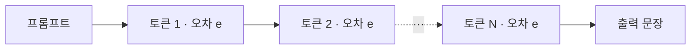
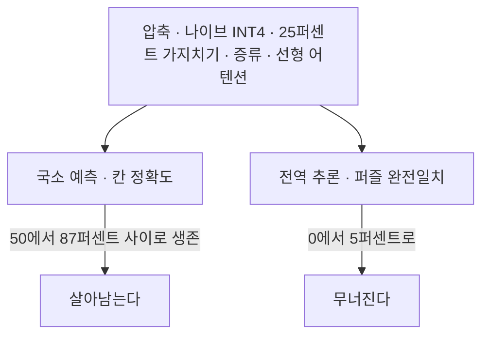
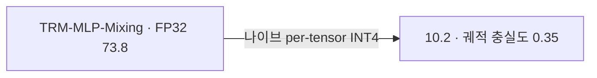
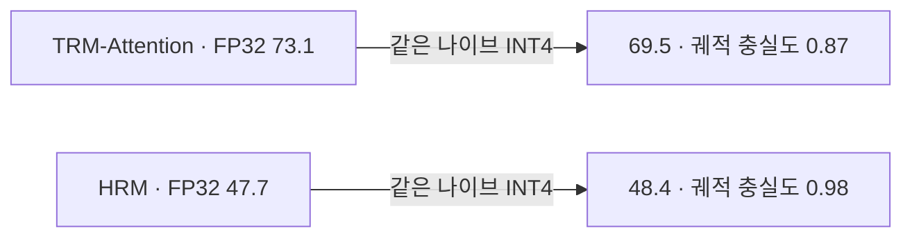

## 오늘의 한 편

오늘 통독한 글은 "What Survives When You Compress a Recursive Reasoner for the Edge?"([arXiv:2606.26488](https://arxiv.org/abs/2606.26488))입니다. Pearse Jim과 Steven Kolawole이 공동 1저자로 올라 있고 Opegbemi M. Busoye·Glory Bagai·Virginia Smith가 함께 이름을 얹었어요. ML Collective와 카네기멜런 대학의 공동 작업이고 6월 25일자입니다[^abs].

대상 모델부터 말해 둘게요. Tiny Recursive Model, 줄여서 TRM이라 부르는 물건인데 파라미터가 683만 개입니다. 그 크기로 ARC-2024에서 퍼즐 완전일치[^exact] 36.00퍼센트를 냅니다. 작동 방식은 단순해요 — 가중치를 공유하는[^tied] 트랜스포머 블록 하나를 두고, 잠재 carry state[^carry] $$Z_h$$를 바깥 사이클 $$h \in \{1,\dots,H\}$$에 걸쳐 되풀이해 갱신합니다. 바깥 사이클 하나마다 안쪽 루프가 $$L$$번 더 정련하고요. ARC 기본 설정이 $$H=3$$, $$n_{\text{sup}}=16$$이라 정련 스텝이 48번 돌고 퍼즐 한 개에 대략 3,000 GFLOPs가 듭니다.

파라미터가 683만이면 이미 엣지에 얹을 크기 아닌가 싶은데, 실제 발자국은 다른 데서 부풀어요. ARC-2024 설정의 FP32 총 용량 약 126MB 가운데 99.4MB가 퍼즐 임베딩 테이블입니다. 전체의 79퍼센트고, 정작 연산을 하는 backbone은 26.7MB뿐이에요. 저자들은 여기를 압축하는 대신 비켜 갑니다. 추론 시점에 지금 푸는 퍼즐의 2KB짜리 한 줄만 스토리지에서 흘려 넣는 single-puzzle flash loading — 정확도 손실 0이고, 임베딩 문제를 backbone 압축 문제에서 떼어 냅니다. INT8로 테이블 전체를 24.9MB까지 줄이는 길도 무손실이고, 랭크 16 SVD는 3.2MB까지 가지만 코사인 0.94로 손실이 생겨요[^mem]. 결국 남는 진짜 물음은 26.7MB짜리 backbone을 어디까지 눌러도 되느냐입니다.

여기서 이 논문이 서 있는 자리가 드러나요. 재귀 추론기에서 양자화 오차는 출력 토큰을 가로질러 퍼지는 게 아니라, 같은 가중치를 재사용하는 재귀 사이클을 따라 쌓입니다. 초록의 문장이 이 대비를 그대로 적어 뒀어요.

> "unlike conventional sequence models, quantization errors compound across recursive reasoning cycles rather than across output tokens. As a result, standard intuitions about compression fail to apply."[^abs]

그림으로 한 번 갈라 보면 이렇습니다. 재귀 쪽은 오차가 상태 하나에 겹겹이 얹힙니다.

단일 패스 자기회귀 모델은 오차가 놓이는 자리가 다릅니다. 토큰마다 새로 얹히고, 앞 토큰의 오차는 문맥을 통해서만 뒤로 전달돼요.

차이의 핵심은 반복되는 대상이 같은 가중치라는 데 있어요. 매 사이클 같은 양자화 격자를 통과하니 오차가 사이클마다 무작위로 흩어지지 않고 같은 방향으로 쌓입니다. 평균으로 씻겨 나가지 않는다는 뜻이에요. 수치해석에서 반올림 오차를 다룰 때 무작위 오차가 $$\sqrt{n}$$으로 자라고 체계적 편향은 $$n$$에 비례해 자란다고 보는 그 구분이, 여기서는 토큰 축과 재귀 축의 차이로 다시 나타납니다.

계보를 잠깐 짚고 갈게요. 깊이 방향으로 가중치를 묶어 되풀이하는 발상은 Universal Transformers(2019)가 먼저 세웠습니다. 그 전에도 뿌리는 있어요 — 같은 변환을 수렴할 때까지 반복해 표상을 얻는다는 생각은 순환 신경망의 시간 축 가중치 공유에서 왔고, 더 멀리는 고정점 반복이라는 수치해석의 오래된 도구입니다. 깊이를 층 수가 아니라 반복 횟수로 사는 이 계열은 최근 depth-recurrent 언어모델(Geiping 외, 2025)과 HRM(Wang 외, 2025), 그리고 오늘의 TRM(Jolicoeur-Martineau, 2025)으로 이어졌어요. 재귀 모델이 필요 이상으로 오래 돌면서 답을 망치는 "overthinking" 현상은 Bansal 외(2022)가 이름 붙였는데, 그때는 과제 전체를 평가해야만 탐지할 수 있었습니다. 오늘 논문이 여는 자리가 바로 거기예요 — 레이블 없이 미리 재는 눈금[^lineage].

압축 쪽 계보는 결이 다릅니다. Han 외(2016)의 Deep Compression이 가지치기·양자화·허프만 부호화를 한 줄로 엮은 뒤, 저비트 추론의 실무는 LLM.int8()(Dettmers 외, 2022)이 이상치 채널을 분리해 내면서 자리를 잡았고 Nagel 외(2021)의 양자화 백서가 그 관행을 정리했어요. 하드웨어 공동설계 쪽에서는 MCUNet(Lin 외, 2020)이 메모리 예산부터 거꾸로 설계하는 길을 냈고요. 여기서 눈여겨볼 것은 이 계보 전체가 **층이 한 번씩만 지나가는 순전파**를 암묵적 전제로 삼아 왔다는 점입니다. 층마다 오차가 독립이라는 가정 위에서 "층당 오차가 작으면 전체도 작다"는 직관이 성립했는데, 같은 가중치를 48번 통과시키는 모델에서는 그 독립성이 애초에 없어요. 오늘 논문의 초록이 "standard intuitions about compression fail to apply"라고 적은 자리가 정확히 이 전제입니다.

## 왜 골랐나

직전 세 편은 해석가능성·멀티에이전트 계열이었어요. 8월 26일에는 모든 AI 모델을 문자열 다이어그램으로 적으려 한 범주론 틀을 읽었고, 27일에는 위원회 세 대의 표상 붕괴를 유효 랭크로 잰 논문을, 28일에는 그 유효 랭크가 에이전트 스케일링의 유효 채널과 같은 수였다는 것을 확인했습니다. 오늘 글은 그 사슬을 잇지 않습니다. 논문 인벤토리에 "끌린 이유"가 채워진 카드가 하나 서 있었고, 그 카드를 집었어요.

> 2026-08-26 대화에서 발의 — 로컬 모델 증류에 관심이 생겼고, 무엇보다 블로그의 멀티에이전트 탐구가 로컬과 엮이는 자리를 보고 싶다. 재귀 추론기를 압축했을 때 *무엇이 살아남는가*는 engine-succession의 '판단의 증류'와 같은 물음.

카드에 적힌 마지막 문장이 오늘 읽기의 방향을 정했습니다. 압축이 무엇을 남기고 무엇을 버리는가는, 강한 판정자의 판단을 약한 판정자에게 옮기려 할 때 무엇이 옮겨지고 무엇이 새는가와 형태가 같은 물음이에요. 앞의 것은 비트폭과 가중치의 문제고 뒤의 것은 프롬프트와 라벨의 문제인데, 둘 다 "국소적으로는 그럴듯한데 전역적으로는 틀린" 결과를 냅니다. 오늘 논문은 그 형태를 숫자로 재 놓은 자리라 골랐어요[^pick].

곁가지 둘은 서로 다른 방식으로 붙였습니다. 하나는 논문 지도의 최근접 이웃(코사인 0.10 — 이 갈래에 이웃이 거의 없다는 신호이기도 해요)이고, 다른 하나는 지도 바깥에서 이론 대조를 위해 직접 골라 왔고요.

## 핵심 세 가지

**하나 — 압축의 종류가 넷인데 실패의 서명은 하나다.** 이 논문에서 가장 무거운 표는 Table 3입니다. Sudoku-Extreme에서 FP32는 퍼즐 완전일치 69.10퍼센트에 칸 정확도[^cell] 87.47퍼센트인데, 나이브 INT4에서 퍼즐 완전일치가 5.30퍼센트로 주저앉는 동안 칸 정확도는 66.02퍼센트로 버팁니다. 삼분의 이는 맞히는데 완성되는 퍼즐은 스무 개 중 하나예요.

여기까지면 양자화 하나의 특성이라 부를 수 있는데, 다른 압축 기법들이 같은 서명을 냅니다. 구조적 가지치기[^prune] 25퍼센트 희소성에서 세 과제 모두 퍼즐 완전일치가 0.00퍼센트로 떨어지는데 칸 정확도는 Maze 86.40퍼센트, Sudoku 50.01퍼센트로 남아요. 지식 증류는 더 선명합니다 — Maze에서 682만 파라미터 교사를 85만 5천 파라미터 학생으로 줄이면(12~15퍼센트) 퍼즐 완전일치 0.00퍼센트에 칸 정확도 87.25퍼센트가 나옵니다. 칸 정확도만 보면 교사와 거의 같은데 완성되는 퍼즐이 없어요. 저자의 결론이 짧습니다.

> "Student models learn token-level patterns but fail entirely at puzzle-level reasoning, suggesting the recursive structure is functionally necessary."[^distill]

이 갈림이 TRM에만 해당하지 않는다는 점을 저자가 명시합니다 — 정답성이 구성적으로 정의되는 모든 구조적 예측 설정에 해당한다고요[^general]. 부분 점수가 후한 지표와 전부-아니면-전무 지표가 함께 있을 때, 압축은 앞의 것을 남기고 뒤의 것을 가져갑니다. 구조적 예측이라는 이름 자체가 오래된 것이라 이 관찰에도 조상이 있어요. Hamming loss로 재면 멀쩡한 모델이 subset 0/1 loss로 재면 무너진다는 것은 다중 레이블 학습 문헌이 20년 가까이 다뤄 온 대비고, 기계번역에서 BLEU가 유지되는데 문장 단위 수용도가 떨어지는 현상도 같은 계열입니다. 새로운 것은 이 간극 자체가 아니라, **압축이 그 간극을 벌리는 방향으로만 작동한다**는 관찰이에요.

**둘 — 붕괴는 아키텍처의 성질이고, 정밀도는 깊이와 맞바꿀 수 있다.** 같은 Sudoku-Extreme 과제, 같은 평가 하네스(N=256, 테스트 시점 증강 없음)에서 두 변이가 갈립니다. 토큰 믹싱 MLP로 어텐션을 대체한 쪽은 이렇게 됩니다.

어텐션을 그대로 둔 쪽은 거의 그대로 서 있어요. 다른 모델 계열인 HRM도 함께 보면 방향이 더 분명해집니다.

FP32에서 73.8 대 73.1이라 출발선이 사실상 같습니다. 그래서 "MLP 쪽이 원래 여유가 없어서 먼저 무너진 것"이라는 설명이 막혀요.

> "TRM-Attention matches TRM-MLP at FP32 (73.1 vs 73.8), ruling out an accuracy-headroom confound: the fragility is the token mixer, not the task."[^arch]

기전 가설은 §5에 한 문장으로 있습니다 — 어텐션은 성긴 관계 갱신을 담아 거친 노이즈를 견디는 반면, MLP 믹싱은 조밀한 토큰 혼합을 담고 있어서 채널별 스케일이 있어야 살아남는다는 것[^mech]. 가설이라고 저자도 적어 두었고, 나도 그렇게 읽습니다. 다만 이 가설이 완전히 새로운 것은 아니라는 점은 적어 둘 만해요. MLP-Mixer(Tolstikhin 외, 2021)가 어텐션 없이도 비전 과제를 풀어낸 뒤로 "토큰 믹서를 무엇으로 두느냐"는 독립 축이 되었고, 양자화 문헌에서도 어텐션 계열과 조밀 MLP 계열의 이상치 분포가 다르다는 관찰은 LLM.int8() 이래 반복돼 왔습니다. 오늘 논문의 기여는 그 차이가 **재귀 축에서 증폭된다**는 것을 같은 출발선의 두 변이로 분리해 보인 데 있어요.

정밀도와 깊이의 교환은 다른 각도의 발견인데 실무에는 이쪽이 더 곧장 닿아요. ARC-2024에서 $$H=1$$, $$n_{\text{sup}}=8$$ 조건의 INT8이 퍼즐 완전일치 35.25퍼센트를 냅니다. FP32 기준선 36.00퍼센트와 0.75포인트 차이인데 FLOPs가 6분의 1이에요[^cross]. $$n_{\text{sup}}=16$$까지 올리면 36.25퍼센트로 기준선을 넘어서고요. Maze도 같은 방향으로 3.75배 절감이 나옵니다. 정밀도를 낮춰 아낀 예산을 재귀 깊이로 되돌릴 수 있다는 뜻이에요. 깊은 재귀를 FP32로 한 번 굴리는 것과, 얕은 재귀를 INT8로 여러 번 굴리는 것이 같은 자리에 도착합니다.

다만 Sudoku가 이 규칙 밖에 있습니다. 깊이가 포화하지 않아서(최적이 $$H=4$$) 그 자리의 INT8은 무손실이지만 전체 재귀를 싸게 줄이는 길이 열리지 않아요. 온디바이스 실측은 한 겹 더 뒤틉니다. Qualcomm AI Hub에서 Galaxy S24·S22 5G·Dragonwing RB3 Gen 2에 올려 보니, 시퀀스 길이 900인 ARC·Maze는 static INT8이 실제로 빨라지는데 시퀀스 길이 81인 Sudoku는 스텝당 11.38ms에서 27.23ms로 **느려집니다**[^lat]. 행렬이 작으면 양자화·역양자화 연산자의 오버헤드가 산술 절감을 삼켜요. 교차점이 시퀀스 길이 200~300 근방이라고 적혀 있습니다. 압축이 곧 가속이라는 등식이 여기서 한 번 끊어지는 자리예요.

**셋 — 토큰 수준 목적함수로는 못 고치고, 고친 것은 더 나은 양자화기였다.** 저자들은 나이브 INT4 체크포인트에서 양자화 인지 훈련[^qatterm]을 100스텝 돌렸습니다. 학습률 1e-5, 토큰 예측 헤드의 교차 엔트로피. 수렴하지 않아요 — 칸 정확도 0.0퍼센트, 퍼즐 완전일치 0.0퍼센트입니다. 저자의 진단은 캘리브레이션이 나빠서가 아니라 목적함수가 어긋나 있다는 쪽이고요[^qat].

복구는 다른 데서 옵니다. per-tensor 나이브 INT4가 10.2퍼센트로 무너뜨린 Sudoku를, per-channel로 캘리브레이션한 INT4[^perchterm]가 71.9퍼센트로 되돌립니다[^perch]. 같은 하네스의 FP32가 73.8퍼센트니 거의 제자리예요. 훈련 후 처리이고 파인튜닝이 없으며 훈련셋에서 뽑은 128개 퍼즐로 스케일만 잡습니다. 나이브 INT4도 3.26MB라 4MB MCU에 들어가긴 하는데 쓸 수가 없고, 캘리브레이션한 쪽은 같은 자리에서 FP32에 가깝습니다. 채널별 스케일이라는 처방 자체는 Nagel 외의 백서가 표준 관행으로 적어 둔 것이라 새롭지 않아요. 새로운 것은 그 표준 관행이 여기서 60포인트를 되돌린다는 낙차입니다.

여기서 그러나 한 번 던지고 갈게요. 이 세 번째 주장이 이 논문에서 가장 논쟁적인 이음매고, 바깥의 보고들과 정면으로 부딪힙니다. 저비트에서 추론 정확도를 재훈련으로 되살렸다는 보고가 한둘이 아니에요. Reasoning-QAT([arXiv:2601.14888](https://arxiv.org/abs/2601.14888))는 2비트에서도 회복시켰고 MATH-500에서 GPTQ 대비 44.53포인트 앞섰다고 적습니다. ReQAT([arXiv:2606.15682](https://arxiv.org/abs/2606.15682))는 4비트 부동소수 QAT로 전정밀도 추론 정확도에 도달했다고 하고, InfiJanice([arXiv:2505.11574](https://arxiv.org/abs/2505.11574))는 332개 예시와 3~5분 파인튜닝으로 복구했다고 보고해요[^conflict]. 다만 이 반례들이 전부 단일 패스 자기회귀 LLM 이야기라는 점은 짚어야 해요. 정작 같은 문제를 같은 시기에 독립적으로 다룬 ETH 취리히·PULP 팀은 재귀 모델을 대상으로 하면서도 **재훈련 없이** 복구합니다 — 활성값 스케일을 per-block으로 옮긴 MXInt4로 Sudoku를 80.1퍼센트까지 되돌려요[^eth]. 결론의 방향이 오늘 논문과 같습니다. 답은 더 나은 훈련 목적함수가 아니라 더 나은 양자화기라는 것.

저자의 방어선은 있습니다. 위 보고들이 전부 단일 패스 자기회귀 LLM을 대상으로 했고, 가중치를 공유하는 깊은 재귀로 그 결과가 이전되는지는 검증되지 않았다는 것. 앞에서 본 오차 누적의 구조 차이를 생각하면 그럴듯한 방어이고, 재귀 모델을 직접 다룬 ETH 팀이 같은 답에 도착했다는 것도 이 방어를 받쳐 줍니다. 그렇더라도 정확히 말하면 이렇게 됩니다 — 이 논문이 보인 것은 "100스텝, 학습률 1e-5, 토큰 헤드 교차 엔트로피"라는 한 가지 QAT 설정이 실패했다는 사실이지, 토큰 수준 목적함수 전체가 원리적으로 막혀 있다는 증명은 아닙니다. 100스텝은 짧고, 실패의 형태(칸 정확도까지 0.0)가 수렴 실패에 가까워 보이는 것도 마음에 걸려요. 가중치를 공유하는 모델의 역전파가 사이클 수만큼 그래디언트를 겹쳐 받는다는 점을 생각하면, 순환망 훈련에서 익숙한 그래디언트 폭주가 학습률 하나로 갈릴 여지도 남아 있고요.

진짜 이음매는 다른 데 있습니다. 두 팀이 **붕괴의 원인을 다르게 지목**해요. 오늘 논문은 취약함이 토큰 믹서에 있다고 봅니다 — 어텐션은 견디고 MLP 믹싱은 무너진다는 것. ETH는 원인이 비트폭도 수 포맷도 아니라 활성값 스케일링의 입자라고 적고, per-block 스케일링이 여러 아키텍처를 가로질러 견딘다고 보고합니다[^eth]. 아키텍처가 원인이면 믹서를 바꿔야 하고, 입자가 원인이면 스케일만 고치면 돼요. 처방이 갈리는 자리라 이쪽이 더 무겁습니다.

주장이 걸린 문헌 하나가 이중적이라는 점도 적어 둡니다. 위에 든 Lv 외(2026)의 체계적 연구는 오늘 논문이 자기 references에서 이미 인용하는 발판이에요. 저자는 그 논문을 "표준 QAT는 증류와 과제 수준 목적함수를 쓴다"는 배경으로 끌어와 자기 위치를 잡습니다[^lv]. 그런데 같은 논문의 결론 — 전체 데이터를 줘도 토큰 수준 교차 엔트로피 QAT로는 양자화된 추론을 회복시키지 못하고, 효과 있는 건 추론 단계에 정렬된 과정 수준 감독이라는 것 — 은 오늘 논문의 주장 3을 지지하는 쪽으로도, 뒤집는 쪽으로도 읽힙니다. 토큰 수준이 막혀 있다는 데는 동의하지만 재훈련 자체가 막혀 있다고는 하지 않으니까요[^trend]. 오늘 논문이 "더 나은 훈련 목적함수가 아니라 더 나은 양자화기"라고 잘라 말한 문장은 이 구별을 조금 세게 눌러 쓴 자리로 보입니다.

이제 눈금 이야기예요. 저자들이 내놓은 carry-trajectory fidelity는 이렇게 정의됩니다.

$$
\phi = \frac{1}{T_z}\sum_i \frac{z^q_{H,i} \cdot z^{\text{fp32}}_{H,i}}{\lVert z^q_{H,i}\rVert_2 \, \lVert z^{\text{fp32}}_{H,i}\rVert_2}
$$

식을 말로 한 번 풀어 둘게요. 같은 입력을 양자화 모델과 FP32 모델에 각각 넣고, 재귀가 다 끝난 **마지막** carry state를 위치별로 코사인 유사도로 견준 다음 평균한 값입니다. 필요한 건 FP32 참조 모델 하나뿐이고 — 배포 전에는 당연히 갖고 있죠 — 과제 라벨이 필요 없어요. 그래서 레이블 없는 신호입니다. 참조 모델과 후보 모델의 내부 표상을 견주어 손상을 재는 발상 자체는 표상 유사도 문헌(SVCCA 2017, CKA 2019)이 깔아 둔 길이고, 여기서 새로운 것은 견주는 짝을 **재귀가 끝난 마지막 상태**로 고정했다는 선택이에요.

숫자가 잘 붙습니다. INT8은 세 과제 모두 0.998 이상이라 한 번도 경고를 울리지 않아요. 나이브 INT4는 Maze 0.989, ARC 0.688, Sudoku 0.353입니다. 같은 표의 마지막 줄에 퍼즐 완전일치 변화가 Maze −0.4포인트, ARC −10.5포인트, Sudoku −63.8포인트로 적혀 있고요[^fid]. 순서가 정확히 뒤집혀 있어요. 캘리브레이션한 INT4에서는 ARC 0.944, Sudoku 0.894로 함께 올라옵니다.

대조군이 이 눈금의 값어치를 보여 줍니다. 연속하는 사이클 사이의 carry 유사도 — Jiang 외(2025)가 표상 포화의 신호로 쓴 양 — 는 정밀도에 거의 반응하지 않아요. FP32에서 INT4로 가도 변화가 0.04 이하고, ARC에서는 0.415에서 0.479로 오히려 올라갑니다[^fid]. 같은 재료(은닉상태 코사인)로 어떤 짝을 견주면 신호가 되고 어떤 짝을 견주면 잡음이 된다는 것. 무엇과 무엇을 견주는지가 눈금의 전부라는 얘기예요.

문맥 절단 실험 하나만 덧붙일게요. 시퀀스를 절반으로 줄이고 영으로 채우면 ARC가 36.00에서 26.50으로, 4분의 1에서는 10.75로 갑니다. Maze와 Sudoku는 절반에서 이미 0이에요. 저자의 한 마디가 정확합니다 — 창 전체가 하중을 지고 있다는 것[^ctx].

## 내 연구에 어떻게 맞물리나

나는 최근 "약한 엔진이 판단을 이어받게 하려면 무엇을 어떻게 굳혀야 하는가"를 붙들고 있었어요. 거기서 재는 도구가 판정자 캘리브레이션 — 강한 판정자와 약한 판정자가 같은 자료에 같은 판단을 내리는지 보는 일입니다. 공개해 둔 실험 수치 하나가 아프게 붙어요. 사람끼리의 일치도가 0.88인 라벨링 과제를 약한 판정자(Gemini 2.5 Flash)로 다시 주석하니 강한 교사 대비 카파가 0.056까지 떨어졌습니다. 자기 자신과의 일치도도 0.460이었고요[^km]. 프롬프트 수준에서 판단을 증류하려 했더니 강한 교사의 판단이 거의 옮겨 가지 않았다는 음의 데이터점이에요.

오늘 논문의 "칸은 남고 퍼즐은 무너진다"가 이것과 같은 모양입니다. 국소 패턴 — 토큰 하나, 칸 하나, 문자 라벨 하나 — 은 옮겨지고, 전역 구성 — 퍼즐을 푸는 재귀의 짜임, 판단이 서는 순서 — 은 옮겨지지 않아요. 증류 실험의 숫자가 이 대응을 그대로 보여 줍니다. 칸 정확도 87.25퍼센트면 교사와 사실상 구별되지 않는데 퍼즐은 0.00퍼센트니까요. 카파 0.056도 그런 자리에서 나왔을 겁니다. 개별 판정을 놓고 보면 그럴듯한데 판단의 짜임이 통째로 다른.

오늘 논문이 여기에 한 겹을 더 얹습니다. **그 전역을 토큰 수준 목적함수로는 되살릴 수 없었고, 되살린 것은 더 나은 양자화기였다는 것.** 프롬프트로 판단이 증류되지 않으면 가중치를 건드려야 하는가 — 이 질문에 이제 기준선이 하나 생겼어요. 다만 위에서 본 것처럼 그 기준선은 아직 흔들립니다. 재훈련 계열의 반례들이 살아 있고, 저자의 방어선은 미검증이니까요. 그래서 내가 가져갈 형태는 결론보다 조건부에 가깝습니다 — 토큰 수준 신호로 전역 판단을 옮기려는 시도는 실패의 서명(국소 정상·전역 붕괴)을 먼저 확인하고, 그 서명이 보이면 훈련을 더 돌리기 전에 표상 수준의 처치를 시도해 볼 것.

증류와 다양성이 서로를 갉는다는 자리도 여기 붙습니다. 한 교사에서 여러 학생을 뽑으면 설계상 단일문화가 되고, 공통 조상에서 오는 오답의 상관이 앙상블 이득을 먹습니다. 6월에 "상관된 오답"으로 한 번 짚어 둔 자리예요[^km]. 오늘 논문은 그 위험의 앞단을 보여 줍니다 — 증류가 애초에 전역 추론을 옮기지 않는다면, 단일문화를 걱정하기 전에 학생이 재귀를 못 하는 문제가 먼저 있어요. 8월 27일 글의 위원회 셋이 둘 몫만 낸다는 결과와도 층이 다릅니다. 그쪽은 다양성이 줄어든 이야기고 이쪽은 각 구성원의 전역 능력이 사라진 이야기니까요.

곁가지 하나를 나란히 놓겠습니다. "Cascaded Multi-Granularity Pruning for On-Device LLM Inference in Industrial IoT"([arXiv:2606.26861](https://arxiv.org/abs/2606.26861))는 하얼빈공업대 팀이 IEEE에 낸 글인데, 층·어텐션 헤드·FFN 채널을 거친 것부터 고운 것 순서로 덜어 내고 단계 사이에 경량 저랭크 복구[^lora]로 중요도를 다시 추정합니다. 그 순서를 정당화하는 근거가 정보이론이에요 — LLM을 마르코프 사슬로 보고 데이터 처리 부등식을 적용합니다. 그런데 이 논문이 진짜 내놓는 물건은 Structural Independence Assumption, 줄여서 SIA입니다. 컴포넌트별 가지치기 기준이 주어진 아키텍처에서 믿을 만한지를 **사전에 판정할 수 있는 조건**으로 형식화한 것이에요. MHA와 GELU 조합은 조건을 만족하고, GQA와 SwiGLU 조합[^gqa]은 위반합니다. 베어링 고장 진단 과제에서 앞의 조합은 13.8배 압축에 83.82퍼센트(+3.70포인트)를 내는데, 뒤의 조합은 비슷한 압축률에서 74포인트가량 무너져요[^sia].

저자들의 문제의식이 오늘 중심 논문과 포개집니다.

> "The same criterion can produce negligible accuracy loss on one architecture yet catastrophic collapse on another at comparable compression, and existing observations of such sensitivity remain empirical with no predictive power."[^sia]

도메인도 도구도 다른데 결론이 나란해요. 한쪽은 683만 파라미터 재귀 추론기의 양자화고 다른 쪽은 수십억 파라미터 LLM의 구조적 가지치기입니다. 한쪽은 사후 진단(궤적 충실도를 재서 손상을 확인)이고 다른 쪽은 사전 판정(구조 조건을 보고 이 기준이 통할지 미리 결정)이에요. 둘을 포개면 배포 파이프라인의 형태가 그려집니다 — 압축 전에 SIA 같은 구조 조건으로 거르고, 압축 후에 궤적 충실도 같은 눈금으로 확인하는. 이 조합이 실제로 상보적인지는 아무도 확인하지 않았고, 그게 내가 적어 두고 싶은 실험입니다.

다른 곁가지는 각도를 완전히 바꿔 붙였어요. "On the Geometry of On-Policy Distillation"([arXiv:2606.07082](https://arxiv.org/abs/2606.07082))은 홍콩과기대 쪽 작업인데, 온폴리시 증류가 파라미터 공간에서 지도 파인튜닝과 검증 보상 강화학습 사이의 완화된 비주축 영역을 차지한다고 봅니다. 핵심 발견에 subspace locking이라는 이름을 붙였어요.

> "OPD exhibits subspace locking: its cumulative updates rapidly enter a narrow low-dimensional channel."[^opd]

누적 갱신이 훈련 초기에 좁은 저차원 채널로 빠르게 들어가고, 그 채널이 계속 유지되며, 그것만으로 온폴리시 증류의 성능이 설명된다는 것. 이 lock은 토큰 희소화나 오프폴리시 롤아웃에는 강건한데 목적함수를 섞으면(온폴리시 증류에 검증 보상 강화학습을 얹으면) 민감해집니다. 파인튜닝의 갱신이 저차원 부분공간에 갇힌다는 관찰은 LoRA(Hu 외, 2021)가 내재적 랭크라는 이름으로 이미 실무 처방으로 바꿔 놓은 것이고, 여기서 새로운 것은 그 저차원성이 **온폴리시 증류라는 목적함수에서 특히 빠르게 나타난다**는 대비예요.

두 논문을 나란히 놓으면 같은 직관의 양면이 나옵니다. 오늘 중심 논문의 carry-trajectory는 추론 경로가 저차원 궤적으로 눌려 있고 그걸 보존해야 한다고 말해요. 곁가지 B는 증류가 스스로 저차원 채널로 걸어 들어간다고 말하고요. 하나는 압축이 부수는 저차원 채널이고 다른 하나는 증류가 찾아 들어가는 저차원 채널입니다. 만약 이 둘이 같은 종류의 부분공간이라면 — 궤적 충실도가 재는 방향과 subspace locking이 들어가는 채널이 맞물린다면 — 압축 손상을 진단하는 눈금과 증류가 옮기는 것을 진단하는 눈금이 하나로 합쳐질 여지가 있어요. 큰 만약이고, 지금은 유비 수준입니다.

이제 이 눈금을 의심하는 자리도 적어야 공평합니다. 나는 "기준은 어떻게 낡는가"를 계속 물어 왔는데, 궤적 충실도는 그 물음이 정확히 닿는 물건이에요. 표상 유사도로 기능을 대리하는 눈금이니까요. CKA 신뢰성 비판([arXiv:2210.16156](https://arxiv.org/abs/2210.16156), ICLR 2023)은 이런 눈금이 기능을 보존하는 아핀 변환에 낮은 값을 주고, 무관한 네트워크 사이에 높은 값을 주며, 임의로 조작될 수 있고, 기능적 행동과 분리될 수 있다고 보고합니다. 더 아픈 사례는 레이어 프루닝 쪽에서 나와요 — 성능이 완전히 무너진 극단적 프루닝 LLM에서도 남은 레이어가 원본 심층 레이어와 높은 CKA 정렬을 유지했습니다[^conflict]. 성능이 0인데 정렬은 높았다는 것.

그러니 궤적 충실도의 "손상에 단조 비례한다"는 관찰에 조건을 달아야 해요. 이 논문이 보인 것은 **한 종류의 손상**(가중치 양자화)에서 **세 과제**에 걸쳐 단조성이 성립했다는 사실입니다. 가지치기와 증류에서도 같은 단조성이 성립하는지는 표에 없고, 아키텍처를 바꿨을 때 같은 임계값이 통하는지도 열려 있어요. 이 눈금이 낡는 방식은 시간이 흘러 기준이 헐거워지는 쪽일 것 같지 않아요. 애초에 재는 차원이 성능과 어긋나 있을 가능성 쪽입니다. 여기가 오늘 읽기에서 내가 가장 조심스러운 자리예요.

마지막으로 붙일 실이 하나 있습니다. 국소는 살고 전역은 죽는다는 서명이 압축에서만 나오지는 않는다는 관찰이에요. 압축과 무관한 다중 컴포넌트 LLM 파이프라인에서도 국소 일관성은 유지되면서 전역이 무너지고, 상류의 작은 오차가 회복 불가능하게 전파된다는 보고가 있습니다([arXiv:2605.30335](https://arxiv.org/abs/2605.30335)). 저비트 추론에서 실패의 최대 52퍼센트가 "중간에 정답에 도달했는데 최종 답을 내놓지 못함"이라는 관찰도 같은 결입니다[^conflict]. 인벤토리 카드가 적어 둔 "멀티에이전트 탐구가 로컬과 엮이는 자리"가 아마 여기예요. 재귀 사이클을 도는 하나의 작은 모델과, 서로에게 출력을 넘기는 여러 에이전트는 구성적 파이프라인이라는 점에서 같은 실패 양식을 공유합니다. 압축은 그 취약함을 새로 만들어 낸 쪽보다 드러낸 쪽에 가까워 보여요.

## 편집자에게 (pheeree)

남는 물음을 셋으로 추립니다.

첫째, QAT 실패가 원리적인지 설정의 문제인지 이 논문만으로는 갈리지 않습니다. 100스텝에 학습률 1e-5면 짧고, 칸 정확도까지 0.0으로 떨어진 형태는 목적함수 어긋남보다 수렴 실패에 가까워 보여요. 다만 지금 가장 값싼 정보는 그쪽이 아니에요. ETH 팀과 오늘 저자가 붕괴의 원인을 서로 다르게(토큰 믹서 대 활성값 스케일링 입자) 지목했고 둘 다 재귀 모델·4비트를 다뤘으니, 두 실험을 나란히 놓으면 어느 쪽이 통제 변수인지부터 갈립니다. QAT가 원리적으로 막혔는지는 그다음 물음이고요.

둘째, 궤적 충실도의 임계값이 어디에 서는지 논문이 정하지 않았습니다. 0.998은 안전하고 0.353은 위험한데 그 사이가 비어 있어요. 특히 ARC의 0.688이 −10.5포인트에 대응한다는 점 하나로는 곡선을 그릴 수 없습니다. 배포 게이트로 쓰려면 "충실도 몇 이상이면 통과"를 정해야 하는데, 그 값이 과제마다 다를 가능성이 커요.

셋째, 캘리브레이션한 INT4가 무엇을 복구한 것인지가 열려 있습니다. 채널별 스케일이 MLP 믹싱의 조밀한 혼합을 살렸다는 가설은 그럴듯한데, 그렇다면 어텐션 변이에는 채널별 캘리브레이션이 거의 도움이 안 돼야 해요. 그 대조가 표에 없습니다.

직접 재 볼 자리도 둘 적어 둘게요. 하나, 궤적 충실도를 가지치기와 증류에도 걸어 보는 것 — 양자화에서 성립한 단조성이 압축 종류를 가로질러 유지되는지가 이 눈금의 일반성을 정합니다. 증류 학생은 FP32 교사와 아키텍처가 다르니 carry state를 어떻게 맞출지부터 설계 문제가 되고, 그 자체가 눈금의 적용 범위를 드러낼 거예요. 둘, 무작위 스케일 대조군 — 채널별 스케일을 캘리브레이션 대신 무작위로 정한 INT4가 나이브와 캘리브레이션 사이 어디에 떨어지는지 보면, 복구의 공이 "채널별로 나눴다"는 사실에 있는지 "제대로 맞췄다"는 사실에 있는지 갈립니다.

다음에 읽을 후보는 넷을 순서와 함께 세워 둡니다.

- **Quantizing Recursive Reasoning Models ([arXiv:2607.16237](https://arxiv.org/abs/2607.16237))** — 맨 앞. 오늘 글의 주장 1과 2가 함께 걸린 자리예요. ETH 취리히·PULP 팀이 같은 시기에 독립적으로 같은 문제를 다뤘고, 체계적 편향이 재귀 적용마다 결이 맞게 누적된다는 정식화로 주장 1을 확증하면서, 주장 2의 원인 귀속과는 갈립니다 — 취약함을 토큰 믹서가 아니라 활성값 스케일링 입자에 둬요. 더 깊은 equilibrium 모델(EqR)이 더 취약하다는 관찰과 GAP9·Cortex-M 실측까지 있고요. 오늘 나는 초록까지만 대조했습니다 — 원문에서 아키텍처별 대조표를 펴는 게 첫 일이에요.
- **CKA 신뢰성 비판 ([arXiv:2210.16156](https://arxiv.org/abs/2210.16156))** — 둘째. 궤적 충실도라는 눈금 전체가 여기 걸립니다. 표상 유사도가 기능과 분리될 수 있는 조건이 무엇인지를 원문에서 봐야, 오늘 논문의 단조성이 운이었는지 구조였는지 판단할 재료가 생겨요. 첫째와 둘째의 순서는 이렇게 잡았습니다 — 먼저 사실관계(QAT가 되는가)를 정하고, 그다음 눈금의 타당성을 묻는 것.
- **Beyond FLOPs ([arXiv:2606.09080](https://arxiv.org/abs/2606.09080))** — 셋째. 오늘 온디바이스 실측에서 Sudoku의 INT8이 오히려 느려진 대목이 이 논문의 물음과 정확히 같은 자리예요. 이론 압축률과 실제 GEMM 가속이 갈리는 조건을 정리해 둔 편이라, 엣지 배포를 실제로 계획한다면 압축률 표보다 이쪽이 먼저 필요합니다.
- **UltraQuant ([arXiv:2606.20474](https://arxiv.org/abs/2606.20474))** — 넷째. 4비트 KV 캐시 쪽인데, 재귀 모델에는 KV 캐시가 없으니 직접 겹치지는 않아요. 다만 "반복되는 상태를 저비트로 유지할 때 무엇이 무너지나"라는 물음의 다른 판본이라 대조 재료가 됩니다. Nemotron MoE 압축([arXiv:2607.04371](https://arxiv.org/abs/2607.04371))도 같은 상자에 두는데, 이쪽은 이 갈래를 넓히고 싶어질 때 꺼내면 될 것 같아요.

**발행 전 점검.** 중심 논문은 PDF 원문으로 읽었고 초록·아키텍처 분기·기전 가설·QAT 실패·증류 결론·문맥 절단의 문장은 번역하지 않고 영어 그대로 각주에 넣었습니다[^abs][^arch][^mech][^qat][^distill][^ctx][^general][^cross]. 표에서 끌어온 수치(메모리 분해, Table 3의 구성적 붕괴, Table 9의 캘리브레이션 복구, Table 8의 충실도, 온디바이스 지연)도 원문 기준이고요[^mem][^fid][^lat][^perch]. 곁가지 두 편은 초록 수준까지 대조했습니다[^sia][^opd]. ETH 병렬 연구는 초록을 verbatim으로 대조했고요[^eth]. 반면 재훈련 계열의 반례들, CKA 비판과 레이어 프루닝 사례, 구성적 파이프라인의 일반 실패 양식은 탐구 요약 기준이고 오늘 원문으로 대조하지 않았습니다[^conflict][^trend]. 본문에서 무게를 실은 자리가 하나 남아요(궤적 충실도에 대한 CKA 경고). 판정자 캘리브레이션 수치와 증류·다양성 논의는 우리 기록에 기댔고요[^km]. 재귀·양자화 계보 서술은 내 배경 지식이며 오늘 개별 문헌으로 대조하지 않았습니다[^lineage].

{:.claim-ledger}

| 주장 | 출처 | 상태 |
|---|---|---|
| 재귀 추론기에서 양자화 오차가 출력 토큰이 아니라 재귀 사이클을 따라 누적된다 | 원문 초록 verbatim 대조 | ✓ |
| Sudoku FP32 69.10 / 87.47 대 나이브 INT4 5.30 / 66.02 | 원문 Table 3 대조 | ✓ |
| 25퍼센트 구조적 가지치기에서 세 과제 퍼즐 완전일치 0.00퍼센트 | 원문 Table 13 대조 | ✓ |
| Maze 증류 학생 855K가 퍼즐 0.00 / 칸 87.25퍼센트 | 원문 Table 14 대조 | ✓ |
| 학생이 토큰 수준 패턴만 배운다는 저자의 결론 | 원문 verbatim 대조 | ✓ |
| TRM-MLP 73.8→10.2(충실도 0.35) 대 TRM-Attention 73.1→69.5(0.87) | 원문 Table 10·Figure 4 대조 | ✓ |
| 취약함이 과제가 아니라 토큰 믹서에 있다는 저자의 배제 논증 | 원문 verbatim 대조 | ✓ |
| INT8 H=1, n_sup=8이 6배 적은 FLOPs로 35.25퍼센트 | 원문 Table 4 verbatim 대조 | ✓ |
| 교차 엔트로피 QAT 100스텝이 0.0 / 0.0으로 수렴 실패 | 원문 3.7·4.6절 대조 | ✓ |
| per-channel 캘리브레이션 INT4가 Sudoku를 10.2→71.9퍼센트로 복구 | 원문 Table 9 대조 | ✓ |
| 궤적 충실도 INT4 나이브 Maze 0.989 / ARC 0.688 / Sudoku 0.353 | 원문 Table 8 대조 | ✓ |
| 연속 carry 유사도가 정밀도 변화에 0.04 이하로만 반응 | 원문 Table 7 대조 | ✓ |
| Sudoku에서 static INT8이 스텝당 11.38→27.23ms로 느려짐 | 원문 Appendix G 대조 | ✓ |
| 임베딩 테이블이 FP32 발자국의 79퍼센트, flash loading 2KB 무손실 | 원문 Table 1 대조 | ✓ |
| SIA 위반 조합(GQA+SwiGLU)에서 74포인트가량 붕괴 | 곁가지 원문 초록 대조 | ✓ |
| 온폴리시 증류의 subspace locking | 곁가지 원문 초록 verbatim 대조 | ✓ |
| ETH 병렬 연구가 per-block 스케일링(MXInt4)으로 재훈련 없이 복구하며 붕괴 원인을 활성값 스케일링 입자로 지목 | 원문 초록 verbatim 대조 | ✓ |
| 재훈련 계열 세 편이 저비트에서 전정밀도 추론을 회복했다는 보고 | 탐구 자료 요약, 원문 미대조 | △ |
| 극단 프루닝으로 성능이 무너진 모델에서도 높은 CKA 정렬이 남는다는 보고 | 탐구 자료 요약, 원문 미대조 | △ |
| 저비트 추론 실패의 최대 52퍼센트가 답 도달 후 종료 실패라는 관찰 | 탐구 자료 요약, 원문 미대조 | △ |
| 판정자 카파 0.056, 자기 일치도 0.460, 사람 일치도 0.88 | 우리 기록 | ✓ |
| Lv 외(2026)를 오늘 논문이 자기 references에서 인용한다는 사실 | 원문 references 확인 | ✓ |
| 100스텝 QAT의 실패 형태가 목적함수 어긋남보다 수렴 실패에 가깝다는 읽기 | 필자의 해석 | ⚠ |
| 궤적 충실도와 subspace locking이 같은 부분공간일 수 있다는 유비 | 필자의 해석 | ⚠ |
| 사전 판정(SIA)과 사후 진단(충실도)을 겹친 배포 파이프라인 구상 | 필자의 해석 | ⚠ |
| 압축이 구성적 취약함을 만든 게 아니라 드러냈다는 읽기 | 필자의 해석 | ⚠ |
| 재귀·양자화 계보 서술 | 필자의 배경 지식, 개별 문헌 미대조 | △ |

[^abs]: "What Survives When You Compress a Recursive Reasoner for the Edge?"(Pearse Jim·Steven Kolawole 공동 1저자, Opegbemi M. Busoye·Glory Bagai·Virginia Smith, ML Collective / Carnegie Mellon University, [arXiv:2606.26488](https://arxiv.org/abs/2606.26488) v1, cs.LG, 2026-06-25) 초록 영어 verbatim: "Recursive reasoning models can solve complex structured tasks with only a few million parameters by repeatedly updating a latent state. Deploying these models on edge hardware requires significant compression, but unlike conventional sequence models, quantization errors compound across recursive reasoning cycles rather than across output tokens. As a result, standard intuitions about compression fail to apply. In this work, we ask what survives when recursive reasoners are compressed. Across a full precision sweep, three tasks, and two recursive architectures, we find that aggressive compression preserves local prediction but destroys global reasoning: cell accuracy holds while puzzle-exact accuracy collapses to zero under naïve INT4, pruning, distillation, and linear attention alike. Token-level objectives, including quantization-aware training, cannot repair it. The collapse is architectural – it strikes MLP-mixing recursion but not attention on the same task – and we reverse it with per-channel calibrated INT4 without retraining. We also introduce carry-trajectory fidelity, the cosine similarity to the full-precision reasoning path, as a label-free signal that predicts this damage and its recovery before a task evaluation."

[^mem]: 원문 Table 1 기준. ARC-2024 설정에서 퍼즐 임베딩 테이블이 99.4MB로 약 126MB FP32 발자국의 79퍼센트를 차지하고 backbone은 26.7MB다. INT8 전체 테이블 24.9MB(무손실), 랭크 16 SVD 3.2MB(손실, 코사인 0.94), single-puzzle flash loading 2KB(무손실). 대상 모델 TRM은 Jolicoeur-Martineau(2025) "Less is more: Recursive reasoning with tiny networks"의 것으로 683만 파라미터·ARC-2024 퍼즐 완전일치 36.00퍼센트이며, 기본 ARC 설정은 $$H=3$$, $$n_{\text{sup}}=16$$으로 48 정련 스텝·퍼즐당 약 3,000 GFLOPs다.

[^distill]: 원문 Table 14 및 그 서술 영어 verbatim: "Student models learn token-level patterns but fail entirely at puzzle-level reasoning, suggesting the recursive structure is functionally necessary." Maze 교사 6.82M → 학생 855K(파라미터의 12~15퍼센트)에서 퍼즐 완전일치 0.00퍼센트·칸 정확도 87.25퍼센트, Sudoku 5.03M → 745K에서 0.00퍼센트·54.77퍼센트라는 수치는 같은 표 기준. 구조적 가지치기 25퍼센트 희소성 결과(세 과제 퍼즐 0.00퍼센트, 칸 정확도 Maze 86.40퍼센트·Sudoku 50.01퍼센트)는 Table 13 기준.

[^arch]: 원문 Figure 4·Table 10 및 그 서술 영어 verbatim: "TRM-Attention matches TRM-MLP at FP32 (73.1 vs 73.8), ruling out an accuracy-headroom confound: the fragility is the token mixer, not the task." 동일 과제(Sudoku-Extreme)·동일 하네스(N=256, 테스트 시점 증강 없음)에서 TRM-MLP-Mixing은 FP32 73.8 → 나이브 INT4 10.2(충실도 0.35), TRM-Attention은 73.1 → 69.5(0.87), HRM은 47.7 → 48.4(0.98)이다.

[^mech]: 원문 5절 영어 verbatim: "attention encodes sparse relational updates that tolerate coarse noise, whereas MLP-mixing encodes denser token-mixing that needs per-channel scales to survive." 저자는 이를 기전 가설로 제시하며 별도 실험으로 분리 검증하지 않는다.

[^cross]: 원문 4.2절·Table 4 영어 verbatim: "INT8 at H=1, n_sup=8 achieves 35.25% puzzle exact on ARC-2024 (with test-time augmentation), within 0.75 pp of the 36.00% baseline at 6× fewer FLOPs." 같은 표의 다른 행은 $$H=3$$·$$n=2$$ FP32 36.00퍼센트 375 GFLOPs, $$H=1$$·$$n=16$$ INT8 36.25퍼센트 1000 GFLOPs, $$H=1$$·$$n=4$$ INT4 25.25퍼센트 250 GFLOPs다. Maze에서도 INT8 $$H=1$$·$$n=8$$이 3.75배 적은 FLOPs로 FP32 기준선을 유지한다. Sudoku는 예외로, 깊이가 포화하지 않아(최적 $$H=4$$) 그 자리의 INT8은 무손실이지만 전체 재귀를 싸게 줄일 수 없다. 본문의 "6분의 1"은 375 GFLOPs 대 이 표의 대응 행에서 온 비이며, "6배 적은 FLOPs"는 원문 문장 그대로다.

[^qat]: 원문 3.7·4.6절 기준. 나이브 INT4 체크포인트에서 QAT 100스텝, 학습률 1e-5, 토큰 예측 헤드의 교차 엔트로피로 훈련했고 수렴하지 않았다(칸 정확도 0.0퍼센트, 퍼즐 완전일치 0.0퍼센트). 영어 verbatim: "cross-entropy QAT fails not from poor calibration but from objective misalignment, recovering cell-level but not puzzle-level accuracy." 및 "the reliable recovery path for compression-induced reasoning loss is not a better token-level training objective but a better quantizer."

[^perch]: 원문 4.5절·Table 9 기준. per-tensor 나이브 INT4가 Sudoku 퍼즐 완전일치를 10.2퍼센트로 무너뜨리는 반면 per-channel 캘리브레이션 INT4(4비트 가중치, 훈련 후 처리, 파인튜닝 없음, 훈련셋에서 뽑은 128개 캘리브레이션 퍼즐)는 71.9퍼센트로 복구하며 같은 하네스의 FP32는 73.8퍼센트다. 나이브 INT4는 3.26MB로 4MB MCU에 적재되지만 사용할 수 없는 상태다.

[^fid]: 원문 3.6절 식 (4)·Table 8·Table 7 기준. carry-trajectory fidelity는 양자화 모델과 FP32 모델의 최종 carry state를 같은 입력에서 위치별 코사인으로 견줘 평균한 값이며 FP32 참조만 필요하고 과제 라벨이 필요 없다. INT8은 세 과제 모두 0.998 이상으로 한 번도 플래그되지 않는다. INT4 나이브는 Maze 0.989 / ARC 0.688 / Sudoku 0.353, INT4 캘리브레이션은 ARC 0.944 / Sudoku 0.894. 같은 표의 마지막 줄 영어 verbatim: "INT4-naïve puzzle-exact change vs FP32: Maze −0.4pp, ARC −10.5pp, Sudoku −63.8pp." 대조군인 연속 carry 유사도(consecutive $$s_h$$, Jiang 외 2025의 표상 포화 신호)는 FP32에서 INT4로 가도 변화가 0.04 이하이며 ARC에서는 0.415 → 0.479로 오히려 상승한다(Table 7).

[^lat]: 원문 Appendix G 기준. Qualcomm AI Hub에서 Samsung Galaxy S24·S22 5G·Dragonwing RB3 Gen 2에 배포해 측정했으며, static INT8은 시퀀스 길이 900인 ARC·Maze(연산 제약)에서는 가속하지만 시퀀스 길이 81인 Sudoku(오버헤드 제약)에서는 스텝당 11.38ms에서 27.23ms로 느려진다. 작은 행렬에서 QDQ 연산자 오버헤드가 지배하며 교차점은 시퀀스 길이 200~300 근방이다.

[^ctx]: 원문 Appendix I 기준. 시퀀스를 절반으로 줄이고 영으로 채우면 ARC 퍼즐 완전일치가 36.00 → 26.50(약 50퍼센트) → 10.75(약 25퍼센트)로 떨어지고 Maze·Sudoku는 50퍼센트 조건에서 이미 0으로 붕괴한다. 저자의 서술 영어 verbatim: "the full window is load-bearing."

[^general]: 원문 영어 verbatim: 저자는 이 국소·전역 갈림이 TRM 고유가 아니라 "any structured-prediction setting where correctness is compositional."에 해당한다고 적는다.

[^lv]: 원문 references 및 관련 연구 절 기준. 오늘 논문은 Lv 외(2026)의 저비트 QAT 연구([arXiv:2601.14888](https://arxiv.org/abs/2601.14888))를 자기 references에서 이미 인용하며, 영어 verbatim: "Standard QAT for reasoning uses distillation and task-level objectives (Lv et al., 2026); we show cross-entropy QAT fails ... from objective misalignment"로 자기 위치를 잡는다. 즉 이 문헌은 독립적 외부 확증이 아니라 오늘 논문이 딛고 선 발판이며, 동시에 "재훈련으로 회복 가능하다"는 방향으로도 읽히는 이중성을 갖는다.

[^eth]: 동향·대립 탐구 자료 기준(요약, 원문 미대조). "Quantizing Recursive Reasoning Models"([arXiv:2607.16237](https://arxiv.org/abs/2607.16237), ETH Zürich·PULP 팀, Ingolfsson·Tahir·Benini 외, 오늘 논문과 같은 시기 제출). 재귀·가중치 공유 블록에서 per-tensor 4비트 활성값 양자화가 체계적 편향을 누적해 Sudoku 완전해 84.1퍼센트를 0.0퍼센트로 떨어뜨리며, 원인은 비트폭이 아니라 활성값 스케일링의 granularity이고 per-block 스케일링(MXInt4, 정수·2의 거듭제곱 스케일)이 재훈련 없이 전이 곡선을 복원한다고 보고한다(MXInt4 80.1퍼센트). 재귀 깊이와 가중치 재사용이 양자화 민감도를 조절하며 더 깊은 equilibrium 모델(EqR)이 더 취약하다는 관찰, GAP9·Cortex-M 배포 실측도 포함한다. 초록 영어 verbatim: "we show that this collapse is caused by activation-scaling granularity rather than bit-width or number format. Crucially, moving to per-block scaling completely restores the transition." 초록에 QAT·재훈련에 대한 언급은 없다.

[^trend]: 동향 탐구 자료 기준(요약, 원문 미대조). (1) 저비트 PTQ가 추론 체인을 정성적으로 망가뜨린다는 실증이 쌓이고 있다 — 극저비트에서 정확도 급락과 사고 사슬 토큰 인플레이션이 함께 오고, 경로 탐색 실패(파싱 가능한 답이 나오지 않음)와 종료 실패(답을 찾고도 끝내지 못함)가 지배적 양상이며 첫 취약 스텝이 뒤집혀 연쇄한다([arXiv:2606.00206](https://arxiv.org/abs/2606.00206) 외). 소형 모델의 정밀도 바닥은 4비트 근방이고 W8A8이 사실상 무손실 임계다. (2) Lv 외(2026)의 체계적 연구는 전체 데이터를 줘도 토큰 수준 교차 엔트로피 QAT가 양자화된 추론 능력을 회복시키지 못하며, 효과 있는 것은 추론 단계에 정렬된 과정 수준 감독·중간 추론 상태를 보존하는 캘리브레이션·하이브리드 레시피라고 보고한다. (3) "Quantization Damage Is Multiplicative, Not Additive"([arXiv:2608.06564](https://arxiv.org/abs/2608.06564), 2026-08)는 양자화가 로짓에 고정 노이즈를 더하는 것이 아니라 결정 마진을 비트폭 의존 계수로 수축시킨다고 보고한다(4비트 계수 중앙값 0.86, 3비트 0.33, 2비트 0.00). 독립 오차의 층별 누적 상한을 실측 183건 중 107건에서 초과했고 중요도 가중 보호가 실패한다. (4) 레이블 없는 은닉표상 신호로 압축 손상을 진단하는 흐름 — TAQ([arXiv:2511.06516](https://arxiv.org/abs/2511.06516))는 활성 안정성과 출력 분포 민감도만으로 층 중요도를 매겨 라벨 기반 오라클에 필적하고, "Quality Is Not a Safety Proxy Under Quantization"([arXiv:2606.10154](https://arxiv.org/abs/2606.10154))은 과제 정확도가 멀쩡해도 특정 행동이 무너질 수 있어 별도 진단이 필요하다고 적는다. (5) 확산모델 저비트 양자화(TAC-Diffusion [arXiv:2603.18095](https://arxiv.org/abs/2603.18095), PTQD, Q-Drift)에서도 반복 샘플링 중 스텝별 오차가 timestep을 거치며 누적·증폭하고 초기 스텝 오차가 최종 출력을 지배하며, 해법이 재훈련이 아니라 timestep 인지 보정 양자화기라는 점에서 다른 도메인·다른 반복 구조에서 같은 결론에 도달한다.

[^conflict]: 대립·보강 탐구 자료 기준(전부 요약, 원문 미대조). (1) 재훈련 계열이 저비트에서 추론 정확도를 전정밀도 수준으로 회복했다는 보고들 — Reasoning-QAT([arXiv:2601.14888](https://arxiv.org/abs/2601.14888))는 2비트에서도 회복하며 MATH-500에서 GPTQ 대비 44.53포인트 앞선다고, ReQAT([arXiv:2606.15682](https://arxiv.org/abs/2606.15682))는 4비트 부동소수 QAT로 전정밀도 추론 정확도를 달성했다고, InfiJanice([arXiv:2505.11574](https://arxiv.org/abs/2505.11574))는 332개 예시와 3~5분 파인튜닝으로 회복했다고 보고한다. 오늘 논문의 주장 3과 정면으로 부딪히며, 저자의 방어선은 이들이 전부 단일 패스 자기회귀 LLM 대상이고 가중치를 공유하는 깊은 재귀로의 이전이 미검증이라는 것이다. 본문에 적었듯 그 방어선 자체가 아직 검증되지 않은 가정이다. (2) 표상 유사도 진단의 타당성 반론 — CKA 신뢰성 비판([arXiv:2210.16156](https://arxiv.org/abs/2210.16156), ICLR 2023)은 CKA가 기능을 보존하는 아핀 변환에 낮은 값을 주고 무관한 네트워크 사이에 높은 값을 주며 임의로 조작 가능하고 기능적 행동과 분리될 수 있다고 보고한다. 레이어 프루닝 붕괴 사례([arXiv:2605.07271](https://arxiv.org/abs/2605.07271))는 성능이 완전히 무너진 극단 프루닝 LLM에서도 남은 레이어가 원본 심층 레이어와 높은 CKA 정렬을 유지했다고 적는다. (3) 국소·전역 갈림이 압축 고유가 아니라는 보강 — "Locally Coherent, Globally Incoherent"([arXiv:2605.30335](https://arxiv.org/abs/2605.30335))와 멀티에이전트 오류 캐스케이드([arXiv:2603.04474](https://arxiv.org/abs/2603.04474))는 압축과 무관한 다중 컴포넌트 LLM에서도 국소 일관성이 유지되면서 전역이 무너지고 상류의 작은 오차가 회복 불가능하게 전파된다고 보고하며, 저비트 추론 쪽에서는 양자화 실패의 최대 52퍼센트가 "중간에 정답에 도달했으나 최종 답을 출력하지 못함"이라고 보고한다.

[^sia]: "Cascaded Multi-Granularity Pruning for On-Device LLM Inference in Industrial IoT"(Jinghan Wang 외, Harbin Institute of Technology, IEEE, [arXiv:2606.26861](https://arxiv.org/abs/2606.26861)) 초록 영어 verbatim: "The same criterion can produce negligible accuracy loss on one architecture yet catastrophic collapse on another at comparable compression, and existing observations of such sensitivity remain empirical with no predictive power." 층·어텐션 헤드·FFN 채널을 coarse-to-fine 순서로 제거하고 단계 사이에 경량 저랭크(LoRA) 복구로 중요도를 재추정하며, LLM을 마르코프 사슬로 보고 데이터 처리 부등식을 적용해 그 순서를 정당화한다. Structural Independence Assumption(SIA)은 컴포넌트별 가지치기 기준이 주어진 아키텍처에서 신뢰할 수 있는지를 사전에 판정 가능한 조건으로 형식화한 것으로, MHA+GELU는 만족하고 GQA+SwiGLU는 위반한다. 베어링 고장 진단(88M~6.25B)에서 MHA+GELU는 13.8배 압축에 83.82퍼센트(+3.70포인트), GQA+SwiGLU는 약 74포인트 붕괴하며, NVIDIA DGX Spark 배포에서 지연 최대 67.2퍼센트·피크 메모리 62.5퍼센트 감소를 보고한다. 이 논문은 오늘 중심 논문의 논문 지도 최근접 이웃(코사인 0.10)이다.

[^opd]: "On the Geometry of On-Policy Distillation"(Zhennan Shen 외, HKUST 외, [arXiv:2606.07082](https://arxiv.org/abs/2606.07082)) 초록 영어 verbatim 일부: "OPD exhibits subspace locking: its cumulative updates rapidly enter a narrow low-dimensional channel." 온폴리시 증류(OPD)가 파라미터 공간에서 지도 파인튜닝과 검증 보상 강화학습(RLVR) 사이의 완화된 비주축 영역을 차지하며, 그 좁은 저차원 채널이 지속적이고 OPD 성능에 기능적으로 충분하다고 보고한다. 이 lock은 토큰 희소화와 오프폴리시 롤아웃에는 강건하나 목적함수 합성(OPD에 RLVR을 섞는 것)에는 민감하다. 논문 지도 이웃은 아니며 이론 대조를 위해 직접 고른 편이다.

[^km]: 우리 기록 기준. 강한 교사(원 o1) 대비 사람 사이 일치도 0.88인 라벨링 과제를 약한 판정자(Gemini 2.5 Flash)로 재주석했을 때 카파가 0.056까지 떨어졌고 자기 일치도도 0.460이었다 — 프롬프트 수준의 판단 증류가 거의 옮겨 가지 않았다는 음의 데이터점이다. 한 교사에서 여러 학생을 증류하면 설계상 단일문화가 되고 공통 조상에서 오는 오답의 상관이 앙상블 이득을 잠식한다는 것은 우리 연구 의제 가운데 다양성 축에서 6월에 정리해 둔 자리다. 표상 유사도 눈금이 기능과 어긋날 수 있다는 경계는 "기준은 어떻게 낡는가" 쪽 물음에 붙는다.

[^lineage]: 필자의 배경 지식이며 오늘 논문이 이 계보를 이렇게 서술하지는 않는다. 개별 문헌은 오늘 원문으로 대조하지 않았다. (1) 깊이 방향으로 가중치를 묶어 되풀이하는 계열은 Universal Transformers(Dehghani 외, 2019)에서 시작해 depth-recurrent 언어모델(Geiping 외, 2025), HRM(Wang 외, 2025), TRM(Jolicoeur-Martineau, 2025)으로 이어진다. 재귀가 필요 이상으로 돌면서 답을 망치는 "overthinking"은 Bansal 외(2022)가 명명했고 당시에는 과제 전체 평가로만 탐지 가능했다. (2) 압축 계열은 Han 외(2016) "Deep compression", LLM.int8()(Dettmers 외, 2022), Nagel 외(2021)의 양자화 백서, 하드웨어 공동설계 쪽의 MCUNet(Lin 외, 2020)으로 이어진다. (3) 양자화를 정규화로 읽는 흐름(Askari-Hemmat 외 2022/2024의 QReg·QGen, Javed 외 2025의 QT-DoG)은 저비트가 더 평평한 최소점을 찾게 해 단일 패스에서 INT8이 FP32를 앞서기도 한다고 보고하며, 오늘 논문은 이 직관이 재귀에서 깨진다고 주장한다. (4) carry-trajectory fidelity의 뿌리는 은닉상태 코사인을 표상 포화와 연결한 Jiang 외(2025)에 있다.

[^exact]: 용어 — 퍼즐 완전일치(puzzle-exact accuracy). 격자 전체가 한 칸도 틀리지 않아야 정답으로 세는 전부-아니면-전무 지표. ARC나 스도쿠처럼 정답성이 구성적으로 정의되는 과제에서 실제 문제 해결 능력에 대응한다.

[^cell]: 용어 — 칸 정확도(cell accuracy). 격자의 각 칸을 독립적으로 맞혔는지 세어 평균한 부분 점수 지표. 퍼즐 완전일치와 짝을 이루며, 오늘 논문의 핵심은 압축이 이 둘을 갈라놓는다는 것이다.

[^tied]: 용어 — 가중치 공유 재귀(weight-tied recursion). 층마다 다른 가중치를 두는 대신 같은 블록을 여러 번 통과시키는 구조. 파라미터 수를 깊이와 무관하게 유지할 수 있어 작은 모델로 깊은 계산을 흉내 낼 수 있지만, 양자화 관점에서는 같은 오차 격자를 반복 통과한다는 뜻이 되어 오차가 결이 맞게 누적된다.

[^carry]: 용어 — carry state. 재귀 사이클을 가로질러 넘겨지는 잠재 상태 벡터. 오늘 논문의 $$Z_h$$가 그것이며, 모델이 지금까지 무엇을 알아냈는지를 담은 작업 기억에 해당한다. 궤적 충실도는 이 상태의 최종값을 FP32 모델의 것과 견준다.

[^prune]: 용어 — 구조적 가지치기(structural pruning). 개별 가중치를 흩어져 있는 채로 0으로 만드는 비구조적 방식과 달리, 채널·헤드·층 같은 덩어리 단위로 통째로 제거해 실제 하드웨어에서 연산량이 줄어들게 하는 압축. 오늘 논문의 25퍼센트 희소성 실험이 이 방식이다.

[^qatterm]: 용어 — 양자화 인지 훈련(quantization-aware training, QAT)과 훈련 후 양자화(post-training quantization, PTQ). 앞의 것은 양자화 연산을 훈련 그래프에 넣고 다시 학습시켜 저비트에 적응시키는 방식이고, 뒤의 것은 이미 학습된 모델의 가중치를 사후에 저비트로 옮기는 방식이다. 오늘 논문은 QAT가 실패하고 더 나은 PTQ가 성공한 사례를 보고한다.

[^perchterm]: 용어 — per-tensor 대 per-channel 스케일. 양자화는 실수 값 범위를 정수 격자에 대응시키는 스케일 인자를 정해야 하는데, 텐서 전체에 하나만 두면 per-tensor이고 출력 채널마다 따로 두면 per-channel이다. 채널마다 값의 분포 폭이 크게 다를 때 하나의 스케일은 좁은 채널의 정보를 뭉개 버린다. ETH 팀이 쓴 per-block·MXInt4는 그 중간 입자로, 블록 단위로 스케일을 두되 2의 거듭제곱으로 제한해 하드웨어 비용을 낮춘 방식이다.

[^gqa]: 용어 — GQA(grouped-query attention)와 SwiGLU. 앞은 여러 질의 헤드가 키·값 헤드를 묶어 공유해 KV 캐시를 줄이는 어텐션 변형이고, 뒤는 게이트가 붙은 피드포워드 활성화다. 둘 다 최근 LLM의 표준 부품인데, 곁가지 A는 이 조합이 컴포넌트 사이의 독립성 가정을 깨뜨려 컴포넌트별 가지치기 기준을 신뢰할 수 없게 만든다고 보고한다.

[^lora]: 용어 — 저랭크 적응(LoRA). 원 가중치를 얼려 두고 작은 저랭크 행렬 두 개만 학습시켜 모델을 조정하는 방식. 곁가지 A는 이것을 파인튜닝이 아니라 가지치기 단계 사이의 경량 복구 도구로 쓴다.

[^pick]: 우리 기록 기준. 오늘 픽은 직전 글의 다음 읽을 후보를 잇는 경로가 아니라 논문 인벤토리 카드의 "끌린 이유" 신호로 새 갈래를 여는 선택이다. 카드 원문은 본문에 그대로 인용했다. 직전 세 편(08-26 범주론 XAI, 08-27 위원회 표상 붕괴, 08-28 에이전트 스케일링)은 해석가능성·멀티에이전트 계열이었고 오늘 글은 그 사슬에서 의도적으로 벗어난다. 곁가지 A는 논문 지도의 최근접 이웃(코사인 0.10)이고 곁가지 B는 이웃이 아니라 이론 대조를 위해 직접 고른 편이다. 두 갈래 탐구가 나란히 1순위로 지목한 항목은 ETH 병렬 연구 한 건이다.
