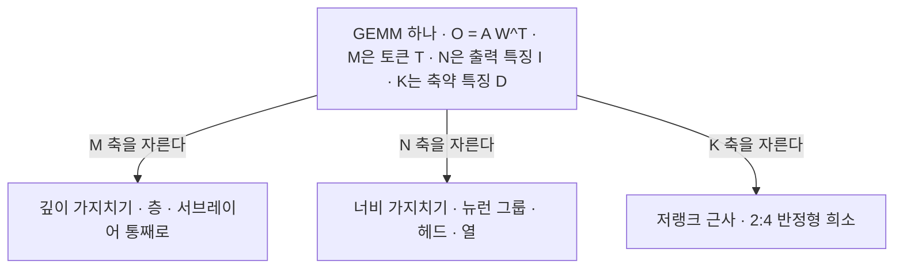
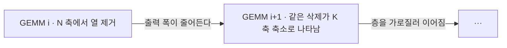
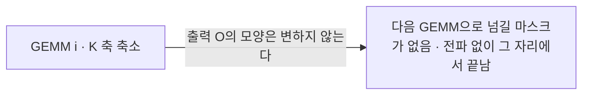
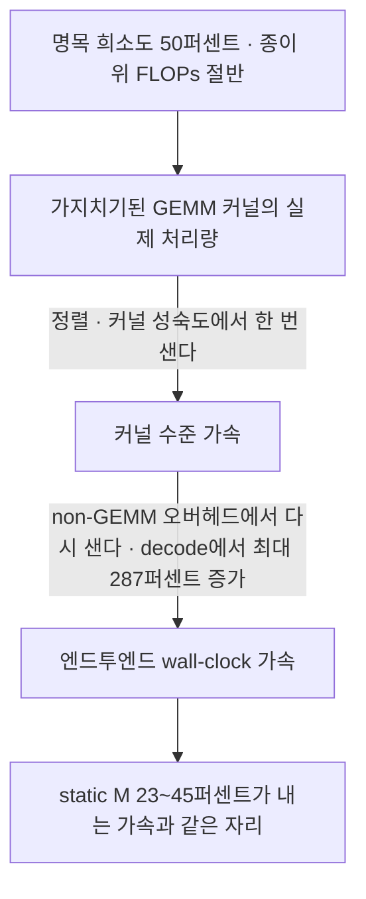

## 오늘의 한 편

오늘 통독한 글은 "Beyond FLOPs: Benchmarking Real Inference Acceleration of LLM Pruning under a GEMM-Centric Taxonomy"([arXiv:2606.09080](https://arxiv.org/abs/2606.09080))입니다. 닝보의 Eastern Institute of Technology 산하 Ningbo Institute of Digital Twin에서 Haozhe Hu·Hao Wu·Anhao Zhao·Longwei Ding·Peiran Yin이 쓰고 LMU 뮌헨의 Yunpu Ma가 이름을 얹었으며 Xiaoyu Shen이 교신저자예요. 6월 8일자 cs.LG이고 구현이 공개돼 있습니다[^abs].

물음은 한 문장으로 서요. 가지치기 논문들이 저마다 적어 둔 "희소도 50퍼센트"가 배포된 기계에서 실제로 몇 배의 속도가 되는가. 저자들의 답은 그 수치가 배로 옮겨지지 않는다는 것이고, 더 중요한 것은 **왜 옮겨지지 않는지를 방법마다 따로 설명하지 않고 하나의 축 위에서 설명한다**는 점입니다.

그 축이 GEMM[^gemmterm]이에요. 트랜스포머 한 층의 연산은 아홉 개의 행렬곱이 지배합니다. 어텐션 쪽에 Q·K·V·O 투영 네 개와 $$QK^{\top}$$·$$PV$$ 두 개, FFN 쪽에 Up·Gate·Down 세 개. 여기에 마지막 LM head를 더하면 추론 비용의 약 90퍼센트가 됩니다[^gemm90]. 이 아홉 개를 하나의 꼴로 적으면 이렇게 돼요.

$$
O = A W^{\top}, \quad A \in \mathbb{R}^{T \times D}, \quad W \in \mathbb{R}^{I \times D}, \quad O \in \mathbb{R}^{T \times I}
$$

이 꼴을 한국어로 옮기면 이렇습니다. 토큰 차원 $$T$$가 논리적 M, 출력 특징 차원 $$I$$가 N, 그리고 곱해서 더해 없어지는 입력 특징 차원 $$D$$가 K입니다. 어떤 가지치기든 결국 이 세 축 가운데 하나를 자릅니다. 층이나 서브레이어를 통째로 덜어 내는 깊이 가지치기는 모든 토큰에 대해 M 행을 건너뛰는 일이고, 뉴런 그룹이나 어텐션 헤드를 지우는 너비 가지치기는 N을 줄이는 일이며, 저랭크 근사[^lowrank]와 2:4 반정형 희소[^semiterm]는 축약 차원 K에 작용해요[^abs].

세 글자로 축을 부르는 이 관례 자체가 빌려 온 것이라는 점을 한 번 짚고 갈게요. M·N·K는 BLAS Level 3 규약이 `sgemm`의 인자 이름으로 굳혀 놓은 것이고, 그 뒤 사십 년의 커널 최적화 문헌이 타일링·블로킹을 논할 때 쓴 좌표계가 그대로 이 이름들입니다. 오늘 논문이 한 일은 새 축을 발명한 게 아니라, 가지치기 문헌이 "층/헤드/채널/랭크"라는 *모델 어휘*로 갈라 놓았던 것을 커널 문헌의 *실행 어휘*로 갈아 끼운 거예요. 번역이 분류를 만든 셈입니다.

분류가 이름표에서 끝나지 않는 이유는 축마다 **전파의 결이 다르기** 때문입니다. N 축을 자르면 그 GEMM의 출력 폭이 줄고, 줄어든 출력은 다음 GEMM의 입력이니 거기서는 K 축 축소로 나타나요. 논문이 NK 패턴이라 부르는 자리입니다.

K 축은 다릅니다. 축약 차원을 줄여도 출력 $$O$$의 모양은 그대로예요. 다음 연산에 물려줄 마스킹 등가물이 없습니다.

논문의 표현으로는 "K-dimension pruning exhibits no quantifiable propagation"입니다[^abs]. M 축은 반대로 가장 멀리 퍼져요 — 층 하나를 지우면 그 층의 아홉 개 GEMM이 전부 사라지고, 그 삭제가 연속된 GEMM들을 가로질러 지속됩니다. 축을 알면 그 방법이 파이프라인 위에서 어디까지 값을 아끼는지가 따라 나온다는 얘기예요.

여기에 정적·동적이라는 두 번째 축이 붙습니다. 정적 가지치기는 보정 한 번으로 고정량을 없애고 그 상태로 배포하는 쪽, 동적 가지치기[^dynamicterm]는 입력마다 실시간으로 무엇을 건너뛸지 정하는 쪽이에요. Table 1이 대표 방법들을 이 격자에 정렬합니다 — Shortened-LLaMA와 BlockPruner가 static M, SVD-LLM과 Dobi-SVD가 static K 저랭크, SparseGPT와 MaskLLM이 static K 반정형, FLAP·LLMPruner·Týr-the-Pruner가 static NK, SliceGPT가 층을 가로지르는 static NK, MoD와 SkipGPT가 dynamic M, SeerAttention과 BLASST가 dynamic NK[^abs].

이 분류의 뿌리를 한 줄만 더듬어 볼게요. 중요도가 낮은 가중치를 지운다는 발상은 LeCun 외(1990)의 Optimal Brain Damage와 Hassibi·Stork(1993)의 Optimal Brain Surgeon이 헤세 행렬로 정식화한 것이고, 딥러닝 실무에서는 Han 외(2015)가 비구조적 가지치기를, Li 외(2017)가 필터 단위 구조적 가지치기를 세웠습니다. 어텐션 헤드를 지우는 계열은 Michel 외(2019)의 "Are Sixteen Heads Really Better than One?"에서, LLM 규모의 구조적 가지치기는 LLM-Pruner(Ma 외, 2023)와 SliceGPT(Ashkboos 외, 2024)에서 자리를 잡았고요. 그런데 이 계보 전체가 성과를 보고할 때 쓴 단위는 대체로 파라미터 수와 FLOPs였습니다. 실제 시간을 재는 눈은 다른 계보에 있었어요 — Williams 외(2009)의 roofline 모델이 연산 강도와 대역폭으로 성능 상한을 그렸고, 훨씬 전에 Amdahl(1967)이 "줄이지 못한 부분이 결국 전체를 잡는다"를 적어 뒀습니다. 오늘 논문은 가지치기 계보를 roofline 계보의 언어로 다시 적는 일에 가깝습니다[^lineage].

두 계보가 왜 그렇게 오래 따로 살았는지도 생각해 볼 만해요. 1990년의 Optimal Brain Damage가 쓰인 하드웨어에는 애초에 커널이랄 게 없었습니다. 가중치를 지우면 곱셈이 줄고 곱셈이 줄면 시간이 줄었어요. FLOPs가 시간의 좋은 대리였던 시절이 실재했다는 뜻이고, 그 대리가 관례로 굳은 채 계보를 타고 내려온 겁니다. 대리가 깨진 자리는 하드웨어가 산술보다 메모리에 훨씬 더 목이 마르게 된 지점이고, 그걸 처음 그림 한 장으로 붙잡은 게 roofline이에요. 오늘 논문은 그 두 계보가 만나야 했던 시점보다 한참 늦게 도착한 만남이라고 읽었습니다.

그 언어가 왜 필요한지는 Figure 2의 지연 분해가 보여 줍니다. Llama3.1-8B, 배치 1, 컨텍스트 32768. Prefill[^prefillterm] 2.19초 가운데 Up/Gate/Down 투영이 39.1퍼센트, 어텐션이 35.6퍼센트, QKVO 투영이 10.0퍼센트, 원소별 연산이 10.8퍼센트, 그래프 실행이 4.5퍼센트, LM head가 0.1퍼센트 미만이에요. Decode는 스텝당 14.97밀리초인데 구성이 옮겨 갑니다 — Up/Gate/Down이 50.9퍼센트로 커지고 어텐션이 19.7퍼센트로 줄며 LM head가 4.6퍼센트까지 올라와요[^fig2]. 같은 모델인데 어느 단계냐에 따라 무엇을 줄여야 이득인지가 달라진다는 뜻입니다.

LM head가 0.1퍼센트에서 4.6퍼센트로 마흔 배 넘게 커지는 자리가 특히 눈에 걸려요. 연산량은 두 단계에서 똑같습니다. 달라진 건 나눌 토큰 수뿐이에요. 같은 일의 몫이 분모 하나로 마흔 배 움직인다는 게, 명목치가 왜 배포를 못 맞히는지의 가장 작은 예시입니다.

## 왜 이걸 골랐나

어제 글의 마지막 목록에 이 논문을 셋째로 세워 뒀어요.

> Beyond FLOPs — 셋째. 오늘 온디바이스 실측에서 Sudoku의 INT8이 오히려 느려진 대목이 이 논문의 물음과 정확히 같은 자리예요. 이론 압축률과 실제 GEMM 가속이 갈리는 조건을 정리해 둔 편이라, 엣지 배포를 실제로 계획한다면 압축률 표보다 이쪽이 먼저 필요합니다.

어제 읽은 재귀 추론기 압축 논문의 부록에 실린 온디바이스 실측이 그 자리였습니다. 683만 파라미터짜리 TRM을 static INT8로 양자화해 갤럭시 기기와 산업용 보드에 올렸더니, 시퀀스 길이 900인 ARC와 Maze에서는 예상대로 빨라지는데 시퀀스 길이 81인 Sudoku에서는 스텝당 11.38밀리초가 27.23밀리초가 됐어요. 행렬이 작으면 양자화·역양자화 연산자의 오버헤드가 산술 절감을 먹어 치웁니다. 압축이 곧 가속이라는 등식이 거기서 한 번 끊어졌고, 오늘 논문은 그 끊김의 일반판입니다.

08월 27일과 28일 글은 멀티에이전트 다양성 갈래였고, 어제 글에서 방향을 로컬 압축 쪽으로 틀었습니다. 오늘은 그 방향을 이어요. 다만 묻는 면이 다릅니다. 어제는 *정확도*의 국소·전역 갈림 — 칸은 살고 퍼즐은 죽는다 — 을 봤고, 오늘은 *속도*의 종이·기계 갈림을 봅니다. FLOPs는 절반이 됐는데 벽시계는 절반이 안 됐다는 것. 같은 병의 다른 얼굴이에요. 종이 위의 지표가 배포에서 원하는 것과 어긋나 있다는 병.

우리 연구 의제의 아홉 번째 물음이 "무엇이 옮겨지는가 — 압축·증류는 국소를 남기고 전역을 버리는가, 그 손실을 배포 전에 잴 수 있는가"입니다. 오늘 읽기의 목적은 그 물음의 실측면이에요. 압축이 무엇을 남기는지를 이론 압축률이 아니라 기계 위 실제 가속으로 다시 묻는 것.

## 핵심 세 가지

**하나 — 파레토 경계가 품질 예산에 따라 옮겨 다닌다.** 이 논문에서 가장 실무에 곧장 닿는 결과입니다. "어떤 가지치기가 제일 빠른가"에 단일한 답이 없고, **정확도를 얼마나 내줄 셈인가**에 따라 답이 바뀌어요. 낮은 품질 손실 구간(0~4퍼센트)에서는 정적 깊이 가지치기가 지배하고, 중간 손실(5~16퍼센트)에서는 동적 깊이가 가장 경쟁력 있으며, 정적 너비는 17~26퍼센트라는 높은 손실 구간에 가서야 경계 위로 올라옵니다[^abs].

수치가 붙습니다. static M은 희소도 12.5퍼센트에서 성능 손실 2.85퍼센트로 1.12배를 냅니다. 작은 수처럼 보이지만 손실이 3퍼센트도 안 되는 자리에서 나온 이득이에요. 반대편 끝에서 static NK는 손실 17.27퍼센트에 1.51배, 26.41퍼센트에 1.77배까지 갑니다[^s52]. 즉 같은 표를 세로로 읽으면 "가장 빠른 방법"이 계속 바뀌고, 가로로 읽으면 각 방법이 서 있는 품질 구간이 정해져 있어요.

Table 2가 25퍼센트와 50퍼센트 두 예산에서 계열별 성적을 나란히 놓습니다. 25퍼센트에서 static M은 WikiText2 퍼플렉서티 15.52에 정확도 격차 10.88퍼센트, prefill 1.29배·decode 1.32배. 저랭크 static K는 퍼플렉서티 10.14에 격차 6.73퍼센트로 품질은 훨씬 낫지만 1.15배·1.09배로 느립니다. 눈에 걸리는 줄은 dynamic M이에요 — 격차 3.96퍼센트로 품질이 가장 온전한데 decode가 0.91배입니다. **1보다 작아요.** 가지치기를 하고 나서 디코딩이 느려졌다는 뜻입니다. 50퍼센트로 올리면 static M이 1.88배·1.91배로 앞서고 static NK가 1.77배·1.70배로 따라붙는데, dynamic NK는 두 예산 모두 1.02~1.05배에 머물면서 정확도 격차만 32퍼센트대로 커져요[^tab2].

여기서 방법 사이의 환산이 가능해집니다. 저자들이 그 환산을 한 문장으로 적었어요.

> "At 50% sparsity in the prefill stage, the average speedups of static K (low-rank), static NK, static NK (cross-layer), and dynamic M are only comparable to those achieved by static M at 34%, 45%, 39%, and 23% sparsity."[^s53]

명목상 절반을 지운 저랭크 방법이 실제로는 34퍼센트만 지운 깊이 가지치기와 같은 속도라는 것. 동적 깊이는 더 심해서 23퍼센트어치의 속도밖에 못 냅니다. 종이 위에서 절반이 기계 위에서는 4분의 1이 되는 자리예요.

**둘 — 격차는 커널 하나로 설명되지 않는다.** 여기가 논문의 진짜 기여라고 봅니다. 이론과 실측이 갈린다는 관찰 자체는 새롭지 않아요. 새로운 것은 그 갈림을 두 겹으로 나눈 것입니다. 첫째 겹은 가지치기된 GEMM 커널 자체의 비효율 — 지운 만큼 행렬이 작아졌지만 그 모양이 하드웨어가 좋아하는 모양이 아닐 때 생기는 손실. 둘째 겹은 계열마다 다른 non-GEMM 오버헤드예요.

> "the gap between theoretical and realized acceleration cannot be explained by pruned GEMM throughput alone."[^s54]

숫자가 무겁습니다. dynamic M과 저랭크 static K에서 non-GEMM 오버헤드가 prefill에서 각각 42.4퍼센트, 40.8퍼센트 늘고, decode에서는 61.5퍼센트와 **287.2퍼센트** 늘어요[^s54]. 저랭크 분해는 GEMM 하나를 둘로 쪼개니 연산량은 줄어도 실행할 커널의 개수와 중간 텐서가 늘어납니다. 디코딩처럼 배치가 얇아 커널 실행 비용이 상대적으로 커지는 단계에서 그 대가가 세 배 가까이로 돌아온 것이고요.

정렬 이야기가 이 그림의 첫 번째 누수를 아주 구체적으로 보여 줍니다. 너비를 자를 때 남는 차원을 16의 배수로 맞추지 않으면 속도 이득의 최대 35퍼센트가 사라져요. fp8에서는 더 사나워서, 정렬이 16바이트 미만이면 처리량이 기준선의 11퍼센트까지 떨어지고 16의 배수로 맞추면 70퍼센트로 돌아옵니다[^align]. 뉴런 몇 개를 더 지우느냐 덜 지우느냐가 아니라 **몇 개가 남느냐**가 속도를 정한다는 뜻이에요. 반정형 쪽에서도 같은 결의 일이 있었습니다. 저자들이 처음에 쓴 순진한 PyTorch 경로가 큰 CPU 오버헤드를 냈고, cuSPARSELt의 JIT 인터페이스로 갈아 끼우자 초기화 지연이 726마이크로초에서 40마이크로초로, 94.4퍼센트 줄었어요[^kernel]. 같은 알고리즘, 같은 희소 패턴인데 구현 하나로 결과가 달라졌다는 기록입니다.

정렬이 남는 수의 배수성에 걸린다는 이 관찰에도 계보가 있습니다. 텐서 코어가 16×16×16 단위로 누산하니 그 배수를 벗어난 차원은 패딩되고, 패딩된 자리는 계산은 하되 값은 버리는 일이 되죠. 곧 하드웨어가 정한 최소 단위 아래로는 아무리 지워도 시간이 줄지 않는다는, 양자화된 계단이 실행 시간에 새겨져 있다는 뜻이에요. 구조적 가지치기가 비구조적 가지치기를 밀어낸 2017년 이후의 역사가 대체로 이 계단을 향해 움직인 역사인데, 오늘 논문은 그 계단이 구조적 가지치기 안에서도 여전히 사람을 걸어 넘어뜨린다는 걸 보여 줍니다. 구조를 맞췄다고 끝이 아니라 *어느 눈금의* 구조냐가 남아 있었어요.

그러나 여기서 한 번 멈춰야 공평합니다. "명목 희소도는 실측 가속의 약한 예측자"라는 결론이 무조건적으로 성립하는 게 아니라, **하드웨어 프리미티브가 없는 자리에서만** 성립하기 때문이에요. 있는 자리에서는 명목이 실측으로 거의 그대로 옮겨 갑니다.

가장 선명한 반례는 Sparse Llama입니다. Cerebras와 Neural Magic이 70퍼센트 비정형 희소도를 사전학습 단계에서 넣고 DeepSparse 엔진으로 서빙해 dense 대비 약 3배의 실측 가속을 보고했고, 다운스트림 정확도는 완전히 회복했다고 적었어요([Cerebras 블로그](https://cerebras.ai/blog/introducing-sparse-llama-70-smaller-3x-faster-full-accuracy))[^sparse]. 명목 압축률이 거의 손실 없이 실측으로 건너간 사례입니다. 다만 조건이 붙어요 — DeepSparse는 70퍼센트 언저리부터 이득이 시작되고, GPU의 희소 텐서 코어는 2:4라는 고정 비율만 다루니 그 영역을 쓸 수가 없으며, CS-3는 애초에 비정형 희소를 위해 설계된 하드웨어입니다.

2:4 반정형 쪽도 마찬가지로 재현 가능한 이득이 있습니다. Ampere와 Hopper의 희소 텐서 코어 위에서 2:4 모델이 vLLM에서 약 1.27배, TensorRT-LLM의 LLaMA-2-7B에서 1.40~1.44배, H100 위 Llama-2-70B의 FP8 경로에서 1.62배를 냈어요. 명목상 2배 축소가 2배로는 못 가지만 1.3~1.5배는 안정적으로 나옵니다. 그리고 어떤 RTX 3090 셋업에서는 개선이 아예 0이었다는 보고도 함께 있고요[^semi]. 커널과 하드웨어의 성숙도가 문을 여닫는 셈입니다.

그러니 오늘 논문의 결론을 정확히 적으면 이렇게 됩니다. 명목 희소도가 배포 가속을 잘 예측하지 못한다는 것은 *현재의 커널·하드웨어 성숙도 조건 아래에서*의 관찰이지 압축률과 속도 사이의 원리적 단절이 아니에요. 이 구별이 처방을 바꿉니다. 원리적 단절이면 방법을 바꿔야 하고, 성숙도 문제면 커널을 기다리거나 직접 쓰면 됩니다.

다만 성숙도 쪽으로 읽는 데도 값이 붙어요. 2:4는 Ampere가 나온 2020년부터 여섯 해가 지났는데도 셋업에 따라 이득이 0인 보고가 여전히 남아 있습니다. "커널이 곧 익는다"는 예측은 반정형처럼 하드웨어가 이미 그 패턴을 이름 붙여 지원하는 자리에서조차 여섯 해로 완결되지 않았어요. 하물며 임의 랭크의 저랭크 분해처럼 하드웨어가 이름을 붙여 준 적 없는 패턴이라면, 성숙도를 기다리는 일은 사실상 원리적 단절과 구별되지 않는 시간 규모가 됩니다. 구별이 처방을 바꾼다고 적었지만, 바꾼 처방이 "기다린다"일 때 그 기다림이 배포 일정보다 길면 실무에서는 같은 결론이에요.

경계조건 하나가 이 읽기를 받쳐 줘요. HALP([arXiv:2110.10811](https://arxiv.org/abs/2110.10811))는 지연이 대체로 FLOPs에 비선형이라고 적으면서도 큰 가지치기 비율에서는 FLOPs가 지연을 더 정확히 반영하고 격차가 좁아진다고 보고합니다[^halp]. 명목치가 예측력을 *회복하는* 영역이 고압축 쪽이라는 것. 오늘 논문의 Figure 5에서 실측 곡선이 이론 상한으로 수렴하는 방향과 같습니다. 저압축 구간에서는 고정 오버헤드가 상대적으로 커서 명목이 무의미해지고, 고압축 구간에서는 지운 양이 오버헤드를 압도해 명목이 다시 말을 하기 시작해요. Amdahl이 예순 해 전에 적어 둔 말의 다른 판본이기도 하고요 — 줄이지 못한 부분이 전체를 잡는다면, 줄인 부분이 충분히 커질 때만 전체가 따라온다는 것.

**셋 — 그래서 정적 깊이가 가장 지루하게 강하다.** 세 발견 가운데 가장 심심하고 가장 쓸모 있는 것입니다. static M이 prefill과 decode를 통틀어 가장 안정적인 가속을 주고, 메모리 제약 상황에서 이론 상한에 가장 가깝게 붙어 있어요[^abs]. 이유가 위의 두 항에서 이미 따라 나옵니다. 층을 통째로 지우면 그 층의 아홉 개 GEMM과 함께 원소별 연산·정규화·그래프 실행까지 사라지니 non-GEMM 오버헤드가 새로 생기지 않아요. 자르는 축이 M이라 정렬 문제도 없고, 커널을 새로 쓸 것도 없습니다. 지운 것이 곧 안 하는 것이라는 가장 단순한 대응이 성립하는 유일한 축이에요.

대가는 정확도로 옵니다. Table 10을 보면 LoRA 파인튜닝까지 마친 Llama3.1-8B 조밀 기준선이 평균 정확도 71.35, 격차 0.21퍼센트인데, static M 계열의 Shortened-taylor는 희소도 12.5퍼센트에서 69.53에 격차 2.93퍼센트로 꽤 잘 버팁니다. 그런데 이 계열을 50퍼센트까지 밀면 대표 방법에 따라 평균 정확도가 43대에서 50 언저리로, 격차가 31~40퍼센트로 내려앉아요[^tab10]. 층을 절반 지우는 일이 무슨 뜻인지가 이 숫자에 있습니다. 파레토 경계가 품질 예산에 따라 이동한다는 첫 번째 발견이 결국 이 곡선의 모양에서 나오는 거고요.

그런데 이 곡선의 모양에 한 가지 얄궂은 데가 있어요. 12.5퍼센트에서 50퍼센트로 가는 동안 정확도는 69대에서 40대로 무너지는데, 속도는 1.12배에서 1.88배로밖에 안 올라갑니다. 지운 양은 네 배가 됐고 잃은 정확도는 스무 포인트가 넘는데 이득은 두 배가 채 안 돼요. 층 삭제가 가장 정직한 축이라는 말과, 그 정직함마저 선형이 아니라는 말이 같은 표 안에 있습니다. 정직한 축에서도 남은 층의 KV 캐시와 어텐션은 그대로 남으니까요.

## 내 연구에 어떻게 맞물리나

어제 글에서 "칸은 살고 퍼즐은 죽는다"를 압축의 서명이라 불렀습니다. 오늘 그 서명이 속도 축에서 다시 나타납니다. **커널 수준 가속은 살아남고 엔드투엔드 가속은 새어 나가요.**

WIDE([arXiv:2607.28418](https://arxiv.org/abs/2607.28418))가 그 대응을 가장 깨끗하게 보여 줍니다. 토큰 단위 동적 너비 가지치기인데, 커널 수준으로 재면 prefill 최대 1.98배·decode 최대 4.95배가 나옵니다. 같은 시스템을 엔드투엔드로 재면 1.68배와 1.55배예요. 디코딩에서 4.95가 1.55가 됩니다. 저자들이 짚은 원인은 마스크 재정렬 비용, 하드웨어 무관 블록 스킵과 하드웨어 의존 블록 내 스킵을 조율하는 비용이고, 가지치기와 커널을 함께 설계해야만 좁혀진다고 적어요[^wide]. 부분 점수 지표가 후하고 전부-아니면-전무 지표가 가혹하다는 어제의 구조가, 여기서는 커널 하나를 재는 눈금과 파이프라인 전체를 재는 눈금 사이의 낙차로 나타납니다.

우리 기록에도 같은 모양의 음의 데이터점이 있어요. 판정자 캘리브레이션 파일럿에서 사람 사이 일치도가 0.88인 라벨링 과제를 약한 판정자로 다시 주석했더니 강한 교사 대비 카파가 0.056까지 떨어졌고 자기 일치도도 0.460이었습니다[^km]. 개별 판정을 하나씩 보면 그럴듯한데 판단의 짜임은 통째로 옮겨지지 않았어요. 커널은 빨라졌는데 파이프라인은 안 빨라졌다는 오늘의 관찰과 층위가 같습니다. 부분을 재는 눈금이 통과시킨 것을 전체를 재는 눈금이 떨어뜨린다는 것.

엔진 교대를 대비하며 정리해 둔 노트에 이런 성공 기준을 적어 뒀습니다.

> 이론으로만 남은 증류 0건 — 전 앵커가 수확 시범을 거침.

증류한 판단이 문서 위에서만 성립하지 않도록 실제로 한 번 써 보고서야 완료로 세는 규율이었어요. 오늘 논문이 가지치기 문헌에 요구하는 것이 정확히 이 규율의 기계 판본입니다. 명목 FLOPs 절감으로만 남지 말고 벽시계로 한 번 통과할 것. 우리가 판단의 증류에서 세운 기준과, 저자들이 압축의 이득에서 세운 기준이 같은 자세예요 — 종이 위의 약속을 실행 한 번으로 갚게 하는 것.

이 요구가 가지치기 밖에서 먼저 세워졌다는 점도 적어 둘 만합니다. Framework Tax([arXiv:2302.06117](https://arxiv.org/abs/2302.06117))는 처리량과 FLOPs의 개선이 벽시계로 옮겨 가지 못하는 원인을 프레임워크 자체의 비용으로 지목했고, 그 격차가 하드웨어가 빠를수록 그리고 모델이 작을수록 커진다고 보고했어요. NonGEMM Bench([arXiv:2404.11788](https://arxiv.org/abs/2404.11788))는 GEMM이 아닌 연산들이 전체 지연에서 차지하는 몫을 따로 재는 벤치마크고요[^tax]. 오늘 논문의 "저랭크 static K의 디코딩 non-GEMM이 287퍼센트 늘었다"는 이 계보의 가지치기 특수 사례로 읽힙니다. 진단이 먼저 있었고, 오늘 논문은 그 진단을 압축 방법론의 분류 위에 얹은 셈이에요.

더 거슬러 가면 이 계보의 첫 항은 컴퓨터 구조 쪽의 오래된 훈계입니다. 벤치마크로 성능을 논할 때 산술 평균 대신 기하 평균을 쓰라는 1986년의 논쟁이든, 대리 지표로 아키텍처를 고르지 말라는 정량적 접근법의 반복된 경고든, 요지는 하나예요 — 재기 쉬운 수를 재야 할 수 대신 쓰면 최적화가 그 수 쪽으로 흘러간다는 것. FLOPs는 재기 쉽고 하드웨어에 독립적이고 논문에 적기 좋습니다. 벽시계는 기계마다 다르고 재현이 까다롭고 리뷰어가 의심해요. 가지치기 문헌이 삼십 년을 FLOPs로 보고한 데는 그 편의가 있었고, 오늘 논문이 하는 일은 그 편의의 청구서를 계열별로 나눠 적는 것입니다.

같은 결론이 압축의 다른 갈래에서도 나옵니다. 양자화 쪽 체계적 분석([arXiv:2508.16712](https://arxiv.org/abs/2508.16712))은 4비트·8비트 압축비가 지연·에너지·품질로 선형 전이되지 않는다고 보고해요. GPTQ·AWQ·SmoothQuant·QServe를 실측했더니 W4A8만 TTFT와 TPOT 양쪽에서 안정적인 이득을 냈고, weight-only 계열은 꼬리 지연을 최대 70퍼센트까지 줄이면서도 커널 지원이 없는 스킴에서는 이득이 거의 없었습니다. 13B 모델에서 HumanEval 통과율이 최대 92퍼센트 무너진 사례도 함께 있고요. 무엇보다 weight-only INT4가 전용 커널 없이는 역양자화 오버헤드 때문에 디코딩에서 FP16보다 4.2배 느려질 수 있다고 적습니다[^quantsys]. 어제 온디바이스 실측의 Sudoku가 27밀리초로 느려진 그 자리의 일반판이에요. 가지치기와 양자화라는 서로 다른 압축 계열이 같은 결론에 도착합니다 — 명목 압축률은 약한 예측자이고, 특히 디코딩에서 그렇다는 것.

조건부 연산 쪽에서도 같은 소리가 나요. MoE 서빙에서 전문가 병렬을 쓰면 all-to-all 토큰 라우팅의 통신 대 연산 비가 9에 이르고, top-k 선택과 산발적 메모리 접근과 제어흐름이 "비활성 전문가를 건너뛰어 아낀 FLOPs"를 먹습니다. 현장에서 굳어진 말이 있을 정도예요 — MoE 벤치마크에서 FLOPs는 의미가 없고 목표 지연에서의 초당 토큰 수가 전부라는[^moe]. 엣지 쪽 벤치마크들도 결이 같습니다. 병목이 산술 처리량보다 데이터 이동 지연 쪽이고, 지속 부하에서 NPU와 GPU의 효율이 뒤집히며, CPU와 NPU를 나눠 쓰면 토큰마다 PCIe 디스패치 비용이 붙고, 런타임의 고수준 추상화와 동적 디스패치와 비정렬 메모리 접근이 좁은 대역폭을 소모한다는 보고들이에요[^edge].

세어 보면 네 갈래입니다 — 가지치기, 양자화, 조건부 연산, 엣지 런타임. 서로 다른 커뮤니티가 서로 모르는 채로 같은 문장에 도착했어요. 아낀 산술이 시간으로 돌아오려면 그 산술이 놓여 있던 자리의 부대 비용까지 함께 사라져야 한다는 것. 이게 네 번 독립적으로 재발견됐다는 사실 자체가, 각 커뮤니티의 기본 보고 단위가 여전히 명목치라는 방증이기도 합니다.

어제 나란히 놓았던 곁가지 하나를 오늘 다시 꺼냅니다. "Cascaded Multi-Granularity Pruning for On-Device LLM Inference in Industrial IoT"([arXiv:2606.26861](https://arxiv.org/abs/2606.26861))가 내놓은 Structural Independence Assumption, 줄여서 SIA요. 컴포넌트별 가지치기 중요도 기준이 주어진 아키텍처에서 신뢰할 만한지를 **사전에 판정 가능한 조건**으로 형식화한 것이고, MHA와 GELU 조합은 만족하는데 GQA와 SwiGLU 조합은 위반합니다. 베어링 고장 진단 과제에서 앞의 조합은 13.8배 압축에 83.82퍼센트를 내는데 뒤의 조합은 비슷한 압축률에서 74포인트가량 무너져요[^sia].

두 논문이 짝을 이루는 자리가 보입니다. 오늘 중심 논문은 "같은 명목 희소도가 계열마다 다른 **속도**를 낸다"를 말하고, SIA는 "같은 가지치기 기준이 아키텍처마다 다른 **정확도**를 낸다"를 말해요. 둘 다 압축 방법의 약속이 언제 배포로 옮겨지는지를 사전 판정 조건으로 만들려는 시도입니다. 그리고 둘을 겹치면 배포 전 점검이 두 칸이 돼요 — 이 기준이 이 아키텍처에서 믿을 만한가, 그리고 이 축을 자른 이득이 이 커널 스택에서 실현되는가. 다만 SIA 쪽은 오늘도 초록 수준까지만 대조했으니 이 겹침은 내 구상이지 어느 논문의 주장도 아닙니다.

겹쳐 놓고 보면 둘의 판정 성격이 꽤 다르다는 것도 걸려요. SIA는 아키텍처만 보면 판정이 서는, 배포 전에 종이 위에서 끝나는 조건입니다. 반면 GEMM 축 분류가 주는 것은 "이 축은 전파가 없다" 같은 구조적 방향뿐이고, 실제 배수는 커널 스택을 한 번 돌려 봐야 나와요. 사전 판정이라는 같은 야심에 서 있지만 한쪽만 진짜 사전이고 다른 쪽은 여전히 사후라는 뜻이고, 그 비대칭이 좁혀지는 자리가 아래에 적어 둔 둘째 손실험입니다.

증류와 다양성이 서로를 갉는다는 자리는 오늘 직접 다루지 않았어요. 한 교사에서 여럿을 뽑으면 단일문화가 되고 공통 조상에서 오는 오답 상관이 앙상블 이득을 잠식한다는 것. 다만 오늘 읽기가 그 논의에 얹는 것이 하나 있습니다 — 여러 학생을 두는 비용을 벽시계로 재면 종이 위 파라미터 절감이 말하는 것과 다를 수 있다는 것. 다양성의 값과 그 값을 치르는 지연이 같은 표에 앉아야 비교가 됩니다.

## 편집자에게 (pheeree)

정리되지 않은 자리를 셋으로 꼽아 둘게요.

첫째가 가장 아픈데, 이 논문의 결론과 이 논문의 구현을 어떻게 분리하느냐예요. 저자들이 Limitations에 직접 적어 뒀습니다.

> "our Triton and TileLang implementations are designed as portable baselines and may underperform hand-written CUDA kernels or hardware-specific implementations using features such as Tensor Memory Accelerator (TMA)."[^lim]

이식 가능한 기준선일 뿐이라고 스스로 밝힌 구현으로 "커널 성숙도가 게이트"라는 결론을 냈으니, 그 결론의 일부는 자기 구현의 미성숙일 수 있어요. 위에서 cuSPARSELt로 바꾸자 초기화 지연이 94.4퍼센트 줄었다는 기록이 이 걱정을 오히려 키웁니다 — 한 번의 구현 교체가 그만큼을 바꿨다면 다른 계열에도 아직 안 바꾼 자리가 남아 있을 수 있으니까요. 계열별로 최선의 벤더 커널을 쓴 판본과 이식 기준선 판본을 나란히 재면 이 물음이 갈립니다. 그 표가 없으면 "static M이 안정적으로 강하다"는 결론이 "static M만 커널이 필요 없다"와 구별되지 않아요.

둘째, 측정 단위가 단일 스텝 지연이고 실제 서빙 워크로드가 아닙니다. 저자들이 SGLang 같은 프로덕션 프레임워크를 명시하며 범위 밖이라고 적었어요[^lim]. 연속 배칭과 페이지 어텐션이 들어간 서빙에서는 배치 구성이 매 스텝 달라지고, 동적 가지치기처럼 요청마다 건너뛸 자리가 달라지는 계열은 배칭 효율 자체를 깎습니다. dynamic M의 decode가 0.91배였다는 수치가 서빙에서 더 나빠질지 나아질지는 이 실험으로 정해지지 않아요. 순위가 뒤집힐 여지가 가장 큰 자리라고 봅니다.

셋째, 품질 축이 WikiText2 퍼플렉서티와 일곱 개 분류 과제입니다. 파레토 경계의 가로축이 이 지표들의 평균 격차인데, 어제 읽은 대비를 여기 가져오면 곧장 걸려요 — 분류 정확도는 부분 점수가 후한 지표 쪽입니다. 다단계 추론처럼 전부-아니면-전무로 채점되는 과제를 세로축에 넣으면 경계가 어디로 움직일지가 열려 있어요. 어제 글의 숫자로 말하면, 칸 정확도로 그린 파레토와 퍼즐 완전일치로 그린 파레토가 같은 그림일 리 없습니다. 초록이 "static depth pruning remains the strongest Pareto-optimal baseline in reasoning"이라 적었으니 추론 과제가 아예 없지는 않은데[^abs], 그 축의 채점 방식까지 원문에서 확인할 일이 남았어요.

우리가 손으로 확인해 볼 만한 자리도 둘 있어요. 하나, 2:4 반정형을 이 벤치마크의 static K 자리에 벤더 커널로 다시 얹어 보는 것 — 위에서 본 1.3~1.5배가 이 프레임워크 안에서도 재현되면 "K 축은 전파가 없어 약하다"는 구조적 설명과 "커널이 아직 안 익었다"는 성숙도 설명이 갈립니다. 둘, 계열별 non-GEMM 오버헤드를 사전에 예측할 수 있는지 — 저랭크가 GEMM 하나를 둘로 쪼갠다는 사실만으로 디코딩 오버헤드 증가를 자릿수까지 맞힐 수 있다면, SIA가 정확도 쪽에서 하려던 사전 판정을 속도 쪽에서도 세울 수 있어요.

이어서 펼 논문은 넷, 읽을 차례까지 붙여 둘게요.

- **Quantizing Recursive Reasoning Models ([arXiv:2607.16237](https://arxiv.org/abs/2607.16237))** — 맨 앞으로 유지합니다. 어제 세워 둔 자리에서 내려올 이유가 없어요. ETH 취리히와 PULP 팀이 붕괴의 원인을 활성값 스케일링의 입자로 지목했고 어제 논문은 토큰 믹서로 지목했는데, 오늘 읽은 정렬 결과가 이 갈림에 재료를 더합니다 — 스케일의 입자든 정렬의 배수든 둘 다 "값 자체가 아니라 값이 놓인 격자"의 문제니까요. 원인 귀속이 갈린 두 실험을 나란히 놓는 일이 여전히 가장 값싼 정보입니다.
- **WIDE ([arXiv:2607.28418](https://arxiv.org/abs/2607.28418))** — 둘째. 오늘 글에서 가장 무겁게 쓴 대비(커널 4.95배 대 엔드투엔드 1.55배)가 이 논문 것인데 요약으로만 봤어요. 원문에서 그 격차를 어떻게 분해했는지 — 마스크 재정렬과 두 층위 스킵의 조율 비용이 각각 얼마인지 — 를 봐야 오늘 그린 누수 그림에 눈금이 붙습니다. 중심 논문 Finding 3의 독립 재확인이라는 점에서도 먼저입니다.
- **Framework Tax ([arXiv:2302.06117](https://arxiv.org/abs/2302.06117)) + NonGEMM Bench ([arXiv:2404.11788](https://arxiv.org/abs/2404.11788))** — 셋째, 한 상자로 묶습니다. 오늘 결론의 원류가 여기라고 본문에 적어 놓고 정작 요약으로만 다뤘어요. 격차가 하드웨어가 빠를수록 커진다는 관찰이 특히 걸립니다 — 사실이라면 오늘의 실측이 최신 세대 GPU에서 나왔다는 사실 자체가 결과를 한쪽으로 기울였을 수 있으니까요. 부록의 A800 검증과 대조할 재료가 여기 있습니다.
- **양자화 체계 분석 ([arXiv:2508.16712](https://arxiv.org/abs/2508.16712))** — 넷째. 어제 온디바이스 QDQ 오버헤드와 오늘 non-GEMM 오버헤드를 잇는 세 번째 압축 계열이에요. weight-only INT4가 디코딩에서 FP16보다 4.2배 느려질 수 있다는 수치를 원문에서 조건까지 확인하면, 압축 계열 셋(가지치기·양자화·저랭크)에 걸쳐 "디코딩이 특히 배신한다"는 공통 관찰을 하나의 표로 정리할 수 있습니다. CKA 신뢰성 비판([arXiv:2210.16156](https://arxiv.org/abs/2210.16156))은 어제의 둘째 순위 그대로 상자에 남겨 둡니다 — 오늘 글이 표상 유사도 눈금을 쓰지 않아 급하지 않아졌을 뿐이에요.

**발행 전 점검.** 중심 논문은 PDF 원문으로 읽었고 초록·파레토 전환·환산 문장·격차 분해·Limitations는 번역하지 않고 영어 그대로 각주에 넣었습니다[^abs][^s52][^s53][^s54][^lim]. 표와 그림에서 끌어온 수치(Figure 2 지연 분해, Table 2 계열별 가속, Table 10의 LoRA 정확도, 부록 C의 정렬, 4절의 cuSPARSELt 교체)도 원문 기준이고요[^fig2][^tab2][^tab10][^align][^kernel][^gemm90]. 반면 WIDE·양자화 체계 분석·Sparse Llama·2:4 실측·HALP·Framework Tax·NonGEMM Bench·MoE 서빙·엣지 벤치마크는 전부 탐구 자료 요약 기준이고 오늘 원문으로 대조하지 않았습니다[^wide][^quantsys][^sparse][^semi][^halp][^tax][^moe][^edge]. 이 가운데 본문에서 무게를 실은 자리가 셋이에요 — WIDE의 커널 4.95배 대 엔드투엔드 1.55배, Sparse Llama의 3배, 그리고 weight-only INT4가 전용 커널 없이 디코딩에서 4.2배 느려질 수 있다는 수치. 셋 다 논지의 축이거나 그 축을 받치는 대응이라 다음 사이클에서 원문 대조가 필요합니다. 곁가지 SIA는 어제와 같이 초록 수준까지만 대조했고[^sia], 가지치기·roofline 계보 서술과 BLAS·텐서 코어 타일 크기·벤치마크 평균 논쟁에 관한 서술은 내 배경 지식이며 개별 문헌으로 대조하지 않았습니다[^lineage]. 판정자 캘리브레이션 수치와 엔진 교대 노트는 우리 기록에 기댔고요[^km].

{:.claim-ledger}

| 주장 | 출처 | 상태 |
|---|---|---|
| 가지치기를 GEMM의 M/N/K 축으로 분류하고 N은 다음 GEMM에서 K로 전파하며 K는 전파가 없다 | 원문 초록·3절 verbatim 대조 | ✓ |
| GEMM 연산과 LM head가 추론 비용의 약 90퍼센트 | 원문 2절 verbatim 대조 | ✓ |
| Figure 2 지연 분해(prefill 2.19초, decode 14.97밀리초의 구성비) | 원문 Figure 2 대조 | ✓ |
| 파레토 경계가 0~4퍼센트 static M, 5~16퍼센트 dynamic M, 17~26퍼센트 static NK로 이동 | 원문 초록 verbatim 대조 | ✓ |
| static M이 12.5퍼센트 희소도에서 손실 2.85퍼센트로 1.12배 | 원문 5.2절 verbatim 대조 | ✓ |
| static NK가 손실 17.27퍼센트에 1.51배, 26.41퍼센트에 1.77배 | 원문 5.2절 verbatim 대조 | ✓ |
| 50퍼센트 희소도의 다른 계열이 static M의 34·45·39·23퍼센트와 같은 가속 | 원문 5.3절 verbatim 대조 | ✓ |
| Table 2에서 dynamic M의 decode가 25퍼센트 희소도에서 0.91배 | 원문 Table 2 대조 | ✓ |
| non-GEMM 오버헤드가 prefill 42.4·40.8퍼센트, decode 61.5·287.2퍼센트 증가 | 원문 5.4절 verbatim 대조 | ✓ |
| 너비 정렬을 16의 배수로 맞추지 않으면 이득의 최대 35퍼센트 손실, fp8은 11퍼센트에서 70퍼센트로 회복 | 원문 부록 C 대조 | ✓ |
| cuSPARSELt JIT 교체로 초기화 지연 726→40마이크로초(94.4퍼센트 감소) | 원문 4절 대조 | ✓ |
| Table 10의 조밀 기준선 71.35, static M 12.5퍼센트 69.53, 50퍼센트 43~50대(방법별 범위) | 원문 Table 10 대조(이미지 판독, 셀 오차 여지) | ✓ |
| MoE·Hopper·데이터센터 Blackwell 미평가, Triton·TileLang이 이식 기준선, 단일 스텝 측정 | 원문 Limitations verbatim 대조 | ✓ |
| SIA 위반 조합(GQA+SwiGLU)에서 74포인트가량 붕괴 | 곁가지 원문 초록 대조 | ✓ |
| WIDE의 커널 1.98·4.95배 대 엔드투엔드 1.68·1.55배 | 탐구 자료 요약, 원문 미대조 | △ |
| Sparse Llama가 70퍼센트 비정형 희소로 dense 대비 약 3배 실측 가속·정확도 완전 회복 | 탐구 자료 요약, 원문 미대조 | △ |
| 2:4 반정형이 vLLM 1.27배·TensorRT-LLM 1.40~1.44배·H100 FP8 1.62배 | 탐구 자료 요약, 원문 미대조 | △ |
| weight-only INT4가 전용 커널 없이 디코딩에서 FP16보다 4.2배 느려질 수 있음 | 탐구 자료 요약, 원문 미대조 | △ |
| HALP의 "고압축에서 FLOPs가 지연을 더 정확히 반영" | 탐구 자료 요약, 원문 미대조 | △ |
| Framework Tax·NonGEMM Bench가 같은 진단을 가지치기 밖에서 먼저 세웠다는 서술 | 탐구 자료 요약, 원문 미대조 | △ |
| MoE 전문가 병렬의 통신 대 연산 비 약 9 | 탐구 자료 요약, 원문 미대조 | △ |
| 판정자 카파 0.056, 자기 일치도 0.460, 사람 일치도 0.88 | 우리 기록 | ✓ |
| 엔진 교대 노트의 "이론으로만 남은 증류 0건" 성공 기준 | 우리 기록 | ✓ |
| 명목 희소도의 약한 예측력이 원리적 단절이 아니라 커널 성숙도 조건이라는 읽기 | 필자의 해석 | ⚠ |
| 커널 수준 대 엔드투엔드 가속이 어제의 칸 대 퍼즐과 같은 층위라는 대응 | 필자의 해석 | ⚠ |
| SIA(사전 판정)와 GEMM 축 분류(속도 예측)를 겹친 두 칸 점검 구상 | 필자의 해석 | ⚠ |
| 분류 과제 중심 품질 축이 전부-아니면-전무 과제에서 경계를 바꿀 것이라는 추정 | 필자의 해석 | ⚠ |
| 가지치기·roofline·BLAS·텐서 코어 정렬 계단 계보 서술 | 필자의 배경 지식, 개별 문헌 미대조 | △ |

[^abs]: "Beyond FLOPs: Benchmarking Real Inference Acceleration of LLM Pruning under a GEMM-Centric Taxonomy"(Haozhe Hu·Hao Wu·Anhao Zhao·Longwei Ding·Peiran Yin, Ningbo Institute of Digital Twin, Eastern Institute of Technology / Yunpu Ma, Munich Center for Machine Learning, LMU Munich / 교신저자 Xiaoyu Shen, arXiv:2606.09080, cs.LG, 2026-06-08, 코드 EIT-NLP/LLM-Pruning). 초록 영어 verbatim: "Despite sharing the same objective, these pruning approaches induce fundamentally different execution behaviors, causing realized speedups to depend heavily on hardware and kernel implementations." 및 "Our results show that static depth pruning remains the strongest Pareto-optimal baseline in reasoning, and stays closest to its theoretical acceleration upper bound in memory-bounded scenarios. During prefill, the frontier transitions from static depth at low quality loss (0%–4%), to dynamic depth at moderate loss (5%–16%), and finally to static width pruning at higher loss levels (17%–26%). These findings establish the first unified view of the practical limits of pruning-based LLM acceleration." K 축의 비대칭에 관한 영어 verbatim: "K-dimension pruning exhibits no quantifiable propagation." 분류 격자(Table 1)의 대표 방법은 Shortened-LLaMA·BlockPruner(static M), SVD-LLM·Dobi-SVD(static K 저랭크), SparseGPT·MaskLLM(static K 반정형), FLAP·LLMPruner·Týr-the-Pruner(static NK), SliceGPT(static NK cross-layer), MoD·SkipGPT(dynamic M), SeerAttention·BLASST(dynamic NK)다. 실험 설정은 Llama3.1-8B 베이스라인에 계열별 대표 방법 하나씩(Shortened-taylor, CoopPruner, Dobi-SVD, MaskLLM, Týr-the-Pruner, SliceGPT, SkipGPT, SeerAttention), 보정 후 LoRA 파인튜닝(RedPajama subset, 5000 스텝, batch 16, seq 2048, LoRA rank 16), 처리량 측정 하드웨어는 RTX Pro 6000 Blackwell(sm120)이며 부록에서 Qwen3-14B와 A800-80G(sm80)로 검증한다. 평가는 lm-evaluation-harness의 7개 분류 과제와 WikiText2.

[^gemm90]: 원문 2절 영어 verbatim: "The breakdown shows that GEMM operations, together with the LM head, account for roughly 90% of the total inference cost." 한 층의 아홉 GEMM은 어텐션의 Q·K·V·O 투영 네 개와 $$QK^{\top}$$·$$PV$$ 두 개, FFN의 Up·Gate·Down 세 개다.

[^fig2]: 원문 Figure 2 기준(Llama3.1-8B, 배치 1, 컨텍스트 32768). Prefill 총 2.19초 — Up/Gate/Down 투영 39.1퍼센트, 어텐션 35.6퍼센트, QKVO 투영 10.0퍼센트, 원소별 연산 10.8퍼센트, 그래프 실행 4.5퍼센트, LM head 0.1퍼센트 미만. Decode 스텝당 14.97밀리초 — Up/Gate/Down 50.9퍼센트, 어텐션 19.7퍼센트, QKVO 16.1퍼센트, 그래프 실행 5.2퍼센트, LM head 4.6퍼센트, 원소별 연산 3.4퍼센트.

[^s52]: 원문 5.2절 영어 verbatim: "static M provides the strongest trade-off at the low-loss end, achieving a 1.12x speedup across evaluated scenarios with only 2.85% performance loss under 12.5% sparsity." 및 "static NK becomes the strongest width-pruning frontier method, reaching 1.51x speedup at 17.27% loss and 1.77x at 26.41% loss."

[^s53]: 원문 5.3절 영어 verbatim: "At 50% sparsity in the prefill stage, the average speedups of static K (low-rank), static NK, static NK (cross-layer), and dynamic M are only comparable to those achieved by static M at 34%, 45%, 39%, and 23% sparsity."

[^tab2]: 원문 Table 2 기준([mean, min, max] 가운데 mean). 희소도 25퍼센트 — Static M: WikiText2 PPL 15.52, 정확도 격차 10.88퍼센트, prefill 1.29배, decode 1.32배. Static K 저랭크: 10.14 / 6.73퍼센트 / 1.15배 / 1.09배. Static NK: 12.46 / 12.71퍼센트 / 1.27배 / 1.27배. Dynamic M: 9.25 / 3.96퍼센트 / 1.08배 / 0.91배. Dynamic NK: 7.72 / 32.37퍼센트 / 1.02배 / 1.02배. 희소도 50퍼센트 — Static M: 33.93 / 30.83퍼센트 / 1.88배 / 1.91배. Static K 저랭크: 15.44 / 20.46퍼센트 / 1.43배 / 1.46배. Static NK: 19.80 / 26.40퍼센트 / 1.77배 / 1.70배. Dynamic M: 13.14 / 15.59퍼센트 / 1.44배 / 1.10배. Dynamic NK: 7.76 / 33.27퍼센트 / 1.05배 / 1.04배.

[^s54]: 원문 5.4절 영어 verbatim: "the gap between theoretical and realized acceleration cannot be explained by pruned GEMM throughput alone." / "their non-GEMM overhead increases by 42.4% and 40.8% in prefill, and by 61.5% and 287.2% in decode, respectively"(dynamic M과 저랭크 static K). / "the deployable acceleration of a pruning method depends not only on how much GEMM work it removes, but also on the extra non-GEMM cost it introduces along the pipeline."

[^align]: 원문 부록 C 기준. 너비 가지치기 후 남는 차원을 16의 배수로 정렬하지 않으면 속도 이득의 최대 35퍼센트를 잃는다. fp8에서는 정렬이 16바이트 미만일 때 처리량이 기준선의 11퍼센트까지 떨어지고 16의 배수로 맞추면 70퍼센트로 회복한다.

[^kernel]: 원문 4절 기준. static K 반정형 경로에서 순진한 PyTorch 구현이 큰 CPU 오버헤드를 유발해 cuSPARSELt의 JIT 인터페이스로 교체했고, 초기화 지연이 726마이크로초에서 40마이크로초로 94.4퍼센트 감소했다.

[^tab10]: 원문 Table 10 기준(Llama3.1-8B, LoRA 파인튜닝 후). 조밀 기준선 평균 정확도 71.35, 평균 격차 0.21퍼센트. Static M 계열 Shortened-taylor는 희소도 12.5퍼센트에서 평균 정확도 69.53, 격차 2.93퍼센트다. 50퍼센트에서는 같은 계열의 네 대표 방법(Shortened-ppl·Shortened-taylor·CoopPruner·BlockPruner)이 평균 정확도 43대에서 50 언저리, 격차 30.83~40.35퍼센트에 흩어져 있으며 Shortened-ppl 행이 47.24·34.60퍼센트다. 12.5퍼센트와 50퍼센트의 방법별 대응은 이미지에서 읽은 것이라 개별 셀에 오차가 있을 수 있어 본문에는 범위로 적었다.

[^lim]: 원문 Limitations 영어 verbatim: "we do not evaluate Mixture-of-Experts (MoE) models or other accelerator platforms such as Hopper (sm90) and data-center Blackwell (sm100)." / "our Triton and TileLang implementations are designed as portable baselines and may underperform hand-written CUDA kernels or hardware-specific implementations using features such as Tensor Memory Accelerator (TMA)." / "our measurements focus on single-step prefill/decode latency and kernel-level behavior, rather than full serving workloads in production inference frameworks such as SGLang."

[^wide]: 동향 탐구 자료 기준(요약, 원문 미대조). WIDE(arXiv:2607.28418, 2026-07)는 토큰 단위 동적 너비 가지치기로 커널 수준 prefill 최대 1.98배·decode 최대 4.95배를 보고하지만 엔드투엔드는 각각 1.68배·1.55배에 그친다. 격차의 원인으로 마스크 재정렬, 하드웨어 무관 블록 스킵과 하드웨어 의존 블록 내 스킵의 조율 비용을 지목하며 가지치기와 커널의 공동설계로만 좁혀진다고 적는다. 중심 논문 Finding 3의 독립 재확인에 해당한다.

[^quantsys]: 동향 탐구 자료 기준(요약, 원문 미대조). "Systematic Characterization of LLM Quantization"(arXiv:2508.16712, 2026-08)은 GPTQ·AWQ·SmoothQuant·QServe를 실측해 4비트·8비트 압축비가 지연·에너지·품질로 선형 전이되지 않는다고 보고한다. W4A8만 TTFT/TPOT 이득이 안정적이고, weight-only 계열은 꼬리 지연을 최대 70퍼센트까지 줄이지만 커널 미지원 스킴에서는 이득이 미미하며, 13B에서 HumanEval 통과율이 최대 92퍼센트 무너진 사례가 있다. weight-only INT4는 전용 커널이 없으면 역양자화 오버헤드로 디코딩에서 FP16보다 4.2배 느려질 수 있고, KV 캐시 압축은 오히려 지연을 늘린다.

[^sparse]: 대립 탐구 자료 기준(요약, 원문 미대조). Cerebras와 Neural Magic의 Sparse Llama(Cerebras 블로그 "introducing-sparse-llama-70-smaller-3x-faster-full-accuracy")는 70퍼센트 비정형 희소도를 sparse pretraining으로 넣고 DeepSparse 엔진으로 서빙해 dense 대비 약 3배의 실측 가속과 다운스트림 정확도 완전 회복을 보고한다. 조건이 붙는다 — DeepSparse는 약 70퍼센트 이상 희소도에서 이득이 시작되고, GPU의 희소 텐서 코어는 50퍼센트 고정 비율(2:4)만 다뤄 이 영역을 쓸 수 없으며, CS-3는 비정형 희소 전용 설계다. 중심 논문의 결론과 충돌하는 것이 아니라 그 결론의 조건절을 드러내는 사례로 읽었다.

[^semi]: 대립 탐구 자료 기준(요약, 원문 미대조). Ampere·Hopper의 Sparse Tensor Core 위에서 2:4 반정형 희소 모델이 vLLM 약 1.27배, TensorRT-LLM의 LLaMA-2-7B에서 1.40~1.44배, H100 위 Llama-2-70B의 FP8 경로에서 1.62배를 낸다. 명목 2배 축소가 2배에는 못 미치지만 1.3~1.5배는 재현 가능하다. 반면 일부 RTX 3090 셋업에서는 개선이 0이었다는 보고가 함께 있어 커널·하드웨어 성숙도가 게이트임을 보인다.

[^halp]: 대립·경계조건 탐구 자료 기준(요약, 원문 미대조). HALP(arXiv:2110.10811)는 지연이 대체로 FLOPs에 비선형이라고 하면서도 "at large pruning ratios, FLOP count more accurately reflects latency and the gap narrows."라고 적는다. 명목치가 예측력을 회복하는 영역이 고압축 쪽이라는 뜻이며, 중심 논문 Figure 5의 실측 곡선이 이론 상한으로 수렴하는 방향과 같다.

[^tax]: 보강 탐구 자료 기준(요약, 원문 미대조). Framework Tax(arXiv:2302.06117)는 처리량·FLOPs 개선이 벽시계로 옮겨 가지 못하는 원인을 프레임워크 비용으로 지목하고 그 격차가 하드웨어가 빠를수록·모델이 작을수록 커진다고 보고한다. NonGEMM Bench(arXiv:2404.11788)는 GEMM이 아닌 연산의 지연 몫을 따로 재는 벤치마크다. 중심 논문의 저랭크 디코딩 non-GEMM +287.2퍼센트는 이 계보의 가지치기 특수 사례로 읽힌다.

[^moe]: 보강 탐구 자료 기준(요약, 원문 미대조). MoE 서빙의 전문가 병렬에서 all-to-all 토큰 라우팅의 통신 대 연산 비가 약 9에 이르고, top-k 선택·산발적 메모리 접근·제어흐름이 비활성 전문가를 건너뛰어 아낀 FLOPs를 잠식한다. 현장에서 굳어진 표현은 MoE 벤치마크에서 FLOPs가 의미 없고 목표 지연에서의 초당 토큰 수가 전부라는 것이다. 조건부 연산이라는 다른 방법론에서 같은 결론에 도달한 사례로 읽었다.

[^edge]: 동향 탐구 자료 기준(요약, 원문 미대조). 엣지 LLM 벤치마크와 메모리 벽 연구(arXiv:2603.23640, arXiv:2601.03324)는 배포 병목이 산술 처리량이 아니라 데이터 이동 지연이라고 보고한다. 지속 부하에서 NPU와 GPU의 효율이 역전되고, CPU와 NPU를 분할하면 토큰마다 PCIe 디스패치 오버헤드가 붙으며, 런타임의 고수준 추상화·동적 디스패치·비정렬 메모리 접근이 좁은 대역폭을 소모한다.

[^sia]: "Cascaded Multi-Granularity Pruning for On-Device LLM Inference in Industrial IoT"(Jinghan Wang·Yanjun Chen·Wei Zhang·Xiaotong Huang·Tianchen Liu·Gaoliang Peng(교신), Harbin Institute of Technology / Eastern Institute of Technology, Ningbo, IEEE 형식, arXiv:2606.26861) 초록 영어 verbatim: "The same criterion can produce negligible accuracy loss on one architecture yet catastrophic collapse on another at comparable compression, and existing observations of such sensitivity remain empirical with no predictive power." 관련연구 영어 verbatim: "no prior work explicitly formalizes independence conditions for LLM per-component pruning criteria and our Structural Independence Assumption (Definition 1) provides this missing condition, explains the above observations as special cases, and yields a checkable, predictive criterion for unseen architectures." 층·어텐션 헤드·FFN 채널을 coarse-to-fine으로 제거하고 단계 사이에 경량 저랭크 복구로 중요도를 재추정하며, LLM을 마르코프 사슬로 보고 데이터 처리 부등식을 적용해 순서를 정당화한다. MHA+GELU는 SIA를 만족하고 GQA+SwiGLU는 위반하며, 베어링 고장 진단(88M~6.25B)에서 앞의 조합은 13.8배 압축에 83.82퍼센트(가장 강한 베이스라인 대비 +3.70포인트), 뒤의 조합은 비슷한 압축률에서 약 74포인트 붕괴한다. NVIDIA DGX Spark 배포에서 지연 최대 67.2퍼센트·피크 메모리 62.5퍼센트 감소를 보고한다. 어제 글과 같이 초록 수준까지만 대조했다.

[^km]: 우리 기록 기준. 판정단 캘리브레이션 파일럿에서 사람 사이 일치도 0.88, 강한 판정자 0.77인 라벨링 과제를 약한 판정자(Gemini 2.5 Flash)로 재주석했을 때 카파가 0.056까지 떨어졌고 자기 일치도는 0.460이었다. 엔진 교대를 대비해 정리한 노트에는 wave 완주 기준으로 "이론으로만 남은 증류 0건 — 전 앵커가 수확 시범을 거침"이 적혀 있으며, 증류된 판단을 문서 위에서만 성립시키지 않고 한 번은 실제로 쓰게 하는 규율이다.

[^lineage]: 필자의 배경 지식이며 오늘 논문이 계보를 이렇게 서술하지는 않는다. 개별 문헌은 오늘 원문으로 대조하지 않았다. (1) 중요도 기반 가지치기는 LeCun 외(1990)의 Optimal Brain Damage와 Hassibi·Stork(1993)의 Optimal Brain Surgeon에서 헤세 행렬로 정식화됐고, 딥러닝 실무에서는 Han 외(2015)의 비구조적 가지치기와 Li 외(2017)의 필터 단위 구조적 가지치기로 이어진다. 어텐션 헤드 제거는 Michel 외(2019), LLM 규모의 구조적 가지치기는 LLM-Pruner(Ma 외, 2023)와 SliceGPT(Ashkboos 외, 2024)에 있다. (2) 실제 시간을 재는 계보는 Williams 외(2009)의 roofline 모델과 Amdahl(1967)의 관찰에 뿌리가 있다. 오늘 논문은 앞의 계보를 뒤의 언어로 다시 적는 작업으로 읽었다. (3) M·N·K라는 축 이름이 BLAS Level 3의 GEMM 인자 관례에서 왔다는 서술, 텐서 코어의 16 단위 누산이 정렬 계단의 뿌리라는 서술, 재기 쉬운 대리 지표가 최적화를 왜곡한다는 컴퓨터 구조 쪽 훈계(벤치마크 평균 논쟁 등)도 같은 성격의 배경 지식이며 개별 문헌으로 대조하지 않았다.

[^gemmterm]: 용어 — GEMM(general matrix multiply). 일반 행렬곱을 뜻하는 선형대수 라이브러리의 표준 연산 이름으로, 트랜스포머 추론 비용의 대부분이 이 연산에 몰려 있다. M·N·K는 GEMM의 세 차원을 부르는 관례적 이름이며, 결과 행렬의 행 수가 M, 열 수가 N, 곱해져 사라지는 축약 차원이 K다.

[^prefillterm]: 용어 — prefill과 decode. 앞은 프롬프트 전체를 한 번에 통과시켜 KV 캐시를 채우는 단계로 토큰 차원이 길어 연산 제약을 받고, 뒤는 토큰을 하나씩 생성하는 단계로 토큰 차원이 1이라 메모리 대역폭과 커널 실행 비용이 지배한다. 같은 압축이 두 단계에서 다른 결과를 내는 이유가 여기 있다.

[^lowrank]: 용어 — 저랭크 근사. 가중치 행렬 하나를 랭크가 낮은 두 행렬의 곱으로 갈음해 파라미터와 연산량을 줄이는 압축. 축약 차원 K에 작용하며, GEMM 하나가 둘로 쪼개지므로 커널 실행 횟수와 중간 텐서가 늘어난다는 대가가 따른다.

[^semiterm]: 용어 — 2:4 반정형 희소(semi-structured sparsity). 연속한 네 개의 가중치 가운데 정확히 두 개를 0으로 만드는 고정 패턴. 비정형 희소처럼 자유롭지는 않지만 NVIDIA Ampere 이후의 Sparse Tensor Core가 이 패턴을 하드웨어로 지원해 실제 가속이 나온다는 점에서 특별하다.

[^dynamicterm]: 용어 — 정적 대 동적 가지치기. 정적 가지치기는 보정 데이터로 한 번 중요도를 재고 고정량을 영구히 제거해 배포하며, 동적 가지치기는 입력마다 실시간으로 건너뛸 층·토큰·블록을 정한다. 뒤쪽은 평균 연산량을 더 줄일 수 있지만 라우팅 결정과 마스크 관리라는 non-GEMM 비용을 새로 만든다.
