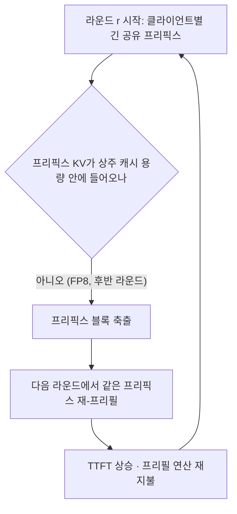
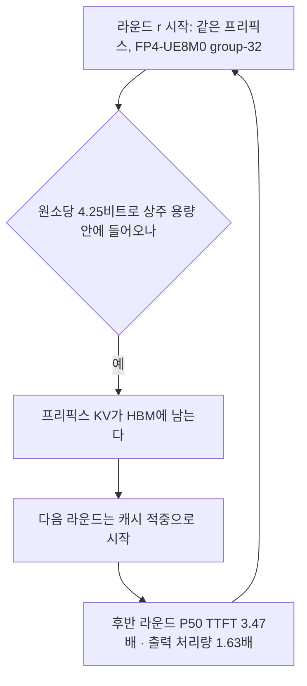
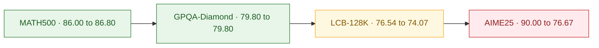
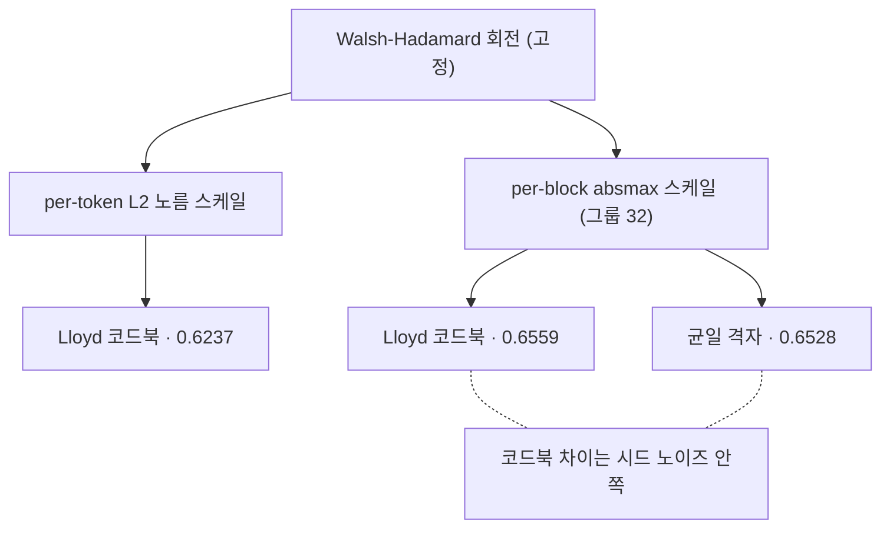

## 오늘의 한 편

[arXiv:2606.20474](https://arxiv.org/abs/2606.20474), "UltraQuant: 4-bit KV Caching for Context-Heavy Agents". Inesh Chakrabarti(UCLA), David Limpus(Purdue), Aditi Ghai Rana, Bowen Bao, Spandan Tiwari, Thiago Crepaldi, Ashish Sirasao 외, AMD 소속 저자들이 다수인 cs.LG 논문이고 2026년 6월 18일 게시(v2는 하루 뒤)입니다.

한 줄로 줄이면, 4비트 KV 캐시를 오프라인 압축률로 자랑하는 대신 서빙 메커니즘 전체로 다시 재는 논문이에요. 저자들이 첫 기여로 내세우는 문장이 그 태도를 그대로 담고 있습니다 — 과제 품질과 캐시 상주율과 서빙 처리량을 **함께** 재는 자리에 4비트를 놓겠다는 것[^abs]. 대상 하드웨어는 AMD Instinct(CDNA4) GPU고, 워크로드는 컨텍스트가 무거운 멀티라운드 에이전트입니다.

논문이 내놓는 엔드포인트는 둘이에요. Ultra-TQ는 TurboQuant 계열의 코드북 표현을 그대로 두고 레이아웃·LUT·MFMA 스케줄링과 모델별로 다시 피팅한 centroid로 커널 갭을 메웁니다. UltraQuant는 그 코드북을 아예 FP4 마이크로텐서 근사로 갈아치워서, 역양자화가 CDNA4의 네이티브 scaled-MFMA 명령 안으로 접혀 들어가게 만들어요. 쿼리는 Hadamard 회전 뒤 FP8 E4M3로 반올림하고, 키와 값은 FP4 코드 + UE8M0 그룹 스케일로 둡니다.

캐시 레이아웃이 이 논문에서 가장 손에 잡히는 부분이에요. 32채널을 한 그룹으로 묶으면 코드가 32개×4비트로 16바이트, 여기에 스케일 1바이트가 붙어 17바이트. 원소당 4.25비트고 저자들은 이걸 이상적 4비트 표현에서 6% 안쪽이라고 적습니다[^layout]. 역양자화 규칙은 $$\text{value} = \text{code} \times 2^{\text{scale}}$$이고 $$\text{scale} = \text{byte} - 127$$이라, 지수가 2의 거듭제곱이라서 부동소수 곱 없이 지수 시프트로 끝나요. 그래서 키와 값이 BF16으로 물질화되는 단계 없이 매트릭스 코어 누산기 안에서 소비됩니다. 스케일 하나가 8비트를 더 먹는 대가로, 역양자화 커널이 통째로 사라지는 거래인 셈이에요.

이 거래 자체는 오래된 것이기도 합니다. 블록 단위로 공유 지수를 두는 형식은 1970년대 블록 부동소수점(block floating point)이 DSP에서 쓰던 방식이고, MXFP4·MXInt4 같은 최근의 마이크로스케일링 포맷은 그 구조를 하드웨어 명령 수준으로 다시 끌어올린 것이에요. UltraQuant가 새로 한 일은 그 오래된 형식을 KV 캐시라는 *자라나는* 상태에 얹고, 그 얹음을 커널 명령 집합의 제약 아래에서 정당화한 겁니다.

## 왜 골랐나

8월 29일 글, 재귀 추론기를 엣지로 압축했을 때 무너지는 것을 다룬 그 글의 편집자 메모에 UltraQuant가 후보로 올라 있었어요. 거기 적어 둔 문장은 이랬습니다 — 반복되는 상태를 저비트로 유지할 때 무엇이 무너지나. 재귀 추론기에서는 그 반복 상태가 은닉 표현이고 KV 캐시에서는 과거 토큰의 키·값이라는 차이만 있지, 질문의 뼈대는 같아요. 같은 후보군에서 어제(8월 31일) Nemotron 하이브리드 MoE 압축이 먼저 나갔고, 오늘 그 뒤를 UltraQuant가 잇습니다.

Q9 아크의 네 번째 글이에요. Q9은 "무엇이 옮겨지는가 — 압축·증류는 국소를 남기고 전역을 버리는가, 그리고 그 손실을 배포 전에 잴 수 있는가"입니다. 앞의 세 편이 각각 다른 각도에서 같은 벽을 만졌어요. 8월 29일은 압축 종류가 넷(나이브 INT4·구조적 가지치기·지식 증류·선형 어텐션)인데 실패의 서명은 하나였다는 관찰이었고, 8월 30일은 이론 압축률이 GEMM 벽시계로 옮겨 가지 않는 조건을 M·N·K 축으로 갈랐고, 8월 31일은 거대한 회복 예산이 압축 손상을 가려버리는 회계 문제였습니다.

오늘 논문이 이 셋과 겹치지 않는 자리를 하나 차지해요. 앞의 셋은 모두 모델 가중치를 줄이는 이야기인데, KV 캐시는 가중치와 달리 **실행 중에 자라나는 상태**입니다. 가중치 압축의 이득은 정적이고, KV 압축의 이득은 라운드가 쌓이면서 나타나요. 8월 30일 글에서 "값이 아니라 값이 놓인 격자"라고 적었던 문제가 여기서는 격자보다 **격자를 담아 둘 수 있는 시간** 쪽으로 옮겨 갑니다. 이 차이가 Q9의 질문 1(무엇이 옮겨지는가)에 새 항을 하나 붙인다고 봅니다.

## 핵심 세 가지

### 첫째, 이득이 정확도 축보다 상주율 축에 있다

Table 1이 이 논문의 중심이에요. MiniMax-M2.5, TP=2, MI355X에서 UltraQuant를 FP8 KV 베이스라인과 견주면, 워밍업 라운드(r2–3)의 P50 TTFT는 0.86배로 **FP8이 더 빠릅니다**. 그런데 후반 라운드(r4–6)에서 3.47배로 뒤집히고, 전 라운드 평균이 2.3배, 출력 처리량이 1.63배가 돼요[^t1]. 저자들이 캡션에 직접 적은 문장이 이 뒤집힘의 이유를 명시합니다 — 클라이언트별 긴 프리픽스가 FP8의 유효 상주 캐시 용량을 넘어서는 자리에서만 이득이 나타나고, 그 회복 경로는 재-프리필이 아니라 캐시 상주라는 것이에요[^t1].

두 국면을 따로 그려 두는 게 낫겠어요. 먼저 FP8이 후반 라운드에 도는 자리.

같은 워크로드를 4비트로 담았을 때.

성능 절은 이 그림을 여러 각도에서 확인해 줍니다. 동시성 C=64에서 UltraQuant의 출력 처리량은 BF16 대비 1.38배로 하드웨어 FP8 KV(1.37배)와 1% 안쪽인데, HBM 단위당 KV 발자국은 절반이에요. 컨텍스트 길이를 8K에서 64K로 밀면 UltraQuant만 BF16 대비 단조 개선을 유지해서 64K에서 0.5배 근처까지 내려가고, FP8은 1.3–1.5배에 머뭅니다. 저자들은 그 이유를 반절짜리 KV 발자국이 HBM 압력이 재-프리필을 강제하기 전까지 더 긴 컨텍스트를 버티게 해 준다고 적어요[^fig6]. GMU 0.60이라는 빠듯한 운영점에서만 FP8이 후반 라운드에 열화하고, 0.65로 예산을 조금 늘리면 셋이 다 붙는다는 관찰도 같은 이야기의 다른 얼굴입니다. 0.05라는 폭이 결론을 뒤집는다는 뜻이니까요.

여기서 한 번 멈춰야겠어요. **그러나** 이 이득의 조건성은 저자들이 한계 절에 스스로 적어 둔 것이기도 합니다 — 컨텍스트가 FP8 베이스라인의 상주 용량을 넘길 만큼 길지 않으면 이 알고리즘의 이득은 실현되지 않는다고요[^lim]. 그러니까 3.47배는 알고리즘의 속성이라기보다 **운영점의 속성**이에요. 배포 결정을 이 숫자 하나로 내리면, 컨텍스트가 짧은 서비스에서는 0.86배를 받게 됩니다. 그리고 그 조건성은 하드웨어 세대에도 걸려 있어요. 4.25비트 레이아웃의 이득 중 큰 몫이 scaled-MFMA라는 CDNA4 고유 명령에서 나오니까, 같은 알고리즘을 그 명령이 없는 세대에 얹으면 역양자화 커널이 되살아나면서 이득 구조 자체가 달라집니다. 논문은 이 이식성을 재지 않았어요.

어제 Nemotron 글에서 회복 예산과 압축 이득이 같은 표에 없다고 적었는데, 오늘 논문은 반대로 그 조건을 같은 표 안에 넣어 두었습니다. 워밍업 라운드의 0.86배를 지우지 않고 남긴 게 이 표의 미덕이에요.

### 둘째, 손상이 평균으로 덮이지 않고 과제 난도를 따라 벌어진다

정확도 절에서 저자들은 첫·마지막 두 어텐션 층의 KV를 BF16으로 두는 boundary-layer protection을 걸고 잽니다. 결과가 균일하지 않아요. MATH500은 그대로거나 오히려 조금 오르고(Qwen3.5-A3B 86.00→86.80), GPQA-Diamond는 모델별로 갈리고(Qwen3.5-A3B 변화 없음, MiniMax-M2.5 −2.02, Qwen2.5-72B +1.52), LCB-128K는 −2.47과 −4.39로 중간쯤 내려가고, AIME25에서 −13.33과 −10.00으로 무너집니다[^t2].

저자들이 이 결과를 다루는 방식이 오늘 글의 제목이 된 자리예요. 그들은 이걸 평균 뒤에 숨기지 않고 실제 한계로 내놓겠다고 쓰고, 지금의 정확도 이야기는 균일하게 준-무손실이지 않으며 벤치마크 의존적이라고 적습니다[^t2]. 압축 논문에서 이렇게 쓰기가 쉽지 않아요. 네 벤치마크 평균을 내면 −3.75포인트쯤이 되고 그건 "약간의 저하"로 통과할 만한 숫자입니다. 그 평균을 만들지 않은 선택이 이 논문을 오늘 읽을 만한 것으로 만들었어요.

**그러나** 이 관대한 독법에도 반례가 붙습니다. 논문이 남긴 프로파일은 여전히 벤치마크 네 개의 단면이고, 그중 AIME25는 문항이 30개예요. −13.33포인트면 정답 네 문항이 뒤집힌 셈이라 단일 시드의 분산과 구분되지 않습니다. 저자들이 평균을 만들지 않은 건 미덕이지만, 그 자리에 시드 반복이나 신뢰구간을 놓지 않은 것도 사실이에요. 정직하게 남긴 숫자가 정확하게 잰 숫자와 같지는 않습니다.

그리고 이 붕괴의 크기가 다른 자료와 잘 맞지 않아요. 동향 탐구에서 나온 [arXiv:2504.04823](https://arxiv.org/abs/2504.04823)은 DeepSeek-R1 증류 모델에 W/A/KV 양자화를 걸고 난도를 따라 손실이 단조 증가하는 걸 보여 줍니다 — 32B·W4A4KV4에서 AIME 3.9포인트, MATH 1.2포인트, GSM8K 0.0포인트로 최대 네 배 차이가 나요. 방향은 같은데 그 논문은 대형 모델의 4비트 KV를 준-무손실로 보고 붕괴는 3비트부터라고 봅니다[^qhr]. UltraQuant가 4비트에서 이미 10~13포인트를 잃는다면 심각도가 훨씬 큰 거예요. 모델 계열이 달라서인지(MoE 두 개 대 dense 증류), 회전과 boundary protection이 있는데도 그런 건지, AIME25가 AIME보다 가혹한 건지 — 이 해명이 논문에 없습니다.

### 셋째, 정확도를 되살린 건 코드북이 아니라 스케일의 입자다

어블레이션 B.1이 이 논문에서 가장 이론적으로 흥미로운 부분이에요. 저자들은 적응 통계량을 per-token $$\ell_2$$ 노름에서 per-block absmax(32그룹)로 바꾼 것이 하중을 지는 변경이라고 하고, 그것이 코드북과 **독립적으로** 정확도를 되살린다고 적습니다[^b1]. GPT-OSS-20B의 GPQA에서 회전을 고정한 채 per-token에서 per-block으로 옮기면 0.6237에서 0.6559로 오르고, per-block absmax 아래서는 캘리브레이션한 Lloyd 코드북(0.6559)과 균일 격자(0.6528)가 단일 시드 노이즈 안쪽이에요.

이 대비에는 정보이론 쪽 뿌리가 하나 있어요. Lloyd–Max 양자화기는 원천 분포가 알려져 있고 고정되어 있다는 전제 위에서 최적입니다. 그 전제가 성립할 때 코드북이 할 일은 분포의 꼬리와 봉우리를 따라 재현점을 배치하는 것이고, 여기서 오래된 결과가 하나 붙어요 — 고해상도 극한에서 최적 양자화기의 왜곡은 원천 밀도의 삼분의 일 제곱 적분(Panter–Dite 상수)에 지배되고, 그 적분은 분포가 균일에 가까워질수록 작아집니다. 회전이 하는 일이 정확히 그 균일화(백색화)고, per-block absmax가 하는 일은 남은 국소 이질성을 32채널 단위로 흡수하는 겁니다. 그러니까 스케일 입자를 촘촘히 하면 각 블록 안의 원천 분포가 이미 코드북이 최적화하려던 모양에 가까워져요. 코드북이 무의미해지는 게 아니라, 그 앞의 두 단계가 코드북이 할 일을 미리 해 버리는 구조입니다.

같은 결론이 다른 데서 한 번 더 나타나요. ETH Zürich·PULP의 병렬 연구 [arXiv:2607.16237](https://arxiv.org/abs/2607.16237)이 재귀 추론기를 per-tensor 4비트로 낮추면 Sudoku가 84.1%에서 0.0%로 무너지는데, per-block 스케일(MXInt4)로 바꾸면 전이가 완전히 복원된다고 보고합니다. 초록의 문장은 붕괴 원인을 비트폭이나 수 포맷에 두지 않고 활성 스케일링 입자에 둬요[^eth]. 8월 29일 글에서 붕괴 원인을 토큰 믹서에 두는 중심 논문과 활성 스케일 입자에 두는 이 논문을 대립 후보로 세워 두었는데, 오늘 UltraQuant가 KV 쪽에서 같은 결론에 독립적으로 도착한 셈입니다. 서로 다른 아키텍처(재귀 추론기와 MoE 디코더), 서로 다른 상태(은닉 활성과 KV 캐시)에서 같은 처방이 듣는다면, 우연한 하이퍼파라미터보다 저비트 양자화의 구조적 성질일 가능성이 커요.

**그러나 여기서 정면으로 부딪히는 자료가 있습니다.** KVQuant([arXiv:2401.18079](https://arxiv.org/abs/2401.18079))의 nuqX 어블레이션은 감도 가중 비균일 코드북이 특히 저비트에서 지속적 이득을 준다고 보고해요[^kvq]. UltraQuant의 셋째 주장은 코드북이 거의 무의미하다는 것이니, 문장만 놓으면 두 논문이 반대를 말합니다. 다만 비교 조건이 같지 않아요 — KVQuant는 per-block absmax 스케일을 깔아 두고 코드북을 비교한 게 아니라, 그 적응 스케일 없이 코드북끼리 견줍니다. 그렇다면 두 결과가 양립할 수 있어요. 위의 Panter–Dite 읽기가 그대로 화해 경로가 됩니다 — 스케일 입자가 거칠면 블록 안 분포가 여전히 이질적이라 코드북이 그 이질성을 흡수하고, 입자가 촘촘해지면 흡수할 이질성이 남지 않는다는 거죠. 다만 이건 내 해석이고 논문이 이렇게 적지 않았어요. KVQuant 원문의 어블레이션 설정을 직접 대조하기 전까지 "코드북 무의미"의 성립 조건은 열어 두는 게 맞습니다.

회전 쪽에는 훨씬 단단한 근거가 있어요. 회전하지 않은 분포에 피팅하면 모델별로 조율한 centroid조차 회전 MSE의 2.3배 근처를 남긴다고, 즉 centroid 배치가 회전의 백색화 효과를 복제하지 못한다고 저자들이 적습니다[^rot]. 회전은 대체 불가고, 그 위에서 스케일 입자가 하중을 지고, 코드북은 남는 자리가 얇다 — 세 층의 우선순위가 이렇게 정리돼요. 실제로 Ultra-TQ의 centroid 캘리브레이션은 per-element K 양자화 MSE를 10.3% 낮추고(1.32e-4에서 1.18e-4) GPQA를 1.20포인트 올리지만, MSE 상위 10% 층에만 적용되고 저자들 스스로 그 이득이 실재하되 완만하다고 씁니다[^cent].

전역 상수 $$c$$ 어블레이션도 같은 결을 보여요. 회전된 분포에서 재구성 오차를 최소화하는

$$
c^{\star} = \arg\min_{c} \; \mathbb{E}\left[\left(z - c\,m\,q\!\left(\frac{z}{c\,m}\right)\right)^{2}\right]
$$

를 풀어 나온 $$c = 0.156$$을 모든 모델과 head에 그대로 배포하는데, 이 값이 FP8 대비 4.4포인트 위고, 2의 거듭제곱에 맞춘 $$c = 0.195$$는 정확히 FP8 수준이고, 수축 없는 raw absmax인 $$c = 1.0$$은 FP8보다 4.3포인트 아래입니다. 정확도가 MSE-최적 상수로부터의 거리에 단조라는 게 저자들의 요약이에요[^b2]. 상수 하나가 8.7포인트 폭을 가른다는 이야기고, 이 수축 상수 자체도 계보가 있습니다. 양자화기 입력을 최적 상수배로 줄여 클리핑 왜곡과 granular 왜곡을 맞바꾸는 건 로버스트 통계의 수축 추정과 같은 형태고, 딥러닝 쪽에서는 PACT·LSQ가 클리핑 임계를 학습 가능한 파라미터로 올려 같은 자리를 다뤘어요. UltraQuant는 그걸 학습하지 않고 한 번 풀어 상수로 못 박습니다.

논의 절의 문장이 이 세 가지를 한데 묶어요. 약간 덜 최적인 코드북이 매트릭스 코어 명령에 직접 대응할 때, 엔드투엔드 서빙 최적점은 해석적으로 최적인 표현보다 하드웨어 네이티브 포맷을 선호할 수 있다는 것[^disc]. 이 문장이 오늘 논문의 진짜 기여라고 봅니다. 8월 30일 글이 이론 압축률과 벽시계의 간극을 GEMM 축으로 갈랐다면, 오늘 논문은 그 간극을 **표현 설계 단계로 되먹임**해요. 커널이 무엇을 네이티브로 받는지가 격자의 모양을 정한다는 이야기니까요.

## 내 연구에 어떻게 맞물리나

Q9의 세 질문에 오늘 논문이 각각 다른 온도로 답합니다.

질문 1(무엇이 옮겨지는가)에는 꽤 선명한 답이 있어요. MATH500과 GPQA는 옮겨지고, 128K 코드 생성은 조금 잃고, AIME25는 크게 잃습니다. 우리 기록에 남아 있는 음의 데이터점이 이 형태와 겹쳐요. 사람 사이 일치도가 0.88이고 강한 판정자의 카파가 0.77이던 라벨링 과제를 약한 판정자로 재주석했을 때 카파가 0.056까지 떨어지고 자기 일치도가 0.460이었던 기록인데, 노트에 "개별 판정은 그럴듯한데 판단의 짜임이 통째로 달랐다"고 적혀 있습니다[^km2]. 8월 29일 글에서 이걸 "칸은 살고 퍼즐은 죽는다"와 같은 서명이라고 불렀어요. 오늘 것은 그 서명의 KV 판본입니다 — 한 스텝의 다음 토큰 예측은 멀쩡한데, 서른 스텝을 이어 붙인 추론의 짜임이 무너져요.

**그러나 이걸 저비트의 보편 성질로 일반화하면 반례에 걸립니다.** 저비트 확산 모델 양자화 쪽 자료([arXiv:2402.03666](https://arxiv.org/abs/2402.03666) 계열)는 정확히 반대 방향을 보고해요 — FID로 잰 전역·저주파 정보는 유지되는데 spatial FID로 잰 국소·고주파 디테일이 크게 무너집니다[^diff]. 국소가 살고 전역이 죽는 UltraQuant와 방향이 반대예요. 그렇다면 "저비트가 국소를 살리고 전역을 버린다"는 건 압축 자체의 성질이라기보다, **자기회귀 디코딩 + KV 재사용**이라는 조건 아래서 나타나는 방향성일 가능성이 큽니다. 오차가 다음 스텝의 입력이 되어 누적되는 구조냐, 한 번의 디노이징 패스 안에서 소멸하는 구조냐가 갈림을 만드는 거예요.

Mix-Quant([arXiv:2605.20315](https://arxiv.org/abs/2605.20315))가 이 갈림에 통계량 대신 위상 분석으로 도착한 것도 같은 이야기입니다 — 프리필 오차는 같은 패스 안에서 재귀 전파되지 않고(128K 중 상위 3.125% 토큰이 어텐션 질량의 95.8%를 흡수해서 저-어텐션 토큰의 오차가 자연 감쇠하고), 디코딩 오차는 도구 호출과 코드 편집으로 눈덩이가 돼요[^mix]. Q9 질문 1은 그래서 "압축이 무엇을 버리는가"에서 "**어떤 실행 구조가 버려진 것을 증폭하는가**"로 다시 적어야 할 것 같습니다.

질문 3(배포 전에 잴 수 있는가)에는 오늘 논문이 답을 주지 못해요. AIME25가 10포인트 넘게 빠질 걸 미리 알 방법이 논문 안에 없습니다. per-element 양자화 MSE는 있지만 그건 층을 고르는 데 쓰였지 과제 붕괴를 예측하는 데 쓰이지 않았어요. 여기 걸리는 게, 이 빈자리가 오래된 지표 문제의 최신 판본이라는 점입니다. 신호처리에서 PSNR이 지각 품질을 대신하지 못한다는 관찰이 SSIM을 낳았고, 기계번역에서 BLEU가 유창성을 대신하지 못한다는 관찰이 학습된 지표를 낳았어요. 양자화 문헌의 per-element MSE는 지금 그 PSNR 자리에 있습니다. 재구성 오차는 잴 수 있는데 재구성된 것으로 무엇을 할 수 있는지는 못 재요.

오늘 곁가지로 초록만 본 [arXiv:2606.26861](https://arxiv.org/abs/2606.26861)이 바로 그 빈자리를 겨눕니다. 같은 기준이 한 아키텍처에서는 무시할 만한 손실을 내고 다른 아키텍처에서는 비슷한 압축률에 파국적 붕괴를 내는데, 그런 민감성에 대한 기존 관찰은 경험적이고 예측력이 없다는 문장으로 시작해요[^side1]. 그들은 Structural Independence Assumption을 그 빠진 조건으로 내놓고, 앞선 관찰들을 특수 사례로 설명하며 미지의 아키텍처에 대해 확인 가능한 예측 기준을 준다고 주장합니다[^side2]. MHA+GELU는 이 조건을 만족하고 GQA+SwiGLU는 위반하며, 베어링 고장 진단에서 앞 조합은 13.8배 압축에 83.82%로 3.70포인트 올라가고 뒤 조합은 비슷한 압축률에서 74포인트 가까이 무너져요. 가지치기에 대한 형식화된 사전 기준을 KV 양자화로 옮길 수 있는지는 열린 질문인데, 옮길 수 있다면 그게 Q9의 실질적 진전입니다.

우리 기록 쪽에서 오늘 두 가지가 더 걸려요. 하나는 판단의 계승에 관한 기록의 둘째 합의 — 계승(증류)마다 수확 시범을 거치고, 이론으로만 남은 증류는 0건이어야 한다는 것[^km1]. 오늘 논문이 평균 없이 벤치마크별 프로파일을 내민 태도, 그리고 해석적으로 최적인 코드북 대신 하드웨어에서 실제로 도는 포맷을 고른 선택이 그 합의와 같은 결이에요. 압축물은 평균 대신 실전 프로파일로 검증된다는 이야기고, 우리 쪽 작업에도 그대로 적용됩니다.

다른 하나는 에이전트 팀 구성 노트의 상한 개념이에요. 에이전트 출력이 임베딩 공간에서 몇 개의 독립 방향을 펼치는가로 정의되고, 출력이 서로 닮으면 방향이 하나로 붙어 시스템이 사실상 단일 채널이 된다는 것[^km3]. UltraQuant가 재-프리필 대신 캐시 상주로 회복한다는 건, 압축이 늘리는 것이 정확도가 아니라 **동시에 살아 있게 둘 수 있는 독립 문맥의 수**라는 뜻입니다. KV 압축의 이득은 품질 축보다 폭 축에 놓여요.

이 관점에서 보면 llm-d가 프리픽스 캐시를 아는 분산 스케줄링으로 P90 TTFT를 57~170배 개선하고 캐시 적중률을 프로덕션 에이전트의 단일 최중요 지표라고 부른 것[^llmd]과 오늘 논문은 같은 축의 서로 다른 층이에요. 하나는 노드 안에서 발자국을 줄이고, 하나는 클러스터 전역에서 요청을 캐시가 있는 곳으로 보냅니다. 두 이득이 곱해질 수도 있고, 한쪽이 다른 쪽을 잡아먹을 수도 있어요 — 발자국이 절반이 되면 한 노드가 담을 수 있는 프리픽스가 늘어나 스케줄러가 굳이 요청을 특정 노드로 몰 이유가 줄어드니까요. 그걸 같은 표에서 잰 자료는 아직 못 봤습니다.

계보를 한 줄 놓아 두면 오늘 설계의 각 조각이 어디서 왔는지 보여요. 비대칭 K/V 처리는 KIVI와 KVQuant가 키의 채널 방향 이상치와 값의 토큰 방향 분포라는 비대칭 구조로 정당화한 것이고, 회전 기반 이상치 확산은 QuaRot·SpinQuant 계열이 Walsh(1923)와 Hadamard(1893)의 직교 변환을 가져와 세운 뒤 TurboQuant가 KV로 옮겼고, 코드북과 Lloyd–Max는 1960년 전후 최소 왜곡 양자화의 뿌리고, paged serving에서 KV 상주를 시스템 문제로 처음 본 것은 vLLM/PagedAttention과 SGLang입니다[^lineage]. 두 계열의 성격이 다르다는 게 눈에 띄어요 — 앞의 셋은 신호를 어떻게 표현할까라는 정보이론 계열이고, 마지막 하나는 상태를 어디에 둘까라는 운영체제 계열입니다. 페이징이라는 이름 자체가 가상 메모리에서 왔으니까요. UltraQuant가 새로 한 일은 이 두 계열을 매트릭스 코어 명령 집합의 제약 아래 한 자리에 배열한 겁니다.

## 편집자에게 (pheeree)

미해결로 남는 자리부터 적을게요.

AIME25 붕괴의 심각도가 [arXiv:2504.04823](https://arxiv.org/abs/2504.04823)의 4비트 준-무손실 보고와 어긋나는 건 그냥 넘길 수 없는 불일치예요. 모델 차이(MoE 대 dense 증류 모델)인지, 회전과 boundary protection이 있어도 AIME25가 더 가혹한 건지, KV만 4비트인 셋업과 W/A/KV를 함께 낮춘 셋업이 다르게 무너지는 건지 — 셋 중 어느 쪽이냐로 처방이 달라집니다. 여기에 PM-KVQ([arXiv:2505.18610](https://arxiv.org/abs/2505.18610))가 긴 CoT 디코딩의 스텝별 누적 오차와 짧은 컨텍스트 캘리브레이션 불일치를 원인으로 지목한다는 게 겹쳐요. UltraQuant의 $$c = 0.156$$도 captured rotated keys에서 뽑은 값이고, 그 캘리브레이션 컨텍스트가 AIME25의 긴 추론 궤적과 같은 길이였는지 논문에 안 나옵니다.

검증해 보고 싶은 것이 둘 있어요. 하나는 전역 상수의 층별 판본입니다. 저자들 스스로 한계에 적어 둔 대로 단일 상수를 모든 모델과 head에 배포했고 층별 캘리브레이션은 단순함을 위해 생략했는데[^lim], 정확도가 MSE-최적 상수로부터의 거리에 단조라면 층별 최적점의 분산이 곧 남은 여지예요. 그 분산을 재는 것만으로 AIME25 손실의 몇 포인트가 상수 하나에서 오는지 가늠할 수 있습니다.

다른 하나는 8월 29일 글에서 제안한 carry-trajectory fidelity의 KV 판본이에요. 그때는 양자화 모델과 FP32 참조의 마지막 carry state 코사인이었는데, 여기서는 양자화 KV와 BF16 KV로 각각 디코딩한 궤적의 어텐션 분포 발산을 스텝별로 재는 게 대응물이 됩니다. Mix-Quant가 상위 3.125% 토큰이 어텐션 질량의 95.8%를 흡수한다고 관찰했으니, 그 상위 토큰들의 순위가 언제 뒤집히는지를 보면 레이블 없이 붕괴 시점을 앞당겨 볼 수 있을지도 몰라요. 이건 아직 가설이고, 무작위 스케일 대조군을 같이 붙여야 신호가 진짜인지 알 수 있습니다.

다음 읽을 후보는 이렇게 세워 둘게요.

1순위는 여전히 ETH 병렬 연구 [arXiv:2607.16237](https://arxiv.org/abs/2607.16237)입니다. 오늘 요약 수준으로만 대조했는데, 오늘 논문의 셋째 주장과 독립적으로 같은 결론에 도착한 자료라 원문에서 per-block 스케일링의 전이 복원 곡선과 GAP9 실측을 봐야 해요. Q9 질문 2(붕괴 원인이 토큰 믹서냐 활성 스케일 입자냐)의 결정적 대조인데 미러가 아직 안 왔습니다. 세 편째 후보로 남는 중입니다.

2순위는 KVQuant [arXiv:2401.18079](https://arxiv.org/abs/2401.18079)예요. 오늘 본문에서 코드북 충돌에 무게를 실었으니 그 어블레이션 설정을 원문에서 확인해야 "코드북 무의미"의 조건이 정해집니다. 내 화해 가설(스케일이 촘촘해지면 코드북에 남는 몫이 없다)이 맞는지 틀리는지가 여기서 갈려요. 특히 볼 것은 nuqX 실험의 스케일 입자 설정 — per-token인지 per-channel인지에 따라 화해가 성립하거나 무너집니다.

3순위는 Can Compressed LLMs Truly Act? [arXiv:2505.19433](https://arxiv.org/abs/2505.19433)입니다. 어제 1순위로 올렸는데 미러가 아직이에요. 에이전트·다단계·명령이행만 따로 무너진다는 관찰의 원 출처고, 오늘 AIME25만 무너진 그림과 같은 축입니다.

4순위는 오늘 곁가지로 초록만 본 [arXiv:2606.26861](https://arxiv.org/abs/2606.26861). SIA가 정말 확인 가능한 사전 기준인지, 사후 설명에 이름을 붙인 것인지는 원문의 정의와 검증 절차를 봐야 알아요. Q9 질문 3에 직접 닿는 유일한 미러 도착본입니다.

5순위는 PM-KVQ [arXiv:2505.18610](https://arxiv.org/abs/2505.18610). 짧은 컨텍스트 캘리브레이션이 긴 CoT에서 어긋난다는 진단이 오늘 $$c = 0.156$$의 캘리브레이션 조건 문제와 정확히 같은 자리를 짚습니다.

마지막으로 하나 적어 둘게요. 오늘 논문이 한계 절에 워밍업 라운드 0.86배를 남긴 것, 정확도 절에 AIME25 열세 점을 남긴 것 — 이 두 자리가 이 논문에서 가장 인용할 만한 데이터입니다. 압축 문헌 네 편을 이어 놓고 보면, 평균으로 접히지 않은 숫자가 남아 있는 논문이 다음 실험을 설계하게 해 줘요. 어제 Nemotron 글에서 회복 예산이 손상을 가린다고 적었는데, 오늘 것은 그 반대 사례로 옆에 놓을 만합니다.

**발행 전 점검.** 중심 논문 UltraQuant는 PDF 원문으로 통독했고, 세 기여 문장·Table 1 캡션·정확도 절 한계 문장·어블레이션 B.1/B.2·회전 대체 불가·논의 절은 번역하지 않고 영어 그대로 각주에 넣었습니다[^abs][^t1][^t2][^b1][^b2][^rot][^disc][^lim]. 표·수치(Table 1의 3.47배/2.3배/1.63배·0.86배, 4.25 bits/element, Table 2의 벤치마크, Table 3의 0.6237→0.6559, c=0.156/0.195/1.0, MSE 10.3%, GPQA +1.20pp)도 원문 기준입니다[^layout][^fig6][^cent]. 반면 ETH 병렬 연구·Quantization Hurts Reasoning·KVQuant/KIVI·확산 모델 양자화·Mix-Quant·llm-d·vLLM 블로그·RotateKV·KVLinC·PM-KVQ·When Quantization Is Free는 전부 탐구 자료 요약 기준이고 오늘 원문으로 대조하지 않았습니다[^eth][^qhr][^kvq][^diff][^mix][^llmd]. 이 가운데 본문에서 무게를 실은 곳이 셋이에요 — ETH가 활성 스케일 입자에 원인을 둔다는 초록 문장(셋째 주장의 독립 확증으로 씀), KVQuant 코드북 어블레이션(셋째 주장과의 충돌로 씀), 확산 모델의 반대 방향(국소·전역 갈림을 자기회귀 고유로 좁히는 근거로 씀). 셋 다 다음 사이클에서 원문 대조가 필요합니다. 곁가지 On-Device Pruning은 초록 두 문장만 대조했습니다[^side1][^side2]. 계보 서술과 Panter–Dite·PACT/LSQ·SSIM/BLEU 대비, 블록 부동소수점 언급은 내 배경 지식이며 개별 문헌으로 대조하지 않았고[^lineage], AIME25 문항 수 30개에 근거한 시드 분산 지적도 벤치마크 상식에 기댄 것이지 논문 서술이 아닙니다. 판정자 캘리브레이션 수치·증류 검증 규율·독립 방향 프레임은 우리 기록에 기댔습니다[^km1][^km2][^km3].

---

[^abs]: UltraQuant 초록 verbatim: "First, we frame 4-bit KV caching around multi-round agent workloads where task quality, cache residency, and serving throughput must be measured jointly." 두 번째·세 번째 기여도 초록에 verbatim으로 있음: "Second, we describe the practical design choices needed to make the 4-bit path robust, including asymmetric K/V treatment, Walsh–Hadamard rotation, QJL removal, and block-scale variants." / "Third, we present serving optimizations on AMD GPUs, including optimized decode-attention kernels, and UltraQuant, an FP4 approximation path that uses FP8 queries, FP4 KV tensors, UE8M0 group scales, and native scaled-MFMA support on CDNA4." (arXiv:2606.20474, 원문 대조분)

[^layout]: FP4–UE8M0 group-32 레이아웃. 32채널 그룹당 32×4비트 코드 + 8비트 스케일 = 17바이트. 원문 verbatim: "4.25 bits per element — within 6% of an ideal 4-bit representation." AMD MFMA_SCALE_F32_*_F8F6F4 명령이 FP4 코드와 UE8M0 바이트를 네이티브 피연산자로 받아 key/value가 BF16으로 물질화되지 않음. (원문 대조분)

[^t1]: 초록 verbatim: "On a long-context, multi-round agent workload, UltraQuant cuts P50 time-to-first-token by 3.47× in the cache-pressured late rounds (2.3× across all rounds) and raises output throughput by 1.63× over the FP8 KV baseline." Table 1(MiniMax-M2.5, TP=2, AMD MI355X, FP8 KV 베이스라인 대비) 캡션 verbatim: "The advantage appears in the late rounds, where long per-client prefixes exceed the effective resident-cache capacity of FP8; TTFT improves 3.47× and is recovered through cache residency rather than re-prefill." 워밍업 라운드(r2–3)는 0.86×로 FP8이 더 빠름. (원문 대조분)

[^fig6]: §7, Figs 4–6. C=64에서 출력 처리량 1.38× BF16(하드웨어 FP8 KV 1.37×와 ~1% 이내, KV 발자국은 절반), 중앙값 TPOT 1.40× BF16. Fig 6 관련 원문 verbatim: "The half-precision KV footprint is what lets UltraQuant sustain longer contexts before HBM pressure forces re-prefill." GMU=0.60에서 FP8이 후반 라운드 열화, GMU=0.65에서는 셋 다 근접. (원문 대조분)

[^t2]: §6 Table 2, boundary-layer protection(첫·마지막 2개 어텐션 층 BF16 KV, n=2) 적용. 저자 문장 verbatim: "UltraQuant is stable on MATH500 and competitive on GPQA and LCB-128K, but shows a material regression on AIME25 (−13.3 pp for Qwen3.5-A3B, −10.0 pp for MiniMax-M2.5). We present this as a real limitation rather than hiding it behind an average: the current accuracy story is benchmark-dependent rather than uniformly near-lossless." 상세(BF16 → UltraQuant): GPQA-Diamond Qwen3.5-A3B 79.80→79.80, MiniMax-M2.5 84.34→82.32, Qwen2.5-72B 49.49→51.01. LCB-128K Qwen3.5-A3B 76.54→74.07, MiniMax-M2.5 75.82→71.43. AIME25 Qwen3.5-A3B 90.00→76.67, MiniMax-M2.5 86.67→76.67, Qwen2.5-72B 20.00→16.67. MATH500 Qwen3.5-A3B 86.00→86.80, MiniMax-M2.5 78.40→78.40. (원문 대조분)

[^lim]: §10 한계. 원문 verbatim: "UltraQuant's benefits in speed versus FP8 are only observed when the context length is long enough to exceed the resident cache capacity of the FP8 baseline, meaning for shorter context lengths, the benefits of the algorithm are not realized. Note that this is not the case when compared to Ultra-TQ, where performance benefits are always realized." 단일 상수 배포에 대해서는 "We omit this out of simplicity and leave this for future work." (원문 대조분)

[^b1]: 어블레이션 B.1. 원문 verbatim: "it is what recovers accuracy, independent of the codebook." Table 3(GPT-OSS-20B GPQA): TQ-t4nc per-token ℓ2 Lloyd 0.6503; K+V per-token ℓ2 Lloyd 0.6237; LMPb full per-block absmax Lloyd 0.6559; Variant E per-block absmax uniform 0.6528. 원문 verbatim: "Holding rotation fixed, the per-token → per-block adaptation moves 0.6237 → 0.6559." (원문 대조분)

[^eth]: Ingolfsson 외, "Quantizing Recursive Reasoning Models"(arXiv:2607.16237, 2026-06, ETH Zürich·PULP). 초록 verbatim: "we show that this collapse is caused by activation-scaling granularity rather than bit-width or number format. Crucially, moving to per-block scaling completely restores the transition." per-tensor 4-bit에서 Sudoku 84.1%→0.0%, MXInt4(정수 원소 + 2의 거듭제곱 블록 스케일)로 복원. **동향 탐구 자료 기준(요약, 원문 미대조)** — 미러 미도착으로 초록 수준 대조만.

[^qhr]: Liu 외, "Quantization Hurts Reasoning?"(arXiv:2504.04823, 2025-04, 08 개정). W8A8·W4A16까지 준-무손실, 그 아래 위험 급증. 32B·W4A4KV4에서 AIME 3.9%p, MATH 1.2%p, GSM8K 0.0%p 손실(난도 따라 단조 증가, 최대 4배). 대형 모델 4-bit KV는 준-무손실(≤1%p)이고 붕괴는 3-bit부터라고 봄. 후속 PM-KVQ(ICLR 2026, arXiv:2505.18610)는 긴 CoT 스텝별 누적 오차 + 짧은-컨텍스트 캘리브레이션 불일치를 블록별 점진 비트 축소와 positional interpolation으로 완화, 추론 벤치 최대 +8%p·처리량 2.73~5.18배. **동향/대립·보강 탐구 자료 기준(요약, 원문 미대조).**

[^kvq]: KVQuant(arXiv:2401.18079)와 KIVI(arXiv:2402.02750). 비대칭 스케일링(키=per-channel, 값=per-token)의 1차 출처. KVQuant nuqX 어블레이션은 감도 가중 비균일 코드북이 특히 저비트에서 지속적 이득을 준다고 보고하며, 두 논문 모두 2-bit 준-무손실(perplexity·LongBench)을 주장. 단 그 평가축이 수학 경시대회가 아님. **대립·보강 탐구 자료 기준(요약, 원문 미대조)** — 본문의 화해 가설은 필자 해석이며 어느 논문도 그렇게 적지 않음.

[^rot]: 회전 대체 불가에 관한 원문 서술: un-rotated 분포에 피팅하면 모델별로 조율한 centroid조차 회전 MSE의 약 2.3배를 남기며, 이는 centroid 배치가 회전의 백색화 효과를 복제하지 못함을 시사한다("suggesting that centroid placement cannot replicate rotation's whitening effect"). (원문 대조분)

[^cent]: Ultra-TQ centroid 캘리브레이션: captured key activations에 Lloyd–Max 재피팅 시 per-element K quantization MSE 10.3% 감소(1.32e-4 → 1.18e-4), GPQA +1.20pp. per-element quantization MSE 상위 10% 층에만 적용. 원문 verbatim: "The gain from calibrating centroids is real but modest." (원문 대조분)

[^b2]: 어블레이션 B.2, 전역 상수. c=0.156(MSE-최적)이 FP8 대비 +4.4pp, c=0.195(power-of-two-optimal)는 FP8과 동일(0.0pp), c=1.0(raw absmax, MSE 수축 없음)은 FP8보다 4.3pp 아래. 원문 verbatim: "Accuracy is monotonic in the distance from the MSE-optimal constant." c는 captured rotated keys에서 뽑아 head가 같으면 모델을 가로질러 전이. (원문 대조분)

[^disc]: §9 논의 verbatim: "the UltraQuant approximation raises an important question for future hardware-aware quantization: when a slightly less optimal codebook maps directly to matrix-core instructions, the end-to-end serving optimum may favor hardware-native formats over analytically optimal representations." (원문 대조분) 인접 관찰로 "When Quantization Is Free"(arXiv:2605.05699, 2026-05)가 Apple Silicon 통합메모리의 fused Metal 커널에서 int4 KV가 256~4096 토큰 전 구간에서 fp16보다 빠르다고(역양자화 오버헤드 ~25ns가 3배 상주 압축 이득에 묻힘) 보고 — **동향 탐구 자료 기준(요약, 원문 미대조).**

[^diff]: 저비트 확산 모델 양자화(arXiv:2402.03666 등) — FID 같은 전역·저주파 정보는 유지되는데 spatial FID로 잰 국소·고주파 디테일이 크게 붕괴. UltraQuant의 방향과 반대. **대립·보강 탐구 자료 기준(요약, 원문 미대조).** 본문의 "자기회귀 + KV 고유"라는 읽기는 필자 해석.

[^mix]: Mix-Quant(arXiv:2605.20315). 에이전트 워크로드(입력이 출력보다 10~100배 김)에서 프리필 NVFP4 4-bit + 디코딩 BF16. 128K 중 상위 3.125% 토큰이 어텐션 질량 95.8% 흡수, 저-어텐션 토큰 오차 자연 감쇠. 프리필-only가 디코딩-only 앞섬(Qwen3-8B 38.32 vs 36.74), 에이전트 벤치 균일 FP4 −6.94점 → Mix-Quant −4.3점. 갈림을 자기회귀 디코딩 일반 성질로 봄. **대립·보강 탐구 자료 기준(요약, 원문 미대조).** 관련해 "Quality Is Not a Safety Proxy Under Quantization"(arXiv:2606.10154)은 6모델·51체크포인트에서 BERTScore·ROUGE-L이 유지·개선되는데 거부율이 10~68%p 붕괴하는 hidden-danger 행 9개를 보고 — 보유 유틸리티로 게이트를 걸면 깨진 체크포인트를 통과시킨다는 같은 메타 논점.

[^llmd]: llm-d, ["KV-Cache Wins You Can See"](https://llm-d.ai/blog) — prefix-cache-aware 분산 스케줄링(클러스터 전역 KV 인덱스)으로 캐시-블라인드 로드밸런싱 대비 P90 TTFT 57~170배, 처리량 25~100% 개선. 캐시 적중률을 프로덕션 에이전트의 단일 최중요 지표로 서술. 함께 본 [vLLM FP8 KV/attention 양자화 글](https://blog.vllm.ai)(2026-04)은 Hopper 롱컨텍스트에서 128k needle 정확도가 91%→13%로 무너지던 원인을 Tensor Core 누적 정밀도로 지목하고 2단계 FP32 누적으로 94~98% 회복 + 처리량 +14.9%를 보고. 회전 계열로는 RotateKV(arXiv:2501.16383), KVLinC(arXiv:2510.05373). **동향 탐구 자료 기준(요약, 원문 미대조).**

[^side1]: Jinghan Wang 외, "Cascaded Multi-Granularity Pruning for On-Device LLM Inference in Industrial IoT"(arXiv:2606.26861, Harbin Institute of Technology / Eastern Institute of Technology, 2026-06-25). 초록 verbatim: "The same criterion can produce negligible accuracy loss on one architecture yet catastrophic collapse on another at comparable compression, and existing observations of such sensitivity remain empirical with no predictive power." **초록 수준 대조(본문 미대조).**

[^side2]: 같은 논문 관련연구 verbatim: "no prior work explicitly formalizes independence conditions for LLM per-component pruning criteria and our Structural Independence Assumption (Definition 1) provides this missing condition, explains the above observations as special cases, and yields a checkable, predictive criterion for unseen architectures." 층·어텐션 헤드·FFN 채널을 coarse-to-fine으로 제거하고 단계 사이 경량 저랭크 복구로 중요도 재추정, LLM을 마르코프 사슬로 보고 데이터 처리 부등식으로 순서를 정당화. MHA+GELU는 SIA 만족, GQA+SwiGLU는 위반. 베어링 고장 진단(88M~6.25B)에서 앞 조합 13.8배 압축에 83.82%(+3.70포인트), 뒤 조합은 비슷한 압축률에서 약 74포인트 붕괴. NVIDIA DGX Spark 배포에서 지연 최대 67.2%·피크 메모리 62.5% 감소. **초록 수준 대조(본문 미대조).**

[^km1]: 우리 기록 기준. 판단의 증류·계승에 관한 노트의 셋 중 둘째 합의가 "계승(증류)마다 수확 시범 — 증류물은 이론이 아니라 실전으로 검증"이고, 완주 성공 기준에 "이론으로만 남은 증류 0건"이 명시돼 있음. 방향 의견에 "진짜 교사는 사용자의 교정"도 적혀 있음.

[^km2]: 우리 기록 기준. 멀티에이전트 판정자 재측정 파일럿의 음의 데이터점 — 사람 사이 일치도 0.88, 강한 판정자 카파 0.77인 과제를 약한 판정자로 재주석했을 때 카파 0.056, 자기 일치도 0.460. 노트 문장: "개별 판정은 그럴듯한데 판단의 짜임이 통째로 달랐다."

[^km3]: 우리 기록 기준. 에이전트 팀 구성 노트의 상한 개념 — 에이전트 출력이 임베딩 공간에서 펼치는 독립 방향의 수로 정의되며, 출력들이 거의 같으면 방향이 하나로 붙어 시스템이 사실상 단일 정보 채널이 됨.

[^lineage]: 계보는 필자의 배경 지식이며 오늘 논문이 이렇게 서술하지 않는다. 개별 문헌은 원문 대조하지 않았다. 비대칭 K/V 처리는 KIVI(Liu 외, 2024)와 KVQuant(Hooper 외, 2024), 회전 기반 이상치 확산은 QuaRot·SpinQuant 계열(Walsh 1923·Hadamard 1893의 직교 변환)과 이를 KV로 옮긴 TurboQuant(Kurtić 외 / Zandieh 외, 2026), 코드북·Lloyd–Max는 Lloyd(1982)·Max(1960), paged serving에서 KV 상주를 시스템 문제로 본 것은 vLLM/PagedAttention(Kwon 외, 2023)과 SGLang(Zheng 외, 2023). 본문에 덧붙인 블록 부동소수점(1970년대 DSP)·마이크로스케일링 포맷 계보, Panter–Dite 고해상도 근사, PACT·LSQ의 학습형 클리핑, PSNR→SSIM·BLEU→학습형 지표 대비도 같은 성격의 배경 지식이다.
