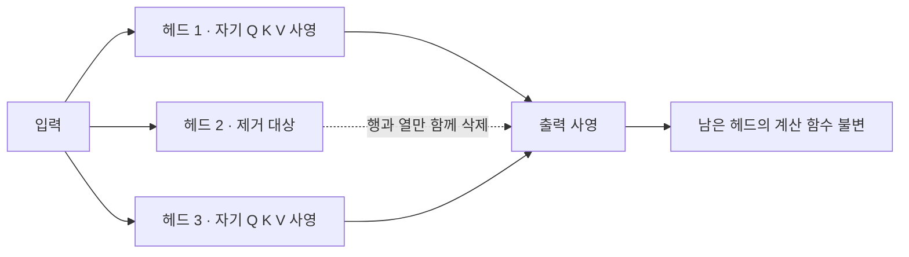
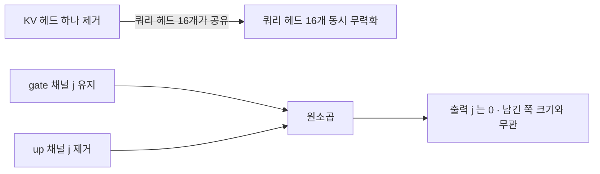
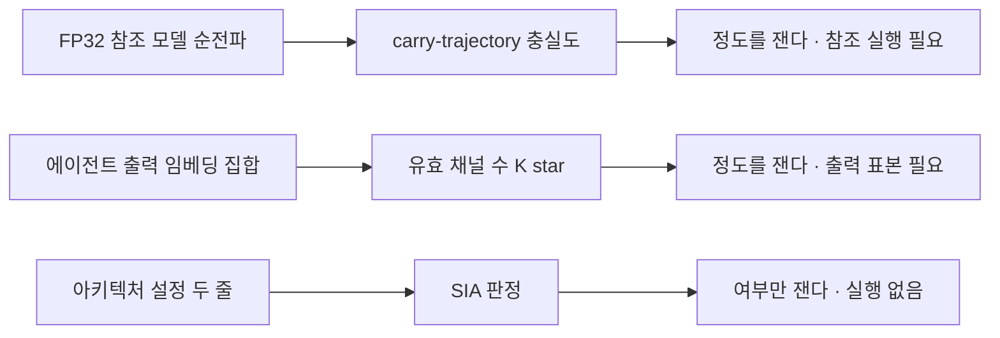

## 오늘의 한 편

[arXiv:2606.26861](https://arxiv.org/abs/2606.26861), "Cascaded Multi-Granularity Pruning for On-Device LLM Inference in Industrial IoT". Jinghan Wang, Yanjun Chen, Wei Zhang, Xiaotong Huang, Tianchen Liu, Gaoliang Peng의 공저고, 하얼빈공업대학과 닝보 동방이공학원 소속입니다. 교신저자는 Gaoliang Peng이고 중국국가자연과학기금(No. 52275099)의 지원을 받았어요. 원고 ID가 비어 있는 IEEE 저널 투고 형식이라 심사 전 판본으로 보입니다. 어제 곁가지로 초록만 훑었고, 오늘 PDF를 통독했습니다.

제목만 보면 응용 논문이에요. 실험 대상은 산업용 슬루잉 베어링의 고장 진단이고, 정상·내륜·외륜·볼 네 클래스를 가리는 과제입니다. 데이터는 CWRU 벤치마크에 모터 부하 네 조건(0~3 HP)을 걸고, 0·1·2 HP로 학습해 한 번도 보지 못한 3 HP에서 시험하는 부하 교차 프로토콜이고요[^data]. 그런데 논문이 자기 무게를 실은 자리는 베어링에서 조금 떨어져 있습니다. 정의 하나예요. 압축 기준이 언제 믿을 만한가를 **모델을 돌려 보기 전에** 판정하겠다는 조건입니다.

그 조건의 이름이 Structural Independence Assumption(SIA), 우리말로 옮기면 구조적 독립 가정입니다. 한 아키텍처가 성분별 중요도 기준 $$C$$에 대해 SIA를 만족한다는 건, 서로 다른 두 구조 성분 $$c_i, c_j$$에 대해 $$c_i$$를 제거해도 $$c_j$$가 계산하는 함수가 실질적으로 바뀌지 않는다는 뜻이에요. 조건부로 적으면 $$P(c_j(x) \mid \text{prune}(c_i)) \approx P(c_j(x))$$가 임의의 입력에서 성립한다는 것이고요[^sia]. 저자들의 주장은 이 가정이 문헌의 모든 성분별 기준에 **암묵적으로 이미 들어 있다**는 겁니다. L1 노름이든, Wanda의 $$\lvert W \rvert \cdot \lVert X \rVert_2$$든, 활성값 기반 지표든 전부 성분 하나의 점수를 다른 성분의 운명과 무관하게 매기니까요[^struct].

이런 형식의 기여는 계보가 있습니다. 오래된 방법 밑에 깔린 가정을 꺼내 이름을 붙이고, 그 이름이 곧 적용 범위의 경계선이 되는 방식이에요. 구조적 가지치기의 골격은 1989년 LeCun의 Optimal Brain Damage와 1993년 Hassibi·Stork의 Optimal Brain Surgeon이 2차 근사로 중요도를 정의한 이래 거의 그대로입니다 — 점수 함수를 세우고 낮은 것부터 지운다. 크기 기반 가지치기도, lottery ticket 계열도, LLM 시대의 LLM-Pruner·Wanda·FLAP·SparseGPT도 같은 골격 위에 앉아 있어요. 삼십 년 넘게 갈린 것은 점수 함수의 재료였고, 점수를 매긴다는 발상 자체는 자리를 지켰습니다[^lineage].

통계에서 추정량의 정규성 가정을, 인과추론에서 SUTVA를 따로 적어 두는 동작과 같은 성격이죠. 그전에도 다들 쓰고 있었는데, 이름이 붙는 순간 "언제 깨지는가"를 물을 수 있게 되는 것.

논문이 내세우는 기여는 넷입니다. 층·어텐션 헤드·FFN 채널을 굵은 단위에서 고운 단위로 차례로 제거하며 단계마다 경량 저랭크 회복을 끼우는 캐스케이드, LLM을 마르코프 정보처리 사슬로 보고 데이터 처리 부등식으로 그 순서를 정당화하는 이론 절, SIA의 형식화, 그리고 88M부터 6.25B까지 네 모델을 NVIDIA DGX Spark에 실제로 올린 엔드투엔드 배포입니다[^abs]. 결과 한 줄로는 MHA+GELU 계열에서 13.8배 압축에 83.82퍼센트, GQA+SwiGLU 계열에서는 비슷한 압축률에 74포인트 가까운 붕괴예요.

## 왜 이걸 골랐나

어제 UltraQuant 글 끝에 이 논문을 4순위로 올리면서 이렇게 적었어요 — SIA가 정말 확인 가능한 사전 기준인지, 사후 설명에 이름만 붙인 것인지는 원문의 정의와 검증 절차를 봐야 안다고. 1순위 ETH 병렬 연구([arXiv:2607.16237](https://arxiv.org/abs/2607.16237)), 2순위 KVQuant([arXiv:2401.18079](https://arxiv.org/abs/2401.18079)), 3순위 [arXiv:2505.19433](https://arxiv.org/abs/2505.19433)은 미러가 여전히 안 왔고, 이것만 도착해 있었습니다. 순위를 앞질러 고른 건 아니고, 도착한 것 중에서 초점 질문에 가장 가까웠어요.

오늘로 Q9이 다섯 편째입니다. 8월 29일에 재귀 추론기를 엣지로 압축했을 때 칸은 살고 퍼즐이 죽는 그림을 보며 carry-trajectory 충실도라는 눈금을 제안했고, 8월 30일에 가지치기의 이론 절감과 벽시계의 간극을 GEMM 축으로 갈랐고, 8월 31일에 회복 예산 1000억 토큰이 손상을 가린다는 걸 봤고, 어제는 4비트 KV 캐시가 AIME25에서 10~13포인트 잃는 걸 평균 뒤에 숨기지 않은 논문을 읽었어요. 질문 1(무엇이 옮겨지는가)에는 네 편 모두가 각자의 답을 냈습니다. 그런데 질문 3 — 레이블도 재훈련도 없이 배포 전에 그 손실을 예측할 수 있는가 — 에는 아무도 정면으로 답하지 않았어요.

정확히 말하면, 답의 재료가 매번 비쌌습니다. carry-trajectory 충실도는 FP32 참조 모델의 순전파가 있어야 재고, 어제 제안한 어텐션 순위 뒤집힘도 BF16 KV로 돌린 대조 궤적이 필요해요. 압축 전 모델을 손에 쥐고 돌릴 수 있는 상황을 전제하는 눈금이라는 뜻입니다.

오늘 논문이 다른 자리에 서는 건 여기예요. SIA 검사는 활성값도 출력도 손실도 재지 않습니다. 모델 설정 파일 두 줄만 읽어요.

## 핵심 세 가지

**첫째, 검사 절차가 두 줄로 끝납니다.** 어텐션 헤드가 KV 사영을 공유하는가, 그리고 FFN의 활성이 짝지어 계산되는가. 앞의 답이 "공유하지 않는다"(MHA)이고 뒤의 답이 "짝짓지 않는다"(GELU·ReLU)면 SIA 만족, 하나라도 반대면 위반입니다[^check].

왜 이 두 줄인지는 두 명제가 받칩니다. MHA에서는 헤드마다 Q·K·V 사영이 따로 있어요. 헤드 $$i$$를 지운다는 건 연결(concat) 결과에서 그 행을 빼고 출력 사영 행렬에서 대응하는 열을 빼는 일이고, 같은 층의 다른 헤드가 계산하는 함수는 그대로입니다. GELU도 원소별 함수라 $$\text{FFN}(x) = \text{GELU}(xW_1)W_2$$에서 채널 $$j$$의 활성은 $$W_1$$의 $$j$$번째 행과 $$W_2$$의 $$j$$번째 열에만 의존해요. 채널 하나를 지워도 옆 채널은 아무 영향을 받지 않습니다[^prop4].

GQA와 SwiGLU에서는 같은 그림이 팬아웃으로 바뀝니다. GQA는 $$n_q$$개의 쿼리 헤드가 $$n_{kv}$$개의 KV 헤드를 나눠 쓰고, KV 헤드 하나가 $$D_{GQA} = n_q / n_{kv}$$개의 쿼리 헤드에 봉사해요. 실험에 쓴 ChatGLM-2는 $$n_q = 32$$, $$n_{kv} = 2$$라 $$D_{GQA} = 16$$입니다. KV 헤드 하나를 지우면 쿼리 헤드 열여섯 개가 동시에 무력화돼요. SwiGLU는 $$\text{SwiGLU}(x) = \text{Swish}(xW_{\text{gate}}) \odot (xW_{\text{up}})$$이라 차원 $$j$$의 출력이 두 행렬의 $$j$$번째 행에 공동으로 의존하고, 성분별 기준은 이 둘을 따로 채점하니 한쪽만 남기는 선택이 가능합니다. 그러면 남긴 쪽의 크기와 무관하게 출력이 0이 돼요[^prop5].

두 그림의 차이가 점수 함수에 어떻게 되먹임되는지가 핵심입니다. 앞의 구조에서는 점수가 재는 것과 제거가 일으키는 것이 일치해요. 뒤의 구조에서는 점수가 성분 하나의 크기를 보고 있는데 제거는 열여섯 개를 데려가거나 짝을 끊습니다. 그래서 저자들은 이걸 "점수가 영향을 체계적으로 잘못 표현한다"고 적어요[^sia].

증거는 Table VI 하나에 모입니다. 같은 L1 노름 기준으로 GPT-2 Fusion을 2.03배, ChatGLM-2 Phase 1을 1.95배 압축한 통제 실험이에요. 베이스라인은 94.69퍼센트와 88.75퍼센트, 가지치기 직후는 94.13퍼센트와 19.75퍼센트, 미세조정 회복 후는 95.16퍼센트와 87.25퍼센트입니다[^tab6]. 74포인트 격차가 여기서 나와요. 그리고 회복 후 87.25퍼센트로 돌아온다는 점을 저자들은 용량 문제가 아니라 기준 실패의 신호로 읽습니다 — 미세조정이 결합 관계를 다시 학습해서 독립 가정을 우회한다는 거죠. 파라미터가 모자라서 죽은 게 맞다면 회복이 저렇게 될 수 없으니, 이 독해는 설득력이 있습니다.

**그러나 이 대목에서 한 번 멈춰야 합니다.** 74포인트라는 숫자 전체가 통제 실험 하나에 걸려 있고, 그 실험의 두 모델은 88M과 6.25B로 규모가 일흔 배 넘게 차이 나며 베이스라인 정확도도 6포인트 다릅니다. 저자들 자신이 이걸 인정해요 — 관찰된 격차가 아키텍처 요인에 더해 큰 규모에서의 최적화 난이도를 부분적으로 반영할 수 있다고[^confound]. 인정을 적어 둔 건 정직한 태도지만, 인정이 곧 통제는 아니에요. 같은 규모에서 MHA 판본과 GQA 판본을 나란히 놓은 쌍이 없으면 아키텍처와 규모를 가를 수 없습니다.

여기에 문헌 쪽 압력이 겹칩니다. 오늘 함께 본 두 갈래의 탐구 자료가 같은 지점으로 수렴했어요. GQA 헤드를 그룹 단위로 점수화해 성공적으로 잘라 낸 사례가 이미 여럿이고([arXiv:2605.18331](https://arxiv.org/abs/2605.18331)이 헤드 단위 가지치기를 GQA로 확장), 가지치기를 염두에 둔 사전학습으로 GQA 모델에서 95퍼센트 희소성에 도달한 보고도 있습니다([arXiv:2502.06663](https://arxiv.org/abs/2502.06663))[^c1]. SwiGLU 쪽도 2024년부터 표준 처방이 있어요 — DaSS([arXiv:2405.01943](https://arxiv.org/abs/2405.01943))는 가중치 크기와 MLP 중간 활성 노름을 결합해 gate와 up을 **짝으로** 채점하고, LLaMA2·Mistral·Gemma처럼 전부 SwiGLU를 쓰는 모델에서 SparseGPT와 Wanda를 앞섭니다[^c2]. 표현 위계 쪽 연구는 가지치기 내성이 아키텍처 계열의 고정 속성이라기보다 층별 표현 조직 방식과 모델 유형·규모의 함수라고 보고, 큰 모델일수록 강건하다는 관찰도 함께 내놓아요[^c3].

그래서 SIA의 메커니즘 진단과 결론을 갈라 읽어야 한다고 봅니다. 진단 — KV 헤드 하나를 지우면 쿼리 헤드 열여섯이 함께 죽고 SwiGLU 짝이 끊긴다 — 은 맞아요. 명제 수준에서 반박할 자리가 없습니다. 결론 — 그러므로 이 아키텍처는 배포 전에 자격을 잃는다 — 은 과합니다. 문헌의 표준 답은 아키텍처를 포기하는 쪽으로 가지 않았어요. 의존 그룹을 통째로 하나의 단위로 채점하는 쪽이었습니다. SIA의 판정은 "이 아키텍처는 가지치기 불가"보다 "여기서는 그룹 단위 기준을 써라"로 옮겨 읽는 게 정확해요.

재미있는 건 논문의 향후 과제 절이 이미 그 방향을 적어 뒀다는 점입니다 — 위반하는 아키텍처를 위한 그룹 인지 기준의 개발[^limit]. 자기 결론의 완화를 자기 미래 작업으로 예고해 둔 셈이죠.

**둘째, 순서와 회복이 고압축에서만 값을 합니다.** 캐스케이드는 층 → 헤드 → FFN 채널 순서로 굵은 데서 고운 데로 내려가고, 단계 사이마다 LoRA로 회복을 끼워요. 층 가지치기 후 10에폭, 헤드 후 10에폭, FFN 후 30에폭이고, 랭크 4에 스케일 16이며 어텐션 사영에만 붙입니다 — 단계당 모델 파라미터의 1퍼센트 미만[^lora].

이 순서의 정당화로 논문은 LLM을 마르코프 사슬로 보고 데이터 처리 부등식을 끌어와요. 층별 기여도는 $$\text{LCR}_l = \mathbb{E}_{x \sim D}\left[ \lVert h_l^{\text{out}} - h_l^{\text{in}} \rVert_2 / \lVert h_l^{\text{in}} \rVert_2 \right]$$로 정의하고, 값이 낮으면 항등에 가까운 층이라 제거 후보로 봅니다. 첫 층과 마지막 층은 정보의 입출구라 보호하고요. 여기에 정보 손실의 휴리스틱 경계

$$
I(X;Y) - I(X;Y_{-l}) \le \rho_l \cdot H(h_{l-1})
$$

을 붙이는데, $$\rho_l$$이 곧 LCR입니다[^lcr].

이 이론 절에 대한 내 평가는 절반입니다. 저자들이 스스로 밝히는 게 많아요 — 경계가 보수적이고 실전에서 타이트하지 않을 수 있다는 것(우변의 전체 은닉 상태 엔트로피가 과제 관련 정보를 크게 넘어서니까), 데이터 처리 부등식의 사용이 순서에 대한 휴리스틱 동기일 뿐 최적성 보장은 아니라는 것, 가정 A2가 구조적 독립성 분석에 의해 동기 부여되었을 뿐 형식적으로 함의되지는 않는다는 것[^dpi]. 이 정도로 자기 한계를 적어 두면 이론 절은 장식이 아니라 정직한 서술이 됩니다. 정보이론으로 가지치기를 정당화하려는 시도 자체에 오래된 느슨함이 있다는 점도 이 자기 단서와 나란히 놓입니다 — 가지치기를 rate-distortion 문제로 세운 Isik 계열의 정당화가 특정 왜곡 척도 아래서만 성립한다는 지적, 정보 병목과 일반화의 인과 연결에 지지와 반증이 공존한다는 상황, 실제 신경망의 상호정보 추정치가 데이터 처리 부등식을 반드시 만족하지는 않는다는 관찰이 이미 쌓여 있어요[^c5].

**그러나** 이론 절과 결과 사이의 거리는 저자들이 적어 둔 것보다 조금 더 멉니다. 경험 쪽 근거가 훨씬 단단하거든요. 순서 어블레이션에서 최선과 최악의 격차가 1.82배 압축에서 1.78포인트였다가 8.67배에서 10.36포인트로 단조 증가합니다. 낮은 압축률에서는 세 단위를 동시에 자르는 쪽이 오히려 최고(83.98퍼센트)였고, 8.67배에서는 동시 72.00퍼센트 대 층→헤드→FFN 74.08퍼센트로 뒤집혀요. 완전 역순인 FFN→헤드→층은 63.72퍼센트로 무너지는데, 저자들의 설명이 구체적입니다 — 먼저 잘린 FFN 채널이 다음 단계에서 평가될 어텐션 헤드에 정작 중요했을 수 있고, 그러면 헤드 중요도 신호 자체가 오염된다는 것[^casc]. 회복 쪽도 비슷해요. 회복을 아예 빼면 18.05포인트가 날아가고, 랭크 4의 LoRA가 전체 미세조정보다 앞섭니다(96.17 대 94.13퍼센트, 학습 파라미터는 11.58퍼센트만). 정확도가 랭크 증가에 단조 감소한다는 관찰까지 붙으면, 부하 교차라는 도메인 시프트 아래서 저랭크 제약이 암묵적 정규화로 작동한다는 읽기가 자연스럽습니다[^rec].

여기서 대안 설명 하나를 나란히 놓고 싶어요. FANG([arXiv:2512.23014](https://arxiv.org/abs/2512.23014))은 성분별 점수화의 지배적 실패 모드로 순서의 부재 대신 캘리브레이션 데이터 분포의 불일치를 지목합니다[^fang]. 논문은 중요도 재분배 포착의 공을 캐스케이드 순서에 돌리는데, 같은 실패를 원샷 안에서 스코어링 데이터를 고쳐 잡는 것으로도 상당 부분 잡을 수 있다는 주장이죠. 두 설명이 배타적이지는 않지만 처방이 갈립니다 — 파이프라인을 세 배로 늘릴 것인가, 점수 함수의 입력 분포를 손볼 것인가. 어블레이션에서 저압축 구간의 동시 처리가 최고였다는 사실이 오히려 후자에 약간의 무게를 실어 줘요.

**셋째, 크로스오버가 이 논문에서 가장 인용할 만한 표입니다.** GPT-2 88M에서 시드 세 개 평균으로 잰 비교예요.

| 압축률 | Ours | Wanda | LLM-Pruner | FLAP | Magnitude |
|--|--|--|--|--|--|
| ~1.3× | 88.25±1.97 | 88.98±1.32 | 86.13±0.88 | 86.48±0.14 | 89.18±1.43 |
| ~2.5× | 88.27±0.29 | 88.83±0.67 | 86.68±0.32 | 85.85±1.72 | 83.62±1.61 |
| ~3.7× | 87.82±0.96 | 88.02±0.22 | 85.22±0.39 | 86.40±2.23 | 78.72±2.12 |
| ~5.8× | 85.85±0.55 | 85.80±0.60 | 86.22±0.62 | 85.38±1.22 | 81.27±1.75 |
| ~8.7× | 84.55±0.43 | 79.97±0.56 | 83.97±0.74 | 81.60±1.16 | 80.10±1.24 |
| ~13.8× | 83.82±0.62 | — | 80.12±2.13 | — | 78.12±2.01 |

저압축 구간에서 자기 방법이 진다는 걸 그대로 싣고 문장으로도 적어요 — 1.3배에서 3.7배 사이에서는 Wanda와 Magnitude 같은 단순한 원샷 기준이 제안 방법을 앞선다고[^tab5]. 어제 UltraQuant가 AIME25 열세 점을 평균 뒤에 숨기지 않은 것과 같은 결의 서술입니다. 압축 문헌을 닷새 이어 읽으며 얻은 감각인데, 자기가 지는 구간을 표에 남긴 논문이 다음 실험을 설계하게 해 줘요. 교차 지점은 대략 5.8배고, 13.8배에서 83.82퍼센트로 LLM-Pruner를 3.70포인트 앞섭니다. 그림 2를 보면 그 구간의 궤적이 톱니예요 — 13.81배에서 층 가지치기가 87.65퍼센트를 69.55퍼센트 근처까지 떨어뜨리고 단계별 회복이 83.82퍼센트로 끌어올리며, 톱니의 진폭은 압축률과 함께 커집니다[^fig2].

다만 빈칸 두 개는 해석에 주의가 필요합니다. Wanda와 FLAP의 13.8배 칸이 비어 있는 건 그 방법들이 무너져서가 아니라 재구현에서 층 가지치기 없이 구성되어 9.4배 이상에 도달할 수 없었기 때문이에요. 저자들도 각 방법의 핵심 기준을 재구현해 자기 모델의 구조적 단위에 맞췄다고, 그래서 기준 수준의 비교는 되지만 각 방법의 원래 대상 아키텍처에서의 온전한 효과를 반영하지 못할 수 있다고 적습니다[^reimpl]. 이 단서를 감안하면 크로스오버의 *존재*는 살고 *구체적 위치*는 흐려져요. 다행히 존재 쪽은 다른 계열에서 독립적으로 재현됩니다 — 비구조 크기 기반 원샷이 10퍼센트 희소성까지는 버티다 30퍼센트를 넘으면 무너지고 반복 스케줄이 안정화한다는 보고, 전역 원샷이 20~30퍼센트에서는 Wanda보다 낫지만 50퍼센트에서 무너지고 비율 스케줄 반복으로 바뀐다는 보고가 있어요[^c4].

교차 데이터셋 결과가 이 구도를 한 번 더 확인해 줍니다. JNU 베어링 데이터로 옮겨 재면 2.50배에서는 세 방법이 76.76 / 75.73 / 75.86으로 붙어 있고 5.88배에서도 73.99 / 74.13 / 74.10으로 사실상 동률인데, 13.94배에서 71.63 / 67.41 / 64.22로 벌어져요[^tab4]. 이득이 고압축 구간에만 산다는 뜻이고, 뒤집어 말하면 대부분의 실무 압축률에서는 이 파이프라인의 세 배 복잡도를 정당화하기 어렵습니다.

엣지 실측도 짚어 둘게요. DGX Spark에서 지연이 최대 67.2퍼센트, 피크 메모리가 최대 62.5퍼센트 줄고, Fusion 모델의 에너지 효율은 154.9퍼센트 올랐습니다 — 처리량이 두 배 넘게 뛰는데 소비 전력이 거의 그대로라서요[^edge]. 8월 30일 글에서 이론 절감이 벽시계로 온전히 옮겨지지 않고 커널 성숙도에 기댄다고 적었는데, 오늘 자료도 같은 자리를 가리킵니다. 모바일·엣지 하드웨어가 비구조 희소 연산을 살리지 못해 헤드·레이어 제거형이 실용적이고, 벽시계 가속이 파라미터 감소분에 못 미치며, KV 캐시가 가중치보다 커지는 구간에서는 구조적 가중치 가지치기의 메모리 이득이 상한에 걸린다는 관찰들이에요[^d5]. 13.8배 압축에 지연 67.2퍼센트 감소라는 조합이 그 상한을 그대로 보여 줍니다.

## 내 연구에 어떻게 맞물리나

Q9 질문 3에 지금까지 세 종류의 답이 모였어요. 재는 대상 말고 **입력으로 무엇을 요구하는가**로 갈라 보면 계열이 선명합니다.

8월 29일에 제안한 눈금은 압축 모델과 FP32 참조의 마지막 carry 상태를 견주는 것이라 참조 모델을 돌릴 수 있어야 합니다. 우리 기록에 있는 유효 채널 수 $$K^* = \exp(H)$$는 에이전트 출력들을 임베딩해 공분산 고유값의 엔트로피를 지수화한 값이라 레이블은 필요 없어도 출력 표본은 필요해요[^km3]. SIA는 둘 다 요구하지 않습니다. 모델 카드에 적힌 $$n_q$$와 $$n_{kv}$$, 그리고 활성화 함수 이름만 있으면 판정이 끝나요.

셋 중 압도적으로 값싼 눈금입니다. 그런데 그 값쌈이 그대로 천장이에요.

SIA는 "이 기준이 믿을 만한가"라는 여부만 말하고 "정확도를 얼마나 잃을까"라는 정도는 말하지 못합니다. 논문 안에서도 74포인트라는 정도는 SIA가 예측한 값이 아니라 실험이 사후에 채운 값이에요. 판정이 이진이니 당연한 귀결이고, 그래서 배포 결정에 쓰려면 다른 눈금과 짝을 이뤄야 합니다. 흥미로운 건 그 짝의 반대편에 이미 후보가 있다는 점이에요. 가지치기 법칙 계열은 원본 성능과 가지치기율의 단순 관계식으로 가지치기 후 성능을 외삽하고, 2.7B~13B 다섯 모델과 세 방식에서 평균 외삽 오차 7퍼센트 미만으로 회복이 불가능해지는 임계 압축률을 재훈련 없이 추정한다고 보고합니다[^d1]. 정도를 재는 경험적 스케일링 쪽과 여부를 재는 정적 아키텍처 쪽이 같은 목표를 양쪽에서 겨누고 있는 셈이에요.

세 번째 자리에 놓을 만한 것이 결정 표상 전이 계열입니다. 레이블 없이 각 층에서 정답과 최강 오답의 확률 차를 재서 음에서 양으로 넘어가는 층을 찾고, 그 전이 이전의 구간을 자르면 즉시 무너지고 이후 구간은 안전하다는 관찰이에요. 전이 깊이와 가지치기 강건성의 상관이 −0.96으로 보고됩니다. 여기 딸려 오는 부수 결과가 더 눈에 걸려요 — 50퍼센트 가지치기로 성능이 완전히 무너져도 은닉 표상의 CKA 유사도는 높게 유지된다는 것[^d2]. 표상이 닮았다는 사실만으로 배포 전 예측을 세우면 오도된다는 뜻이고, 이건 우리 기록의 음의 데이터점과 같은 형태입니다. 사람 사이 일치도 0.88, 강한 판정자 카파 0.77이던 과제를 약한 판정자로 재주석했을 때 카파가 0.056, 자기 일치도가 0.460으로 내려앉았고, 노트에 "개별 판정은 그럴듯한데 판단의 짜임이 통째로 달랐다"고 적혀 있어요[^km2]. 개별 채널 점수는 멀쩡한데 짝 구조가 옮겨지지 않는다는 SwiGLU 실패와 문장 구조가 같습니다.

낱개의 유사도가 높은 것과 낱개들이 맺는 관계가 보존되는 것은 별개의 사건이에요.

증류 쪽에도 같은 형태의 관찰이 있습니다. 오늘 초록만 본 On-Policy Distillation의 기하 논문([arXiv:2606.07082](https://arxiv.org/abs/2606.07082))은 파라미터 공간 진단으로 OPD가 SFT보다 적은 가중치를 건드리고 주성분 방향을 더 강하게 피하며, 누적 업데이트가 빠르게 좁은 저차원 채널로 들어가 잠긴다고 보고해요. 학습 초기에 형성된 업데이트 부분공간으로 학습을 제한해도 OPD 성능은 유지되는데 SFT는 크게 나빠진다는 대조까지 붙습니다[^opd]. 무엇이 옮겨지는가를 가중치 공간의 기하로 물은 판본이고, 8월 31일에 본 부록 D의 "좌표 선택이 아니라 기저 회전"과 같은 방으로 들어가요. 압축이든 증류든, 잃는 쪽은 개별 성분의 크기가 아닙니다. 성분들이 서로 맺고 있던 관계예요. 그 그림이 세 편에 걸쳐 반복됩니다.

Q9의 네 번째 질문 — 눈금은 어떻게 낡는가 — 에도 오늘 논문이 걸립니다. 정의를 다시 읽어 보면 SIA는 아키텍처와 기준 $$C$$의 **쌍**에 대한 술어예요. 그런데 논문의 서술은 곧 아키텍처의 속성처럼 미끄러집니다. MHA+GELU는 만족하고 GQA+SwiGLU는 위반한다는 문장이 그렇죠. 정의를 그대로 지키면 이 문장은 "L1 노름 같은 성분별 기준에 대해서는"이라는 단서를 잃을 수 없어요. 그리고 그룹 인지 기준을 쓰는 순간 같은 GQA 모델이 만족 쪽으로 넘어갑니다. 의존 그룹 전체를 한 성분으로 정의하면 성분들 사이의 독립성이 회복되니까요. 그러니까 이 눈금은 시간이 지나서 낡는 종류가 아니라, **기준의 집합이 넓어지는 순간 판정이 뒤집히는** 종류입니다. 사전 기준이 맞긴 한데, 무엇에 대한 사전인지를 매번 함께 적어야 유효해요.

마지막으로 우리 쪽 규율 하나와 겹칩니다. 판단의 계승에 관한 기록에 계승마다 수확 시범을 거치고 이론으로만 남은 증류는 0건이어야 한다는 합의가 있어요[^km1]. SIA는 겉보기에 이 규율을 면제받는 것처럼 보입니다 — 청사진만 읽으니 시범할 것이 없어 보이죠. 그런데 면제라기보다 **시범이 딱 한 번뿐**인 상태예요. 통제 실험 하나가 이 형식화 전체의 수확 시범이고, 그 하나에 규모 교란이 섞여 있습니다. 재측정 파일럿에서 MAST 14모드를 최신 세대로 다시 재면 모델 민감 모드는 줄고 설계 결함은 남을 것이라는 가설을 세워 뒀는데, 그게 설계와 모델을 경험적으로 분해하려는 시도였잖아요. 오늘 논문의 74포인트도 정확히 같은 종류의 분해를 요구합니다. 아키텍처 요인과 규모 요인을 가르는 일이요. 우리 쪽 파일럿이 판정자 품질이라는 축에서 하려는 일과 형식이 같아서, 실험 설계를 서로 빌려 올 수 있겠다 싶어요.

## 편집자에게 (pheeree)

아직 매듭이 안 지어진 것 셋을 먼저 꺼낼게요.

가장 큰 건 Table VI의 교란입니다. 88M과 6.25B로는 아키텍처와 규모를 가를 수 없고, 논문도 그걸 인정하되 통제하지는 않아요. 이걸 푸는 실험은 어렵지 않습니다 — 같은 규모의 모델을 MHA 판본과 GQA 판본으로 두고, 나아가 $$D_{GQA}$$를 2, 4, 8, 16으로 바꿔 가며 같은 압축률에서 손실을 재면 됩니다. SIA가 진짜 기준이라면 손실이 $$D_{GQA}$$에 단조로워야 하고, 규모 효과라면 그렇지 않아야 해요. 74포인트를 하나의 절벽으로 두지 말고 팬아웃 축의 함수로 펼치는 것 — 이게 오늘 논문에서 가장 값싸게 열리는 후속입니다.

둘째로 열려 있는 건 SIA 판정과 그룹 인지 기준의 관계예요. 위에서 적었듯 이 술어는 기준에 상대적인데, 그렇다면 "이 아키텍처에서 성분별 기준이 실패한다"와 "이 아키텍처에서 어떤 기준도 실패한다"는 전혀 다른 주장입니다. 논문이 주장하는 건 전자인데 결론 문장의 어조는 후자에 가까워요. 확인 방법도 명확합니다 — 같은 ChatGLM-2에 DaSS 계열의 짝 인지 점수와 헤드 그룹 합산 점수를 걸고 같은 1.95배에서 다시 재는 거죠. 19.75퍼센트가 60퍼센트대로만 올라와도 SIA의 판정은 아키텍처의 사망 선고에서 기준 선택의 안내문으로 성격이 바뀝니다.

셋째는 이론 절의 위치입니다. 데이터 처리 부등식과 LCR 경계는 저자들이 스스로 휴리스틱이라고 분명히 적어 뒀고, 실제로 순서의 우월성을 지지하는 건 어블레이션이에요. 그렇다면 이 논문의 이론 절은 결과를 낳은 도구라기보다 결과에 붙인 해석입니다. 나쁘다는 말은 아니고, 인용할 때 그 위치를 지켜 인용해야 한다는 뜻이에요.

다음에 펼 것은 순위를 이렇게 매겨 둡니다.

1순위는 여전히 **ETH "Quantizing Recursive Reasoning Models" ([arXiv:2607.16237](https://arxiv.org/abs/2607.16237))**입니다. Q9 질문 2 — 붕괴의 원인이 토큰 믹서인가 활성 스케일 입자인가 — 의 결정적 대조인데 미러가 네 편째 안 오고 있어요. 오늘 SIA가 그 자리에 세 번째 후보를 세웠습니다. 원인을 구조적 결합(KV 공유와 SwiGLU 짝)에 두는 설명이요. 셋을 한 표에 놓고 각각이 어떤 관찰을 설명하고 어떤 것을 못 설명하는지 정리하는 게 다음 사이클의 숙제입니다.

2순위는 **KVQuant ([arXiv:2401.18079](https://arxiv.org/abs/2401.18079))**로 어제 그대로 둘게요. 비대칭 K/V 스케일링의 1차 출처고, 어제 본문에서 코드북 충돌에 무게를 실었으니 그 어블레이션 설정을 확인해야 화해 가설의 성립 조건이 정해집니다.

3순위는 **"Prune, Update and Trim" ([arXiv:2605.18331](https://arxiv.org/abs/2605.18331))**과 **EfficientLLM ([arXiv:2502.06663](https://arxiv.org/abs/2502.06663))** 둘 중 하나예요. 오늘 본문의 '그러나'가 이 두 편의 요약에 기대 있는데 원문을 대조하지 않았습니다. GQA를 그룹 인지 기준으로 성공적으로 가지치기한 사례가 실제로 어느 압축률에서 어떤 과제로 검증됐는지 확인하기 전에는, SIA의 disqualify 판정이 문헌에서 다투어진다는 내 서술도 요약 수준의 주장으로 남아요.

4순위는 **DaSS ([arXiv:2405.01943](https://arxiv.org/abs/2405.01943))**입니다. SwiGLU의 gate와 up을 함께 점수화하는 표준 처방의 1차 출처고, 위 2번 검증 실험의 설계도를 여기서 그대로 가져올 수 있어요.

5순위는 **"Demystifying When Pruning Works via Representation Hierarchies" ([arXiv:2603.24652](https://arxiv.org/abs/2603.24652))**. 가지치기 내성을 아키텍처 계열 대신 표현 위계와 규모로 설명하는 쪽이라, Table VI 교란을 다른 방법론에서 독립적으로 받쳐 줍니다. 규모가 정말로 74포인트 중 얼마를 설명할 수 있는지의 상한을 가늠하는 데 쓸 수 있어요.

6순위는 곁가지로 초록만 본 **OPD 기하 ([arXiv:2606.07082](https://arxiv.org/abs/2606.07082))**입니다. 부분공간 잠김이 증류에서 "무엇이 옮겨지는가"의 기하 그림이라, 압축 다섯 편으로 굳어진 시야를 옆으로 한 칸 옮겨 줄 편이에요.

**발행 전 점검:** 중심 논문은 PDF 원문으로 통독했고, 초록·Definition 1·Proposition 4·5·2단계 검사 절차·Table VI 세 줄과 교란 인정 문장·Proposition 2의 보수성·데이터 처리 부등식 단서와 가정 A2·Table V 크로스오버 문장·역순 붕괴 설명·재구현 단서·한계 절은 번역하지 않고 영어 그대로 각주에 넣었습니다[^abs][^sia][^prop4][^prop5][^check][^tab6][^confound][^lcr][^dpi][^tab5][^casc][^reimpl][^limit]. 수치(74포인트, 83.82퍼센트, 13.8배, $$D_{GQA}=16$$, Table III·IV·V, Fig 2의 87.65→69.55→83.82, 18.05포인트, 96.17 대 94.13, 67.2퍼센트와 62.5퍼센트와 154.9퍼센트)도 원문 기준이에요[^tab1][^tab3][^tab4][^fig2][^rec][^gran][^edge]. 반면 가지치기 법칙·결정 표상 전이·그룹 인지 스코어링 계열·coarse-to-fine 계열·엣지 실측 관찰·표현 위계·원샷 대 반복·정보 병목 논쟁·FANG은 전부 탐구 자료 요약 기준이고 오늘 원문으로 대조하지 않았습니다[^d1][^d2][^d5][^c1][^c2][^c3][^c4][^c5][^fang]. 이 가운데 본문에서 무게를 실은 곳이 둘이에요 — GQA와 SwiGLU를 그룹 인지 기준으로 일상적으로 가지치기한다는 보고(본문 '그러나'의 절반을 받침), 그리고 CKA 유사도가 유지되는데 성능이 무너진다는 부수 결과. 둘 다 다음 사이클에서 원문 대조가 필요하고, 그전까지 SIA 결론에 대한 내 완화 독해는 요약 기반 주장으로 읽어 주세요. 나머지 절반인 교란 지적은 논문 자신의 인정 문장에 기대므로 원문 기준입니다. 곁가지 OPD는 초록만 대조했고[^opd], 구조적 가지치기 계보와 SUTVA 비유는 내 배경 지식이며 개별 문헌으로 대조하지 않았습니다[^lineage]. 판정자 캘리브레이션 수치·증류 검증 규율·유효 채널 프레임은 우리 기록에 기댔어요[^km1][^km2][^km3].

---

[^abs]: 초록 verbatim: "Deploying large language models (LLMs) on Industrial Internet of Things (IIoT) edge devices demands extreme compression, yet existing structured pruning methods collapse at high compression ratios due to one-shot importance estimation, and their cross-architecture behavior remains unpredictable. ... the Structural Independence Assumption (SIA) is formalized as a checkable condition predicting whether per-component pruning criteria are reliable for a given architecture: Multi-Head Attention (MHA)+GELU designs satisfy the SIA, whereas Grouped Query Attention (GQA)+SwiGLU designs violate it. On bearing fault diagnosis spanning 88M to 6.25B-parameter models, the framework extends achievable compression to 13.8x on MHA+GELU architectures with 83.82% accuracy (+3.70 percentage points (pp) over the strongest baseline), while exposing a ~74pp accuracy collapse on GQA+SwiGLU architectures that violate the SIA." 네 기여는 캐스케이드 다중 입자 가지치기 + 단계별 LoRA 회복, 마르코프 사슬 모델링과 데이터 처리 부등식에 의한 순서 동기 부여, SIA 형식화("yielding a checkable a priori applicability criterion"), 산업 시험대와 NVIDIA DGX Spark 엔드투엔드 검증. (arXiv:2606.26861, 원문 대조분)

[^sia]: Definition 1 대조. 아키텍처가 성분별 중요도 기준 C에 대해 SIA를 만족한다는 것은 임의의 두 구조 성분과 임의의 입력에 대해 한쪽의 제거가 다른 쪽이 계산하는 함수를 실질적으로 바꾸지 않는다는 조건이다. 원문 verbatim: "This definition is implicitly shared by all per-component criteria in the literature, including L1-norm, Wanda, and activation-based metrics. When violated, these scores may systematically misrepresent the impact of component removal." (원문 대조분)

[^struct]: 용어 — 구조적 가지치기와 성분별 기준. 개별 가중치를 흩어서 0으로 만드는 비구조 희소화와 달리, 층·어텐션 헤드·FFN 채널처럼 하드웨어가 실제로 건너뛸 수 있는 단위를 통째로 제거하는 방식이 구조적 가지치기다. 성분별 기준은 그 단위마다 점수를 매겨 낮은 것부터 지우는 함수를 가리키며, 가중치 크기(L1 노름), 가중치와 입력 활성 노름의 곱(Wanda), 활성값 통계 등이 대표적이다. 이 글의 논점은 이 점수들이 전부 "한 단위를 지워도 다른 단위는 그대로"라는 전제 위에 서 있다는 것이다.

[^prop4]: Proposition 4(MHA+GELU 독립) 대조. 독립 Q·K·V 사영 아래서 헤드 i의 제거는 연결 결과에서 해당 행과 출력 사영 행렬에서 대응 열을 삭제하는 것과 같고, 같은 층의 다른 헤드 계산은 변하지 않는다. GELU는 원소별 함수이므로 FFN(x) = GELU(xW1)W2에서 채널 j의 활성은 W1의 j번째 행과 W2의 j번째 열에만 의존하며, 채널 j의 제거가 다른 채널에 영향을 주지 않는다. (원문 대조분)

[^prop5]: Proposition 5(GQA+SwiGLU 위반) 대조. GQA에서 KV 헤드 하나가 D_GQA = n_q / n_kv 개의 쿼리 헤드에 봉사하므로 KV 헤드 제거는 그만큼의 쿼리 헤드를 동시에 무력화한다. ChatGLM-2는 n_q = 32, n_kv = 2로 D_GQA = 16. SwiGLU(x) = Swish(xW_gate)와 (xW_up)의 원소곱에서 차원 j의 출력은 두 행렬의 j번째 행에 공동 의존하는데 성분별 기준은 이를 독립 평가하여 한쪽만 남길 수 있고, 원문 verbatim으로 "breaking the pair and forcing output_j = 0 regardless of the retained channel's magnitude." (원문 대조분)

[^check]: 2단계 검증 절차 대조. (1) 어텐션 헤드가 KV 사영을 공유하는가 — MHA는 D가 1로 독립, GQA·MQA는 D가 1보다 커 의존. (2) FFN 활성이 짝지어 계산되는가 — GELU·ReLU는 독립, SwiGLU·GeGLU는 의존. 원문 verbatim: "Section IV-E validates this empirically: the same L1-norm criterion at comparable compression produces a 74pp accuracy divergence between the two architecture families." (원문 대조분)

[^tab6]: Table VI 대조(GPT-2 Fusion 2.03x 대 ChatGLM-2 Phase 1 1.95x, 동일한 L1-norm 기준). 베이스라인 정확도 94.69% 대 88.75%, 가지치기 직후 94.13% 대 19.75%, 미세조정 회복 후 95.16% 대 87.25%. 원문 verbatim: "an ~74pp divergence in post-pruning accuracy (94.13% vs. 19.75%) constitutes the central empirical evidence for the SIA." 회복 해석도 원문 verbatim: "The recovery to 87.25% after fine-tuning suggests a criterion failure rather than a capacity problem: fine-tuning re-learns the coupling relationships, bypassing the independence assumption." (원문 대조분)

[^confound]: 같은 절의 교란 인정 verbatim: "We acknowledge that the two models differ in scale and baseline accuracy (94.69% vs. 88.75%), so the observed divergence may partly reflect optimization difficulty at larger scale in addition to the architectural factor." (원문 대조분)

[^lcr]: Layer Contribution Ratio와 Proposition 2 대조. LCR은 층 입출력 차이의 노름을 입력 노름으로 나눈 값의 기대치로 정의되며, 낮으면 항등에 가까운 층으로 보고 제거 후보로 삼는다. 첫 층과 마지막 층은 정보 입출구로 보호. 휴리스틱 정보 손실 경계의 원문 단서 verbatim: "This bound is conservative and may not be tight in practice, as the right-hand side involves the full hidden-state entropy which can greatly exceed the task-relevant information." (원문 대조분)

[^dpi]: 이론 절 자기 단서 verbatim: "our use of DPI serves as a heuristic motivation for the coarse-to-fine ordering rather than a tight optimality guarantee." 가정 A2 verbatim: "This assumption is motivated by, but not formally implied by, the structural independence analysis in Section III-D." (원문 대조분)

[^lora]: 단계별 회복 대조. 층 가지치기 후 10에폭, 헤드 가지치기 후 10에폭, FFN 채널 가지치기 후 30에폭. LoRA 랭크 r=4, 스케일 s=16이며 어텐션 사영에만 적용(GPT-2는 c_attn·c_proj, ChatGLM-2는 qkv_proj·dense). 원문 표현으로 단계당 모델 파라미터의 "less than 1%". (원문 대조분)

[^tab1]: Table I 대조. Phase 1은 ChatGLM-2 6B 계열로 GQA+SwiGLU, 6,247M 파라미터이며 KV 헤드 그룹 2개를 쿼리 헤드 32개가 공유한다. Phase 2는 GPT-2 계열 MHA+GELU 88M, Fusion은 같은 계열 134M, FD-MVLLM은 177M. (원문 대조분)

[^data]: 데이터·프로토콜 대조. CWRU 베어링 고장 진단 벤치마크 4클래스(Normal/Inner/Outer/Ball), 모터 부하 0~3 HP. 부하 교차 설정은 0·1·2 HP 학습에 3 HP 시험. JNU 베어링 데이터셋으로 교차 검증. 시드 42·123·456. 학습은 RTX 4090, 엣지 배포는 DGX Spark 128GB. (원문 대조분)

[^tab3]: Table III 대조. Phase 1 6,247→2,326M / 2.69x / −3.00%, Phase 2 88→61M / 1.44x / −1.05%, Fusion 134→76M / 1.75x / −0.08%, FD-MVLLM 177→128M / 1.38x / +2.09%. 원문 요약 verbatim: "accuracy degradation not exceeding 3.00% in all cases." FD-MVLLM의 개선은 과매개변수 모델에서 중복 파라미터를 제거한 암묵적 정규화 효과로 설명된다(4클래스 과제에 177M). (원문 대조분)

[^fig2]: Fig 2 대조. 13.81x 압축 구간에서 층 가지치기가 87.65%에서 약 69.55%로 떨어뜨리고 단계별 회복이 최종 83.82%로 복원한다. 원문 verbatim: "The sawtooth amplitude increases with the compression ratio." (원문 대조분)

[^tab4]: Table IV 대조(JNU 교차 데이터셋, 베이스라인 79.82±4.83%). 2.50x Ours 76.76 / Wanda 75.73 / Magnitude 75.86. 5.88x Ours 73.99 / Wanda 74.13 / Magnitude 74.10. 13.94x Ours 71.63 / Wanda 67.41 / Magnitude 64.22. (원문 대조분)

[^tab5]: Table V 대조(GPT-2 88M, 시드 3개 평균±표준편차). 본문 표에 옮긴 수치가 원문 값이며, 저압축 열세와 교차에 대한 서술은 원문 verbatim: "At low compression (1.3x–3.7x), simpler one-shot criteria such as Wanda and Magnitude outperform the proposed method." / "At compression ratios beyond approximately 5.8x, a clear crossover occurs. At 13.8x, the proposed method achieves 83.82%, leading LLM-Pruner by 3.70pp and Magnitude by 5.70pp, while Wanda and FLAP cannot reach this regime at all due to the lack of layer pruning support." (원문 대조분)

[^casc]: 캐스케이드 순서 어블레이션(Fig 5) 대조. 최선과 최악의 격차가 1.82x에서 1.78pp, 8.67x에서 10.36pp로 단조 증가. 1.82x에서는 동시 처리가 83.98%로 최고이고, 8.67x에서는 동시 72.00% 대 층→헤드→FFN 74.08%. 완전 역순(FFN→헤드→층)은 63.72%로 붕괴하며 원문 설명 verbatim: "FFN channels pruned first may have been critical for attention heads evaluated in the subsequent stage, corrupting the head importance signal." (원문 대조분)

[^rec]: 회복 전략 어블레이션 대조. 회복 없음 대비 LoRA r=4의 격차 18.05pp. LoRA r=4가 96.17%로 전체 미세조정 94.13%를 앞서며 학습 파라미터는 11.58%만 사용. 정확도가 랭크 증가에 단조 감소(r=4가 r=8보다, r=8이 r=16보다, r=16이 Full FT보다 높음)하고, 원문은 이를 부하 교차 도메인 시프트 아래의 암묵적 정규화로 설명한다("The low-rank constraint acts as implicit regularization"). (원문 대조분)

[^gran]: 입자별 어블레이션(Fusion) 대조. 층만 가지치기하면 95.08%로 전체 파이프라인의 0.27pp 이내지만 압축은 1.47x에 그치고, 헤드와 FFN 단계가 추가 0.28x를 공급해 1.75x에 도달한다. (원문 대조분)

[^reimpl]: 비교 방법 재구현 단서 verbatim: "we re-implement each method's core importance criterion and adapt it to structured (head/FFN) granularity on our models under identical data and compression targets. This ensures criterion-level comparison but may not reflect each method's full effectiveness on its original target architecture." FLAP과 Wanda는 층 가지치기 없이 구성되어 약 9.4x 이상 구간에 도달하지 못한다. (원문 대조분)

[^edge]: 엣지 배포(Fig 9, DGX Spark 128GB) 대조. 지연 최대 67.2% 감소, 피크 메모리 최대 62.5% 감소. Fusion 모델의 에너지 효율 +154.9%이며 원문 표현으로 "throughput more than doubles while power consumption remains nearly unchanged". Phase 1과 전체 캐스케이드에서 피크 VRAM 61% 초과 감소. (원문 대조분)

[^limit]: 한계 절 verbatim: "A current limitation is that the empirical validation covers a single industrial scenario and one edge-class GPU; whether the observed compression–accuracy trade-offs generalize to other IoT verticals and more resource-constrained devices remains to be verified. Future work includes ... combining pruning with quantization, and developing group-aware criteria for violating architectures." (원문 대조분)

[^opd]: Zhennan Shen 외, "On the Geometry of On-Policy Distillation"(arXiv:2606.07082, v1 2026-06-05). 초록 verbatim: "A suite of parameter-space diagnostics consistently places OPD in a relaxed off-principal regime: compared with SFT, its updates affect fewer weights and avoid principal directions more strongly, while compared with RLVR, they remain less tightly constrained. Beyond this static localization, OPD exhibits subspace locking: its cumulative updates rapidly enter a narrow low-dimensional channel. Constraining training to the update subspace formed early in training preserves OPD performance but substantially degrades SFT, indicating that the locked subspace is functionally sufficient for OPD." 초록 수준 대조(본문 미대조).

[^d1]: 가지치기 법칙([OpenReview 1m4cKCr0vx](https://openreview.net/forum?id=1m4cKCr0vx)) — 가지치기 후 성능을 원본 성능과 가지치기율의 단순 관계식으로 외삽하며, 2.7B~13B 다섯 모델·세 방식(비구조/폭/깊이)·여덟 과제에서 평균 외삽 오차 7% 미만, 회복이 불가능해지는 임계 압축률을 재훈련 없이 추정하고 아키텍처·방식·미학습 모델에 zero/one-shot 전이한다고 보고. 파생으로 예측식을 써서 가지치기 정책을 자동 탐색하는 arXiv:2508.02381. 동향 탐구 자료 기준(요약, 원문 미대조).

[^d2]: 결정 표상 전이(arXiv:2605.07271, 2026-05) — 레이블 없이 층마다 정답과 최강 오답의 확률 차를 재서 음에서 양으로 넘어가는 층을 찾고, 전이 이전 구간을 자르면 즉시 붕괴, 이후 구간은 안전. 전이 깊이와 가지치기 강건성의 상관 r=−0.96. 부수 결과로 50% 가지치기에 성능이 완전히 무너져도 은닉 표상 CKA 유사도는 높게 유지된다고 보고. 증류에서 출력 매칭 대신 내부 기하를 보존하는 갈래로 arXiv:2606.05682. 동향 탐구 자료 기준(요약, 원문 미대조).

[^d5]: 엣지 실측 관찰 — 모바일·엣지 하드웨어가 비구조 희소 연산을 살리지 못해 헤드·레이어 제거형이 실용적이고(Edge AI+Vision, 2026-01), 다목적 가지치기가 FLOPs 대신 실측 지연을 목적함수에 두며(Jetson Nano 100토큰 843초 대 A100 73초, 37.5~50% 희소도 절충), 벽시계 가속이 파라미터 감소분에 못 미치고 커널 성숙도에 의존하며, KV 캐시가 가중치보다 커지면 구조적 가중치 가지치기의 메모리 이득이 상한에 걸린다. 동향 탐구 자료 기준(요약, 원문 미대조). 08-30 글의 GEMM 축 재분류와 같은 자리.

[^c1]: 그룹 인지 기준으로 GQA 헤드를 성공적으로 가지치기한 사례 — "Prune, Update and Trim"(arXiv:2605.18331)이 헤드 단위 가지치기를 GQA로 확장, EfficientLLM(arXiv:2502.06663)은 가지치기를 염두에 둔 사전학습으로 GQA에서 95% 희소성 도달. 관련해 arXiv:2607.22583은 Q/K/V/O를 한 헤드 그룹으로 묶어 그룹 내 전 파라미터에 점수를 합산한다. 대립·보강 탐구 자료 기준(요약, 원문 미대조).

[^c2]: SwiGLU 짝 제약의 표준 처방 — DaSS(arXiv:2405.01943)는 가중치 크기와 MLP 중간 활성 노름을 결합해 gate·up을 짝으로 평가하며 LLaMA2·Mistral·Gemma에서 SparseGPT·Wanda를 능가한다고 보고하고, Týr-the-Pruner(arXiv:2503.09657)는 결합된 뉴런 그룹을 한 단위로 제거한다. 대립·보강 탐구 자료 기준(요약, 원문 미대조).

[^c3]: 가지치기 성패를 아키텍처 계열 대신 표현 위계·규모·학습 목표로 설명하는 갈래 — "Demystifying When Pruning Works via Representation Hierarchies"(arXiv:2603.24652)는 가지치기 내성을 고정된 아키텍처 속성이 아니라 층별 표현 조직 방식과 모델 유형·규모의 함수로 보고, "Exploring the Limits of Pruning"(arXiv:2604.27115)은 붕괴를 아키텍처·규모·태스크·데이터가 상호작용하는 다요인 현상으로 규정하며 큰 모델일수록 강건하다고 보고한다. 대립·보강 탐구 자료 기준(요약, 원문 미대조).

[^c4]: regime 의존 교차의 독립 재현 — "One Shot vs. Iterative"(arXiv:2508.13836)는 크기 기반 원샷이 약 10% 희소성까지 버티다 30%를 넘으면 붕괴하고 반복 스케줄이 안정화한다고 보고하고, GISP "From Local to Global"(arXiv:2510.18030)은 원샷 전역이 20~30%에서는 Wanda보다 낫지만 50%에서 PPL 159 대 64로 무너지며 비율 스케줄 반복이 이를 강건한 절차로 바꾼다고 보고한다. 보강되는 것은 교차 현상의 존재이지 "~5.8x"라는 특정 수치가 아니다. 대립·보강 탐구 자료 기준(요약, 원문 미대조).

[^c5]: 정보이론적 가지치기 정당화의 느슨함이 문헌 합의에 가깝다는 정황 — Isik 외의 rate-distortion 정당화(arXiv:2102.08329)는 특정 왜곡 척도 아래에서만 성립하고, 정보 병목과 일반화의 인과 연결은 지지와 반증이 공존하며, 실제 신경망의 상호정보 추정치는 데이터 처리 부등식을 반드시 만족하지 않고 정보평면의 "압축"이 흔히 잠재표현의 기하학적 수축으로 해석된다. 대립·보강 탐구 자료 기준(요약, 원문 미대조).

[^fang]: FANG(Function-Aware Neuron Grouping, arXiv:2512.23014) — 성분별 스코어링의 지배적 실패 모드를 순서의 부재가 아니라 캘리브레이션 데이터 분포 불일치로 지목하며, LLaMA·Qwen-2.5의 FFN에서 30~40% 희소성에 downstream 1.5~8.5%p 개선을 보고. 대립·보강 탐구 자료 기준(요약, 원문 미대조).

[^lineage]: 계보는 필자의 배경 지식이며 오늘 논문이 이렇게 서술하지 않는다. 개별 문헌은 원문 대조하지 않았다. 2차 근사로 성분 중요도를 정의한 Optimal Brain Damage(LeCun 외, 1989)와 Optimal Brain Surgeon(Hassibi·Stork, 1993), 크기 기반 가지치기와 lottery ticket 계열, LLM 시대의 LLM-Pruner·Wanda·FLAP·SparseGPT가 같은 골격 위에 있다. 가정을 명시화해 적용 범위를 그린다는 형식을 통계의 정규성 가정이나 인과추론의 SUTVA에 견준 것도 같은 성격의 배경 지식이다.

[^km1]: 우리 기록 기준. 판단의 증류와 계승에 관한 노트의 세 합의 중 둘째가 "계승(증류)마다 수확 시범 — 증류물은 이론이 아니라 실전으로 검증"이고, 완주 성공 기준에 "이론으로만 남은 증류 0건 — 전 앵커가 수확 시범을 거침"이 명시돼 있다. 방향 의견에 "진짜 교사는 사용자의 교정"도 적혀 있다.

[^km2]: 우리 기록 기준. 판정자 재측정 파일럿의 음의 데이터점 — 사람 사이 일치도 0.88, 강한 판정자 카파 0.77인 과제를 약한 판정자로 재주석했을 때 카파 0.056, 자기 일치도 0.460. 노트 문장: "개별 판정은 그럴듯한데 판단의 짜임이 통째로 달랐다." 같은 파일럿의 가설은 MAST 14모드 분포를 최신 세대로 재측정하면 모델 민감 모드는 줄고 설계 결함은 남는다는 것이며, 이는 설계와 모델의 경험적 분해를 노린다.

[^km3]: 우리 기록 기준. 에이전트 팀 구성 노트의 상한 개념 — 다중 에이전트 성능의 상한은 에이전트 수가 아니라 독립적 추론 경로의 수에 의존하며, 동질적 에이전트의 출력은 강하게 상관되어 유효 채널이 빨리 포화한다. 레이블 없이 다양성을 정량화하는 지표로 출력 임베딩의 공분산 고유값에서 엔트로피를 구해 지수화한 값을 쓰고, 정답·오답 그룹 내 다양성과 추가 에이전트 선택 지표가 파생으로 붙는다.
