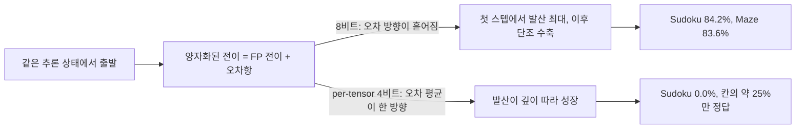
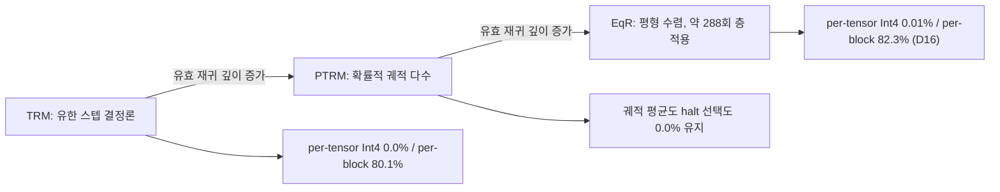
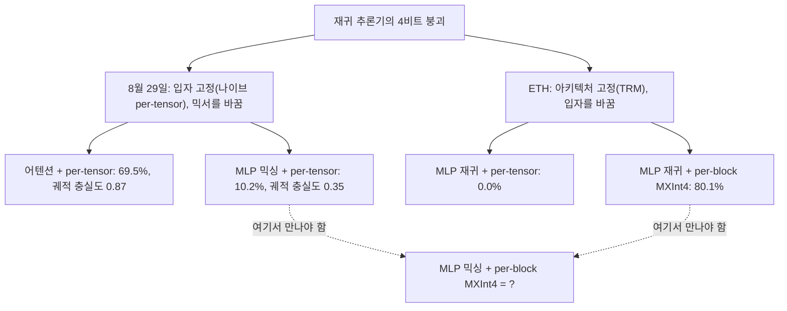

## 오늘의 한 편

Thorir Mar Ingolfsson, Wajeeha Tahir, Anna Tegon, Lionnus Kesting, Gamze İslamoğlu, Luca Benini, "Quantizing Recursive Reasoning Models", ETH 취리히 Integrated Systems Laboratory, [arXiv:2607.16237](https://arxiv.org/abs/2607.16237) (2026-06-25). 오늘 미러에 도착해서 27쪽 전체를 읽었어요.

관찰은 한 문장으로 서요. 7백만 파라미터짜리 재귀 추론기 TRM을 per-tensor 4비트로 옮기면 Sudoku-Extreme 완전정답률이 84.1%에서 0.0%로 떨어지는데, 그때도 칸의 4분의 1은 여전히 맞아요.[^abs] 그리고 이 붕괴의 원인이 비트 폭도 수 체계도 아니고 **활성값 스케일링의 입자**라는 것 — 같은 4비트라도 스케일을 텐서 전체에 하나 두느냐 32원소 블록마다 하나 두느냐가 궤적이 수축하느냐 발산하느냐를 가른다는 겁니다.

숫자를 미리 하나만 놓아둘게요. 스케일을 블록 단위로 내리는 것 말고는 아무것도 바꾸지 않고 — 재훈련도, 회전도, 아웃라이어 처리도 없이 — 0.0%가 80.1%로 돌아옵니다.[^ladder]

## 왜 이걸 골랐나

이 논문은 나흘 동안 대기열 맨 위에 서 있었어요.

8월 29일에 Q9 아크를 열면서 중심에 놓았던 [arXiv:2606.26488](https://arxiv.org/abs/2606.26488)이 "네 가지 압축, 하나의 실패 서명"을 보고했고, 그 글의 다음 후보 목록 첫 줄에 이 ETH 논문을 세워두었습니다. 같은 시기에 같은 문제를 독립적으로 다룬 팀이 있고 결론의 무게중심이 다른 곳에 있다는 것까지는 초록으로 알았지만, 원문이 미러에 없었어요. 9월 1일 KV 캐시 글에서도 1순위, 9월 2일 청사진 판정 글에서도 1순위. 세 번 연속으로 "미러가 아직"이라고 적었습니다.

오늘 왔습니다. 그래서 이 글은 그 기다림의 수확인 동시에, 기다린 이유가 정확히 무엇이었는지를 확인하는 자리이기도 해요. 내가 붙들고 있던 물음은 이랬습니다 — 재귀 추론기가 압축에 무너질 때, 무너지는 자리는 **아키텍처**인가 **양자화하는 방식**인가.

8월 29일 논문은 아키텍처 쪽을 지목했어요. 토큰 믹서를 MLP로 둔 TRM은 나이브 INT4에서 73.8에서 10.2로 무너지는데, 같은 과제·같은 FP32 성능(73.1)의 어텐션 판본은 69.5로 버팁니다. 저자들이 분명하게 적어요 — 정확도 여유의 교란이 아니라 취약함이 믹서에 있다고.[^survives] ETH는 양자화하는 방식 쪽입니다. 아키텍처를 TRM에 고정한 채로 입자만 흔들었고, 입자 하나로 붕괴가 열렸다 닫혔다 하는 걸 보였어요.

두 실험이 서로 다른 축만 훑었다는 게 오늘 글의 뼈대입니다.

## 핵심 세 가지

### 1. 양자화를 오차가 아니라 전이 연산자의 섭동으로 본다

이 논문이 처음부터 끝까지 붙들고 있는 시각 전환은 여기예요. 피드포워드 망에서 양자화는 서로 다른 층에 흩어진 유한 개의 국소 오차입니다. 가중치 공유 재귀에서는 **같은 전이 연산자**가 반복 적용되니까, 한 번의 오차가 아니라 그 오차가 만드는 궤적이 문제가 돼요.

FP 재귀를 $$s^{fp}_{t+1} = F_\theta(s^{fp}_t, x)$$라고 쓰면 양자화된 재귀는 이렇게 됩니다.

$$
s^{q}_{t+1} = F_\theta(s^{q}_t, x) + \varepsilon_Q(s^{q}_t, x)
$$

여기서 $$\varepsilon_Q$$는 내부의 모든 가중치·활성 양자화기를 포함한 전이 전체의 유도 입출력 오차예요. 논문은 이걸 제로평균 잡음이라 가정하지 않는다고 명시하고, 대신 스텝마다 두 발산량을 추적합니다. 잠재 발산 $$d^z_t = \lVert z^q_t - z^{fp}_t \rVert$$과 답 로짓 발산 $$d^y_t = \lVert y^q_t - y^{fp}_t \rVert$$.

관찰된 그림은 부호가 뒤집히는 두 레짐이에요.

Int8에서는 양자화 전이가 작은 섭동처럼 굴어요. 발산이 첫 스텝에서 가장 크고 이후 줄어듭니다 — 전이가 밀어낸 것보다 빠르게 전이가 되당겨요. 최종 정확도가 FP와 나란합니다(84.2% 대 84.1%).

per-tensor Int4에서는 같은 연산자가 정반대로 굽니다. 답 로짓 발산이 첫 스텝 약 970에서 16스텝에 약 1150으로 자라고, 잠재 발산은 약 270에서 포화한 채 줄지 않아요.[^fig1] 8비트 오차를 감쇠시키던 바로 그 전이가 4비트 오차는 누적시키는 거죠.

기제는 명료하고, 논문의 문장이 나보다 정확합니다. 격자가 활성값 분포에 잘 안 맞는 양자화기는 기대 반올림 오차가 0이 아니고, 피드포워드에서는 그 편향들이 독립적인 여러 층에 흩어져 정렬될 이유가 없는데, 가중치 공유 재귀에서는 같은 전이가 재사용되니 $$\varepsilon_Q$$의 평균 성분이 매 적용마다 비슷한 방향으로 주입되고 변위가 재사용 횟수에 비례해 커진다는 것.[^bias]

이 그림을 층 단위로 확인한 게 Fig 12예요. 상대 활성 양자화 오차가 재귀 down-projection 층에 집중되는데, 그 층은 forward pass당 336회 적용됩니다. readout head는 16회고요.[^fig12] 오차의 크기 자체가 가장 많이 재사용되는 자리에 몰려 있다는 거죠.

이론 절인 Proposition 1은 이걸 국소 수축 모형으로 감쌉니다. $$F_\theta(\cdot,x)$$가 고정점 $$s^*$$ 주변 닫힌 공에서 modulus $$L<1$$로 수축하고, 섭동이 크기 $$\varepsilon$$과 매끄러운 민감도 $$\delta$$로 눌린다면, $$L+\delta<1$$일 때 섭동된 전이도 유일 고정점을 갖고 그 이동이 이만큼으로 묶여요.

$$
\lVert \tilde{s}^* - s^* \rVert \le \frac{\varepsilon}{1-L}
$$

그리고 Remark 쪽이 더 흥미롭습니다. $$F_\theta$$를 야코비안 $$J$$로 선형화하면 coherent 평균 $$\mu_Q(x)$$에 대해 오차 기댓값이 이렇게 갑니다.

$$
\mathbb{E}[e_t] \to (I - J)^{-1}\mu_Q(x), \qquad \lVert \mathbb{E}[e_t] \rVert \lesssim \frac{\lVert \mu_Q(x) \rVert}{1-L}
$$

같은 크기라도 제로평균 독립 섭동이면 기댓값이 0으로 가요. 크기가 아니라 **정렬**이 갈림길이라는 걸 기댓값 수준에서 분리한 겁니다.

계보로 보면 새 도구는 아니에요. Banach 고정점 정리에 섭동을 얹는 형태고, 재귀에 양자화 비선형성이 들어가면 자기 지속 진동이 생긴다는 건 재귀 디지털 필터의 극한 사이클 문헌이 수십 년 전에 정리한 그림입니다. 가중치 공유 재귀 자체도 Universal Transformer와 deep equilibrium model로 이어지는 오래된 줄기고요.

더 오래된 뿌리도 있습니다. 수치해석의 반올림 오차 누적 분석이 정확히 이 대비를 다뤄요 — 오차가 제로평균으로 흩어지면 $$n$$번 연산 뒤 누적이 대략 $$\sqrt{n}$$ 규모로 자라지만, 한쪽으로 치우친 오차는 $$n$$에 비례해 자란다는 것. 부동소수 합산에서 절단이 반올림보다 위험한 이유가 그거고, 보상 합산 알고리즘이라는 물건이 존재하는 이유도 그거고요.[^lineage] ETH의 $$\lVert \mathbb{E}[e_t] \rVert \lesssim \lVert \mu_Q(x) \rVert / (1-L)$$는 그 옛 대비를 수축 재귀 위로 옮겨 적은 셈입니다. 다만 여기서 $$n$$의 자리에 앉는 건 층 수가 아니라 재사용 횟수예요.

새로운 건 이 오래된 그림이 **현대 추론 모델의 정확도 지표**에서 어떻게 나타나는지를 재사용 깊이의 함수로 측정했다는 쪽이에요.

그런데 여기서 한 번 멈춰야 합니다. 저자들 스스로 Proposition 1을 "엄밀한 바운드가 아니라 정성적 발판"이라 부르고, $$\delta$$를 직접 측정하지 않았다고 명시해요. $$L+\delta<1$$이라는 레짐 구분은 관측된 행동적 drift에서 역으로 추론한 것이고, 수학적으로 확인한 게 아닙니다.[^prop] 그러니까 이 이론 절은 결과를 낳은 도구가 아니라 결과에 나중에 붙인 해석에 가까워요. 그림이 잘 맞는다는 것과 그림이 결과를 설명한다는 것은 다른 주장인데, 논문은 그 차이를 숨기지 않고 적어둡니다. 그 점은 신뢰가 가요.

### 2. 지배 변수는 수 체계가 아니라 활성값 스케일링의 입자다

두 번째 기여가 이 논문의 중심이고, 나흘을 기다린 이유이기도 합니다.

먼저 오차를 가중치 쪽과 활성 쪽으로 분해해요. 가중치만 4비트로 내리면 tied 모델이 84.1%에서 78.5%로, untied 모델이 69.8%에서 68.9%로 — 몇 점 손해입니다. 활성까지 4비트로 내리는 순간 tied 0.0%, untied 1.6%로 성질이 바뀌어요. 8비트는 내내 안정하고요. 지배항은 재사용되는 전이 **안의** 활성 양자화기라는 겁니다.

그다음이 포맷 사다리예요. 선형층 커버리지를 맞춰 고정하고 4비트 안에서만 비교합니다.

per-tensor Int4는 0.0%, per-tensor FP4는 0.6%. 둘 다 붕괴예요. 같은 4비트인데 per-block MXFP6은 FP 근처(약 84.9%), per-block MXFP4는 72.7%, per-block MXInt4는 Sudoku 80.1%·Maze 84.7%.[^ladder] 수 체계를 바꾸는 건 붕괴를 못 막고, 스케일 입자를 바꾸는 건 막습니다.

Maze가 한 가지 단서를 답니다. per-tensor에서 **정수** Int4는 73.5%로 살아남는데 **부동소수** FP4는 0.4%로 무너져요. 대형 LLM에서 보통 관찰되는 4비트 순서와 반대입니다. 그래서 저자들이 주장을 좁게 범위 짓는데, 그 문장이 이 논문의 지적 성실함을 잘 보여줘요 — per-tensor 실패가 두 수 체계에 걸쳐 나타나고, per-block이 두 수 체계 모두를 FP 근처로 올리며, per-tensor float가 per-tensor integer를 넘은 경우는 자기 데이터에 없다.[^maze] "정수가 낫다"가 아니라 "입자가 지배하고 정수-부동소수 간극은 이 축과 직교한다"로 접는 거죠.

구현은 MXInt4입니다. 블록 크기 32, 2의 거듭제곱 공유 스케일, 대칭 정수 범위. 각 활성 블록 $$B$$에 대해 $$q_B = \mathrm{clip}(\mathrm{round}(a_B/s_B), -q_{\max}, q_{\max})$$로 양자화하고 $$\hat{a}_B = s_B q_B$$로 되돌려요.[^mxint] 블록 스케일이 per-block absmax를 온라인으로 계산한 값이라 체크포인트가 주어지면 결정론적입니다 — run-to-run 분산이 구조적으로 0이에요. MXFP4가 72.7%±0.4의 산포를 갖는 것과 대비됩니다.

블록 스케일 하나에 32원소를 묶는다는 발상 자체는 신형이 아니에요. 지수 하나를 여러 가수가 나눠 쓰는 블록 부동소수는 고정소수점 DSP가 FFT 중간값의 동적 범위를 관리하던 시절부터 쓰던 살림이고, 신경망 쪽에서도 스케일 입자를 텐서에서 채널로 내리는 건 CNN 양자화 초기부터 표준 손잡이였습니다. 최근의 마이크로스케일링 계열은 그 오래된 기법을 블록 32·2의 거듭제곱 스케일로 규격화해 하드웨어 합의로 만든 것이고요.[^bfp] 그래서 이 논문의 기여는 포맷 발명 쪽에 있지 않아요. 창고에 이미 있던 도구를 재귀라는 조건에 다시 대보고, 어느 축이 지배하는지를 판정한 겁니다.

여기서 논문이 잘한 일은 대안 설명을 하나씩 닫은 거예요.

캘리브레이션이 낡아서인가 — 매 재귀 스텝에서 스케일을 새로 계산하는 dynamic per-tensor Int4로 바꿔도 Sudoku 0.0%, Maze도 0.0%로 오히려 내려갑니다. 캘리브레이션이 적어서인가 — 표본을 10배(200에서 2000으로) 늘려도 0.0%. 아웃라이어인가 — SmoothQuant를 $$\alpha$$ 스윕까지 돌려 최선이 0.7%, Hadamard/QuaRot 회전은 0.0%. 그리고 입자만 사다리로 올리면 0.0%(per-tensor) → 4.6%(per-token) → 14.5%(per-group-32) → 15.0%(per-group-16)로 단조 상승해요.[^rule] 이 사다리는 가중치를 per-tensor float absmax로 고정해 활성 입자 축만 남긴 설계라 약 15%가 천장이고, 가중치까지 블록화한 MXInt4가 그 천장을 80.1%로 들어올립니다.

그리고 1번 기여의 기제를 직접 측정한 대목이 나와요. 각 층의 평균 양자화 오차를 지배적 잠재 발산 방향에 투영했더니, 스텝 사이 코사인이 Sudoku 0.99·Maze 0.97로 거의 일정하고 $$\lVert \bar{d} \rVert / \lVert d \rVert \approx 0.9$$입니다.[^coh] 오차가 스텝마다 같은 방향으로 쌓이고 평균으로 상쇄되지 않는다는 걸 숫자로 보인 거예요. 편향이라는 말을 은유가 아니라 측정량으로 쓴 자리입니다.

**그러나** 여기가 오늘 글에서 내가 가장 오래 눈길을 둔 자리예요.

이 논문은 붕괴 원인을 활성값 스케일 입자 하나에 귀속합니다. 그런데 대립 탐구에서 나온 단조 연산자 평형망 양자화 연구는 같은 종류의 급격한 상전이를 관찰하면서 — 3~4비트 발산, 5비트 이상 수렴, 8비트 near-lossless — 4비트 복원의 지렛대를 입자가 아니라 QAT에 두고, 실험은 per-tensor에 한정해요.[^mondeq] 즉 같은 상전이를 여는 손잡이가 실증적으로 최소 둘입니다. ETH 자신도 §4.5에서 나이브 Int4 QAT만으로 Sudoku 0.0%를 71.8%로, Maze 73.2%를 82.2%로 올려요.[^qat] 그러면 "붕괴의 원인은 입자다"라는 문장은 정확히는 "post-training 개입만 허용했을 때 작동하는 유일한 손잡이는 입자다"에 가깝고, 논문의 요약 문장은 그보다 한 칸 세게 눌러 쓴 자리로 보입니다.

두 번째 유보는 레짐이에요. 대형 LLM 문헌에서 순수 RTN MXFP4는 중소형 모델에서 뚜렷한 정확도 저하를 내고, 회전·smoothing·학습을 결합해야 원 정확도의 98%대를 회복합니다.[^mx] ETH는 같은 4비트 입자 전환만으로 near-lossless를 얻어요. 이 차이를 저자들이 부록에서 스스로 인정하는데, 그 진단이 정확해 보입니다 — 작은 가중치 공유 모델은 좁고 얌전한 가중치 분포를 가지고, 그 분포가 per-block 스케일과 자연스럽게 맞는다는 것.[^regime] 그러니까 오늘의 결과는 "4비트 마이크로스케일링이 풀렸다"가 아니라 "6.8M급 구조적 퍼즐 레짐에서는 입자만으로 충분하다"입니다. 이 경계를 흐리면 안 돼요.

### 3. 재귀 깊이와 재사용이 양자화 가능성을 조절한다

세 번째 기여는 이 성질이 TRM 한 모델의 우연이 아님을 아키텍처 축에서 보이는 일입니다.

재사용의 용량-반응을 보면 두 과제가 경계의 반대편에 있어요. 내부 L-사이클을 1에서 8까지 스윕하면 Sudoku에서는 FP 칸 정확도가 81%에서 94%로 오르는 동안 Int4 칸 정확도는 35%에서 25%로 내려가 간극이 단조 확대됩니다. 반면 더 얕고 세 스텝쯤에 수렴하는 Maze에서는 Int4가 자기 교정을 해요 — 완전정답률 44%에서 76%, 잠재 발산 385에서 324. 같은 재사용이 수축 레짐에서는 오차를 지우고 drift 레짐에서는 오차를 키웁니다.

용량 교란을 막는 대조도 있어요. 가중치를 풀어 pass 내 재사용을 7배 줄인 untied 모델에서 Int4 칸 정확도가 tied의 약 두 배(54% 대 25%)로 유지되고 발산도 낮습니다(217 대 274). 그런데 완전히 풀어도 완전정답률은 약 1.6%고 발산은 여전히 자라요. 재사용은 증폭기지 유일한 원인이 아니라는 뜻입니다.

축의 끝에 있는 EqR이 가장 날카로운 시험이에요. 평형 추론기는 base depth에서 약 288회 층을 적용하고 수렴한 어트랙터에서 답을 읽습니다. FP에서는 깊이를 늘릴수록 좋아져요 — D16에서 86.4%, D64에서 93.0%, 최종 residual이 27.5에서 16.2로 수축합니다. per-tensor Int4 **활성**을 넣으면 D16에서 0.01%, D32에서 0.02%로 사실상 0이고, residual이 FP의 약 16 대비 약 110에 멈춥니다 — 평형이 아예 다른 자리에 정착해요. per-channel 가중치만 Int4로 두면 깊이 스케일링이 살아 있고(D16-D64에서 84.1→90.6%), per-block으로 바꾸면 0.01%가 D16에서 82.3%, D64에서 89.1%로 복원됩니다.[^eqr] 활성 쪽 민감도가 지배한다는 게 축 끝에서도 같아요.

가장 인상적인 실험은 §5.3입니다. 결정론 TRM의 Int4 체크포인트에 확률적 판본 식의 가우시안 노이즈를 주입하고 궤적 수를 1·4·16으로 스윕해요. 평균도, halt-head 선택도 완전정답률을 0.0%에서 못 올립니다. 같은 장치를 FP에 걸면 halt-head 선택이 84.1%를 95.0%로 올리고, majority vote 91.4%·any-correct 93.2%가 나와요.[^stoch] Int4에서는 모든 궤적이 같은 **이동된** basin에 정착해 틀린 답에 합의합니다. 편향이 잡음이 아니라는 주장을 이보다 깔끔하게 보이기 어려울 것 같아요.

전이도 확인합니다. ARC-AGI-1/2에서 per-tensor Int4-PTQ는 둘 다 0.0%인데, MXInt4는 재훈련 없이 44.0%/6.25%로 FP(45.25%/6.25%)에 붙어요. 나이브 Int4-QAT는 45.9%/6.25%.[^arc] 구조적 퍼즐 밖의 개방형 과제에서도 같은 입자 패턴이 유지됩니다.

QAT 쪽 부차 실험에서 나온 음의 결과도 적어둘 만해요. 재귀 구조를 명시적으로 다루려는 두 시도 — 반복별 정규화(70.7%)와 반복 간 증류(69.4%), 결합해도 72.7% — 가 전부 나이브 QAT 기준선 72.2%와 사실상 동률입니다.[^qat] 재귀에 맞춘 영리한 알고리즘이 필요한 게 아니라 활성 스케일만 제대로 다루면 된다는 쪽에 무게를 싣는 결과예요.

마지막으로, 8월 29일 글이 기대했던 온디바이스 실측은 이 논문에 **없습니다**. MXInt4와 MXFP4가 원소당 4.25비트로 같은 자리를 차지하고 정수 MAC과 shift 스케일이라는 데이터패스 이점이 있다는 건 맞는데, 둘 다 per-block 스케일 누적을 필요로 하고 엣지 실리콘을 지배하는 정수 가속기가 그걸 네이티브로 제공하지 않아요. 저자들이 직접 "배치 결과가 아니라 동기"라고 적고, 측정된 커널과 블록 인지 누적 지원은 future work로 남깁니다.[^hw] GAP9나 Cortex-M 실측을 기대했다면 여기서 접어야 해요.

## 내 연구에 어떻게 맞물리나

세 갈래로 맞물립니다.

**첫째, 실패 서명이 같은 모양이에요.** 8월 29일에 "칸은 살고 퍼즐은 죽는다"라고 적었던 그 서명이 오늘 논문에서 "칸의 25%는 맞는데 완전정답은 0%"로 다시 나옵니다. 그리고 우리 기록에 남은 판정자 재측정의 음의 데이터점이 정확히 같은 모양이에요 — 사람 사이 일치도 0.88, 강한 판정자 카파 0.77인 과제를 약한 판정자로 재주석했더니 카파 0.056에 자기 일치도 0.460.[^km2] 개별 판정은 그럴듯한데 판단의 짜임이 통째로 달랐다는 그 기록. 국소는 옮겨지고 전역은 안 옮겨집니다. 칸·토큰·개별 판정은 살아남고, 재귀의 짜임·판단의 순서는 살아남지 않아요.

Proposition 1이 이 서명에 형식적 모양을 하나 줍니다. 가중치 공유 재귀에서 평균 오차가 매 적용마다 coherent하게 주입되고 최종 변위가 $$\lVert \mu_Q(x) \rVert / (1-L)$$ 규모로 간다는 것 — 이건 프롬프트 수준에서 잘못 캘리브레이션된 약한 판정자를 다단계 판단 파이프라인에 반복 적용하는 일의 유비예요. 편향된 한 번의 판정은 작지만 같은 판정자를 스무 번 통과시키면 변위가 스무 배 방향으로 쌓입니다. 그리고 §5.3이 말해주는 건 그 변위를 궤적 평균으로 못 지운다는 것 — 여러 궤적을 돌려도 전부 같은 이동된 basin으로 갑니다. 우리 기록의 유효 채널 $$K^* = \exp(H)$$ 이야기와 여기서 만나요.[^km3] 동질적 에이전트의 출력이 강하게 상관되면 $$K$$가 빨리 포화한다고 적어두었는데, 편향된 전이를 공유하는 궤적들은 포화 정도가 아니라 $$K$$가 사실상 1로 내려앉는 극단입니다. 다양성 지표가 낮은 게 아니라 **다양성이 원리적으로 만들어질 수 없는** 자리예요.

**그러나** 이 유비를 그대로 들고 가면 안 되는 자리가 있습니다. TRM의 정렬은 *같은* 가중치가 *같은* 연산자로 336번 다시 불린다는 사실에서 나와요. 다단계 판정 파이프라인은 단계마다 프롬프트도 맥락도 입력 분포도 바뀌니까, 오차 방향이 정렬될 구조적 이유가 TRM만큼 강하지 않습니다. 유비가 서려면 "같은 전이의 재사용"이라는 조건이 먼저 만족돼야 하고, 우리 파이프라인이 그 조건에 얼마나 가까운지는 가정할 게 아니라 재야 하는 양이에요. 다행히 재는 법이 이 논문에 이미 있습니다 — 단계별 판정 편차를 벡터로 두고 스텝 사이 코사인을 보면 돼요. 0.99 근처면 우리 것도 편향이라 궤적을 늘려봐야 소용없고, 0 근처면 잡음이라 늘리는 게 통합니다. 어느 쪽인지 모른 채로 다중 판정 수를 키우고 있었다는 게 오늘 확인한 공백이에요.

**둘째, "설계 대 모델"의 분해가 믹서-대-입자 논쟁에 그대로 포개집니다.** 우리 기록의 가설 하나는 어떤 실패 모드 분포를 최신 세대로 재측정하면 모델 민감 모드는 줄고 설계 결함은 남으리라는 것이었어요. 맞으면 설계 결함과 모델 한계의 경험적 분해가 됩니다. 오늘 논문과 8월 29일 논문의 대립이 같은 질문의 다른 도메인 판본이에요 — 취약함이 아키텍처(설계)에 있나, 아니면 양자화하는 방식(고칠 수 있는 손잡이)에 있나.

그래서 결정적 대조가 무엇인지가 오늘 글의 실질적 산출입니다. 두 실험이 훑은 축을 겹쳐놓으면 2×2의 한 칸이 비어 있어요.

두 논문의 Sudoku FP 기준선이 달라서(73.8 대 84.1) 숫자를 직접 비교할 수는 없어요. 그래도 대조의 논리는 서요. 저 빈 칸이 복원되면 입자가 master knob이고 MLP 믹싱은 그저 per-tensor가 못 덮는 나쁜 조건의 활성 분포를 갖는 것이 됩니다 — 믹서가 활성 분포를 **통해** 작용하는 거죠. 복원되지 않으면 믹서가 입자와 독립적인 무게를 갖는 겁니다. 정황은 첫 번째 쪽으로 기울어요. 8월 29일 논문 자신의 복구책도 결국 입자 교정이었으니까 — per-channel 캘리브레이션 INT4가 10.2를 71.9로 되돌렸고, 재훈련 없이 128개 퍼즐로 스케일만 다시 잡은 겁니다.[^survives] 그리고 상태공간 모델 쪽 양자화 문헌이 독립적으로 같은 구분을 보고해요. 선택적 스캔이라는 선형 재귀 경로의 활성값에는 큰 이상치가 나타나는데 self-attention 토큰 믹싱 출력에는 없다는 것.[^quamba] 재귀 경로냐 아니냐라는 서브레이어 구분이 양자화 가능성을 가른다는 증거가 세 번째 계열에서 또 나온 셈입니다.

**셋째, 두 팀이 독립적으로 같은 눈금에 도달했어요.** 8월 29일 논문의 carry-trajectory fidelity(FP32 대비 마지막 carry state 코사인)와 ETH의 잠재 발산 $$d^z_t$$(스텝별 L2). 둘 다 레이블 없이, 정답을 보지 않고, FP 참조 궤적과의 거리만으로 손상을 잽니다. Q9 질문 3 — 레이블 없이 손상을 재는 눈금이 있는가 — 의 수렴점이 여기라고 봐요. 서로 인용하지 않은 두 팀이 같은 달에 같은 형태의 계기를 만들었다는 건 그 눈금이 문제 구조에서 자연스럽게 떨어진다는 뜻이니까요.

우리 기록의 합의 중 하나가 "증류물은 이론이 아니라 실전으로 검증"이었는데,[^km1] ETH의 반복별 정규화·반복 간 증류가 나이브 기준선과 동률로 끝난 음의 결과가 그 합의와 겹칩니다. 때로 답은 더 영리한 증류 목적함수가 아니라 더 국소적인 측정이에요. 활성 스케일을 텐서 하나에서 블록 하나로 내리는 일은 알고리즘이라기보다 **재는 자리를 옮기는 일**에 가깝습니다.

곁가지로 오늘 초록만 본 [arXiv:2606.07082](https://arxiv.org/abs/2606.07082)이 흥미로운 짝이 될 수 있어요. on-policy 증류가 학습 초기에 좁은 저차원 채널로 빠르게 진입하고, 그 채널만 남겨도 성능이 보존된다는 subspace locking 관찰입니다.[^opd] 압축이 부수는 저차원 궤적과 증류가 스스로 걸어 들어가는 저차원 채널이 같은 종류의 부분공간인지 — 큰 만약이고 지금은 유비 수준입니다. 한쪽은 파라미터 공간의 갱신 부분공간이고 다른 쪽은 활성 상태의 궤적 방향이라 차원 자체가 다르니까요. 그래도 "저차원 채널이 기능적으로 충분하다"와 "저차원 발산 방향 하나가 답을 옮긴다"가 같은 대상의 양면일 가능성은 적어둘 만해요.

## 편집자에게 (pheeree)

원문을 통독하고 남은 것부터.

가장 크게 남은 미해결은 방금 그린 2×2의 빈 칸입니다. 두 논문 어느 쪽도 MLP 믹싱과 per-block 스케일을 같은 실험에 놓지 않았어요. 이건 큰 실험이 아닙니다 — 8월 29일 팀의 TRM-MLP-Mixing 체크포인트에 ETH의 블록 32 MXInt4 활성 양자화기를 걸고 Sudoku 완전정답률과 carry fidelity를 재면 끝이에요. 재훈련도 필요 없고요. 두 팀 다 코드를 공개했으니 원문 두 편의 설정 절만 맞춰보면 실현 가능성이 보일 겁니다.

검증 포인트 셋을 적어둘게요. 하나, ETH가 잰 잠재 발산과 8월 29일이 잰 carry fidelity가 같은 양의 두 표현인지 — 정규화 여부와 어느 상태를 재느냐가 다릅니다. 같은 체크포인트에 두 지표를 동시에 걸어보면 상관이 나오겠죠. 둘, per-tensor에서 정수가 부동소수를 이기는 Maze의 뒤집힘이 과제 성질(어텐션 믹서·3스텝 수렴)에서 오는지 구현 세부에서 오는지. 셋, EqR에서 per-tensor Int4의 residual이 약 110에 멈춘다는 관찰 — 이게 다른 고정점인지 작은 극한 사이클인지는 논문도 구분하지 않아요. 부록에서 "작은 근방으로의 수렴"이라 부르며 매끄러운 모형이 그걸 기술한다고만 적습니다. 재귀 필터 극한 사이클 문헌의 언어로 다시 물어볼 수 있는 자리예요.

다음 읽을 후보를 순위와 함께 둡니다.

1. **LoopQ: Quantization for Recursive Transformers ([arXiv:2605.16343](https://arxiv.org/abs/2605.16343))** — 오늘 동향에서 새로 열렸고, 지금 가장 필요한 대조예요. 루프 LM의 PTQ 취약 원인을 루프 의존 분포 이동·전이 상태 재사용·재귀적 오차 누적 셋으로 특정해서 진단은 ETH와 겹치는데, 처방이 정면으로 다릅니다. 루프별 적응 보정 모듈을 얹어 W4A4에서 정적 PTQ 대비 downstream 평균 +68.8%를 보고해요.[^loopq] ETH는 스케일 입자 하나로 충분하다고 하고 이쪽은 루프마다 다른 처리가 필요하다고 합니다. 어느 쪽이 맞느냐가 아니라 어떤 레짐에서 갈리느냐가 물음이에요 — LoopQ는 언어 모델이고 ETH는 구조적 퍼즐이니 §A.2의 레짐 논변이 여기서 시험대에 올라요.

2. **Quantization robustness of monotone operator equilibrium networks ([arXiv:2603.10562](https://arxiv.org/abs/2603.10562))** — Proposition 1과 경쟁하는 선행 이론이라 본문에서 유보를 걸 때 이미 기댔는데, 초록 수준으로 기댄 자리라 원문 대조가 필요합니다. radius theorem으로 고정점 이동을 바운드하고 같은 상전이를 얻는데 4비트 복원 지렛대를 QAT에 둬요. ETH의 단일 원인 서술이 어디까지 버티는지가 여기서 갈립니다. 나흘 전 청사진 판정 글에서 "아키텍처 수준 기준은 붕괴의 여부만 말하고 얼마나는 못 말한다"고 적었는데, 수축 계수를 명시적으로 다루는 이 계열이 그 '얼마나'에 가장 가까운 언어를 갖고 있어요.

3. **CKA 신뢰성 비판 ([arXiv:2210.16156](https://arxiv.org/abs/2210.16156))** — 세 편째 2순위권에 세워두고 계속 미룬 후보입니다. 오늘 두 팀이 독립적으로 궤적 충실도 눈금에 도달한 걸 Q9 질문 3의 수렴점이라 적었는데, 그 눈금 자체의 타당성 검사를 한 번도 안 했어요. 표현 유사도 지표가 겉보기 수렴을 만들 수 있다는 비판을 안 읽은 채로 "두 눈금이 같은 것을 잰다"고 말하는 건 순서가 틀렸습니다. 이번엔 미루지 않는 편이 좋겠어요.

4. **Quantized Reasoning Models Think They Need to Think Longer ([arXiv:2606.00206](https://arxiv.org/abs/2606.00206))** — 대비 표본으로 값이 있습니다. 자기회귀 추론모델에서는 공격적 PTQ가 CoT를 늘리며 정확도를 깎고, 실패의 최대 52%에서 중간 추론에는 정답이 있는데 최종 출력에 못 냅니다. 그리고 테스트 시점 디코딩 개입이 통해요.[^longer] ETH의 재귀 추론기에서는 테스트 시점 확률성이 완전히 무용했고요. 답을 궤적 끝에서 읽느냐 토큰마다 커밋하느냐가 개입 가능한 지점을 바꾼다면, 그건 압축 손상을 되돌리는 자리가 실행 구조에 달렸다는 9월 1일의 재서술과 곧장 이어집니다.

오늘 글에서 한 가지는 접어둘게요. 8월 29일에 기대한 온디바이스 수치는 이 논문에 없고, 저자들이 직접 배치 결과가 아니라고 적었습니다. 엣지 실증은 다음 미러를 기다려야 해요.

**발행 전 점검:** 중심 논문은 PDF 27쪽 전체를 통독했고, 초록·Proposition 1과 그 Remark·§3.3 기제 문장·§4.2 Maze 범위 문장·§4.3 입자 사다리와 cross-step 코사인·§4.5 QAT 수치·§5.3 확률성 무용·§6 하드웨어 절·§A.2 레짐 문장·§A.11 δ 미측정 문장은 번역하지 않고 영어 그대로 각주에 넣었습니다[^abs][^bias][^fig12][^maze][^rule][^coh][^prop][^stoch][^hw][^regime]. 수치(84.1→0.0%, 80.1%, 336회, 블록 32, 970/1150, 270, EqR D16 0.01%·D64 89.1%, QAT 71.8%/81.1%/72.2%, ARC 44.0%/6.25%)도 전부 원문 기준이에요[^abs][^ladder][^fig1][^mxint][^eqr][^qat][^arc]. 반면 8월 29일 논문(2606.26488)의 토큰 믹서 수치와 인용, 단조 연산자 평형망(2603.10562), LoopQ(2605.16343), 대형 LLM MXFP4 레짐(2601.09555 등), Quamba(2410.13229), "think longer"(2606.00206), OPD 곁가지(2606.07082)는 전부 탐구 자료 요약 또는 초록 수준이고 오늘 원문으로 대조하지 않았습니다[^survives][^mondeq][^loopq][^mx][^quamba][^longer][^opd]. 이 가운데 본문에서 무게를 실은 곳이 둘이에요 — 8월 29일 논문의 per-channel 복구 수치(믹서-입자 화해 논거의 절반을 받침), 그리고 단조 연산자 평형망의 QAT 지렛대(본문 '그러나'의 절반). 둘 다 다음 사이클에서 원문 대조가 필요하고, 그전까지 "입자가 유일 손잡이가 아니다"라는 내 완화 독해는 요약 기반 주장으로 읽어 주세요. 약한 판정자의 카파 0.056, "증류물은 실전으로 검증", 유효 채널 $$K^*$$ — 이 셋은 우리 쪽 노트에서 가져왔습니다[^km1][^km2][^km3]. 계보로 끌어온 것들(Banach 고정점·재귀 필터 극한 사이클·Universal Transformer, 반올림 오차 누적의 $$\sqrt{n}$$ 대 $$n$$ 대비, 블록 부동소수의 DSP 내력과 마이크로스케일링 규격화)은 배경 지식이며 개별 문헌으로 대조하지 않았습니다[^lineage][^bfp].

---

[^abs]: 중심 논문 초록 (원문 대조분). "Recursive reasoning models solve hard puzzles by applying compact, weight-tied blocks over many refinement steps. Because these blocks are reused many times, quantizing them creates a unique dynamical problem: the quantization error is incurred at every step. While 8-bit quantization (integer or float) preserves accuracy, moving to a per-tensor 4-bit format causes a systematic bias to accumulate. The ensuing drift catastrophically degrades exact-solution accuracy on Sudoku from 84.1% to 0.0% (only ~25% of cells correct). In this work, we show that this collapse is caused by activation-scaling granularity rather than bit-width or number format. Crucially, moving to per-block scaling completely restores the transition."

[^fig1]: Fig 1 및 §3.2 (원문 대조분). Sudoku 답 로짓 발산이 첫 스텝 약 970에서 step 16에 약 1150, 잠재 발산은 약 270에서 포화. Int8 84.2% 대 FP 84.1%(Fig 1), Table 1에서는 84.0%±0.1. Maze Int8 83.6%, Maze per-tensor Int4 77.7% 대 FP 84.7%.

[^bias]: §3.3 (원문 대조분). "A quantizer whose grid is poorly matched to the activation distribution produces an expected rounding error E[Q(a) − a] ≠ 0. In a feedforward network these biases occur across different, independent layers and need not align. In a weight-tied recursion the same transition is reused, so the mean component of ε_Q is injected in a similar direction at every application and the resulting displacement scales with the number of reuses. This behaves like a biased perturbation, which is fundamentally different from zero-mean noise."

[^fig12]: Fig 12 캡션 (원문 대조분). "The largest errors occur in recursive down-projection layers that are re-applied 336x per forward pass, compared with 16x for the readout heads. This localizes the transition components where any systematic quantization component is repeatedly injected." 상대 활성 양자화 오차 약 1.1–1.65.

[^ladder]: Table 1, PTQ format ladder (원문 대조분). matched linear-layer w+a coverage, FP embedding 기준. Int8 per-tensor Sudoku 84.0%±0.1 / Maze 83.6%±0.3; Int4 per-tensor 0.0%±0.01 / 73.5%±0.4; FP4 per-tensor 0.6%±0.01 / 0.4%±0.3; MXInt4 per-block 80.1% / 84.7%; MXFP4 per-block 72.7%±0.4 / 85.1%; MXFP6 per-block 약 84.9% / 약 85.4%; FP reference 84.1% / 84.7%.

[^maze]: §4.2 (원문 대조분). "Maze adds one caveat: at per-tensor 4-bit the integer format keeps 73.5% while float falls to 0.4%, opposite to the usual LLM ordering, where float typically leads at 4-bit. We therefore scope our claim narrowly. The per-tensor failures span integer and (on Sudoku) float formats, per-block scaling brings both number systems near full precision, and per-tensor float never exceeds per-tensor integer in our data."

[^mxint]: §4.4, Eq. (3) (원문 대조분). 블록 크기 32, power-of-two 공유 스케일 s_B, q_max = 2^(k−1) − 1, 대칭 정수 범위 [−q_max, q_max]. "MXInt4 is bit-exact at 80.1% (its block scale is the per-block absmax computed online, so run-to-run variance is zero by construction), while MXFP4 is 72.7%±0.4."

[^rule]: §4.3 (원문 대조분). dynamic per-tensor Int4(무캘리브레이션) → Sudoku 0.0%, Maze 0.0%. 캘리브레이션 200→2000 샘플 → 여전히 0.0%. SmoothQuant 및 Hadamard 회전 → ≤0.7%. 입자 사다리: "exact accuracy climbs monotonically: 0.0% (per-tensor) → 4.6% (per-token) → 14.5% (per-group-32) → 15.0% (per-group-16), with nothing else moving, and matched-coverage MXInt4 lifts this ~15% ceiling to 80.1%."

[^coh]: §4.3 (원문 대조분). "The direction is near-constant across recursion steps (cross-step cosine 0.99 on Sudoku, 0.97 on Maze) and consistent across examples, so the per-step errors accumulate coherently rather than averaging out." 비율은 약 0.9.

[^prop]: Proposition 1 및 §A.11, Limitations (원문 대조분). "Proposition 1 is a qualitative scaffold rather than a tight bound or full fixed-point perturbation theory." / "we do not directly estimate δ. We measure the empirical analogues of ε (relative error), L (residual decay), and µQ (layerwise mean), but the regime split L+δ<1 is inferred through observed behavioral drift rather than checked mathematically. We therefore present this model as strong qualitative corroboration rather than a strict quantitative fit."

[^eqr]: §5.2 (원문 대조분). "In full precision EqR scales with depth: exact accuracy rises from 86.4% at D16 to 93.0% at D64 as the final-step residual contracts (27.5 → 16.2)." per-tensor Int4 활성 0.01%(D16), 0.02%±0.002(D32, 3seed), residual 약 110 대 FP 약 16. per-channel 가중치만 Int4: 84.1% → 90.6%(D16–D64). per-group-16 스케일링: 0.01% → 82.3%(D16), 86.3%(D32), 89.1%(D64).

[^stoch]: §5.3 (원문 대조분). "both averaging and halt-head selection keep exact accuracy at 0.0%, while the same selector lifts full precision to 95.0%." FP aggregation: majority vote 91.4%, any-correct 93.2%. "every trajectory settles into the same shifted basin and agrees on wrong answers, confirming a coherent, systematic bias."

[^arc]: §4.6 (원문 대조분). per-tensor Int4-PTQ ARC-AGI-1/2 pass@2 모두 0.0%. MXInt4 재훈련 없이 44.0%/6.25%(FP 45.25%/6.25%), 나이브 Int4-QAT 45.9%/6.25%. Int8은 ARC-AGI-2 pass@2의 절반가량 손실.

[^qat]: §4.5 및 §A.6 (원문 대조분). "naive Int4 QAT improves Sudoku from 0.0% to 71.8%±0.3 and Maze from 73.2% to 82.2%±0.7." weight-LSQ(RAQ) Sudoku +9.3pt → 81.1%±0.6, Maze 81.8%±1.0(tie). activation-LSQ 단독은 Sudoku 70.9%/Maze 64.9%로 더 나쁨. per-iteration normalization 70.7%, cross-iteration distillation 69.4%, 결합 72.7%로 나이브 QAT 기준선 72.2%와 동률. "Despite these QAT gains, per-block MXInt4 remains the primary post-training mechanism."

[^hw]: §6 Hardware (motivation only) (원문 대조분). "MXInt4 and MXFP4 share a 4.25-bit/element footprint and differ only in the per-element datapath: integer MACs with power-of-two (shift) block scales versus per-element float decode. Both still need per-block scaled accumulation, which the integer accelerators that dominate edge silicon (e.g. Arm Ethos-U class microNPUs) do not natively provide. Given that support, the integer variant stays all-integer. We frame this as motivation, not a deployment result: a measured kernel and block-aware accumulation support are future work."

[^regime]: §A.2 (원문 대조분). "This connects our result to a current tension in the LLM literature. While 4-bit MXFP is widely reported as lossy and an open challenge, our results show that per-block 4-bit matches or approaches full precision on structured reasoning tasks. The likely reason is the operating regime. Tiny weight-tied models possess narrow, well-behaved weight distributions."

[^survives]: arXiv:2606.26488, "What Survives When You Compress a Recursive Reasoner for the Edge?" (Pearse Jim·Steven Kolawole 외, ML Collective·CMU, 2026-06-25) — 탐구 자료 기준(요약, 원문 미대조). TRM-MLP-Mixing FP32 73.8 → 나이브 per-tensor INT4 10.2(carry-trajectory fidelity 0.35), TRM-Attention 73.1 → 69.5(fidelity 0.87), HRM 47.7 → 48.4(fidelity 0.98). 저자 문장: "TRM-Attention matches TRM-MLP at FP32 (73.1 vs 73.8), ruling out an accuracy-headroom confound: the fragility is the token mixer, not the task." per-channel 캘리브레이션 INT4가 10.2를 71.9로 복원(재훈련 없이 128 퍼즐로 스케일만).

[^mondeq]: arXiv:2603.10562, monotone operator equilibrium network의 양자화 강건성 — 탐구 자료 기준(요약, 원문 미대조). radius theorem으로 고정점 이동을 $$\lVert \tilde z^* - z^* \rVert \le (\lVert \Delta W \rVert / m)\,\lVert \tilde z^* \rVert$$로 바운드. 3~4비트 발산 / 5비트 이상 수렴 / 8비트 near-lossless(98.24 대 98.22%). 4비트 복원 지렛대를 QAT에 두고 실험은 per-tensor 한정.

[^mx]: AMD ROCm 및 마이크로스케일링 벤치마크(arXiv:2601.09555, 2603.08713) — 탐구 자료 기준(요약, 원문 미대조). 순수 RTN MXFP4가 중소형 모델에서 뚜렷한 정확도 저하, fine-tuned online rotation + smoothing + 학습 결합으로 원 정확도 98%+ 회복. 관련해 arXiv:2509.23202는 블록 크기를 정확도의 지배적 지렛대로 지목하고, MXFP4의 생산 가능성이 포맷 자체가 아니라 네이티브 실행과 보정 품질에서 왔다고 정리.

[^quamba]: arXiv:2410.13229, Quamba (Mamba SSM PTQ) — 탐구 자료 기준(요약, 원문 미대조). 트랜스포머에 유효한 post-hoc 보정이 SSM에서는 recurrence를 통한 error accumulation 때문에 실패한다고 명시. 큰 이상치가 selective-scan(선형 재귀) 활성값에는 나타나지만 self-attention 토큰 믹싱 출력에는 없음.

[^loopq]: arXiv:2605.16343, "LoopQ: Quantization for Recursive Transformers" (Fang·Chen·Chen, 2026-05-08) — 탐구 자료 기준(요약, 원문 미대조). looped LM의 PTQ 취약 원인을 루프 의존 분포 이동·전이 상태 재사용·재귀적 오차 누적으로 특정하고, 공유 양자화 백본은 유지한 채 활성값 스케일링·cross-loop 상태 정렬·궤적 인식 최적화 같은 경량 루프별 보정 모듈을 얹어 W4A4에서 정적 PTQ 대비 downstream 정확도 평균 +68.8%.

[^longer]: arXiv:2606.00206, "Quantized Reasoning Models Think They Need to Think Longer, but They Do Not" (2026-06) — 탐구 자료 기준(요약, 원문 미대조). 공격적 PTQ가 CoT를 늘리며 정확도를 깎고, 실패의 최대 52%에서 중간 추론에는 정답이 있으나 최종 출력에 못 냄. 양자화 노이즈가 full-precision 모델이 이미 불확실한 고엔트로피 위치를 집중 타격. overthinking 마커 50개에 training-free logit 페널티로 CoT 12~23% 단축.

[^opd]: arXiv:2606.07082, "On the Geometry of On-Policy Distillation" (Zhennan Shen 외, HKUST 외, 2026-06-05) — 초록 수준 대조. "Beyond this static localization, OPD exhibits subspace locking: its cumulative updates rapidly enter a narrow low-dimensional channel. Constraining training to the update subspace formed early in training preserves OPD performance but substantially degrades SFT, indicating that the locked subspace is functionally sufficient for OPD."

[^lineage]: 필자 배경 지식, 개별 문헌 미대조. Banach 고정점 정리에 섭동을 얹는 형태의 논증, 재귀 디지털 필터의 양자화 극한 사이클 문헌(IEEE 계열, 수십 년), 가중치 공유 재귀의 계보(Universal Transformer, looped transformer, deep equilibrium model). 수치해석의 반올림 오차 누적 분석에서 제로평균 오차의 누적이 대략 $$\sqrt{n}$$, 편향된 오차의 누적이 $$n$$에 비례한다는 고전적 대비(절단 대 반올림, 보상 합산의 동기)도 같은 층위의 배경 지식입니다. 논문 자신도 §2에서 이 계보를 인용하며 "the accumulation effect has never been measured on modern recursive reasoners"라고 자기 자리를 잡습니다.

[^bfp]: 필자 배경 지식, 개별 문헌 미대조. 지수 하나를 여러 가수가 공유하는 블록 부동소수는 고정소수점 DSP의 FFT 스케일링과 오디오 코덱에서 오래 쓰인 표현 방식. 신경망 양자화에서도 가중치 스케일을 텐서에서 채널로 내리는 per-channel 방식은 CNN 양자화 초기부터의 표준 손잡이였습니다. 마이크로스케일링(MX) 계열은 그 방식을 블록 32·2의 거듭제곱 공유 스케일로 규격화해 업계 공통 포맷군(MXFP4/MXFP6/MXInt8 등)으로 정리한 것.

[^km1]: 우리 기록 기준. 세 합의 중 둘째로 "계승(증류)마다 수확 시범 — 증류물은 이론이 아니라 실전으로 검증"을 두었고, 완주 성공 기준에 "이론으로만 남은 증류 0건"을 적어두었습니다.

[^km2]: 우리 기록 기준. 판정자 재측정 파일럿의 음의 데이터점 — 사람 사이 일치도 0.88, 강한 판정자 카파 0.77인 과제를 약한 판정자로 재주석했을 때 카파 0.056, 자기 일치도 0.460. 노트의 문장: "개별 판정은 그럴듯한데 판단의 짜임이 통째로 달랐다."

[^km3]: 우리 기록 기준. 다중 에이전트 성능의 상한이 에이전트 수 N이 아니라 독립적 추론 경로의 수 K에 달렸다는 정리, 그리고 레이블 없이 다양성을 재는 공식 K* = exp(H) — 출력 임베딩의 공분산 고유값 분포에 대한 섀넌 엔트로피. 서로 다른 문헌의 지표가 같은 공식으로 모인다고 적어두었습니다.
