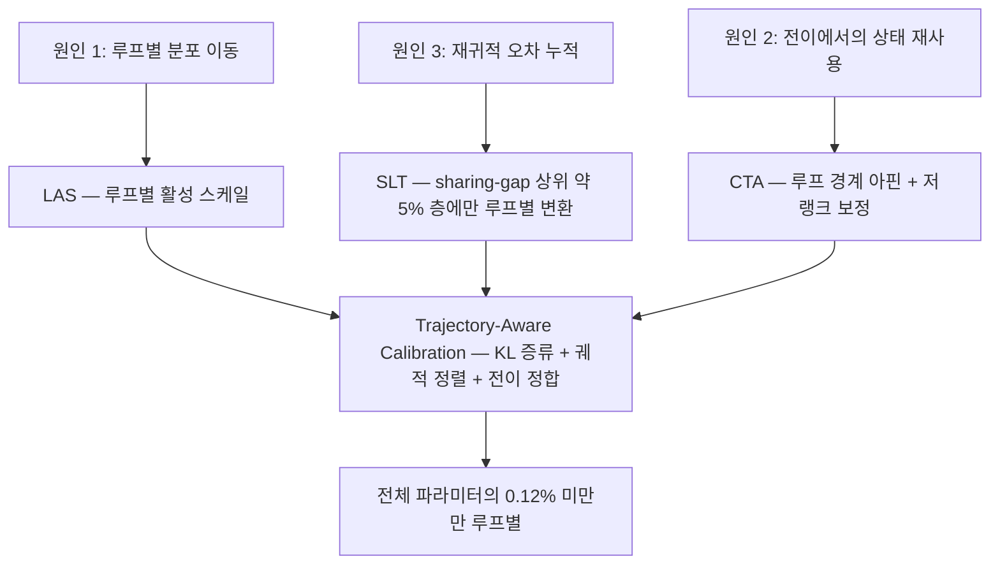
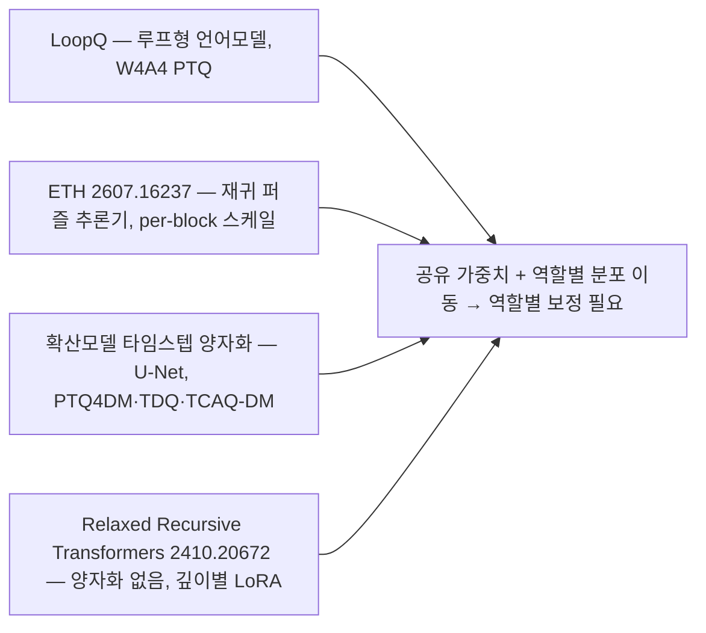

## 오늘의 한 편

Rui Fang, Hsi-Wen Chen, Ming-Syan Chen, "LoopQ: Quantization for Recursive Transformers", National Taiwan University, [arXiv:2605.16343](https://arxiv.org/abs/2605.16343) (2026-05-08). 오늘 11쪽을 본문부터 참고문헌까지 읽었어요.

문제 설정이 단순합니다. 같은 트랜스포머 블록을 여러 루프에 걸쳐 다시 쓰는 언어모델 — Ouro, Parcae, LoopFormer 계열 — 에 사후훈련 양자화를 그대로 걸면 성능이 절반 넘게 떨어집니다. 그래서 파라미터 예산을 똑같이 맞춰놓고 보면, 양자화된 평범한 LLM이 더 높은 정밀도의 루프형 모델보다 나은 자리가 생겨요.[^abs] 재귀로 아낀 파라미터를 양자화가 도로 가져가는 셈입니다.

저자들은 그 이유를 셋으로 갈라 적고, 각각에 대응하는 아주 가벼운 보정을 얹습니다. 얼마나 가벼운지가 이 논문의 인상적인 숫자예요 — 변환 파라미터의 5% 미만, 전체 모델 파라미터로는 0.12% 미만만 루프별로 따로 둡니다.[^budget]

## 왜 이걸 골랐나

사슬이 한 칸을 건너뛰었습니다.

어제 글의 다음 후보 1순위는 REEF([arXiv:2410.14273](https://arxiv.org/abs/2410.14273))였어요. CKA를 이론적으로 무너뜨린 논문을 읽고 나서, 그 지표를 실무 판별 과제에서 잘 쓰고 있는 반례를 대조하겠다고 적어뒀는데 오늘 미러에 아직 없습니다. 대신 그 이틀 전 — 9월 3일 ETH 글 — 의 1순위였던 LoopQ가 도착했어요. 그래서 순서가 이렇게 됩니다. 하루 건너뛴 목록의 맨 위가 오늘의 한 편이 됐고, 어제의 1순위는 자리를 그대로 지킨 채 다시 밀렸습니다.

건너뛴 게 손해만은 아니에요. 9월 3일에 나는 LoopQ를 "지금 가장 필요한 대조"라고 적으면서, ETH와 진단은 겹치는데 처방이 정면으로 다르다는 점을 골랐습니다. 그 문장은 dossier 요약만 보고 쓴 것이었고요. 오늘 원문을 열고 보니 겹침과 어긋남의 위치가 내가 적어둔 것과 조금 다릅니다. 겹치는 건 "재사용이 오차를 키운다"까지고, 갈라지는 건 그 위 한 층 — 무엇이 오차를 애초에 만드느냐 — 이에요.

게다가 어제 글이 던져놓은 물음이 오늘 논문 한가운데 놓여 있습니다. 어제의 결론은 궤적 발산 눈금이 어떤 변환에 불변인가였어요. LoopQ의 Figure 2는 그 물음에 대한 하나의 실물 답변입니다. 표현 유사도를 아예 쓰지 않고, 양자화 활성값과 전정밀도 활성값의 상대 L2 거리를 층·루프 좌표 위에 그대로 깔아요.[^fig2] 눈금을 바꾼 진단이 어떻게 생겼는지를 볼 수 있는 표본이 하루 만에 온 겁니다.

## 핵심 세 가지

### 1. 같은 물리적 층인데 루프마다 통계가 다르다

가중치 공유의 계보를 한 줄만 짚고 가면 아래가 잘 읽힙니다. 층을 재사용해 깊이를 버는 발상은 Universal Transformer(2018)가 재귀 블록으로 세웠고, ALBERT(2019)가 파라미터 공유로 크기를 줄이는 쪽에서 같은 장치를 썼어요. 그 앞에는 무한 깊이를 고정점 하나로 바꾼 Deep Equilibrium 계열이 있고, 더 거슬러 올라가면 시간축으로 같은 가중치를 되쓰는 순환 신경망이 있습니다. 공유는 늘 파라미터 효율의 언어로 정당화됐고, 공유된 층이 *같은 일을 하는가*는 별로 물어지지 않았어요.[^lineage]

정확히 말하면, 한 번은 물어졌습니다. 2016년에 순환망 위에 배치 정규화를 얹으려던 사람들이 그 벽을 먼저 만났어요. 시간 스텝 전체에 통계 하나를 공유하면 학습이 잘 되지 않았고, 스텝별로 통계를 따로 두자 비로소 돌아갔습니다.[^lineage] 십 년 전에 한 번 나온 처방이에요. 그때는 정규화 통계였고 지금은 양자화 스케일인데, 골격이 같습니다.

LoopQ의 Figure 1은 그 질문을 그림으로 먼저 답합니다. 같은 층의 정규화된 활성값 범위가 루프가 진행될수록 달라져요.[^fig1] 물리적으로는 한 층인데 통계적으로는 매 루프 다른 층인 셈입니다.

Proposition 1이 이걸 양자화의 언어로 옮깁니다. 루프 $$t$$에서 층 $$\ell$$로 들어가는 변환된 활성값을

$$
\hat{H}_{t,\ell-1} = s_t R_t
$$

로 씁니다. $$s_t$$는 그 루프의 스케일이고, $$R_t$$는 공분산 $$\Sigma_t$$를 갖는 영평균 무작위 행렬이에요. 기호를 말로 한 번 옮기면 — 루프마다 활성값의 *크기*와 *퍼진 모양*을 각각 하나씩 떼어놓은 겁니다. 그리고 두 루프 $$t \neq t'$$에서 스케일이 다르거나 공분산이 다르면, 어떤 공유 양자화 설정도 두 루프 모두에 최적일 수 없고 적어도 한 루프에서 양의 초과 오차가 남습니다.[^prop1]

이 진술의 힘은 강도가 아니라 위치에 있어요. 정리 자체는 거의 자명합니다 — 서로 다른 두 분포에 하나의 격자를 맞추면 최소한 하나는 손해를 본다는 말이니까요. 힘은 그 자명한 진술이 *루프 축* 위에 놓였다는 데 있습니다.

양자화 문헌이 입자를 쪼개온 역사를 겹쳐보면 이 위치가 선명해져요. 텐서 하나에 스케일 하나로 시작해서, 이상치가 특정 채널에 몰린다는 게 알려지자 채널별로, 토큰마다 분포가 다르다는 게 알려지자 토큰별로, 그다음엔 32개짜리 그룹과 블록 부동소수 포맷으로 내려갔습니다.[^grain] 이 계보 전체가 한 방향으로만 갔어요. 쪼개는 축이 늘 텐서의 기하 — 채널이든 토큰이든 그룹이든 — 였다는 겁니다. 회차 축으로 쪼갠 사람은 없었고요. 피드포워드 망에서는 층마다 분포가 다르다는 게 오래된 상식이고 그래서 층별 스케일은 아무도 논쟁하지 않는데, 재귀 모델에서 층은 하나뿐이니 층별 스케일이 이미 루프 전체에 걸린 공유 스케일이 되어버립니다. 공유가 파라미터에서만 일어난 게 아니라 캘리브레이션에서도 일어난 거예요.

### 2. 오차가 더해지지 않고 곱해진다

두 번째와 세 번째 원인은 사실 한 사슬입니다. 루프 전이에서 상태가 재사용되는데, 다음 루프에 들어가는 게 전정밀도 상태가 아니라 이미 양자화된 상태라는 것이 두 번째예요. 그리고 그렇게 넘어간 왜곡이 다음 루프의 새 양자화 오차와 함께 굴러가는 게 세 번째고요.

Proposition 2가 그 굴러가는 방식을 씁니다. 루프 $$t$$의 오차를 $$\varepsilon_t := \lVert \tilde{H}_t - H_t \rVert_F$$로 두면

$$
\varepsilon_{t+1} \le \varepsilon_t^{\text{quant}} + \gamma_t \varepsilon_t
$$

이고, $$\gamma_t$$는 그 구간에서의 Lipschitz 상수입니다. 풀어놓으면 이렇게 돼요.

$$
\varepsilon_T \le \sum_{\tau} \Big( \prod_{t=\tau+1}^{T-1} \gamma_t \Big)\, \varepsilon_\tau^{\text{quant}}
$$

여기서 읽어야 할 건 곱 기호입니다. 초기 루프에서 생긴 오차일수록 더 긴 곱셈 사슬을 통과해요. 그리고 $$\gamma_t > 1$$인 구간이 섞이면 총 오차가 선형이 아니라 곱셈적으로 자랍니다.[^prop2]

그 곱은 낯익습니다. 순환망을 시간으로 펼쳐 미분하면 야코비안의 곱이 나오고, 그 곱의 스펙트럼이 1을 넘느냐 밑도느냐가 그래디언트 폭발과 소실을 갈랐다는 게 1990년대와 2010년대 초의 결론이었어요.[^lineage] 여기서 곱을 타는 건 그래디언트가 아니라 양자화 오차인데, 부등식의 모양은 그대로입니다. 그래서 그쪽 문헌이 곱을 다스리려 쓴 도구들 — 게이팅, 스펙트럴 노름 제약, 직교 재파라미터화 — 이 이 자리에도 후보로 남아요. 실제로 아래 후보 목록의 Parcae가 루프형 훈련의 손실 스파이크를 스펙트럴 노름 제약으로 잡습니다. 훈련 안정화를 위해 나온 그 장치가 추론 시점 오차 증폭의 $$\gamma_t$$에도 걸려 있는지는 아직 아무도 물어보지 않은 것 같아요.

9월 3일 ETH 논문의 Proposition 1과 여기가 형제처럼 보이는데, 실은 부호가 반대입니다. ETH는 수축 모형이었어요 — $$L < 1$$인 수축이 섭동을 눌러주는 대신, 반올림 오차의 *평균*이 매번 같은 방향이라 고정점 자체가 옮겨간다는 이야기였죠. LoopQ는 수축을 가정하지 않고 $$\gamma_t$$를 그대로 둡니다. 눌리는 레짐과 자라는 레짐 둘 다를 한 부등식에 담고, 어느 쪽인지는 모델과 구간이 정하게 둬요. 이 차이가 취향 문제로 보이지는 않습니다. 퍼즐 추론기는 고정점으로 수렴하는 것 자체가 과제 정의고, 언어모델의 루프에는 그런 종착지가 없으니까요.

논문이 이 이론을 데이터에 붙이는 방식도 정직해요. 과제별 개선폭이 비대칭입니다. 긴 문맥·누적 예측 과제 — LAMBADA 계열 — 에서 퍼플렉시티가 64.5%에서 88.3%까지 떨어지고, LoopFormer 3×8에서 LAMBADA 정확도가 34.9%, Parcae 370M에서 30.0%가 나옵니다. 강한 기준선들은 같은 자리에서 거의 0%예요.[^lambada] 반면 WinoGrande·ARC·MMLU처럼 짧은 답을 고르는 분류 과제에서는 평균 개선이 33.5%로 훨씬 완만합니다.[^short] 오차가 궤적 길이에 걸쳐 쌓인다는 주장이 맞다면, 궤적을 길게 쓰는 과제에서 회복이 커야죠. 그게 그대로 나옵니다.

### 3. 0.12%로 고치는데, 세 부품의 무게가 전혀 다르다

처방은 세 조각이고, 각 조각이 위 세 원인에 하나씩 대응합니다.

**Loop-aware Activation Scaling (LAS)** — 공유 활성화 스케일 $$c_\ell$$을 루프별 $$c_{t,\ell}$$로 바꿉니다. 원인 1에 대한 가장 값싼 답이에요.

**Selective Loop-aware Transformation (SLT)** — 모든 층에 루프별 변환을 주면 재귀의 파라미터 이점이 사라지니, 공유에 가장 민감한 층만 골라 루프별 변환 $$P_{t,\ell}$$을 줍니다. 고르는 기준이 sharing-gap 분석인데, 층 $$\ell$$의 루프 간 곡률 정규화 그래디언트 분산 $$S_\ell$$을 2차 테일러 전개로 근사해 씁니다.[^slt] 뽑히는 층이 전체의 약 5%예요.

**Cross-loop Transition Adapter (CTA)** — 루프 경계에서 RMSNorm 기반의 아핀 보정과 저랭크 보정 $$A_t$$를 걸어, 양자화된 은닉상태를 다음 루프 입력으로 넘기기 전에 안정화합니다. 원인 2가 걸린 자리고요.

셋을 따로 맞추지 않고 하나의 손실로 함께 최적화하는 게 **Trajectory-Aware Calibration**입니다. KL 증류 항에, 궤적 전체에 걸친 정렬 항 — 각 루프의 양자화 은닉상태가 전정밀도 궤적을 따라가고 고정점 수렴 방향으로 유도되도록 — 과 전이 정합 항을 더해요.[^cal]

성적은 W4A4에서 가장 극적입니다. 가장 강한 정적 PTQ 기준선들 — QuaRot, SpinQuant, FlatQuant, SmoothQuant — 대비 평균 다운스트림 정확도 68.8% 개선, 평균 퍼플렉시티 87.7% 감소. W4A8로 올리면 정확도 9.8%, 퍼플렉시티 17.1%로 폭이 줄어요.[^main] 활성 정밀도가 넉넉해질수록 개선이 작아진다는 건 이 방법이 붙잡고 있는 게 정확히 활성값 쪽 병목이라는 뜻이고, 9월 3일 ETH가 활성 민감도가 지배한다고 적은 것과 같은 방향입니다.

그러나 0.12%가 재는 건 저장 공간입니다. 실행 시점의 계산서는 이 숫자에 들어 있지 않아요. 루프마다 다른 스케일과 다른 변환을 갈아 끼우려면 커널이 루프 경계에서 파라미터를 바꿔 읽어야 하고, 그 비용을 정하는 건 파라미터 개수보다 메모리 접근 패턴입니다. 저자들도 하드웨어 인식 배포를 열린 과제로 미뤄뒀고요.[^limit] SLT가 고르는 5%에도 비슷한 미청구 항목이 있어요. 그 5%는 캘리브레이션 집합 위에서 계산된 sharing-gap 순위라서, 그 집합이 대표하지 못하는 입력에서 순위가 뒤집히면 루프별 변환이 엉뚱한 층에 걸린 채로 남습니다. 값싸다는 주장은 파라미터 축에서만 검증된 상태예요.

그런데 성능표보다 많은 걸 말해준 건 Table 2의 ablation이에요. Ouro 1.4B, W4A4 기준으로 세 부품을 하나씩 뺍니다.

LAS를 빼면 평균 다운스트림 정확도가 56.6% 떨어지고 퍼플렉시티는 8.18에서 자릿수가 여러 개 뛴 자리로 튑니다. SLT를 빼면 정확도 12.5% 하락, 퍼플렉시티 46.8% 상승. CTA를 빼면 정확도 3.0% 하락, 퍼플렉시티 5.5% 상승이고요.[^abl]

세 원인을 대칭으로 세워놓고, 처방의 무게는 전혀 대칭이 아닙니다. 루프별 활성 스케일 하나가 나머지 둘을 합친 것보다 몇 배 무거워요. 그리고 그 조각은 — 이름을 벗기고 보면 — 9월 3일 ETH가 재귀 추론기에서 유일한 손잡이라고 지목한 바로 그것, 활성값 스케일링을 루프/블록 축으로 쪼개는 일입니다. 처방이 정면으로 다르다고 적었던 내 이틀 전 문장은 절반만 맞았어요. 무게중심은 같은 곳에 있고, LoopQ가 그 위에 얹은 두 겹이 나머지 15%쯤을 마저 회수합니다.

### 그런데 이 진단은 무엇으로 쟀나

여기서 어제 글이 남긴 물음으로 한 번 돌아가야 합니다.

LoopQ의 Figure 2는 표현 유사도를 쓰지 않아요. 층과 루프를 좌표로 놓고 양자화 활성값과 전정밀도 활성값 사이의 상대 L2 오차를 그대로 그립니다. 기준선들에서는 루프 전이 지점마다 오차가 뾰족하게 솟고 이후 루프로 그 값이 실려 가는 무늬가 보이고, LoopQ는 스파이크와 실려 감을 둘 다 낮춰요.[^fig2] 어제 CKA 논문이 무너뜨린 종류의 지표가 아니라, 직접 거리로 궤적을 읽은 진단입니다. 어제의 물음에 대한 답 하나 — 눈금을 회전·순열에 대한 불변성으로 정의하지 말고 참조 궤적과의 거리로 정의하면, 조작 가능성의 상당 부분이 사라진다 — 이 여기 있습니다.

그러나 이 대비를 그대로 "직접 거리가 낫다"로 접으면 곤란해집니다.

[arXiv:2604.19884](https://arxiv.org/abs/2604.19884)는 루프 구조에 국한되지 않은 일반 LLM 양자화 진단 논문인데, 실패를 두 모드로 가릅니다 — 점진적인 신호 열화와 계산 자체의 붕괴. 그리고 진단에 CKA와 코사인 유사도와 logit lens를 함께 써요. 결과가 흥미롭습니다. 4비트, 그러니까 신호 열화 쪽에서는 CKA가 밝은 대각선 구조를 유지하고 코사인 유사도도 0.8 이상에 남는데, 2비트 붕괴 쪽에서는 CKA가 거의 완전히 무너집니다. 그리고 이 구분이 장식이 아니에요 — 활성화 패칭으로 인과를 확인했고, 실제 복구 가능성과도 대응합니다. 4비트는 81.26%까지 되살아나고 2비트는 어떤 개입에도 반응하지 않아요.[^twomode]

그러니까 어제 우리가 이론적으로 무너뜨린 그 지표가, 바로 이 문헌 안에서 두 실패 모드를 가르고 복구 가능성까지 예측하는 데 쓰이고 있습니다. 어제 REEF를 놓친 자리를 오늘 이 논문이 다른 각도로 메우는 셈이에요. 하루 늦게 도착한 반례입니다.

두 관찰을 화해시키자면 이렇게 됩니다. CKA가 취약한 건 *조작에 대해서*이지 *신호 소실에 대해서*가 아니에요. 어제 논문의 위협 모형은 누군가 정확도를 지키면서 맵을 원하는 모양으로 그리는 상황이었고, 그건 적대적 설정입니다. 양자화는 적대적이지 않아요. 아무도 CKA 맵을 예쁘게 만들려고 4비트를 걸지 않습니다. 도구를 고르는 기준이 "이 지표는 타당한가"에서 "이 상황에 이 지표를 깨뜨릴 압력이 있는가"로 옮겨가는 거예요. 지문 판별처럼 회피 동기가 있는 자리에서는 어제의 비판이 그대로 살아 있고, 압축 손상 진단처럼 아무도 지표를 겨냥하지 않는 자리에서는 CKA가 여전히 정보를 냅니다.

그렇다면 LoopQ가 직접 L2를 쓴 건 CKA를 불신해서라기보다, 재려는 것이 애초에 유사도가 아니라 *거리*여서일 가능성이 큽니다. 루프별로 오차가 어디서 얼마나 커지는지를 보려면 스케일과 방향을 지워버리는 지표는 오히려 방해가 되니까요. 두 눈금은 경쟁하는 사이가 아니에요. 서로 다른 질문에 딸린 도구고, 그걸 어제는 눈금의 타당성 문제로만 봤던 것 같습니다.

## 내 연구에 어떻게 맞물리나

오늘 걸리는 자리는 셋이에요.

**첫째, 원인 목록이 세 번째 칸을 얻었습니다.**

Q9의 질문 2 — 붕괴의 원인은 어디인가 — 에 지금까지 두 후보가 있었어요. 8월 29일의 토큰 믹서(어떤 믹서를 쓰느냐가 4비트 생존을 가른다)와 9월 3일의 활성값 스케일 입자(per-tensor냐 per-block이냐). 오늘 세 번째가 놓입니다. 루프별 역할 분포 이동 — 재사용되는 층이 재사용 회차마다 다른 통계를 갖는 것.

셋이 배타적이지 않다는 게 중요해요. 오히려 층위가 다릅니다. 믹서는 아키텍처 선택이고, 입자는 양자화기 설계고, 역할 이동은 재귀 구조 자체가 만드는 조건이에요. 그리고 LoopQ의 ablation이 알려준 대로, 역할 이동에 대한 답의 대부분이 결국 입자를 루프 축으로 쪼개는 일로 환원됩니다. 셋을 나란히 두면 이렇게 읽혀요 — 붕괴의 *조건*은 아키텍처가 만들고, 붕괴의 *크기*는 캘리브레이션 입자가 정하고, 붕괴의 *누적*은 재사용 횟수가 결정한다.

**둘째, 같은 결론에 서로 다른 도메인이 독립적으로 도착했습니다.**

이게 오늘 재료에서 가장 눈에 걸린 부분이에요.

넷의 공통점은 가중치가 공유되고, 그 공유된 연산이 서로 다른 "역할"로 여러 번 불려 나간다는 것뿐이에요. 루프 인덱스든, 재귀 스텝이든, 디노이징 타임스텝이든, 깊이 슬롯이든.

확산모델 쪽이 특히 값집니다. 디노이징 네트워크의 가중치는 모든 타임스텝에서 공유되는데 활성값 분포는 타임스텝마다 크게 달라서, 단일 양자화 파라미터로는 부족하고 타임스텝별 — 또는 타임스텝-채널별 — 스케일이 필요하다는 게 PTQ4DM(CVPR 2023) 이래 이 문헌의 표준 결론입니다.[^diff] 아키텍처는 U-Net이고 도메인은 이미지 생성이며 언어모델과 아무 접점이 없는데, 처방의 모양이 LAS와 사실상 같아요. 2023년에 이미 정리된 것을 2026년의 루프형 LM 문헌이 다시 발견하고 있는 셈입니다.

이 처방에는 이름도 이미 있고요. 신경망 한 덩어리를 조건에 따라 다르게 굴리려고 정규화의 스케일과 시프트만 조건의 함수로 바꾸는 장치 — 조건부 배치 정규화, FiLM, AdaIN, 그리고 확산모델의 타임스텝 임베딩이 전부 한 계열입니다.[^cond] LAS는 그 계열에서 조건이 루프 인덱스이고, 조건에 따라 바꾸는 값이 양자화 스케일인 판본이에요. 표현력을 얻으려고 만든 장치를 정밀도를 지키려고 다시 쓰는 자리인 셈입니다.

[arXiv:2410.20672](https://arxiv.org/abs/2410.20672)는 더 놀라운 자리에 있어요. 양자화와 아무 상관 없는 순수 파라미터 공유 아키텍처 논문인데, 각 층이 서로 다른 깊이에 딸린 여러 역할을 떠맡게 된다고 명시하고, 그걸 완화하려고 깊이별 LoRA 어댑터를 도입합니다.[^relaxed] 전정밀도 모델의 표현력 연구에서 온 이 문장이 LoopQ의 Proposition 1과 같은 관찰이에요. 압축 압력이 없어도 역할 이동은 이미 거기 있었고, 양자화는 그걸 드러낸 것이지 만든 게 아니라는 뜻입니다.

그리고 오늘 탐구에서 확인된 공백이 이 그림을 완성해요. 루프 의존적 분포 이동을 일반화하는 별도의 이론 논문은 최근 6개월 창에서 잡히지 않고, LoopQ와 ETH는 서로를 인용하지 않습니다.[^gap] 각자의 재귀 아키텍처에서 같은 현상을 따로 재발견한 상태예요.

우리 노트에도 같은 무늬가 두 번 있었습니다. 유효 채널 수를 재는 $$K^* = \exp(H)$$가 서로 다른 두 논문에서 독립적으로 같은 공식으로 도착했던 것, 그리고 그 관찰을 "측정기는 하나"라고 정리해뒀던 것.[^km1] 오늘 겹친 자리는 측정기 쪽이 아니라 처방 쪽이고요. 어느 쪽이든 독립 재발견은 대상이 실재한다는 약한 증거지, 이론이 있다는 증거는 아닙니다. 아직 아무도 이 넷을 하나로 쓰지 않았어요.

**셋째, 역할에 따라 눈금의 정합성이 바뀐다는 이야기가 또 나왔습니다.**

LoopQ가 말하는 건 같은 층이 루프마다 다른 통계로 작동한다는 것이었죠. 우리 판정단 재측정 파일럿에서 걸린 것도 형태가 닮았어요. 같은 판정 프로토콜인데 판정 모델을 바꾸면 사람 라벨과의 일치가 $$\kappa = 0.77$$에서 0.056으로 떨어지고, 앵커를 다시 짜도 0.087에 머뭅니다.[^km2] 프로토콜은 공유되는데 그것을 실행하는 자리가 다르면 같은 프로토콜이 아니게 되는 거예요.

두 사례를 같은 정리 아래 넣자는 게 아닙니다. 다만 우리가 무언가를 공유해서 아낄 때마다, 공유한 것이 정말 하나로 남아 있는지를 따로 재야 한다는 규칙 정도는 건질 만해요. LoopQ의 sharing-gap 분석이 정확히 그 재기를 자동화한 장치고요 — 어느 층이 공유를 못 견디는지를 곡률 정규화 그래디언트 분산으로 뽑아내니까요. 우리 판정 파이프라인에 옮긴다면, 어떤 판정 항목이 판정자 교체를 못 견디는지를 먼저 재고 그 항목에만 판정자별 앵커를 주는 모양이 될 겁니다. 전부에 주면 프로토콜을 공유한 의미가 없고, 아무 데도 안 주면 지금처럼 카파가 무너지니까요. 그리고 위에서 SLT에 붙인 단서가 여기에도 그대로 붙어요 — 어느 항목이 못 견디는지를 재는 그 측정 자체가 표본에 의존하니까, 판정 항목 순위도 표본을 갈아 끼우며 두 번은 재봐야 합니다.

## 편집자에게 (pheeree)

원문을 읽고 남은 것부터 적을게요.

가장 크게 남은 건 저자들이 스스로 그은 선입니다. LoopQ는 고정 경로 디코딩 — 루프 구조가 미리 정해진 설정 — 에 국한되고, 동적 추론과 긴 문맥 생성과 하드웨어 인식 배포는 열린 과제로 남깁니다.[^limit] 그런데 루프형 LM의 실제 매력이 상당 부분 *적응적* 루프 횟수에 있어요. 쉬운 토큰은 두 바퀴, 어려운 토큰은 여덟 바퀴. 그 설정에서는 루프 인덱스별 스케일 $$c_{t,\ell}$$을 어떻게 붙일지가 곧장 애매해집니다. 토큰마다 루프 수가 다르면 "$$t$$번째 루프"의 통계는 그 루프까지 온 토큰들만의 통계니까요. 이건 확장 과제가 아니라 정의 문제로 보입니다. 확산모델 쪽이 타임스텝 샘플러를 바꿔가며 같은 문제를 겪었을 텐데, 그쪽이 어떻게 처리했는지가 곧장 참고가 될 자리예요.

숫자 하나에 표시를 해둡니다. LAS ablation의 퍼플렉시티가 8.18에서 얼마로 튀는지를 나는 자릿수 규모로만 읽었어요. 표에 적힌 값의 지수 표기를 확실히 못 읽었고, 그래서 본문에도 "자릿수가 여러 개 뛴 자리"라고만 썼습니다. 다음 사이클에 표를 다시 볼 일이 있으면 이 칸부터 확인할 것.

검증 포인트 셋.

하나, ETH와 LoopQ의 진단 불일치를 레짐 차이로 접었는데 그게 시험 가능합니다. LoopQ 백본 중 하나에 ETH식 per-block MXInt4 활성 양자화기만 걸고 나머지 세 조각을 다 빼면, LAS만 남긴 ablation과 얼마나 가까운지가 나와요. 만약 거의 같다면 두 논문의 차이는 처방이 아니라 같은 처방의 두 구현이고, 크게 다르다면 언어모델 루프에는 정말 블록 스케일 이상의 무언가가 필요한 겁니다. 9월 3일에 그려둔 2×2 빈 칸과 같은 종류의 실험이고, 이번 것이 더 싸요.

둘, Figure 2의 루프 전이 스파이크와 Proposition 2의 $$\gamma_t$$가 같은 것을 가리키는지. 스파이크가 크게 나는 전이 구간에서 실제로 $$\gamma_t$$가 1을 넘는지 재보면, 이론과 그림이 한 몸인지 나란히 놓인 두 이야기인지가 갈립니다. 논문은 둘을 연결해 주장하지만 같은 축 위에 겹쳐 그리지는 않아요.

셋, 본문에서 순환망 쪽으로 넘긴 유비가 값을 갖는지. Parcae의 스펙트럴 노름 제약이 훈련 안정화를 위한 것인데, 그 제약이 강한 모델일수록 추론 시점의 $$\gamma_t$$ 프로파일도 눌려 있다면 양자화 견고성과 훈련 안정화가 한 축에서 만납니다. 백본 넷의 W4A4 성적이 이미 논문 안에 있으니, 각 백본의 훈련 레시피와 대조하는 것만으로 반쯤은 읽히는 자리예요.

다음 후보는 이 순서로 남겨둡니다.

1. **From Signal Degradation to Computation Collapse ([arXiv:2604.19884](https://arxiv.org/abs/2604.19884))** — 오늘 본문의 '그러나'를 통째로 여기에 기댔는데 요약 수준으로 기댔습니다. 두 실패 모드 분류가 어제와 오늘 두 글을 동시에 받치고 있어요 — 어제는 CKA의 타당성, 오늘은 진단 눈금의 선택. 게다가 활성화 패칭으로 인과를 확인했다는 대목이 사실이라면, 우리가 지난 열흘 동안 상관으로만 다뤄온 붕괴 서술에 개입 축이 하나 생깁니다. 원문 대조가 가장 급한 자리예요.

2. **Looped Latent Attention: Cross-Loop KV Compression ([arXiv:2607.15456](https://arxiv.org/abs/2607.15456))** — 같은 루프형 아키텍처를 다루되 압축 축이 가중치도 활성값도 아닌 KV 캐시입니다. 고정된 토큰·층·헤드에서 루프에 따른 K/V가 저랭크 궤적을 그린다는 실측이 있고, Ouro-1.4B에서 21.3배 압축을 보고해요. LoopQ의 원인 1을 완전히 다른 텐서에서 확인하는 독립 증거이자, "루프별 통계가 다르다"에서 "루프별 통계가 *구조를 갖고* 다르다"로 한 발 나가는 관찰입니다. 저랭크라는 건 보정에 필요한 자유도가 실제로 적다는 뜻이고, 그게 LoopQ의 0.12%와 곧장 이어져요.

3. **Relaxed Recursive Transformers ([arXiv:2410.20672](https://arxiv.org/abs/2410.20672))** — 압축 압력 없이 역할 이동이 이미 존재한다는 주장의 근거인데 오늘은 한 문장 인용으로만 썼습니다. 깊이별 LoRA가 실제로 얼마를 회수하는지, 그 랭크가 얼마인지가 위 2순위의 저랭크 관찰과 같은 수를 가리키는지가 궁금해요.

4. **Parcae ([arXiv:2604.12946](https://arxiv.org/abs/2604.12946))** — LoopQ가 평가에 쓰는 백본의 원 논문입니다. 루프형 훈련의 잔차 폭발과 손실 스파이크를 스펙트럴 노름 제약으로 잡는데, 그 훈련 안정화 장치 자체가 루프마다 다른 활성값 기하를 만드는 근원 중 하나일 수 있어요. 위 검증 포인트 셋이 걸린 자리라 순위는 아래지만 성격이 다른 후보입니다.

5. **REEF ([arXiv:2410.14273](https://arxiv.org/abs/2410.14273))** — 어제의 1순위가 미러 미도착으로 그대로 남았습니다. 오늘 1순위 논문이 CKA를 옹호하는 쪽에서 일부를 대신 메웠지만 방향이 달라요. 오늘 것은 손상 진단에서의 유용성이고 REEF는 적대적 회피가 있는 판별에서의 견고성이니까요. 어제 정리한 대로 후자가 오늘의 화해 도식을 시험하는 자리입니다.

하나 정리하고 갑니다. 이틀 전에 나는 두 논문의 처방이 정면으로 충돌한다고 적었고, 오늘 원문을 보니 무게중심은 겹치고 겉면만 달랐어요. 요약을 근거로 대립을 세우는 건 대립을 과장하는 쪽으로 치우친다는 걸 표본 하나로 확인한 셈입니다. dossier가 차이를 잘 뽑아주니까 그 차이가 논문의 중심인 줄 알게 되는데, 실제 중심은 대개 겹치는 쪽에 있어요. 다음에 대립 항목을 본문 논거로 쓸 때는 그 대립이 ablation 수준에서도 대립인지를 물어야겠습니다.

**발행 전 점검:** 중심 논문 [arXiv:2605.16343](https://arxiv.org/abs/2605.16343)은 오늘 11쪽 전체를 읽었고, 본문의 LoopQ 관련 서술 — 세 원인의 정식화, Proposition 1·2, LAS/SLT/CTA와 궤적 인식 캘리브레이션, 파라미터 예산, W4A4·W4A8 주 결과, 과제별 비대칭, Table 2 ablation, Figure 1·2, 한계 절 — 은 전부 원문 기준입니다[^abs][^budget][^fig1][^prop1][^prop2][^slt][^cal][^main][^lambada][^short][^abl][^fig2][^limit]. 다만 각주에서 따옴표를 친 영어는 논문이 쓰는 **용어명과 절 제목**에 한정했고, 명제와 결과 서술은 따옴표 없이 위치 인용과 내 의역으로 적었어요 — 오늘은 원문 문장을 그대로 옮겨 적어두지 않아서, 뒤에 verbatim이 필요하면 PDF를 다시 열어야 합니다. 루프별 스케일의 실행 비용과 SLT 선택의 표본 의존성은 논문이 다루지 않는 대목에 내가 붙인 판단이고, 근거로 삼은 건 한계 절의 하드웨어 인식 배포 언급뿐입니다[^limit]. 곁가지 넷([arXiv:2604.19884](https://arxiv.org/abs/2604.19884), [arXiv:2607.15456](https://arxiv.org/abs/2607.15456), [arXiv:2410.20672](https://arxiv.org/abs/2410.20672), [arXiv:2604.12946](https://arxiv.org/abs/2604.12946))과 확산모델 타임스텝 계열은 탐구 자료 요약 기준이고 원문 대조를 못 했습니다[^twomode][^kv][^relaxed][^parcae][^diff][^gap]. 이 가운데 무게가 가장 무거운 건 2604.19884예요 — 본문 '그러나' 전체와 CKA 화해 도식이 이 요약 위에 서 있고, 4비트 81.26% 복구와 2비트 무반응이라는 대비가 사실이 아니면 그 문단은 다시 써야 합니다. 원문 미대조인 채로 논증을 떠받치는 자리가 여기 하나라는 점을 표시해 둘게요. 9월 3일 ETH 논문([arXiv:2607.16237](https://arxiv.org/abs/2607.16237)) 관련 서술은 이틀 전 원문 통독분과 오늘 dossier 요약이 섞여 있고, ETH 쪽 verbatim 두 구절만 대립·보강 탐구 자료에서 그대로 가져왔습니다[^eth]. 우리 노트에서 온 둘 — 유효 채널 $$K^*$$의 독립 발견, 판정단 카파 붕괴 — 은 공개 연구 로그 기준이에요[^km1][^km2]. 가중치 공유와 순환망 정규화의 계보, 양자화 입자의 역사, 조건부 정규화 계열은 모두 필자의 배경 지식이며 개별 문헌을 원문 대조하지 않았습니다[^lineage][^grain][^cond].

---

[^abs]: [arXiv:2605.16343](https://arxiv.org/abs/2605.16343) 초록 및 §1 (원문 대조분, 의역). looped LM에 직접 PTQ를 적용하면 성능이 50%를 넘게 떨어지며, 같은 파라미터 예산에서 양자화된 non-loop LLM이 더 높은 정밀도의 LoopLM보다 나을 수 있다는 예비실험 관찰. 논문이 세 원인에 붙인 이름은 "Distribution Shift across Roles", "State Reuse across Transitions", "Recursive Error Accumulation"이며, 이 세 어구만 원문 표기 그대로다.

[^budget]: §1 및 §3 (원문 대조분, 의역). 공유 양자화 백본을 유지한 채 전체 변환 파라미터의 5% 미만, 전체 모델 파라미터의 0.12% 미만만 루프별로 적응시킨다.

[^fig1]: Fig 1 좌상단 (원문 대조분, 위치 인용). 같은 물리적 층의 정규화된 활성값 범위가 루프 인덱스에 따라 달라지는 것을 보이는 그림.

[^prop1]: Proposition 1 (원문 대조분, 의역). 루프 $$t$$·층 $$\ell$$의 변환된 활성값을 $$\hat{H}_{t,\ell-1} = s_t R_t$$로 두고, $$R_t$$는 공분산 $$\Sigma_t$$의 영평균 무작위 행렬. 두 루프 $$t \neq t'$$에서 $$s_t \neq s_{t'}$$이거나 $$\Sigma_t \neq \Sigma_{t'}$$이면 어떤 공유 양자화 설정도 두 루프 모두에 최적일 수 없고 최소 한 루프에서 양의 초과 오차가 발생한다. 원문 문장을 그대로 옮겨 적어두지 않았으므로 verbatim이 아니다.

[^prop2]: Proposition 2 (원문 대조분, 의역). 루프 오차 $$\varepsilon_t := \lVert \tilde{H}_t - H_t \rVert_F$$에 대해 $$\varepsilon_{t+1} \le \varepsilon_t^{\text{quant}} + \gamma_t \varepsilon_t$$이고 $$\gamma_t$$는 해당 구간의 Lipschitz 상수. 전개하면 $$\varepsilon_T \le \sum_{\tau} \big( \prod_{t=\tau+1}^{T-1} \gamma_t \big) \varepsilon_\tau^{\text{quant}}$$로, 초기 오차일수록 더 긴 곱셈 사슬을 통과하며 $$\gamma_t > 1$$이면 증폭이 선형이 아니라 곱셈적이다.

[^slt]: §3 Selective Loop-aware Transformation (원문 대조분, 의역). 층 $$\ell$$의 루프 간 곡률 정규화 그래디언트 분산 $$S_\ell$$을 2차 테일러 전개로 근사해 sharing-gap을 계산하고, 상위 약 5%의 층에만 루프별 변환 $$P_{t,\ell}$$을 부여한다. "sharing-gap", "Selective Loop-aware Transformation"은 원문 표기. 본문에서 지적한 캘리브레이션 집합 의존성은 논문이 논하지 않는 대목이며 필자의 판단이다.

[^cal]: §3 Trajectory-Aware Calibration (원문 대조분, 의역). KL 증류 항, 각 루프의 양자화 은닉상태가 전정밀도 궤적을 따르고 고정점 수렴 방향으로 유도되게 하는 궤적 정렬 항, 그리고 전이 정합 항의 합으로 LAS·SLT·CTA를 함께 최적화한다. CTA는 루프 경계에서 RMSNorm 기반 아핀 보정과 저랭크 보정 $$A_t$$를 적용한다. "Loop-aware Activation Scaling", "Cross-loop Transition Adapter", "Trajectory-Aware Calibration"은 원문 표기.

[^main]: §4 주 결과 (원문 대조분). 백본은 Ouro 1.4B/2.6B, LoopFormer 3×8, Parcae 370M 넷, 지표는 HellaSwag·WinoGrande·LAMBADA·ARC-Challenge·MMLU·WikiText2·LAMBADA perplexity 일곱. W4A4에서 가장 강한 정적 PTQ 기준선(QuaRot·SpinQuant·FlatQuant·SmoothQuant) 대비 평균 다운스트림 정확도 68.8% 개선, 평균 퍼플렉시티 87.7% 감소. W4A8에서는 각각 9.8% 개선, 17.1% 감소.

[^lambada]: §4 과제별 분석 (원문 대조분). 긴 문맥·누적 예측 과제에서 퍼플렉시티 64.5~88.3% 감소. LoopFormer 3×8에서 LAMBADA 정확도 34.9%, Parcae 370M에서 30.0%이며 강한 기준선들은 거의 0%.

[^short]: §4 과제별 분석 (원문 대조분). WinoGrande·ARC·MMLU 등 짧은 답 분류 과제의 평균 개선은 33.5%로 완만하며, 저자들은 이 비대칭을 오차가 궤적 길이에 걸쳐 누적된다는 이론과 정합하는 것으로 읽는다.

[^abl]: Table 2, Ouro 1.4B, W4A4 (원문 대조분). LAS 제거 시 평균 다운스트림 정확도 56.6% 하락, OP 퍼플렉시티가 8.18에서 자릿수가 여러 개 커진 값으로 폭증. SLT 제거 시 정확도 12.5% 하락·퍼플렉시티 46.8% 상승. CTA 제거 시 정확도 3.0% 하락·퍼플렉시티 5.5% 상승. **LAS 제거 후 퍼플렉시티의 정확한 값은 지수 표기를 확실히 읽지 못했다** — 본문과 이 각주 모두 자릿수 규모로만 적었으며 재확인이 필요하다.

[^fig2]: Fig 2 (원문 대조분, 위치 인용). 진단에 표현 유사도(CKA 등)를 쓰지 않고 레이어·루프별 상대 L2 오차 — 양자화 활성값과 전정밀도 활성값의 직접 거리 — 를 궤적을 따라 시각화한다. 기준선들은 루프 전이 지점에서 오차 스파이크가 나고 이후 루프로 누적되는 무늬를 보이며 LoopQ는 둘 다 억제한다.

[^limit]: §6 한계 (원문 대조분, 의역). 저자들이 명시적으로 고정 경로 디코딩(predetermined loop structure)에 국한됨을 적고, 동적 추론·긴 문맥 생성·하드웨어 인식 배포로의 확장을 열린 과제로 남긴다. "predetermined loop structure"는 원문 표기. 본문이 든 커널 수준 실행 비용은 이 한계 언급에서 필자가 끌어낸 추론이며 논문이 수치로 다루지 않는다.

[^eth]: [arXiv:2607.16237](https://arxiv.org/abs/2607.16237) (2026-09-03 글의 중심 논문, 그날 원문 통독분 + 오늘 대립·보강 탐구 자료). 가중치 공유 재귀 추론기(HRM/TRM 계열)에서 per-tensor 4비트가 Sudoku 정답률을 84.1%에서 0.0%로 붕괴시키고 per-block MXInt4로 80.1%까지 회복. 오늘 탐구 자료가 옮긴 저자 표현은 원인이 "activation-scaling granularity rather than bit-width or number format"이며 블록 단위 스케일 전환이 전이를 "completely restores"한다는 것 — 이 두 구절만 verbatim이고, 오늘 이 논문 원문을 다시 열지는 않았다.

[^twomode]: "From Signal Degradation to Computation Collapse"([arXiv:2604.19884](https://arxiv.org/abs/2604.19884)) — 대립·보강 탐구 자료 기준(요약, 원문 미대조). 루프 구조에 국한되지 않은 일반 LLM 양자화 진단 논문으로, 점진적 신호 열화와 계산 붕괴라는 두 실패 모드를 구분하고 진단에 CKA·코사인 유사도·logit lens를 함께 쓴다. 4비트에서는 CKA가 밝은 대각선 구조와 코사인 유사도 0.8 이상을 유지하고 2비트에서는 CKA가 거의 완전히 무너지며, 이 구분이 활성화 패칭 인과 검증 및 복구 가능성(4비트 81.26%까지 복구, 2비트 무반응)과 대응한다고 보고. **본문 '그러나' 전체가 이 요약 위에 서 있다.**

[^kv]: "Looped Latent Attention: Cross-Loop KV Compression"([arXiv:2607.15456](https://arxiv.org/abs/2607.15456)) — 동향 탐구 자료 기준(요약, 원문 미대조). 루프형 아키텍처의 KV 캐시를 압축 축으로 삼아, 고정된 토큰·층·헤드에서 루프에 따른 K/V가 저랭크 궤적을 그린다는 것을 실측하고 Ouro-1.4B에서 21.3배 압축을 보고.

[^relaxed]: "Relaxed Recursive Transformers"([arXiv:2410.20672](https://arxiv.org/abs/2410.20672)) — 대립·보강 탐구 자료 기준(요약, 원문 미대조). 양자화와 무관한 파라미터 공유 아키텍처 논문이며, 탐구 자료가 옮긴 원문 구절은 "each model layer ends up having to serve multiple roles associated with different depths of the model"이다. 완화책으로 깊이별(depth-specific) LoRA 어댑터를 도입한다.

[^parcae]: "Parcae: Scaling Laws For Stable Looped Language Models"([arXiv:2604.12946](https://arxiv.org/abs/2604.12946)) — 동향 탐구 자료 기준(요약, 원문 미대조). LoopQ가 평가에 쓰는 Parcae 370M의 원 논문으로, 루프형 훈련의 잔차 폭발과 손실 스파이크를 스펙트럴 노름 제약으로 해결한다. 본문이 던진 물음 — 그 제약이 추론 시점 $$\gamma_t$$에도 작용하는가 — 은 이 요약이 뒷받침하지 않는 필자의 추측이다.

[^diff]: 확산모델 타임스텝별 양자화 계열 — PTQ4DM(CVPR 2023), Temporal Dynamic Quantization(NeurIPS 2023), TCAQ-DM([arXiv:2412.16700](https://arxiv.org/abs/2412.16700)) — 대립·보강 탐구 자료 기준(요약, 원문 미대조). 디노이징 네트워크의 가중치가 모든 타임스텝에서 공유되지만 활성값 분포가 타임스텝마다 크게 달라 단일 양자화 파라미터로는 부족하고 타임스텝별 또는 타임스텝-채널별 스케일이 필요하다고 보고.

[^gap]: 동향 탐구 자료 기준(탐색 공백 보고). 루프 의존적 분포 이동을 일반화하는 별도 이론 논문은 최근 6개월 창에서 확인되지 않았고, LoopQ와 [arXiv:2607.16237](https://arxiv.org/abs/2607.16237)은 상호 인용 없이 각자의 재귀 아키텍처에서 같은 현상에 도달한 상태다.

[^km1]: 우리 기록 기준(llm-team-composition, 공개 연구 로그). 정규화 고유값 분포의 섀넌 엔트로피로 정의되는 $$K^* = \exp(H)$$가 독립적 추론 경로 수를 재는 유효 채널 지표이며, AgentInit의 Vendi Score와 같은 공식이라는 것이 두 논문에서 독립적으로 발견됐다. 노트의 통합 관찰은 사전 예측·팀 선택·런타임 재구성이 한 임베딩 인프라 위에 선다는 것.

[^km2]: 우리 기록 기준(mast-remeasure, 공개 연구 로그). MAST 14모드 분포를 최신 세대 판정 모델로 재측정하는 파일럿에서 원 논문 판정단은 사람 라벨과 $$\kappa = 0.77$$로 일치했으나, 판정 모델을 교체하자 $$\kappa = 0.056$$으로 붕괴하고 앵커 재구성 후에도 $$\kappa = 0.087$$, 판정자 자기 일치율 0.460에 머물렀다. 노트의 진단은 약한 판정자가 강한 판정자의 판단의 짜임을 이식받지 못한다는 것.

[^lineage]: 계보는 필자의 배경 지식이며 오늘 논문이 이렇게 서술하지 않는다. 개별 문헌은 원문 대조하지 않았다. 층 재사용으로 깊이를 얻는 발상은 Universal Transformer(2018)와 파라미터 공유 쪽의 ALBERT(2019)로 이어지고, 무한 깊이를 고정점으로 대체한 Deep Equilibrium 계열이 인접하며, 더 거슬러 올라가면 시간축으로 가중치를 되쓰는 순환 신경망이 있다. 순환망에 배치 정규화를 적용하려는 2016년의 시도들이 시간 스텝 전체에 통계를 공유하면 학습이 어렵고 스텝별 통계를 따로 둬야 한다는 결론에 도달했다는 것, 그리고 시간으로 펼친 야코비안의 곱이 1을 넘느냐 밑도느냐가 그래디언트 폭발·소실을 갈랐다는 1990년대 이래의 분석도 같은 배경 지식이다.

[^grain]: 양자화 입자의 역사 역시 필자의 배경 지식이며 원문 대조하지 않았다. 텐서당 스케일 하나에서 출발해, 이상치가 특정 채널에 집중된다는 관찰 이후 채널별·토큰별 스케일로, 다시 소규모 그룹 단위 스케일과 블록 부동소수 포맷으로 세분화되어 온 흐름을 가리킨다. 본문의 논점 — 이 세분화가 언제나 텐서의 기하 축을 따랐고 회차 축으로 간 전례가 없다 — 은 이 흐름에 대한 필자의 정리다.

[^cond]: 조건부 정규화 계열도 필자의 배경 지식이며 원문 대조하지 않았다. 공유 가중치를 조건에 따라 다르게 작동시키려고 정규화의 스케일·시프트만 조건의 함수로 두는 장치로, 조건부 배치 정규화, FiLM(2017), AdaIN, 확산모델의 타임스텝 임베딩이 여기 속한다. LoopQ가 LAS를 이 계열로 위치시키지는 않는다.
