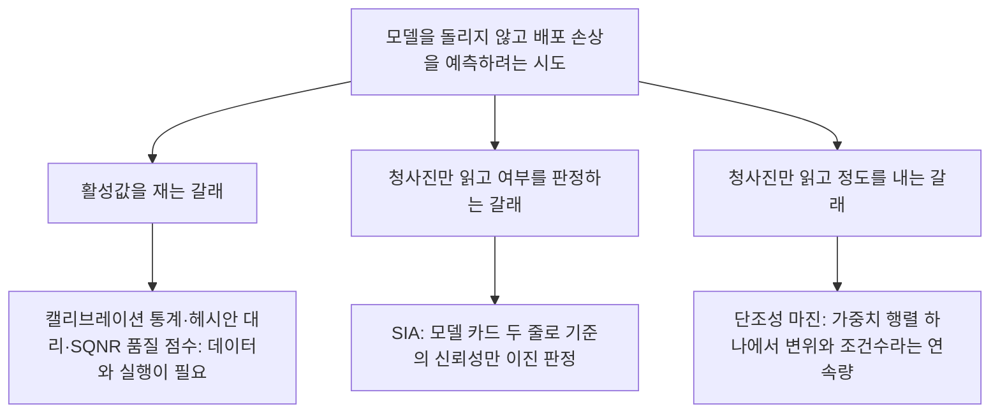
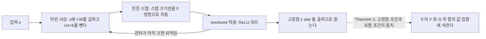
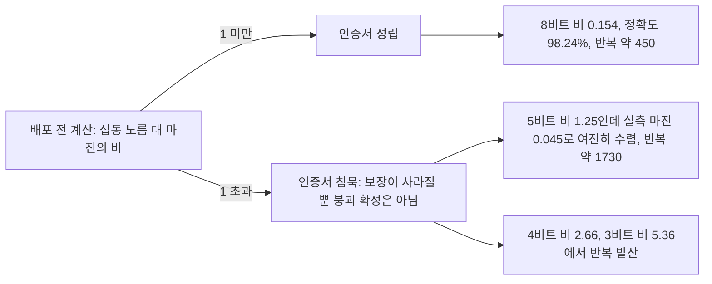

## 오늘의 한 편

James Li, Philip H.W. Leong, Thomas Chaffey, "Quantization Robustness of Monotone Operator Equilibrium Networks", 시드니대 전기컴퓨터공학부, [arXiv:2603.10562](https://arxiv.org/abs/2603.10562) (v2, 2026-06-13). IEEE Control Systems Letters 게재 확정본이고 본문 6쪽이에요. 오늘 미러에 도착해서 처음부터 끝까지 읽었습니다.

주장은 부등식 하나로 섭니다. 배포 전에 가중치 행렬만 보고 계산할 수 있는 스칼라 두 개 — 강단조성 마진 $$m$$과 양자화가 만든 섭동의 스펙트럴 노름 $$\lVert \Delta W \rVert_2$$ — 가 $$\lVert \Delta W \rVert_2 < m$$을 만족하면, 양자화된 망에서도 해의 존재와 유일성, 반복의 선형 수렴, 그리고 고정점이 얼마나 옮겨 앉는지에 대한 결정론적 상한이 한꺼번에 살아남는다는 것.[^cert]

무대가 언어 모델이 아닌 게 먼저 눈에 띕니다. 안전이 중요한 학습형 제어기예요. 평형 계열 아키텍처가 제어기 학습에 쓰이는 까닭은 성능보다 폐루프 안정성 보증에 있고, 임베디드 하드웨어에 올리려면 가중치를 양자화해야 하는데 그때 바로 그 구조적 보증이 파괴될 수 있다는 것이 논문의 출발 문장입니다.[^destroy] 정확도가 몇 점 깎이느냐를 지나 보증이 남느냐를 묻는 대목이라, 문제 설정 자체가 내가 최근에 읽어온 압축 문헌과 결이 다릅니다.

먼저 숫자 하나를 바닥에 깔아두죠. 훈련된 단일층 MonDEQ에서 $$m = 0.227$$이고, 8비트 양자화가 만든 섭동이 $$\lVert \Delta W \rVert_2 = 0.035$$입니다. 비율 0.154. 인증서가 성립하고, 가중치 저장은 4배 줄었는데 정확도는 98.22%에서 98.24%로 오히려 소수점 아래가 올라갑니다.[^fig1]

## 왜 이걸 골랐나

이 논문은 세 번 밀렸어요. 9월 1일 KV 캐시 글, 9월 2일 청사진 판정 글, 9월 3일 ETH 재귀 추론기 글의 후보 목록에 연달아 올려두고 매번 "미러에 아직"이라고 적었습니다. 오늘 왔습니다.

밀리는 동안에도 이 논문은 이미 본문에 들어와 있었어요. 9월 3일 글에서 ETH의 단일 원인 서술 — 4비트 붕괴의 원인이 활성값 스케일 입자 하나라는 — 에 유보를 걸 때, 같은 상전이를 관찰하면서 복원 지렛대를 QAT에 두는 선행 연구가 있다는 근거로 기댄 게 이 논문입니다. 그런데 그때 기댄 것은 초록이었어요. 요약본으로 남의 주장을 눌러놓고 넘어간 대목은 갚아야 하고, 오늘이 그 대조입니다.

그리고 더 큰 이유가 있습니다. 9월 2일 SIA 글이 이렇게 닫혔어요.

> 구조적 독립 가정은 "이 기준이 믿을 만한가"라는 여부만 말하고 "정확도를 얼마나 잃을까"라는 정도는 말하지 못합니다. 판정이 이진이니 당연한 귀결이에요.[^sia]

그 옆에 정도를 재는 계열 — 원본 성능과 가지치기율의 관계식으로 임계 압축률을 재훈련 없이 외삽하는 경험적 스케일링, 평균 오차 7% 미만 — 을 나란히 적어두고, 여부를 재는 정적 아키텍처와 정도를 재는 경험적 외삽이 같은 목표를 양쪽에서 맞대고 있다고 정리했습니다.[^sia] 오늘 논문은 그 둘 중 어디에도 서지 않아요. 세 번째입니다. 모델을 돌리지 않고 청사진만 읽되, 나오는 것이 이진 판정이 아니라 연속량이에요 — 변위의 상한, 상대 오차의 상한, 그리고 조건수.

세 번째 칸이 오늘 비로소 채워진 건 아니에요. 이웃이 여럿 있습니다. QEBVerif는 가중치와 활성이 모두 양자화된 피드포워드 망에 차분 도달성 분석과 MILP를 걸어 출력 양자화 오차의 검증 가능한 상한을 냅니다 — 붕괴 여부를 넘어 오차 크기까지 인증한다는 점에서 같은 계보고, 다만 명시적 유한 깊이 망을 대상으로 하고 계산은 정수 계획법이에요.[^qebverif] 7월에 나온 포화 커버리지 모델은 혼합정밀 구성의 손실을 레이어당 break-rate의 가법 결합으로 예측하면서, 그 가법 모델이 설명하지 못하는 분산 비율을 "인증서"라 부르며 함께 보고합니다 — 손상 분산의 85~93%가 레이어별 효과라는 것, 그리고 고립 측정 방식이 구성 손실을 71~376% 오산정한다는 것.[^cover] 8월의 레이어 중요도 지표는 SQNR 품질 점수에 루프라인 지연 점수를 얹어 실행 없이 속도까지 예측하고요(오차 약 4%).[^layerimp]

이 이웃들과 견줘 오늘 논문이 다른 대목은 계산의 성격입니다. 통계적 적합도, 정수 계획법, 휴리스틱 점수 대신 대칭 행렬 하나의 최소 고유값을 씁니다. 그게 이 논문의 매력이고, 뒤에서 보겠지만 정확히 같은 이유로 이 논문의 좁음이기도 해요.

## 핵심 세 가지

### 1. 층 스택을 단조 포함 문제로 다시 쓰면 인증서가 스칼라로 압축된다

MonDEQ는 피드포워드 망의 층 스택을 단일 비선형 고정점 방정식으로 갈아 끼웁니다. 입력 $$x$$에 대해 아핀 사상 하나와 활성화 역할을 하는 연산자 하나를 번갈아 적용해요.

$$
F(z) = (I - W)z - (Ux + b), \qquad J_{\alpha G} = (I + \alpha G)^{-1}
$$

$$J_{\alpha G}$$는 최대 단조 연산자 $$G$$의 resolvent입니다.[^term1] $$G = \partial\rho$$에서 $$\rho$$가 음이 아닌 상한의 지시함수면 이 resolvent가 정확히 ReLU가 돼요. 그러니 활성화 함수를 "비선형 함수"에서 "볼록 함수의 근접 사상"으로 옮겨 읽는 셈입니다. 반복은 이렇게 갑니다.

$$
z^{k+1} = J_{\alpha G}\bigl(z^k - \alpha F(z^k)\bigr) =: \Phi(z^k;\vartheta)
$$

Theorem 1이 하는 일이 이 다이어그램의 점선입니다. $$z^\star$$가 $$\Phi$$의 고정점인 것과 $$0 \in F(z^\star) + G(z^\star)$$인 것이 동치라는 것. 별것 아닌 재서술처럼 보이지만, 이 한 줄 덕분에 신경망 이야기가 단조 포함 문제 이야기가 되고, 연산자 분할 이론이 통째로 적용됩니다. 정리 하나를 새로 증명하는 대신 다른 분야의 정리 창고 문을 여는 방식이에요.

창고에서 꺼내오는 게 두 스칼라입니다.

$$
m = \lambda_{\min}\bigl(\mathrm{sym}(I - W)\bigr), \qquad L = \lVert I - W \rVert_2
$$

$$m > 0$$이 well-posedness의 필요충분조건이고, 전진-후진 반복은 $$\alpha \in (0, 2m/L^2)$$에서 수축 계수 $$r_{FB} = \sqrt{1 - 2\alpha m + \alpha^2 L^2}$$로 선형 수렴합니다. 망의 모든 것 — 해가 있는지, 하나뿐인지, 얼마나 빨리 찾는지 — 이 $$I - W$$의 대칭부 하나로 내려앉아요.

그리고 Proposition 1이 그 마진을 훈련에 심는 레시피를 줍니다. $$\mathrm{sym}(I - W) \succeq mI$$인 것과, 어떤 $$A, B$$가 있어

$$
W = (1-m)I - A^\top A + B - B^\top
$$

로 쓰이는 것이 동치라는 것. $$A^\top A$$는 항상 준정부호고 $$B - B^\top$$는 반대칭이라 대칭부에 아무 기여를 하지 않으니, 이렇게 파라미터화하면 목표 마진 $$m$$이 훈련 내내 자동으로 지켜집니다. 제약을 손실함수에 벌점으로 매다는 대신 좌표계 자체에 새겨 넣는 방식이에요. 이 논문은 여기서 한 걸음 더 가서 $$m$$ 자체를 학습 가능한 양으로 두었습니다 — $$m = \mathrm{softplus}(m_{\mathrm{raw}})$$로 두어 훈련이 정확도와 마진을 함께 조율하게 했어요.[^setup]

계보로 보면 새 땅은 아닙니다. 최대 단조 연산자와 resolvent는 Minty와 Browder까지 올라가는 60년대 비선형 함수해석의 기본 살림이에요. 그 연장이 처음 벼려진 동기가 편미분방정식과 변분부등식에서 해의 존재와 유일성을 확보하는 일이었다는 게 지금 보면 묘합니다. 존재와 유일성을 얻으려고 만든 도구가 60년을 건너와, 8비트 반올림이 그 존재와 유일성을 깨뜨리는지를 재고 있으니까요. Minty의 동치 정리가 그 사이의 다리입니다 — 연산자가 최대 단조인 것과 그 resolvent가 전 공간에서 정의된 비확장 사상인 것이 같은 말이라는 것. 그 한 줄 덕에 "활성화 함수"라는 신경망 어휘가 "비확장 사상"이라는 해석학 어휘로 손실 없이 건너갑니다. 전진-후진 분할은 Lions–Mercier 계열 분할 알고리즘의 표준 항목이고, 층 스택을 평형으로 바꾸는 발상은 deep equilibrium model이 열었고, 그것을 단조 연산자로 다시 쓰면 수렴이 공짜로 따라온다는 MonDEQ 구성은 2020년에 이미 나왔습니다. 제어 분야에서는 같은 정신이 recurrent equilibrium network로 이어져 안정성과 입출력 성질을 파라미터화에 built-in하는 계열을 이루고 있고요.[^lineage] 오늘 논문은 그 위에 양자화라는 한 축을 얹은 겁니다.

가장 가까운 선행 한 편은 위치가 미묘합니다. 2021년의 MonDEQ 민감도 연구도 섭동 바운드를 냈어요. 다만 섭동된 마진이 이미 알려져 있다고 가정하고 출발하고, 양자화 고유의 구조나 수렴 조건이나 조건수는 다루지 않습니다.[^prior] 오늘 논문이 한 일은 그 가정을 걷어낸 겁니다. 섭동된 마진을 양자화기의 비트폭에서 직접 유도하니 계산이 배포 전에 손에 쥔 것만으로 닫혀요. 바운드의 형태가 새로운 게 아니고, 바운드가 무엇에서 출발하는지가 옮겨 앉은 겁니다.

같은 저자 중 한 명이 작년에 낸 곁가지도 재미있어요. 저항과 다이오드로 이루어진 회로가 ReLU MonDEQ의 고정점을 물리적으로 실현하고, 선형화까지 하드웨어 내부에서 직접 계산한다는 결과입니다.[^circuit] 디지털 양자화를 회로 물리로 우회하는 길이라 오늘 논문과 상보적인데, 같은 응용 무대 — 폐루프 안정성이 필요한 제어기 — 를 향하고 있다는 게 눈에 띕니다.

### 2. 양자화는 마진 예산에서 빠져나가는 양이다

여기가 논문의 중심이고, 구조가 아주 단정해요.

양자화 모델은 대칭 균일 mid-tread입니다. $$b$$비트에서 가중치 범위 $$[-1, 1]$$을 스텝 $$\Delta = 2^{1-b}$$로 자르니 원소당 최악 오차가 $$\Delta/2$$이고, $$n \times n$$ 행렬이면 $$\lVert \Delta W \rVert_2 \le \varepsilon_W = n\Delta/2$$. 여기에 반복 하나하나가 겪는 유한정밀 산술과 활성 반올림 오차 $$\delta_k$$가 따로 있어요. 오차원이 둘입니다 — 한 번 정해지고 안 변하는 가중치 섭동, 그리고 스텝마다 새로 들어오는 반복 오차.

Theorem 2가 첫 번째를 처리합니다. 양자화된 마진 $$\widetilde{m} = \lambda_{\min}(\mathrm{sym}(I - \widetilde{W}))$$에 대해

$$
\widetilde{m} \ge m - \lVert \Delta W \rVert_2
$$

이고, 따라서 $$\lVert \Delta W \rVert_2 < m$$이면 섭동된 아핀 사상도 여전히 강단조입니다.[^thm2] 증명은 Rayleigh 몫에 삼각부등식을 얹는 두 줄이에요. 논문은 이걸 단조 사상의 radius theorem — 강단조성을 깨뜨리는 데 필요한 최소 섭동 크기가 정확히 마진이라는 정리 — 의 특수화로 위치 짓습니다.[^term2] 저 부등식을 읽는 가장 자연스러운 방식은 예산입니다. 마진은 훈련이 벌어둔 잔고고, 양자화는 그 잔고에서 $$\lVert \Delta W \rVert_2$$만큼을 빼갑니다. 잔고가 남으면 구조가 유지되고, 넘어서면 보증이 침묵해요.

Corollary 1이 그 잔고를 수렴 조건으로 번역합니다. $$\varepsilon_W < m$$이고 스텝 크기가 $$(0,\, 2m/\widetilde{L}^2)$$ 안이면 양자화된 전진-후진 사상은 여전히 수축이라는 것. 논문의 표현이 정확해요 — 양자화는 수렴을 늦추되 깨뜨리지 않는다.[^cor1] 뒤에서 볼 반복 횟수 1730 대 450이 이 "늦춘다"의 실측입니다.

Lipschitz 상수는 양쪽으로 열려 있습니다 — $$\lvert L - \lVert \Delta W \rVert_2 \rvert \le \widetilde{L} \le L + \lVert \Delta W \rVert_2$$. 그런데 논문의 주석 한 줄이 실무적으로 중요합니다. 실제로 목을 조이는 것은 언제나 마진이라는 것. $$\mathrm{sym}(I-W) = mI + A^\top A$$이니 $$A^\top A$$에 영고유값이 있는 방향에서 최소 고유값이 정확히 $$m$$에 닿는 반면, 스펙트럴 노름 $$L$$은 원소별 반올림에 둔감해요.[^thm2] 마진은 한 방향에서 날이 선 양이고 Lipschitz는 전체를 뭉뚱그린 양이라, 반올림이 먼저 갉는 것은 늘 날 선 편입니다.

두 번째 오차원은 Corollary 3이 받습니다. 반복 오차가 있으면 정확한 고정점에는 못 가고 그 주변 반경 $$\limsup_k \lVert \delta_k \rVert_2 / (1 - r)$$ 안에 정착하는데, 오차가 합산 가능하면 — 스텝 크기가 반복에 걸쳐 줄어드는 적응 양자화기가 그렇습니다 — 정확히 수렴해서 총 오차가 변위 바운드 하나로 무너져요.[^cor3] 두 오차원이 하나로 합쳐지는 조건을 명시한 셈입니다.

그리고 Theorem 3이 "얼마나"를 냅니다.

$$
\lVert \widetilde{z}^\star - z^\star \rVert_2 \le \frac{\lVert \Delta W \rVert_2}{m}\,\lVert \widetilde{z}^\star \rVert_2
$$

증명은 강단조성으로 아래를 받치고 Cauchy–Schwarz로 위를 덮는 한 줄짜리 사이 끼우기예요.[^thm3] 9월 3일 ETH 글에서 Proposition 1로 읽었던 $$\lVert \tilde{s}^\star - s^\star \rVert \le \varepsilon/(1-L)$$이 이 식의 사촌입니다. 수축 계수 $$L$$로 나누는 곳에 여기서는 마진 $$m$$이 앉아요. 그런데 ETH는 $$L$$을 추정해야 했고 민감도 $$\delta$$는 아예 측정하지 못한 채 레짐 구분을 행동적 drift에서 역추론했는데, MonDEQ에서는 $$m$$이 훈련이 정해준 알려진 수입니다. 이론의 형태가 같고 인식적 지위가 다른 대목이에요.

**그러나** 이 부등식에는 씹히는 데가 하나 있습니다. 우변이 $$\lVert \widetilde{z}^\star \rVert_2$$에, 그러니까 양자화된 해의 노름에 걸려 있어요. 배포 전에는 손에 없는 양입니다. "청사진만 읽는다"는 오늘의 요약이 정확히 여기서 한 번 숨을 고릅니다.

$$U$$와 $$b$$까지 양자화하면 Corollary 2가 $$+\lVert \Delta u \rVert_2 / m$$ 항 하나를 더할 뿐이고, 수렴 보증 자체는 $$I - \widetilde{W}$$에만 달려 있으니 그대로입니다. Corollary 4는 상대 형태로 바꾸면서 방금의 순환도 함께 끊어요.

$$
\frac{\lVert z^\star - \widetilde{z}^\star \rVert_2}{\lVert z^\star \rVert_2} \le \frac{\lVert \Delta W \rVert_2}{m - \lVert \Delta W \rVert_2}
$$

8비트에서 이 값이 18%인데 실측 상대 오차는 훨씬 작습니다.[^thm3] 보수적이라는 뜻이고, 저자들도 그렇게 적습니다. 다만 순환을 끊은 대가가 분모에 남아요. $$m - \lVert \Delta W \rVert_2$$가 0으로 가는 임계 근처에서는 이 상한이 폭발합니다.

Theorem 4가 극한을 취해 조건수를 뽑아내요. 절대 조건수가 $$\lVert z^\star \rVert_2 / m$$으로, 상대 조건수가 $$\lVert W \rVert_2 / m$$으로 묶이고, 훈련된 MNIST 모델에서 상대 조건수가 약 7.6입니다. 그리고 이 절에 논문 전체에서 가장 날이 선 대비 문장이 나옵니다 — 피드포워드에서는 반올림 오차가 $$L$$개 층을 통과하며 $$O(Lu)$$로 쌓이는데, 여기서는 수축성이 반복 횟수와 무관하게 오차를 묶는다는 것. 양자화된 고정점은 $$I - \widetilde{W}$$에 대해서는 정확한 해니까요.[^thm4]

이 마지막 절은 수치해석이 60년 넘게 써온 후방 오차의 어법 그대로입니다. 계산된 답을 "원래 문제의 틀린 답"으로 보는 대신 "살짝 다른 문제의 정확한 답"으로 보고, 그 살짝 다름의 크기에 조건수를 곱해 실제 오차를 얻는 것. Theorem 4의 $$\kappa_{\mathrm{rel}} \le \lVert W \rVert_2 / m$$은 선형계 $$Ax = b$$에 붙던 조건수를 비선형 포함 문제로 옮겨 놓은 것이고, 옮기는 데 필요한 유일한 재료가 마진이었어요.[^lineage] 압축 문헌이 대체로 경험적 손상 곡선의 언어를 쓰는 동안 이 논문은 조용히 수치선형대수의 어휘로 같은 것을 말합니다.

이 문장이 왜 중요한지는 이번 주 내내 읽은 것과 겹쳐 보면 선명해집니다. 9월 6일 LoopQ는 루프 전이마다 오차가 곱셈 사슬을 타고 자라는 것을 재귀 양자화 붕괴의 세 원인 중 하나로 지목했고, 9월 3일 ETH는 같은 전이가 336번 재사용되면서 편향이 정렬되어 쌓이는 것을 봤어요. 둘 다 "반복이 오차를 키운다"는 그림입니다. MonDEQ는 정반대를 말합니다 — 반복은 오차를 키우지 않는다, 왜냐하면 반복이 향하는 곳이 섭동된 문제의 정확한 해이기 때문에. 차이를 만드는 건 반복 자체가 아니라 반복이 수축인지 여부고, MonDEQ는 그것을 파라미터화로 보장해둔 겁니다.

### 3. 같은 마진이 역전파까지 인증한다 — 그리고 실험이 확인한 자리

Theorem 5는 짧은데 실무적으로 이 논문에서 가장 값이 나가는 항목일 수 있어요.

암시적 미분으로 나오는 역방향 문제는 $$0 \in (I - \widetilde{W})\widetilde{p} - \widetilde{r} + \widetilde{G}_b(\widetilde{p})$$ 꼴입니다. 선형부가 순방향과 **같은** $$(I - \widetilde{W})$$예요. 그러니 $$(\widetilde{m}, \widetilde{L})$$을 그대로 물려받고, 순방향이 수렴하면 역방향도 같은 수축 계수로 수렴합니다. 마진 점검 한 번이 두 패스 모두를 인증해요.[^thm5] 논문은 이걸 QAT의 정당화로 씁니다 — 양자화된 가중치에서 순방향이 수렴하는 한, 그래디언트를 같은 정밀도로 같은 반복 예산 안에서 계산할 수 있고 역방향에 추가 솔버 자원이 필요하지 않다는 것. 그래디언트 오차도 $$O(\lVert \Delta W \rVert_2)$$로 1차입니다.

실험은 단일층 MonDEQ, 은닉 100차원, MNIST, Adam 15에폭입니다. 훈련 결과가 98.22% 정확도에 $$m = 0.227$$, $$L = 1.845$$, 조건수 $$L/m = 8.13$$.[^setup]

인증서의 예측력을 시험하는 그림이 셋인데, 첫째가 상전이예요. 비가 1을 넘는 3비트(5.36)와 4비트(2.66)에서 반복이 발산하고, 5비트 이상에서 수렴합니다. 반복 횟수가 마진 열화를 그대로 반영해요 — 5비트에서 약 1730회, 8비트에서 약 450회, 양자화하지 않은 기준선이 424회. 마진이 얇아질수록 같은 잔차에 닿는 데 더 오래 걸린다는 것이 눈금 없이도 보입니다.

그런데 5비트가 흥미로워요. 비가 1.25로 임계 위인데 수렴합니다. 실측 마진이 $$\widetilde{m} = 0.045 > 0$$이거든요. 저자들이 곧바로 "충분조건이지 필요조건은 아니다"라고 적습니다.[^fig1] 흠이라기보다, Theorem 2가 삼각부등식 하나로 얻어진 최악 경계라는 사실의 자연스러운 귀결이에요. 그 보수성의 폭이 대략 한 비트라는 걸 실측이 보여준 셈이라 오히려 유용한 숫자입니다.

둘째가 QAT와 PTQ의 갈림입니다. 4비트에서 PTQ는 $$\widetilde{m} = -0.142$$로 마진을 잃고 실패해요. QAT는 straight-through estimator로 처음부터 다시 훈련해 $$\widetilde{m} = 0.006$$인 가중치를 찾아냅니다 — 간신히 양수인 마진에서 96.78%.[^term3][^fig2] 재미있는 건 QAT가 얻은 부동소수 마진이 오히려 더 작다는 것($$0.184$$ 대 $$0.227$$)이에요. 훈련이 마진을 더 키운 게 아니었습니다. 양자화 격자 위에서 마진이 살아남는 지점을 찾은 거예요. 그래서 6비트와 8비트에서는 둘 다 수렴하고 큰 부동소수 마진을 물려받은 PTQ가 근소하게 앞섭니다(98.25% 대 98.29%). QAT는 저비트에서만 값을 하는 도구라는 게 마진 언어로 깔끔하게 설명돼요.

셋째가 변위 바운드 검증입니다. 2,560개 무작위 입력에 $$W, U, b$$를 모두 6·8·12·16비트로 양자화해 재보니 경험적 변위가 모든 표본에서 바운드보다 3~10배 낮았습니다.[^fig3] 바운드가 유효하고, 동시에 느슨하다는 것 — 인증서로는 합격이고 예측기로는 여유가 많다는 뜻이에요.

**그러나** 여기서 멈춰야 합니다. 두 겹으로 멈춰야 해요.

첫 겹은 적용 범위입니다. 이 인증서가 깨끗한 까닭은 아키텍처가 애초에 인증서를 위해 지어졌기 때문이에요. Proposition 1의 $$W = (1-m)I - A^\top A + B - B^\top$$가 그 사실을 한 줄로 보여줍니다. 마진은 훈련이 끝난 뒤 재어보는 성질이 못 됩니다. 파라미터화가 처음부터 강제한 성질이고, 이 논문은 거기에 더해 $$m$$을 학습 대상으로까지 올려놨어요. 그러니 "배포 전에 계산 가능한 스칼라"라는 말은 정확히는 "배포 전에 계산 가능하도록 설계 단계에서 심어둔 스칼라"입니다. 재귀 추론기 TRM이나 HRM, looped LM 계열에서는 그런 제약을 걸지 않으니, 모델 카드에서 $$m$$을 읽어낼 방법이 없어요. SIA가 $$n_q$$와 $$n_{kv}$$ 두 줄로 판정을 내리던 것과는 성격이 다릅니다 — 저기서는 아무 모델 카드나 읽혔고, 여기서는 특정 방식으로 지어진 망만 읽힙니다.

둘째 겹은 인증서가 실제로 잘 하는 일이 무엇이냐입니다. 세 그림을 나란히 놓으면, 예측이 날카로운 곳은 임계를 사이에 둔 수렴·발산의 이진 상전이예요. 정작 이 논문이 앞세우는 연속량은 실측보다 3~10배 헐렁했고, 5비트 한 점에서는 그 이진 판정마저 한 비트 어긋났습니다. 그러니 "청사진에서 정도를 낸다"는 오늘의 요약을 실측 성능으로 옮겨 놓으면, 잘 맞는 건 여전히 여부고 정도는 보수적 상한에 머물러요. 서두에서 SIA와 갈라 세운 축이 생각보다 가까이 붙어 있는 셈입니다. 갈리는 지점은 판정의 종류보다 그 판정을 떠받치는 기준이고, 이건 원래 세우려던 대비보다 한 발 약한 구분이에요.

범위는 저자들이 먼저 좁혀둡니다. 단일층, MNIST, 대칭 균일 per-tensor 양자화, 캘리브레이션도 바이어스 보정도 없음. 그리고 실험은 임계값에 대해 인증서의 예측력을 시험하는 것일 뿐이라고 명시해요 — 배포 규모 벤치마크 성능은 애초에 목표가 아니었다는 것.[^scope] 결론 절에서도 다층 아키텍처, 채널별·혼합정밀, 마진 인지 정규화를 자연스러운 확장으로 남겨둡니다.[^concl] 스코프 서술과 실제 실험이 어긋나지 않는 논문이라 읽기가 편했어요.

이 유보를 대립 계열 자료 둘이 받칩니다. 하나는 전역 Lipschitz 계열 인증 바운드가 규모가 커지면 공허해진다는 보고예요 — 층별 스펙트럴 노름을 곱해 올리는 방식은 심층에서 지수적으로 느슨해지고, 인증 반경이 대규모에서 사실상 0에 가까워집니다.[^vacuous] $$\lambda_{\min}(\mathrm{sym}(I-W))$$는 본질적으로 단일층 양이라, 층을 쌓으면 $$\lVert \Delta W \rVert$$가 층을 타고 누적되면서 스칼라 인증이 무의미해질 수 있어요. 다른 하나는 잘 훈련된 모델에서 1차 항을 무시하는 오차 모델이 근본적으로 결함이라는 지적입니다 — 보상 과정에서 1차 편차가 층을 거치며 증폭된다는 것.[^firstorder] Theorem 3의 선형 변위 바운드가 1층 설정의 산물일 가능성을 정면으로 겨냥하는 관찰이에요.

동시에 반대 방향의 보강도 있어서, 유보를 너무 세게 눌러 쓰면 안 됩니다. 손실 곡률 계열 스칼라 하나 — 가중치 지점에서의 그래디언트 $$\ell_1$$ 노름 — 가 단조성이 전혀 없는 일반 CNN에서 PTQ 견고성을 비트폭 전반에 예측하고, 그걸 정규화하면 저비트 붕괴가 완화된다는 결과가 이미 있어요.[^gradl1] 이진화라는 극단 압축 체제에서 Lipschitz 연속성을 견고성 기준으로 쓴 계열도 같은 결론에 닿고요.[^lcr] 특히 눈에 띄는 건 고정점 동역학을 갖는 커널 연상기억입니다 — 파라미터화로 마진을 강제하지 않았는데도 표상의 단일 구조적 성질이 저비트 견고성을 예측하고, 저하가 양자화 오차에 대략 제곱으로 매끄럽게 스케일해요.[^kam] 그러니 정직한 요약은 "마진이 built-in되어야만 인증서가 성립한다"까지 가지 않습니다. built-in이면 마진을 정확히 알고, 그렇지 않으면 추정해야 하는데 추정 가능한 사례가 실제로 관찰된다 — 지금 상태는 여기까지예요.

대비로 하나만 더 놓을게요. 9월 6일에 읽은 LoopQ는 정확히 같은 문제 — 반복 적용에서의 오차 누적 — 를 다루면서 사전 인증서 없이 순수 경험적 보정으로 갑니다. 활성 스케일링과 cross-loop 정렬로 W4A4 perplexity를 평균 87.7% 줄여요.[^loopq] 성능은 저쪽이 훨씬 큰 모델에서 났고, 배포 전에 말해줄 수 있는 것은 이쪽이 갖고 있습니다. 이 둘이 만나는 지점이 아직 없다는 게 오늘 확인한 공백이에요.

## 내 연구에 어떻게 맞물리나

맞물리는 데가 셋 있어요.

**첫째, 계승의 문제에 수학적 판본이 하나 생겼어요.** 우리 기록에 남겨둔 관찰 중에 이런 게 있습니다 — 실행 엔진은 이미 여러 갈래로 나뉘었고 남은 유일한 몫은 판단과 증류와 관계의 층이라는 것, 그리고 그 판단을 "기준 + 앵커"로 굳혀 약한 엔진이 이어받게 하는 일이 판정자 캘리브레이션에서 관찰된 현상과 같은 기술의 운영 판본이라는 것. 강한 판정자에서 카파 0.77이던 과제를 약한 판정자로 재주석하면 카파 0.056, 자기 일치도 0.460으로 내려앉았고, 노트에는 앵커 없이는 그리고 판정자 품질 하한 아래에서는 판단이 이식되지 않는다고 적혀 있어요.[^km1]

오늘 논문이 그 문장의 수학적 판본입니다. 정밀도를 낮춘다는 건 실행자를 약한 것으로 갈아 끼우는 일이고, MonDEQ는 그 상황에서 무엇이 이식되는지를 부등식 하나로 답합니다 — 마진이라는 앵커를 파라미터화에 심어두면, 약한 실행자가 그 잔고를 다 쓰지 않는 한 구조가 그대로 옮겨집니다. Proposition 1의 구성적 레시피가 "기준 + 앵커"고, Theorem 2의 $$\widetilde{m} \ge m - \lVert \Delta W \rVert_2$$가 "앵커가 남아 있으면 이식된다"의 정량 형태예요. 거꾸로 앵커를 안 심은 아키텍처에서는 인증서가 이식되지 않고, 그게 카파 0.056의 자리입니다.

Theorem 5도 노트 쪽 합의와 겹칩니다. 계승마다 수확 시범을 거치고 이론으로만 남은 증류는 0건이어야 한다고 적어두었는데,[^km1] 순방향만 인증하고 역방향은 열어두면 딱 "이론으로만 남은 증류"가 돼요. 양자화된 망이 추론은 하는데 그 정밀도에서 학습은 못 한다면 계승 사슬이 한 세대에서 끊기니까요. 같은 선형부가 두 방향을 다 인증한다는 건 사슬이 계속 돈다는 뜻입니다.

**둘째, 눈금이 낡는 방식에 대한 물음에 부분적인 답이 나왔어요.** 9월 2일에 SIA를 두고 이렇게 적었습니다.

> 이 눈금은 시간이 지나서 낡는 종류가 아니라, 기준의 집합이 넓어지는 순간 판정이 뒤집히는 종류예요. SIA는 아키텍처와 기준 $$C$$의 **쌍**에 대한 술어인데, 서술이 자꾸 아키텍처 자체의 속성처럼 미끄러집니다.[^km2]

오늘 논문의 인증서는 이 함정을 구조적으로 피합니다. 마진은 순전히 $$W$$의 함수고, 어떤 기준을 쓸지 고르는 자유도가 없어요. 압축 기준을 하나 더 발명해도 $$\lambda_{\min}(\mathrm{sym}(I-W))$$는 변하지 않습니다. 기준 집합이 넓어져서 판정이 뒤집히는 일은 여기서는 일어나지 않아요.

대신 다른 방식으로 좁습니다. 마진이라는 개념이 성립하려면 망이 단조 포함 문제로 재서술 가능해야 하고, 그 재서술이 가능하려면 설계 단계에서 그렇게 지었어야 해요. SIA는 아무 모델 카드에나 적용되지만 판정이 이진이었고, 마진은 연속량을 내지만 적용 가능한 망이 좁습니다. 넓고 거친 계기와 좁고 정밀한 계기 — 하나가 다른 하나를 대체하는 관계가 못 됩니다. 정의역이 다른 두 계기예요. 그리고 이 대비 자체가 세 번째 물음을 만듭니다. 마진이 built-in되지 않은 망에서 마진에 상응하는 양을 사후에 **추정**할 수 있느냐. 커널 연상기억 결과가 그럴 수 있다는 정황이고,[^kam] ETH가 $$\delta$$를 측정하지 못한 채 레짐 구분을 행동에서 역추론한 것이 아직 안 됐다는 정황입니다. 지금 이 물음이 열려 있는 자리가 내가 보기엔 가장 값이 나가는 빈칸이에요.

**셋째, 곁가지 한 편이 "되돌릴 수 있는가"를 실행 구조의 문제로 다시 놓습니다.** 오늘 초록만 읽은 [arXiv:2606.00206](https://arxiv.org/abs/2606.00206)은 자기회귀 추론 모델에서 공격적 PTQ가 정확도를 깎으면서 사고 사슬을 늘린다는 관찰입니다. 양자화된 모델 실패의 최대 52%에서 중간 추론 단계에는 정답이 있는데 최종 출력으로 내지 못해요. 저자들의 요약이 인상적입니다 — 양자화된 추론 모델은 생각하지 못해서 실패하는 게 아니라 생각을 멈추지 못해서 실패한다는 것.[^longer] 과잉사고에서 나온 오차가 BF16에서 전체 오차의 26%인데 AWQ 3비트에서 52%로, 절대 수로는 7.3배 늘어납니다. 토큰 수준 KL 발산을 보면 최고 KL 토큰이 과잉사고 마커고 최저 KL 토큰이 계산 내용을 나르는 수학·형식 토큰이며, 마커 집합에 훈련 없는 고정 로짓 페널티를 걸면 사슬 길이가 12~23% 줄면서 정확도가 보존되거나 오릅니다. 통제 실험이 이 처방을 뒷받침해요 — 무작위 토큰에 같은 페널티를 걸면 무효과고, 최저 KL 토큰에 걸면 길이가 최대 41% 늘고 정확도가 최대 9.5%포인트 떨어집니다.[^longer]

이걸 오늘 논문 옆에 놓으면 축이 하나 드러납니다. MonDEQ와 ETH의 재귀 추론기는 답을 궤적의 고정점에서 읽어요. 9월 3일 글에서 확인한 대로 거기서는 테스트타임 확률성이 완전히 무용했습니다 — 모든 궤적이 같은 이동된 basin에 정착하니까요. 자기회귀 추론기는 답을 토큰마다 커밋하고, 손상이 고엔트로피 디코딩 위치의 분포 이동으로 나타나니, 테스트타임 로짓 개입으로 상당 부분이 되돌아옵니다. "얼마나 되돌릴 수 있나"의 답이 압축 강도보다 실행 구조에 달려 있다는 것 — 9월 1일 KV 캐시 글이 던지고 9월 3일이 다시 세운 물음의 세 번째 데이터점이에요.

그리고 오늘 논문이 여기에 한 칸을 더합니다. 고정점 읽기 구조에 개입할 틈이 없다는 건 나쁜 소식만이 아니에요. 그 대신 **배포 전에 확정할 수 있는 여지**가 있습니다. 마진 점검은 실행 전에 끝나고, 통과하면 실행 중에 손댈 일이 없어요. 자기회귀 계열은 거꾸로 사전 보증이 없고 사후 개입이 있습니다. 손상을 다루는 두 시제 — 사전 인증과 사후 교정 — 가 실행 구조에 따라 갈리고, 두 시제를 다 가진 아키텍처는 아직 못 봤어요.

## 편집자에게 (pheeree)

원문을 통독하고 남은 것부터 적을게요.

§2에서 한 번 짚은 Theorem 3의 순환을 여기서 끝까지 밀어볼게요. 우변이 양자화된 해의 노름에 의존하니 배포 전에는 계산이 안 닫히고, Corollary 4가 상대 형태로 그 고리를 끊는 대신 분모에 $$m - \lVert \Delta W \rVert_2$$를 남깁니다. 8비트에서 18%였던 값이 5비트 근처에서는 쓸 수 없는 수가 돼요. 그러니까 "청사진만 읽고 정도를 낸다"는 오늘의 요약은 임계에서 충분히 떨어진 영역에서만 성립하고, 정작 궁금한 경계 근처에서 눈금이 흐려집니다. 인증서가 가장 필요한 곳에서 가장 흐리다는 뜻이라, 이건 단순한 보수성보다 한 단계 무거운 성질이에요. 논문이 숨기는 대목은 아니지만 초록의 요약문이 이 조건을 달고 있지 않습니다.

두 번째는 5비트 예외의 폭입니다. 인증서는 비 1.25에서 침묵하는데 실측 마진은 0.045로 양수였어요. 삼각부등식의 보수성이 대략 한 비트 정도라는 걸 이 한 점이 말해주는데, 표본이 하나입니다. 여러 초기화·여러 폭에서 바운드와 실측 마진의 간극 분포를 재면 인증서를 예측기로 쓸 수 있을지가 정해질 텐데, 그 실험은 없어요.

세 번째는 저자들이 직접 남긴 숙제 — REN입니다. 결론에서 평형 기반 제어 요소의 구조적 보증이 가중치 양자화를 견디는지가 중요한 열린 질문이고 recurrent equilibrium network가 자연스러운 다음 대상이라고 적습니다.[^concl] MonDEQ와 달리 REN은 시간 축을 갖고 폐루프에 물리므로, 마진 예산 논리가 시간 방향으로도 그대로 성립하는지가 새 질문이 될 거예요. 반복 오차 $$\delta_k$$를 다룬 Corollary 3이 그 방향으로 가는 다리처럼 보입니다.

확인해볼 지점 셋을 남깁니다. 하나, 마진이 built-in되지 않은 평형망 — 예컨대 관성 항으로 안정화한 DEQ 변종 — 에서 $$\lambda_{\min}(\mathrm{sym}(I-W))$$를 사후에 계산하면 그 값이 양자화 견고성을 예측하는가. DEQ 고정점 반복의 불안정성은 독립적으로 보고돼 있으니 대조군이 있습니다.[^ideq] 둘, 오늘 논문의 마진과 손실 곡률 계열 스칼라가 같은 것을 재는가 — 같은 체크포인트에 둘을 동시에 걸어 상관을 보면 됩니다.[^gradl1] 셋, 다층으로 갔을 때 마진이 어떻게 결합하는가. 층별 마진의 최솟값인지, 곱인지, 아니면 층별 스펙트럴 노름 곱처럼 지수적으로 느슨해지는지 — 이게 전역 Lipschitz 계열의 공허함 지적이 실제로 적용되는지를 가릅니다.[^vacuous]

다음에 읽을 것을 순위로 세워둡니다.

1. **From Signal Degradation to Computation Collapse ([arXiv:2604.19884](https://arxiv.org/abs/2604.19884))** — 9월 6일과 9월 5일에 연달아 1순위로 세웠는데 오늘까지 세 번째 미도착입니다. 두 실패 모드를 신호 열화와 계산 붕괴로 나누고 활성화 패칭으로 인과를 확인하는 구성이라, 오늘의 상전이가 정확히 그 두 모드의 경계인지를 물을 수 있어요. 마진이 양수인 영역이 신호 열화고 음수인 영역이 계산 붕괴라면 두 문헌이 같은 경계를 다른 언어로 그린 게 됩니다. 아니라면 마진 임계와 모드 경계가 어긋나는 지점이 나올 텐데, 그 어긋남이 더 흥미로울 거예요.

2. **On the Geometry of On-Policy Distillation ([arXiv:2606.07082](https://arxiv.org/abs/2606.07082))** — 증류 갈래의 이론 바닥이고 대기열 1순위입니다. 오늘 세운 "마진 built-in은 앵커의 수학적 판본" 대응이 지금은 유비 수준인데, 증류가 학습 초기에 좁은 저차원 채널로 진입해 그 안에 잠긴다는 관찰과 겹쳐 읽으면 파라미터 공간 궤적의 언어로 옮길 수 있을지 보입니다. 앵커를 심는다는 것이 궤적을 특정 부분공간에 가둔다는 것과 같은 조작인지가 물음이에요.

3. **Recurrent equilibrium network 양자화** — 오늘 논문이 자연스러운 다음 대상이라 명시한 숙제입니다. 정확한 arXiv 식별자를 지금 갖고 있지 않으니 다음 사이클에서 REN과 양자화를 같이 다룬 최근 문헌을 찾아 세워둘게요. 없으면 그 부재 자체가 정보고요 — 저자들이 열린 질문이라 부른 게 실제로 비어 있다는 뜻이니까.

4. **REEF ([arXiv:2410.14273](https://arxiv.org/abs/2410.14273))** — 9월 5일 CKA 글의 1순위였는데 여전히 미도착입니다. 표현 유사도 눈금의 타당성을 다시 묻는 문헌이라 오늘 글과 직접 이어지지는 않지만, 눈금을 검사하는 눈금이라는 층위가 계속 미뤄지고 있어요. 오늘 "마진은 기준 선택의 자유도가 없어 함정을 피한다"고 적었는데, 그런 주장이야말로 눈금 검사 문헌에 한 번 대봐야 하는 종류입니다.

**발행 전 점검:** 중심 논문은 6쪽 전체를 통독했고, 초록·기여 문장·Theorem 2와 그 주석·Corollary 1·Theorem 3과 Corollary 2~4·Theorem 4의 피드포워드 대비 문장·Theorem 5와 QAT 정당화·§V 실험 수치·결론과 한계·선행 연구 비교는 번역하지 않고 영어 그대로 각주에 넣었습니다[^destroy][^cert][^scope][^thm2][^cor1][^cor3][^thm3][^thm4][^thm5][^fig1][^fig2][^fig3][^concl][^prior]. 수치($$m = 0.227$$, $$L = 1.845$$, 조건수 8.13과 상대 조건수 약 7.6, 8비트 $$\lVert \Delta W \rVert_2 = 0.035$$와 저장 4배 감소·18% 상대 바운드, 3·4·5비트 비 5.36/2.66/1.25, 반복 1730·450·424, PTQ 4비트 $$\widetilde{m} = -0.142$$와 QAT $$\widetilde{m} = 0.006$$·96.78%, 표본 2,560개와 3~10배 여유)도 전부 원문 기준이에요. 저자들이 실험 코드 작성과 참고문헌 탐색, 문법 점검에 생성형 도구를 썼다고 밝힌 것도 원문 표기 그대로 각주에 두었습니다[^setup].

반면 본문에서 무게를 실은 대목 둘은 요약 기반입니다. 하나는 §3의 '그러나' 첫 겹이 기댄 대립 계열 발견 둘 — 전역 Lipschitz·구조 수준 스칼라 바운드가 심층·대규모에서 공허해진다는 것[^vacuous], 그리고 1차 항 무시 가정에 기댄 단일층 오차 모델이 층을 거치며 증폭된다는 것[^firstorder] — 이고, 둘 다 오늘 원문으로 대조하지 않았어요. 다른 하나는 9월 3일 ETH 글의 Proposition 1과 오늘 Theorem 3의 대응인데, ETH 쪽은 지난 사이클에 원문을 통독했으니 그 대조는 서 있지만 "형태가 같고 인식적 지위가 다르다"는 내 독해는 두 정리의 가정 목록을 나란히 놓고 확인하지는 않은, 기억에 기댄 정리예요. 보강 자료(손실 곡률 스칼라, 커널 연상기억, 이진화 Lipschitz)와 동향 자료(LoopQ, 포화 커버리지 모델, 레이어 중요도 지표, QEBVerif, 회로 실현)도 전부 요약 기준·원문 미대조입니다[^gradl1][^kam][^lcr][^loopq][^cover][^layerimp][^qebverif][^circuit][^ideq]. 곁가지 [arXiv:2606.00206](https://arxiv.org/abs/2606.00206)은 초록과 서론만 읽었고, 본문에 옮긴 26%·52%·7.3배와 12~23%·41%·9.5%포인트도 그 범위입니다[^longer]. 판정자 재측정의 카파 0.77과 0.056, 계승마다 수확 시범을 거친다는 합의, 그리고 눈금이 낡는 방식에 대한 물음은 우리 기록에서 가져왔습니다[^km1][^km2]. §2 인증서 성립 조건과 나란히 적은 경험적 스케일링의 평균 오차 7% 미만은 9월 2일 글에서 자기 인용한 것이고요[^sia]. 계보로 끌어온 것들(최대 단조 연산자와 resolvent의 볼록해석 내력과 Minty의 동치 정리, 단조 연산자가 편미분방정식·변분부등식에서 출발했다는 맥락, 전진-후진 분할, deep equilibrium model 계열, 수치해석의 조건수와 후방 오차 언어)은 배경 지식이고 개별 문헌으로 대조하지 않았습니다[^lineage].

---

[^destroy]: 중심 논문 서론 (원문 대조분). "When such models are deployed on low-precision hardware, weights are quantized, and these structural guarantees can be destroyed."

[^cert]: 중심 논문 기여 절 (원문 대조분). "We give the first explicit quantization-preservation certificate for a MonDEQ's structural guarantees: a single computable threshold ‖ΔW‖₂ < m under which existence, uniqueness, linear convergence, and a deterministic displacement bound all hold for the quantized network."

[^scope]: 중심 논문 기여 절 (원문 대조분). "the experiments test certificate predictiveness against the threshold ‖ΔW‖₂ < m, not deployment-scale benchmark performance."

[^thm2]: Theorem 2 및 그 주석 (원문 대조분). Dontchev–Eberhard–Rockafellar 2019의 단조 사상 radius theorem(Thm 4)의 특수화. 양자화된 마진 m̃ := λ_min(sym(I−W̃)) ≥ m − ‖ΔW‖₂, Lipschitz 상수 L̃는 L − ‖ΔW‖₂ 이상 L + ‖ΔW‖₂ 이하로 묶인다. "In particular, F̃ is strongly monotone (with margin m̃ > 0) whenever ‖ΔW‖₂ < m." 주석: "The margin is the binding constraint in practice: sym(I−W) = mI + AᵀA attains m exactly wherever AᵀA has a zero eigenvalue, while L = ‖I−W‖₂ is robust to elementwise rounding." 증명은 Rayleigh 몫과 삼각부등식 두 줄.

[^cor1]: Corollary 1 (원문 대조분). ε_W < m이고 α ∈ (0, 2m/L̃²)이면 양자화된 전진-후진 사상이 수축. "In words, provided ε_W < m, weight quantization slows but does not break convergence: the solver still reaches a unique equilibrium".

[^cor3]: Corollary 3 (원문 대조분, 요지 정리). 반복 오차 δ_k에 대해 limsup_k ‖z^k − z̃*‖₂ ≤ limsup_k ‖δ_k‖₂ / (1−r)이고, Σ‖δ_k‖₂ < ∞이면 정확 수렴. 스텝 크기가 반복에 걸쳐 줄어드는 적응 양자화기면 총 오차가 변위 바운드 하나로 붕괴한다는 서술이 함께 붙습니다.

[^thm3]: Theorem 3 및 Corollary 2·4 (원문 대조분). 변위 바운드 $$\lVert \widetilde{z}^\star - z^\star \rVert_2 \le (\lVert \Delta W \rVert_2 / m)\lVert \widetilde{z}^\star \rVert_2$$, 증명은 $$m\lVert \delta z \rVert_2^2 \le \lVert \Delta W \rVert_2 \lVert \widetilde{z}^\star \rVert_2 \lVert \delta z \rVert_2$$ (강단조성 + Cauchy–Schwarz). Corollary 2는 U, b 양자화 시 +‖Δu‖₂/m 항 추가, 수렴 보증은 I−W̃에만 의존하므로 불변. Corollary 4: 상대 변위 ≤ ‖ΔW‖₂ / (m − ‖ΔW‖₂), 그리고 "on the trained MonDEQ of Section V at 8 bits (‖ΔW‖₂ = 0.035, m = 0.227), the bound gives 18%; the empirical relative error is much smaller".

[^thm4]: Theorem 4 (원문 대조분). κ_abs := limsup_{‖ΔW‖₂→0} ‖z̃* − z*‖₂ / ‖ΔW‖₂ ≤ ‖z*‖₂ / m, 상대 조건수 κ_rel ≤ ‖W‖₂ / m, "on the trained MNIST model κ_rel ≈ 7.6". 대비 문장: "Unlike feedforward networks, where rounding errors accumulate through L layers as O(Lu), contractivity bounds the error here regardless of iteration count: z̃* is exact for I − W̃."

[^thm5]: Theorem 5 및 그 논의 (원문 대조분). 암시적 미분의 역방향 문제 0 ∈ (I − W̃)p̃ − r̃ + G̃_b(p̃)가 순방향과 같은 선형부를 가져 같은 (m̃, L̃)을 상속. "if the forward pass converges (m̃ > 0), then the backward pass also converges with the same contraction modulus; a single margin check suffices for both passes." / "Theorem 5 validates quantization-aware training (QAT): whenever the forward pass converges under quantized weights, gradients can be computed at the same precision and with the same iteration budget. No additional solver resources are required for the backward pass." 그래디언트 오차는 ‖∂ℓ/∂W − ∂ℓ/∂W̃‖₂ = O(‖ΔW‖₂).

[^setup]: §V 실험 설정 및 저자 고지 (원문 대조분). 단일층 MonDEQ, 은닉 n=100, MNIST, Adam, lr 1e−3, 15 epoch. 선행 MonDEQ 연구와 달리 m을 학습 가능하게 둠(m = softplus(m_raw)). 훈련 결과 98.22% test accuracy, m = 0.227, L = 1.845, κ = L/m = 8.13. PTQ는 대칭 균일 per-tensor, 캘리브레이션·바이어스 보정 없음. 솔버는 상대 residual 1e−5 또는 2000 반복에서 종료. 코드 github.com/JLi-Projects/mondeq-quant. 저자 고지: "Generative AI was used to assist with the experimentation code, finding references, and checking for grammatical errors."

[^fig1]: Fig 1, 마진 안정성 인증서 (원문 대조분). ‖ΔW‖₂/m = 1에서 비수렴/수렴 상전이. 3비트(비 5.36)·4비트(비 2.66) 발산, 5비트 이상 수렴. 5비트는 비 1.25에 m̃ = 0.045 > 0이며 저자 서술은 "the condition is sufficient but not necessary". 반복 횟수: 5비트 약 1730, 8비트 약 450, 비양자화 기준선 424. 8비트에서 가중치 저장 4배 감소, 정확도 98.24% 대 비양자화 98.22%.

[^fig2]: Fig 2, QAT 대 PTQ (원문 대조분). PTQ는 4비트에서 m̃ = −0.142로 실패. QAT는 straight-through estimator로 처음부터 재훈련해 m̃ = 0.006 > 0인 가중치를 학습, 더 작은 부동소수 마진(m = 0.184 대 0.227)에서 96.78% 정확도. 6·8비트는 둘 다 수렴하며 PTQ가 큰 float 마진을 물려받아 근소하게 높음(98.25% / 98.29%).

[^fig3]: Fig 3, 변위 바운드 검증 (원문 대조분). 2,560개 무작위 테스트 입력, W·U·b를 모두 6·8·12·16비트로 양자화. 경험적 변위가 모든 샘플에서 바운드보다 3~10배 낮음.

[^concl]: 결론 및 한계 절 (원문 대조분). "The monotonicity margin m emerges as the single quantity governing robustness to quantization". / "The analysis is limited to uniform symmetric quantization of a single-layer MonDEQ; natural extensions include per-channel and mixed-precision schemes, multi-layer architectures, and margin-aware regularization." / "An important open question is whether the structural guarantees of equilibrium-based control components survive weight quantization. Recurrent equilibrium networks (RENs) ... are the natural next target".

[^prior]: Related work, Pabbaraju 외 2021 MonDEQ 민감도 연구와의 비교 (원문 대조분). "their perturbation bound assumes the perturbed margin is known and does not address quantization-specific structure, convergence conditions, or condition number." 이 논문의 차별점은 섭동된 마진을 양자화기 비트폭에서 유도한다는 것.

[^term1]: 용어 — 최대 단조 연산자와 resolvent. 집합값 연산자 G가 단조라는 것은 정의역의 두 점에서 값 사이의 내적이 음이 아니라는 뜻이고, 그래프를 더 키울 수 없을 때 최대 단조라 부른다. 볼록 함수의 열미분이 대표적인 예다. resolvent $$J_{\alpha G} = (I + \alpha G)^{-1}$$는 그 연산자를 항등에 더해 역을 취한 단일값 사상이며, 볼록 함수의 근접 사상과 같다. ReLU가 음이 아닌 상한의 지시함수의 근접 사상이라는 관찰이 MonDEQ에서 활성화 함수를 연산자 언어로 옮기는 다리 역할을 한다.

[^term2]: 용어 — radius theorem. 어떤 성질을 가진 사상이 그 성질을 잃게 만드는 데 필요한 최소 섭동의 크기를 그 사상의 어떤 양으로 정확히 특징짓는 정리들의 통칭이다. 행렬 쪽에서는 가역 행렬을 특이하게 만드는 최소 섭동이 최소 특이값이라는 고전적 결과가 같은 형태이며, 단조 사상에서는 그 자리에 강단조성 마진이 앉는다. 이 논문은 Dontchev–Eberhard–Rockafellar 2019의 정리를 아핀 사상에 특수화해 마진 하한을 얻는다.

[^term3]: 용어 — PTQ, QAT, straight-through estimator. 훈련이 끝난 가중치를 그대로 낮은 비트로 옮기는 것이 PTQ(post-training quantization)이고, 훈련 과정에 양자화 연산을 넣어 그 격자 위에서 성능이 나오도록 학습시키는 것이 QAT(quantization-aware training)다. 양자화의 반올림은 미분이 거의 모든 곳에서 0이라 그래디언트가 흐르지 않는데, straight-through estimator는 역전파에서 그 반올림을 항등처럼 취급해 그래디언트를 통과시키는 우회다.

[^longer]: arXiv:2606.00206, "Quantized Reasoning Models Think They Need to Think Longer, but They Do Not" (Sanae Lotfi, Polina Kirichenko, Steven Li, Zechun Liu, FAIR at Meta, 2026-05-29) — 초록·서론 수준. "in up to 52% of the quantized models' failures, models reach the right answer in intermediate reasoning steps but do not output it as a final answer." / "Quantized reasoning models do not fail because they cannot think; they fail because they cannot stop thinking." 과잉사고 오차가 AWQ 3비트에서 전체 오차의 52%(BF16에서는 26%), 절대 수로 7.3배 증가. 최고 KL 토큰은 과잉사고 마커, 최저 KL 토큰은 수학·형식 토큰이며 위치별 KL이 다음 토큰 엔트로피와 강한 상관. 훈련 없는 고정 로짓 페널티로 CoT 길이 12~23% 감소, 5개 모델(1.5B~32B)·3개 양자화 방식·5개 벤치마크. 통제 실험에서 최저 KL 토큰에 페널티를 걸면 "the CoT length increases by up to 41% and the accuracy drops by up to 9.5%".

[^loopq]: arXiv:2605.16343, LoopQ — 9월 6일 글에서 원문 대조분이며 오늘은 요약 재인용. looped 트랜스포머 PTQ에서 loop 전이 간 상태 재사용과 재귀적 오차 누적을 실패 원인으로 지목하고, 사전 인증서 없이 활성 스케일링·cross-loop 정렬 같은 경험적 보정으로 W4A4 perplexity를 평균 87.7% 감소.

[^cover]: arXiv:2607.12266, "Saturation Makes Quantization Error Additive: A Coverage Model with a Certificate" (2026-07) — 탐구 자료 기준(요약, 원문 미대조). 혼합정밀 구성 손실을 레이어당 break-rate만으로 예측하는 가법 커버리지 모델 f(S) = c(1 − Π(1 − a_i)). "인증서"를 가법 모델이 설명하지 못하는 분산 비율로 정의해 함께 보고하며, 손상 분산의 85~93%가 레이어별 효과. 고립 측정(HAWQ-v2 계열)은 구성 손실을 71~376% 오산정.

[^layerimp]: arXiv:2608.26926, "A Layer Importance Metric for Quantization Accounting for the Speed–Quality Trade-off" (2026-08) — 탐구 자료 기준(요약, 원문 미대조). SQNR 품질 점수와 루프라인 지연 점수를 결합해 실행 없이 아키텍처·하드웨어 스펙만으로 속도 예측 오차 약 4%.

[^qebverif]: arXiv:2212.02781, QEBVerif (CAV 2023) — 탐구 자료 기준(요약, 원문 미대조). 가중치와 활성이 모두 양자화된 피드포워드 QNN에 차분 도달성 분석과 MILP를 결합해 출력 양자화 오차의 검증 가능한 상한을 낸다. 붕괴 여부가 아니라 오차 크기를 인증한다는 점에서 오늘 논문과 같은 계보이나, 명시적 유한 깊이 망을 대상으로 하고 계산이 정수 계획법이라는 점이 다르다.

[^circuit]: arXiv:2509.13793, Thomas Chaffey, "Circuit realization and hardware linearization of monotone operator equilibrium networks" — 탐구 자료 기준(요약, 원문 미대조). 오늘 논문이 인용한 유일한 2025~26년 문헌. 저항-다이오드 회로가 ReLU MonDEQ의 고정점을 물리적으로 실현하고 선형화를 하드웨어 내부에서 직접 계산한다. 디지털 양자화를 회로 물리로 우회하는 상보적 접근.

[^vacuous]: arXiv:2506.23977 외 — 탐구 자료 기준(요약, 원문 미대조). 층별 스펙트럴 노름 곱으로 얻는 이른바 trivial bound가 심층망에서 지수적으로 느슨해지고, 전역 Lipschitz·IBP 계열 인증 반경이 대규모 설정에서 사실상 0에 가까워진다는 보고. 오늘 논문의 m = λ_min(sym(I−W))가 본질적으로 단일층 양이라는 점에 대한 반례 방향.

[^firstorder]: arXiv:2507.11017, "First-Order Error Matters" 외 — 탐구 자료 기준(요약, 원문 미대조). 잘 훈련된 모델에서 1차 항을 무시하는 가정에 기댄 단일층·2차 테일러 오차 모델이 근본적으로 결함이며, 보상 과정에서 1차 편차가 층을 거치며 증폭된다는 지적.

[^gradl1]: arXiv:2002.07520, Milad Alizadeh 외, "Gradient ℓ1 Regularization for Quantization Robustness" (Qualcomm AI Research, ICLR 2020) — 탐구 자료 기준(요약, 원문 미대조). 가중치 지점의 손실 평탄도를 재는 그래디언트 ℓ1 노름이라는 단일 스칼라가 PTQ 견고성을 비트폭 전반에 예측하고, 정규화하면 저비트 붕괴가 완화된다. 단조성이 없는 일반 CNN(VGG·ResNet)이 대상이고 지표가 손실 곡률이라는 점에서 오늘 논문과 도메인·계기 모두 다르다.

[^kam]: arXiv:2604.20333, "Quantization Robustness from Dense Representations of Sparse Functions in High-Capacity Kernel Associative Memory" — 탐구 자료 기준(요약, 원문 미대조, 소형 모델 경유 요약이라 재확인 권장). 고정점 동역학을 갖는 커널 연상기억에서 표상의 단일 구조적 성질이 저비트 견고성을 예측하고, 일부 구성에서 2비트까지 유지되며 저하가 양자화 오차에 대략 제곱으로 매끄럽게 스케일. 파라미터화로 마진을 강제하지 않은 평형계라는 점이 오늘 논문과의 대비축.

[^lcr]: arXiv:2207.06540, "Lipschitz Continuity Retained Binary Neural Network" (ECCV 2022) — 탐구 자료 기준(요약, 원문 미대조). 1비트 CNN에서 Lipschitz 연속성을 견고성 판정 기준으로 삼고 정규화로 유지하면 극단 압축에서 견고성이 개선된다는 결과.

[^ideq]: arXiv:2605.19705, i-DEQ — 탐구 자료 기준(요약, 원문 미대조). DEQ 고정점 반복의 불안정성을 관성 항으로 안정화하며, 일부 샘플에서 수렴 실패가 보고된다. 오늘 논문 자신은 평형 모델의 저정밀 붕괴에 대한 선행 실측을 인용하지 않고 "MonDEQ behavior under quantization has not been analyzed"라 적는다.

[^sia]: 9월 2일 글, arXiv:2606.26861 (구조적 독립 가정) — 그 사이클에 원문 대조분이며 오늘은 자기 인용. 결론의 요지는 SIA가 기준의 신뢰성 여부만 이진으로 판정하고 정확도 손실의 정도는 말하지 못한다는 것. 같은 글에 정도를 재는 경험적 스케일링 쪽(원본 성능과 가지치기율 관계식으로 재훈련 없이 임계 압축률을 외삽, 평균 오차 7% 미만)을 나란히 적어두었다.

[^km1]: 우리 기록 기준. 실행 엔진은 이미 다변화되었고 남은 자리는 판단·증류·관계의 층이라는 관찰, 그 판단을 기준과 앵커로 굳혀 약한 엔진이 이어받게 하는 일이 판정자 캘리브레이션 현상의 운영 판본이라는 정리. 강한 판정자 카파 0.77인 과제를 약한 판정자로 재주석하면 카파 0.056, 자기 일치도 0.460. 노트의 문장: "앵커 없인, 그리고 판정자 품질 하한 아래에선 판단이 이식되지 않는다." 계승마다 수확 시범을 거치고 이론으로만 남은 증류는 0건이어야 한다는 합의도 같은 기록에 있다.

[^km2]: 우리 기록 및 9월 2일 글 기준. SIA가 아키텍처와 기준 C의 쌍에 대한 술어인데 서술이 아키텍처 자체의 속성처럼 미끄러진다는 지적, 그리고 "이 눈금은 시간이 지나서 낡는 종류가 아니라 기준의 집합이 넓어지는 순간 판정이 뒤집히는 종류"라는 정리.

[^lineage]: 필자 배경 지식, 개별 문헌 미대조. 최대 단조 연산자와 resolvent는 Minty·Browder 계열 60년대 볼록해석의 기본 도구이며, 전진-후진 분할은 Lions–Mercier 계열 연산자 분할 알고리즘의 표준 항목이다. 층 스택을 평형 방정식으로 대체하는 발상은 deep equilibrium model 계열이 열었고, 단조 연산자 구성으로 수렴을 파라미터화에 내장하는 MonDEQ는 2020년에 제시되었다. 제어 쪽에서 안정성과 입출력 성질을 파라미터화에 built-in하는 recurrent equilibrium network 계열이 같은 정신의 인접 줄기다. 조건수와 후방 오차로 수치적 민감도를 말하는 언어는 수치선형대수의 고전적 살림이며, 가역성을 깨는 최소 섭동이 최소 특이값이라는 결과가 radius theorem의 원형에 해당한다.
