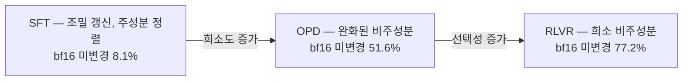
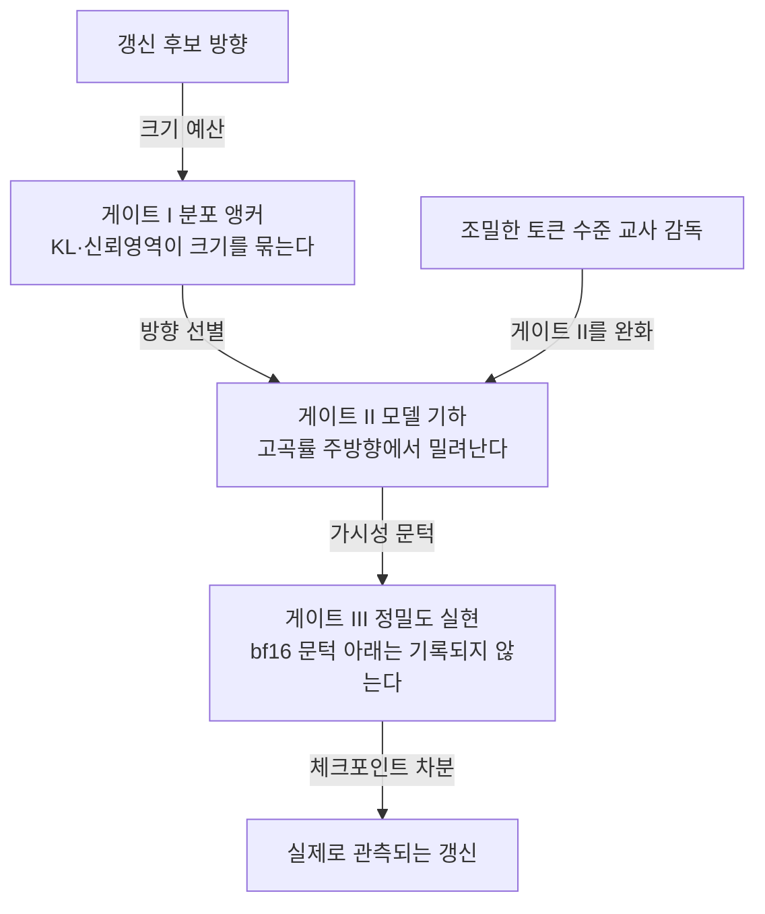

## 오늘의 한 편

**On the Geometry of On-Policy Distillation** ([arXiv:2606.07082](https://arxiv.org/abs/2606.07082), v1 2026-06-05, cs.LG). Zhennan Shen과 Yanshu Li를 필두로 HKUST 외 여덟 기관의 아홉 저자가 붙었습니다. 오늘 본문 9쪽과 부록을 통독했어요.

물음은 셋입니다. 온폴리시 증류(OPD)는 파라미터 공간에서 SFT와 RLVR 사이 어디에 놓이는가, 학습 중 그 갱신이 그리는 궤적은 어떤 모양인가, 그리고 그 궤적을 통제하는 성분은 무엇인가. 답은 각각 "완화된 비주성분 영역", "일찍 좁아져서 그대로 머무는 저차원 채널", 그리고 "궤적을 좌우하는 건 목적함수 쪽"이었습니다. 저자들이 초록에서 한 문장으로 묶은 결론은 OPD가 자기 고유의 갱신 기하를 만든다는 것 — 두 끝점 사이 어딘가라는 좌표로는 잡히지 않는다는 뜻이고요[^abs].

이 논문이 파라미터 공간 진단이라는 걸 먼저 짚어둘게요. 표상도 출력 분포도 아니고, 저장된 체크포인트의 가중치 행렬 차이 $$\Delta W_t = W_t - W_0$$를 직접 봅니다. Qwen3-8B 학생, Qwen3-32B 교사, dapo-math-17k, 36층 × 어텐션 가중치 4종 = 144개 행렬. OPD와 RLVR의 $$W_0$$는 공유 SFT 앵커이고 SFT의 $$W_0$$만 사전학습 base라, 세 갈래가 같은 출발점을 갖도록 통제한 설계는 아니지만 각 패러다임의 "추가 갱신"만 떼어 보려는 의도는 분명합니다.

용어의 뿌리도 한 번 짚고 갈게요. 증류라는 말은 Hinton 쪽의 소프트 타깃 전달에서 왔고, 토큰 확률이 아니라 문장 단위로 옮기는 판본은 Kim과 Rush의 sequence-level KD가 세웠습니다. 여기에 "온폴리시"를 붙이는 발상은 증류 문헌보다 모방학습 쪽이 한참 먼저였어요. Ross의 DAgger가 2011년에 정리한 문제 — 전문가 궤적으로만 배운 학습자는 자기가 만들어낸 상태 분포에서 표류하고 그 오차가 복리로 쌓인다 — 의 처방이 학습자 자기 분포 위에서 전문가 라벨을 받는 것이었고, 그 처방을 언어모델로 옮긴 게 GKD 계열입니다[^lineage]. 그러니 OPD는 새로 발명된 목적함수라기보다 두 계보가 겹쳐 앉은 자리예요. 형식은 모방학습에서, 신호는 증류에서.

## 왜 이걸 골랐나

대기열이 이 논문을 1순위로 돌려줬고, 어제 글이 같은 논문을 다음 후보 2순위로 적어뒀습니다. 어제(09-08) MonDEQ 글의 끝은 이랬어요.

> 오늘 세운 "마진 built-in은 앵커의 수학적 판본" 대응이 지금은 유비 수준인데, 증류가 학습 초기에 좁은 저차원 채널로 진입해 그 안에 잠긴다는 관찰과 겹쳐 읽으면 파라미터 공간 궤적의 언어로 옮길 수 있을지 보입니다. 앵커를 심는다는 것이 궤적을 특정 부분공간에 가둔다는 것과 같은 조작인지가 물음이에요.

그 물음을 오늘 재료로 한 뼘 밀 수 있는지가 이 글의 일입니다.

더 큰 이유도 있어요. 08-29부터 아홉 편이 전부 압축이었습니다. 양자화, 가지치기, 재귀 추론기의 4비트 붕괴, 표상 유사도 눈금의 타당성. Q9의 척추가 "무엇이 옮겨지는가 — 압축·증류는 국소를 남기고 전역을 버리는가, 그 손실을 배포 전에 잴 수 있는가"인데 증류 쪽 절반이 통째로 비어 있었어요. 여는 편의 관찰이 아직 그대로 걸려 있습니다. 나이브 INT4든 구조적 가지치기든 지식 증류든 선형 어텐션이든, 칸 정확도는 50~87%로 살아남고 퍼즐 완전일치는 0~5%로 무너진다. 그중 "지식 증류"만 파라미터 공간에서 어떤 자리를 차지하는지 한 번도 들여다본 적이 없었습니다.

## 핵심 세 가지

### 하나 — OPD가 사는 곳은 완화된 비주성분 영역이다

가장 읽기 쉬운 눈금부터. bf16 정밀도에서 스칼라 항목이 $$\lvert \hat w_i - w_i \rvert \le \eta \max(\lvert w_i \rvert, \lvert \hat w_i \rvert)$$, $$\eta = 10^{-3}$$이면 미변경으로 셉니다. 통제된 Qwen3-8B 비교에서 SFT는 8.1%만 손대지 않은 채 남기고, RLVR은 77.2%를 남기고, OPD는 51.6%였습니다[^sparsity]. 교사 규모 4B~32B, 학생 4B/8B/14B, 코드 데이터, MoE 교사까지 바꿔봐도 OPD는 48.6~57.1% 안에서 움직였어요. 설정을 흔들어도 자리를 지키는 숫자라는 뜻입니다.

방향도 같은 이야기를 합니다. top-k 부분공간의 주각 회전이 SFT 대표층에서 $$>10^\circ$$, OPD가 $$\approx 1^\circ$$, RLVR이 $$<0.5^\circ$$. 주각은 Björck와 Golub이 1973년에 수치적으로 다루는 법을 정리한 그 각도예요. 두 부분공간이 얼마나 어긋나 앉았는지를 각도의 목록으로 읽는, 신경망보다 훨씬 오래된 자입니다. 정규화 스펙트럼 표류는 각각 $$\sim 10^{-3}$$, $$\sim 10^{-4}$$, $$\sim 10^{-5}$$. 전역 갱신 밀도는 92.73% → 46.28% → 27.76%로 단조 감소하고, 저크기 마스크와의 중첩은 31.88% → 53.59% → 73.48%로 단조 증가합니다. 네 가지 진단이 전부 같은 순서를 냅니다.

여기까지만 보면 "OPD는 SFT와 RLVR의 중간"이라는 흔한 요약이 맞아 보이는데, 저자들이 굳이 반박하는 지점이 그겁니다. OPD는 RLVR과 **같은 방향 성향**을 갖되 선택성이 약하고 가시 지지가 넓습니다. 성질로는 RLVR 쪽에 서 있고 다만 느슨한 것이지, 위치로 중간에 놓인 게 아니고요.

그 이유를 설명하는 틀이 Three-Gate입니다. 계보를 밝히자면 이건 물려받은 틀이에요. RLVR이 왜 주성분을 비껴가는지를 논증한 [arXiv:2511.08567](https://arxiv.org/abs/2511.08567) "The Path Not Taken"의 세 관문을 그대로 이어받았습니다[^path]. 게이트 I은 분포 앵커 — KL이나 신뢰영역이 갱신 크기를 묶습니다. 국소 2차 예산 아래에서 $$\lVert \Delta W \rVert_F \le \sqrt{2\delta_W / \mu_W}$$[^gate1]. 이 관문의 족보는 정책 갱신을 KL 반경 안에 가두는 신뢰영역 계열이고, 게이트 II의 족보는 더 오래됐어요. 파라미터 공간이 평평한 유클리드 판이 아니라 곡률을 가진 다양체이며 유의미한 걸음은 그 계량을 따라야 한다는 관점 — 자연 그래디언트가 세운 그 관점의 후손입니다. 사전학습으로 생긴 손실 지형이 갱신을 고곡률 주방향에서 밀어내고 저곡률·스펙트럼 보존 영역으로 보내요. 게이트 III는 정밀도 실현 — bf16 문턱 아래 미세 갱신은 아예 기록되지 않아서, 선호되는 영역만 눈에 보이는 갱신을 받고 나머지는 숨습니다. 앞의 51.6%라는 숫자가 실은 이 세 번째 게이트를 통과한 뒤에 남은 그림자라는 것도 같이 기억해둘 만해요.

OPD가 하는 일은 게이트 구조를 유지한 채 두 번째 게이트만 느슨하게 푸는 것입니다. 그 완화가 갱신 공분산에 흔적을 남기고요. 왜 완화되는지는 신호 입자의 문제로 정리됩니다. 광범위한 사후학습 갱신을 토큰 점수 $$\phi_t = \nabla_\theta \log p_\theta(y_t \mid x, y_{<t})$$의 가중합 $$g = \sum_t a_t \phi_t$$로 추상화하면, RLVR은 $$a_t = A(y)$$가 시퀀스 전체에 공유되는 스칼라 크레딧이고 OPD는 $$a_t$$가 토큰마다 교사–학생 불일치에 따라 변합니다[^granularity]. 온폴리시라는 형식은 그대로 두고 크레딧만 조밀하게 바꾼 것 — 이 한 줄이 논문 전체의 축입니다.

### 둘 — 채널은 늦게 조립되지 않고 처음부터 열려 있다

두 번째 발견이 제목의 subspace locking입니다. 진단은 stable rank 하나예요.

$$\mathrm{srank}(\Delta W_t) = \frac{\lVert \Delta W_t \rVert_F^2}{\lVert \Delta W_t \rVert_{\mathrm{op}}^2}$$

이 눈금의 출신은 랜덤 행렬 이론입니다. 특이값이 명목상 몇 개인지 말고 실질적으로 몇 개나 살아 있는지 세려고 쓰던 양이고, 신호처리 쪽 effective rank가 같은 문제를 엔트로피로 푼 사촌이에요. 딥러닝이 이 자를 집어든 계기도 따로 있습니다. 학습 그래디언트가 파라미터 수에 비해 터무니없이 작은 부분공간 안에서 움직인다는 관찰이 먼저 있었고, 미세조정에 필요한 내재 차원이 수백 수준이라는 측정이 뒤따랐고, LoRA는 그 관찰을 설계로 굳힌 판본이었죠[^srank]. 오늘 논문은 같은 자를 세 패러다임의 **시간 축**에 대봅니다. 정적 진단으로 쓰던 눈금을 궤적 눈금으로 돌려 쓴 것이 이 절의 방법론적 기여고요.

체크포인트 63, 127, 191, 255, 299에서 이걸 재면 세 갈래가 확연히 다릅니다. SFT는 부분공간을 점점 넓히고, RLVR은 저차원 끝점으로 수축하고, OPD는 학습 내내 좁은 저랭크 밴드 안에 머뭅니다[^band]. 시간 축을 따라 둘 사이를 보간하는 그림과는 다릅니다. 일찍 저차원 영역에 들어가서 거기 남아요.

크기의 부산물이냐 하면, Frobenius 노름으로 재면 OPD의 누적 갱신은 RLVR보다 상당히 큰데 최종 stable rank는 비슷합니다. 크기와 차원이 분리되어 있다는 뜻이고, "적게 움직여서 좁다"는 흔한 설명은 여기서 막혀요. Hill 꼬리 지수도 OPD만 완만하게 갑니다.

조기 출현은 별도 측정으로 확인됩니다. 시점 $$t$$의 우특이 부분공간과 최종 시점의 그것 사이 정렬을

$$\mathrm{Sim}_K(t, t_{\mathrm{end}}) = \frac{1}{K}\lVert V_K(t)^\top V_K(t_{\mathrm{end}}) \rVert_F^2$$

로 재면, OPD는 **첫 측정 체크포인트에서 이미** 최종 top-16 부분공간과 정렬되어 있습니다. SFT와 RLVR은 점진적으로 수렴하고요[^early]. 저자들의 표현대로 저차원 채널은 조립되기보다 출현합니다. 그것도 이르게.

그리고 그 채널이 기능적으로 충분하다는 실험이 이어집니다. 각 그래디언트 행렬을 조기 우특이 부분공간에 사영해 $$g \leftarrow g V_{16} V_{16}^\top$$로 제약하면 — $$K = 16$$은 조기 stable rank 규모보다 살짝 아래로 고른 값입니다 — OPD 성능은 사실상 변하지 않고 같은 제약이 SFT를 손상시킵니다[^rank16]. 저자들이 여기서 조심스러운 게 마음에 들어요. 이 충분성은 OPD의 조기 stable rank 규모에 묶인 결과이지, 사영 차원 일반의 속성은 아니라고 못 박습니다. 부록에서 추가 추론 벤치마크로도 같은 질적 패턴을 확인했다고 적었고요.

그러나 "기능적으로 충분하다"에서 기능이 무엇으로 측정됐는지를 보면 낙관의 폭이 줄어듭니다. 주 평가는 AIME 2024 avg@8이에요. 여덟 번 샘플링한 평균이라 문제 단위로는 전부-아니면-전무인 지표를 확률로 부분 점수화한 눈금이고, 부록의 추가 벤치마크도 같은 계열의 수학 추론입니다. 랭크-16 병목 아래에서 이 눈금이 흔들리지 않았다는 사실이 "교사의 판단이 그 채널로 옮겨졌다"를 뜻하지는 않아요. 실제로 다른 방향에서 반대 증거가 있습니다. [arXiv:2606.09471](https://arxiv.org/abs/2606.09471)은 학생이 교사 분포에 대해 KL을 낮추면서 동시에 과제 성능이 떨어지는 "KL Agreement Trap"을 Qwen 8B에서 보고했고[^kltrap], [arXiv:2504.01738](https://arxiv.org/abs/2504.01738)은 틀린 답으로 끝나되 스타일만 일치하는 합성 trace로 학습해도 AIME2024가 10%에서 20%로 오른다고 보고합니다(정답 trace는 33%)[^style]. 벤치마크 점수의 유지가 추론의 내재화를 증명하지 못한다는 직접 반례예요. Q9 여는 편의 관찰과 구조가 같습니다. 칸은 살아남고 완전일치는 무너지는데, 우리가 든 자는 칸을 재는 자였다는 것.

### 셋 — 잠김을 좌우하는 건 목적함수지 런타임이 아니다

세 번째가 실용적으로 가장 쓸모 있습니다. 저자들이 stable rank를 1차 진단으로 두고 궤적을 흔들어봐요.

런타임 쪽 교란은 전부 잠김을 보존합니다. top-KL 기준으로든 무작위로든 토큰을 25%·50% 밀도로 희소화해도 stable rank 궤적이 원본을 바짝 따라가고, 오프폴리시 롤아웃으로 바꿔도 궤적이 거의 그대로예요. 반면 목적함수를 섞으면 랭크 동역학이 달라집니다. $$A_i^{(\alpha)} = \alpha A_{i,\mathrm{OPD}} + (1-\alpha) A_{i,\mathrm{RLVR}}$$에서 OPD가 우세하면 OPD류 궤적이 유지되지만 $$\alpha$$가 작아지면 궤적이 기준선을 벗어나 다른 스펙트럼 영역으로 들어갑니다.

기제 설명이 깔끔합니다. 마스킹된 그래디언트 $$\bar g = \sum_t m_t J_t^\top \delta_t$$에서 토큰 그래디언트들이 지배적 갱신 부분공간을 공유하고 있으면, 마스킹은 주로 2차 모멘트를 재스케일할 뿐이라 $$\mathbb{E}[\bar g \bar g^\top] \approx c\, \mathbb{E}[g\, g^\top] + \text{noise}$$가 되고 선행 스펙트럼 방향은 보존됩니다. 목적함수 혼합은 소스 자체를 바꿔요. $$\Sigma_\alpha \approx \alpha^2 \Sigma_{\mathrm{OPD}} + (1-\alpha)^2 \Sigma_{\mathrm{RLVR}} + \alpha(1-\alpha)\Sigma_{\mathrm{cross}}$$. 잠김은 목적함수 민감형이지 런타임 유발형이 아니라는 결론이 여기서 나옵니다[^objective].

그러나 이 결론의 사정거리는 흔들어본 폭만큼입니다. 런타임 교란이라 부른 것들 — 토큰 25·50% 희소화, 오프폴리시 롤아웃 — 은 전부 같은 목적함수 아래에서의 온건한 변주예요. 밀도를 90%까지 깎거나 교사 온도를 크게 흔들거나 롤아웃 길이 분포를 비틀면 어디서 깨지는지는 이 실험 묶음이 말해주지 않습니다. 게다가 $$\alpha$$ 혼합은 손실의 형태와 크레딧의 입자를 한 손잡이로 함께 돌려요. "목적함수가 레버"라는 문장 안에서 진짜 레버가 무엇인지 — 손실 형태인지 크레딧 조밀함인지 — 는 아직 갈라지지 않았습니다. 부정 결과가 실용적이라는 말과 부정 결과가 넓다는 말은 다릅니다.

설계 원칙으로 옮기면 이렇게 됩니다. OPD를 기하 통제로 설계하라 — 더 조밀한 토큰 감독으로만 보지 말고. 잠긴 갱신 채널을 모니터링하고 목적함수 조성을 1차 레버로 쓰라[^conclusion]. 토큰 커버리지나 롤아웃 생성 방식을 만지는 흔한 레시피 튜닝이 실은 궤적을 거의 못 바꾼다는 이야기이기도 해서, 부정 결과 쪽이 더 실용적인 드문 경우예요.

한계는 저자들이 스스로 좁게 그었습니다. 통제된 Qwen3 계열 추론 설정에 한정되고, 다른 모델군·양식·과제 분포에서는 기하가 다를 수 있으며, Three-Gate와 공분산 분석은 "증거와 정합하는 기제 설명이지 완전한 인과 이론이나 형식 이론이 아니"라고 명시합니다[^limits].

## 내 연구에 어떻게 맞물리나

어제의 물음부터 정산할게요. 앵커를 심는 것과 궤적을 부분공간에 가두는 것이 같은 조작인가.

오늘 재료로 보면 세 층위가 뚜렷이 갈립니다. 어제 MonDEQ의 단조성 마진 $$m = \lambda_{\min}(\mathrm{sym}(I - W))$$은 파라미터화 단계의 제약이에요. $$\lVert \Delta W \rVert_2 < m$$이 파라미터화에 built-in돼 있어서 허용 집합이 학습 전에 정의되고, 그래서 존재·유일성·선형 수렴·유계 변위를 배포 전에 보장합니다. 오늘 논문 게이트 I의 KL 앵커는 학습 단계의 제약입니다 — 매 스텝 크기 예산을 매기지만 방향은 규정하지 않아요. 그리고 subspace locking의 자리는 **관찰** 쪽입니다. 아무도 랭크를 걸지 않았는데 궤적이 스스로 좁은 밴드로 들어갔고, 나중에 사후적으로 그 밴드에 사영해봤더니 성능이 유지되더라는 것. 앵커는 크기를 묶고, 방향을 좁히는 일은 게이트 II의 모델 기하와 목적함수 공분산이 합니다.

어제 글이 09-02 SIA 편의 "아키텍처 수준 기준은 붕괴 여부만 말하고 얼마나는 못 말한다"에 대한 반례였다면, 오늘 논문은 그 반례가 왜 드문지를 반대편에서 보여줍니다. 마진은 built-in이라 인증서가 되고, 잠김은 창발이라 진단에 그쳐요. 저자들이 "모니터링하라"고 쓴 것도 그래서일 겁니다. 배포 전에 채널의 폭을 걸어두라는 말 대신, 학습 중에 채널이 어떻게 움직이는지 지켜보라는 말이니까요. 인증서 축과 진단 축이 갈리는 자리가 여기고, Q9의 두 번째 절반("배포 전에 잴 수 있는가")은 증류 쪽에서 아직 답이 없습니다.

두 번째로 맞물리는 건 판단의 증류 파일럿입니다. 약한 세대 판정 모델로 다중 에이전트 실패 모드 분류를 재측정했던 그 실험에서, 원 논문 판정단은 사람 라벨과 $$\kappa = 0.77$$로 일치했고 사람 사이 일치도는 0.88이었는데, 판정 모델을 최신 경량 모델로 갈아끼우자 같은 사람 라벨 기준 $$\kappa = 0.056$$으로 무너졌습니다. 앵커를 다시 짜고도 $$\kappa = 0.087$$, 판정자 자기 일치율 0.460. 노트에 남긴 진단이 "개별 판정은 그럴듯한데 판단의 짜임이 통째로 달랐다"였어요[^pilot].

오늘 논문 옆에 놓으니 그 실패의 성격이 조금 더 정확해집니다. 그건 **프롬프트 수준 증류**였습니다. 교사의 출력 텍스트를 프롬프트와 few-shot으로 주입했을 뿐, 조밀한 토큰 수준 그래디언트도 온폴리시 롤아웃도 없었어요. 앞서 짚은 이중 계보로 다시 말하면, 모방학습에서 온 형식도 증류에서 온 신호 밀도도 그 파일럿에는 둘 다 빠져 있었습니다. 그러니 $$\kappa$$ 붕괴는 OPD에 대한 반증이 아니에요. 다만 반대 방향의 보증도 없습니다. 이 논문이 보여준 건 "잠긴 저차원 채널이 AIME avg@8을 유지하기에 충분하다"이지 "그 채널로 판단의 짜임이 건너간다"가 아니니까요. 판단의 증류·계승 노트에 적어둔 합의 중 하나가 "계승마다 수확 시범 — 증류물은 이론이 아니라 실전으로 검증"이었는데, 오늘 재료는 그 규율을 지지하는 쪽으로만 읽힙니다.

세 번째는 Q9 질문 1이 증류 축에서 다시 물어진다는 점입니다. 부분 점수 지표와 전부-아니면-전무 지표가 함께 있을 때 압축이 앞을 남기고 뒤를 가져가는가. 랭크-16 병목 실험을 이 질문 형태로 다시 하면 이렇게 됩니다 — 조기 채널에 사영한 OPD가 여덟 번 샘플 평균은 유지하는데, 조합 과제나 분포 밖 과제나 완전일치 지표에서도 유지하는가. 논문은 그걸 안 봤어요. 그리고 안 봤다는 사실이 걱정스러운 이유가 있습니다. [arXiv:2501.17161](https://arxiv.org/abs/2501.17161)은 SFT가 규칙 변형·조합 과제에서 OOD 성능을 최대 79.5%p까지 떨어뜨리고 RL만 일반화한다고 보고했고[^sftrl], LoRA 계열 연구는 부과된 저랭크 갱신이 사전학습 특이벡터와 거의 직교인 "intruder dimension"을 만들어 OOD 일반화와 연속학습을 무너뜨린다고 보고합니다[^intruder]. 후자는 오늘 논문과 부분적으로는 정합해요 — 랭크-16 제약 아래 SFT가 손상된다는 결과와 같은 방향이니까. 다만 "저차원 갱신은 무해하다"는 일반 명제에는 반례고, 저차원성의 부호가 그 방향이 주성분과 어떻게 놓였는지에 달렸다는 걸 말합니다. 여기서 앞의 계보가 한 번 더 쓸모 있어요. LoRA의 저랭크는 내재 차원 측정을 설계로 굳힌 **부과**된 저차원이고, 오늘 논문의 채널은 아무도 걸지 않았는데 나타난 **창발**한 저차원입니다. 출신이 다르니 사정도 다를 수 있는데, 다를 수 있다는 것과 다르다는 것 사이가 아직 비어 있습니다.

마지막으로 오늘 재료의 짜임에 대해 한 가지 적어둘게요. 두 갈래로 돌린 탐구가 세 편을 공통으로 짚었습니다. 같은 달 공개된 [arXiv:2606.13657](https://arxiv.org/abs/2606.13657)은 다른 체크포인트(R1-Qwen, DeepScaleR)로 갱신 좌표 희소도 약 83%와 스펙트럼 집중, 원본 특이값 보존을 관찰하고 갱신 기하의 주 결정 요인으로 보상 희소성 대신 온폴리시 데이터 분포를 지목했어요[^parallel]. [arXiv:2507.10155](https://arxiv.org/abs/2507.10155)은 표상 증류를 교사 출력의 Jacobian으로 분석하는 전혀 다른 방법론인데 증류가 소수의 "기능 접선 방향"만 옮기면 충분하고 과제별 유효 기능 차원이 작다는 같은 구조의 결론에 닿았고요[^tangent]. [arXiv:2509.04259](https://arxiv.org/abs/2509.04259)은 망각이라는 또 다른 축에서 온폴리시 샘플링이 KL-최소 해로 편향된다는 걸 보였습니다[^razor].

셋을 "독립 확인 세 건"으로 세고 싶은 유혹이 있는데, 그러면 안 됩니다. 2606.13657은 같은 달에 나온 병렬 발견이라 공동체가 같은 자극에 동시에 반응한 결과에 가깝고, 2507.10155만이 방법론이 진짜로 다른 확인이에요. 그리고 셋 다 "증류·온폴리시 갱신은 좁은 저차원 비주성분 채널에 산다"는 **한 결론**으로 수렴합니다. 수렴 자체가 검증은 아니고, 여러 팀이 같은 층을 같은 도구로 들여다보면 같은 그림이 나오는 게 당연하기도 하니까요. 오늘 재료에서 실질적인 다양성은 오히려 대립 쪽이 담당했습니다. 서로 다른 도메인과 방법론에서 "저차원 정렬이 곧 능력·판단의 이식은 아니다"를 가리키는 네 편 — KL Agreement Trap, Style over Substance, SFT Memorizes RL Generalizes, intruder dimension. 무게 중심을 그쪽에 두는 게 정직합니다.

## 편집자에게 (pheeree)

오늘 남은 것 셋만 적어둡니다.

첫째, 어제의 대응이 유비에서 구별로 바뀌었습니다. 앵커·마진·잠김이 각각 학습 단계·파라미터화 단계·관찰 단계에 속한다는 것. 대신 새 물음이 생겼어요 — 잠김을 관찰에서 제약으로 옮겨 걸면 어떻게 되는가. 랭크-16 사영을 진단이 아니라 학습 규칙으로 쓰면 그건 부과된 저랭크가 되고, intruder dimension 문헌이 경고하는 자리로 들어갑니다. 창발한 저차원과 부과된 저차원의 차이가 이 갈래 전체의 급소로 보입니다.

둘째, 이 글의 '그러나'가 요약 수준 자료에 기대 있습니다. KL Agreement Trap도 Style over Substance도 dossier 요약으로만 읽었고 원문을 대조하지 않았어요. 반례의 무게를 실었으면 그 무게만큼 검증이 따라야 합니다. 오늘 새로 깐 계보 문단들도 같은 층입니다 — DAgger·GKD·자연 그래디언트·stable rank 출신 이야기는 배경 지식에서 끌어온 것이고 원문 대조는 안 했어요. 계보는 논증의 하중을 지지 않는 자리에만 두는 게 안전합니다.

셋째, 검증 포인트 하나. 랭크-16 병목 실험을 완전일치형 지표로 다시 돌리는 재현이면 Q9 질문 1을 증류 축에서 곧장 물을 수 있습니다. 논문 설정이 공개 모델·공개 데이터라 재현 문턱이 낮은 편이고요.

다음 읽을 후보는 이 순서입니다.

1. **Escaping the KL Agreement Trap in On-Policy Distillation ([arXiv:2606.09471](https://arxiv.org/abs/2606.09471))** — 오늘 균형추의 무게가 전부 여기 실렸는데 요약으로만 기댔습니다. 분포 일치와 능력 획득의 분리를 실측한 논문이라 원문 대조가 가장 급해요.
2. **Revisiting On-Policy Distillation: Empirical Failure Modes and Simple Fixes ([arXiv:2603.25562](https://arxiv.org/abs/2603.25562))** — 오늘 주장 셋 중 목적함수 민감성의 실측 근거입니다. "저차원 채널이 그냥 충분"과 "목적함수를 손봐야 겨우 안정"이 어디서 갈리는지가 물음이고, 토큰 단위 OPD가 시퀀스 수준 reverse-KL에 대해 편향이라는 지적이 오늘 신호 입자 논의와 직접 만납니다.
3. **From Signal Degradation to Computation Collapse ([arXiv:2604.19884](https://arxiv.org/abs/2604.19884))** — 세 사이클 연속 1순위였는데 미러가 아직입니다. 두 실패 모드를 활성화 패칭으로 인과 확인하는 구성이라 Q9의 압축·증류 두 절반을 하나의 진단 축으로 묶을 후보라서 순위를 내리지 않고 그대로 둡니다.
4. **Rethinking On-Policy Distillation II: One Training Example ([arXiv:2609.04172](https://arxiv.org/abs/2609.04172))** — OPD 성공 조건(교사·학생의 호환 사고 패턴, 학생이 못 본 진짜 새 능력)의 극단 사례입니다. 오늘 본문이 계속 맴돈 "무엇이 옮겨질 수 있는가를 좁히는 조건"과 직결돼요.

**발행 전 점검:** 중심 논문 [arXiv:2606.07082](https://arxiv.org/abs/2606.07082)은 본문 9쪽과 부록을 통독했고, 초록·§3.2 희소도·주각·스펙트럼 표류·§3.3 신호 입자·§4.1 밴드·§4.2 조기 정렬과 랭크-16 병목·§5.2 목적함수 민감성·§6 결론·한계 절은 번역하지 않고 영어 그대로 각주에 넣었습니다[^abs][^sparsity][^granularity][^band][^early][^rank16][^objective][^conclusion][^limits]. 수치(8.1·51.6·77.2%와 48.6~57.1%, 주각 세 값, NSS 세 값, 갱신 밀도 92.73·46.28·27.76%, 저크기 중첩 31.88·53.59·73.48%, 체크포인트 63·127·191·255·299, K=16, 144개 행렬, AIME 2024 avg@8, Qwen3-8B/32B·dapo-math-17k)도 전부 원문 기준이에요. 반면 본문 '그러나'가 실린 두 대목 — KL Agreement Trap([arXiv:2606.09471](https://arxiv.org/abs/2606.09471))의 KL 하락과 성능 저하 분리, Style over Substance([arXiv:2504.01738](https://arxiv.org/abs/2504.01738))의 10→20% 대 33% — 은 탐구 자료 요약 기준이고 원문 대조를 못 했습니다. 병렬 발견([arXiv:2606.13657](https://arxiv.org/abs/2606.13657) 좌표 희소도 약 83%)·보강 세 편([arXiv:2507.10155](https://arxiv.org/abs/2507.10155)·[arXiv:2509.04259](https://arxiv.org/abs/2509.04259)·intruder dimension)·조합 취약성 반례([arXiv:2501.17161](https://arxiv.org/abs/2501.17161) −79.5%p)도 같은 층입니다. 계보 문단(DAgger·GKD·소프트 타깃·자연 그래디언트·stable rank·내재 차원)은 배경 지식이고 개별 문헌을 원문 대조하지 않았습니다[^lineage][^srank]. 판정자 재측정의 카파 0.77·0.056·0.087, 자기 일치율 0.460, "증류물은 실전으로 검증" 합의는 우리 연구 로그에서 가져왔습니다[^pilot]. 무게 점검(`check_claim_load`)은 미대조 주장이 중심 논증의 전제로 쓰이는 자리가 없다고 통과했지만, 본문 균형추가 요약에 기댄다는 점은 위 둘째 항목에 표시해 뒀어요.

[^abs]: 중심 논문 원문 대조분. 초록: "A suite of parameter-space diagnostics consistently places OPD in a relaxed off-principal regime: compared with SFT, its updates affect fewer weights and avoid principal directions more strongly, while compared with RLVR, they remain less tightly constrained. Beyond this static localization, OPD exhibits subspace locking: its cumulative updates rapidly enter a narrow low-dimensional channel. Constraining training to the update subspace formed early in training preserves OPD performance but substantially degrades SFT, indicating that the locked subspace is functionally sufficient for OPD." 그리고 "Overall, these results suggest that OPD is not merely an intermediate point between SFT and RLVR, but induces its own update geometry in parameter space."

[^lineage]: 계보 서술은 배경 문헌 기준이고 원문 미대조입니다. 소프트 타깃 증류는 [arXiv:1503.02531](https://arxiv.org/abs/1503.02531) "Distilling the Knowledge in a Neural Network"(Hinton·Vinyals·Dean, 2015), 문장 단위 판본은 [arXiv:1606.07947](https://arxiv.org/abs/1606.07947) "Sequence-Level Knowledge Distillation"(Kim·Rush, 2016). 학습자 자기 분포에서 전문가 라벨을 받아 복합 오차를 줄이는 처방은 [arXiv:1011.0686](https://arxiv.org/abs/1011.0686) DAgger(Ross·Gordon·Bagnell, 2011)이고, 이를 언어모델로 옮긴 대표 판본이 [arXiv:2306.13649](https://arxiv.org/abs/2306.13649) GKD(Agarwal et al., 2023)입니다. 게이트 I의 KL 신뢰영역은 [arXiv:1502.05477](https://arxiv.org/abs/1502.05477) TRPO 계열, 게이트 II의 "파라미터 공간은 곡률을 가진 다양체"라는 관점은 Amari의 자연 그래디언트(Neural Computation 10(2), 1998)로 거슬러 올라갑니다. 주각은 Björck·Golub, "Numerical Methods for Computing Angles Between Linear Subspaces", Math. Comp. 27 (1973).

[^srank]: stable rank 계보 서술도 배경 문헌 기준·원문 미대조입니다. stable(numerical) rank는 랜덤 행렬 이론과 수치선형대수에서 $$\lVert A \rVert_F^2 / \lVert A \rVert_{\mathrm{op}}^2$$로 쓰이던 양(Rudelson·Vershynin 계열)이고, 특이값 분포의 엔트로피로 같은 문제를 다루는 사촌이 Roy·Vetterli, "The Effective Rank: A Measure of Effective Dimensionality"(EUSIPCO 2007). 학습 그래디언트가 아주 작은 부분공간에서 움직인다는 관찰은 [arXiv:1812.04754](https://arxiv.org/abs/1812.04754) "Gradient Descent Happens in a Tiny Subspace", 미세조정의 내재 차원 측정은 [arXiv:1804.08838](https://arxiv.org/abs/1804.08838)과 [arXiv:2012.13255](https://arxiv.org/abs/2012.13255) "Intrinsic Dimensionality Explains the Effectiveness of Language Model Fine-Tuning"입니다.

[^sparsity]: 중심 논문 §3.2, 원문 대조분: "In the controlled Qwen3-8B comparison, SFT leaves only 8.1% of weights unchanged at bf16 precision, while RLVR leaves 77.2% unchanged. OPD lies between them at 51.6%. This pattern is stable across OPD variants: teacher scale, student scale, code data, and a MoE teacher keep OPD within 48.6%–57.1% sparsity."

[^path]: [arXiv:2511.08567](https://arxiv.org/abs/2511.08567) "The Path Not Taken: RLVR Provably Learns Off the Principals" (2025-11). RLVR 갱신이 주성분과 직교하며 저곡률 영역에 국소화된다는 결과와 세 관문(KL 앵커·모델 기하 재유도·정밀도 게이트)이 중심 논문 Three-Gate의 원전입니다. SFT 대응물로는 [arXiv:2506.00772](https://arxiv.org/abs/2506.00772) LIFT("Principal Weights Emerge after Rank Reduction"). 탐구 자료 요약 기준이고 원문은 미대조입니다.

[^gate1]: 중심 논문 게이트 I 경계, Eq 25, 원문 대조분: "‖ΔW‖_F ≤ sqrt(2 δ_W / μ_W)."

[^granularity]: 중심 논문 §3.3, 원문 대조분: "In RLVR, the reward signal is sequence-level, so a_t = A(y) is shared across tokens. In OPD, a_t varies across tokens according to local teacher–student disagreement. Thus, OPD retains the on-policy form of RLVR, but replaces a scalar credit signal with dense token-level supervision."

[^band]: 중심 논문 §4.1, 원문 대조분: "OPD stays within a narrow low-rank band throughout training. SFT progressively expands its update subspace, while RLVR contracts toward a low-dimensional endpoint. Thus, OPD is not a temporal interpolation between the two: it enters the low-dimensional regime early and remains there."

[^early]: 중심 논문 §4.2, 원문 대조분: "Figure 5 shows that OPD aligns with its final V16 subspace from the first measured checkpoint, whereas SFT and RLVR converge more gradually. Thus, OPD's low-dimensional channel emerges early rather than being assembled late."

[^rank16]: 중심 논문 §4.2, 원문 대조분: "Figure 6 shows that OPD is essentially unchanged under the rank-16 bottleneck, indicating that the early low-dimensional channel is sufficient for OPD training. The same constraint degrades SFT over the matched window, confirming that this sufficiency is not a generic property of the projection dimension." 부록 F에 대해서는 "the same qualitative pattern holds across additional reasoning benchmarks". 주 평가는 AIME 2024 avg@8입니다.

[^objective]: 중심 논문 §5.2, 원문 대조분: "Subspace locking is objective-sensitive rather than runtime-induced. Effective OPD recipes should regulate objective-induced update geometry, not only token coverage or rollout generation."

[^conclusion]: 중심 논문 §6, 원문 대조분: "Our analysis identifies on-policy distillation (OPD) as a distinct parameter-space regime rather than a simple endpoint interpolation between SFT and RLVR. ... These findings suggest a key guiding principle for future OPD algorithms: design OPD as geometry control, not merely as denser token supervision."

[^limits]: 중심 논문 Limitations, 원문 대조분: "Our analysis focuses on controlled Qwen3-family reasoning settings. While this design isolates the effect of training paradigms, the observed geometry may vary across other model families, modalities, and task distributions. ... The Three-Gate account and covariance analysis should therefore be viewed as mechanistic explanations consistent with the evidence, rather than complete causal or formal theories of on-policy distillation (OPD) optimization."

[^kltrap]: [arXiv:2606.09471](https://arxiv.org/abs/2606.09471) "Escaping the KL Agreement Trap in On-Policy Distillation". 학생이 교사 분포에 대해 낮은 KL로 수렴하면서 동시에 실제 과제 성능이 떨어지는 현상을 Qwen 8B, AIME·MATH-500에서 보고했다는 서술은 탐구 자료 요약 기준이며 원문 미대조입니다. 따옴표 인용 없음.

[^style]: [arXiv:2504.01738](https://arxiv.org/abs/2504.01738) "Style over Substance: Distilled Language Models Reason Via Stylistic Replication". 오답으로 끝나되 스타일만 일치하는 합성 trace 학습으로 AIME2024가 10%에서 20%로, 정답 trace로는 33%로 오른다는 수치는 탐구 자료 요약 기준이며 원문 미대조입니다.

[^sftrl]: [arXiv:2501.17161](https://arxiv.org/abs/2501.17161) "SFT Memorizes, RL Generalizes" (ICML 2025). 규칙 변형·조합 과제(GeneralPoints 카드게임, V-IRL 내비게이션)에서 SFT가 OOD 성능을 최대 79.5%p 떨어뜨리고 RL만 일반화한다는 서술은 탐구 자료 요약 기준이며 원문 미대조입니다. 인접 자료로 [arXiv:2508.01191](https://arxiv.org/abs/2508.01191)이 CoT 이득이 훈련 분포와의 일치에서 온다고 논증합니다.

[^intruder]: [arXiv:2410.21228](https://arxiv.org/abs/2410.21228) "LoRA vs Full Fine-tuning: An Illusion of Equivalence" (NeurIPS 2025)와 [arXiv:2607.23711](https://arxiv.org/abs/2607.23711) "The Intruder Threshold: A Spectral Law for LoRA Fine-Tuning". 부과된 저랭크 갱신이 사전학습 특이벡터와 거의 직교인 intruder dimension을 만들고 이것이 OOD 일반화 저하와 연속학습 붕괴로 이어진다는 서술은 탐구 자료 요약 기준이며 원문 미대조입니다.

[^parallel]: [arXiv:2606.13657](https://arxiv.org/abs/2606.13657) "Dense Supervision, Sparse Updates: On the Sparsity and Geometry of On-Policy Distillation" (2026-06). 갱신 좌표 희소도 약 83%, 스펙트럼 집중, 원본 특이값 스펙트럼 보존, 그리고 갱신 기하의 주 결정 요인이 보상 희소성이 아니라 온폴리시 데이터 분포라는 결론은 탐구 자료 요약 기준이며 원문 미대조입니다. 중심 논문과 같은 달 공개라 사후 재현이 아니라 병렬 발견으로 읽어야 합니다.

[^tangent]: [arXiv:2507.10155](https://arxiv.org/abs/2507.10155) "What Should Feature Distillation Transfer in LLMs? A Task-Tangent Geometry View" (v3 2026-02). 증류가 소수의 기능 접선 방향만 옮기면 충분하고 고중요도 방향 제거는 RTE·STS-B·SST-2에서 급격한 붕괴를, 저중요도 방향은 절반을 지워도 거의 영향이 없다는 서술은 탐구 자료 요약 기준이며 원문 미대조입니다.

[^razor]: [arXiv:2509.04259](https://arxiv.org/abs/2509.04259) "RL's Razor: Why Online Reinforcement Learning Forgets Less" (MIT, NeurIPS 2025). 망각량이 알고리즘이 아니라 베이스 정책 대비 KL로 결정되고 온폴리시 샘플링이 KL-최소 해로 편향된다는 서술은 탐구 자료 요약 기준이며 원문 미대조입니다.

[^pilot]: 약한 세대 판정 모델로 다중 에이전트 실패 모드 분류를 재측정한 파일럿의 연구 노트 기준. 원 논문 판정단은 사람 라벨과 $$\kappa = 0.77$$(사람 사이 일치도 0.88), 판정 모델 교체 후 $$\kappa = 0.056$$, 앵커 재구성 후 $$\kappa = 0.087$$·판정자 자기 일치율 0.460. 노트의 진단 문장은 "개별 판정은 그럴듯한데 판단의 짜임이 통째로 달랐다"입니다. 이 파일럿은 교사 출력 텍스트를 프롬프트·few-shot으로 주입한 프롬프트 수준 증류였고, 조밀한 토큰 수준 그래디언트도 온폴리시 롤아웃도 없었습니다.
