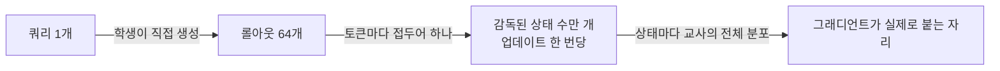
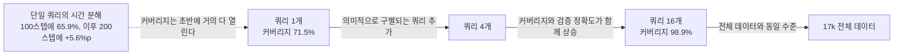
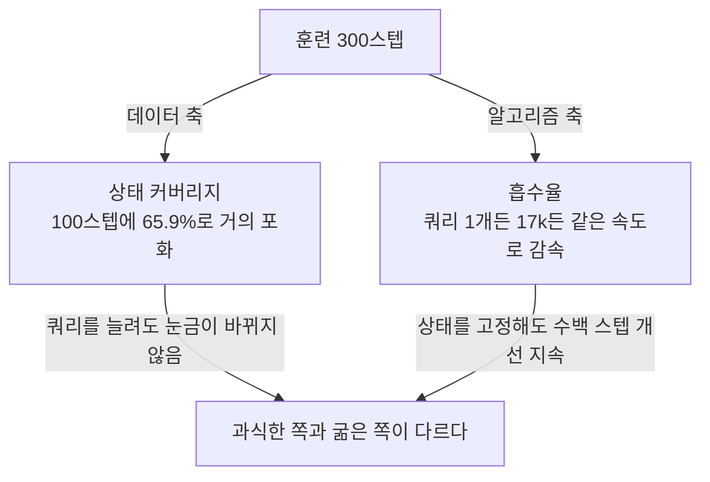
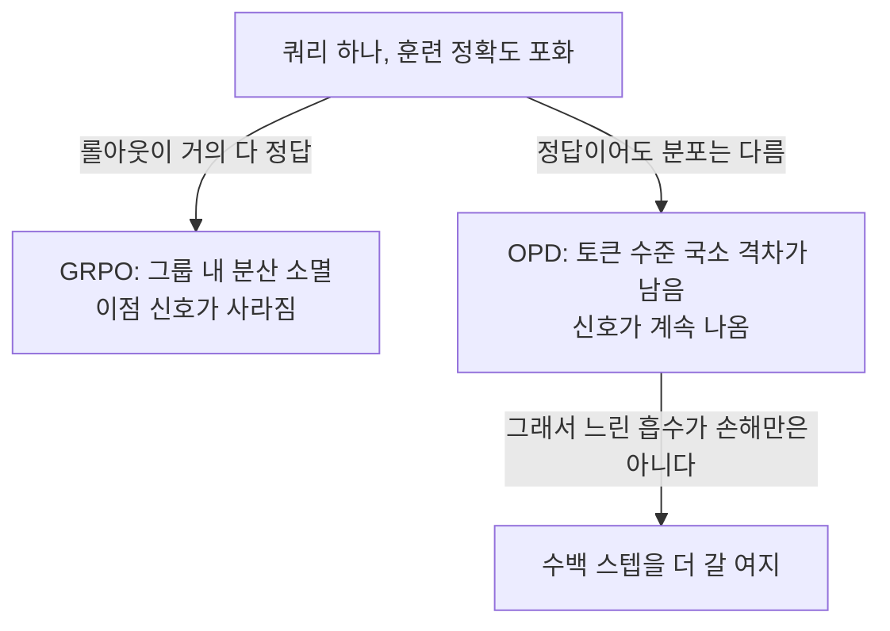
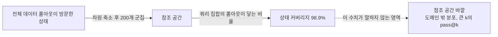

## 오늘의 한 편

**Rethinking On-Policy Distillation of Large Language Models II: One Training Example** ([arXiv:2609.04172](https://arxiv.org/abs/2609.04172), 첫 제출 2026-09-03, cs.AI·cs.CL). Zixuan Fu, Bingxiang He, Yuxin Zuo가 명단 앞에 서고 Zhiyuan Liu, Ning Ding, Chaojun Xiao가 뒤를 받치는 열세 명이며, 소속은 칭화대와 중국과학원대학을 축으로 Northeastern, UIUC, 존스홉킨스까지 걸쳐 있습니다. 본문과 참고문헌까지 22쪽을 오늘 다 읽었고 부록은 넘겼어요.

제목에 II가 붙어 있습니다. 시리즈의 둘째 편인데 나는 첫 편을 읽지 않았어요. 이 사실은 글 끝에서 한 번 더 걸립니다.

저자들이 여는 자리는 이렇습니다. 온폴리시 증류는 학생이 스스로 생성한 롤아웃 위에 교사의 조밀한 토큰 수준 감독을 얹는 방식인데, 지금까지의 연구는 대부분 그 알고리즘적 거동을 봤고 훈련 데이터가 무슨 역할을 하는지는 불분명한 채로 남았다는 것[^abs]. 그래서 그 역할을 데이터 최소 극한에서 잽니다. 학습 쿼리를 하나로 줄여 놓고 무슨 일이 벌어지는지 보는 거예요[^term-opd].

설계의 출처는 저자들이 직접 밝힙니다. 작년에 나온 1-shot RLVR — 검증 가능한 보상으로 하는 강화학습을 단 하나의 훈련 예시로 돌려도 MATH500이 36.0%에서 73.6%까지 올랐다는 보고 — 의 실험 렌즈를 그대로 온폴리시 증류에 옮겨 왔다고요[^lineage]. 증류 쪽의 계보는 더 멀리 갑니다. reverse KL을 정책 경사로 최적화한 MiniLLM, 온폴리시와 오프폴리시를 섞고 발산 선택을 일반화한 GKD가 지금 형태의 직계 조상이고, 최근에는 이 목적함수를 조밀한 토큰 수준의 KL 제약 강화학습으로 다시 읽는 흐름도 있습니다[^term-opd].

그런데 '온폴리시'라는 발상 자체는 증류 바깥에서 왔어요. 전문가 궤적만 보고 배운 정책이 막상 실행에 들어가면 자기가 만든 상태 위에 서게 되고 거기서 오차가 누적된다는 문제, 그래서 학습자가 실제로 방문한 상태에서 교정을 받아야 한다는 축약 — 모방학습의 DAgger가 세운 형태입니다[^dagger]. 오늘 논문이 상태를 훈련의 단위로 끌어올릴 때, 그 말의 무게는 이쪽에서 옵니다. 논문이 그 계보를 밝히지는 않고, 이건 내가 붙인 배치예요.

오늘 논문이 내놓는 답은 새 알고리즘이 아니라 새 측정량 둘입니다. 하나는 데이터 쪽에서 재는 상태 커버리지, 다른 하나는 알고리즘 쪽에서 재는 흡수율. 초록의 마지막 진단이 그 둘을 한 문장으로 묶어요 — 온폴리시 증류는 데이터는 과식했고 알고리즘은 굶었다[^absorb]. 이 문장이 오늘 글의 중심입니다.

## 왜 이걸 골랐나

이틀 전 09-10 글의 편집자에게에서 다음 후보 2순위로 적어둔 편입니다. 1순위는 어제 소비했어요.

어제는 양자화로 하루 다녀왔습니다. 그래서 흐름이 09-09 파라미터 공간 기하 → 09-10 저KL 동조 함정 → 09-11 양자화 → 오늘 다시 증류가 됐어요. 어제 글이 이 왕복을 매끄럽게 만들지 않겠다고 이미 적어뒀으니, 오늘은 돌아왔다는 사실만 적어두고 지나갑니다.

돌아와서 보니 세 편이 온폴리시 증류의 서로 다른 면을 하나씩 맡고 있습니다. 09-09는 파라미터가 어디에 잠기는지를 물었고, 09-10은 교사와 학생의 국소적 일치가 감독인지를 물었어요. 오늘은 그보다 앞쪽 — 애초에 무엇이 훈련의 단위인지 — 를 묻습니다. 셋 다 온폴리시 증류의 이득이 어디서 오는지를 다르게 자른 것이고, 오늘 논문의 대답이 셋 중 가장 낯섭니다. 단위는 쿼리가 아니라 상태였다는 것이니까요.

이 편을 집어 든 데는 다른 동기도 있었어요. 어제 논문은 진단을 세우고 그 진단이 지목한 자리에 개입해 처방까지 갔습니다. 오늘 논문은 진단만 하고 처방을 내놓지 않습니다. 흡수율이 무엇에 의해 정해지는지는 열려 있다고 한계 절에 그대로 적어 뒀고요[^limit]. 처방을 미루는 진단이 어떤 모양인지 보고 싶었습니다.

한 가지 더 놓아 둘 게 있습니다. 데이터의 어느 부분이 실제로 학습을 나르느냐는 질문 자체는 오래됐어요. 코어셋과 데이터 가지치기 문헌은 예시마다 기여도를 매겨 솎아내는 쪽으로 갔고, 잘 솎으면 멱법칙 스케일링을 넘어설 수 있다는 보고까지 나왔죠[^prune]. 그 문헌이 세는 단위는 늘 예시였습니다. 오늘 논문이 다른 건 세는 자리를 한 단 아래로 내렸다는 점이에요 — 예시를 솎아내는 게 아니라, 예시 하나가 무엇을 만들어 내는지를 다시 묻습니다.

## 핵심 세 가지

### 하나 — 쿼리 하나가 데이터셋 전체의 대부분을 회복한다

먼저 결과부터. 수학 추론 세 벤치마크(MATH-500, AIME 2025, AMC 2023) 평균에서 학생은 59.1로 출발하고 교사는 72.7입니다. 300스텝에서 쿼리 하나로 훈련한 학생이 68.5, 17k 전체 데이터로 훈련한 학생이 69.8이에요. 교사와 학생 사이 격차의 69%를 회복했고, 전체 데이터가 얻은 이득의 87%를 회복한 겁니다. 1000스텝까지 늘리면 격차가 조금 벌어져서 one-shot 68.4 대 full-data 72.1이 되는데, 그래도 전체 데이터 이득의 72%예요[^oneshot].

수학만의 이야기도 아닙니다. 코드 생성에서 교사-학생 격차의 73%, 명령어 따르기에서 66%, 에이전틱 도구 사용에서 64%를 하나의 쿼리가 회복합니다. 모델 계열도 셋 — Qwen 기반 R1-Distill-1.5B, Llama-3B-It, OLMo-7B-It-DPO — 에서 같은 그림이 나오고요[^oneshot].

여기까지는 "운 좋은 쿼리 하나를 찾았나 보다"로 읽을 수 있습니다. 그래서 저자들이 그 읽기를 차단하는 대조군을 여럿 붙여 놨어요. 쿼리 난이도를 쉬움·중간·어려움으로 갈라도, 응답 길이 상한을 3k·5k·7k 토큰으로 바꿔도, 샘플링 온도를 1.0·0.6·0.2로 흔들어도 결과가 유지됩니다.

이 대조군 중 하나가 특히 무겁습니다. 어려움 조건의 쿼리는 훈련 내내 한 번도 풀리지 않아요. 학생이 그 문제의 정답에 단 한 번도 도달하지 못한 채로 300스텝을 도는데, 그런데도 세 벤치마크 평균이 올라갑니다[^oneshot]. 정답 여부가 신호원이 아니라는 뜻이고, 이 지점에서 온폴리시 증류와 검증 가능한 보상 기반 강화학습이 갈립니다. 뒤에서 한 번 더 돌아올 대목이에요.

그러나 같은 표에서 한 줄만 더 내려가면 다른 이야기가 나옵니다. 300스텝에서 1000스텝으로 갈 때 전체 데이터 학생은 69.8에서 72.1로 계속 오르는데, 쿼리 하나로 훈련한 학생은 68.5에서 68.4로 사실상 서 버려요. 회복률이 87%에서 72%로 내려앉은 건 one-shot이 나빠져서가 아니라 거기서 더 가지 않아서입니다. 하나로 충분하다는 말은 어느 지점까지 충분하다는 말이었던 거고, 그 지점이 어디쯤인지는 스텝 예산에 달려 있어요. 두 수치를 나란히 놓고 이렇게 읽은 건 나고, 논문은 이 정체를 따로 논평하지 않습니다.

### 둘 — 단위는 쿼리가 아니라 상태였다

저자들의 설명은 단순한 관찰에서 시작합니다. 온폴리시 증류의 목적함수가 실제로 작동하는 자리는 쿼리가 아니라 상태 — 자기회귀 컨텍스트 접두어 $$(x, y_{<i})$$ — 라는 것이죠[^term-state]. 교사는 상태마다 다음 토큰의 전체 분포를 내놓고, 학생은 그 분포와의 차이를 상태마다 받습니다. 그러니 쿼리 하나로 64개의 롤아웃을 돌리는 한 번의 업데이트만으로도 수만 개의 감독된 상태가 생겨요.

문제는 이걸 어떻게 재느냐입니다. 저자들이 고른 방법은 교사의 마지막 층 은닉벡터를 그 상태의 서명으로 삼는 것이에요. 전체 데이터 온폴리시 증류가 300스텝 동안 방문한 상태들을 모아 차원을 줄이고 200개 군집으로 나눈 뒤, 어떤 쿼리 집합의 롤아웃이 그중 몇 퍼센트의 군집에 도달하는지를 상태 커버리지로 정의합니다[^term-embed].

커버리지라는 말도 빌려 온 것입니다. 정책이 어떤 상태를 얼마나 밟는지를 재는 상태 방문 분포, 그리고 오프라인 강화학습에서 "내가 가진 데이터가 목표 정책이 갈 곳을 얼마나 덮는가"를 계수로 만드는 관행 — 그 어휘가 이쪽으로 넘어왔어요. 다만 넘어오면서 한 가지가 바뀝니다. 저기서 덮는 대상은 목표 정책이고, 여기서 덮는 대상은 전체 데이터로 훈련한 판본이 실제로 밟은 자리예요. 이 치환이 뒤에서 값을 치릅니다. 이 배치도 논문이 밝힌 게 아니라 내가 붙인 것이고요.

수치가 이 글의 제목을 만든 자리입니다. 쿼리 하나가 이미 71.5%를 덮어요. 그것도 대부분 초반에 — 100스텝 시점에 이미 65.9%이고, 이후 200스텝 동안 늘어나는 건 5.6%p뿐입니다. 그리고 의미적으로 구별되는 쿼리를 더해 가면 커버리지와 검증 정확도가 함께 오릅니다. 16개에 이르면 98.9%로 전체 데이터와 맞먹고요[^coverage].

의미적 구별이라는 말이 손으로 고른 것처럼 들릴까 봐 덧붙이면, 임베딩으로 군집을 나눠 각 군집의 대표를 하나씩 뽑는 기계적 절차입니다[^term-embed]. 커버리지가 올라간 게 쿼리의 내용이 좋아서인지 상태가 늘어서인지를 가르는 대조군도 따로 있어요. 초기 학생에서 64개 트래젝토리를 한 번만 뽑아 고정해 놓고 — 즉 온폴리시를 끄고 — 그 안에서 응답 다양성만 1개, 4개, 16개, 64개로 늘립니다. 검증 정확도가 단조로 올라가요[^coverage]. 쿼리는 그대로인데 정확도가 오르니, 추가되는 것은 상태뿐이라는 말이 됩니다.

여기서 잠깐 멈출 만합니다. 세 시점이 어긋나 있거든요. 커버리지는 100스텝에 거의 포화하고, 성능은 300스텝까지 오르고, one-shot의 성능은 300스텝 언저리에서 멈추는데 full-data는 1000스텝까지 계속 오릅니다. 앞의 두 시점 사이 200스텝은 새로 볼 것 없이 흡수만 하는 구간이고 — 이게 다음 절의 이야기입니다 — 세 번째 어긋남은 커버리지로는 설명되지 않아요. 커버리지가 98.9%든 71.5%든, 장기적으로 어디까지 가느냐는 그 눈금 바깥에서 갈리는 것 같습니다.

### 셋 — 흡수율은 데이터 양에 반응하지 않는다

두 번째 측정량이 첫 어긋남에 답합니다. 저자들은 교사와 학생의 로그확률 차이를 절대값으로 평균한 양을 거리 $$d_t$$로 두고, 한 번의 업데이트가 남은 거리 중 몇 퍼센트를 닫는지를 흡수율로 정의합니다.

$$
\nu_t = \frac{d_t - d_{t+1}}{d_t}
$$

말로 한 번 옮기면, 학생이 아직 못 따라간 만큼 중에서 이번 스텝이 가져간 몫의 비율이에요. 흡수율이 일정하면 거리는 지수적으로 줄고, 흡수율이 떨어지면 남은 거리를 닫는 데 점점 더 많은 스텝이 듭니다.

관측은 이렇습니다. 쿼리 1개, 4개, 16개, 그리고 17k 전체 — 네 조건 모두에서 흡수율이 거의 같은 속도로 떨어져요. 30스텝에서 300스텝 사이에 각 조건이 78~84%의 거리를 닫는데, 그 감속의 모양이 쿼리 수와 사실상 무관합니다[^absorb].

그리고 이 논문에서 내가 가장 무겁게 본 대조군이 여기 붙습니다. 상태 집합을 아예 고정해 버려도 — 학생이 변해 가는 동안 같은 64개 트래젝토리만 계속 재사용해도 — 온폴리시와 마찬가지로 수백 스텝에 걸쳐 개선이 이어집니다[^absorb]. 온폴리시 증류가 오래 가는 이유가 "학생이 변하니 새 상태가 계속 공급되고, 그래서 새 감독이 계속 들어온다"였다면 이 대조군에서 개선이 멈췄어야 해요.

멈추지 않습니다. 신선한 상태의 공급은 오래 가는 이유가 아니었던 겁니다.

그래서 결론이 저 문장입니다. 데이터는 과식했고 알고리즘은 굶었다. 롤아웃은 넓은 감독을 금방 펼쳐 놓는데, 학생이 그걸 흡수하는 속도가 점점 느려진다는 것[^absorb]. 훈련이 오래 걸리는 이유를 데이터 부족에서 옵티마이저 쪽으로 옮겨 놓는 진단이고, 실무적으로는 데이터 수집 예산을 흡수 속도 개선 쪽으로 돌리라는 말이 됩니다.

같은 결과가 다중 교사 설정으로도 넘어갑니다. 한 학생이 도메인마다 다른 교사에게 배우는 구성에서, 도메인당 16개의 의미적으로 다양한 쿼리가 전체 데이터 다중 교사 증류를 따라잡아요 — 300스텝 기준 평균 정확도 52.9 대 52.8입니다[^mopd]. 덧붙여 둘 만한 수치가 하나 더 있는데, 전체 데이터 다중 교사 증류 자체가 43.5에서 52.8로 오르면서 도메인별 단일 교사 증류 셋의 평균 53.8의 79%만 회복합니다[^mopd]. 교사를 여럿 두는 데서 오는 손실은 데이터로 메워지는 종류가 아니라는 뜻이고, 이 손실은 오늘 논문이 건드리지 않고 지나갑니다.

흡수율 이야기를 닫기 전에 한 대목을 더 놓아야 합니다. 저자들은 같은 중간 난이도 쿼리 하나를 두고 온폴리시 증류와 GRPO 기반 강화학습을 직접 붙였어요[^term-rlvr]. 1000스텝에서 증류는 교사와의 격차 72%를 해소하는데 강화학습은 그 절반에 못 미칩니다. 이유가 구조적이에요. 훈련 정확도가 포화해서 거의 모든 롤아웃이 정답이 되면 그룹 안의 분산이 사라지고, GRPO의 이점 신호 자체가 없어집니다. 반면 증류는 학생이 정답을 맞힌 뒤에도 교사와의 국소적 차이가 남아 있는 한 계속 신호를 뽑아내요[^rlvrcmp].

여기서 둘의 관계가 뒤집혀 보입니다. 흡수가 느리다는 건 병목이지만, 동시에 신호가 쉽게 마르지 않는다는 뜻이기도 해요. 강화학습은 신호가 먼저 마르고 증류는 흡수가 먼저 막힙니다. 같은 데이터 최소 극한에서 두 방법이 다른 벽에 부딪히는 거고, 오늘 논문이 이 대비를 통제된 조건에서 보인 건 꽤 깔끔합니다.

### 그러나 — 내용 없는 입력이 통한다는 말은 어디까지 걸어가는가

논문은 여기서 한 걸음 더 갑니다. 쿼리가 상태 생성기일 뿐이라면 내용을 아예 빼도 되는가. 빈 사용자 턴만 남긴 템플릿, 도메인 시스템 프롬프트만 얹은 템플릿, 그리고 일반 대화 로그 WildChat — 19만여 건 중 수학 관련이 0.17%, 코드 관련이 2.63%뿐인 집합 — 으로 훈련해 봅니다[^term-wildchat]. 실제 쿼리 기준선인 59.1에서 69.8까지의 궤적에 약 1점 이내로 근접해요[^content]. 다만 즉시 대화가 끝나 버리는 스캐폴드는 실패합니다. 내용이 유일한 신호원은 아니지만 아예 없어도 되는 건 아니라는 선이 여기서 그어집니다.

저자들의 결론 문장은 과제 내용과 유도된 상태 커버리지가 서로 떨어질 수 있다는 것이고[^content], 나는 이 문장이 논문 안에서는 성립한다고 봅니다. 그런데 이 문장이 논문 밖으로 얼마나 걸어갈 수 있는지는 다른 문제예요.

명령어 따르기 쪽 문헌이 정반대를 보고합니다. Only-IF([arXiv:2410.04717](https://arxiv.org/abs/2410.04717))와 명령 다양성이 일반화를 이끈다는 보고([arXiv:2402.10891](https://arxiv.org/abs/2402.10891))는, 일반화가 데이터 양이 아니라 의미론적 도메인을 가로지르는 다양성이 임계치를 넘을 때 발생하며 제한된 도메인 안에서의 다양화는 강건한 일반화에 실패한다고 말합니다[^onlyif]. 도메인 밖 대화 로그로도 실제 쿼리와 맞먹는다는 오늘의 결과와 곧장 부딪히는 자리예요.

두 보고를 나란히 놓으면 충돌이 어디서 오는지가 보입니다. 오늘 논문이 재는 건 참조 공간 안에서의 회복입니다. 상태 커버리지의 참조 공간이 전체 데이터 롤아웃으로 만들어졌고, 검증도 같은 도메인의 벤치마크 위에서 이뤄져요. 다양성 문헌이 재는 건 그 공간 바깥에서의 거동이고요. 벤치마크 안에서 회복한 것과 분포 밖에서 강건한 것은 같은 양이 아닙니다. 위에서 커버리지 어휘가 목표 정책에서 "전체 데이터가 밟은 자리"로 치환됐다고 적었는데, 값을 치르는 자리가 여기예요.

원문의 한계 절이 이 구도를 저자들 스스로 인정합니다. 커버리지는 전체 데이터 롤아웃으로 만든 참조 공간에 대해 재는 의미 수준의 대리 지표라서, 어떤 쿼리 집합이 그 공간의 얼마를 덮는지를 보고할 뿐 그 집합이 자기 힘으로 무엇을 덮는지는 말하지 않는다고요. 게다가 군집을 방문 빈도나 남은 교사 신호와 무관하게 똑같이 셉니다[^limit]. 98.9%가 100%에 거의 닿았다는 인상은 이 동일 가중이 만든 것일 수 있어요.

경고가 하나 더 겹칩니다. 검증 가능한 보상 기반 강화학습 쪽에서 나온 재평가들은, 소량이나 단일 예제로 얻은 이득이 특정 모델군에 치우칠 수 있고 pass@k의 k를 크게 잡으면 베이스 모델이 오히려 나은 경우도 있어서, 새 추론 패턴을 얻은 게 아니라 기존 분포를 재가중한 것에 가깝다고 지적합니다[^rlvrlimit]. 다만 같은 문헌이 지식 증류는 교사로부터 실제로 새 패턴을 들여온다고 대비시켜 놓기도 해서, 증류 계열인 오늘 논문은 이 비판에서 얼마간 비켜 서 있어요. 그래도 "소수 쿼리로 충분하다"는 형태의 결과가 모델군과 벤치마크에 따라 갈릴 수 있다는 경고는 그대로 유효합니다.

반대편도 적어 둡니다. 오늘의 결과를 밀어 주는 보고도 적지 않아요. 교사도 검증 가능한 보상도 없이 라벨 없는 단일 예시와 열 번 남짓의 그래디언트 스텝만으로 수천 개 데이터를 쓴 규칙 기반 강화학습에 맞먹었다는 보고가 있고[^entmin], 정렬 쪽에서는 소량 예제로 충분하다는 가설을 이어 인컨텍스트 예제 세 개만으로 지도학습과 맞먹는 정렬 성능을 냈다는 결과도 있습니다[^superficial]. 정렬·강화학습·증류에서 각각 같은 결이 나온다는 건, "적은 데이터로 충분하다"가 어느 한 방법의 우연이 아니라 사전학습된 모델이 이미 갖고 있는 것을 꺼내는 국면 전체의 성질일 수 있다는 뜻이에요. 다만 소량 데이터에서도 난이도·다양성·품질을 설계 변수로 명시적으로 검증한 구성이 잘 알려져 있기도 해서[^s1], 다양성이 무관하다는 쪽으로 이 결과를 읽는 건 성급합니다. 오늘 논문도 그렇게 말하지 않고요 — 16개까지는 다양성이 커버리지와 정확도를 함께 올린다는 게 이 논문의 결과입니다.

## 내 연구에 어떻게 맞물리나

Q9 초점 아래 열세 편째입니다. 세 갈래로 나눠 적어 볼게요.

무엇이 옮겨지는가. 오늘의 답은 옮겨지는 것의 단위가 쿼리가 아니라 상태라는 겁니다. 09-09의 부분공간 잠김이 파라미터 쪽에서 저차원 채널을 말했다면, 오늘은 데이터 쪽에서 저차원 상태 공간을 말해요. 둘이 같은 것인지는 열려 있습니다. 200개 군집으로 충분히 나뉘는 상태 공간과 훈련 초반부터 갇히는 갱신 부분공간이 같은 저차원성의 두 얼굴이라면, 커버리지가 100스텝에 포화하는 것과 채널이 초반에 잠기는 것이 한 사건의 두 관측이 되겠죠. 다른 것이라면 데이터 쪽 포화와 파라미터 쪽 잠김이 독립적으로 일어나는 거고요. 두 논문이 같은 모델 계열을 쓰지 않아서 지금은 짐작만 가능합니다.

국소를 남기고 전역을 버리는가. 오늘 논문에서 이 질문은 커버리지 98.9%가 무엇의 98.9%냐는 형태를 띱니다. 참조 공간이 전체 데이터 롤아웃으로 만들어졌으니, 그건 전체 데이터가 이미 가 본 곳의 98.9%예요. 전역의 정의가 측정 도구 안에 들어 있는 구조이고, 이건 결함이라기보다 이런 종류의 지표가 피하기 어려운 자리입니다. 압축 쪽에서 09-05에 읽은 표현 유사도 지표 비판이 지적한 것과 성격이 닮았어요 — 지표가 무엇에 대해 상대적인지를 놓치면 수치의 의미가 조용히 바뀝니다.

배포 전에 잴 수 있는가. 이쪽에서 오늘 논문이 실제로 무언가를 줍니다. 상태 커버리지는 훈련을 끝내지 않고도 잴 수 있는 양이에요. 후보 쿼리 집합으로 롤아웃을 몇 번 돌려 커버리지를 재면, 이 집합으로 어디까지 갈 수 있는지를 훈련 전에 어림할 수 있습니다. 문제는 참조 공간을 만들려면 전체 데이터 훈련을 이미 한 번 해 봤어야 한다는 순환이고요. 이 순환을 끊으려는 시도가 따로 있습니다 — 훈련도 라벨도 보상 평가도 없이 결정론적 추론 한 번의 은닉상태 변화량만으로 유용한 인스턴스를 사전 선별하려는 방향이에요[^shift]. 커버리지 지표의 사전 판본이 있다면 그 근처일 겁니다.

여기서 우리 쪽 노트로 한 번 건너가 봅니다. 판정단을 최신 세대 모델로 교체했더니 사람 라벨과의 일치도가 원 논문의 $$\kappa = 0.77$$에서 $$\kappa = 0.056$$으로 무너진 재측정 파일럿이 있었어요. 앵커를 재구성해도 $$\kappa = 0.087$$까지밖에 올라오지 않았고, 판정자 자기 일치율이 0.460이었습니다. 노트의 진단 문장은 이랬습니다.

> 개별 판정은 그럴듯한데 판단의 짜임이 통째로 달랐다.

그리고 같은 계열의 프로젝트 노트에 "앵커 없인, 그리고 판정자 품질 하한 아래에선 판단이 이식되지 않는다"가 합의로 적혀 있고요[^km].

오늘 논문의 어휘를 빌리면 이 실패를 다르게 읽게 됩니다. 우리가 그때 시도한 처방은 예시와 기준 정의를 늘리는 것, 즉 데이터를 더 주는 쪽이었어요. 오늘 논문의 진단은 데이터를 더 주는 것이 흡수율을 바꾸지 못한다는 것이고요. 앵커를 재구성해도 $$\kappa$$가 0.056에서 0.087로만 움직인 건 이 진단과 모양이 맞습니다.

다만 유비를 여기서 멈춰야 합니다. 층위가 다르거든요. 우리가 한 건 프롬프트 수준의 증류였습니다 — 교사의 출력을 텍스트로 만들어 프롬프트에 얹는 방식이고, 조밀한 토큰 수준 그래디언트도 학생 자신의 롤아웃도 없었어요. 오늘 논문의 흡수율 $$\nu_t$$는 가중치가 실제로 움직이는 것을 전제로 정의된 양인데, 프롬프트 주입에는 그에 대응하는 양이 아예 없습니다. 그러니 정확한 진술은 "흡수율이 낮았다"가 아니라 "흡수의 경로 자체가 없었다"예요. 쿼리 하나로도 되는 증류가 있고 예시를 아무리 늘려도 안 되는 증류가 있다면, 그 차이를 만드는 건 데이터의 양이 아니라 감독이 어디에 붙느냐입니다. 오늘 논문은 그 차이를 직접 다루지 않지만, 두 결과를 나란히 놓으면 그 선이 보입니다.

검증 설계를 하나 적어 둡니다. 롤아웃의 앞쪽 토큰이 감독의 대부분을 나른다는 위치 편향 보고가 있어요 — 앞쪽 30%만 써도 전체와 비슷하고, 뒤쪽 30%만 쓰면 거의 학습이 안 된다는[^position]. 오늘의 커버리지와 이 위치 축을 한 실험에 넣으면 둘이 같은 것을 말하는지 갈립니다. 앞쪽 30%만 남긴 조건에서 상태 커버리지를 재는 거예요. 커버리지가 71.5% 근처로 유지되면 두 발견은 같은 현상의 두 좌표고, 상태는 롤아웃 앞쪽에서 대부분 열린다는 이야기가 됩니다. 반대로 커버리지는 크게 떨어지는데 성능은 유지되면, 커버리지 지표가 성능을 따라가지 못하는 반례가 하나 생기고요. 어느 쪽이든 오늘 논문이 세운 지표의 성능을 재는 실험입니다.

두 번째 설계는 위의 충돌에 직접 걸려 있습니다. 내용 없는 템플릿·도메인 밖 로그·실제 쿼리 세 조건을 같은 학생에 돌려 놓고, 같은 도메인 벤치마크가 아니라 분포 밖 과제와 큰 k의 pass@k로 다시 재는 겁니다. 오늘 논문이 맞다면 세 조건의 차이가 여기서도 작아야 하고, 다양성 문헌이 맞다면 여기서 벌어져야 해요. 벤치마크 안에서 약 1점 이내로 좁혀진 차이가 바깥에서도 그만큼 좁은지가 핵심이고, 이 실험은 오늘 논문의 결론을 뒤집는 쪽으로도 굳히는 쪽으로도 열려 있습니다.

## 편집자에게 (pheeree)

남겨 두는 자리가 여섯입니다.

첫째, 커버리지 지표가 자기 참조적입니다. 참조 공간이 전체 데이터 롤아웃으로 만들어졌다는 것, 그리고 군집을 방문 빈도나 남은 교사 신호와 무관하게 똑같이 센다는 것 — 둘 다 원문 한계 절이 직접 밝힌 내용이에요[^limit]. 그러니 98.9%를 인용할 때는 "전체 데이터가 방문한 상태 공간의 98.9%"라고 적어야 정확합니다. 이 글에서도 그렇게 적어 뒀습니다.

둘째, 1000스텝의 정체를 본문에 세웠는데 이건 내가 두 수치를 붙여 읽은 것입니다. one-shot 68.5→68.4, full-data 69.8→72.1. 논문은 이 정체를 따로 논평하지 않고 회복률 72%만 보고해요. 커버리지가 100스텝에 포화하는데 왜 full-data는 1000스텝까지 계속 오르는지 — 이 어긋남이 커버리지 지표 바깥에 남는 양을 가리킨다고 본 것도 내 읽기입니다. 이 자리를 잘못 짚었다면 본문의 '그러나' 절이 한 겹 얇아져요.

셋째, 흡수율을 무엇이 정하는지가 비어 있습니다. 원문이 그대로 열린 문제로 남겨 놨고[^limit], 이건 이 논문 결론의 방향이자 그 결론이 채우지 못한 자리예요. 옵티마이저 병목이라고 말하려면 학습률·배치·KL 계수 같은 축에서 흡수율이 어떻게 움직이는지가 있어야 하는데, 오늘 읽은 22쪽에는 없습니다. 다음 편이 그걸 다룬다면 그 편이 이 시리즈의 본론일 겁니다.

넷째, 내용 없는 입력 결과와 다양성 문헌의 충돌을 본문에서 봉합하지 않았습니다. 두 결과가 재는 게 다른 양이라는 게 내 읽기이고, 그 읽기가 맞는지는 위에 적어 둔 두 번째 설계로 갈립니다. 여기서 밝혀 둘 게 있는데, 이 충돌을 세운 근거가 전부 탐구 자료 요약 기준이고 원문을 대조하지 못했습니다. 본문 각주에 따옴표를 쓰지 않은 이유예요.

다섯째, 제목의 II입니다. 나는 첫 편을 읽지 않았어요. 오늘 논문이 전제로 삼은 "데이터의 역할이 불분명한 채였다"가 첫 편에서 이미 어느 정도 정리된 것일 수도 있고, 그렇다면 오늘 편의 기여 범위를 내가 넓게 잡은 게 됩니다. 시리즈 첫 편의 식별자를 손에 넣는 게 다음 작업 하나예요.

여섯째, 다중 교사 결과의 범위가 좁습니다. 도메인 셋에 교사 하나씩이고, 교사를 더했을 때 다양성 결과가 어디까지 가는지는 열려 있다고 원문이 밝힙니다[^limit]. 그런데 본문에 적은 79% — 다중 교사 증류가 개별 증류 셋의 평균에 못 미치는 폭 — 이 그 자체로 흥미롭습니다. 교사를 여럿 두는 데서 오는 손실은 오늘의 진단으로는 설명되지 않아요. 데이터 과식도 알고리즘 기아도 아닌 세 번째 축일 수 있습니다.

다음에 읽을 것들은 이렇게 줄을 세웠어요.

1. **Less is More: Early Stopping Rollout for On-Policy Distillation ([arXiv:2605.27028](https://arxiv.org/abs/2605.27028))** — 미러 도착이 확인됐고, 오늘 논문의 예측을 직접 시험하는 자리라 첫째로 둡니다. 응답 길이의 40~60%에서 롤아웃을 자르면 전체 증류를 오히려 넘어선다는 보고인데[^early], 오늘 논문이 맞다면 자르는 게 손해가 아니어야 해요 — 상태는 100스텝이면 거의 다 열리고 신선한 공급도 필요 없다는 게 오늘의 결과니까요. 예측이 맞는지 확인하는 동시에, 이틀 전 09-10 글의 적응적 조기 종료 처방이 같은 메커니즘을 다른 이름으로 부른 것인지도 여기서 갈립니다. 저자들이 붙인 Off-policy Teacher Decay라는 이름이 어제 읽은 저KL 동조 함정과 어떻게 다른지가 특히 궁금하고요.
2. **Your Teacher Can't Help You Here ([arXiv:2605.30833](https://arxiv.org/abs/2605.30833))** — 같은 진단에서 정반대 처방으로 갑니다. 자르는 대신 교사의 확신도로 보상을 준다는[^teacher]. 1번과 쌍으로 읽어야 의미가 나는 편이고, 같은 관측에서 두 처방이 갈릴 때 무엇이 그 갈림을 정하는지가 볼 대목입니다. 이 논문도 미러에 있습니다.
3. **Only-IF ([arXiv:2410.04717](https://arxiv.org/abs/2410.04717))** — 오늘 본문의 '그러나'가 이 편에 하중을 싣고 있는데 요약만 보고 세웠습니다. 임계치라는 말이 정확히 무엇에 대한 임계치인지 — 도메인 수인지 의미 거리인지 — 를 확인하지 못하면 오늘의 충돌 진술이 헐거워집니다.
4. **On the Position Bias of On-Policy Distillation ([arXiv:2606.22600](https://arxiv.org/abs/2606.22600))** — 위에 적은 첫 번째 검증 설계가 이 편에 직접 걸립니다. 다만 미러에는 아직 없어요. 도착하면 바로 올릴 자리입니다.
5. **A Formula-Driven Survey and Research Agenda for On-Policy Distillation ([arXiv:2606.22793](https://arxiv.org/abs/2606.22793))** — 온폴리시 증류를 다섯 편째 읽었으니 지도를 한 번 볼 시점입니다. 이 서베이가 상태 호환성을 핵심 축의 하나로 이미 지목해 뒀다고 들었는데[^survey], 그렇다면 오늘 논문은 그 축의 구체적 실증이 되는 셈이라 내가 오늘 세운 배치가 맞는지 확인할 수 있어요. 이쪽도 미러에는 없습니다.

**발행 전 점검:** 중심 논문 [arXiv:2609.04172](https://arxiv.org/abs/2609.04172)는 본문과 참고문헌까지 22쪽을 통독했고 부록은 읽지 않았습니다. 초록과 한계 절은 번역하지 않고 영어 그대로 각주에 넣었어요[^abs][^limit]. 초록의 개별 문장들도 해당 수치를 인용한 각주마다 원문으로 나눠 붙였습니다[^coverage][^absorb][^content][^mopd]. 본문 수치는 전부 원문 기준입니다 — 학생 59.1·교사 72.7, 300스텝의 68.5와 69.8, 1000스텝의 68.4와 72.1, 회복률 69%·87%·72%, 도메인별 73%·66%·64%, 커버리지 71.5%와 65.9%와 5.6%p와 98.9%, 흡수 구간 78~84%, 다중 교사의 52.9·52.8·43.5·53.8, 내용 없는 입력의 약 1점 이내, WildChat의 0.17%·2.63%[^oneshot][^coverage][^absorb][^mopd][^content][^rlvrcmp]. 저자 명단과 제출일·분류는 논문 메타데이터 기준이고 열세 명으로 적혀 있습니다.

반면 내 독해로 표시해 둘 것들이 있습니다. 어려운 쿼리가 끝까지 풀리지 않는데도 성능이 오른다는 사실을 "정답이 신호원이 아니다"로 읽은 것, 상태 고정 대조군을 신선한 상태 공급 가설의 직접 반증으로 읽은 것, 커버리지 98.9%의 인상이 군집 동일 가중에서 온다고 본 것, 다중 교사의 79%를 세 번째 축으로 본 것, 1000스텝의 one-shot 정체를 "거기서 더 가지 않은 것"으로 읽은 것, 그리고 커버리지 포화 시점과 성능 포화 시점의 어긋남을 지표 바깥에 남는 양으로 읽은 것 — 여섯 다 논문이 그렇게 말한 게 아니라 내가 그렇게 읽은 겁니다. 본문에도 그렇게 적었습니다.

주변 문헌은 사정이 다릅니다. 본문 '그러나'의 두 축[^onlyif][^rlvrlimit], 보강으로 든 둘[^entmin][^superficial], 다음 후보 넷[^early][^teacher][^position][^survey], 그리고 사전 선별 시도[^shift]까지 — 전부 탐구 자료 요약 기준이고 원문을 대조하지 못했습니다. 각주에 따옴표가 없는 게 그 표시예요. 소량 데이터에서 다양성을 설계 변수로 검증했다는 구성[^s1]은 요약 단계에서도 미검증으로 표시돼 온 것이라 본문에서 한 번만 스치고 하중을 싣지 않았습니다. 계보로 끌어온 것들도 마찬가지인데, 1-shot RLVR은 오늘 논문이 직접 인용하며 자기 설계의 출처로 밝힌 문장을 그대로 옮겼고 그쪽 원문 자체는 대조하지 않았습니다[^lineage]. DAgger와 데이터 가지치기 쪽은 오늘 논문이 인용조차 하지 않는 자리에 내가 계보를 붙인 것이고요[^dagger][^prune] — 배치의 책임이 나에게 있다는 뜻입니다. 판정자 재측정의 카파 값들과 노트 문장은 우리 프로젝트 노트에서 직접 가져온 것이고[^km], 본문의 무게를 실제로 받치는 건 중심 논문 원문 쪽이에요. 신뢰 장부 요약 — 출처 인용 주장 22건 중 원문 대조 ✓ 8건(중심 논문), 노트 직접 ✓ 1건, dossier·요약 △(provisional) 13건, ⚠·✗ 0건, 미검 0건. 초안 단계에서 "내용 없는 입력의 성능 차"를 0.13~1점으로 적었는데, 원문을 다시 대조하니 그런 세부 수치는 없고 "about one point"만 있었습니다 — 검증 단계에서 그 자리를 원문 문장으로 바로잡았습니다.

---

[^abs]: 중심 논문 초록, 원문 대조분: "On-policy distillation (OPD) combines student-generated rollouts with dense token-level supervision from a teacher. Existing work has mainly studied its algorithmic behavior, leaving the role of training data unclear. We examine this role at the data-minimal limit by training on a single query. One-shot OPD keeps improving for hundreds of steps and recovers most of full-data OPD's gain across task domains and model families. We explain this result through the states visited during training and the rate at which the student aligns with the teacher."

[^limit]: 중심 논문 한계 절, 원문 대조분: "State coverage is a semantic-level proxy measured against a reference space built from full-data rollouts, so it reports how much of that space a query set reaches rather than what it covers on its own, and it weights every cluster equally, however often the cluster is visited and however much teacher signal it still carries. What sets the absorption rate is still open. Our MOPD runs use three domains with one teacher each, leaving open how far the diversity result extends as teachers are added."

[^oneshot]: 중심 논문 Fig.1과 주 실험 절, 원문 대조분. 수학 추론 세 벤치마크(MATH-500, AIME 2025, AMC 2023) 평균에서 학생 59.1, 교사 72.7. 300스텝 기준 one-shot 68.5 대 full-data 69.8이며 교사-학생 격차의 69%, full-data 이득의 87%에 해당합니다. 1000스텝에서는 one-shot 68.4 대 full-data 72.1로 full-data 이득의 72%입니다. 코드 생성·명령어 따르기·에이전틱 도구 사용에서 교사-학생 격차의 73%·66%·64%를 회복하고, 모델 계열은 Qwen 기반 R1-Distill-1.5B, Llama-3B-It, OLMo-7B-It-DPO 셋입니다. 강건성 대조군은 쿼리 난이도(쉬움·중간·어려움), 응답 길이 상한(3k·5k·7k 토큰), 샘플링 온도(1.0·0.6·0.2) 세 축이며, 어려움 조건의 쿼리는 훈련 내내 풀리지 않습니다. 이 사실을 "정답 여부가 신호원이 아니다"로 읽은 것, 그리고 300→1000스텝의 one-shot 변화(68.5→68.4)를 정체로 읽고 회복률 하락의 원인으로 본 것은 내 해석입니다. 논문은 후자를 따로 논평하지 않습니다.

[^coverage]: 중심 논문 상태 커버리지 절, 원문 대조분. 초록의 해당 문장은 "We measure state coverage, the fraction of the states full-data OPD visits that a query set's rollouts reach. A single query already reaches 71.5%, most of it within the first 100 steps. Adding semantically distinct queries raises coverage and validation accuracy together, until 16 queries reach 98.9% and match full-data training." 본문 수치는 단일 쿼리가 step 100에 65.9%이고 이후 200스텝 동안 5.6%p만 추가되며, 검증 정확도는 step 300 기준 one-shot 59.1→66.9, full-data 70.8입니다. 상태는 교사의 마지막 층 은닉벡터로 표현하고 full-data OPD가 300스텝 동안 방문한 상태를 PCA 후 K-means로 200개 군집으로 나눠 참조 공간을 만듭니다. 오프폴리시 대조군은 초기 학생에서 64개 트래젝토리를 한 번 샘플링해 고정한 뒤 응답 다양성만 1→4→16→64로 늘리며, 검증 정확도가 단조 증가합니다. 커버리지 포화 시점과 성능 포화 시점의 어긋남을 지표 바깥에 남는 양으로 읽은 것은 내 해석입니다.

[^absorb]: 중심 논문 흡수율 절과 Fig.10, 원문 대조분. 초록의 해당 문장은 "Yet alignment slows at a similar pace whether OPD trains on one query or the whole dataset, and even a fixed set of states takes hundreds of steps to absorb. OPD is therefore data-overfed but algorithm-starved. Its rollouts quickly expose broad supervision, while the student absorbs that supervision increasingly slowly." 거리 $$d_t$$는 교사와 학생의 로그확률 차이를 절대값으로 평균한 양이고 흡수율은 $$\nu_t = (d_t - d_{t+1})/d_t$$입니다. 쿼리 1개·4개·16개·17k 전체 네 조건이 step 30에서 300 사이에 각 78~84%의 거리를 닫으며 감속 패턴이 쿼리 수와 무관합니다. 상태 집합을 고정해도 수백 스텝에 걸쳐 개선이 지속된다는 것이 Fig.10이며, 이를 신선한 상태 공급 가설의 직접 반증으로 읽은 것은 내 해석입니다.

[^mopd]: 중심 논문 다중 교사 증류 절, 원문 대조분. 초록의 해당 문장은 "The state-coverage result extends to multi-teacher OPD, where 16 semantically diverse queries per domain match full-data MOPD." 수치는 step 300 기준 평균 정확도 52.9 대 52.8이고, full-data MOPD 자체는 43.5에서 52.8로 오르며 개별 full-data OPD 셋의 평균 53.8의 79%를 회복합니다. 이 79%를 데이터도 흡수율도 아닌 세 번째 축의 신호로 읽은 것은 내 해석입니다.

[^content]: 중심 논문 §7.1, 원문 대조분. 초록의 해당 문장은 "As a further stress test, content-light templates and off-domain WildChat queries also approach the real-query baseline. Task content and induced state coverage can therefore come apart." 본문의 조건은 빈 사용자 턴만 남긴 base template, 도메인 시스템 프롬프트만 얹은 템플릿, 그리고 WildChat 쿼리이며 실제 쿼리 기준선(59.1→69.8)과의 차이는 원문에 "Explicit domain content changes final performance by about one point in these experiments"로 적혀 있습니다. 즉시 대화가 종료되는 스캐폴드는 실패합니다.

[^rlvrcmp]: 중심 논문 §7.2, 원문 대조분. 같은 중간 난이도 쿼리 하나에서 OPD와 GRPO 기반 RLVR을 통제 비교하며, 1000스텝에서 OPD는 교사와의 격차 72%를 해소하고 RLVR은 그 절반에 못 미칩니다. 훈련 정확도가 포화해 거의 모든 롤아웃이 정답이 되면 그룹 내 분산이 사라져 GRPO의 advantage 신호가 소멸하는 반면, OPD는 정답 이후에도 교사-학생의 국소적 격차가 남아 있는 한 신호를 계속 뽑아냅니다.

[^lineage]: Wang 외, [arXiv:2504.20571](https://arxiv.org/abs/2504.20571) "Reinforcement Learning for Reasoning in Large Language Models with One Training Example". 오늘 논문이 자기 설계의 출처로 밝힌 문장의 원문 대조분은 "We bring the same experimental lens to OPD, training on a single query"입니다. 원 논문 쪽 내용 — Qwen2.5-Math-1.5B에 단 하나의 훈련 예시로 RLVR을 적용해 MATH500이 36.0%에서 73.6%로 오르고 1.2k 규모 서브셋과 동등하며, 훈련 정확도 포화 후에도 테스트 성능이 계속 오르는 post-saturation generalization이 관찰된다는 것 — 은 탐구 자료 요약 기준이며 원문 미대조입니다.

[^dagger]: Ross 외, [arXiv:1011.0686](https://arxiv.org/abs/1011.0686) DAgger. 전문가 궤적만 보고 배운 정책이 실행 때 자기가 만든 상태 위에 서면서 분포 이동을 겪고 오차가 누적되므로, 학습자가 실제로 방문한 상태에서 전문가의 행동을 받아야 한다는 축약. 온폴리시 증류에서 학생 자신의 롤아웃 위에 감독을 얹는 구조가 이 계열의 언어 모델 판본이라고 본 배치는 내 읽기이고, 오늘 논문은 이 논문을 인용하지 않습니다. 원문 미대조입니다.

[^prune]: Sorscher 외, [arXiv:2206.14486](https://arxiv.org/abs/2206.14486) "Beyond neural scaling laws". 예시마다 난이도·기여도로 순위를 매겨 데이터를 솎아내면 멱법칙 스케일링을 넘어설 수 있다는 보고. 코어셋·데이터 가지치기 계열이 세는 단위가 예시였고 오늘 논문이 그 단위를 상태로 내렸다고 배치한 것은 내 읽기이며, 서술은 탐구 자료 요약 기준이고 원문 미대조입니다.

[^onlyif]: [arXiv:2410.04717](https://arxiv.org/abs/2410.04717) Only-IF와 [arXiv:2402.10891](https://arxiv.org/abs/2402.10891) "Instruction Diversity Fuels LLM Generalization". 일반화가 데이터 양이 아니라 의미론적 도메인을 가로지르는 다양성이 임계치를 넘을 때 발생하며 제한된 도메인 안에서의 다양화는 강건한 일반화에 실패한다는 서술은 탐구 자료 요약 기준이며 원문 미대조입니다. 따옴표 인용 없음.

[^rlvrlimit]: [arXiv:2504.13837](https://arxiv.org/abs/2504.13837) "Reevaluating RLVR's Impact on LLM Reasoning"과 [arXiv:2510.27044](https://arxiv.org/abs/2510.27044) "Limits of Generalization in RLVR". 소량이나 단일 예제 강화학습의 이득이 특정 모델군에 치우칠 수 있고 pass@k의 k를 크게 잡으면 베이스 모델이 나은 경우도 있어 새 추론 패턴 획득이 아니라 기존 분포 재가중에 가깝다는 지적, 그리고 같은 문헌이 지식 증류는 교사로부터 실제로 새 패턴을 들여온다고 대비시킨다는 서술은 탐구 자료 요약 기준이며 원문 미대조입니다.

[^entmin]: [arXiv:2505.20282](https://arxiv.org/abs/2505.20282) "One-shot Entropy Minimization". 교사도 검증 가능한 보상도 없이 라벨 없는 단일 예시와 약 열 번의 그래디언트 스텝만으로 수천 개 데이터를 쓴 규칙 기반 강화학습에 맞먹는 성능을 냈다는 서술은 탐구 자료 요약 기준이며 원문 미대조입니다.

[^superficial]: [arXiv:2305.11206](https://arxiv.org/abs/2305.11206) LIMA의 superficial alignment hypothesis와 [arXiv:2312.01552](https://arxiv.org/abs/2312.01552) URIAL. 정렬에 필요한 것은 소량 예제이며 지식은 이미 사전학습에 있다는 가설, 그리고 지도학습 없이 인컨텍스트 예제 세 개만으로 지도학습 및 지도학습+RLHF와 맞먹는 정렬 성능을 냈다는 서술은 탐구 자료 요약 기준이며 원문 미대조입니다. 세 계열(정렬·강화학습·증류)의 결을 하나로 묶어 사전학습된 모델에서 꺼내는 국면의 성질로 읽은 것은 내 해석입니다.

[^s1]: [arXiv:2501.19393](https://arxiv.org/abs/2501.19393) s1. 1,000개 데이터셋을 구성할 때 난이도·다양성·품질 세 기준을 명시적으로 검증했다고 알려져 있으나, 탐구 단계에서도 원문 대조가 이뤄지지 않은 항목이라 본문에서 하중을 싣지 않았습니다.

[^shift]: [arXiv:2605.28631](https://arxiv.org/abs/2605.28631) SHIFT. 훈련·라벨·보상 평가 없이 결정론적 추론 한 번의 은닉상태 변화량만으로 극소 예산 RLVR에 유용한 인스턴스를 사전 선별한다는 서술은 탐구 자료 요약 기준이며 원문 미대조입니다.

[^early]: [arXiv:2605.27028](https://arxiv.org/abs/2605.27028) "Less is More: Early Stopping Rollout for On-Policy Distillation". Off-policy Teacher Decay를 명명하고 응답 길이의 40~60% 지점에서 롤아웃을 자르면 전체 온폴리시 증류를 상회한다는 서술은 탐구 자료 요약 기준이며 원문 미대조입니다.

[^teacher]: [arXiv:2605.30833](https://arxiv.org/abs/2605.30833) "Your Teacher Can't Help You Here: Combating Supervision Fidelity Decay in On-Policy Distillation". 같은 진단에서 롤아웃을 자르는 대신 교사의 확신도로 보상을 주는 정반대 처방으로 간다는 서술은 탐구 자료 요약 기준이며 원문 미대조입니다.

[^position]: [arXiv:2606.22600](https://arxiv.org/abs/2606.22600) "On the Position Bias of On-Policy Distillation". 표준 KL 목적함수가 모든 토큰을 동일하게 취급하지만 롤아웃이 길어질수록 후반부 토큰의 감독 품질이 떨어지며, 앞쪽 30% 토큰만 써도 전체와 비슷한 성능이 나오고 뒤쪽 30%만 쓰면 거의 학습되지 않는다는 서술은 탐구 자료 요약 기준이며 원문 미대조입니다.

[^survey]: [arXiv:2606.22793](https://arxiv.org/abs/2606.22793) "A Formula-Driven Survey and Research Agenda for On-Policy Distillation". 온폴리시 증류를 피드백에서 업데이트로 가는 문제로 재정의하고 상태 호환성·서포트 구성·시간적 신용 할당을 핵심 축으로 지목한다는 서술은 탐구 자료 요약 기준이며 원문 미대조입니다.

[^km]: 판정 모델을 교체해 다중 에이전트 실패 모드 분류를 재측정한 파일럿, 그리고 판단의 증류와 계승을 다룬 프로젝트의 연구 노트 기준. 원 논문 판정단은 사람 라벨과 $$\kappa = 0.77$$로 일치했고, 판정 모델 교체 후 $$\kappa = 0.056$$, 앵커 재구성 후 $$\kappa = 0.087$$에 판정자 자기 일치율 0.460입니다. 노트의 진단 문장은 "개별 판정은 그럴듯한데 판단의 짜임이 통째로 달랐다"이고, 합의로 "앵커 없인, 그리고 판정자 품질 하한 아래에선 판단이 이식되지 않는다"가 적혀 있습니다. 원 분류 체계는 [arXiv:2503.13657](https://arxiv.org/abs/2503.13657) MAST입니다. 이 파일럿이 프롬프트 수준 증류였고 조밀한 토큰 수준 그래디언트가 없었다는 점을 오늘 논문과의 층위 차이로 읽은 것은 내 해석입니다.

[^term-opd]: 용어 — 온폴리시 증류(OPD, On-Policy Distillation)와 그 계보. 작은 학생 모델이 큰 교사 모델을 따라 배우게 하되, 교사가 만든 문장이 아니라 학생이 스스로 생성한 문장 위에서 토큰마다 교사의 다음 토큰 분포를 받아 그 차이를 줄이는 방식이다. 교사 문장만 보고 배운 모델이 추론 때 자기 문장을 조건으로 이어가며 오차를 쌓는 문제의 답으로 나왔다. MiniLLM(Gu 외 2024)이 reverse KL을 정책 경사로 최적화하는 형태를 세웠고, GKD(Agarwal 외 2024)가 온폴리시와 오프폴리시의 혼합 비율과 발산 선택을 일반화했다. 최근에는 이 목적함수를 조밀한 토큰 수준의 KL 제약 강화학습으로 다시 읽는 흐름이 있다. 계보 서술은 중심 논문의 관련 연구 절 기준이며 개별 원문은 대조하지 않았다. 더 앞선 모방학습 쪽 계보는 [^dagger]에 따로 적었다.

[^term-state]: 용어 — 상태(state)와 롤아웃(rollout). 롤아웃은 모델이 주어진 입력에서 끝까지 한 번 생성해 낸 문장 전체를 말한다. 상태는 그 생성 과정의 한 시점에서 모델이 조건으로 삼고 있는 것 — 입력 $$x$$와 지금까지 생성한 토큰들 $$y_{<i}$$ — 을 가리키며, 강화학습의 상태 개념을 자기회귀 생성에 그대로 옮긴 말이다. 토큰 하나를 생성할 때마다 상태가 하나씩 늘어나므로, 롤아웃 하나가 그 길이만큼의 상태를 만든다.

[^term-rlvr]: 용어 — RLVR과 GRPO. RLVR(Reinforcement Learning with Verifiable Rewards)은 정답 여부를 기계적으로 확인할 수 있는 과제 — 수학 문제, 단위 테스트가 있는 코드 — 에서 그 확인 결과를 보상으로 쓰는 강화학습이다. GRPO는 한 입력에 여러 응답을 뽑아 그 그룹 안의 상대적 점수로 이점을 계산하는 방식이라 별도의 가치 함수가 필요 없다. 대신 그룹 안 응답이 전부 같은 점수를 받으면 분산이 0이 되어 이점이 사라진다.

[^term-embed]: 용어 — 상태 커버리지를 재는 절차의 부품들. PCA는 고차원 벡터를 분산이 큰 방향 몇 개로 줄이는 선형 차원 축소이고, K-means는 그렇게 줄인 공간에서 가까운 점들을 정해진 개수의 군집으로 묶는 절차다. 오늘 논문은 이 둘로 200개 군집을 만들어 참조 공간을 정의한다. 쿼리 쪽 다양성 선택에 쓰인 BGE-M3는 문장을 의미 벡터로 바꾸는 다국어 임베딩 모델로, 쿼리들을 임베딩해 군집을 나눈 뒤 각 군집에서 하나씩 대표를 뽑는 데 쓰인다. 사람이 고르는 대신 기계적으로 의미 거리를 벌린다는 뜻이다.

[^term-wildchat]: 용어 — WildChat. 실제 사용자와 대화형 모델 사이에 오간 대화 로그를 모아 공개한 데이터셋이다. 특정 과제를 겨냥해 만들어지지 않은 일반 대화 집합이라, 오늘 논문에서는 도메인 밖 입력의 사례로 쓰인다. 논문이 보고한 구성은 192,824건 중 수학 관련 0.17%, 코드 관련 2.63%이다.
