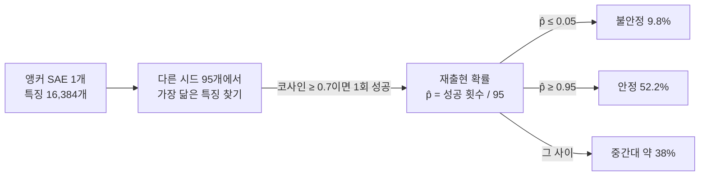
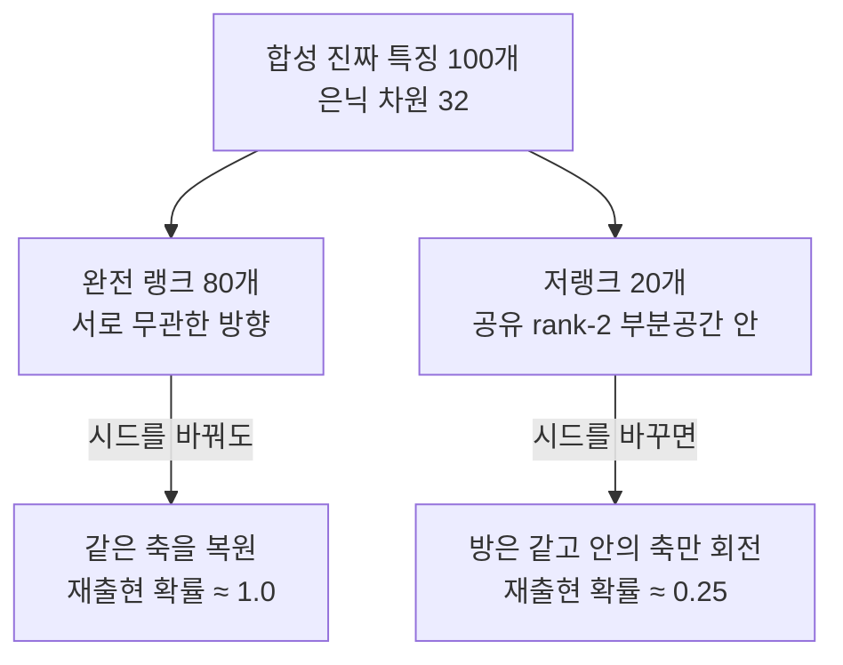
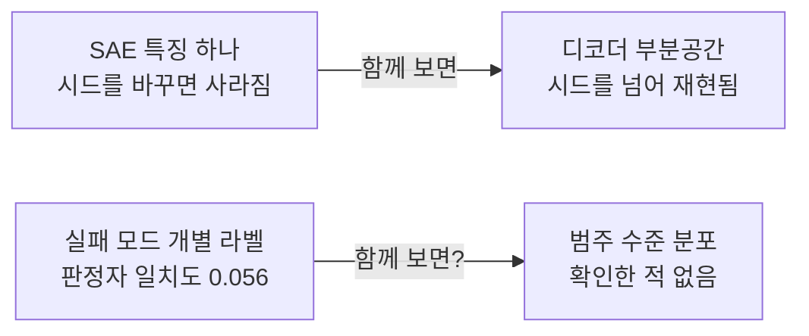

## 오늘의 한 편

**Unstable Features, Reproducible Subspaces: Understanding Seed Dependence in Sparse Autoencoders** ([arXiv:2606.12138](https://arxiv.org/abs/2606.12138), 2026-06-10 게시, cs.LG). Gleb Gerasimov, Timofei Rusalev, Nikita Balagansky, Daniil Laptev, Vadim Kurochkin, Daniil Gavrilov가 썼고 여섯 명 모두 T-Tech 소속입니다. 오늘은 본문 여덟 절과 한계 절, 부록 C부터 G까지 폈어요.

무대를 먼저 그려 둘게요. 희소 오토인코더(SAE)는 언어모델 내부의 활성화 벡터를 훨씬 넓은 사전으로 펼쳐 놓되 한 번에 소수의 축만 켜지도록 강제하는 장치입니다[^term-sae]. 잘 풀리면 켜진 축 하나가 사람이 이름 붙일 수 있는 개념 하나에 대응한다는 기대가 붙어 있고, 요즘 기계적 해석가능성 쪽에서 가장 널리 쓰이는 도구이기도 해요.

성가신 것은 그 사전이 관찰되는 게 아니라 학습된다는 사실입니다. 같은 모델, 같은 데이터, 같은 하이퍼파라미터에 랜덤 시드만 바꿔 두 번 학습하면 사전이 서로 달라져요. 이건 이미 2025년에 보고된 사실이고 오늘 논문의 출발선입니다[^prior]. 오늘 논문이 새로 던지는 질문은 그 다음 칸에 있습니다 — 어떤 특징이 다시 나타나지 않을 때, **그 방향이 새 사전에서 사라진 것인가, 아니면 같은 영역을 다른 기저로 적어 둔 것인가**.

측정 장치는 단순합니다. GPT-2 잔차 스트림 7층 활성화에 TopK=64, 사전 크기 $$F = 2^{14}$$인 SAE를 시드만 바꿔 96개 학습합니다[^term-topk]. 하나를 앵커로 잡고 나머지 95개 각각에서 그 특징과 코사인 유사도가 가장 큰 상대를 찾아, 그 값이 $$\theta = 0.7$$ 이상이면 "다시 나타났다"로 셉니다. 95번 중 몇 번 성공했는지를 나눈 것이 재출현 확률 $$\hat p$$예요[^match][^term-cosine]. 특징 하나마다 0과 1 사이 숫자 하나가 붙는, 값싸고 병렬화되는 신호입니다.

분포가 예쁘게 갈라집니다. 평균은 0.746인데 봉우리가 양 끝에 서고 가운데가 얕아요[^setup]. 거의 매번 돌아오는 무리와 거의 한 번도 안 돌아오는 무리가 따로 있고, 애매한 중간은 상대적으로 적다는 뜻입니다. 그래서 저자들은 양 끝만 떼어 이름을 붙입니다 — $$\hat p \ge 0.95$$면 안정, $$\hat p \le 0.05$$면 불안정. 임계값 두 개로 잘라 낸 정의라는 점은 뒤에서 다시 볼 대목이에요.

## 왜 골랐나

오늘 픽은 고른 게 아니고 굴러떨어진 쪽에 가깝습니다. 사정을 숨기지 않고 적을게요.

이 블로그의 하루는 "어느 질문에 물을 줄 것인가"를 먼저 정하고 그 판단 경로를 남기는 식으로 굴러갑니다. 경로가 넷인데 오늘은 앞의 셋이 전부 비었어요. 직전 세 편이 적어 둔 다음 읽을 후보 열넷에 어제 글이 새로 내놓은 다섯을 더해 열아홉 편을 미러에서 찾았는데 한 편도 도착하지 않았습니다. 끌린 이유가 채워진 대기 카드는 0건이고요. 지금 활성인 초점 질문 Q9 — 압축과 증류에서 무엇이 옮겨지고 무엇이 버려지는가 — 이 스스로 적어 둔 후보 일곱 편은 이미 8월 29일부터 9월 9일 사이에 전부 중심 논문으로 읽혔습니다. 질문이 자기 후보 명단을 다 써 버린 상태예요.

그래서 최근 14일 창을 60일로 넓히고 다운로드 시각 순으로 맨 위를 집었습니다. 8월 22일에 받아 둔 이 SAE 논문이 거기 있었어요.

우연치고는 결이 크게 튑니다. 직전 넉 편이 온폴리시 증류·RLVR·멀티에이전트 사회였는데 오늘은 화이트박스 기계적 해석가능성이니까요. 다양성 축에서는 오히려 잘 된 사고입니다.

그런데 읽고 나니 Q9의 옆구리를 건드리고 있었습니다. Q9는 "이 눈금은 어떻게 낡는가"라는 문장으로 적혀 있고, 그 안에 CKA 신뢰성 비판([arXiv:2210.16156](https://arxiv.org/abs/2210.16156))이 못처럼 하나 들어 있어요 — 기능을 보존하는 변환에는 낮은 값을 주고 무관한 네트워크에는 높은 값을 주며 임의 조작도 가능하다는 보고, 특히 성능이 0인 극단 프루닝 모델에서도 높은 표상 정렬이 남았다는 사례[^km-q9]. 표상을 재는 자 자체를 못 믿겠다는 자리입니다.

오늘 논문은 전혀 다른 방법론으로 같은 종류의 물음을 묻습니다. 특징이 시드를 넘어 재현되는가, 그리고 그 재현 가능성을 재는 임계값 자체는 믿을 만한가. 초점 질문이 후보를 다 소진한 날에 후보 명단 바깥에서 같은 물음이 걸어 들어온 셈이고, 나는 이 사실이 오늘 글에서 제일 기록할 만한 것 중 하나라고 봅니다. 질문은 자기 명단보다 넓게 퍼져 있어요.

## 핵심 세 가지

### 하나 — 안정성은 기능의 대리가 된다

재출현 확률이 갈라 놓은 두 무리가 기능적으로도 갈립니다. 그것도 꽤 크게요.

활성 통계부터 어긋나요. 불안정 특징의 평균 활성 빈도는 0.18%, 안정 특징은 0.44%입니다. 두 배 반이고, 활성 크기의 상위 꼬리도 안정 쪽이 두껍습니다[^freq]. 토큰 다양성은 더 선명합니다. 불안정 특징은 구두점·공백·대문자 같은 표면 형태와 짧은 서브워드 조각에 몰려 있고, 안정 특징은 단어·동의어 묶음에서 여러 어휘로 실현되는 상위 개념까지 올라갑니다.

기능 실험은 마스킹으로 합니다. 불안정 특징이 애초에 덜 켜지니까 그냥 같은 개수를 끄면 불공정하죠. 그래서 안정 $$N$$개를 끌 때 불안정은 $$4N$$개를 꺼서 기대 활성 질량을 맞춥니다. 안정 200개 대 불안정 800개까지 올려 봐도, 설명분산 곡선은 불안정 쪽에서 거의 평평한데 안정 쪽에서는 뚜렷하게 주저앉아요[^mask][^term-ev]. 잔차 스트림을 마스킹된 재구성으로 치환해 다음 토큰 교차엔트로피를 재도 같은 방향입니다. 요약하면 재구성과 예측에 쓰이는 신호의 대부분을 안정 특징이 지고 있습니다.

자동 해석 쪽도 같은 쪽으로 기웁니다[^term-autointerp]. 설명문에 "substring"이 들어가는 비율이 불안정 38.9% 대 안정 11.3%, "phrase"는 안정 32.0% 대 불안정 4.1%예요. 만점을 받은 특징의 수는 안정 쪽이 4.5배 많고요. 블라인드 분류 실험은 한 걸음 더 갑니다. GPT-5에게 활성화도 디코더 벡터도 주지 않고 **설명 텍스트만** 보여 준 뒤 안정인지 불안정인지 맞히라고 했더니 정확도 0.88이 나옵니다[^autointerp]. 기하학적 성질인 시드 간 재현성이 사람이 읽는 설명의 문체에 그대로 배어 있다는 뜻이에요. "'Bod'라는 부분 문자열"과 "기도와 감사에 관련된 종교적 언어" 사이의 거리가 그 정보를 나릅니다.

이 대목에서 하나 조심해 둘 게 있습니다. 0.88은 "불안정 특징은 잡스러운 표면 패턴"이라는 상관을 강하게 지지하지만, 이 상관 자체가 임계값 $$\theta = 0.7$$이 만든 것일 가능성을 배제하지 않아요. 표면 형태 특징들이 유난히 서로 비슷비슷해서 매칭이 애매해지는 것이라면, 우리가 재고 있는 건 재현 불가능성이 아니라 매칭 난이도일 수도 있습니다. 논문은 이 방향을 직접 반증하지는 않습니다.

여기서 조용히 빠져나가는 무리도 하나 적어 둘게요. 안정 52.2%에 불안정 9.8%면 남는 38%가 어느 쪽도 아닙니다. 이 논문이 다루는 것은 분포의 양 끝이고, 가운데 띠는 정의에서 빠진 채로 글이 끝나요. 끝점만 보는 선택에는 이유가 있습니다 — 거의 매번 돌아오는 것과 거의 안 돌아오는 것은 해석이 분명하고 중간은 그렇지 않으니까요. 다만 실제로 사전을 쓰는 사람은 특징 하나를 손에 들고 이게 믿을 만한지를 묻지, 끝점 집합의 통계를 묻지 않습니다. 그리고 그 하나가 셋 중 하나꼴로 중간 띠에 있어요. 기능적 비대칭이 양 끝에서만 보인 현상인지, $$\hat p$$를 따라 연속적으로 변하는 것인지가 갈리면 이 도구의 쓸모가 꽤 달라집니다. 논문이 가진 데이터로 그릴 수 있는 그림인데 본문에는 없어요.

### 둘 — 개별로는 안 돌아오는데 함께는 같은 방을 채운다

이게 제목이 가리키는 발견이고 오늘 읽기의 중심입니다.

디코더 벡터만 모아 놓고 기하를 봅니다. 불안정 특징들이 펼치는 부분공간의 효과적 순위는 은닉 차원 $$d = 768$$로 정규화했을 때 0.587에서 0.649 사이, 안정 특징 쪽은 0.804에서 0.808 사이예요. 20~27% 낮습니다[^er][^term-er]. 불안정 특징들이 개별로는 서로 안 맞는데 집단으로는 좁은 방에 모여 있다는 뜻이에요.

그리고 그 방이 시드를 넘어 같습니다. 한 시드에서 뽑은 상위 $$r$$개 특이 부분공간이 **다른 시드의** 특징 부분공간을 얼마나 설명하는지를 재면, 같은 시드 안에서 잰 곡선과 거의 포개집니다. 불안정 특징 집합에서도요. 선형 분류기로 확인한 것도 나란히 갑니다 — 디코더 벡터만 보고 그 특징이 불안정한지 맞히는 로지스틱 회귀를 한 시드에서 학습해 다른 시드에 그대로 옮겨도 F1이 거의 안 떨어지고, 시드 수가 늘면 0.73 근처에서 포화해요.

정리하면 이렇습니다. 사라진 것은 방향이 아니라 그 방에서 어떤 축을 고를지에 대한 합의입니다.

이 분류기 결과에는 실용적인 꼬리도 달려 있어요. 어떤 특징이 불안정할지가 **디코더 벡터 하나만 보고** 상당 부분 예측된다면, 안정성을 알아내려고 SAE를 96개 학습할 필요가 없습니다. 한 번 학습한 분류기를 새 시드에 옮겨도 F1이 거의 유지되니, 원리적으로는 사전 하나만 들고도 "이 특징은 다른 시드에서 못 만날 것"이라는 표를 붙일 수 있는 거죠. 다만 0.73이라는 포화값을 그대로 봐야 합니다. 절반보다 꽤 낫지만 라벨로 쓰기에는 헐거워요. 그리고 이 예측 가능성 자체가 앞 절의 의심을 되살립니다 — 불안정성이 벡터에 이미 적혀 있다는 건 그것이 모델 내부 구조의 성질일 수도, 그냥 그 방향들이 좁은 구역에 몰려 있어서 매칭이 실패한다는 기하학적 사실의 재진술일 수도 있으니까요. 두 해석 모두 같은 F1을 예측합니다.

이 구분에는 오래된 계보가 있어요. 요인분석의 회전 불확정성이 그것인데, 같은 공분산 구조를 설명하는 요인 해는 직교 회전만큼의 자유도를 두고 무한히 많고 그래서 배리맥스 같은 회전 기준을 따로 얹어 왔습니다. 독립성분분석이 식별 가능성을 확보하려고 비가우시안성을 요구한 것도 같은 문제의 다른 해법이고요. 희소성은 SAE가 택한 세 번째 회전 기준인 셈인데, 오늘 결과는 그 기준이 **부분공간의 차원이 낮은 구역에서는 축을 못 고정한다**고 말합니다[^lineage-rotation].

측정 절차 쪽에도 선례가 있어요. 2000년대 초 fMRI·EEG 신호를 ICA로 분해하던 사람들이 같은 곤란을 만났고, 그때 나온 답이 반복 실행 기반의 신뢰성 분석입니다. 초기값과 부트스트랩을 바꿔 가며 분해를 수십 번 돌린 뒤 나온 성분들을 군집화하고, 군집이 얼마나 단단한지를 성분마다의 점수로 붙였어요. 96개 시드와 재출현 확률은 그 절차를 SAE로 옮겨 놓은 모양입니다. 다만 그 전통은 흩어지는 성분을 잡음이나 인공물로 보고 버리는 쪽으로 기울었는데, 오늘 논문이 새로 보태는 자리가 정확히 거기예요 — 흩어진 것들이 같은 방을 공유하고 있더라는 것[^lineage-icasso].

여기서 저자들이 한 일이 좋습니다. 상관 관찰에서 멈추지 않고 그 메커니즘만 떼어 낸 장난감을 만들어요. $$d = 32$$ 공간에 진짜 특징 100개를 심는데, 80개는 서로 무관한 완전 랭크 방향이고 나머지 20개는 rank-2 부분공간 안에 눕혀 둡니다. 그 위에서 TopK SAE를 시드를 바꿔 여러 번 학습하면 결과가 깔끔하게 둘로 갈려요. 완전 랭크 특징은 재출현 확률이 1에 가깝고 진짜 특징과의 코사인도 거의 완벽한데, 저랭크 특징은 재출현 확률이 0.25 언저리로 떨어지고 일대일 복원도 무너집니다[^synth].

이 장난감이 증명하는 것은 충분성입니다. 저차원 구역 안의 기저 모호성만으로도 관찰된 불안정성의 기하가 자연히 나온다는 것. 논문도 딱 거기까지만 주장해요 — 실제 언어모델의 모든 불안정 특징이 이 메커니즘에서 나온다는 증명은 아니라고 한계 절에 분명히 적어 뒀습니다[^limit]. 저 문장을 쓰는 태도가 이 논문의 신뢰를 많이 벌어 줍니다.

한 가지 더. 이 성질은 더 오래 학습한다고 사라지지 않습니다. 학습 토큰을 1천만에서 100억까지 올리면 불안정 비율이 초반에 빠르게 내려가다 7.86%에서 평평해져요. 안정 비율은 계속 오르지만 수확이 줄고요[^tokens]. 시드 의존성은 수렴이 덜 된 상태의 흔적이 아니라 이 목적함수가 도달하는 자리의 성질입니다.

모델을 갈아도 남습니다. GPT-2, Pythia-160M, Gemma-2 2B를 각각 세 층에서 세 가지 사전 크기로 재 본 표가 부록에 있는데, 어느 칸에서도 상당한 안정 집합과 무시 못 할 불안정 집합이 같이 나옵니다[^table6]. 눈에 띄는 규칙성은 깊이예요 — GPT-2와 Gemma-2에서는 층이 깊어질수록 불안정 비율이 내려가고, GPT-2 층별 추적에서는 다음 층에 매칭 상대를 갖는 특징도 주로 안정 쪽입니다. 얕은 층이 토큰 표면에 가깝고 깊은 층이 추상적인 것을 담는다는 통상의 그림과 방향이 같고, 앞 절에서 본 표면 형태 편중과도 나란히 갑니다. 다만 이 정렬이 너무 깔끔해서 오히려 조심스럽습니다. 얕은 층의 특징들이 표면 형태에 몰려 있다면, 깊이에 따른 안정성 증가는 모델의 성질이라기보다 앞서 의심한 매칭 난이도가 드리운 그림자일 수 있어요.

### 셋 — 죽은 연어는 해석이 잘 됐다

부록 G.3의 대조 실험이 오늘 가장 서늘한 대목입니다.

학습을 전혀 하지 않은, 무작위로 초기화한 GPT-2의 활성화에 똑같은 절차로 SAE를 학습시킵니다. 안정성 지표는 이 경우를 날카롭게 잡아내요. 코사인 임계값을 넓은 구간에서 움직여 봐도 진짜 모델 쪽은 안정 특징 덩어리를 유지하는데 무작위 모델 쪽은 안정 비율이 무너지고 불안정이 지배합니다.

그런데 자동 해석 점수는 안 잡아냅니다. 무작위 모델에서 뽑은 특징들의 평균 탐지 점수가 0.737이에요. 진짜 모델의 0.818과 큰 차이가 아닙니다[^salmon]. 논문의 문장을 그대로 옮기면, 자동 해석만으로는 이 실패 모드를 믿을 만하게 표시하지 못한다는 것[^salmon].

죽은 연어라는 이름은 논문이 붙였는데, 원래 것은 2009년의 포스터였어요. 대서양 연어 사체를 스캐너에 넣고 사람들이 사회적 상황에 놓인 사진을 보여 준 뒤 그 인물의 감정을 판단하게 했는데, 다중 비교 보정 없이 복셀 단위로 돌리니 연어의 뇌강에서 유의한 활성 덩어리가 나왔습니다. 겨눈 과녁은 연어가 아닌 분석 절차였고, 이후 보정을 기본값으로 굳힌 것이 그 분야의 응답이었죠[^lineage-salmon]. 오늘 논문의 무작위 GPT-2는 같은 자리에 놓인 대조군인데, 달라진 점은 여기서 대조군이 통과해 버렸다는 겁니다. 죽은 연어를 걸러 낼 보정에 해당하는 것을 자동 해석은 아직 갖고 있지 않아요.

내 말로 옮기면 이렇습니다. **그럴듯한 설명이 붙는다는 것은 그 특징이 모델에 대해 무언가라는 뜻이 아니라, 활성화 패턴이 언어로 요약될 만큼 규칙적이라는 뜻입니다.** 무작위 행렬을 통과한 토큰 분포에도 규칙성은 충분히 남고, 해석 파이프라인은 규칙성만 있으면 이름을 지어 줍니다. 안정성이 자동 해석과 직교하는 신호로 값을 하는 자리가 정확히 여기예요.

숫자 두 쌍을 나란히 놓으면 대비가 한 겹 더 선명해집니다. 안정 특징과 불안정 특징의 자동 해석 평균 점수 차이가 0.834 대 0.773이에요[^autointerp]. 진짜 모델과 무작위 모델의 차이(0.818 대 0.737)와 거의 같은 폭입니다. 재현되는 특징과 안 되는 특징을 가르는 데서도, 학습된 모델과 무작위 모델을 가르는 데서도 자동 해석은 비슷하게 무딘 겁니다. 이 지표 하나로 무엇이 진짜인지 판정하려던 관행이 어디서 어긋나는지가 네 개의 수 안에 들어 있어요.

### 그러나 — 트레이드오프는 사라진 게 아니라 다른 축으로 옮겨 갔다

초록의 마지막 기여는 낙관적입니다. 여러 독립 SAE의 디코더 특징을 모아 코사인 0.7로 중복을 걷어 내고, 재출현 확률이 높은 것부터 16,384개를 골라 새 SAE를 초기화한 뒤 200만 토큰쯤 짧게 튜닝하면, 표준 TopK SAE와 비슷한 설명분산을 유지하면서 훨씬 안정된 사전이 나온다는 것[^pool]. 안정성과 재구성 품질이 반드시 상충하지는 않는다는 주장이죠.

그런데 같은 논문의 표 1이 다른 얘기를 합니다. SAE 변종을 나란히 놓으면 Vanilla ReLU+$$\ell_1$$은 불안정 비율이 0.003으로 사실상 0인데 설명분산이 0.833입니다. TopK(k=64)는 불안정 0.098에 설명분산 0.892고요. TopK 안에서 $$k$$를 32에서 80으로 올리면 설명분산은 0.862에서 0.902로 오르는데 불안정 비율도 0.053에서 0.118로 단조 증가합니다[^variants]. 희소성 메커니즘을 따라 움직이는 축에서는 안정성과 재구성이 **분명히** 상충해요. 부록 D의 마할라노비스형 목적함수 실험도 같은 방향입니다 — 가중치를 올리면 불안정이 줄지만 설명분산이 확연히 나빠집니다[^pool].

그러니까 "트레이드오프 없음"은 특징 풀 구성이라는 한 경로에 한정된 결과이고, 저자들도 한계 절에서 정확히 그렇게 적습니다[^limit]. 여러 SAE를 학습해야 만들 수 있는 사전이니 계산 비용을 안정성으로 바꾼 것이지 공짜로 얻은 게 아니고요.

오늘 받은 탐구 자료에 이 구분이 필요한 자리가 하나 있었습니다. 가중치 정규화로 SAE를 안정화하는 연구([arXiv:2603.04198](https://arxiv.org/abs/2603.04198))를 한 갈래는 "스티어링 성공률 2배"라는 해결책으로 읽었고 다른 갈래는 "안정성을 얻으면 재구성을 잃는다"는 트레이드오프 보고로 읽었어요. 원문을 대조하지 않은 상태에서는 어느 쪽이 전체 그림인지 못 가릅니다[^weightreg]. 다만 오늘 논문의 표 1을 보고 나니 두 읽기가 상충일 필요가 없어 보입니다. 안정성을 올리는 개입이 스티어링 가능성을 높이면서 동시에 설명분산을 깎는 건 이 분야에서 흔한 모양이고, 한 논문 안에 두 결과가 같이 있는 경우도 흔하니까요. 확정은 원문 대조로 미룹니다.

한 겹 더. 부록 D에 이런 관찰이 있습니다. 재출현 확률이 높은 특징들로 초기화한 뒤 짧게 후속 학습을 하면 **일부 특징의 확률이 도로 내려간다**는 것. 저자들은 여기서 낮은 안정성 방향이 단순한 잡음 산물이 아니라 재구성에 실제로 쓸모 있을 수 있다고 적어요[^pool]. 이 문장을 본문 주장과 나란히 놓으면 결이 미묘하게 어긋납니다. 본문은 불안정 특징의 한계 기여가 약하다고 말하는데, 부록은 학습이 그쪽 방향을 다시 만들어 낸다고 말하니까요. 약한 기여와 없어도 되는 것은 다릅니다.

## 내 연구에 어떻게 맞물리나

Q9가 CKA 비판에서 멈춘 자리를 오늘 논문이 한 칸 옮겨 놓습니다.

CKA 비판은 비관으로 끝나는 결론이었어요. 기능 보존 변환에 낮은 값, 무관한 네트워크에 높은 값, 임의 조작 가능. 표상 유사도라는 눈금 자체를 믿을 수 없다는 쪽이고, 성능이 0인 프루닝 모델에서도 정렬이 높게 남았다는 사례가 특히 아팠습니다[^km-q9]. 오늘 논문은 그 옆에서 더 조심스러운 답을 내놓습니다 — 개별 단위는 못 믿어도 그 단위들이 함께 펼치는 구조는 믿을 수 있을지 모른다는 것.

나는 이 전환이 Q9에 실제로 들어갈 만하다고 봅니다. "이 눈금은 어떻게 낡는가"라는 질문에 오늘 자료가 얹는 답은 **눈금의 해상도를 잘못 잡으면 낡는다**는 쪽이에요. 시드를 바꾸면 사라지는 특징을 붙들고 그 특징의 의미를 묻는 건, 요인분석에서 회전된 축 하나의 이름을 묻는 것과 같은 종류의 잘못입니다. 물어야 할 것은 그 축이 사는 방이었고요.

그런데 이 낙관이 오래 서 있지를 못합니다. 오늘 탐구가 찾아온 것 중 하나가 정확히 그 발밑을 봅니다. 디코더 코사인 유사도로 특징 흐름을 찾는 관행을 절제 실험으로 검증한 연구([arXiv:2609.12591](https://arxiv.org/abs/2609.12591))인데, 인과적으로 확인된 강한 특징 상호작용의 다수가 코사인 0.7이라는 통상 임계값 **아래**에서 일어난다고 보고합니다. Pythia-160M에서 38,125건 중 88.0%요[^cosfail]. 오늘 논문이 안정과 불안정을 가르는 데 쓴 바로 그 자와 같은 자입니다.

이게 왜 뼈아프냐면, 만약 인과적으로 연결된 특징 쌍의 대부분이 0.7 아래에 산다면 오늘의 "불안정" 무리 안에 실제로는 대응물이 있는데 자가 못 잡은 특징들이 섞여 있을 수 있기 때문입니다. 그러면 "불안정 특징은 기능적 기여가 약하다"는 결론과 "불안정 특징은 저차원 방에 모여 있다"는 결론이 둘 다 조금씩 임계값의 산물이 됩니다. 재미있는 건 두 논문이 공교롭게도 같은 모델을 건드린다는 점인데, 오늘 논문의 표 6에서 Pythia-160M 7층에 사전 크기 $$2^{16}$$을 쓴 칸만 불안정 비율이 0.468로 유독 튑니다[^table6]. 다른 칸들이 0.005에서 0.22 사이인데 저기만 다른 세계예요. 임계값 민감성을 의심할 자리가 이미 논문 안에 하나 있는 셈입니다.

그러니까 눈금 문제는 풀린 게 아니라 한 겹 밀려났습니다. 개별 특징을 못 믿어 부분공간으로 올라갔는데, 그 부분공간의 구성원을 정하는 것이 다시 코사인 임계값이니까요. 오늘 얻은 게 없다는 말은 아닙니다. 밀려난 자리가 더 나아요 — 임계값을 흔들어도 부분공간의 차원 축소는 남을 가능성이 개별 매칭이 남을 가능성보다 크고, 그건 실제로 시험할 수 있는 예측이니까요. 다만 "구조는 믿을 만하다"를 결론으로 적으려면 그 시험을 먼저 돌려야 합니다.

두 번째 맞물림은 좀 더 개인적인 자리에 있습니다.

배경 지식 저장소에 7월 초에 열어 둔 재측정 프로젝트 노트가 하나 있어요. 다중 에이전트 시스템의 실패 모드 열네 가지 분류가 GPT-4o와 Claude 세대의 스냅샷이니 최신 세대로 다시 재면 모델 민감 모드는 줄고 설계 결함은 남을 것이라는 가설이고, 맞으면 "설계 대 모델"의 경험적 분해가 된다는 구상입니다. 판정단은 최신 Claude 두 종에 이종 대조로 Gemini를 섞었고요. 그런데 판정자 캘리브레이션에서 $$\kappa = 0.056$$이 나왔습니다. 원 논문이 보고한 0.77, 사람 간 일치도 0.88과 나란히 놓으면 사실상 우연 수준이에요[^km-mast].

오늘 논문을 읽고 나니 저 숫자가 다르게 보입니다. **개별 판정 단위가 재현되지 않는다**는 점에서 정확히 같은 모양의 실패거든요. 판정자를 바꾸면 이 트레이스에 붙는 실패 모드 라벨이 달라진다는 것과, 시드를 바꾸면 이 활성화에 붙는 특징이 달라진다는 것.

그러면 오늘 논문의 질문을 그 데이터에 그대로 던질 수 있습니다. 판정자 간 개별 라벨이 거의 우연이어도, **범주 수준의 분포**는 판정자를 바꿔도 재현되는가? 설계 결함 대 모델 민감성의 비율 같은 것 말이에요. 열네 모드를 세 범주로 묶는 것은 이 맥락에서 개별 축을 부분공간으로 올리는 조작과 같은 종류고, 원 논문이 세 범주 비율을 보고한다는 것도 마침 비교 지점이 됩니다.

솔직히 적으면, 나는 이 질문을 그 데이터에 던져 본 적이 없습니다. 캘리브레이션이 우연 수준으로 나온 지점에서 판정 설계를 고치는 쪽으로 갔지, 낮은 개별 일치도 위에서 무엇이 살아남는지를 세어 보지 않았어요. 답을 여기서 지어내지는 않겠습니다. 다만 세는 일 자체는 이미 있는 판정 결과로 할 수 있고 새 실행이 필요 없다는 것, 그리고 오늘 논문이 그 계산에 이름과 해석 틀을 붙여 준다는 것까지는 적어 둘 만합니다. 분포가 재현되면 재측정은 개별 라벨을 포기하고 범주 비율만 주장하는 형태로 살아남고, 분포도 안 재현되면 그건 판정자 설계가 아니라 분류 체계 쪽 문제라는 신호예요.

세 번째는 더 작은 메모입니다. 오늘 논문의 풀링 구성이 하는 일 — 독립 실행 여럿을 모아 중복을 걷어 내고 자주 돌아온 것부터 고른다 — 은 이 블로그가 2차 출처에 "원문 미대조"를 찍는 관행과 같은 계열입니다. 판정을 못 하는 자리에서 재현 횟수를 대리 신호로 쓴다는 점에서요. 그리고 같은 한계를 공유합니다. 여러 번 나타났다는 것이 참이라는 뜻은 아니라는 것. 오늘 탐구가 가져온 다국어 번역 특징 연구가 이 한계를 인과 개입으로 직접 보여 줍니다 — 여러 발견 조건에서 반복 재출현한 특징이 스무 개 넘게 나왔는데, 증폭하거나 절제했을 때 23개 언어 전반에서 일관되게 번역 성능을 바꾼 특징은 모델당 하나뿐이었다는 보고[^recur]. 재현은 필요조건에 가깝지 충분조건이 아닙니다.

## 편집자에게 (pheeree)

제일 먼저 알고 싶은 건 임계값을 흔들었을 때 무엇이 남는가입니다. 논문은 $$\theta$$와 $$\varepsilon$$ 민감도 분석이 주요 경향을 보존한다고 적고 부록에 그림을 붙였는데, 거기서 보존된다고 말하는 "주요 경향"이 기능적 비대칭인지 부분공간 저차원성인지가 갈립니다. 둘의 견고성은 다를 이유가 충분해요. 매칭이 실패해 불안정으로 분류된 특징들이 저차원 방에 모이는 게 정말 기하의 성질이라면 임계값을 0.5나 0.85로 옮겨도 효과적 순위 격차는 남아야 하고, 그게 매칭 난이도의 부산물이라면 격차가 임계값을 따라 움직일 겁니다. 이건 논문이 이미 가진 96개 시드로 돌릴 수 있는 계산이라, 원문 부록을 다시 펼 때 그 그림부터 찾아볼 생각입니다.

둘째는 앞에서 적은 부록 D의 어긋남입니다. 후속 학습이 일부 특징을 낮은 확률 쪽으로 도로 밀어낸다면, 재구성 최적화가 불안정 방향을 적극적으로 필요로 한다는 뜻입니다. 본문의 마스킹 실험은 이미 학습된 특징을 끄는 것이고 부록 D는 학습이 무엇을 다시 만드는지를 보는 것이라 서로 다른 질문이거든요. "한계 기여가 약하다"와 "만들어 낼 만한 가치가 있다"가 한 사전 안에 공존할 수 있는데, 두 문장을 화해시키는 서술이 논문에 없습니다.

셋째는 안정성이 무엇의 대리인가라는 물음입니다. 오늘 결과는 안정성과 기능적 중요성이 상관한다고 말하는데, 그 상관의 방향이 두 갈래로 읽혀요. 중요한 방향이라서 모든 시드가 찾아내는 것일 수도 있고, 찾기 쉬운 방향이라서 모든 시드가 찾아내고 그게 자주 켜지니 재구성 기여도 큰 것일 수도 있습니다. 앞이면 안정성은 모델 내부 구조의 지표고, 뒤면 최적화 난이도의 지표예요. 활성 빈도 두 배 반이라는 숫자가 뒤쪽 설명에도 꽤 들어맞아서, 남은 물음들 가운데 이 갈림이 값이 클 것 같아요. 빈도를 맞춘 짝을 만들어 안정성만 다른 두 무리를 비교하면 부분적으로는 갈릴 것 같고요.

넷째는 절제하며 적어 둘 의심입니다. 오늘 글에서 나는 "개별은 못 믿어도 구조는 믿는다"는 정리를 꽤 여러 번 썼는데, 이 정리가 편해서 위험합니다. 어떤 실패에도 한 단계 위로 올라가면 재현되는 무언가는 대개 있거든요. 충분히 거칠게 요약하면 뭐든 안정적이니까요. 그러니 이 정리를 쓸 때는 "어느 해상도에서 재현되는가"를 같이 적어야 값이 있습니다. 오늘 논문은 그걸 효과적 순위라는 숫자로 적어 뒀고, 내가 재측정 데이터에 옮길 때도 범주 셋이라는 해상도를 먼저 고정해야 해요.

다음에 읽을 것들은 오늘의 자에 얼마나 가까이 대는지를 기준으로 줄 세워 둘게요.

**첫째, "Where Decoder Cosine Similarity Fails for SAE Feature Flow Discovery"** ([arXiv:2609.12591](https://arxiv.org/abs/2609.12591)). 오늘 논문이 자로 쓴 것이 실제 인과 구조를 얼마나 놓치는지를 절제 실험으로 잰 편이라, 오늘 결론 전체의 조건을 다시 씁니다. Pythia-160M 88.0%, Gemma-3-4B 검증 트리플 53.6%라는 숫자가 맞다면 "안정/불안정"이라는 이분법의 경계선이 인과 구조와 상당히 어긋나 있다는 뜻이고요[^cosfail]. 오늘 표 6의 Pythia 이상치와 나란히 놓고 읽을 편입니다.

**둘째, "Descriptive Collision in SAE Auto-Interpretability"** ([arXiv:2605.12874](https://arxiv.org/abs/2605.12874)). 자동 해석 파이프라인이 서로 다른 특징들에 같은 설명을 붙이는 현상(특징의 82.1%가 적어도 하나와 설명을 공유)을 측정한 편입니다. 이게 불안정 쪽에 몰려 있는지는 초록만으로는 안 갈립니다[^collision]. 오늘의 죽은 연어 대조군과 같은 쪽을 보는데 한 겹 더 안쪽이에요 — 설명이 그럴듯한지가 아니라 설명이 특징을 구별하는지를 묻습니다. 오늘 논문이 인용하지 않는 편이라 더 값이 있고, 설명 텍스트만으로 안정성을 0.88에 맞힌 실험을 반대편에서 압박합니다. 설명이 뭉뚱그려지는 경향 자체가 불안정 쪽에 몰려 있다면, 그 0.88이 잡은 것은 특징의 성질이 아니라 파이프라인의 실패 패턴일 수 있으니까요.

**셋째, Aligned Training** ([arXiv:2605.18629](https://arxiv.org/abs/2605.18629)). 인코더와 디코더 방향의 내적을 모든 특징에서 1로 고정하는 하이퍼파라미터 없는 재매개변수화가 죽은 특징을 없애고 재구성을 개선하면서 시드 간 안정성도 올린다는 보고입니다[^aligned]. 오늘 논문의 표 1이 보여 준 안정성-재구성 상충을 정면으로 반박하는 자리에 있어서, 두 결과가 같은 축 위에 있는지부터 확인해야 해요. 오늘 논문의 "트레이드오프 없음"이 여러 SAE를 모아야 성립하는 것이었다면, 이쪽은 단일 학습에서 같은 것을 주장하는 셈이라 주장의 무게가 다릅니다.

**넷째, 가중치 정규화 쪽** ([arXiv:2603.04198](https://arxiv.org/abs/2603.04198)). 앞에서 적은 이중 읽기의 당사자라 원문을 봐야 갈립니다[^weightreg]. 스티어링 성공률이 두 배가 됐다는 것과 안정성의 대가로 재구성을 내줬다는 것이 한 논문에 공존하는지, 아니면 두 탐구 중 하나가 요약을 잘못 가져온 것인지요. 어느 쪽이든 오늘의 표 1과 같은 평면에 놓입니다.

곁가지 둘도 적어 둘게요. 합성 모델 3,500여 회 실험이 전부 "재구성은 거의 완벽한데 학습된 원자와 진짜 특징의 코사인은 0.5~0.7에 머무는" 상태로 수렴한다는 보고([arXiv:2609.10299](https://arxiv.org/abs/2609.10299))는 오늘의 장난감 모델과 같은 도구로 반대쪽 결론을 향합니다[^diffuse]. 오늘 모델은 저랭크 구역에서만 식별이 무너졌는데 저쪽은 그 상태가 지배적이라고 말하니까요. 그리고 재현이 인과적 중요성을 보장하지 않음을 23개 언어 개입으로 보인 편([arXiv:2609.04808](https://arxiv.org/abs/2609.04808))은 오늘 풀링 구성의 전제를 직접 시험하는 자리에 있습니다[^recur].

마지막으로 재측정 쪽 한 줄. 본문에 적은 "범주 수준 분포가 재현되는가"는 이미 있는 판정 결과로 셀 수 있는 계산이라 새 실행 비용이 들지 않습니다. 다만 그 계산을 돌리기 전에 정해야 할 게 하나 있어요 — 분포가 재현될 때 그것을 재측정의 성공으로 볼지, 아니면 개별 판정을 포기한 축소로 볼지. 이건 방법론이 아니라 프로젝트가 무엇을 주장하려 했는가의 문제라 pheeree 몫으로 남겨 둡니다.

**발행 전 점검:** 중심 논문에 기댄 근거는 초록, §1 도입의 문제 설정, §3.1의 SAE 정의와 다섯 변종, §3.2의 매칭 규칙과 재출현 확률 정의, §5 실험 설정과 그림 1, §5.1 활성 통계와 토큰 엔트로피, §5.2 빈도 맞춤 마스킹과 그림 3, §5.3 풀링 구성과 그림 4, §6.1 표 5의 효과적 순위, §6.2 그림 5와 그림 17, §6.3 합성 모델과 그림 6, §7의 표 1·그림 7·그림 8, §8 결론, 한계 절, 부록 C.3 표 2, 부록 D 그림 15, 부록 E 그림 16, 부록 G.1 표 6, 부록 G.3 그림 23입니다. 오늘 직접 편 원문 기준이고, 영어 원문 인용은 초록·결론·한계 절·죽은 연어 문단 네 곳만 따옴표로 각주에 넣었어요[^abs][^concl][^limit][^salmon]. 수치는 전부 표·그림 위치를 각주에 적고 따옴표 없이 옮겼습니다 — 재출현 확률 평균 0.746, 활성 빈도 0.18%와 0.44%, substring 38.9%/11.3%와 phrase 4.1%/32.0%, GPT-5 0.88, 만점 4.5배, 자동 해석 평균 0.834/0.773과 0.737/0.818, 효과적 순위 0.587~0.649 대 0.804~0.808, F1 포화 0.73, 합성 모델 0.25, 표 1의 설명분산과 불안정 비율, 학습 토큰 평탄화 7.86%, 표 2의 네 지표, 표 6의 Pythia 0.468. 헝가리안 매칭 대조에서 IoU 0.978±0.001이라는 견고성 검사도 원문 기준입니다[^setup]. 내 해석·유보인 자리는 아홉이에요 — 0.88이 특징의 성질이 아니라 매칭 난이도를 반영할 수 있다는 의심, 끝점 둘 사이에 남는 약 38%가 정의에서 빠졌다는 지적(두 비율의 차로 내가 계산한 값입니다), 분류기 전이 결과를 "사전 하나로도 표를 붙일 수 있다"는 실용적 함의로 읽은 것과 그 F1 0.73이 라벨로 쓰기엔 헐겁다는 판정, 깊이에 따른 안정성 증가가 매칭 난이도의 그림자일 수 있다는 의심, 자동 해석의 두 격차(안정 대 불안정, 진짜 대 무작위)를 나란히 놓아 지표의 무딤을 읽은 배치, 표 1과 부록 D를 근거로 "트레이드오프는 옮겨 갔다"고 정리한 것, 부록 D의 확률 하락을 본문 주장과의 어긋남으로 부른 것, 안정성이 구조의 지표인지 최적화 난이도의 지표인지 갈린다는 물음, 그리고 "구조는 믿을 만하다"는 정리가 너무 편해서 위험하다는 자기 경계. 2차 출처는 여섯입니다(디코더 코사인 실패·설명 충돌·Aligned Training·가중치 정규화·확산 상·재현은 충분하지 않다). 이 중 둘은 **발행 전 claim-check에서 원문 초록으로 승급 확인**했습니다 — 디코더 코사인 실패는 88.0%·53.6% 수치가 그대로였고[^cosfail], 설명 충돌은 3.07개·82.1%라는 핵심 수치는 맞았지만 "충돌이 희귀·불안정 특징에 몰린다"는 내가 편집자에게에 기댄 가정은 초록에 없어 그 조건문(만약 몰려 있다면)을 그대로 유지하고 확정하지 않았습니다[^collision]. 나머지 넷(Aligned Training·가중치 정규화·확산 상·재현은 충분하지 않다)과 CKA 비판 논문은 오늘 재대조하지 않아 원문 미대조로 남습니다. 그중 가중치 정규화 편은 두 갈래 탐구가 서로 다르게 읽은 상태 그대로 남기고 어느 쪽으로도 닫지 않았습니다[^weightreg]. 선행 연구 둘(시드마다 다른 특징을 배운다는 보고, SAE가 정준 단위를 찾지 못한다는 보고)은 오늘 논문 §2가 직접 인용하는 출발점이라 새 반론이 아니라 논문이 소화한 대상으로 적었습니다[^prior]. 계보로 끌어온 셋(요인분석의 회전 불확정성과 독립성분분석의 식별 가능성, ICA 신뢰성 분석의 반복 실행 절차, 죽은 연어 포스터의 원래 논지)은 전부 내 배경 지식이고 원문 미대조이며, 오늘 논문이 앞의 둘을 인용하는지는 확인하지 않았습니다[^lineage-rotation][^lineage-icasso][^lineage-salmon]. 내 쪽 노트 둘에서 옮긴 수치와 문장은 노트 기준이며, 그것들을 오늘 논문과 맞세운 배치와 "범주 수준 분포가 재현되는가"라는 질문은 전부 내 읽기입니다[^km-q9][^km-mast].

---

[^abs]: 중심 논문 초록, 원문 그대로: "Sparse autoencoders (SAEs) are widely used to interpret neural network representations, but their utility depends on whether the learned features are reproducible across training runs. We study this question through feature stability: for each SAE feature, we estimate the probability that a similar feature reappears in an independently trained SAE. This yields a scalable per-feature signal that separates stable from unstable features. In a large-scale study across seeds, models, layers, dictionary sizes, and SAE variants, we find a pronounced functional asymmetry: stable features carry most of the reconstruction- and prediction-relevant signal, while unstable features have weak marginal impact and are dominated by low-frequency surface-form triggers in both activation statistics and automatic explanations. Geometrically, unstable features are individually non-reproducible but concentrate in reproducible lower-rank subspaces, suggesting that seed dependence often reflects basis ambiguity within a shared region of activation space rather than pure noise. A controlled synthetic model makes this mechanism explicit, showing that low-rank ground-truth features can be recovered at the subspace level while remaining non-identifiable as individual SAE latents across seeds. Finally, by pooling unique cross-seed features, we construct more stable SAEs while preserving explained variance in this setting." — Gerasimov 외 (2026), [arXiv:2606.12138](https://arxiv.org/abs/2606.12138), 초록.

[^concl]: 중심 논문 §8 결론, 원문 그대로: "Crucially, unstable features are not merely failed or noisy latents. Although individual unstable features rarely reappear across seeds, they concentrate in reproducible lower-rank subspaces, suggesting that seed dependence often reflects different basis choices within a shared region of activation space." 같은 절이 이어서 "a single SAE dictionary can obscure important cross-seed structure"라고 적고, 향후 과제로 이 저랭크 성분을 낳는 모델 구성요소의 식별과 그 안에서 개별 특징을 되찾는 방법을 듭니다.

[^match]: 중심 논문 §3.2 기준. 두 사전을 비교할 때 통상 쓰는 일대일 헝가리안 매칭 대신 각 앵커 특징마다 상대 사전에서 코사인 최대인 것을 찾는 다대일 규칙을 씁니다 — 계산이 훨씬 싸고 특징 **개별**의 안정성을 계산할 수 있다는 게 채택 이유입니다. 매칭 임계값은 $$\theta = 0.7$$(Leask 외 2025를 따름), 끝점 컷오프는 $$\varepsilon = 0.05$$입니다. $$N+1$$개 SAE를 같은 데이터·하이퍼파라미터로 시드만 바꿔 학습하고 하나를 앵커($$k=0$$)로 잡아, 나머지 $$N$$개 각각에 매칭 상대가 있는지를 세어 $$\hat p_i = X_{0,i}/N$$로 추정합니다. 디코더 열은 학습 후 단위 정규화되어 코사인이 내적과 같아집니다.

[^setup]: 중심 논문 §5 실험 설정과 그림 1 기준. 별도 언급이 없는 한 GPT-2 잔차 스트림 7층 활성화에 TopK=64, $$F = 2^{14}$$인 TopK SAE 96개($$N=95$$ 비교)를 학습합니다. 재출현 확률의 경험 분포는 평균 $$\hat p \approx 0.746$$이고 앵커 선택 5회에 대한 변동을 오차 막대로 표시합니다. §3.2의 견고성 검사로, 다대일 argmax 규칙을 일대일 헝가리안 매칭으로 바꿔도 매칭된 특징 집합이 거의 같다고(IoU $$0.978 \pm 0.001$$) 적혀 있습니다. 본문의 안정 52.2%·불안정 9.8%는 표 1의 TopK($$k=64$$) 행 수치입니다.

[^freq]: 중심 논문 §5.1과 부록 B.3(그림 10) 기준. 불안정 특징 집합의 평균 활성 빈도는 약 0.0018(0.18%), 안정 집합은 약 0.0044(0.44%)이고 안정 쪽이 조건부 활성 크기의 상위 꼬리도 두껍습니다. 토큰 엔트로피(그림 2)로 잰 토큰 다양성에서 두 집합 모두 두 개의 지배적 구간을 갖지만 내용이 달라, 불안정 쪽은 구두점·서식·짧은 서브워드 조각에, 안정 쪽은 단어와 동의어 묶음에서 여러 어휘로 실현되는 상위 개념까지 분포합니다. 모든 통계는 보류 토큰 집합에서 계산됩니다.

[^mask]: 중심 논문 §5.2와 그림 3 기준. 불안정 특징의 낮은 활성 빈도를 보정하려고 안정 집합에서 $$N$$개, 불안정 집합에서 $$4N$$개를 균등 추출해 마스킹하는 빈도 맞춤 프로토콜을 씁니다(0/0부터 200/800까지). 왼쪽 패널은 설명분산, 오른쪽 패널은 잔차 스트림을 마스킹된 재구성으로 치환했을 때의 다음 토큰 교차엔트로피 변화이고, 두 곡선 모두 불안정 쪽은 완만하고 안정 쪽은 가파릅니다. 정확한 낙폭은 곡선으로만 제시되어 수치를 옮기지 않았습니다.

[^autointerp]: 중심 논문 §5.1 끝, 부록 E(그림 16·표 3), 부록 E.5 기준. SAEBench 자동 해석 파이프라인을 Qwen3-32B 해석자로 돌린 결과이고, 안정 특징이 더 높은 탐지 점수를 받으며 만점(=1) 특징 수가 불안정의 4.5배입니다. 설명문 키워드 빈도는 substring이 불안정 38.9% 대 안정 11.3%, phrase가 불안정 4.1% 대 안정 32.0%입니다. 그림 16의 평균 점수는 안정 0.834·불안정 0.773(중앙값 0.857·0.786)입니다. 설명 텍스트만 주고 GPT-5에게 안정·불안정을 분류시키면 정확도 0.88입니다. 이 0.88이 특징의 성질이 아니라 표면 형태 특징들 사이의 매칭 난이도를 반영할 수 있다는 의심은 원문에 없는 내 지적입니다.

[^er]: 중심 논문 §6.1·§6.2, 표 5, 그림 5, 그림 17 기준. 은닉 차원 $$d = 768$$로 정규화한 효과적 순위는 $$\hat p \le 0.01$$에서 $$0.587 \pm 0.006$$, $$\hat p \le 0.05$$에서 $$0.649 \pm 0.006$$, $$\hat p \ge 0.95$$에서 $$0.808 \pm 0.004$$, $$\hat p \ge 0.99$$에서 $$0.804 \pm 0.004$$이고 크기 맞춤 프로토콜로 계산됩니다. 그림 5는 한 시드의 상위 $$r$$ 특이 부분공간이 다른 시드의 특징 부분공간을 설명하는 정도가 같은 시드 안에서 잰 곡선과 거의 겹침을 보입니다. 그림 17은 디코더 벡터로 불안정 여부를 맞히는 로지스틱 회귀의 F1으로, 시드 내와 시드 간 곡선이 거의 붙어 있고 $$N$$이 충분히 크면 $$\varepsilon=0$$에서 약 0.73, $$\varepsilon=0.1$$에서 약 0.67로 포화합니다. 논문은 이런 저랭크 구역이 자기주의의 이방성이나 주의 출력의 차원 붕괴 같은 알려진 저차원 구조와 관련될 수 있다고 덧붙입니다.

[^synth]: 중심 논문 §6.3과 그림 6 기준. 합성 사전은 완전 랭크 행 $$D$$와 공유 부분공간 안에 눕힌 행 $$UV$$를 쌓아 만들고, 사전 행 $$k$$개를 단위 계수로 더해 활성화를 생성한 뒤 여러 시드로 TopK SAE를 학습합니다. $$d=32$$, $$r=2$$, $$k=8$$ 설정에서 앞의 80개 완전 랭크 특징은 재출현 확률과 진짜 특징과의 코사인이 모두 1에 가깝고, 뒤의 20개 저랭크 특징은 재출현 확률이 약 0.25이며 일대일 복원이 나쁩니다. 부록 F.2는 학습된 저랭크 블록이 더 낮은 효과적 순위와 비무작위 시드 간 부분공간 유사도를 보임을, 부록 F.2.1은 불안정 특징 하나만 켜진 예시를 군집화해 저랭크 진짜 원자를 부분적으로 되찾는 진단을 추가로 보고합니다.

[^variants]: 중심 논문 §7 표 1 기준. GPT-2 7층, $$F = 2^{14}$$ 고정. Vanilla(ReLU+$$\ell_1$$)는 희소도 62에서 설명분산 0.833·불안정 0.003·안정 0.810, 희소도 91에서 0.856·0.006·0.764입니다. TopK는 $$k$$가 32·48·64·80일 때 설명분산 0.862·0.882·0.892·0.902, 불안정 0.053·0.080·0.098·0.118, 안정 0.619·0.560·0.522·0.499로 움직입니다. BatchTopK($$k=64$$)는 TopK와 거의 같고(0.892·0.097·0.523), HierarchicalTopK는 0.876·0.028·0.716, JumpReLU는 희소도 29·58·93에서 0.841~0.902 사이의 설명분산에 불안정 0.049·0.034·0.038입니다. 논문은 이를 희소성·활성화 메커니즘 축을 따라 움직일 때 나타나는 명확한 안정성-재구성 상충이라고 적습니다.

[^tokens]: 중심 논문 §7과 그림 7·그림 22(부록 G.2) 기준. 주 TopK 설정에서 총 학습 토큰을 1천만에서 100억까지 올리면 불안정 비율이 초반에 감소한 뒤 0이 아닌 값(100억 토큰에서 0.0786)으로 평탄해지고, 안정 비율은 계속 증가하되 수확이 줄어 0.6110에서 끝납니다.

[^salmon]: 중심 논문 §7의 dead-salmon 대조와 그림 8, 부록 G.3 그림 23 기준. 무작위로 초기화한 GPT-2(같은 구조, 같은 SAE 하이퍼파라미터) 활성화에 같은 절차로 SAE를 학습하면, 코사인 임계값 $$\theta$$를 넓은 구간에서 움직여도 진짜 모델 쪽은 큰 안정 집합을 유지하는 반면 무작위 모델 쪽은 안정 비율이 무너지고 불안정이 지배합니다. 그런데 자동 해석 탐지 점수는 무작위 모델 평균 0.737, 기준선 SAE 평균 0.818로 큰 차이가 아닙니다. 원문 그대로: "Importantly, automatic interpretation alone would not reliably flag this failure mode: SAEs trained on the random model can still achieve high detection scores." 죽은 연어 대조군이라는 이름은 논문이 쓰는 표현이고, 그 실험과의 대비를 "여기서는 대조군이 통과해 버렸다"로 정리한 것은 내 읽기입니다.

[^pool]: 중심 논문 §5.3, 그림 4, 부록 C.1~C.3(표 2), 부록 D(그림 15) 기준. 독립 학습된 SAE들의 디코더 특징을 모아 같은 임계값 $$\theta = 0.7$$로 탐욕적 중복 제거를 한 뒤, 재출현 확률이 가장 높은 것·가장 낮은 것·균등 추출한 것으로 $$F = 16{,}384$$ SAE를 초기화하고 약 200만 토큰 튜닝합니다. 최고 확률 구성은 설명분산이 기준선에 근접하고(그림 4의 표기로 0.924~0.928), 최저 확률 구성은 크게 뒤지며 균등 추출은 중간입니다. 표 2의 SAEBench 지표는 Sparse Probing(Top-1) 0.656→0.673, AutoInterp 평균 0.818→0.850, SCR(Top 20) 0.269→0.258, TPP(Top 20) 0.107→0.090입니다. 부록 D의 마할라노비스형 목적함수 실험은 $$\alpha$$를 키우면 불안정이 줄지만 설명분산이 확연히 나빠진다고 적고, 그림 15는 후속 학습이 일부 특징을 더 낮은 재출현 확률 쪽으로 옮긴다고 보고하며 "Lower-stability directions can therefore be reconstruction-useful rather than mere random artifacts"라고 적습니다. 이 문장을 본문의 "한계 기여가 약하다"와 어긋나는 대목으로 읽은 것은 내 지적입니다.

[^table6]: 중심 논문 부록 G.1 표 6 기준. 기본 모델·층·사전 크기를 바꿔 가며 잰 끝점 비율이고, GPT-2는 4·7·10층에서 $$F=2^{14}$$일 때 불안정 0.219·0.080·0.031, Gemma-2 2B는 7·12·18층에서 0.042·0.013·0.005로 깊어질수록 안정성이 높아집니다. Pythia-160M-deduped는 이 추세를 따르지 않고, 특히 7층에 $$F = 2^{16}$$을 쓴 칸에서 불안정 0.468·안정 0.316으로 다른 칸들과 크게 어긋납니다. 논문 본문도 일부 Pythia 설정이 추세에서 벗어난다고 적습니다. 이 이상치를 코사인 임계값 민감성의 방증으로 읽고 다른 논문의 Pythia-160M 결과와 나란히 놓은 것은 내 배치입니다.

[^limit]: 중심 논문 한계 절, 원문 그대로: "First, the stable and unstable sets depend on two threshold choices: the decoder-cosine matching threshold θ for cross-seed recurrence and the endpoint cutoff ε for selecting features that reappear almost never or almost always. In the main experiments we use θ = 0.7 and ε = 0.05. Our threshold analyses indicate that the main qualitative trends are robust to reasonable variations of both, but the precise sizes and membership of the endpoint sets remain conditional on these choices. Second, our low-rank subspace analysis should be interpreted as evidence for a concrete mechanism of seed dependence, rather than as a complete identification of the mechanism generating instability in real LLM SAEs. ... Third, our no stability–EV tradeoff result is specific to the feature-pool construction, which uses features aggregated from several independently trained SAEs. Thus, it shows that the trade-off can be avoided in this construction setting, but not that a single SAE training objective can achieve the same stability profile at no reconstruction cost." 생략한 대목은 합성 모델이 기저 모호성의 가능성을 보일 뿐 실제 모델의 모든 불안정 특징이 그 메커니즘에서 나온다는 증명은 아니라는 문장입니다.

[^prior]: 중심 논문 §2 Related Work가 직접 인용하는 선행 연구 둘입니다. Paulo & Belrose(2025, [arXiv:2501.16615](https://arxiv.org/abs/2501.16615))는 같은 모델·데이터에 시드만 다른 SAE들이 실질적으로 다른 특징을 배운다고 보고했고, Leask 외(2025, [arXiv:2502.04878](https://arxiv.org/abs/2502.04878))는 SAE가 정준 분석 단위를 찾지 못하며 사전 크기를 키우면 특징이 쪼개진다고 보고했습니다. 오늘 논문은 이 둘을 반박 대상이 아니라 출발점으로 삼아 "그러면 사라진 것이 방향인가 기저인가"로 질문을 좁힙니다. 두 편의 세부 수치(Llama 3 8B에서 공유 특징 30%, 큰 SAE 특징의 약 35%가 novel latent)는 오늘 받은 탐구 자료 요약 기준이며 원문 미대조입니다. 따옴표 인용 없음.

[^cosfail]: Droste, Adriano, Korte, Giese, [arXiv:2609.12591](https://arxiv.org/abs/2609.12591) "Where Decoder Cosine Similarity Fails for SAE Feature Flow Discovery". 발행 전 원문 초록으로 재확인했습니다 — 강한 제거 효과 전이의 88.0%(Pythia-160M, 38,125건 중)와 53.6%(Gemma-3-4B)가 코사인 유사도 0.7 이하에서 일어난다는 수치가 원문 그대로입니다. 오늘 논문이 안정성 판정에 쓴 자와 같은 자라는 지적, 그리고 이 결과가 "불안정" 무리의 구성을 흔들 수 있다는 읽기는 내 것입니다.

[^collision]: McCann, [arXiv:2605.12874](https://arxiv.org/abs/2605.12874) "Descriptive Collision in Sparse Autoencoder Auto-Interpretability: When One Explanation Describes Many Features". 발행 전 초록으로 재확인했습니다 — 핵심 수치(평균 주석 하나가 특징 3.07개에 재사용, 특징의 82.1%가 적어도 하나와 설명을 공유)는 원문 초록 그대로입니다. 다만 이 충돌이 **희귀하거나 불안정한 특징에 특히 몰려 있다는 것**은 초록에 명시돼 있지 않습니다 — 82.1%라는 수치는 특징 전반에 걸친 것으로 읽힙니다. 이 집중 가설은 탐구 자료가 붙인 해석이고 초록 수준에서는 확인도 반증도 안 됩니다. 오늘 논문이 이 편을 인용하지 않는다는 것은 §2와 참고문헌 목록에서 확인했습니다. 설명 충돌이 불안정 쪽에 몰린다면 설명 텍스트 기반 분류 정확도 0.88이 파이프라인의 실패 패턴을 잡은 것일 수 있다는 읽기는 내 것이고, 이 가정이 안 맞으면 그 논거는 약해집니다.

[^aligned]: [arXiv:2605.18629](https://arxiv.org/abs/2605.18629) Aligned Training. 인코더-디코더 방향 내적을 모든 특징에서 1로 고정하는 하이퍼파라미터 없는 재매개변수화가 죽은 특징을 제거하고 재구성을 개선하면서 시드 간 안정성도 유의하게 높여 SAEBench 전반에서 파레토 개선을 낸다는 것은 탐구 자료 요약 기준이며 원문 미대조입니다. 따옴표 인용 없음. 오늘 논문의 표 1이 보인 상충을 단일 학습 안에서 반박하는 자리에 있다는 판정은 내 것입니다.

[^weightreg]: [arXiv:2603.04198](https://arxiv.org/abs/2603.04198) Stable and Steerable SAEs with Weight Regularization. 오늘 두 갈래 탐구가 같은 논문을 다르게 요약해 왔습니다. 한쪽은 Pythia-70M에서 작은 L2 가중치 페널티가 세 시드 간 공유 특징 비율을 늘리고 스티어링 성공률을 약 두 배로 높이며 정규화 후 자동 해석 점수가 실제 조작 가능성을 더 잘 예측한다고 적었고, 다른 쪽은 같은 논문이 안정성 향상의 대가로 재구성 성능과 설명분산을 잃는 트레이드오프를 보고한다고 적었습니다. 둘 다 원문 미대조라 오늘은 가르지 못하고 양쪽을 그대로 남깁니다. 따옴표 인용 없음. 두 읽기가 상충이 아니라 한 결과의 서로 다른 절반일 가능성이 높다는 판단은 오늘 논문 표 1의 형태를 보고 내린 내 추정입니다.

[^diffuse]: [arXiv:2609.10299](https://arxiv.org/abs/2609.10299) A Dominant Diffuse Phase in the SAE Phase Diagram. 통제된 합성 모델 3,500여 회 실험 전부가 재구성은 거의 완벽하지만 학습된 원자와 진짜 특징의 코사인 유사도가 0.5~0.7에 머무는 재현 가능한 중간 상태로 수렴한다는 것은 탐구 자료 요약 기준이며 원문 미대조입니다. 따옴표 인용 없음. 오늘 논문의 합성 모델과 같은 도구로 반대쪽 결론을 향한다는 대비는 내 배치입니다.

[^recur]: [arXiv:2609.04808](https://arxiv.org/abs/2609.04808) Recurrence Is Not Enough. 다국어 번역 특징 연구에서 여러 발견 조건에 걸쳐 반복 재출현하는 특징이 스무 개 넘게 확인됐지만 23개 언어 설정 전반에서 증폭·절제 시 일관되게 번역 성능(COMET)을 바꾸는 특징은 모델당 하나뿐이었다는 것은 탐구 자료 요약 기준이며 원문 미대조입니다. 따옴표 인용 없음. 이 결과를 오늘 풀링 구성의 전제와 이 블로그의 원문 미대조 표시 관행에 나란히 놓은 것은 내 배치입니다.

[^lineage-rotation]: 계보로 든 것 — 같은 공분산 구조를 설명하는 요인 해가 직교 회전만큼의 자유도를 갖는다는 요인분석의 회전 불확정성과 배리맥스 같은 회전 기준, 그리고 비가우시안성을 요구해 식별 가능성을 확보하는 독립성분분석 — 은 내 배경 지식이며 원문 미대조입니다. 희소성을 SAE가 택한 세 번째 회전 기준으로 부르고 오늘 결과를 "그 기준이 저차원 구역에서 축을 고정하지 못한다"로 옮긴 것은 내 정리이고, 오늘 논문이 이 문헌들을 인용하는지는 확인하지 않았습니다.

[^lineage-icasso]: 계보로 든 것 — 독립성분분석의 신뢰성 분석(Icasso 계열, Himberg 외 2004)이 초기값·부트스트랩을 바꿔 분해를 수십 번 반복하고 나온 성분들을 군집화해 군집 응집도를 성분별 신뢰도 점수로 삼는 절차라는 것 — 은 내 배경 지식이며 원문 미대조입니다. 오늘 논문의 96개 시드·재출현 확률을 그 절차의 SAE 판본으로 읽은 것, 그리고 그 전통이 흩어지는 성분을 인공물로 처리하는 쪽이었다는 대비는 내 정리이고, 오늘 논문이 이 문헌을 인용하는지는 확인하지 않았습니다.

[^lineage-salmon]: 계보로 든 것 — 2009년의 죽은 대서양 연어 fMRI 포스터(Bennett 외)가 연어 사체에 사회적 상황 사진의 감정 판단 과제를 준 뒤 다중 비교 보정 없이 복셀 단위 분석을 돌려 뇌강에서 유의한 활성 덩어리를 얻었고, 그 논지가 연어가 아닌 보정 없는 분석 절차를 겨눴다는 것 — 은 내 배경 지식이며 원문 미대조입니다. 오늘 논문은 자기 대조 실험을 dead-salmon이라 부르지만 원 포스터의 세부나 이후 보정 관행이 굳은 경과는 인용하지 않습니다. 두 사례를 "대조군이 통과했다"로 맞세운 것과 "자동 해석에는 아직 그 보정이 없다"는 정리는 내 배치입니다.

[^km-q9]: 이 블로그 일일 루틴의 초점 질문 Q9 기준. 노트에 적힌 문장은 표상 유사도로 기능을 대리하는 눈금이 어떻게 낡는가를 묻고, CKA 신뢰성 비판([arXiv:2210.16156](https://arxiv.org/abs/2210.16156))이 기능 보존 변환에 낮은 값·무관한 네트워크에 높은 값·임의 조작 가능을 보고한다는 것과 성능이 0인 극단 프루닝 모델에서도 높은 CKA 정렬이 남았다는 사례를 함께 적습니다. 노트의 잠정 결론은 낡는 방식이 시간이 아니라 애초에 재는 차원이 성능과 어긋나 있을 가능성 쪽입니다. 오늘 논문을 이 질문의 다음 칸으로 읽고 "눈금의 해상도를 잘못 잡으면 낡는다"로 정리한 것, 그리고 그 낙관이 디코더 코사인 비판으로 한 겹 밀려난다고 본 것은 내 읽기입니다. CKA 비판 논문은 오늘 재대조하지 않았습니다.

[^km-mast]: 내 배경 지식 저장소의 재측정 프로젝트 노트(2026-07-03 개시) 기준. 다중 에이전트 실패 모드 열네 가지 분류(Cemri 외, [arXiv:2503.13657](https://arxiv.org/abs/2503.13657))가 GPT-4o 919편·Claude 323편 시대의 스냅샷이므로 최신 세대로 재측정하면 모델 민감 모드는 줄고 설계 결함은 남을 것이며 맞으면 "설계 대 모델"의 경험적 분해가 된다는 가설, 판정단을 최신 Claude 두 종에 이종 대조로 Gemini를 섞어 구성했다는 것, 판정자 캘리브레이션 결과가 $$\kappa = 0.056$$으로 원 논문의 0.77 및 사람 간 일치도 0.88과 비교하면 사실상 우연 수준이라는 것이 노트의 서술입니다. 이 $$\kappa$$를 오늘 논문의 개별 불안정 특징과 같은 모양의 실패로 읽은 것, 그리고 "범주 수준 분포는 판정자를 바꿔도 재현되는가"를 아직 던진 적 없는 질문으로 세운 것은 전부 내 읽기이며 노트에 그런 문장은 없습니다.

[^term-sae]: 용어 — 희소 오토인코더(sparse autoencoder, SAE). 신경망 내부의 활성화 벡터를 원래 차원보다 훨씬 넓은 사전으로 펼친 뒤 다시 원래 차원으로 복원하도록 학습시키되, 펼친 단계에서 소수의 축만 켜지도록 강제하는 구조다. 한 벡터를 적은 수의 부품 조합으로 적어 내라는 요구여서, 잘 되면 부품 하나가 사람이 이름 붙일 수 있는 개념 하나에 대응한다는 기대가 붙는다. 인코더가 펼치고 디코더가 되돌리며, 각 특징의 정체성은 디코더 쪽 열벡터의 방향이 나른다.

[^term-topk]: 용어 — TopK SAE와 사전 크기. TopK는 희소성을 정규화 항이 아니라 하드 제약으로 거는 방식으로, 활성값 가운데 상위 $$k$$개만 남기고 나머지를 0으로 만든다. 여기서 $$k=64$$는 토큰 하나를 설명하는 데 부품 64개를 쓴다는 뜻이고, 사전 크기 $$F = 2^{14} = 16{,}384$$는 고를 수 있는 부품의 총수다. BatchTopK는 같은 제약을 토큰마다가 아니라 배치 전체에 걸어 부품 예산을 토큰 사이에 재분배한다.

[^term-cosine]: 용어 — 디코더 코사인 매칭. 두 SAE가 같은 개념을 배웠는지 확인할 때, 특징의 인덱스는 학습마다 뒤섞이므로 이름으로는 맞출 수 없고 디코더 열벡터의 방향을 견준다. 열벡터를 단위 길이로 정규화해 두면 코사인 유사도가 내적과 같아지고, 두 방향이 이루는 각이 작을수록 1에 가깝다. 임계값을 넘으면 "같은 특징"으로 세는데, 그 임계값이 얼마여야 하는가는 관행으로 정해져 있을 뿐 원리로 정해져 있지 않다.

[^term-ev]: 용어 — 설명분산(explained variance, EV). SAE가 복원한 벡터가 원래 활성화 벡터의 변동을 얼마나 되살리는지를 0과 1 사이로 잰 값이다. 1이면 완벽 복원, 0이면 평균만큼도 못 맞힌 것. 해석가능성 연구에서는 이 값이 "사전이 정보를 잃지 않았는가"의 최소 요건으로 쓰이는데, 잘 복원한다고 그 부품들이 의미 있는 단위라는 보장은 없다는 점이 이 분야의 상시 긴장이다.

[^term-er]: 용어 — 효과적 순위(effective rank). 행렬의 특이값들을 확률분포처럼 정규화한 뒤 그 엔트로피를 지수화해 얻는 값으로, "실질적으로 몇 차원을 쓰고 있는가"를 연속적인 수로 답한다. 수학적 계수(rank)가 0이 아닌 특이값의 개수를 세는 데 반해, 효과적 순위는 크기가 매우 작은 방향의 기여를 자동으로 깎아 준다. 여기서는 은닉 차원 768로 나눈 비율로 보고되므로 1에 가까울수록 공간 전체를 고르게 쓰고 있다는 뜻이다.

[^term-autointerp]: 용어 — 자동 해석(automatic interpretability)과 탐지 점수. 특징이 강하게 켜진 예문들을 언어모델에게 보여 주고 "이 특징은 무엇에 반응하는가"를 한 문장으로 적게 한 뒤, 그 설명만 가지고 다른 예문에서 이 특징이 켜질지 맞히게 해 정확도를 점수로 매기는 파이프라인이다. 설명이 실제 활성화를 예측하면 높은 점수가 나온다. 사람 손을 덜어 주는 대신, 규칙성만 있으면 그럴듯한 설명이 붙는다는 취약점이 이 방식의 상수다.
