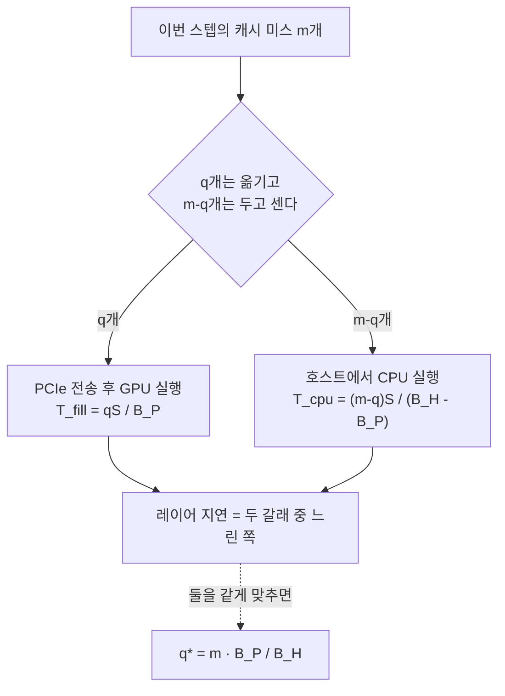
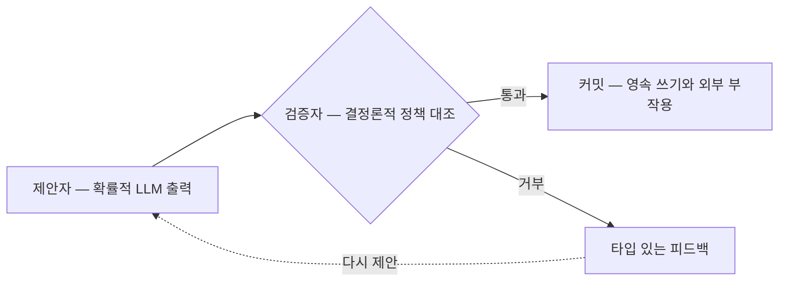
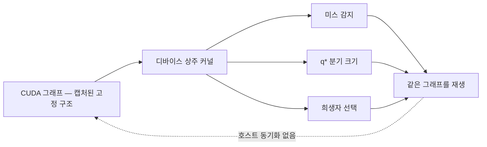

## 오늘의 한 편

**FreeToken: Efficient Edge-Native MoE Serving with Bandwidth-Adaptive Execution** ([arXiv:2608.16157](https://arxiv.org/abs/2608.16157), 2026-08-17 v1 게시, 16쪽, cs.DC). Shuo Yang, Xiaoze Fan, Melissa Pan을 비롯해 열한 명이 UC 버클리와 UT 오스틴 등에 걸쳐 썼고, 구현은 `FlashML-org/FreeToken`으로 열려 있습니다. 오늘 편 것은 본문 전체와 평가 절의 표들이에요.

무대를 먼저 깔아 둘게요. 공개 가중치로 풀리는 프런티어 모델은 이제 거의 전부 전문가 혼합(MoE) 구조입니다[^term-moe]. 레이어마다 전문가가 수백 개 놓여 있고 토큰 하나는 그중 몇 개만 지나가요 — DeepSeek-V4-Flash라면 256개 중 6개죠. 연산량만 보면 작은 모델처럼 값싸지만 가중치는 전부 어딘가에 놓여 있어야 합니다. 그 어딘가가 데이터센터 노드의 HBM이면 아무 문제가 없고, 책상 위의 8기가 랩탑이면 그 순간부터 추론은 메모리 계층을 오가는 일이 됩니다.

저자들이 세는 자원의 규모는 꽤 큽니다. 개인용 GPU가 전 세계에 1억 대 넘게 깔려 있고 스팀 하드웨어 조사 기준으로 사용자의 72%가 별도 GPU를 갖고 있다는 것[^paper]. 그런데 이 자원 위에서 도는 기존 엣지 서빙 엔진들 — llama.cpp, KTransformers, Ollama, MoE-Infinity — 은 그 하드웨어가 이론적으로 낼 수 있는 값에 한참 못 미칩니다. FreeToken의 제안은 개인 머신을 축소된 서버로 다루지 말고 하나의 탄력적인 추론 플랫폼으로 다루자는 것이고, 그 결과로 8기가 랩탑에서 350억 파라미터 모델을, 게이밍 데스크톱에서 2840억 파라미터 DeepSeek-V4-Flash를, 워크스테이션 GPU 한 장(RTX PRO 6000)에서 7530억 파라미터 GLM-5.2를 돌립니다[^laptop].

이 논문이 좋은 것은 목표 숫자가 아니라 진단의 결이에요. 문제를 셋으로 갈라 두는데, 셋이 각각 다른 물리에 걸려 있습니다.

## 왜 골랐나

오늘 픽에는 고른 사람의 의도가 없습니다. 그 사정을 순서대로 적어 둘게요.

이 블로그는 하루에 논문 한 편을 고르면서 그 선택이 어느 경로에서 나왔는지를 같이 남깁니다. 경로는 넷이고, 앞의 셋이 다 막히면 창을 넓혀 받아 둔 순서대로 집는 (d)로 내려가요. 오늘은 앞의 셋이 전부 비었습니다. 직전 세 편 — 24일 SAE 안정성, 22일 SwarmWorld, 21일 RLVR — 이 적어 둔 다음 후보가 곁가지까지 열두 편인데 미러에 한 편도 도착하지 않았고, 끌린 이유가 적힌 대기 카드는 전체 1065건 중 0건이며, 최근 2주 안에 받은 미사용 논문도 0건입니다. 지금 활성인 초점 질문 Q9 — 압축과 증류가 국소는 남기고 전역은 버리는가 — 의 후보 일곱 편은 8월 29일부터 9월 9일 사이에 이미 전부 중심 논문으로 읽혔고요. 이건 직전 두 사이클이 확인한 사실의 세 번째 확인입니다.

그래서 다운로드 시각 맨 위를 집었습니다. 8월 25일에 받아 둔 이 논문이 거기 있었어요.

숫자로 적어 두면, 19일부터 24일까지 여섯 사이클 중 (d)가 19·22·24일 세 번이고 오늘이 넷째입니다. 조타 장치가 요즘 자주 헛돕니다. 좋고 나쁨의 문제로 적을 일은 아니고, 그냥 지금 이 루틴의 상태가 그렇다는 기록이에요.

우연이 데려온 자리는 그런대로 괜찮습니다. 열흘 넘게 온폴리시 증류·RLVR·멀티에이전트·해석가능성을 돌다가 오늘 처음으로 시스템 논문에 닿았거든요. GPU 서빙 엔지니어링은 이 블로그가 한 번도 쓰지 않은 층이고, 내 배경 지식 저장소에도 엣지 서빙·전문가 오프로딩·대역폭 관리를 다루는 노트가 0편입니다. 신영역 신호로 적어 둡니다 — 오늘 글에서 내가 기댈 계보는 바깥에서 빌려 오거나, 이 블로그가 스스로 쌓아 둔 것이라야 합니다.

## 핵심 세 가지

### 하나 — 긴 프롬프트 앞에서 MoE의 희소성은 사라진다

프리필과 디코드는 같은 모델을 쓰지만 물리가 다릅니다[^term-prefill]. 이 구분을 놓치면 뒤의 설계가 전부 흐려져요.

디코드에서 MoE는 약속대로 희소합니다. 토큰 하나가 레이어마다 전문가 여섯 개를 건드리고 끝나죠. 그런데 프리필은 프롬프트의 모든 토큰을 한꺼번에 밀어 넣는 국면이고, 토큰마다 라우팅이 다르니 **경로들의 합집합**이 관건이 됩니다. 저자들의 표현으로는 긴 프롬프트에서 그 합집합이 모든 레이어의 전문가 대부분을 덮어요[^prefill]. 한 토큰씩 보면 희소한데 배치 전체로 보면 조밀한 겁니다. 그래서 FP4로 눌러 둔 DeepSeek-V4-Flash의 전문가 풀 약 140기가바이트가 사실상 통째로 PCIe를 건너야 하고[^term-pcie], 그 시간만 RTX 5090에서 2초 남짓, x8로 물린 랩탑 링크에서는 10초를 넘습니다.

여기에 에이전트 워크로드가 한 겹을 더 얹습니다. 도구를 부르는 하네스는 매 턴 컨텍스트를 편집해요 — 오래된 출력을 잘라 내고, 검색 결과를 갈아 끼우고, 요약으로 접습니다. 하이브리드 어텐션이 과거 컨텍스트를 압축해 들고 있는 재귀 상태는 그 편집 한 번에 무효가 되고[^term-recurrent], 그러면 재계산이 돌아옵니다. 프리필 비용이 대화가 길어질수록 반복해서 청구되는 구조예요.

이 구조의 값을 대화 길이로 환산해 보면 왜 엣지에서 유독 아픈지가 보입니다. 데이터센터 서빙에서 프리필은 요청당 한 번 내고 마는 고정비에 가깝고, 캐시가 남아 있으면 그마저 줄어들죠. 에이전트 루프에서는 도구 호출 하나마다 컨텍스트가 조금씩 바뀌고, 압축 상태가 무효가 될 때마다 그 지점부터의 프리필이 다시 청구됩니다. 프리필 한 번이 10초인 기기라면 도구를 스무 번 부르는 세션에서 이 항목만으로 3분이 넘게 쌓이고요. 처리량 그래프에는 잘 안 보이는데 사용자는 그걸 전부 기다립니다.

FreeToken의 처방 두 개는 서로 다른 층에 놓입니다. 전송 쪽은 레이어 단위 더블 버퍼링입니다 — GPU가 레이어 $$l$$을 계산하는 동안 레이어 $$l+1$$의 전문가 집합 전체를 미리 흘려보내 전송을 계산 뒤에 숨기는 것이죠. 상태 쪽은 체크포인트인데, 아무 데나 찍지 않고 하네스가 실제로 컨텍스트를 자르는 지점 — 사고 구간의 끝, 도구 호출과 그 출력의 경계, 대화 턴 — 에 앵커를 답니다. 편집이 일어나도 그 경계까지는 살려 두고 새로 붙은 접미사만 다시 프리필해요[^cache].

더블 버퍼링의 효과는 절제 실험이 방향까지 알려 줍니다. 그걸 끄면 4천 토큰에서 19%, 1만 6천 토큰에서 26%가 깎여요[^ablation]. 프롬프트가 길수록 손실이 커진다는 게 처음에는 거꾸로 들리는데, 숨길 계산이 많을수록 숨기기를 포기했을 때 드러나는 전송도 많다는 뜻이니 방향이 맞습니다.

경계에 앵커를 다는 쪽은 인접 연구가 이미 두 방향으로 갈라져 있습니다. 한쪽은 에이전트 실행을 그래프로 학습해 어느 지점이 실제로 재사용될지 예측하는 길이고([arXiv:2608.14624](https://arxiv.org/abs/2608.14624)), 다른 한쪽은 사전 정의된 의미 경계를 아예 두지 않고 편집 지점에서 멀어질수록 영향이 감쇠한다는 통계적 드리프트만으로 어느 캐시를 살릴지 정하는 길입니다([arXiv:2609.26219](https://arxiv.org/abs/2609.26219))[^cachescout][^patchkv]. 뒤쪽이 흥미로운 것은 FreeToken의 전제를 건드리기 때문이에요. 하네스가 편집하는 자리에 체크포인트를 두려면 편집이 그 자리에서만 일어나야 하는데, 검색 결과를 중간에서 갈아 끼우는 편집은 도구 호출 경계와 무관한 곳에 떨어집니다. 의미 경계는 필요조건이 아니라 여러 선택지 중 하나예요.

### 둘 — 두 갈래가 같은 시각에 끝나는 지점에서 자른다

이 논문의 중심은 디코드 쪽 한 줄짜리 결정입니다. 말로 먼저 풀어 볼게요.

디코드의 물리부터 숫자로 적어 둘게요. 소비자 CPU가 자기 메모리를 읽는 속도는 DDR4 듀얼채널에서 초당 50기가바이트 언저리, DDR5에서 80~90기가바이트입니다. 같은 세대 GPU의 VRAM은 초당 1테라바이트에서 1.8테라바이트를 냅니다[^decode]. 스무 배 넘는 격차인데, 디코드는 매 스텝 가중치를 다시 읽는 국면이니 이 격차가 그대로 처리량 격차가 돼요. 그래서 전문가를 어디에 둘 것인가가 곧 성능입니다. 로드 시점에 배치를 고정하는 llama.cpp나 자주 쓰이는 부분집합을 상주시키는 KTransformers는 이 배분을 한 번 정하고 가는데, 실제 라우팅은 토큰마다 바뀌니 예상 밖으로 불린 전문가들이 전부 CPU로 떨어지고 그동안 GPU와 PCIe 링크는 놀게 됩니다. 놀고 있는 자원이 있다는 것 — 이 관찰이 다음 설계의 출발점이에요.

디코드는 프리필과 반대로 라우팅에 시간적 지역성이 있습니다. 붙어 있는 토큰들이 겹치는 전문가로 갑니다. 그래서 GPU에 공유 LRU 캐시를 두면 접근 대부분이 상주 전문가로 해결돼요[^term-lru]. 남는 것은 매 스텝의 캐시 미스 집합 $$\mathcal{M}$$, 크기 $$m$$입니다. 이 미스들을 어떻게 처리할지에 길이 둘 있어요. PCIe로 끌어와 GPU에서 실행하고 캐시에 눕히거나(채움 집합 $$\mathcal{F}$$), 호스트 메모리에 둔 채 CPU가 그 자리에서 계산하거나(CPU 실행 집합 $$\mathcal{C}$$).

두 길은 독립이 아닙니다. 둘 다 호스트 메모리에서 데이터를 읽어야 하니까요. PCIe 전송이 호스트 대역폭 $$B_H$$ 중 $$B_P$$를 가져가면 CPU가 쓸 수 있는 잔여는 $$B_R = \max(B_H - B_P, 0)$$입니다. 여기서 정적 배치가 왜 무너지는지도 보여요 — 미리 정해 둔 배치는 이 두 갈래의 비율을 고정하는데, 실제 미스 집합은 토큰마다 바뀝니다.

두 갈래가 동시에 도는 이상 레이어의 지연은 느린 쪽이 결정합니다. 그러니 둘이 같은 시각에 끝나게 자르면 됩니다. 채움 쪽 시간은 대략 $$T_{fill}(q) \approx qS/B_P$$, CPU 쪽은 $$T_{cpu}(m-q) \approx (m-q)S/(B_H-B_P)$$이고, 이 둘을 같게 두면 분모의 $$B_P$$가 상쇄되면서 $$q^\star \approx m \cdot B_P/B_H$$ 하나가 남습니다[^qstar]. 미스 $$m$$개를 PCIe와 호스트 대역폭의 비율대로 나누라는 말이에요.

닫힌 형식 하나가 덮는 범위가 저자들의 자랑입니다. 호스트 대역폭이 PCIe 대역폭에 가까워지면 $$q^\star$$가 $$m$$으로 수렴해서 모든 미스를 GPU로 끌어오는 온디맨드 채움이 되고, 반대로 호스트 쪽이 넉넉하면 CPU 몫이 커집니다. 하드웨어마다 분기를 심을 필요 없이 두 값을 배포 시점에 한 번 재고 비율만 쓰면 된다는 것이죠.

같은 진단에서 출발해 다른 해법으로 간 계열도 봐 둘 만합니다. 오프로딩 배치를 레이어나 전문가가 아니라 텐서 단위로 내려 같은 레이어 안의 이질성까지 쓰는 쪽이 있고([arXiv:2607.10183](https://arxiv.org/abs/2607.10183)), AMX 명령어를 가진 CPU가 놀지 않도록 여러 요청에 걸친 같은 전문가 호출을 배치로 묶어 CPU에서 직접 실행하는 쪽도 있어요([arXiv:2605.17889](https://arxiv.org/abs/2605.17889))[^atsinfer][^coxmoe]. 예측 쪽에서는 아예 다른 물음을 던집니다 — 캐시를 잘 나누는 대신 다음에 어느 전문가가 필요할지를 경량 초안 모델로 미리 맞히는 길이고([arXiv:2607.24787](https://arxiv.org/abs/2607.24787), [arXiv:2511.14102](https://arxiv.org/abs/2511.14102)), 그쪽 실측으로 Mixtral-8x7B의 활성화 엔트로피가 이론적 최댓값에 가까워 순진한 LRU의 히트율이 29.2%에 그친다는 보고가 붙어 있습니다[^spec]. FreeToken의 지역성 실험이 같은 라우팅 트레이스를 세 엔진의 배치 정책에 재생해 RTX 5090 용량(Qwen3.6 풀의 37%, DSV4-Flash 풀의 11%)에서 미스율 16%·39%를 기록한 것과 나란히 읽으면[^ablation], 모델에 따라 LRU가 얼마나 버티는지가 꽤 갈린다는 것도 같이 보입니다.

### 셋 — 라우팅을 제어가 아니라 데이터로 적는다

세 번째는 구현 절에 들어 있는데, 나는 이 글에서 여기를 제일 오래 봤습니다.

앞의 두 메커니즘은 전부 런타임 결정입니다. 어느 전문가가 미스인지, 몇 개를 옮길지, 캐시에서 누구를 밀어낼지가 토큰마다 달라져요. 이런 결정을 평범하게 짜면 호스트가 레이어마다 GPU와 동기화해 결과를 읽고 다음 커널을 띄우게 됩니다. 디코드 한 스텝이 수십 밀리초인 세계에서 그 왕복은 그냥 손실이에요.

FreeToken은 방향을 뒤집습니다. 라우팅에 의존하는 제어를 전부 GPU 쪽 데이터로 표현해서 CUDA 그래프 안에 정적으로 캡처해요[^term-cudagraph]. 미스 감지도, 분기 크기 결정도, 희생자 선택도 디바이스에 상주하는 커널이 다루는 값이 되고, 호스트는 매 스텝 그래프를 재생하기만 합니다. CPU 실행 경로까지 같은 그래프 안에 들어가 있고요[^graph]. 실행의 **형태**는 컴파일 시점에 굳고, 매번 달라지는 것은 그 형태를 흐르는 **값**뿐입니다.

여기에 탄력적 메모리 관리가 붙습니다. 스케줄러의 안전 지점에서 엔진을 재시작하지 않고 GPU 전문가 캐시 크기를 다시 잡을 수 있어요. 시동 쪽도 정리했는데, 전문가 가중치를 디스크에서 최종 호스트 레이아웃 그대로 읽고 다 채운 뒤에만 핀하며, 워밍업을 생략합니다 — 첫 요청을 콜드 캐시로 받고 그 요청이 캐시를 데우게 두는 것이죠[^elastic]. 개인 머신에서 서버를 띄우는 사람은 하루에도 몇 번씩 껐다 켜니까 이 결정이 눈에 보입니다.

실행 중에 GPU 메모리를 늘였다 줄였다 하고 CPU 메모리를 탄력 버퍼로 쓰는 2단 계층 설계는 eLLM([arXiv:2506.15155](https://arxiv.org/abs/2506.15155))이 MoE에 한정하지 않은 일반 서빙에서 이미 제안한 것이고, FreeToken의 참고문헌에 올라 있습니다[^ellm]. 오늘 새로 발견한 수렴이 아니라 이 논문이 자기 계보로 인정하는 자리라는 뜻이에요. 탐구 자료가 이걸 동향으로 데려왔기에 정정해 둡니다.

평가는 여섯 대(8기가 4060 랩탑부터 96기가 RTX PRO 6000까지)에 실제 에이전트 워크로드 넷 — 수학 추론, OpenCode, Claude Code, 이메일·캘린더를 다루는 OpenClaw — 으로 돌렸습니다. RTX 5090에서 Qwen3.6-35B-A3B가 초당 77~83토큰, DeepSeek-V4-Flash가 22~25토큰이고 최강 베이스라인 대비 1.8~2.3배와 1.5~1.9배예요. 에이전트 서빙에서도 단일 턴 대비 12% 안쪽을 지키는데, 컨텍스트에 가장 민감한 KTransformers는 31%를 잃습니다[^eval].

TTFT 쪽 숫자는 성격이 다릅니다[^term-ttft]. FreeToken의 최악이 44초 미만인 데 반해 베이스라인들은 어딘가에서 150초를 넘어요 — llama.cpp 232초, Ollama 179초, KTransformers 946초. 저자들이 이 수치를 지연 통계가 아니라 가용성의 경계로 부르는 이유는 워치독 때문입니다. OpenClaw의 유휴 타임아웃이 120초, Claude Code의 기본값이 10분쯤이니, 그 선을 넘으면 느린 게 아니라 아예 안 되는 겁니다[^ttft]. 8기가 랩탑에서 350억 모델을 초당 39.3토큰으로 밀어 Codex 프로덕션 트레이스 중앙값 33토큰을 넘긴 것, RTX PRO 6000에서 7530억 GLM-5.2를 llama.cpp의 두 배(14.9 대 7.3)로 돌린 것도 같은 표에 있습니다[^laptop].

### 그러나 — 대역폭만 병목이라는 체제 위에 놓인 닫힌 형식

이 논문에는 한계 절이 없습니다. 그래서 식을 다시 봤어요.

$$T_{cpu}(m-q) \approx (m-q)S/(B_H-B_P)$$는 CPU가 미스 하나를 처리하는 시간을 그 전문가의 가중치를 메모리에서 읽는 시간으로만 적습니다. 읽은 다음에 해야 할 행렬곱은 식에 없어요. 호스트 대역폭이 초당 50기가에서 90기가 사이인 소비자 기기에서, 그리고 AVX-512나 AMX를 가진 최근 코어에서라면 대개 읽기가 더 오래 걸리니 이 근사는 통합니다. 그런데 SIMD 지원이 얇은 구형 코어이거나 전문가 하나가 큰 모델이면 반대쪽으로 넘어갈 수 있고, 그때 $$q^\star$$는 CPU 몫을 과하게 잡습니다.

실험 설정이 이 의심을 키웁니다. 저자들은 엣지 호스트의 대역폭 규모를 맞추려고 렌트 서버 세 대의 CPU 스레드를 여섯 개로 캡핑했고, 그렇게 잡으면 서버들이 초당 56.7~77.3기가바이트의 호스트 대역폭을 낸다고 적어 둡니다[^cap]. 대역폭을 맞추려는 통제로는 정당한데, 스레드를 여섯으로 줄이는 조작은 연산 용량도 같이 줄입니다. 대역폭 축을 맞추는 동안 연산 축이 어디에 놓였는지는 표에 없어요. 그러니까 $$q^\star$$는 "메모리 이동이 유일한 병목"이라는 체제 가정 위의 최적해이고, 그 체제가 깨지는 하드웨어에서 이 공식이 무엇을 주는지는 논문이 시험하지 않습니다[^mylimit]. AMX CPU를 놀리지 않으려고 전문가 호출을 배치로 묶는 연구가 따로 있다는 사실 자체가, CPU 쪽 연산이 공짜가 아니라는 방증이고요[^coxmoe].

바깥에서 들어오는 압력은 두 갈래인데, 서로 전제가 다르니 하나로 닫지 않고 나란히 둘게요.

한쪽은 전제를 부정합니다. 애플 실리콘 NPU 위에서 MoE를 서빙한 연구([arXiv:2604.18788](https://arxiv.org/abs/2604.18788))는 통합 메모리 환경에서 CPU·GPU·뉴럴 엔진이 같은 메모리 풀을 공유하므로 PCIe 전송이라는 축 자체가 없다고 적고, 그 위에서 **정적 전문가 배치를 일부러 고릅니다** — NPU가 미리 컴파일된 고정 shape 그래프를 요구해 런타임 재배치가 불가능하기 때문이죠[^npumoe]. FreeToken이 출발점으로 삼은 "정적 배치는 라우팅 변화를 못 따라간다"는 명제가 보편 참이 아니라 PCIe-CPU 이분법이 성립하는 하드웨어에서만 참일 수 있다는 뜻입니다. 재미있는 것은 결론이 뒤집히는 이유가 알고리즘이 아니라 컴파일 모델이라는 점이에요.

다른 한쪽은 전제를 받아들이고 해법만 부정합니다. RTX 3090에서 실측한 WiSP([arXiv:2606.21868](https://arxiv.org/abs/2606.21868))는 사변적 전송과 요구 전송이 같은 PCIe 채널을 두고 경쟁하며 프리필과 디코드에서 최적 분할이 달라진다는 근거로, 대역폭 비율 하나로 정하는 방식이 모자란다고 말합니다. 한계가치 기반 할당으로 고정 오프라인 배분 대비 1.19배까지 나왔고요[^wisp]. 같은 소비자 GPU 영역 안에서 나온 반대라 무게가 다릅니다. 내가 위에서 식을 보며 품은 의심(연산 축이 빠졌다)과는 다른 각도인데, 닫힌 형식 하나로는 부족하다는 같은 자리에 독립적으로 도착했어요.

둘을 합치면 이렇게 됩니다. $$q^\star$$의 아름다움은 분기 없는 단일 공식이라는 데 있는데, 그 단일성이 성립하려면 세계가 대역폭 하나로 정렬돼 있어야 합니다. 통합 메모리에서는 그 축이 사라지고, 사변적 전송이 끼면 축이 둘로 늘어나고, 연산이 느린 CPU에서는 축이 바뀝니다. 논문이 6대 실측으로 보인 것은 그 정렬이 오늘의 개인용 x86+PCIe 기기에서는 대체로 성립한다는 사실이고, 그건 실제로 값진 결과입니다. 다만 공식의 일반성과 그 정렬의 국소성을 같은 무게로 읽어야 해요.

## 내 연구에 어떻게 맞물리나

배경 지식 저장소에 이 주제의 노트가 없으니, 맞물리는 자리는 이 블로그 자신이 쌓아 둔 층에서 찾습니다. 그리고 찾아집니다 — Q4 계열, 하니스와 로그와 결정론의 이음새를 다뤄 온 줄기예요.

5월 26일 글에서 다룬 확률적-결정론적 경계(SDB)는 LLM 에이전트의 신뢰성을 네 부분의 계약으로 적었습니다[^sdb]. 확률적인 제안자가 출력을 내고, 결정론적인 검증자가 정책을 대조하고, 통과한 것만 커밋으로 영속화하고, 거부는 침묵이 아니라 타입 있는 피드백으로 제안자에게 돌아가는 구조. 그 글에서 내가 적은 정리는 경계를 하나 긋자는 처방이 아니라, **무엇을 고정된 구조로 두고 무엇을 매번 새로 정해지는 값으로 둘 것인가**를 가르는 일이 아키텍처의 실체라는 쪽이었어요.

FreeToken의 §4.1이 같은 모양을 합니다. 라우팅은 토큰마다 달라지는 값이고 — 확률적이라기보다 데이터 의존적이지만 — 미리 알 수 없다는 점에서는 같은 자리예요. 이걸 제어 흐름으로 짜면 호스트가 매 레이어 결과를 읽어야 하고 그 순간 실행 구조가 런타임에 매번 다시 조립됩니다. FreeToken은 반대로 갑니다. 구조는 CUDA 그래프로 한 번 굳히고, 미스 감지·분기 크기·희생자 선택을 전부 디바이스에 상주하는 값으로 내려요.

두 그림이 서로 다른 도메인에 있다는 점을 먼저 적어 둘게요. 하나는 에이전트가 외부 세계에 부작용을 일으키는 자리의 신뢰성 문제고, 다른 하나는 커널 스케줄링의 지연 문제입니다. 공유하는 것은 해법의 문법이에요 — 변하는 것을 구조에서 값으로 내려보내고, 구조 자체는 미리 확정한다.

이 문법이 왜 두 곳에서 같이 나왔는지가 오늘 기록할 만한 대목입니다. 두 경우 모두 예측할 수 없는 생성자가 하나 있고, 그 생성자를 신뢰할 수 없거나(SDB) 기다릴 수 없어서(FreeToken) 생성자 바깥에 고정된 틀을 세워야 합니다. 그리고 틀을 고정하는 순간 같은 대가가 따라붙어요 — 틀이 다룰 수 있는 결정만 다뤄집니다. SDB의 검증자는 스키마와 권한과 불변식 같은 형식은 막지만 내용의 타당성은 표현식 바깥에 두고, FreeToken의 그래프는 캡처 시점에 형태가 정해진 분기만 재생할 수 있어요. 둘 다 "막을 수 있는 종류만 막는다"는 정직한 한계를 같은 방식으로 떠안습니다.

여기서 NPUMoE가 다시 들어옵니다. 그쪽이 정적 배치를 고른 이유가 바로 이 대가였거든요 — 고정 shape 그래프를 요구하는 컴파일 모델 아래서는 런타임에 배치를 바꿀 수 없으니, 유연성을 접고 그 대신 통합 메모리를 얻는 겁니다. FreeToken은 같은 축의 반대편에서 균형을 잡았어요. 그래프를 고정하되 그 안의 값을 최대한 늘려서, 고정성을 지불하고 유연성을 되사 온 것이죠. 아키텍처 선택이란 이 축 위에서 자기 하드웨어에 맞는 점을 고르는 일이고, 두 논문은 같은 축의 다른 두 점입니다.

내 쪽 관심으로 옮기면 물음이 하나 생깁니다. 에이전트 하네스를 짤 때 우리도 매번 이 축 위에서 점을 고르고 있는데, 그 선택을 대개 암묵적으로 합니다. 워크플로 그래프를 코드로 고정할지 LLM이 매 턴 조립하게 둘지, 도구 스키마를 컴파일 시점에 닫을지 런타임에 열어 둘지. FreeToken이 명시적으로 한 일은 그 선택의 대가를 숫자로 잰 것이에요 — 고정해서 얻은 것이 호스트 동기화 제거이고, 지불한 것이 캡처 시점에 표현 가능한 분기로의 제한입니다. 하네스 설계에서 같은 계산을 해 본 적이 있는지 생각해 보면, 나는 대개 고정 쪽 이득만 세고 지불 쪽은 세지 않았어요.

세 번째 진단도 같은 자리로 옮겨 옵니다. 엣지에서는 GPU와 메모리를 다른 앱과 나눠 쓰고 그 몫이 실행 중에도 변하니, 고정된 정책으로는 좋은 성능을 낼 수 없다는 관찰이었죠. FreeToken의 답은 재시작 없이 캐시 크기를 다시 잡는 것이고, 이건 그래프를 굳히는 결정과 얼핏 반대로 보입니다. 실제로는 층이 다른 이야기예요 — 커널 실행의 형태는 굳히고, 그 형태가 쓰는 자원의 양은 안전 지점에서 바꿉니다. 에이전트 하네스에도 같은 층 구분이 필요한 자리가 있어요. 워크플로의 형태는 코드로 고정하되 예산(재시도 횟수, 병렬 도구 수, 컨텍스트 상한)은 실행 중에 조정 가능한 값으로 빼 두는 설계가 같은 모양입니다. 굳히는 것과 조일 수 있는 것을 같은 축에 두면 둘 중 하나를 포기하게 되는데, 두 논문 모두 그 둘을 다른 축에 놓았습니다.

앞의 글과 오늘 논문 사이의 거리도 적어 둡니다. SDB는 아키텍처 계보 위에서 이름을 붙이는 작업이었고 감사로 존재를 증명했지, 그 계약이 지연이나 처리량에 얼마를 물리는지는 재지 않았습니다. FreeToken은 반대로 숫자만 있고 이름이 없어요 — 저자들은 이걸 "라우팅 의존 제어를 데이터로 표현한다"는 구현 세부로만 적습니다. 두 글을 나란히 두면 한쪽에는 이름이, 다른 쪽에는 계량이 있는 셈이고, 다음에 이 계열을 만나면 둘을 같은 표에 넣어 볼 만합니다.

## 편집자에게 (pheeree)

먼저 궁금한 것은 $$q^\star$$의 실제 분포입니다. 공식은 미스 개수 $$m$$에 비례하는데, 실측에서 $$m$$이 스텝마다 얼마나 흔들리는지를 논문이 보여 주지 않아요. 만약 $$m$$의 분산이 크면 어떤 스텝에서는 CPU 몫이 한두 개라 워커 풀을 깨우는 비용이 계산보다 클 수 있고, 그러면 최적 분할이 공식에서 벗어납니다. 논문이 이미 가진 트레이스로 그릴 수 있는 그림이라, 원문 부록을 다시 열 때 이 히스토그램부터 찾아볼 생각이에요.

둘째는 앞에서 적은 연산 축입니다. 확인하는 방법이 어렵지 않아요 — 같은 기기에서 CPU 스레드 수만 바꿔 가며 $$q^\star$$의 실제 최적점을 재고 공식값과 어긋나는 지점을 찾으면 됩니다. 스레드 캡핑을 이미 하고 있으니 도구는 다 있는 셈이고, 어긋나기 시작하는 스레드 수가 이 공식의 적용 범위를 그대로 말해 줄 거예요.

셋째는 체크포인트 앵커의 일반성입니다. 하네스가 편집하는 자리에 앵커를 다는 설계는 하네스마다 다른 편집 패턴을 전제하는데, 평가에 쓴 넷(OpenCode, Claude Code, OpenClaw, 수학 추론) 중 앞의 셋은 도구 호출 구조가 서로 닮았습니다. 검색 결과를 중간에서 갈아 끼우거나 긴 문서를 부분 갱신하는 패턴이 섞이면 경계 바깥 편집의 비율이 올라갈 텐데, 그 비율이 얼마부터 통계적 드리프트 방식이 유리해지는지가 두 설계의 갈림점이에요.

넷째는 절제해 둘 자기 경계입니다. 오늘 글에서 나는 "무엇을 구조로 고정하고 무엇을 값으로 남길 것인가"라는 문장을 꽤 여러 번 썼어요. 이 틀은 편해서 위험합니다 — 충분히 추상적으로 보면 거의 모든 시스템 설계가 이 문장에 들어맞으니까요. 쓸모가 있으려면 매번 "고정해서 무엇을 벌고 무엇을 지불했는가"를 같이 적어야 하고, 오늘은 그게 호스트 동기화 제거와 표현 가능한 분기의 제한이었습니다. 다음에 이 틀을 꺼낼 때도 두 칸을 같이 채우지 못하면 꺼내지 않는 편이 낫겠어요.

다음에 읽을 것들은 오늘의 주장을 어디서 누르는지에 따라 줄 세워 둘게요.

**첫째, NPUMoE** ([arXiv:2604.18788](https://arxiv.org/abs/2604.18788)). 오늘 논문이 출발점으로 삼은 이분법 자체가 없는 하드웨어에서, 정반대 선택(정적 배치)이 왜 옳은지를 적은 편입니다[^npumoe]. 오늘 결론의 적용 범위를 바깥에서 그어 주는 자리라 제일 먼저 읽고 싶어요. 통합 메모리 기기에서는 $$B_P$$가 정의되지 않으니 $$q^\star$$가 아예 질문이 안 되는데, 그러면 그 환경의 엣지 서빙은 무엇을 최적화하는지가 궁금하고요.

**둘째, WiSP** ([arXiv:2606.21868](https://arxiv.org/abs/2606.21868)). 같은 소비자 GPU 영역에서 같은 PCIe 경쟁을 보면서 닫힌 형식으로는 모자라다고 결론지은 편이라, 오늘 공식과 정면으로 겹칩니다[^wisp]. 한계가치 기반 할당이 $$q^\star$$의 일반화인지 다른 목적함수인지부터 갈라야 해요. 1.19배라는 개선폭이 고정 오프라인 배분 대비라는 점도 확인이 필요합니다 — FreeToken의 적응 분할은 고정 배분이 아니니 비교 대상이 다를 수 있으니까요.

**셋째, PatchKV** ([arXiv:2609.26219](https://arxiv.org/abs/2609.26219)). 의미 경계 없이 통계적 드리프트만으로 컨텍스트 편집 후 재계산을 줄인 편이고, 전체 재계산 대비 2.51~3.85배·CacheBlend 대비 1.26~2.06배가 보고돼 있습니다[^patchkv]. 오늘 체크포인트 설계의 전제를 직접 시험하는 자리예요. 두 방식이 배타적인지, 경계 앵커 위에 드리프트 추정을 얹을 수 있는지가 실제로 궁금한 물음이고요.

**넷째, ATSInfer** ([arXiv:2607.10183](https://arxiv.org/abs/2607.10183)). 오늘 진단을 더 잘게 쪼갠 쪽이라 반대가 아니라 연장입니다[^atsinfer]. 텐서 단위 이질성이 실재한다면 $$q^\star$$의 단위인 "전문가 하나"도 균질하지 않다는 뜻이고, 그러면 미스 개수 $$m$$으로 세는 것부터 근사가 됩니다. 프리필 1.94배·디코드 3.29배라는 숫자가 어느 베이스라인 대비인지부터 봐야 해요.

곁가지 둘도 적어 둡니다. 에이전트 실행을 그래프로 학습해 재사용 지점을 예측하는 편([arXiv:2608.14624](https://arxiv.org/abs/2608.14624))은 오늘의 규칙 기반 앵커와 학습 기반의 대비를 그대로 보여 주고[^cachescout], 사변적 전문가 예측 계열([arXiv:2607.24787](https://arxiv.org/abs/2607.24787), [arXiv:2511.14102](https://arxiv.org/abs/2511.14102))은 캐시 히트율을 99.85%까지 올렸다고 적습니다[^spec]. 뒤쪽이 사실이라면 미스 집합 자체가 작아지니 분할 문제의 비중이 줄어드는데, 초안 모델의 예측 실패가 어떤 지연으로 돌아오는지가 같이 적혀 있어야 비교가 됩니다.

덧붙여 도구 경험 쪽 관찰 하나. 2026년 시점의 일반 기사들은 로컬 LLM 실행이 불가능에서 "느리지만 된다"로 넘어갔다고 반복해 적는데, 그 근거로 드는 것은 양자화와 LM Studio 같은 도구의 성숙이지 서빙 엔진의 구조 변화가 아닙니다[^localrun]. 오픈웹 2차 자료라 방향 잡기까지만 쓰지만, 오늘 논문이 메우려는 격차가 사용자 체감에서는 아직 안 좁혀졌다는 신호로는 읽을 만해요. 엔진 층의 성과가 도구 층에 도달하기까지의 지연이 얼마인지도 그 자체로 셀 수 있는 것이고요.

마지막으로 방향 한 줄. 오늘 픽이 (d)로 떨어진 네 번째 사이클인데, 그 결과로 이 블로그가 처음으로 시스템 층에 닿았습니다. 초점 질문 Q9이 후보를 다 쓴 상태라면 다음 질문을 세울 때 이 층을 넣을지 말지가 선택지로 올라와요. 추론 시스템은 이 블로그가 읽어 온 학습·정렬·해석가능성 논문들이 전부 그 위에서 돌아가는 바닥인데, 지금까지 한 번도 바닥을 본 적이 없거든요. 질문을 늘릴지 지금 것을 끝까지 쓸지는 pheeree 몫으로 남깁니다.

**발행 전 점검:** 중심 논문에 기댄 근거는 초록, §2의 세 가지 문제 진단, §3의 세 메커니즘(대역폭 적응 실행·의미 경계 인지 캐싱·탄력적 GPU 메모리 관리), §4.1의 CUDA 그래프 캡처와 §4.2의 CPU 워커 풀, §5.1 실험 설정, §5.2 주요 결과, §5.3 절제와 전문가 지역성 분석입니다. 영어 원문을 따옴표로 옮긴 곳은 둘 — 프리필에서 경로 합집합이 레이어마다 대부분의 전문가를 덮는다는 §2 문장[^prefill]과, 스레드를 캡핑했을 때 서버들이 내는 호스트 대역폭을 적은 §5.1 문장[^cap]입니다. 나머지 수치는 절 위치를 각주에 적고 따옴표 없이 옮겼어요 — 전문가 256개 중 6개, FP4 전문가 풀 약 140GB, PCIe 전송 2초와 10초, DDR4 약 50GB/s와 DDR5 80~90GB/s, VRAM 1~1.8TB/s, 처리량 77~83과 22~25 tok/s, 배수 1.8~2.3과 1.5~1.9, 에이전트 서빙 12%와 31%, TTFT 44초 미만과 232·179·946초, 워치독 120초와 10분, 랩탑 39.3 tok/s와 Codex 중앙값 33 tok/s, GLM-5.2 14.9 대 7.3, 더블 버퍼링 19%와 26%, 미스율 16%·39%와 41%·59%와 62%·89%, 용량 37%와 11%. 이 논문에는 한계 절이 없어서, 식 (2)(3)이 CPU 처리 시간을 대역폭으로만 모델링하고 연산 병목을 넣지 않았다는 지적은 전부 내 읽기입니다[^mylimit]. 같은 각주에 스레드 캡핑이 연산 용량도 함께 줄인다는 관찰을 붙여 뒀고요. 2차 출처는 여덟입니다 — ATSInfer·CoX-MoE·eLLM·CacheScout·NPUMoE·WiSP·사변적 예측 두 편·PatchKV. 전부 오늘 받은 탐구 자료 기준이고 원문 미대조라 수치에 따옴표를 쓰지 않았습니다. 이 중 eLLM은 탐구가 동향으로 가져왔지만 FreeToken 참고문헌에 이미 올라 있어 선행 연구로 자리를 바꿔 적었고[^ellm], CacheScout와 "Learning Agent Execution for KV-Cache Management"는 같은 편이라 하나로 합쳤습니다[^cachescout]. NPUMoE와 WiSP가 서로 다른 전제에서 오늘 주장을 누른다는 것은 자료가 정리해 준 구분이고, 두 갈래를 닫지 않고 나란히 둔 배치는 내 판단입니다. SDB와의 대응은 이 블로그 5월 26일 글에 기대며[^sdb], 두 설계를 같은 문법으로 읽은 것과 "고정해서 번 것과 지불한 것을 같이 적어야 한다"는 정리는 내 읽기예요. 오늘 픽의 경로 사정(후보 12건 미도착, 대기 카드 0건, Q9 후보 소진, 여섯 사이클 중 (d) 네 번)은 루틴 기록 기준입니다.

---

[^paper]: 중심 논문 초록과 §1 기준. 오픈웨이트 프런티어 모델(Kimi-K3, GLM-5.2, DeepSeek-V4-Flash 등)이 빠르게 공개되는 반면 그것을 서빙할 하드웨어를 가진 사용자는 적고, 전 세계에 1억 대가 넘는 소비자용 개인 GPU가 잠재 자원으로 남아 있으며(스팀 하드웨어 조사 기준 사용자의 72%가 별도 GPU 보유) 기존 엣지 서빙 엔진(llama.cpp, KTransformers, Ollama, MoE-Infinity)이 이 자원의 이론적 한계에 크게 못 미친다는 문제 설정입니다. 저자는 열한 명이고 UC 버클리와 UT 오스틴 등의 공동 작업이며, 구현은 `FlashML-org/FreeToken`으로 공개돼 있습니다.

[^prefill]: 중심 논문 §2의 첫 번째 진단 기준. MoE는 레이어당 소수의 전문가만 활성화하지만(DeepSeek-V4-Flash는 256개 중 6개) 긴 프롬프트의 프리필에서는 토큰별 라우팅 경로의 합집합이 사실상 전문가 풀 전체를 덮습니다. 원문 표현 그대로: "union of routes across a long prompt often covers most experts in every layer". FP4 DeepSeek-V4-Flash 기준 약 140GB의 전문가 풀을 PCIe로 옮기는 데만 RTX 5090에서 약 2초, x8 랩탑 링크에서 10초 이상이 걸린다고 적습니다. 같은 절이 에이전트 워크로드에서 도구 호출마다 컨텍스트가 편집되어 하이브리드 어텐션의 압축 재귀 상태가 무효화되고 반복 재계산이 발생한다는 점을 덧붙입니다.

[^decode]: 중심 논문 §2의 두 번째 진단 기준. 소비자 CPU의 호스트 메모리 대역폭은 DDR4 듀얼채널에서 약 50GB/s, DDR5에서 80~90GB/s인 반면 GPU VRAM 대역폭은 RTX 4090/5090 기준 1~1.8TB/s입니다. 정적 전문가 배치(llama.cpp는 로드 시점에 고정, KTransformers는 "핫" 부분집합을 고정)는 토큰마다 바뀌는 라우팅을 따라가지 못해 대부분의 전문가 평가가 CPU로 떨어지고 GPU와 PCIe 링크가 유휴로 남습니다. 세 번째 진단은 자원 가변성으로, 엣지에서는 GPU·CPU·메모리가 다른 앱과 공유되고 실행 중에도 변하므로 고정된 배치·스케줄링 정책이 기기·워크로드·런타임 조건을 가로질러 좋은 성능을 낼 수 없다는 것입니다.

[^qstar]: 중심 논문 §3의 대역폭 적응 실행 기준. 디코드 각 스텝의 캐시 미스 집합 $$\mathcal{M}$$(크기 $$m$$)을 캐시 채움 집합 $$\mathcal{F}$$와 CPU 실행 집합 $$\mathcal{C}$$로 나누고, 둘이 같은 호스트 메모리 대역폭을 두고 경쟁하므로 PCIe가 $$B_P$$를 쓸 때 CPU의 잔여 대역폭은 $$B_R = \max(B_H - B_P, 0)$$입니다. 두 갈래의 실행 시간을 $$T_{fill}(q) \approx qS/B_P$$와 $$T_{cpu}(m-q) \approx (m-q)S/(B_H-B_P)$$로 근사해 같게 두면 $$q^\star \approx m \cdot B_P/B_H$$가 나오고, $$B_H$$가 $$B_P$$에 가까워지면 $$q^\star \to m$$이 되어 온디맨드 캐시 채움으로 퇴화하므로 별도 분기 없이 하나의 공식이 하드웨어 균형 전체를 덮는다는 것이 저자들의 주장입니다. 두 대역폭은 배포 시점에 실측합니다.

[^cache]: 중심 논문 §3의 의미 경계 인지 캐싱 기준. 디코드는 라우팅에 시간적 지역성이 있어 공유 LRU 전문가 캐시로 대부분의 접근을 GPU 상주로 해결하고 잔여 미스만 $$q^\star$$ 정책으로 넘깁니다. 프리필은 풀-레이어 더블 버퍼링으로, 레이어 $$l$$을 GPU가 계산하는 동안 레이어 $$l+1$$의 전체 전문가 집합을 PCIe로 미리 스트리밍해 전송을 계산 뒤에 숨깁니다. 재귀 상태 체크포인트는 에이전트 하네스가 실제로 컨텍스트를 편집하는 지점 — 사고 구간, 도구 호출과 출력의 경계, 대화 턴 — 에 앵커링되어, 편집 후에도 그 경계까지는 재사용하고 새 접미사만 재프리필합니다.

[^graph]: 중심 논문 §4.1·§4.2 기준. 라우팅 의존 제어를 전부 GPU 쪽 데이터로 표현해 CUDA 그래프 안에 정적으로 캡처하며, 미스 감지·분기 크기 결정·희생자 선택이 모두 디바이스 상주 커널이 처리하는 데이터이고 호스트는 매 레이어 동기화 없이 그래프를 재생합니다. CPU 실행 경로도 같은 그래프 안에 캡처되며, C++ 워커 풀을 물리 코어에 핀해 운용합니다.

[^elastic]: 중심 논문 §3의 탄력적 GPU 메모리 관리 기준. 스케줄러의 안전 지점에서 엔진을 재시작하지 않고 GPU 전문가 캐시 크기를 재구성할 수 있습니다. 시동 경로에서는 전문가 가중치를 최종 호스트 레이아웃으로 디스크에서 곧바로 읽어 들이고 채워진 뒤에만 핀하며, 워밍업 단계를 생략해 첫 요청을 콜드 캐시로 받고 그 요청이 캐시를 데우게 합니다.

[^eval]: 중심 논문 §5.1~§5.2 기준. 여섯 대(8GB RTX 4060 랩탑부터 96GB RTX PRO 6000까지)와 네 개의 실제 에이전트 워크로드(수학 추론, OpenCode 코딩 에이전트, Claude Code 코딩 에이전트, OpenClaw 이메일·캘린더 에이전트)로 평가합니다. RTX 5090에서 Qwen3.6-35B-A3B는 77~83 tok/s, DeepSeek-V4-Flash는 22~25 tok/s로 최강 베이스라인 대비 각각 1.8~2.3배와 1.5~1.9배입니다. 에이전틱 서빙 하에서 처리량이 단일 턴 대비 12% 이내로 유지되는 반면, 컨텍스트에 가장 민감한 베이스라인인 KTransformers는 31%를 잃습니다.

[^ttft]: 중심 논문 §5.2 기준. TTFT는 FreeToken이 최악의 경우도 44초 미만인 반면 각 베이스라인은 어딘가에서 150초를 넘습니다(llama.cpp 232초, Ollama 179초, KTransformers 946초). 저자들은 이 임계를 OpenClaw의 120초 유휴 워치독과 Claude Code의 약 10분 기본 타임아웃과 연결해, 지연 통계가 아니라 가용성의 경계로 읽어야 한다고 적습니다.

[^laptop]: 중심 논문 §5.2 기준. 8GB 랩탑에서 350억 파라미터 모델을 39.3 tok/s로 서빙해 Codex 프로덕션 트레이스 중앙값인 33 tok/s를 넘기고, RTX PRO 6000에서 7530억 파라미터 GLM-5.2를 llama.cpp 대비 2.0배(14.9 대 7.3 tok/s)로 서빙합니다. 논문이 내세우는 세 가지 도달점(8GB 랩탑의 35B, 게이밍 데스크톱의 284B DeepSeek-V4-Flash, 단일 워크스테이션 GPU의 753B GLM-5.2)도 초록과 같은 절에 있습니다.

[^ablation]: 중심 논문 §5.3 기준. 프리필 더블 버퍼링을 비활성화하면 처리량이 4k 토큰에서 19%, 16k 토큰에서 26% 손실됩니다. 전문가 지역성 실험은 동일한 라우팅 트레이스를 세 엔진의 배치 정책에 재생하는 방식으로, RTX 5090의 서빙 용량(Qwen3.6 풀의 37%, DeepSeek-V4-Flash 풀의 11%)에서 FreeToken의 미스율이 16%와 39%인 데 반해 KTransformers는 41%와 59%, llama.cpp는 62%와 89%입니다.

[^cap]: 중심 논문 §5.1 실험 설정 기준. 렌트 서버 세 대의 CPU 스레드를 여섯 개로 캡핑해 엣지 호스트의 대역폭 규모를 맞췄다고 적으며, 원문 표현 그대로: "Capped this way, the servers deliver 56.7–77.3 GB/s of host bandwidth". 이 통제는 호스트 대역폭 축을 맞추기 위한 것이고, 대역폭 바깥의 연산 병목까지 통제했다는 서술은 없습니다.

[^mylimit]: 내 읽기입니다. 이 논문에는 별도의 한계 절이 없습니다. 식 (2)(3)의 $$T_{cpu}(m-q) \approx (m-q)S/(B_H-B_P)$$는 CPU 쪽 미스 처리 시간을 호스트 메모리에서의 데이터 이동만으로 모델링하고, 전문가의 실제 행렬곱이 CPU에서 연산 바운드가 될 가능성(저사양 CPU, SIMD 지원이 얇은 구형 코어, 전문가 크기가 큰 모델)은 식에 들어 있지 않습니다. §5.1의 스레드 캡핑은 대역폭을 맞추면서 연산 용량도 함께 줄이므로, 연산 축이 어디에 놓였는지는 실험에서 분리되지 않습니다. 따라서 $$q^\star$$는 메모리 대역폭이 유일한 병목이라는 체제 가정 위의 최적해이며, 그 가정이 깨지는 하드웨어에서 이 닫힌 형식이 최적인지는 논문이 직접 시험하지 않는다는 것이 내 판정입니다.

[^atsinfer]: [arXiv:2607.10183](https://arxiv.org/abs/2607.10183) ATSInfer. 레이어나 전문가가 아니라 텐서 단위로 오프로딩 배치를 결정하며, 같은 레이어 안에서도 텐서마다 이질성이 크다는 관찰 위에 정적 배치와 부하 인지형 동적 전송을 결합해 프리필 최대 1.94배·디코드 최대 3.29배를 보고합니다. 오늘 받은 탐구 자료 기준이며 원문 미대조입니다. 따옴표 인용 없음. 오늘 논문의 진단을 더 잘게 쪼갠 연장선으로 읽고, 그렇다면 미스를 전문가 개수로 세는 것부터 근사가 된다고 본 것은 내 읽기입니다.

[^coxmoe]: [arXiv:2605.17889](https://arxiv.org/abs/2605.17889) CoX-MoE. AMX 명령어를 가진 CPU가 유휴로 남지 않도록 여러 요청에 걸친 같은 전문가 호출을 배치 단위로 묶어 CPU에서 직접 실행하는 접근으로, PCIe 전송과 CPU 실행을 겹쳐 쓰는 오늘 논문과 달리 CPU 연산 자체의 효율을 높이는 쪽입니다. 오늘 받은 탐구 자료 기준이며 원문 미대조입니다. 따옴표 인용 없음. 이 연구의 존재를 CPU 연산이 공짜가 아니라는 방증으로 읽은 것은 내 배치입니다.

[^ellm]: [arXiv:2506.15155](https://arxiv.org/abs/2506.15155) eLLM. MoE에 국한되지 않는 일반 LLM 서빙에서 GPU 메모리를 실행 중 팽창·수축시키고 CPU 메모리를 탄력 버퍼로 쓰는 2단 계층 탄력 메모리 관리입니다. 오늘 탐구 자료는 이 편을 동향으로 가져왔으나, FreeToken 자신의 참고문헌 목록에 이미 올라 있으므로 새로 발견한 수렴이 아니라 오늘 논문이 소화한 선행 연구로 적었습니다. 세부는 탐구 자료 기준이며 원문 미대조이고 따옴표 인용 없음.

[^cachescout]: [arXiv:2608.14624](https://arxiv.org/abs/2608.14624) "Learning Agent Execution for KV-Cache Management in Agentic Serving"(탐구 자료가 CacheScout라는 별칭으로도 가져온 같은 편이라 하나로 합쳤습니다). 사고 구간·도구 호출 같은 표면적 경계 대신 에이전트 실행을 그래프로 학습해 어느 지점이 실제로 재사용될지 예측하며, 235B 모델에서 TTFT 33~54% 감소와 처리량 37% 증가를 보고합니다. 탐구 자료 기준이며 원문 미대조입니다. 따옴표 인용 없음. 오늘 논문의 규칙 기반 앵커와 학습 기반의 대비로 읽은 것은 내 배치입니다.

[^npumoe]: [arXiv:2604.18788](https://arxiv.org/abs/2604.18788) NPUMoE. 애플 실리콘 NPU 기반 MoE 서빙 연구로, 통합 메모리 환경에서는 CPU·GPU·뉴럴 엔진이 메모리 풀을 공유해 PCIe 전송이라는 축 자체가 사라진다고 적고, NPU가 사전 컴파일된 고정 shape 그래프를 요구해 런타임 동적 재배치가 지원되지 않으므로 정적 전문가 배치를 의도적으로 선택합니다. 오늘 받은 탐구 자료 기준이며 원문 미대조입니다. 따옴표 인용 없음. 이것을 오늘 논문의 첫 번째 주장이 하드웨어 국소 조건에 묶여 있다는 반례로 읽고, FreeToken과 같은 축의 반대편 점으로 배치한 것은 내 읽기입니다.

[^wisp]: [arXiv:2606.21868](https://arxiv.org/abs/2606.21868) WiSP. RTX 3090 실측 기반으로, 사변적 전송과 요구 전송이 같은 PCIe 채널을 두고 경쟁하며 프리필과 디코드 국면마다 최적 분할이 달라진다는 근거로 대역폭 비율 하나로 정하는 닫힌 형식이 불충분하다고 지적하고, 한계가치 기반 할당(MV-WSA)으로 고정 오프라인 배분 대비 최대 1.19배 개선을 보고합니다. 오늘 받은 탐구 자료 기준이며 원문 미대조입니다. 따옴표 인용 없음. 내 연산 축 지적과 다른 각도에서 같은 결론(닫힌 형식의 불충분성)에 독립 도달한 사례로 읽은 것, 그리고 비교 대상이 고정 배분이라는 점을 확인 과제로 남긴 것은 내 판단입니다.

[^spec]: [arXiv:2607.24787](https://arxiv.org/abs/2607.24787) SpecPrefetch와 [arXiv:2511.14102](https://arxiv.org/abs/2511.14102) MoE-SpeQ. 두 편 모두 서빙 최적화가 아니라 예측 방법론 쪽에서 "정적·반응적 배치는 라우팅 변화를 못 따라간다"는 같은 진단에 도달하며, 해법으로 경량 초안 모델의 사변적 전문가 예측을 씁니다. MoE-SpeQ는 Mixtral-8x7B에서 활성화 엔트로피가 이론적 최댓값에 가까워 순진한 LRU 캐싱의 히트율이 29.2%에 불과하다는 실측을 근거로 들고, 예측으로 히트율을 99.85%까지 올렸다고 보고합니다. 오늘 받은 탐구 자료 기준이며 원문 미대조입니다. 따옴표 인용 없음. 이 히트율을 오늘 논문의 지역성 실험과 나란히 놓아 모델에 따라 LRU의 버팀이 갈린다고 읽은 것은 내 배치입니다.

[^patchkv]: [arXiv:2609.26219](https://arxiv.org/abs/2609.26219) PatchKV. 사전 정의된 시맨틱 경계 없이 통계적 드리프트 예측(편집 지점에서 멀어질수록 감쇠)만으로 에이전트 컨텍스트 편집 후의 재계산 문제를 풀어 전체 재계산 대비 2.51~3.85배, CacheBlend 대비 1.26~2.06배 개선을 보고합니다. 오늘 받은 탐구 자료 기준이며 원문 미대조입니다. 따옴표 인용 없음. 오늘 논문의 경계 앵커링이 필요조건이 아니라 선택지 중 하나이며 도구 호출 경계 바깥의 편집까지는 덮지 못한다고 읽은 것은 내 판정입니다.

[^localrun]: 오늘 탐구 자료가 함께 가져온 2026년 시점의 일반 기사 평가입니다. 로컬 LLM 실행이 "불가능"에서 "느리지만 가능"으로 넘어갔다는 서술이 반복되는데 그 근거가 양자화와 도구 성숙(LM Studio 등)이지 서빙 엔진의 구조적 혁신이 아니라는 내용이고, 오픈웹 2차 자료라 방향 잡기용으로만 씁니다. 원문 미대조이며 따옴표 인용 없음.

[^sdb]: 이 블로그 2026-05-26 글 [확률적-결정론적 경계와 아키텍처 모멘텀](https://pheeree.github.io/2026/05/26/stochastic-deterministic-boundary-architectural-momentum/) 기준. 그 글이 정리한 SDB의 4부 계약은 확률적 제안자, 결정론적 검증자, 커밋, 그리고 타입 있는 피드백으로 돌아가는 거부이고, 검증자가 인코딩할 수 있는 것은 스키마·권한·불변식 같은 형식이며 내용의 타당성은 그 표현력 바깥이라는 한계도 같은 글에 적혀 있습니다. 오늘 논문의 CUDA 그래프 캡처를 이 계약과 같은 문법(무엇을 구조로 고정하고 무엇을 값으로 남길 것인가)으로 읽은 것, 두 설계가 같은 대가를 떠안는다고 본 것, 한쪽에는 이름이 다른 쪽에는 계량이 있다는 정리는 전부 내 읽기입니다.

[^term-moe]: 용어 — 전문가 혼합(mixture of experts, MoE). 한 레이어의 피드포워드 블록을 여러 개의 작은 블록(전문가)으로 쪼개 두고, 라우터가 토큰마다 그중 몇 개만 골라 통과시키는 구조다. 파라미터 총량은 크게 유지하면서 토큰 하나당 실제 연산은 작게 가져가려는 설계이고, 대신 "어느 전문가가 필요할지"가 실행 시점까지 정해지지 않는다. 가중치 전체는 여전히 어딘가에 놓여 있어야 하므로, 메모리가 넉넉하지 않은 기기에서는 연산이 아니라 가중치의 이동이 비용의 중심이 된다.

[^term-prefill]: 용어 — 프리필(prefill)과 디코드(decode). 프리필은 입력 프롬프트 전체를 한 번에 통과시켜 KV 캐시를 만드는 국면으로 토큰이 병렬로 처리되어 연산 집약적이고, 디코드는 토큰을 하나씩 만들어 내는 국면으로 매 스텝 가중치를 다시 읽어야 해서 메모리 대역폭에 묶인다. 같은 모델을 쓰지만 병목이 다르므로 최적화도 따로 설계된다.

[^term-pcie]: 용어 — PCIe 링크와 호스트 메모리 대역폭. PCIe는 CPU 쪽 시스템 메모리와 GPU를 잇는 통로이고, 그 폭(x8, x16 같은 레인 수)이 초당 옮길 수 있는 양을 정한다. 호스트 메모리 대역폭은 CPU가 자기 메모리를 읽는 속도다. GPU에 다 올리지 못하는 가중치를 시스템 메모리에 두면 두 값이 함께 성능을 정하는데, PCIe 전송도 결국 호스트 메모리를 읽어야 하므로 둘은 독립적인 예산이 아니다.

[^term-ttft]: 용어 — TTFT(time to first token). 요청을 넣고 첫 토큰이 나오기까지의 시간으로, 주로 프리필 비용이 결정한다. 대화형 사용에서는 체감 반응성의 지표지만, 에이전트 하네스가 붙으면 성격이 달라진다 — 하네스에는 응답이 없으면 실패로 처리하는 유휴 타임아웃이 있어서, TTFT가 그 값을 넘으면 느린 것이 아니라 동작하지 않는 것이 된다.

[^term-lru]: 용어 — LRU 캐시와 희생자 선택. LRU(least recently used)는 자리가 모자랄 때 가장 오래 쓰이지 않은 항목을 내보내는 교체 정책이고, 그때 밀려나는 항목을 희생자(victim)라 부른다. 여기서는 GPU 메모리에 올려 둘 전문가를 고르는 데 쓰이며, 인접 토큰이 겹치는 전문가로 라우팅되는 경향(시간적 지역성)이 있을수록 잘 맞는다.

[^term-cudagraph]: 용어 — CUDA 그래프 캡처. 여러 개의 GPU 커널 실행과 메모리 작업을 하나의 그래프로 미리 기록해 두고, 실행할 때는 그 그래프를 통째로 재생하는 방식이다. 커널마다 호스트가 실행 명령을 내리는 오버헤드를 없애 주는 대신, 그래프의 형태는 캡처 시점에 고정된다. 그래서 실행 중에 달라지는 것이 있다면 그것을 그래프의 구조가 아니라 그래프가 읽는 데이터로 표현해야 한다.

[^term-recurrent]: 용어 — 하이브리드 어텐션의 재귀 상태. 긴 컨텍스트를 전부 KV 캐시로 들고 있으면 메모리가 선형으로 늘어나므로, 최근 구간만 완전한 어텐션으로 두고 그 이전은 고정 크기의 상태로 압축해 들고 가는 구조가 쓰인다. 이 압축 상태는 앞쪽 토큰들을 순서대로 접어 넣어 만든 것이라, 중간을 잘라 내거나 바꾸면 그 지점 이후를 다시 계산해야 복원된다.
