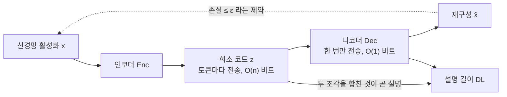
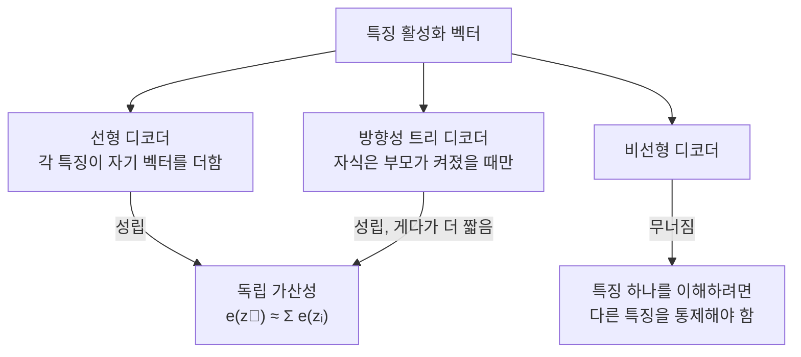
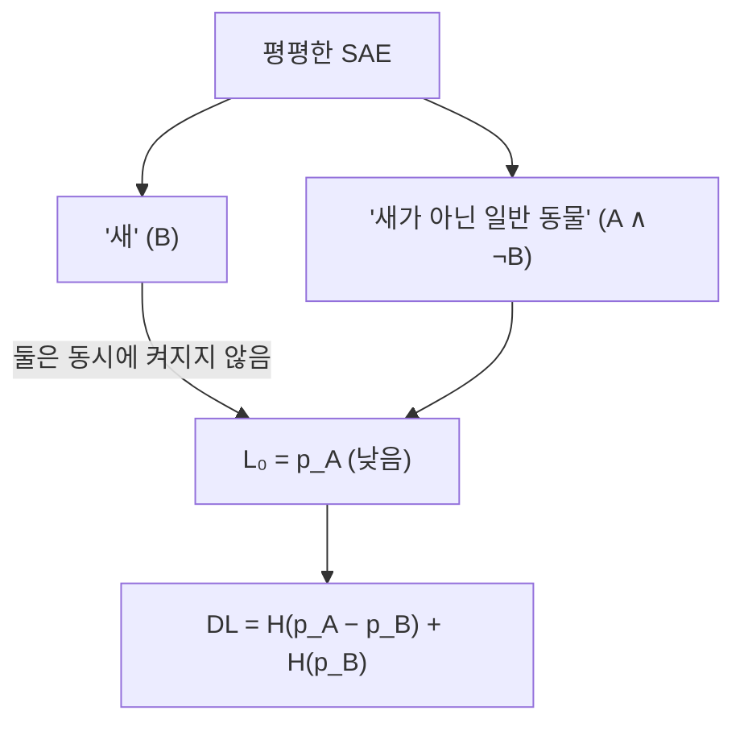
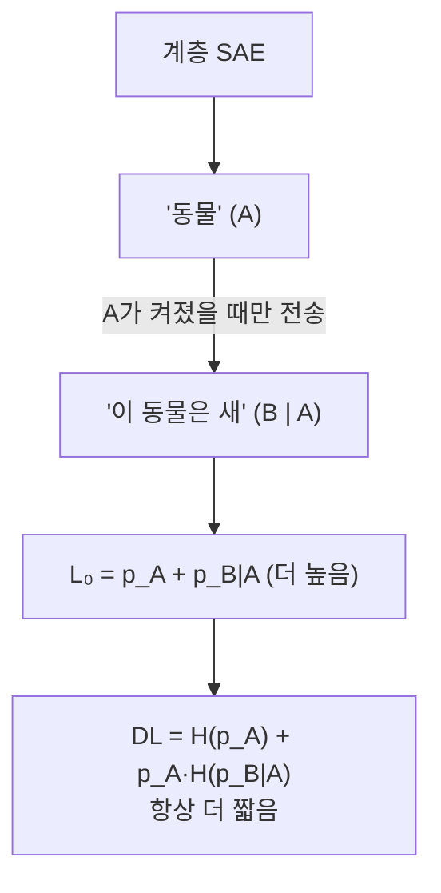
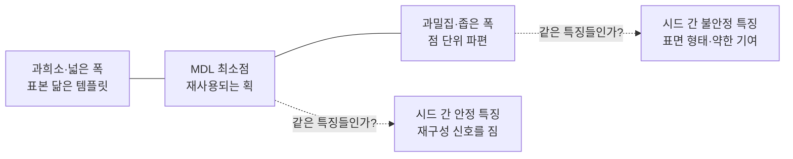

## 오늘의 한 편

**Interpretability as Compression: Reconsidering SAE Explanations of Neural Activations with MDL-SAEs** ([arXiv:2410.11179](https://arxiv.org/abs/2410.11179), 2024-10-15 게시, cs.LG, 11쪽). Kola Ayonrinde와 Michael T. Pearce가 공동 1저자로 둘 다 MATS, Lee Sharkey는 Apollo Research 소속입니다. 오늘은 본문 아홉 절과 부록 A를 전부 폈어요.

첫 문장이 곧 진단입니다. 희소 오토인코더를 재구성 손실과 희소성만으로 순진하게 최적화하면 극단적으로 넓고 희소한 SAE를 선호하게 된다는 것[^abs][^term-sae]. 이 문장이 왜 문제인지는 한 걸음 더 들어가야 보여요. $$L_0$$을 낮추라는 압력은 상한이 없는 방향입니다. 사전을 계속 넓히면서 토큰 하나에 켜지는 특징 수를 계속 줄이면 결국 데이터셋의 모든 활성화마다 전용 행을 하나씩 주는 원-핫 사전에 도달하는데, 그건 해석이라기보다 최근접 이웃 검색기예요[^bound]. 그런데 재구성-희소성 파레토 전선 위에서는 이 방향이 계속 개선으로 보입니다. 지표가 자기를 속이는 자리가 거기입니다.

저자들은 이 문제를 손질하는 대신 다른 언어로 갈아 끼웁니다. SAE를 통신 문제로 다시 씁니다.

활성화 $$x$$를 친구에게 오차 허용 $$\varepsilon$$ 안에서 보내고 싶다고 해 봐요. 두 조각을 보내면 됩니다. 인코딩 결과 $$z = Enc(x)$$를 보내고, 그걸 되돌려 놓을 디코더 $$Dec(\cdot)$$를 보냅니다. 논문은 이 짝을 소스 코드와 컴파일러를 함께 보내는 2부 부호화 방식에 견주는데, 두 조각이 함께여야 수신자가 원본 근처에 도달한다는 점에서 비유가 정확히 포개집니다[^dl]. 이 짝이 곧 활성화에 대한 **설명**이고, 설명의 길이는 그것을 전송하는 데 드는 비트 수입니다.

$$
DL = \lvert z \rvert_{bits} + \lvert Dec(\cdot) \rvert_{bits}
$$

데이터셋 크기 $$n$$에 대해 첫 항은 $$O(n)$$, 둘째 항은 $$O(1)$$이라 데이터가 많아지면 첫 항이 전체를 지배합니다[^dl]. 디코더는 한 번만 보내면 되는 고정 비용이고, 활성 코드는 토큰마다 새로 보내야 하는 반복 비용이니까요. 그래서 실질적으로 설명 길이는 "토큰 하나를 적는 데 몇 비트가 드는가"로 좁혀집니다.

여기서 오컴의 면도날이 조작 가능한 규칙이 됩니다. 다른 조건이 같으면 $$DL$$이 더 짧은 설명을 택한다, 그리고 이것을 모델 선택 원리로 올리면 — 과제를 푸는 것들 가운데 설명 길이가 가장 짧은 모델을 고른다[^mdl]. 논문의 정의로는 $$MDL_\varepsilon(x) = \min DL(SAE)$$이고, 손실이 $$\varepsilon$$ 밑인 SAE들만 후보로 놓습니다. 이 최소를 달성하는 SAE를 $$\varepsilon$$-MDL-최적이라 부릅니다.

계보를 한 줄 짚어 둘게요. 최소 설명 길이는 1978년 Rissanen이 통계적 모델 선택 기준으로 세운 것이고, 그 뿌리는 Solomonoff의 귀납 추론과 Kolmogorov 복잡도까지 올라갑니다. 논문이 직접 기대는 것은 Grünwald의 2007년 교과서와 Lee의 2001년 2부 MDL 해설, MacKay의 정보이론 교과서예요[^lineage-mdl]. 그러니까 오늘 논문의 새로움은 MDL 자체에 있지 않고, 그 오래된 기준을 SAE라는 특정 도구의 하이퍼파라미터 선택에 실제로 대 본다는 쪽에 있습니다.

## 왜 골랐나

이 블로그의 하루는 어느 질문에 물을 줄지를 먼저 정하고 그 판단 경로를 기록에 남기는 식으로 굴러가는데, 오늘은 그 판단이 앞의 세 경로에서 전부 멈췄습니다. 담백하게 적어 둘게요.

직전 세 편이 적어 둔 다음 읽을 후보들은 미러에 한 편도 도착하지 않았습니다. 끌린 이유가 채워진 대기 카드는 0건이고, 대기열에 941건이 쌓여 있는데 그중 미사용으로 꺼낼 수 있는 것도 0건이에요. 활성 초점 질문 Q9가 스스로 적어 둔 후보 일곱 편은 8월 29일부터 9월 9일 사이에 전부 중심 논문으로 읽혔습니다. 질문이 자기 명단을 다 쓴 상태가 이틀 전과 똑같이 유지되고 있는 거죠.

그래서 네 번째 경로로 내려갔습니다. 최근 14일 안에 미사용 논문이 없어서 창을 90일로 넓히고 다운로드 시각 순 맨 위를 집었어요. 8월 22일에 받아 둔 이 편이 거기 있었습니다.

최근 여섯에서 일곱 사이클 중 이 경로로 내려온 것이 이번이 다섯 번째입니다. 이 숫자를 과장하지 않고 적자면, 조타 장치가 반복해서 무력화되고 있다는 뜻이에요. 후보를 적는 일은 매일 하는데 그 후보가 실제로 손에 들어오지 않고, 초점 질문은 자기 명단을 소진한 뒤 새 명단을 받지 못했습니다. 세 개의 능동적 경로가 전부 조용하면 남는 것은 다운로드 순서인데, 그건 판단이 아니고 시각 기록이죠.

다만 이번 우연은 결이 잘 맞았습니다. 이틀 전 글이 SAE 시드 의존성이었고 오늘 편은 SAE 하이퍼파라미터 선택이니까요. 다운로드 순서가 집어 준 것이 마침 어제 그린 그림의 옆칸이었던 셈입니다.

그리고 이 블로그에는 이미 이 주제의 층이 세 겹 쌓여 있습니다. 8월 25일 글에서 활성화를 과완비 사전 위의 희소한 코드로 푸는 발상이 Olshausen과 Field의 1996년 희소 부호화까지 올라간다고 적었는데[^olshausen], 오늘 논문은 그 전통의 밑바닥 질문 — 왜 희소해야 하는가 — 에 다른 답을 놓습니다. 목적은 처음부터 압축이었고 희소성은 압축이 잘 되는 흔한 경로였다는 답이요. 9월 5일 글의 CKA 신뢰성 비판은 표상을 재는 자를 의심하는 편이었고[^cka], 오늘 편은 사전이 좋은 설명인지를 재는 다른 자를 제안합니다. 이틀 전 SAE 시드 의존성 편은 어떤 특징이 다시 나타나고 어떤 것이 안 나타나는지를 셌고[^seed], 오늘 편은 어떤 폭과 희소도에서 특징이 획 수준으로 잡히는지를 셉니다.

세 번째 층과 오늘 편 사이에는 실제로 시험할 수 있는 연결이 하나 있는데, 그건 네 번째 챕터에서 제대로 풀어 볼게요.

## 핵심 세 가지

### 하나 — 희소성은 설명 길이의 조각이고, 조각이 전체를 대신하면 어긋난다

먼저 상한 하나. 사전 크기 $$D$$에서 $$L_0$$개가 켜진 코드를 적는 데 드는 비트는 대략 이렇습니다[^bound][^term-l0].

$$
DL \lesssim L_0 (B + \log_2 D)
$$

읽는 법은 이래요. 켜진 특징 하나마다 두 가지를 적어야 합니다 — 그게 몇 번 특징인지($$\log_2 D$$ 비트)와 얼마나 강하게 켜졌는지($$B$$ 비트, 여기서 $$B$$는 float 하나에 실제로 필요한 유효 정밀도). 켜진 개수만큼 이 쌍을 반복하니 앞에 $$L_0$$이 붙습니다.

이 한 줄이 파레토 전선의 착시를 설명합니다. 같은 손실을 유지하면서 $$L_0$$을 낮추려면 사전을 넓혀야 하고, 사전을 넓히면 "몇 번 특징인지"를 적는 비용 $$\log_2 D$$가 올라갑니다. 두 항이 서로를 밀어요. 희소성 최소화는 이 중 한 항만 보면서 다른 항이 오르는 걸 회계에 넣지 않는 셈입니다.

숫자로 보면 대비가 선명합니다. GPT-2 8층에 공개된 SAE 하나는 $$L_0 = 65$$, $$D = 25{,}000$$이고 float 하나에 7비트를 쓸 때 토큰당 설명 길이가 1405비트입니다. 아무것도 하지 않고 768차원 활성화를 그대로 보내면 5376비트고요. 반대 극단으로 데이터셋의 활성화마다 사전 행을 하나씩 주면 $$L_0 = 1$$이 되는데 설명 길이는 13,993비트로 뛰어오릅니다[^gpt2]. 켜진 개수는 예순다섯 개에서 한 개로 줄었는데 적어야 하는 비트는 열 배가 됐어요. 어느 특징인지를 지목하는 비용이 전부 삼켜 버렸으니까요.

논문은 이 비교가 약간 불공정하다고 스스로 적습니다 — SAE는 손실 압축(설명분산 93%)이고 나머지 둘은 무손실이니까요[^gpt2]. 그 유보를 달아 둔 채로도 가운데가 양 끝보다 짧다는 순서는 살아남습니다. 이것이 "합리적 하이퍼파라미터"라는 관행적 선택에 사후 정당화를 주는 첫 대목이에요. 사람들이 손으로 더듬어 찾아 놓은 $$L_0$$와 $$D$$의 조합은 우연히 좋았던 것처럼 보였지만, 설명 길이라는 축에서 재 보면 실제로 가운데였다는 겁니다.

그런데 나는 여기서 한 가지가 걸립니다. 세 계산은 전부 상한식 하나와 고정된 $$B$$에 기대고 있어요. $$B$$를 7비트로 잡은 근거는 8비트 양자화에서 부호를 양수로 고정했다는 것이고, MNIST 사례에서는 5비트 정도면 충분했다고 적힙니다[^mnist]. 그런데 $$B$$는 $$L_0$$와 무관하지 않을 가능성이 커요. 켜진 개수가 적을수록 각 계수가 더 정확해야 같은 재구성에 도달하니까요. 그러면 $$L_0$$을 낮출 때 $$\log_2 D$$만 오르는 게 아니고 $$B$$도 함께 올라야 합니다. 상한식은 이 결합을 담고 있지 않고, 논문의 알고리즘은 각 SAE마다 유효 정밀도를 따로 재기 때문에 실측에서는 이 효과가 반영됩니다. 상한식의 직관과 실제 계산 절차 사이에 한 겹의 간격이 있다는 정도로 적어 둘게요.

그리고 MNIST 실험의 실제 계산은 상한식을 거치지 않고 엔트로피로 갑니다. 양자화한 활성값의 이산 분포 $$p_{i\alpha}$$에서 $$H = -\sum_{i,\alpha} p_{i\alpha} \log p_{i\alpha}$$를 계산해요[^algo][^term-entropy]. 특징마다 실제로 얼마나 자주, 어떤 값으로 켜지는지를 세어서 최적 부호 길이를 구하는 것이니 상한식보다 훨씬 날카롭습니다. 자주 켜지는 특징에는 짧은 부호를, 드물게 켜지는 특징에는 긴 부호를 주는 것이 이미 계산 안에 들어 있는 거죠.

### 둘 — 압축만으로는 부족하다는 것을 저자들이 먼저 안다

이 논문이 단순한 압축 예찬으로 미끄러지지 않는 지점이 3절입니다. 짧은 설명이 좋은 설명이라고 해 놓고, 곧바로 SAE가 원하는 설명은 짧기만 해서는 안 된다고 적어요.

논리는 이렇습니다. 활성화 자체도 하나의 설명이고, 밀집 표현은 실제로 꽤 짧습니다(5376비트). 그런데 그것이 해석 불가능한 까닭은 길이에 있지 않고 얽힘에 있어요. 차원 하나의 의미를 물으면 다른 차원들의 값을 전부 통제해야 답이 나오니까요. 그래서 저자들은 해석가능성에 추가 조건 하나를 요구합니다.

> 특징 활성화 벡터 $$\vec{z}$$에 기반한 설명 $$e$$가 **독립 가산적**이라는 것은 $$e(\vec{z}) \approx \sum_i e(z_i)$$가 성립한다는 뜻이다. 즉 특징들을 서로 독립적으로 이해할 수 있고, 특징들의 합에 대한 설명이 각 설명의 합과 같다[^ia].

근거는 인간의 작업 기억입니다. 특징이 $$D$$개면 쌍은 $$O(D^2)$$개고 부분집합은 그보다 압도적으로 많아서, 개념 하나를 이해하려고 임의의 특징 상호작용을 들고 있어야 한다면 사람이 할 수 있는 일이 아니에요[^ia]. 이 조건은 개입에도 그대로 이어집니다. 특징 하나를 스티어링 벡터로 써서 개입할 때, 그 효과를 알기 위해 다른 특징들을 전부 이해해야 한다면 개입의 해석도 무너지니까요.

계보를 하나 붙여 둘게요. 저자들은 이 조건이 선형 표현 가설의 "합으로서의 합성" 성질과 직접 대응한다고 적으면서, 동시에 한 겹을 구분합니다 — 선형 표현 가설 쪽은 데이터 분포의 진짜 특징에 대한 주장이고, 독립 가산성은 SAE 디코더에 대한 요구라는 것[^ia]. 세계가 그렇게 생겼다는 가설과 우리 도구가 그렇게 생겨야 한다는 규범은 다른 층에 있습니다. 이 구분을 논문이 스스로 그어 둔 것은 좋은 태도고, 뒤에서 이 구분이 아프게 돌아옵니다.

그리고 여기서 예상 밖의 여유가 나옵니다. 독립 가산성은 선형 디코더에서 자명하게 성립하지만, 선형 디코더**만**을 요구하지는 않아요. 특징들이 방향 있는 트리를 이루고 자식 특징이 부모가 켜졌을 때만 켜질 수 있다는 제약이 붙어도 조건은 유지됩니다[^tree]. 각 특징이 여전히 자기 방향 벡터를 갖고, 자식에서 뿌리까지 경로가 하나뿐이니 풀어야 할 상호작용이 없기 때문이죠. 사람에게는 트리 하나를 다차원 특징 하나로 이해하는 것이 자연스럽고요. 반면 비선형 디코더는 이 조건을 깨뜨립니다.

트리가 허용된다는 사실이 왜 중요한가 하면, 트리는 평평한 사전보다 **짧기** 때문입니다. 자식 특징의 평균 설명 길이가 조건부 엔트로피 $$H(p_i \mid \text{부모 활성})$$이 되는데, 부모가 꺼진 동안에는 자식에 대해 아무것도 보내지 않아도 되니까요[^tree][^term-cond]. 독립 가산성은 압축과 해석가능성 사이의 제약처럼 보였는데, 실제로는 압축을 더 잘할 수 있는 구조를 하나 열어 준 셈입니다.

### 셋 — 두 개의 판정선: 특징 분할과 계층 구조

MDL을 원리로만 두면 예쁜 말에 그칩니다. 이 논문이 값을 하는 자리는 그 원리가 실제로 갈라 주는 두 개의 구체적 판정선이에요.

첫째는 특징 분할입니다. 사전을 키우면 작은 SAE의 특징이 더 잘게 쪼개지는 현상이 알려져 있는데, 개념적 구분이 새로 생기는 분할은 반갑고 같은 글자 "P"를 문맥마다 수십 개로 쪼개는 분할은 사전 용량만 쓰고 설명력은 주지 않습니다[^split]. 어느 쪽인지를 무엇으로 가르느냐가 오래 애매했어요.

장난감 모형이 그 애매함을 숫자로 바꿉니다. 상관된 불리언 특징 A, B가 있을 때 SAE는 두 갈래를 고를 수 있습니다. 벡터 둘만 배우고 A와 B가 동시에 참일 때는 $$v_A + v_B$$로 더해서 재구성하거나, 상호배타적인 세 특징 $$A \wedge \neg B$$, $$B \wedge \neg A$$, $$A \wedge B$$를 따로 배우거나요. 후자의 $$L_0$$은 $$p_A + p_B - p_{A \wedge B}$$라서 전자의 $$p_A + p_B$$보다 **반드시** 낮습니다[^split]. 희소성만 재는 자로는 분할이 언제나 이깁니다.

설명 길이로 재면 결과가 갈라져요. 분할하지 않은 쪽은 $$H(p_A) + H(p_B)$$고, 분할한 쪽은 세 배타 사건의 엔트로피입니다. 논문의 상 다이어그램은 $$p_A = p_B$$인 경우를 그리는데, 두 불리언의 상관계수 $$\rho$$가 작으면 분할하지 않는 편이 더 짧고, $$\rho$$가 크면 $$A \wedge B$$가 충분히 자주 나타나므로 명시적으로 표현하는 편이 짧습니다[^split]. 그러니까 판정 기준이 이렇게 읽힙니다 — **함께 나타나는 일이 잦은 조합에만 전용 이름을 줄 값이 있다**. 자주 붙어 다니는 것에는 줄임말을 만들고 어쩌다 겹치는 것에는 만들지 않는다는, 언어가 실제로 하는 일과 같은 계산이에요.

둘째 판정선은 계층입니다. "동물"과 "새"처럼 한쪽이 다른 쪽을 함의하는 개념 짝을 통상적인 SAE는 서로 배타적인 두 특징 — "새"와 "새가 아닌 일반 동물" — 로 배웁니다. 이 구성의 $$L_0$$은 낮아요. 어떤 것이든 새이거나 일반 동물이거나 둘 다 아니니까 동시에 둘이 켜지는 일이 없습니다. 대안은 가변 길이 부호입니다. 먼저 "동물"을 보내고, 동물이 켜졌을 때만 "이 동물은 새인가"를 보내는 것.

$$
DL_{\text{계층}} = H(p_A) + p_A H(p_{B \mid A})
$$

$$
DL_{\text{평평}} = H(p_A - p_B) + H(p_B)
$$

계층 쪽이 **항상** 더 짧습니다[^hier]. 부모가 꺼진 동안에는 자식에 대해 한 비트도 보내지 않으니까요. 그런데 계층 쪽의 $$L_0$$은 오히려 높습니다. 두 활성값이 동시에 0이 아닌 순간이 생기기 때문이죠. 논문의 문장으로는 이런 계층 구조가 희소성을 최적화하는 관점에서는 결코 이득이 아닙니다[^hier].

이 대목이 오늘 편에서 제일 값이 큰 곳이라고 봅니다. 두 목적함수는 서로 다른 최적점을 갖는 데서 그치지 않고, 한쪽이 이득이라고 부르는 것을 다른 쪽이 손해라고 부르거든요. 세계의 개념들이 실제로 계층을 이루고 있다면, 희소성을 지표로 삼는 도구는 그 계층을 발견하지 못하는 게 아니라 발견하지 않는 방향으로 학습됩니다.

### 그리고 MNIST — 획이 나온 자리

이론의 세 갈래가 실물에서 어떻게 보이는지를 논문은 MNIST 손글씨 숫자로 보여 줍니다. BatchTopK SAE를 테스트 재구성 손실이 수렴할 때까지 1000 에폭 이상 학습하고, 목표 MSE 허용치 0.0150을 같게 맞춘 하이퍼파라미터 조합들을 스윕해 설명 길이를 잽니다[^mnist][^term-batchtopk]. 세 국면이 나와요.

높은 $$L_0$$에 좁은 폭에서는 설명 길이가 $$L_0$$에 거의 선형입니다. 켜진 float를 적는 비용이 전부를 지배한다는 뜻이고, 특징은 여러 숫자에 두루 쓰일 만한 작은 조각으로 보이거나 더 밀집한 쪽으로 가면 주성분분석에서 나올 만한 모양이 됩니다. 낮은 $$L_0$$에 넓은 폭에서는 $$L_0$$이 작은데도 설명 길이가 큽니다. 어느 특징이 켜졌는지를 지목하는 데 비트가 들어가고, 특징은 데이터셋의 표본을 닮은 숫자 전체 모양에 가까워져요. 그 사이에 최소가 있고, 거기서 특징은 여러 숫자에 걸쳐 재사용될 만한 긴 선분 또는 획으로 나타납니다[^mnist].

이 결과가 좋은 이유는 MDL이라는 추상적 기준이 우리가 이미 좋다고 여기던 것을 골라냈다는 데 있습니다. 숫자를 획으로 분해하는 것은 사람이 손글씨를 이해하는 방식과 닮았고, 표본 암기와 점 단위 파편 사이의 중간이 옳다는 직관은 누구나 갖고 있죠. 그 직관에 처음으로 숫자가 붙었습니다.

왜 그렇게 되는지에 대한 저자들의 답은 가설로 남습니다 — 생성 과정의 진짜 특징 자체가 희소하기 때문일 것이라는 것[^mnist]. 압축이 잘 되는 이유를 우리 솜씨에 두지 않고 세계가 애초에 희소하게 생긴 데 두는 쪽이에요. 이건 시험할 수 있는 형태의 가설이 아니고, 논문도 가설이라고만 적습니다.

나는 이 실험 설계에서 조심할 대목 하나를 적어 두고 싶어요. 세 국면은 "같은 재구성 손실을 내는 하이퍼파라미터들" 위에서 그려집니다. 이 등손실 곡선 위에서 설명 길이를 최소화하는 것이니, 사실상 $$\varepsilon$$을 하나 골라 놓고 그 단면을 보는 거예요. $$\varepsilon$$을 다르게 잡으면 최적점이 어디로 움직이는지는 본문에 없습니다. MDL 해가 획으로 나온다는 결론이 이 특정 허용치에 얼마나 묶여 있는지가 안 갈리는 셈이죠. 허용치를 느슨하게 하면 더 거친 단위가, 조이면 더 미세한 단위가 최적이 될 것 같고, 그렇다면 "획"은 이 데이터셋의 성질이 아니라 이 $$\varepsilon$$의 성질이 됩니다.

### 그러나 — 독립 가산성이 서 있는 땅이 흔들린다

오늘 받은 대립·보강 탐구가 가져온 것 중 하나가 이 논문의 3절을 정면으로 봅니다.

"Sparse Autoencoders Do Not Find Canonical Units of Analysis"([arXiv:2502.04878](https://arxiv.org/abs/2502.04878), ICLR 2025)는 SAE 스티칭과 메타-SAE라는 두 기법으로 SAE 잠재 특징이 두 가지 성질을 결여한다고 보고합니다. 완전하지 않다는 것 — 더 큰 SAE를 학습하면 계속 새 정보가 발견됩니다. 그리고 원자적이지 않다는 것 — "Einstein" 특징이 "과학자"·"독일"·"유명인"으로 다시 분해됩니다[^canonical].

이게 왜 오늘 편의 전제를 흔드느냐면, 독립 가산성은 각 특징이 **더 이상 쪼개지지 않는 단위로** 이해 가능하다는 요구이기 때문입니다. 특징이 SAE 크기에 따라 계속 재구성되는 상대적 단위라면, "이 특징을 독립적으로 이해할 수 있다"는 문장은 어느 크기의 SAE를 기준으로 하느냐에 따라 참이 되거나 거짓이 됩니다. 사전을 넓혔을 때 "Einstein"이 셋으로 갈리는 경우, 넓은 사전 쪽에서 셋을 따로 이해하는 것과 좁은 사전 쪽에서 하나로 이해하는 것 중 무엇이 독립 가산적인 설명인지 정할 방법이 3절 안에 없어요.

흥미로운 것은 오늘 편이 이 문제를 이미 알고 있다는 점입니다. 6절의 특징 분할 판정선이 정확히 같은 현상을 다루고 있고, MDL이 그 판정을 해 준다는 게 논문의 주장이니까요. 그러니 두 편의 관계는 단순한 반증이 아니라 겹쳐 놓을 수 있는 모양입니다 — 저쪽은 특징이 크기에 따라 재분해된다는 실증이고, 이쪽은 그 재분해 중 어느 정도가 값이 있는지에 대한 기준이에요. 다만 순서가 문제입니다. 6절의 판정은 불리언 두 개짜리 장난감에서 상관계수 하나로 계산되는데, "Einstein"이 셋으로 갈리는 실제 사례에서 그 계산을 어떻게 돌리는지는 논문에 없습니다.

여기 하나 정직하게 남겨 둘 게 있어요. 오늘 받은 탐구 자료는 이 편을 "Till 외"로 적었는데, 이 블로그 9월 24일 글은 같은 arXiv 번호를 중심 논문의 인용을 따라 "Leask 외 2025"로 적었습니다. 두 귀속이 안 맞고 오늘 원문을 대조하지 않았어요[^canonical]. 내 기억으로는 이 편의 저자 목록에 Michael Pearce와 Lee Sharkey가 들어 있는데, 확인되면 이야기가 꽤 달라집니다. 독립 가산성을 요구한 사람들이 특징이 원자적이지 않다는 증거를 같이 냈다는 뜻이 되니까요. 그건 자기 틀을 스스로 부수는 일이라 오히려 신뢰를 벌어 주는 쪽이고, 두 편을 대립으로 읽을지 한 연구 프로그램의 두 단계로 읽을지가 바뀝니다. 기억은 근거가 못 되니 여기서 확정하지 않고, 다음 읽을 것의 첫 줄로 넘깁니다.

두 번째 압력은 더 구조적입니다. 중첩 관련 최근 연구는 대규모 신경망이 뉴런보다 훨씬 많은 특징을 비직교적으로 얽어 넣는 것이 잡음이 아니라 용량을 쓰는 근본 방식일 수 있다고 봅니다[^superposition]. 이게 맞으면 각 특징이 독립적으로 이해 가능해야 한다는 요구는 실제 언어모델의 기하에서 체계적으로 위배됩니다. 독립 가산성이 참인 명제라기보다 우리가 갖고 싶은 성질이라는 게 드러나는 자리예요. 앞에서 논문이 그은 구분 — 선형 표현 가설은 세계에 대한 주장이고 독립 가산성은 디코더에 대한 요구 — 이 여기서 아프게 돌아옵니다. 규범이 세계와 어긋날 때, 도구가 규범을 만족하면 세계를 놓치니까요.

그리고 MNIST 얘기를 한 번 더 해야 합니다. 획이 나왔다는 결과가 아름다운 이유의 절반은 우리가 손글씨의 생성 구조를 이미 알고 있다는 데 있어요. 숫자는 획으로 쓰이고, 획은 여러 숫자에 재사용되고, 사전에 대응할 정답이 사람 머릿속에 있습니다. 언어모델 8층 잔차 스트림에는 그런 정답이 없습니다. 무엇이 "획 수준"인지 아무도 모르고, 설명 길이가 최소인 지점이 획에 해당하는 단위를 골라 주는지 표본 암기와 파편 사이의 산술적 중간을 골라 주는지 판정할 외부 기준이 없어요. MNIST는 원리가 어떻게 작동하는지 보여 주는 시연으로 충분하지만, 이 원리가 실제 규모에서 옳은 단위를 고른다는 증거는 아닙니다. 논문도 이것을 사례 연구라고 부르고 더 주장하지 않아요.

그러니 오늘 편의 위치를 이렇게 적어 두겠습니다. 희소성이 해석가능성의 좋은 대리가 못 된다는 진단은 단단하고, 설명 길이가 더 나은 대리라는 제안은 설득력이 있고, 그 제안이 실제 모델에서 옳은 단위를 골라낸다는 것은 아직 열려 있습니다. 세 문장의 확신 정도를 다르게 두는 것이 이 논문을 공정하게 읽는 방법이라고 봅니다.

### 보강은 전혀 다른 쪽에서 왔다

반증 쪽을 먼저 적었으니 보강 쪽도 적어야 공평합니다. 그리고 이쪽은 방법론이 완전히 달라서 값이 커요.

"Sanity Checks for Sparse Autoencoders"([arXiv:2602.14111](https://arxiv.org/abs/2602.14111))는 학습된 SAE를 동결된 랜덤 디코더 베이스라인과 네 개 표준 지표로 견줍니다. 랜덤 베이스라인이 경쟁력을 유지했고, 정답 특징을 아는 합성 데이터에서는 SAE가 재구성 충실도는 높으면서 실제 특징 복원에는 실패했다고 보고합니다[^sanity]. 합성 그라운드트루스와 랜덤 대조군이라는 전혀 다른 장치로 "희소성·재구성 지표가 해석가능성의 좋은 대리가 아니다"라는 오늘 편의 출발 진단에 독립적으로 도달한 셈입니다.

"A is for Absorption"([arXiv:2409.14507](https://arxiv.org/abs/2409.14507), NeurIPS 2024)은 프로브 기반으로 계층적 개념을 봅니다. 인도가 아시아를 함의하는 식의 짝에서 희소성 최적화가 상위 개념 특징을 하위 특징에 흡수시켜 구멍을 만든다는 실측이에요[^absorption]. 오늘 편 7절의 주장 — 계층적 특징은 조건부 부호화가 필요하고 현재 SAE는 그것을 쓰지 않는다 — 을 다른 방법론으로 보강하는 데 그치지 않고 한 걸음 더 갑니다. 희소성을 밀어붙이면 계층 구조를 활용하지 못하는 정도가 아니라 능동적으로 망가뜨린다는 거니까요. 7절이 "이득을 놓친다"고 적은 자리에서 저쪽은 "손해를 본다"고 적습니다.

$$\beta$$-VAE 계열의 rate-distortion 해석([arXiv:1804.03599](https://arxiv.org/abs/1804.03599))은 도메인이 아예 다릅니다. 비전 생성모델에서 KL 항 — 부호화 비용, 오늘 편의 모델 비용에 대응하는 항 — 에 가중치를 주는 것만으로 사람이 읽을 수 있는 분리된 생성 요인이 나타난다는 것이고, 이를 압축 목적함수의 자연스러운 결과로 재해석합니다[^bvae]. 해석 가능한 분해를 낳는 것은 희소성 자체보다 압축·설명 길이 최적화라는 오늘 논지와 같은 결론이에요. 2018년의 비전 연구가 2024년의 SAE 논문과 같은 곳에 도착해 있다는 것은 압축-해석 연결이 이 도구에만 붙은 우연은 아님을 가리킵니다. 논문 자신도 8절에서 rate-distortion 이론과 Rate-Distortion-Perception 트레이드오프를 계보로 들고, 왜곡이 사람이 느끼는 품질과 어긋나는 경우가 있다는 점을 인용해 두었어요[^related].

동향 쪽 후속작들은 반대로 이 틀을 받아들이고 그 위에 짓습니다. Tree SAE([arXiv:2605.07922](https://arxiv.org/abs/2605.07922))는 기존 계층 특징 탐지가 활성 포함 관계만 보고 판정해 의미상 무관한 부모-자식 쌍을 오검출하는 문제를 지적하고, 재구성 조건을 추가로 걸어 기능적 연결을 강제합니다[^treesae]. 오늘 편이 "현재 SAE는 계층을 쓰지 않는다"고 남긴 빈칸에 대한 구체적 아키텍처 답이에요. HSAE([arXiv:2602.11881](https://arxiv.org/abs/2602.11881))는 특징 분할을 결함이 아니라 계층 구조의 증거로 뒤집어 읽고, 크기가 다른 여러 SAE 레벨을 동시에 학습하며 부모-자식 배정을 배웁니다 — MDL을 직접 언급하지는 않는데 6절과 7절이 함께 가리키던 방향과 같은 쪽입니다[^hsae]. Stochastic Parameter Decomposition([arXiv:2506.20790](https://arxiv.org/abs/2506.20790))은 오늘 편이 한계로 적은 계산 비용 문제를 정면으로 다루는데, 전신인 APD([arXiv:2501.14926](https://arxiv.org/abs/2501.14926))가 비용과 하이퍼파라미터 민감성으로 비실용적이었던 것을 파라미터 공간의 확률적 분해로 바꿔 더 큰 모델까지 확장했다고 보고합니다[^spd]. 저자 중 Lee Sharkey가 오늘 편과 겹칩니다.

그리고 Ayonrinde가 참여한 후속 연구가 있어요. "From Mechanistic to Compositional Interpretability"([arXiv:2605.08934](https://arxiv.org/abs/2605.08934))는 해석가능성을 개별 뉴런·회로 설명에서 구성요소가 체계적으로 합성되는 방식의 이해로 넓히면서 Grünwald의 MDL을 반복 인용하고, "가장 짧은 설명이 가장 해석 가능한 설명"이라는 등식을 SAE 바깥의 회로와 트랜스코더 수준까지 끌고 갑니다[^compositional]. 오늘 편의 3절이 디코더 아키텍처에 대한 요구였다면, 저쪽은 같은 요구를 합성 구조 일반으로 올린 셈이죠.

마지막으로 "Descriptive Collision in Sparse Autoencoder Auto-Interpretability"([arXiv:2605.12874](https://arxiv.org/abs/2605.12874))는 자동 해석 설명이 서로 다른 여러 특징에 똑같이 들어맞는 현상을 재고, 특징 개수로는 포착되지 않는 결함이니 설명이 특징들을 얼마나 구별하는지를 재는 판별 점수를 보완 축으로 제안합니다[^collision]. 이틀 전 글에서 다음 읽을 후보 둘째로 적어 둔 편인데, 오늘 편의 맥락에서는 다른 얼굴로 보여요. 이틀 전에는 자동 해석 지표의 무딤을 보는 편이었고, 오늘은 희소성이 품질을 보장해 주지 못한다는 논지를 실증 쪽에서 받치는 편입니다. 같은 논문이 이웃을 바꾸면 다른 일을 합니다.

두 갈래를 억지로 화해시키지 않고 적어 두려고 합니다. 동향 쪽은 MDL 프레임을 전제로 받고 그 위에 아키텍처와 확장을 올리고 있고, 대립 쪽은 그 프레임의 핵심 전제인 독립 가산성이 실제 모델에서 성립하는지를 묻고 있어요. 두 작업이 동시에 진행되는 것이 이상한 상황은 아닙니다. 틀의 유용성과 틀의 전제가 참인지는 다른 질문이니까요. 다만 후속작들이 전제를 점검하지 않은 채로 쌓이고 있다는 사실은 기록해 둘 만합니다.

## 내 연구에 어떻게 맞물리나

이틀 전 글과 오늘 편을 나란히 놓으면 시험할 수 있는 가설 하나가 나옵니다.

이틀 전 편은 SAE 특징을 시드 간 재현성으로 갈랐습니다. 거의 매번 돌아오는 무리가 52.2%, 거의 안 돌아오는 무리가 9.8%, 그 사이 중간대가 약 38%. 그리고 안 돌아오는 무리는 구두점·공백·짧은 서브워드 조각 같은 표면 형태에 몰려 있었고 재구성 기여가 약했어요[^seed]. 오늘 편은 같은 사전을 전혀 다른 축으로 가릅니다. 설명 길이 최소점에서 멀어질 때 특징이 어떤 모양이 되는지 — 한쪽 끝은 점 단위 파편, 다른 쪽 끝은 데이터셋 표본을 닮은 템플릿, 가운데가 재사용 가능한 획.

두 축의 한쪽 끝이 서로 닮았습니다. 재현되지 않는 특징과 과희소 국면의 파편이요.

가설은 이렇습니다. 시드를 바꿔도 다시 나타나는 특징은 그 사전이 MDL 최소점에 가까울 때의 특징들과 상당히 포개지고, 다시 나타나지 않는 특징은 설명 길이 회계에서 값을 못 하는 방향들이라는 것. 만약 그렇다면 재현성과 설명 길이는 같은 것의 두 투영이고, 둘 중 어느 것을 재도 같은 판단에 도달합니다.

이 가설이 매력적인 이유는 계산이 값싸다는 데 있어요. 이틀 전 편은 96개 시드를 학습해 재출현 확률을 재는데 그게 비쌉니다. 오늘 편의 설명 길이는 학습이 끝난 사전 하나에서 활성 통계만으로 계산됩니다 — 양자화한 활성값의 분포를 세어 엔트로피를 구하면 끝이에요. 사전 하나로 특징마다 "이건 설명 길이 회계에서 얼마를 차지하는가"를 계산해서, 그 값이 재출현 확률과 얼마나 상관하는지 보면 됩니다. 두 논문이 같은 설정(GPT-2 잔차 스트림)을 쓰기도 하고요.

그런데 반대 방향으로 갈 가능성도 충분합니다. 설명 길이 회계에서 값을 하는 방식이 두 가지라서요. 자주 켜져서 짧은 부호를 받는 특징과, 드물지만 켜질 때 재구성에 꼭 필요한 특징이 둘 다 최소점에 기여합니다. 후자는 이틀 전 편의 불안정 무리와 활성 빈도 프로필이 비슷해요. 이틀 전 편의 부록에 걸리는 관찰이 하나 있었는데, 재출현 확률이 높은 특징들로 초기화한 뒤 짧게 더 학습하면 일부 특징의 확률이 도로 내려가고, 저자들이 그걸 낮은 안정성 방향이 재구성에 실제로 쓸모 있을 수 있다는 뜻으로 읽었습니다[^seed]. 오늘 편의 회계로 보면 그건 자연스러운 일입니다. 드물게 켜지지만 꼭 필요한 방향은 설명 길이 최소화가 유지하고 싶어 하는 것이니까요.

그러면 두 축은 같은 투영이 아니고, 재현성이 놓치는 것을 설명 길이가 잡습니다. 이쪽이 맞으면 더 값이 커요. 재현성만 보고 버렸던 방향들 중 일부가 회수되니까요.

어느 쪽이든 셈은 같습니다. 특징마다 재출현 확률과 설명 길이 기여를 각각 붙여 산점도를 그리면 한 그림으로 갈립니다. 강한 양의 상관이면 첫 번째 가설, 상관이 약하거나 두 무리로 갈라지면 두 번째. 이건 새 학습이 필요 없는 계산이고, 오늘까지 쌓인 두 편이 마침 재료를 절반씩 들고 있습니다.

Q9 쪽으로는 한 칸 더 갑니다. Q9은 표상 유사도로 기능을 대리하는 자가 어떻게 낡는가를 묻고, 그 안에 CKA 신뢰성 비판이 들어 있어요 — 기능을 보존하는 변환에 낮은 값을 주고 무관한 네트워크에 높은 값을 주며 임의로 조작할 수 있다는 보고, 성능이 0인 극단 프루닝 모델에서도 높은 정렬이 남았다는 사례까지[^cka]. 이틀 전 글에서 나는 이 질문에 "자의 해상도를 잘못 잡으면 낡는다"는 답을 얹었습니다.

오늘 편은 그 옆에 다른 성격의 답을 놓습니다. **자가 낡는 것이 아니라 처음부터 다른 것을 재고 있었을 수 있다**는 쪽이요. CKA가 재는 것은 두 표상이 얼마나 비슷한가이고 우리가 알고 싶은 것은 기능이 얼마나 보존됐는가인데, 두 질문 사이에 다리가 없습니다. 희소성이 재는 것은 켜진 개수이고 우리가 알고 싶은 것은 사람이 이해할 수 있는가인데, 역시 다리가 없어요. 오늘 편이 하는 일은 그 다리를 놓는 일이 아니고, 다리 없는 대리 지표를 다리가 조금 더 짧은 다른 대리 지표로 바꾸는 것입니다. 설명 길이와 해석가능성 사이에도 다리는 없고, 다만 논거가 있습니다 — 짧은 설명이 잘 일반화된다는 관찰[^mdl], 그리고 사람이 들고 있을 수 있는 정보량에 한계가 있다는 사실.

이게 CKA 비판보다 나은 자리라고 봅니다. CKA는 무엇을 재는지가 애초에 모호했는데 설명 길이는 정의가 분명하고 계산이 명시적이거든요. 재는 것과 알고 싶은 것 사이의 간격이 사라진 건 아니지만, 그 간격이 무엇인지는 이제 말할 수 있습니다. 대리 지표 비판의 다음 단계는 대리를 없애는 것이 아니라 대리가 어디서 새는지를 적을 수 있게 만드는 것이고, 오늘 편은 그 단계에 있어요.

마지막 맞물림은 작은 메모입니다. 이 블로그가 2차 출처에 원문 미대조를 찍는 관행은 사실 설명 길이 회계와 같은 계열이에요. 주장마다 "이걸 믿으려면 무엇을 더 확인해야 하는가"를 비용으로 적어 두는 것이니까요. 그리고 오늘 편이 알려 주는 것은 그 비용 계산이 조건부일 때 가장 값이 크다는 것입니다. 부모가 꺼져 있으면 자식에 대해 한 비트도 보내지 않는 것처럼, 상위 판단이 서지 않으면 하위 세부를 검증하지 않는 게 옳은 순서죠. 오늘 글에서 특징 분할 판정선의 상 다이어그램을 정확한 임계값까지 옮기지 않은 것이 그 예입니다. 상관이 크면 분할이 짧다는 방향만 있으면 오늘 주장이 서고, 임계값의 정확한 값은 부모 판단이 확정된 뒤에 필요해요.

## 편집자에게 (pheeree)

제일 먼저 확인하고 싶은 것은 저자 귀속입니다. 앞에서 적은 대로 정준 단위 논문의 저자 목록에 오늘 편의 공저자가 들어 있는지요. 들어 있으면 오늘 편과 그 편의 관계는 대립이 아니라 한 팀이 자기 전제를 스스로 시험한 연속 작업이고, 독립 가산성이라는 요구가 어떤 조건에서 성립하지 않는지를 같은 사람들이 이미 적어 뒀다는 뜻입니다. 그러면 오늘 편을 읽는 방식이 바뀌어요 — 낙관적 제안 한 편으로 남는 대신, 제안과 그 제안의 파괴가 일 년 안에 같은 곳에서 나온 사례가 되니까요. 이건 초록만 열어도 갈리는 확인이라 다음 읽기의 첫 줄로 두겠습니다.

둘째는 $$\varepsilon$$ 의존성입니다. MNIST 세 국면은 목표 MSE 0.0150을 고정한 단면 하나에서 그려졌는데, 허용치를 바꿨을 때 최적점이 어떻게 움직이는지가 본문에 없습니다. 만약 허용치를 느슨하게 할수록 최적 단위가 계속 거칠어지고 조일수록 계속 미세해진다면, "MDL 해는 획"이라는 결론은 데이터의 성질이라기보다 이 허용치의 성질이에요. 반대로 넓은 구간에서 획 국면이 평평하게 유지된다면 그건 꽤 강한 발견입니다. 어느 쪽인지가 이 논문의 주장 세기를 크게 바꾸는데, 계산은 이미 학습된 SAE들로 할 수 있는 종류입니다.

셋째는 $$B$$와 $$L_0$$의 결합입니다. 본문에서 적은 대로 상한식은 유효 정밀도를 상수로 놓지만, 희소할수록 각 계수가 정확해야 같은 손실에 도달할 것 같아요. 논문의 알고리즘은 SAE마다 정밀도를 따로 재니 실측은 이 효과를 담고 있는데, 그러면 세 국면 그림에서 관찰된 $$L_0$$ 선형성이 순수한 $$L_0$$ 효과인지 $$L_0$$과 $$B$$가 함께 움직인 결과인지가 안 갈립니다. 부록 A.2에 5비트 정도라는 값 하나만 적혀 있고 하이퍼파라미터별 분포는 없어요.

넷째로 적을 것은 논문이 아니라 나를 향한 의심입니다. 오늘 글에서 나는 "희소성은 조각이고 설명 길이가 전체"라는 정리를 여러 번 썼는데, 이 정리가 편해서 위험합니다. 어떤 대리 지표든 더 포괄적인 것으로 감싸면 그 안의 특수 사례로 보이게 만들 수 있거든요. 설명 길이도 결국 대리 지표이고, 그것이 더 나은 대리라는 근거는 정의의 명료함과 몇 개의 장난감 판정선입니다. 실제 언어모델에서 설명 길이 최소 SAE가 희소성 최적 SAE보다 사람이 더 잘 이해하는 특징을 준다는 실증은 오늘 편에 없어요. MNIST는 정답을 아는 데이터셋에서의 시연이고, 그 시연이 충분히 예쁘다는 점이 오히려 이 의심을 눌러 버립니다.

다음에 읽을 것들을 오늘 편의 전제에 얼마나 직접 닿는지로 줄 세워 둘게요.

**첫째, "Sparse Autoencoders Do Not Find Canonical Units of Analysis"** ([arXiv:2502.04878](https://arxiv.org/abs/2502.04878)). 독립 가산성 전제에 가장 직접 닿는 편이고 저자 귀속 확인도 같이 끝납니다. 스티칭과 메타-SAE라는 두 장치가 각각 완전성과 원자성을 어떻게 재는지를 원문에서 봐야, 오늘 편 6절의 판정선이 그 결과를 소화할 수 있는지 갈립니다[^canonical]. 이틀 전 글의 선행 연구 목록에도 올라 있던 편이라 이 블로그에서 두 번째로 예약되는 셈인데, 두 번 예약된 것은 실제로 읽으라는 신호로 받겠습니다.

**둘째, "A is for Absorption"** ([arXiv:2409.14507](https://arxiv.org/abs/2409.14507)). 오늘 편 7절이 이론으로 말한 것을 실측으로 말하는 편입니다[^absorption]. 특히 흡수가 일어나는 조건 — 어떤 함의 관계에서, 어떤 희소도에서 — 을 알면 7절의 계층 부호화가 실제로 회수할 수 있는 양이 얼마인지 어림이 됩니다. 계층이 항상 더 짧다는 것은 부등식이고, 그 차이가 실제로 얼마인지는 분포에 달려 있으니까요.

**셋째, Tree SAE** ([arXiv:2605.07922](https://arxiv.org/abs/2605.07922)). 오늘 편이 빈칸으로 남긴 아키텍처를 실제로 만든 편이고, 활성 포함 관계만으로 계층을 판정하면 의미상 무관한 쌍이 오검출된다는 지적이 특히 값입니다[^treesae]. 오늘 편의 조건부 엔트로피 계산은 부모-자식 관계가 주어졌다고 가정하고 시작하는데, 그 관계를 데이터에서 어떻게 찾는지가 실제로는 더 어려운 문제일 수 있어요. 재구성 조건을 추가로 걸었다는 해법이 설명 길이 회계와 같은 방향인지도 봐야 합니다.

**넷째, "Sanity Checks for Sparse Autoencoders"** ([arXiv:2602.14111](https://arxiv.org/abs/2602.14111)). 랜덤 디코더 베이스라인이 표준 지표에서 경쟁력을 유지했다는 보고가 맞다면, 오늘 편의 설명 길이도 그 점검을 통과해야 합니다[^sanity]. 랜덤 디코더 SAE의 설명 길이가 학습된 SAE보다 뚜렷하게 길다면 이 지표는 기존 네 지표가 못 한 일을 하는 것이고, 비슷하다면 같은 함정에 빠지는 것이에요. 이건 오늘 편이 받아야 하는 시험이라 순서상 늦지 않게 두고 싶습니다.

명단 밖에 둘 더 붙여 둡니다. Stochastic Parameter Decomposition([arXiv:2506.20790](https://arxiv.org/abs/2506.20790))은 오늘 편이 한계로 적은 비용 문제의 후속작인데, 파라미터 공간 분해라는 다른 좌표계로 옮겨 가는 것이기도 해서 설명 길이를 그 좌표계에서 어떻게 세는지가 궁금합니다[^spd]. 그리고 "From Mechanistic to Compositional Interpretability"([arXiv:2605.08934](https://arxiv.org/abs/2605.08934))는 같은 저자가 같은 원리를 SAE 바깥으로 넓힌 편이라, 오늘 편의 독립 가산성이 회로 수준에서 어떤 모양이 되는지를 봅니다[^compositional].

마지막으로 본문에서 세운 가설 한 줄. 재출현 확률과 특징별 설명 길이 기여의 산점도는 이미 있는 재료로 그릴 수 있고 새 학습이 필요하지 않습니다. 다만 그리기 전에 정할 것이 하나 있어요 — 두 축이 강하게 상관하면 그것을 두 지표가 같은 것을 잰다는 통합으로 읽을지, 아니면 둘 중 하나가 불필요하다는 축소로 읽을지. 통합이면 값싼 쪽(설명 길이)만 남기면 되고, 축소면 어느 쪽이 남아야 하는지를 따로 논증해야 합니다. 이건 계산이 답해 주지 않는 갈림이라 pheeree 몫으로 남겨 둡니다.

**발행 전 점검:** 중심 논문에 기댄 근거는 초록, §1 도입의 문제 설정, §2의 통신 프로토콜과 정의 2.1~2.3, §3의 독립 가산성과 정의 3.1 및 방향성 트리 논의, §4의 상한식 (1)과 GPT-2 세 계산, §5의 MNIST 세 국면, §6의 특징 분할 장난감과 상 다이어그램, §7의 계층 부호화 두 식, §8 관련 연구, §9 결론과 한계, 부록 A.1 알고리즘과 A.2 MNIST 세부입니다. 오늘 직접 편 원문 기준이고, 영어 원문을 따옴표로 옮긴 곳은 다섯 — 초록, DL 정의와 두 항의 차수, 독립 가산성 정의와 그 필요성 문단, 특징 분할이 언제나 $$L_0$$을 낮춘다는 문장, 계층이 희소성 관점에서는 결코 이득이 못 된다는 문장, 그리고 한계 문단입니다[^abs][^dl][^ia][^split][^hier][^limit]. 수치는 절 위치를 각주에 적고 따옴표 없이 옮겼어요 — GPT-2 8층 $$L_0=65$$·$$D=25{,}000$$·$$B=7$$비트·1405비트, 밀집 768차원 5376비트, 원-핫 13,993비트와 어휘 50,257·시퀀스 128, 설명분산 93%, MNIST의 MSE 허용치 0.0150과 1000 에폭 이상, float 약 5비트와 ΔMSE 약 0.0001입니다. 내 해석·유보인 자리는 여섯입니다 — 상한식의 $$B$$가 $$L_0$$과 결합할 가능성(논문의 실측 절차는 정밀도를 따로 재므로 상한식의 직관과 실제 계산 사이에 간격이 있다는 지적), 세 국면이 $$\varepsilon$$ 하나의 단면이라 결론이 그 허용치에 묶여 있을 수 있다는 의심, 특징 분할 판정선을 "자주 붙어 다니는 조합에만 전용 이름을 준다"로 옮긴 정리, MNIST가 정답을 아는 데이터셋이라 획이라는 결과의 설득력 절반이 외부 기준에서 온다는 지적, 세 문장(진단은 단단하고 제안은 설득력 있고 실증은 열려 있다)의 확신 등급을 다르게 두자는 배치, 그리고 "희소성은 조각이고 설명 길이가 전체"라는 정리가 편해서 위험하다는 자기 경계입니다. 2차 출처는 열입니다 — 정준 단위·중첩·Sanity Checks·Absorption·$$\beta$$-VAE·Tree SAE·HSAE·SPD와 전신 APD·구성론적 해석가능성·서술적 충돌. 전부 오늘 받은 탐구 자료 기준이며 원문 미대조라 수치에 따옴표를 쓰지 않았습니다. 이 중 정준 단위 논문은 저자 귀속이 두 갈래로 남아 있고(탐구 자료는 Till 외, 이 블로그 9월 24일 글은 중심 논문의 인용을 따라 Leask 외), 오늘 편의 공저자가 그 목록에 있다는 것은 내 기억이라 근거로 쓰지 않고 다음 읽기의 확인 항목으로 넘겼습니다[^canonical]. 중첩 쪽은 탐구 자료가 예시로 든 번호 하나만 갖고 있어 특정 논문의 주장이 아니라 그 방향의 연구로 적었습니다[^superposition]. $$\beta$$-VAE 항목은 자료가 든 arXiv 번호가 내 기억으로는 원 $$\beta$$-VAE가 아니라 후속 분석 편이라 그 유보를 각주에 남겼습니다[^bvae]. 구성론적 해석가능성 편은 자료가 적은 게시 연월과 arXiv 번호의 연차가 어긋나 있어 번호만 옮기고 날짜는 적지 않았습니다[^compositional]. MDL의 계보(Rissanen, Solomonoff, Kolmogorov)는 내 배경 지식이며 원문 미대조이고, 논문이 직접 인용하는 것은 Grünwald·Lee·MacKay입니다[^lineage-mdl]. 이 블로그 세 편에서 끌어온 것(8월 25일의 희소 부호화 계보, 9월 5일의 CKA 비판, 9월 24일의 시드 의존성 수치)은 그 글들 기준이고, 재출현 확률과 설명 길이 기여를 한 산점도에 놓자는 가설은 전부 내 읽기입니다[^olshausen][^cka][^seed]. 오늘 픽의 경로 사정(후보 미도착, 대기 카드 0건, 대기열 941건 중 미사용 0건, Q9 후보 소진, 창 90일 확대, 여섯에서 일곱 사이클 중 다섯 번째)은 루틴 기록 기준입니다.

---

[^abs]: 중심 논문 초록, 원문 그대로: "Sparse Autoencoders (SAEs) have emerged as a useful tool for interpreting the internal representations of neural networks. However, naively optimising SAEs for reconstruction loss and sparsity results in a preference for SAEs that are extremely wide and sparse. We present an information-theoretic framework for interpreting SAEs as lossy compression algorithms for communicating explanations of neural activations. We appeal to the Minimal Description Length (MDL) principle to motivate explanations of activations which are both accurate and concise. We further argue that interpretable SAEs require an additional property, 'independent additivity': features should be able to be understood separately. We demonstrate an example of applying our MDL-inspired framework by training SAEs on MNIST handwritten digits and find that SAE features representing significant line segments are optimal, as opposed to SAEs with features for memorised digits from the dataset or small digit fragments. We argue that using MDL rather than sparsity may avoid potential pitfalls with naively maximising sparsity such as undesirable feature splitting and that this framework naturally suggests new hierarchical SAE architectures which provide more concise explanations." — Ayonrinde, Pearce, Sharkey (2024), [arXiv:2410.11179](https://arxiv.org/abs/2410.11179), 초록.

[^dl]: 중심 논문 §2와 정의 2.1·2.2 기준. 활성화 $$x$$를 오차 허용 $$\varepsilon$$ 안에서 전송하는 문제로 세우고, 인코딩 $$z = Enc(x)$$와 디코더 $$Dec(\cdot)$$를 함께 보내는 2부 부호화로 봅니다. 원문 그대로: "For an SAE, this would be DL = \|z\|bits + \|Dec(·)\|bits. The first term is O(n) and the second term is O(1) in the dataset size so the first term dominates in the large data regime." 논문은 이 구성을 소스 코드와 컴파일러를 함께 보내는 방식(Grünwald 2007)에 견줍니다. 각주 2에서 "feature"를 활성화 공간의 과완비 기저 원소에 해당하는 선형 방향으로 쓰되 SAE가 찾은 특징이 시스템의 진짜 생성 요인이라는 보장은 하지 않는다고 명시하고, 각주 3에서 엄밀히는 활성 패턴이나 인과 개입 결과를 해석해 자연어 문장을 얻는 단계가 추가로 필요하다고 적습니다.

[^mdl]: 중심 논문 §2의 오컴의 면도날 문단과 정의 2.3 기준. 원문 그대로: "Choose the model with the shortest description length which solves the task." 같은 문단이 설명 길이가 낮은 모델이 더 잘 일반화하는 경우가 관찰돼 왔다고 적고 MacKay(2003)를 인용합니다. 정의 2.3은 $$MDL_\varepsilon(x) = \min DL(SAE)$$로, $$Loss(x, \hat{x}) < \varepsilon$$이고 $$\hat{x} = SAE(x)$$인 SAE들 위에서의 최소이며 이 최소를 얻는 SAE를 $$\varepsilon$$-MDL-최적이라 부릅니다.

[^ia]: 중심 논문 §3과 정의 3.1 기준. 원문 그대로: "In both cases, we want to be able to understand each SAE feature independently, without needing to control for the activations of the other features. If all the feature activations are causally entangled—as is the case for the dense neural activations themselves—then they are not interpretable." 이어서 특징이 $$D$$개일 때 쌍이 $$O(D^2)$$개이고 가능한 특징 집합은 그보다 훨씬 많아 사람의 작업 기억으로 들 수 없다는 근거를 답니다. 정의 3.1은 설명 $$e$$가 독립 가산적이라는 것을 $$e(\vec{z}) \approx \sum_i e(\vec{z}_i)$$로 적고, 각주 4는 합의 의미가 설명 공간에 달려 있어 자연어에서는 형용사의 연결, 신경 활성화에서는 통상의 벡터 덧셈이라고 덧붙입니다. 이 조건이 선형 표현 가설의 "composition as addition"과 직접 대응하되 전자는 디코더의 성질이고 후자는 기저 분포의 성질이라는 구분도 같은 절에 있습니다. 본문의 인용 블록은 정의 3.1을 내가 우리말로 옮긴 것입니다.

[^bound]: 중심 논문 §4와 식 (1) 기준. $$DL \lesssim L_0(B + \log_2 D)$$에서 $$B$$는 float 하나의 유효 정밀도이고 $$\log_2 D$$는 어느 특징이 활성인지 지정하는 데 드는 비트입니다. 원문 그대로: "To achieve the same loss, higher sparsity (lower L0) typically requires a larger dictionary, so there's an inherent trade-off between decreasing L0 and decreasing the dictionary size in order to reduce description length." 같은 절 끝에서 $$L_0$$을 최소화하면 $$L_0 = 1$$까지 $$D$$를 키우도록 몰리는 반면 MDL 모델 선택에서는 원-핫 부호화처럼 재구성을 최근접 이웃으로 만드는 자명한 해를 배제할 수 있다고 적습니다. 상한식의 $$B$$가 $$L_0$$과 함께 움직일 수 있다는 지적은 원문에 없는 내 것입니다.

[^gpt2]: 중심 논문 §4의 예시 세 항목 기준. 합리적 SAE는 Bloom(2024)의 GPT-2 8층 공개 SAE로 $$L_0 = 65$$, $$D = 25{,}000$$, 부호를 양수로 고정한 8비트 양자화에서 nonzero float당 $$B = 7$$비트를 가정해 토큰당 1405비트입니다. 밀집 활성화는 $$d = 768$$에 $$DL = B \cdot d = 5376$$비트, 원-핫은 데이터셋의 활성화마다 사전 행을 둬 $$L_0 = 1$$이고 $$D = (\text{어휘 크기})^{\text{시퀀스 길이}}$$로 GPT-2의 어휘 50,257과 128토큰 시퀀스에서 13,993비트입니다. 원문은 이 비교가 약간 불공정하다고 적습니다 — "the comparison is slightly unfair because the SAE is lossy (93% variance explained) and the other cases are lossless".

[^tree]: 중심 논문 §3 후반과 그림 2 기준. 독립 가산성은 선형 디코더에서 즉시 성립하지만 더 일반적인 디코더 구조도 허용하며, 특징들이 방향성 트리를 이루어 자식 노드가 부모가 활성일 때만 활성일 수 있는 구조에서도 각 특징이 자기 방향 벡터를 갖고 자식에서 뿌리까지 경로가 하나뿐이라 풀어야 할 상호작용이 없다고 적습니다. 자식 특징의 평균 설명 길이는 조건부 엔트로피 $$DL_{child}(z_i) = H(p_i \mid \text{parent active})$$이고, 부모가 비활성일 때 $$DL = 0$$이라는 사실을 반영합니다. 각주 5는 실제로는 얕은 트리를 예상하며 선형 부분공간이 함께 밀집 활성화되는 그룹 희소 오토인코더가 특히 흥미로운 예라고 덧붙입니다. 비선형 디코더는 이 성질과 양립하지 않습니다(그림 2 설명).

[^split]: 중심 논문 §6과 그림 4 기준. 상관된 불리언 특징 A, B에 대해 분할하지 않는 구성은 $$L_0 = p_A + p_B$$, $$DL = H(p_A) + H(p_B)$$이고, 분할 구성은 $$A \wedge \neg B$$, $$B \wedge \neg A$$, $$A \wedge B$$를 상호배타적으로 두어 $$L_0 = p_A + p_B - p_{A \wedge B}$$입니다. 원문 그대로: "Even though feature splitting always results in a lower L0, it does not always result in the smallest description length." 상 다이어그램은 $$p_A = p_B$$인 경우이고, 상관계수 $$\rho$$가 작으면 분할하지 않는 편이 비트를 덜 쓰며 크면 $$A \wedge B$$가 충분히 자주 나타나 명시적 표현이 설명 길이를 줄인다고 적습니다. 정확한 임계값 곡선은 그림으로만 제시되어 수치를 옮기지 않았습니다. 이 판정선을 "자주 붙어 다니는 조합에만 전용 이름을 준다"로 옮긴 것은 내 정리입니다.

[^hier]: 중심 논문 §7과 그림 5 기준. "Animal"(A)과 "Bird"(B)를 통상적 SAE는 "Bird"와 "Generic Animal"($$A \wedge \neg B$$)이라는 서로 배타적인 두 특징으로 배우고 이때 $$DL = H(p_A - p_B) + H(p_B)$$, $$L_0 = p_A$$입니다. 가변 길이 부호를 쓰면 $$DL = H(p_A) + p_A H(p_{B \mid A})$$이고 원문은 이것이 통상적 SAE보다 "always fewer bits"라고 적으며, 대신 $$L_0 = p_A + p_{B \mid A}$$로 더 높아진다고 적습니다. 원문 그대로: "hierarchical structures of the type described above are never beneficial when optimising for sparsity but when thinking in terms of Description Length, there are clear benefits to using the semantic structure of the data."

[^mnist]: 중심 논문 §5와 그림 3, 부록 A.2 기준. MNIST(LeCun 외 1998)에 BatchTopK SAE(Bussmann 외 2024)를 통상 1000 에폭 이상, 테스트 재구성 손실이 수렴할 때까지 또는 과적합 시 조기 종료로 학습합니다. 목표 MSE 허용치는 0.0150이고 nonzero float를 약 5비트로 이산화했을 때 평균 MSE 변화가 약 0.0001로 하이퍼파라미터에 따른 MSE 변동 규모와 비슷했다고 적습니다. 같은 테스트 MSE를 내는 하이퍼파라미터 집합에서 세 국면이 나옵니다 — 높은 $$L_0$$·좁은 폭에서는 DL이 $$L_0$$에 선형이고 특징이 여러 숫자에 쓰일 작은 조각 또는 주성분분석에서 나올 밀집 특징에 가까워지고, 낮은 $$L_0$$·넓은 폭에서는 어느 활성이 nonzero인지 지정하는 비트가 늘어 DL이 크며 특징이 데이터셋 표본에 가까운 숫자 전체가 되고, 그 사이 MDL 해에서는 특징이 여러 숫자에 적용될 수 있는 더 긴 선분 또는 획으로 나타납니다. 원문 그대로: "We hypothesise that the reason that we're able to get this helpful compression is that the true features from the generating process are themselves sparse." 부록 A.2는 SAE 폭이 커질 때 죽은 특징이 늘기 시작하는 지점(Gao 외 2024)이 설명 길이가 증가하기 시작하는 지점과 비슷해 보였지만 체계적으로 검증하지 않았고 데이터셋 의존일 수 있다고 덧붙입니다. $$\varepsilon$$ 의존성에 대한 의심은 원문에 없는 내 지적입니다.

[^algo]: 중심 논문 부록 A.1 기준. 다섯 단계입니다 — ① 손실 함수의 허용 수준 $$\varepsilon$$을 정한다(재구성 MSE 또는 SAE 재구성을 끼워 넣었을 때의 모델 교차엔트로피이고, 작은 데이터셋에서는 테스트 손실을 쓴다) ② 허용 안에 드는 SAE 집합을 학습한다(희소성 파라미터도 학습 가능하게 두면 단순화될 수 있다) ③ float에 필요한 유효 정밀도를 찾는다(허용치를 넘기 직전까지 정밀도를 낮춘다) ④ 양자화된 잠재 활성값의 이산 분포 $$\{p_{i\alpha}\}$$에서 $$H = -\sum_{i,\alpha} p_{i\alpha} \log p_{i\alpha}$$로 설명 길이를 계산한다 ⑤ 설명 길이를 최소화하는 SAE를 고른다.

[^limit]: 중심 논문 §9 결론의 한계 문단, 원문 그대로: "A limitation of this work as presented is that the MDL priniciple is treated as strategy for model selection: to choose a model out of a collection of multiple models. However, training multiple models with a hyperparameter sweep may be computationally expensive. Future work could look to include the entropy term in the loss function and optimise for it directly through either a straight-thought estimation approach or with a Bayesian prior." 원문의 "priniciple"과 "straight-thought"는 그대로 옮긴 것이고, 후자는 straight-through 추정기를 뜻하는 표기로 읽힙니다. 같은 절은 해석가능성 평가가 역사적으로 사람 평가 연구에 기대 왔고 비용이 크다는 점을 들어, 설명 길이로 해석가능성을 조작화하면 더 원칙적이고 덜 주관적인 평가를 만들 수 있다고 제안합니다.

[^related]: 중심 논문 §8 기준. Bricken 외(2023a)가 정보 측도와 SAE의 관계를 다루며 합성 실험에서 엔트로피의 "bounce"가 올바른 특징 수에 해당하는 사전 크기와 대응함을 찾았고 오늘 편은 비합성 실험에서 설명 길이의 유사한 bounce를 찾았다고 적습니다. 설정이 rate-distortion 이론(Shannon 1948)과 Rate-Distortion-Perception 트레이드오프(Blau·Michaeli 2019)에 영향을 받았고, 후자가 제곱오차 같은 왜곡이 사람이 느끼는 품질과 어긋나는 경우가 많다는 결과를 담고 있다는 점도 같은 절에 있습니다. Ramirez·Sapiro(2012)의 MDL 모델 선택, Dhillon 외(2011)의 Multiple Inclusion Criterion(순차적 탐욕 표집이라 현대 하드웨어에서 SAE보다 느리지만 유망하다고 평가), Chan 외(2024)의 컴팩트 형식 보증(모델을 더 잘 이해하면 증명이 짧아진다는 결과), Sharkey(2024)의 세 단계 틀(수학적 기술·의미적 기술·검증) 중 오늘 편이 첫 단계에 자리한다는 위치 설정도 이 절에 있습니다.

[^canonical]: [arXiv:2502.04878](https://arxiv.org/abs/2502.04878) "Sparse Autoencoders Do Not Find Canonical Units of Analysis"(ICLR 2025). SAE 스티칭과 메타-SAE 두 기법으로 SAE 잠재 특징이 완전하지도(더 큰 SAE가 계속 새 정보를 발견) 원자적이지도("Einstein" 특징이 "과학자"·"독일"·"유명인"으로 재분해) 않음을 실증했다는 것은 오늘 받은 탐구 자료 기준이며 원문 미대조입니다. 따옴표 인용 없음. 저자 귀속이 두 갈래로 남아 있습니다 — 오늘 자료는 "Till 외"로 적었고, 이 블로그 9월 24일 글은 같은 번호를 그날 중심 논문의 인용을 따라 "Leask 외 2025"로 적었습니다. 오늘 어느 쪽도 원문으로 확인하지 않았습니다. 이 편의 저자 목록에 오늘 편의 공저자(Pearce·Sharkey)가 포함돼 있다는 것은 내 기억이며 근거로 쓰지 않았고, 확인되면 두 편의 관계를 대립 대신 한 연구 프로그램의 두 단계로 읽어야 한다는 판단도 내 것입니다. 이 결과가 독립 가산성 전제를 흔든다는 읽기, 그리고 오늘 편 6절의 판정선이 그 재분해를 소화할 수 있는지가 미해결이라는 지적도 내 것입니다.

[^superposition]: 중첩(superposition) 관련 최근 연구 방향. 대규모 신경망이 뉴런 수보다 훨씬 많은 특징을 비직교적으로 얽어 넣는 것이 잡음이라기보다 용량을 사용하는 근본 방식일 수 있다는 논지이고, 오늘 받은 탐구 자료가 예시로 든 번호는 [arXiv:2606.14673](https://arxiv.org/abs/2606.14673) 하나입니다. 자료 기준이며 원문 미대조라 특정 논문의 주장으로 적지 않고 그 방향의 연구로 적었습니다. 따옴표 인용 없음. 이것이 독립 가산성 요구를 실제 LLM 기하에서 체계적으로 위배시킬 수 있다는 읽기, 그리고 논문이 스스로 그은 "분포에 대한 가설 대 디코더에 대한 요구" 구분이 여기서 돌아온다는 배치는 내 것입니다.

[^sanity]: [arXiv:2602.14111](https://arxiv.org/abs/2602.14111) "Sanity Checks for Sparse Autoencoders"(Korznikov 외). 학습된 SAE를 동결된 랜덤 디코더 베이스라인과 네 개 표준 평가 지표로 비교해 랜덤 베이스라인이 경쟁력을 유지했고, 정답 특징을 아는 합성 데이터에서 SAE가 재구성 충실도는 높으면서 실제 특징 복원에는 실패했다는 것은 오늘 받은 탐구 자료 기준이며 원문 미대조입니다. 따옴표 인용 없음. 설명 길이도 이 점검을 받아야 한다는 제안(랜덤 디코더 SAE의 설명 길이가 학습된 것보다 뚜렷하게 긴지)은 내 것입니다.

[^absorption]: [arXiv:2409.14507](https://arxiv.org/abs/2409.14507) "A is for Absorption"(Chanin 외, NeurIPS 2024). 프로브 기반 방법론으로 계층적 개념(A가 B를 함의하는 경우, 예: 인도→아시아)에서 희소성 최적화가 상위 개념 특징을 하위 특징에 흡수시켜 구멍을 만든다는 실증은 오늘 받은 탐구 자료 기준이며 원문 미대조입니다. 따옴표 인용 없음. 오늘 편 7절이 "이득을 놓친다"고 적은 자리에서 이 편은 "손해를 본다"고 적는다는 대비, 그리고 흡수 조건을 알면 계층 부호화가 회수할 수 있는 양을 어림할 수 있다는 판단은 내 것입니다.

[^bvae]: [arXiv:1804.03599](https://arxiv.org/abs/1804.03599). VAE의 KL 항(부호화 비용, 오늘 편의 모델 비용에 대응)에 가중치를 주는 것만으로 사람이 읽을 수 있는 분리된 생성 요인이 나타나고 이것이 rate-distortion 관점에서 압축 목적함수의 자연스러운 결과로 재해석된다는 것은 오늘 받은 탐구 자료 기준이며 원문 미대조입니다. 따옴표 인용 없음. 자료는 이 번호를 "Higgins 외 $$\beta$$-VAE"로 적었는데, 내 기억으로는 원 $$\beta$$-VAE(ICLR 2017)가 아니라 그 후속 분석 편에 해당하는 번호입니다 — 오늘 확인하지 않았고 어느 쪽이든 본문에서 쓴 논지(KL 항 가중이 분리된 요인을 낳는다)는 두 편에 공통이라 그대로 두었습니다. 2018년 비전 연구가 2024년 SAE 논문과 같은 결론에 도착한다는 배치는 내 것입니다.

[^treesae]: [arXiv:2605.07922](https://arxiv.org/abs/2605.07922) Tree SAE(Cao 외). 기존 계층 특징 탐지가 활성 포함 관계만으로 판정해 의미상 무관한 부모-자식 쌍을 오검출하는 문제를 지적하고 재구성 조건을 추가로 결합해 부모-자식 사이 기능적 연결을 강제한다는 것은 오늘 받은 탐구 자료 기준이며 원문 미대조입니다. 따옴표 인용 없음. 오늘 편의 조건부 엔트로피 계산이 부모-자식 관계를 주어진 것으로 가정하고 시작하며 그 관계를 데이터에서 찾는 일이 더 어려울 수 있다는 지적은 내 것입니다.

[^hsae]: [arXiv:2602.11881](https://arxiv.org/abs/2602.11881) HSAE(Luo 외). 특징 분할을 결함으로 보지 않고 계층 구조의 증거로 재해석하고 크기가 다른 여러 SAE 레벨을 동시에 학습하며 구조적 제약 손실과 무작위 특징 치환으로 부모-자식 배정을 학습하되 Matryoshka SAE와 달리 명시적 부모-자식 개념 분류체계를 만든다는 것, 그리고 MDL을 직접 언급하지 않는다는 것은 오늘 받은 탐구 자료 기준이며 원문 미대조입니다. 따옴표 인용 없음.

[^spd]: [arXiv:2506.20790](https://arxiv.org/abs/2506.20790) Stochastic Parameter Decomposition(Bushnaq·Braun·Sharkey), 전신 APD는 [arXiv:2501.14926](https://arxiv.org/abs/2501.14926). APD가 계산 비용과 하이퍼파라미터 민감성으로 비실용적이었던 반면 SPD는 파라미터 공간에서 희소하게 사용되는 벡터들의 합으로 분해하는 확률적 정식화로 더 큰 모델까지 확장 가능함을 보였다는 것은 오늘 받은 탐구 자료 기준이며 원문 미대조입니다. 따옴표 인용 없음. 오늘 편 한계 문단의 비용 문제에 대한 후속작이라는 위치 설정과 저자 겹침(Sharkey) 지적, 그리고 좌표계가 바뀌면 설명 길이를 어떻게 세는지 물어야 한다는 것은 내 읽기입니다.

[^compositional]: [arXiv:2605.08934](https://arxiv.org/abs/2605.08934) "From Mechanistic to Compositional Interpretability"(Gauderis·Dooms·Homer·Ayonrinde·Wiggins). 오늘 편의 공저자 Kola Ayonrinde가 참여한 후속 연구로, 해석가능성을 개별 뉴런·회로 설명에서 구성요소가 체계적으로 합성되는 방식의 이해로 확장하고 Grünwald의 MDL을 반복 인용해 압축-해석 등식을 SAE 바깥의 회로·트랜스코더 수준으로 넓힌다는 것은 오늘 받은 탐구 자료 기준이며 원문 미대조입니다. 따옴표 인용 없음. 자료가 적은 게시 연월(2025-06)과 arXiv 번호의 연차가 어긋나 있어 번호만 옮기고 날짜는 본문에 적지 않았습니다.

[^collision]: [arXiv:2605.12874](https://arxiv.org/abs/2605.12874) "Descriptive Collision in Sparse Autoencoder Auto-Interpretability"(McCann). 자동 해석 설명이 서로 다른 여러 특징에 동일하게 적용되는 서술적 충돌을 지적하고, 특징 개수나 희소성으로는 포착되지 않는 결함이라 보아 설명이 특징들을 얼마나 구별하는지를 재는 판별 점수를 보완 평가축으로 제안한다는 것은 오늘 받은 탐구 자료 기준이며 원문 미대조입니다. 이 블로그 9월 24일 글이 초록으로 대조한 수치(주석 하나가 평균 3.07개 특징에 재사용, 특징의 82.1%가 적어도 하나와 설명을 공유)는 그 글 기준입니다. 오늘 따옴표 인용 없음. 같은 편이 이웃을 바꾸면 다른 일을 한다는 관찰은 내 것입니다.

[^lineage-mdl]: 계보로 든 것 — 최소 설명 길이가 1978년 Rissanen의 통계적 모델 선택 기준에서 왔고 그 뿌리가 Solomonoff의 귀납 추론과 Kolmogorov 복잡도에 있다는 것 — 은 내 배경 지식이며 원문 미대조입니다. 오늘 편이 직접 인용하는 것은 Grünwald(2007)의 MDL 교과서, Lee(2001)의 2부 MDL 해설, MacKay(2003)의 정보이론 교과서입니다(§1·§2·§5의 인용에서 확인). 오늘 편의 새로움이 MDL 자체에 있지 않고 그 기준을 SAE 하이퍼파라미터 선택에 실제로 대 본다는 쪽에 있다는 정리는 내 것입니다.

[^olshausen]: 이 블로그 2026-08-25 글([arXiv:2605.07324](https://arxiv.org/abs/2605.07324)을 중심 논문으로 읽은 편) 기준. 활성을 과완비 사전 위의 희소한 코드로 푸는 발상이 Olshausen과 Field가 1차 시각피질 수용장을 자연 영상의 희소 부호화로 설명한 1996년까지 올라간다는 계보 환기가 그 글에 있습니다. 오늘 편의 MDL 재정식화가 그 전통의 "왜 희소인가"에 압축이라는 다른 답을 놓는다는 읽기는 내 것입니다.

[^cka]: 이 블로그 2026-09-05 글([arXiv:2210.16156](https://arxiv.org/abs/2210.16156) CKA 신뢰성 비판)과 일일 루틴의 초점 질문 Q9 기준. CKA가 기능 보존 변환에 낮은 값·무관한 네트워크에 높은 값·임의 조작 가능을 보이고 성능이 0인 극단 프루닝 모델에서도 높은 정렬이 남았다는 사례가 그 글과 Q9 노트에 적혀 있습니다. 오늘 재대조하지 않았습니다. "자가 낡는 것이 아니라 처음부터 다른 것을 재고 있었을 수 있다"는 정리, 그리고 설명 길이가 CKA보다 나은 자리에 있는 이유가 재는 것과 알고 싶은 것 사이의 간격을 말할 수 있게 해 준다는 데 있다는 판단은 내 읽기입니다.

[^seed]: 이 블로그 2026-09-24 글([arXiv:2606.12138](https://arxiv.org/abs/2606.12138), SAE 시드 의존성) 기준. 재출현 확률로 가른 안정 52.2%·불안정 9.8%, 불안정 특징이 구두점·공백·짧은 서브워드 조각 같은 표면 형태에 몰리고 빈도 맞춤 마스킹에서 재구성 기여가 약했다는 것, 그리고 부록에서 재출현 확률이 높은 특징으로 초기화한 뒤 짧게 더 학습하면 일부 특징의 확률이 내려가며 저자들이 이를 낮은 안정성 방향도 재구성에 쓸모 있을 수 있다는 뜻으로 읽었다는 것이 그 글의 서술입니다. 재출현 확률과 오늘 편의 특징별 설명 길이 기여를 한 산점도에 놓자는 가설, 두 결과가 나올 경우의 해석(통합 대 회수), 그리고 그 계산이 새 학습 없이 가능하다는 판단은 전부 내 읽기이며 두 논문 어느 쪽에도 그런 실험은 없습니다.

[^term-sae]: 용어 — 희소 오토인코더(sparse autoencoder, SAE). 신경망 내부의 활성화 벡터를 원래 차원보다 훨씬 넓은 사전으로 펼친 뒤 다시 원래 차원으로 되돌리도록 학습시키되, 펼친 단계에서 소수의 축만 켜지도록 강제하는 구조다. 벡터 하나를 적은 수의 부품 조합으로 적어 내라는 요구여서, 잘 되면 부품 하나가 사람이 이름 붙일 수 있는 개념 하나에 대응한다는 기대가 붙는다. 인코더가 펼치고 디코더가 되돌리며, 각 특징의 정체성은 디코더 쪽 열벡터의 방향이 나른다.

[^term-l0]: 용어 — $$L_0$$과 사전 크기 $$D$$. $$L_0$$는 활성값 벡터에서 0이 아닌 원소의 개수로, 토큰 하나를 설명하는 데 부품 몇 개를 썼는지를 센다. 미분이 안 되므로 학습에서는 통상 $$L_1$$ 페널티로 대리하거나 TopK처럼 상위 $$k$$개만 남기는 하드 제약으로 건다. 사전 크기 $$D$$는 고를 수 있는 부품의 총수이고, 이 둘이 오늘 논문에서 서로를 밀어내는 두 항으로 나타난다 — 부품을 적게 쓰려면 부품 종류가 많아야 하고, 종류가 많아지면 어느 것을 썼는지 적는 비용이 오른다.

[^term-entropy]: 용어 — 엔트로피와 설명 길이. 어떤 값이 분포 $$p$$를 따라 나타날 때, 그 값을 평균적으로 가장 짧게 적는 부호의 길이가 엔트로피 $$H(p) = -\sum_z p(z) \log_2 p(z)$$다. 자주 나오는 값에 짧은 부호를, 드문 값에 긴 부호를 주면 도달하는 하한이라는 뜻이고, 그래서 "설명 길이"를 실제로 계산할 때는 특징마다 얼마나 자주 어떤 값으로 켜지는지를 세어 이 식에 넣는다. 상한식 $$L_0(B + \log_2 D)$$는 분포를 모르는 채로 잡은 거친 어림이고, 논문의 실제 계산은 이산화한 활성값의 경험 분포에서 엔트로피를 구한다.

[^term-cond]: 용어 — 조건부 엔트로피. $$H(p_{B \mid A})$$는 A가 이미 알려진 상태에서 B를 적는 데 드는 평균 비트다. A가 B에 대해 정보를 갖고 있으면 이 값은 $$H(p_B)$$보다 작다. 오늘 논문의 계층 부호화는 여기서 한 걸음 더 나가, A가 꺼진 동안에는 B에 대해 아무것도 보내지 않으므로 전체 비용에 $$p_A$$라는 가중치가 붙는다 — 부모가 켜진 비율만큼만 자식의 비용을 지불한다는 뜻이다.

[^term-batchtopk]: 용어 — BatchTopK SAE와 유효 정밀도. TopK는 희소성을 정규화 항이 아니라 하드 제약으로 걸어 활성값 중 상위 $$k$$개만 남기는 방식이고, BatchTopK는 같은 제약을 토큰마다가 아니라 배치 전체에 걸어 부품 예산을 토큰 사이에 재분배한다. 유효 정밀도 $$B$$는 활성값 하나를 몇 비트로 적어야 재구성 손실이 허용치를 넘지 않는지를 실측해 정하는 값으로, 오늘 논문의 알고리즘 3단계가 정밀도를 허용치 직전까지 낮춰 이 값을 찾는다. MNIST 사례에서는 약 5비트였다.
