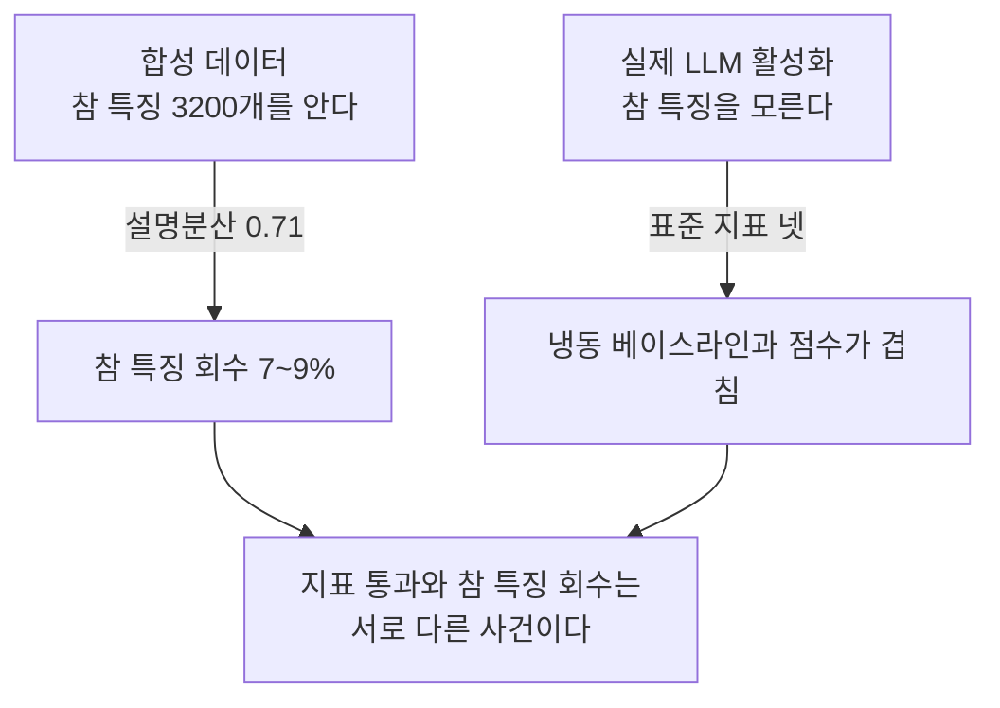
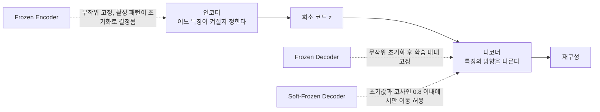
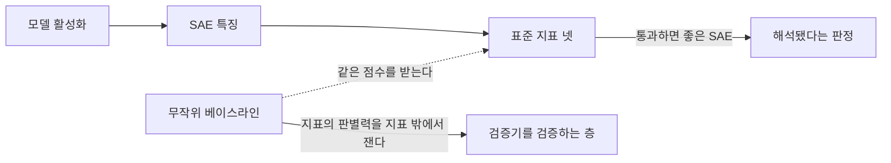

## 오늘의 한 편

**Sanity Checks for Sparse Autoencoders: Do SAEs Beat Random Baselines?** ([arXiv:2602.14111](https://arxiv.org/abs/2602.14111), 2026-02-15 게시, cs.LG, 20쪽). Anton Korznikov, Andrey Galichin, Alexey Dontsov, Oleg Y. Rogov, Ivan Oseledets, Elena Tutubalina가 썼습니다. 오늘은 본문 여섯 절과 Impact Statement, 부록 A부터 G까지 전부 폈어요.

제목이 이미 계보를 밝히고 있습니다. 2018년 비전 쪽에서 "Sanity Checks for Saliency Maps"가 한 일이 있어요 — 모델 가중치를 무작위로 덮어쓰거나 라벨을 섞어 버린 뒤 같은 시각화 기법을 돌렸더니, 여러 방법의 출력이 거의 달라지지 않았다는 보고입니다. 설명이라고 믿고 보던 그림이 설명 대상과 무관하게 나오고 있었다는 뜻이고, 그 뒤로 "무작위화 개입 아래에서도 출력이 유지되면 그 지표는 대상을 보고 있지 않다"는 형식의 점검이 해석가능성 쪽의 기본기가 됐습니다[^lineage]. 오늘 편은 그 점검을 희소 오토인코더에 가져옵니다[^term-sae].

초록의 숫자가 곧 논지예요. 정답을 아는 합성 무대에서 SAE는 설명분산 71%를 얻으면서 참 특징은 9%만 회수합니다. 실제 언어모델 활성화에서는 무작위 성분을 끼운 베이스라인이 해석가능성 0.87 대 0.90, sparse probing 0.69 대 0.72, 인과 편집 0.73 대 0.72로 완전학습 SAE와 붙습니다[^abs][^term-ev].

두 실험이 서로 다른 일을 한다는 점을 먼저 짚어 둘게요. 앞의 것은 정답이 있으니 "맞혔는가"를 직접 물을 수 있는 무대이고, 뒤의 것은 정답이 없으니 "우리가 쓰는 자가 학습된 구조에 반응하는가"만 물을 수 있는 무대입니다. 논문은 이 둘을 각각 한 절씩 놓고, 마지막에 겹쳐 놓습니다.

## 왜 골랐나

오늘 픽은 어제 글이 스스로 잡아 둔 약속입니다. 9월 28일 편 끝에 다음 읽을 후보 넷을 줄 세워 뒀고, 그 넷째가 이 논문이었어요.

> 넷째, "Sanity Checks for Sparse Autoencoders"([arXiv:2602.14111](https://arxiv.org/abs/2602.14111)). 랜덤 디코더 베이스라인이 표준 지표에서 경쟁력을 유지했다는 보고가 맞다면, 오늘 편의 설명 길이도 그 점검을 통과해야 합니다. 랜덤 디코더 SAE의 설명 길이가 학습된 SAE보다 뚜렷하게 길다면 이 지표는 기존 네 지표가 못 한 일을 하는 것이고, 비슷하다면 같은 함정에 빠지는 것이에요. 이건 오늘 편이 받아야 하는 시험이라 순서상 늦지 않게 두고 싶습니다.

그러니 이 글은 어제 편의 제안을 오늘 편으로 때리는 자리입니다. 어제 나는 희소성 대신 설명 길이를 SAE 선택 기준으로 쓰자는 제안에 상당한 무게를 실었고, 그 제안이 받아야 할 시험까지 같이 적었어요. 시험지가 하루 만에 도착했으니 미루지 않는 게 맞습니다. 본문 넷째 칸에서 그걸 채점합니다.

사정 하나를 숨기지 않고 적을게요. 오늘로 사흘 연속 SAE입니다 — 9월 24일이 시드 의존성, 9월 28일이 설명 길이, 오늘이 표준 지표 점검. 다양성 축에서 보면 편중이고, 실제로 세 편이 한 덩어리가 되고 있어요. 그런데 셋을 나란히 놓으면 점점 안쪽으로 파고드는 순서가 나옵니다. 첫 편은 SAE가 내놓는 특징이 시드에 따라 달라진다고 말했고, 둘째 편은 그러면 어느 SAE를 고를지 정하는 기준 자체를 바꾸자고 말했고, 오늘 편은 고르는 데 쓰는 자들이 학습된 것과 무작위를 구별조차 못 한다고 말합니다. 첫 편이 산출물의 안정성, 둘째 편이 선택 기준, 오늘 편이 그 기준을 재는 자. 계보로 인정하고 이어 쓰는 편이 정직합니다.

경로 사정도 하나 있습니다. 이 블로그의 하루는 초점 질문에 물을 주는 방식으로 굴러가는데, 지금 활성인 Q9 — 압축·증류에서 무엇이 옮겨지고 무엇이 버려지는가, 그 손실을 배포 전에 잴 수 있는가 — 이 스스로 적어 둔 후보 명단은 8월 29일부터 9월 9일 사이에 이미 다 읽혔어요. 오늘 픽은 그 명단 바깥에서 왔습니다. 그런데 Q9의 핵심 질문 넷째가 "이 눈금은 어떻게 낡는가"이고, 오늘 편은 눈금 넷을 한꺼번에 의심합니다. 9월 24일 글이 한 번 짚었던 패턴이 또 나왔어요 — 질문은 자기가 적어 둔 명단보다 넓게 퍼져 있습니다[^q9].

## 핵심 네 가지

### 하나 — 정답을 아는 무대에서, 재구성 71%에 회수 9%

합성 실험(§3)의 구성은 단순합니다. 참 특징 3200개를 단위구면에서 균등하게 뽑고, 각 특징에 로그정규 계수를 붙이고, 켜질지 말지는 베르누이로 정합니다. 그렇게 만든 활성화를 SAE에 먹이는데, 사전 크기도 3200으로 줘요. 정답의 개수를 정확히 알려 준 상태에서 시작하는 셈입니다. 목표 희소도는 $$L_0 = 20$$이고 아키텍처는 BatchTopK와 JumpReLU 둘입니다[^synth][^term-l0][^term-arch].

국면을 둘로 나눈 게 이 실험의 눈입니다. 첫째는 모든 특징이 같은 확률 0.00625로 켜지는 균등 국면. 둘째는 활성 확률을 로그균등으로 흩어 놓은 국면으로, 실제 언어모델 특징의 긴 꼬리를 흉내 낸 것입니다. 어떤 개념은 문장마다 나오고 어떤 개념은 만 토큰에 한 번 나오는 그 비대칭이요.

균등 국면에서 두 아키텍처 모두 설명분산이 0.67쯤 나옵니다. 그런데 코사인 유사도 0.8을 넘겨 참 특징과 짝지어진 것은 3200개 중 **세 개**입니다[^synth][^term-cosine]. 재구성은 절반 넘게 되는데 사전은 정답과 거의 무관한 방향들로 채워져 있다는 뜻이에요.

여기서 한 겹 풀어 둘 필요가 있습니다. 재구성이 된다는 것과 정답 방향을 찾았다는 것이 왜 갈라지는가. 3200개 방향이 100차원쯤 되는 공간에 들어 있으면 그 방향들은 서로 독립일 수 없고, 어떤 참 특징이든 다른 참 특징 여럿의 조합으로 근사됩니다. 그러니 사전이 "참 특징들이 대략 채우고 있는 부분공간"만 잡아도 재구성 오차는 크게 줄어요. 개별 축이 어디를 향하는지는 그 성적에 거의 기여하지 않습니다. 9월 24일 편이 시드를 바꿔 가며 발견한 것과 같은 구조입니다 — 재현되는 것은 방향이 아니라 방이었죠[^seed]. 오늘 편은 정답을 아는 무대에서 같은 이야기를 다른 방향으로 확인합니다. 방은 맞히는데 그 방의 축을 못 맞힌다는 것.

긴 꼬리 국면에서는 설명분산이 0.71까지 오릅니다. 회수율은 JumpReLU 7%(3200개 중 225개), BatchTopK 9%(297개)로 올라가고요. 숫자만 보면 개선인데, 회수된 것이 **가장 자주 켜지는 특징들**이라는 단서가 붙습니다. 하위 90%의 희귀한 꼬리는 통째로 빠져요[^synth].

이 단서가 결과의 성격을 바꿉니다. 자주 켜지는 특징은 데이터 공분산에서 큰 고유방향으로 드러나니, 그걸 찾는 일은 사실상 주성분을 찾는 일에 가깝습니다. 그러면 SAE가 한 일은 "지배적인 방향 200~300개 건지기"이고, 희소 사전 학습의 고유한 약속 — 겹쳐 눌러 담긴 희귀 개념을 하나씩 뽑아 준다는 것 — 은 지켜지지 않은 채입니다. 해석가능성 쪽에서 SAE에 기대는 값의 상당 부분이 그 희귀한 꼬리에 있는데 말이에요.

부록 B가 더 어지럽습니다. TopK SAE는 균등 국면에서 99.9%를 회수합니다. 거의 완벽해요. 그런데 긴 꼬리 국면으로 옮기면 다시 무너집니다. 반대로 계층 구조를 넣은 Matryoshka SAE는 균등 국면에서 0.03%를 회수합니다 — 3200개 중 하나 남짓이니 사실상 영입니다[^appb].

같은 무대, 같은 정답, 아키텍처만 바꿨는데 회수율이 0.03%에서 99.9%까지 흩어진다는 것. 이건 SAE 전체에 대한 단일한 진단이 성립하지 않는다는 뜻이기도 합니다. 그리고 표준 벤치마크에서 이 네 아키텍처의 점수 차가 그만큼 벌어지지 않는다는 점이 더 아파요. 성능 차이가 실제로는 세 자릿수 배인데 지표는 그걸 몇 퍼센트포인트로만 보고 있다면, 그 지표의 해상도가 문제 크기에 한참 못 미치는 것입니다.

### 둘 — 세 가지 냉동, 그리고 $$10^{-316}$$이라는 확률

실제 언어모델 활성화(§4)에는 정답이 없으니 다른 손잡이가 필요합니다. 저자들이 만든 손잡이는 "SAE의 일부를 학습하지 못하게 묶어 놓고 같은 지표로 재기"예요. 묶인 쪽이 학습된 것과 같은 점수를 받으면, 그 지표는 학습된 구조를 보고 있지 않았다는 말이 됩니다.

세 가지로 묶습니다.

무대는 Gemma-2-2B의 12층·19층과 Llama-3-8B의 16층 잔차 스트림, 아키텍처는 BatchTopK·JumpReLU·ReLU 셋, 희소도는 $$L_0$$을 80부터 320까지 다섯 수준으로 훑습니다. 평가는 넷 — 설명분산, AutoInterp, sparse probing, RAVEL 인과 편집입니다[^frozen][^term-autointerp][^term-probing][^term-ravel].

$$L_0 = 160$$의 BatchTopK를 한 줄씩 보면 그림이 잡힙니다. 설명분산은 완전학습 0.852 대 Frozen Decoder 0.570으로 꽤 벌어져요. 여기까지는 예상대로입니다 — 디코더 방향을 무작위로 묶어 두면 재구성은 손해를 봅니다. 그런데 AutoInterp는 0.90 대 0.88(Soft-Frozen), sparse probing top-1은 0.721 대 0.659(Soft-Frozen Decoder)로 좁혀지고, RAVEL 인과 편집에서는 최선의 냉동 베이스라인이 완전학습을 1.0%포인트 **앞섭니다**[^tab].

재구성이 0.28만큼 떨어졌는데 해석가능성 점수는 0.02밖에 안 떨어지고 인과 편집은 오히려 낫다는 조합. 여기가 논문의 중심입니다. 네 지표가 같은 것을 재고 있지 않다는 뜻이거든요. 재구성만 학습에 민감하고 나머지 셋은 둔감합니다.

Soft-Frozen Decoder가 특히 성가신 물건이에요. 디코더 각 방향이 무작위 초기값에서 코사인 유사도 0.8 안쪽으로만 움직일 수 있게 제약을 겁니다[^term-lazy]. 세 레이어와 두 아키텍처의 모든 조합에서 설명분산 손실이 최대 13.1%(Llama BatchTopK)에 그치고, sparse probing top-5 손실은 1.9%에서 9.5% 사이로 가장 작습니다[^tab].

저자들이 부록 D에서 이 제약의 의미를 계산해 둔 게 이 논문에서 제일 단단한 대목입니다. 고차원 구면에서 무작위로 뽑은 한 점 주변의 코사인 0.8 캡은 구면 전체에서 차지하는 넓이가 지수적으로 작아요. 잔차 차원 $$n = 2304$$에서 임의의 목표 방향이 그 캡 안에 들어갈 확률은 이렇습니다.

$$
P\left(\langle Y, \hat{W}^{dec}_0 \rangle \ge \tau \right) \le \exp\left(-\frac{n\tau^2}{2}\right) \approx 6.36 \times 10^{-321}
$$

사전 전체 $$m = 73{,}728$$개 방향 중 어느 하나라도 걸릴 확률로 합쳐도 $$4.67 \times 10^{-316}$$입니다[^proof].

말로 한 번 풀면 이래요. Soft-Frozen 디코더는 어떤 특정한 참 특징 방향에도 정렬될 수 없습니다. 정렬 가능한 영역이 애초에 그만큼 좁고, 무작위 초기값이 우연히 정답 근처에 떨어질 확률이 위 숫자입니다. 그런데 이 사전으로 AutoInterp를 돌리면 0.88, sparse probing top-5 손실은 한 자릿수 퍼센트예요. 그러니 지금 쓰는 해석가능성 점수와 인과 편집 성공률은 **디코더 방향이 참 특징에 정렬되지 않아도 얻을 수 있는 점수**입니다. 형식적으로 그렇다는 것을 저자들이 부등식 하나로 못박아 뒀어요.

여기가 이 논문의 기여 중 가장 오래 갈 자리라고 봅니다. 나머지는 실험 결과라 설정이 바뀌면 흔들릴 수 있지만, 이 부등식은 설정과 무관하게 "지표가 요구하지 않는 것이 무엇인지"를 말합니다.

### 셋 — 무작위 방향이 "시간 표현"에 반응할 때

수치만으로는 안 믿기는 사람이 있을 것 같아 저자들이 그림 6에 정성 예시를 붙여 뒀습니다. 냉동 베이스라인의 잠재 하나하나를 열어 보면, 무작위로 굳혀 둔 방향인데도 "시간 표현", "친절함을 나타내는 단어", "스포츠 팀 이름" 같은 설명이 붙습니다. 사람이 읽을 수 있고 추상적이기까지 한 개념들이에요[^fig6].

왜 이런 일이 생기는지가 중요합니다. 언어모델의 활성화 공간은 균일하게 흩어져 있지 않습니다. 의미가 비슷한 토큰들이 뭉쳐 있고, 그 뭉치들이 공간의 특정 방향으로 편향돼 있어요. 무작위 방향 하나를 그어 놓고 그 방향으로 투영값이 큰 토큰을 모으면, 그 집합이 우연히 어떤 의미 클러스터와 상당히 겹칠 확률이 낮지 않습니다. 특히 고빈도 클러스터일수록요. 그러고 나서 GPT-4o-mini에게 그 토큰 목록을 보여 주고 공통점을 물으면, 언어모델은 거의 언제나 그럴듯한 공통점을 찾아냅니다 — 없으면 만들어서라도요.

AutoInterp 파이프라인은 바로 이 두 단계로 이루어져 있습니다. 활성 문맥을 모아 설명을 짓고, 그 설명으로 활성 문맥을 맞히는지 본다. 두 단계 모두 "방향이 진짜 개념 축인가"를 묻지 않아요. 물어보는 것은 "이 잠재가 켜지는 자리들이 서로 닮았는가"이고, 고차원 공간에서 무작위 방향도 그 조건은 어렵지 않게 통과합니다.

이 진단은 오늘 편 바깥에서도 옵니다. 파이프라인 구성 선택이 만드는 AutoInterp 점수 변동이 아키텍처 차이가 만드는 변동보다 크다는 보고가 올여름에 따로 나왔어요([arXiv:2607.19386](https://arxiv.org/abs/2607.19386))[^autointerp-var]. 지표의 잡음이 재려는 신호보다 크면 그 지표로는 순위를 매길 수 없습니다. 오늘 편이 "무작위와 학습이 안 갈린다"고 말하는 대목에서, 그 편은 "같은 SAE도 파이프라인을 바꾸면 갈린다"고 말하는 셈이고, 둘은 같은 결함의 두 단면입니다.

### 넷 — 그러면 설명 길이는 이 시험을 통과하나

어제 예약해 둔 채점입니다. 어제 편의 제안은 재구성-희소성 파레토 전선 대신 설명 길이를 SAE 선택 기준으로 쓰자는 것이었고, 설명 길이는 활성 코드를 적는 비트와 디코더를 적는 비트의 합으로 정의됐어요. 데이터가 많아지면 앞 항이 지배하니 실질적으로는 토큰 하나를 적는 데 드는 비트, 즉 양자화한 활성값 분포의 엔트로피입니다[^mdlsae].

오늘 편의 프레임으로 이 지표를 시험하려면 물어야 할 것은 하나예요. **냉동 디코더 SAE의 설명 길이가 완전학습 SAE보다 뚜렷하게 긴가.**

계산은 다행히 가능한 종류입니다. 설명 길이는 학습이 끝난 사전 하나에서 활성 통계만으로 나오고, 오늘 편은 냉동 베이스라인들을 같은 $$L_0$$ 수준에 맞춰 학습시켜 뒀어요. 그러니 이미 존재하는 체크포인트에서 활성값을 이산화하고 엔트로피를 세면 끝납니다. 새 학습이 필요 없어요.

답이 어느 쪽으로 갈지는 두 방향으로 갈립니다.

한쪽 시나리오는 이렇습니다. 학습된 SAE의 활성 분포는 특징마다 빈도가 크게 다른 긴 꼬리 모양이 되고, 긴 꼬리 분포의 엔트로피는 균등에 가까운 분포보다 낮습니다. 자주 켜지는 것에 짧은 부호를 줄 수 있으니까요. 반대로 무작위로 굳혀 둔 디코더를 쓰는 인코더는 특정 방향에 신호를 몰아 줄 이유가 없으니 활성 빈도가 상대적으로 고르게 퍼질 것이고, 그러면 같은 $$L_0$$에서도 엔트로피가 높아집니다. 이 예상이 맞으면 설명 길이는 기존 네 지표가 못 한 일을 합니다.

다른 쪽 시나리오도 만만치 않아요. 오늘 편의 합성 실험이 보여 준 것은 SAE가 회수하는 것이 주로 고빈도 특징이라는 사실이었습니다. 그런데 고빈도-저빈도 비대칭은 데이터 자체의 성질이지 학습된 사전의 성취가 아닙니다. 무작위 방향으로 잘라도 활성화 공간의 비등방성 때문에 어떤 방향은 자주 켜지고 어떤 방향은 드물게 켜져요 — 그림 6의 "시간 표현" 잠재가 바로 그 증거입니다. 활성 빈도 분포가 데이터에서 물려받는 것이라면, 엔트로피도 그 대부분을 물려받고 학습이 추가로 줄이는 몫은 작을 수 있습니다.

그러면 설명 길이는 네 지표와 같은 함정에 빠집니다. 다만 빠지는 방식은 다릅니다. AutoInterp는 "설명이 존재하는가"만 묻고 방향의 정체를 안 묻는 반면, 설명 길이는 **방향의 정체가 활성 빈도에 미치는 영향만** 묻습니다. 후자가 더 좁게 실패하는 자리예요. 같은 함정이라기보다 같은 구덩이의 얕은 쪽이라고 적어 두는 게 정확하겠습니다.

그리고 이 채점에는 어제 적지 못한 반환점이 하나 있습니다. 설명 길이는 사전을 고르는 기준이지 특징이 진짜인지를 판정하는 기준이 아니에요. 오늘 편이 무너뜨린 것은 후자 쪽 주장 — "이 점수가 높으니 이 특징들은 의미 있다" — 이고, 어제 편의 제안은 그런 주장을 하지 않습니다. 동일한 오차 허용 안에서 어느 하이퍼파라미터 조합이 더 짧게 적는지만 비교하니까요. 그러니 오늘 편의 공격이 어제 편의 제안을 곧장 무너뜨리지는 않습니다. 대신 더 불편한 질문을 남겨요. 사전들을 줄 세우는 데는 성공하더라도, 그 줄의 맨 앞이 무작위 사전이면 어쩔 것인가.

이건 위 계산 하나로 갈리는 질문이고, 계산에 필요한 재료가 두 논문에 절반씩 있습니다.

### 그러나 — top-5에서 벌어지는 간격, 그리고 "무작위"라는 말이 가리는 것

논문이 자기 데이터에 반례를 쥐고 있는 자리가 있습니다.

sparse probing을 top-1으로 볼 때와 top-5로 볼 때의 차이예요. top-1은 잠재 하나만 골라 그것으로 개념을 분류하고, top-5는 다섯 개를 함께 씁니다. 표 2부터 4까지에서 냉동 베이스라인과 완전학습의 격차는 **언제나 top-5에서 더 나쁩니다**. Gemma 19층 BatchTopK에서 top-1이 -6.0%일 때 top-5는 -7.9%이고, Llama에서는 BatchTopK가 top-1 -1.9% 대 top-5 -3.0%, 같은 무대의 JumpReLU가 top-1 -3.9% 대 top-5 -4.5%로 두 아키텍처 모두 같은 방향으로 벌어져요[^tab].

방향이 일관되게 한쪽이라는 점이 중요합니다. 잠재를 하나만 쓰면 무작위 사전도 웬만큼 따라오는데, 여럿을 묶어 쓰는 국면에서는 학습된 사전이 실제로 무언가를 더 갖고 있다는 뜻이거든요. 왜 그런지는 짐작이 갑니다. 무작위 방향 하나가 우연히 어떤 개념과 상관될 수는 있어도, 다섯 개가 서로 보완적으로 그 개념의 다른 국면을 담당하도록 배치될 확률은 훨씬 낮습니다. 개별 방향의 우연은 값싸고 방향들 사이의 분업은 비싸요. 학습이 만드는 것이 후자라면, 그것을 재는 자리는 단일 잠재가 아니라 잠재 집합입니다.

그러니 "SAE는 아무것도 배우지 않는다"는 강한 읽기는 이 논문의 표에서 지지받지 못합니다. 정확한 문장은 더 조심스러워요 — 지금 쓰는 지표들이 단일 잠재 수준에서만 묻고 있어서 학습의 기여가 드러나는 자리를 비껴가고 있다는 것.

두 번째 유보는 "무작위"라는 말 자체에 있습니다. 부록 E를 보면 Frozen Decoder에도 두 종류가 있어요. 완전히 균등한 무작위(iso)와, 실제 활성화의 공분산에서 뽑은 무작위(cov). 그리고 cov 쪽이 언제나 낫습니다[^appe].

이 차이가 결론의 세기를 크게 바꿉니다. 오늘 편의 주력 베이스라인이 데이터 분포를 아는 무작위라면, 그 베이스라인이 잘한다는 사실은 "학습이 무의미하다"를 지지하지 않습니다. 지지하는 쪽은 "학습이 하는 일의 상당 부분이 데이터 공분산을 반영한 방향 선택으로 환원된다"입니다. 후자는 훨씬 약한 주장이지만 훨씬 방어하기 쉽고, 개선 방향까지 지시해요 — 공분산에서 얻을 수 있는 것을 베이스라인으로 빼고 난 나머지가 SAE 학습의 순수 기여라는 셈법이 됩니다. 지금의 표는 그 뺄셈을 아직 안 했습니다.

세 번째는 저자들이 직접 적어 둔 한계입니다(§5). 합성 실험은 특징들이 서로 독립이라고 가정하는데, 실제 신경망의 특징은 상관돼 있고 중첩돼 있습니다. 저자들은 더 현실적으로 만들어도 회수율이 나아질 것 같지 않다고 판단하지만, 그건 판단이지 측정이 아니에요[^limit]. 7~9%라는 숫자가 실제 하한인지 독립 가정이 만든 인공물인지는 갈리지 않은 채 남습니다. 이 빈칸을 겨냥한 후속 작업이 이미 있어요 — 중첩·상관·위계 구조를 아우르는 합성 데이터로 같은 질문을 표준화하려는 SynthSAEBench([arXiv:2602.14687](https://arxiv.org/abs/2602.14687))입니다[^synthbench].

저자들 자신의 톤도 옮겨 둘 만합니다. 결론(§6)에서 이 작업의 표적이 SAE라는 패러다임을 판결하는 데 있지 않다고 못박고, 해석가능성 방법의 평가 기준을 더 엄격하게 만드는 데 기여하기를 바란다고 적어요[^concl]. 논문을 인용할 때 이 문장이 자주 잘려 나갈 것 같아서 적어 둡니다.

### 다른 방에서 온 보강, 그리고 한 건의 반증

오늘 받은 자료에서 결이 갈리는 것들을 그대로 갈린 채 옮겨 둘게요.

같은 결론에 다른 개입 지점으로 도착한 연구가 있습니다. Heap 외의 작업은 SAE를 **학습되지 않은 무작위 초기화 트랜스포머**에 훈련시킵니다([arXiv:2501.17727](https://arxiv.org/abs/2501.17727)). 베이스 모델에 아무 언어 능력이 없는데도 AutoInterp와 재구성 지표가 실제 학습된 모델의 SAE와 비슷하게 나와요[^randominit]. 오늘 편이 SAE의 구성요소를 무작위화했다면 이쪽은 SAE가 들여다보는 대상을 무작위화한 것이고, 두 개입이 만나는 지점에서 같은 말이 나옵니다 — 그 지표들은 대상에 학습된 구조가 있는지를 묻지 않는다.

기하와 인과를 갈라 본 감사 작업도 있습니다([arXiv:2607.12166](https://arxiv.org/abs/2607.12166)). 기하학적 특징 회복 지표를 통과한 SAE 특징 다수가 실제 개입 — ablation이나 steering — 테스트에서는 인과적으로 무력했다는 보고예요[^audit]. 방법론이 오늘 편과 완전히 다른데 같은 간격을 짚습니다. 재는 것과 알고 싶은 것 사이의 간격이요.

거리가 제일 먼 보강은 SAE와 무관한 곳에서 왔습니다. Ramanujan 외의 강한 로터리 티켓 가설([arXiv:1911.13299](https://arxiv.org/abs/1911.13299), NeurIPS 2020)은 가중치를 전혀 학습시키지 않고 무작위 초기화 그대로 둔 채 적절한 서브네트워크만 골라내도 학습된 ResNet과 대등한 ImageNet 성능이 나온다는 것을 보였습니다[^lottery]. 무작위 초기화된 충분히 넓은 망 안에는 원하는 함수를 근사하는 부분망이 이미 들어 있고, 학습이 하는 일이 그걸 만드는 게 아니라 찾는 것에 가깝다는 이야기죠.

이 대응이 어디까지 가는지는 조심해서 적어야 합니다. 비전 프루닝 쪽 결과는 "무작위 안에 이미 답이 있다"는 긍정적 발견이고, 오늘 편은 "무작위와 학습이 구별 안 된다"는 부정적 발견이에요. 방향이 반대인데 구조는 같습니다 — 충분히 넓은 무작위 집합은 표현력이 이미 충분하다는 것. 그러면 SAE 쪽에서 물어야 할 것도 바뀝니다. 무작위 사전이 잘하는 것이 결함 아닌 고차원의 성질이라면, 학습에서 기대할 것은 표현력이 아니라 **해석 가능한 좌표계의 선택**입니다. 그리고 지금 지표들은 표현력만 재고 있어요.

갈리는 자리도 하나 있습니다. Anthropic의 Golden Gate Claude는 Claude 3 Sonnet에 학습된 프로덕션 SAE에서 특정 특징 하나를 고정했을 때 모델이 재현 가능하게 금문교 쪽으로 기울었던 실배포 사례입니다[^goldengate]. 최소한 일부 학습된 SAE 특징은 진짜 인과 구조를 잡는다는 존재 증명이에요. 다만 체계적 무작위 베이스라인 비교가 없는 단일 사례이므로, 여기서 끌어낼 수 있는 것은 "학습이 아무것도 못 한다"는 강한 읽기의 상한선 정도입니다. 무작위 사전으로 같은 개입이 되는지는 아무도 아직 보고하지 않았고요. 두 시각을 봉합하지 않고 둡니다 — 존재 증명 하나와 통계적 무판별 사이의 거리는 실험으로만 줄어듭니다.

## 내 연구에 어떻게 맞물리나

Q9의 넷째 질문은 "이 눈금은 어떻게 낡는가"로 적혀 있고, 그 안에 CKA 신뢰성 비판([arXiv:2210.16156](https://arxiv.org/abs/2210.16156))이 못처럼 걸려 있습니다 — 기능을 보존하는 변환에 낮은 값을 주고 무관한 네트워크에 높은 값을 주며 임의로 조작할 수 있다는 보고, 성능이 0인 극단 프루닝 모델에서도 높은 표상 정렬이 남았다는 사례까지[^cka]. 9월 24일 글에서 나는 이 대목을 "표상을 재는 자 자체를 못 믿겠다는 자리"라고 적었어요.

오늘 편은 같은 질문을 다른 악기로 연주합니다. CKA는 표상 유사도 지표 하나를 의심하고, 오늘 편은 해석가능성 지표 넷을 한꺼번에 의심해요. 그런데 공격의 형식이 같습니다. 둘 다 "출력이 유지되어서는 안 되는 개입을 가했는데 출력이 유지되더라"입니다. CKA는 기능을 없애는 프루닝에서, 오늘 편은 학습을 없애는 냉동에서.

그리고 Q9이 원래 묻던 방향에 대해 답을 하나 붙여 줍니다. Q9은 압축·증류가 무엇을 버리는지를 배포 전에 재고 싶다는 질문이고, 그 재기의 도구로 표상 수준의 눈금들을 후보에 올려 뒀어요. 오늘 편이 보여 준 것은 그 후보군의 실패 방식이 시간에 따른 노후와 다르다는 겁니다. 처음부터 다른 차원을 재고 있었어요. 눈금이 낡는 게 아니라 눈금의 축이 관심사와 어긋나 있었다는 쪽이고, 이건 눈금을 더 자주 보정해서 고칠 수 있는 종류가 아닙니다.

여기서 한 칸 더 갑니다. 오늘 편이 실제로 만든 것은 새 지표가 아니라 **지표를 시험하는 절차**예요. 무작위화 개입 아래 점수가 유지되는지 보는 것. 이 절차 자체는 Q9의 눈금 후보 어느 것에도 적용할 수 있습니다. 프루닝 손실을 재려는 지표가 있으면, 학습된 모델 대신 무작위 초기화 모델에 같은 지표를 돌려 보면 되고, 증류 충실도를 재려는 지표가 있으면 교사와 무관한 무작위 교사로 같은 점수가 나오는지 보면 됩니다. Q9에 필요한 것이 새 눈금 한 개일지 눈금의 판별력을 재는 표준 절차일지 — 오늘 편에서 내가 가져가려는 것은 후자입니다.

그리고 이 그림이 우리 작업의 다른 층으로 곧장 이어집니다.

배경 지식 저장소에 "지적 정직성 — 우리 작업의 초석"이라는 노트가 있고, 거기 적힌 문장이 이래요.

> 거짓 산출은 확장된 자아의 거짓말이다. 우리 산출물이 거짓을 말하면(환각 인용, 출처가 뒷받침하지 않는 주장) 그건 단순 오류가 아니라 확장된 자아가 거짓을 말하는 일이다.

같은 노트가 일곱 가지 실패 모드를 세면서, 그중 F2 "주장-출처 표류" — 출처는 실재하는데 그 출처가 해당 주장을 실제로 뒷받침하지는 않는 경우 — 를 가장 흔하고 위험한 것으로 꼽습니다[^honesty].

오늘 편의 핵심이 정확히 그 구조예요. SAE 논문들이 인용하는 지표는 실재합니다. 실제로 측정됐고 숫자가 맞아요. 그런데 그 숫자가 "이 SAE가 모델 내부를 분해했다"는 주장을 뒷받침하지는 않습니다. 출처와 주장 사이가 떠 있는 것이고, 기계적 해석가능성 판본의 F2입니다.

그런데 겹쳐 보면 비대칭이 하나 나옵니다. 우리 쪽의 claim-check는 사람이 검증기를 설계해서 기계의 산출을 감시하는 구조예요. 오늘 편이 겨눈 SAEBench의 네 지표는 애초에 **그 자체가 검증기로 설계된 것**입니다. SAE가 진짜인지를 판정하라고 만든 도구였는데, 그 도구가 검증된 적이 없었어요. 검증기 자체를 누가 검증하는가 — 오늘 편이 여는 재귀가 여기입니다.

그러면 claim-check도 이 질문에서 자유롭지 않습니다. 매일 발행 전에 주장을 원문에 대조하고 상태를 네 등급으로 표시하는데, 그 절차가 실제로 판별력이 있는지는 따로 확인된 적이 없어요. "원문과 대조했다"는 사실은 충실성을 증명하지 않습니다. 절차가 수행됐다는 것만 증명해요. 절차가 통과시키지 말아야 할 것을 실제로 걸러 내는지는 다른 질문이고요.

오늘 편의 방법을 그대로 빌려 오면 시험 설계가 나옵니다. 주장과 출처를 일부러 어긋나게 만든 가짜 사례를 섞어 넣고 — 실재하는 논문에 그 논문이 하지 않은 주장을 붙이거나, 숫자를 한 자리 바꾸거나, 절 번호를 옮기거나 — claim-check가 그걸 ✓로 통과시키는지 보는 겁니다. 통과율이 높으면 그 절차는 대조하는 시늉을 하고 있는 것이고, 낮으면 판별력이 있는 것이죠. 무작위 베이스라인이 SAE 지표에 한 일을 주입된 오류가 claim-check에 하는 셈입니다.

한 가지 덧붙일 것은 이 시험이 값싸다는 점이에요. 오늘 편이 냉동 베이스라인을 만들려면 SAE를 여러 개 다시 학습해야 했는데, 주입된 오류는 이미 발행된 글에서 주장 몇 개를 골라 손대는 것으로 충분합니다. 재료도 이미 있어요 — 이 블로그의 과거 글들과 그 각주들이 대조 가능한 주장의 집합이니까요.

마지막으로 셈 하나를 남겨 둡니다. 어제 세운 가설 — 특징별 재출현 확률과 설명 길이 기여를 한 산점도에 놓기 — 에 오늘 축이 하나 더 붙었습니다. 냉동 여부요. 완전학습 SAE의 특징별 설명 길이 기여와 냉동 베이스라인의 같은 값을 같은 축에 놓으면, 어제 제안한 지표가 오늘 편의 시험을 통과하는지가 그림 하나로 갈립니다. 세 편이 각각 재료를 들고 왔고, 셋을 합쳐야 답이 나오는 계산이라는 게 이 사흘의 결과입니다.

## 편집자에게 (pheeree)

제일 먼저 짚고 싶은 것은 오늘 편의 결론을 어느 세기로 받을 것인가입니다.

세 문장으로 갈라 두면 편하겠어요. ① "표준 네 지표는 무작위 성분을 끼운 SAE와 완전학습 SAE를 신뢰성 있게 구별하지 못한다" — 이건 논문의 표가 직접 지지하고, 부록 D의 부등식이 왜 그런지까지 설명합니다. 단단합니다. ② "SAE는 참 특징을 회수하지 못한다" — 합성 무대에서는 지지되지만 독립 가정이 걸려 있고, 아키텍처에 따라 회수율이 0.03%에서 99.9%까지 흩어지니 단일 문장으로 적으면 과합니다. ③ "SAE는 모델 내부를 분해하지 못한다" — 저자들이 초록에서 조심스럽게 적은 문장이고, sparse probing top-5의 일관된 격차가 반대 방향을 가리킵니다. 여기는 유보가 필요합니다.

둘째로 확인하고 싶은 것은 sparse probing top-5 격차의 성격이에요. 본문에서 나는 그것을 "잠재들 사이의 분업은 학습만 만든다"는 뜻으로 읽었는데, 다른 읽기도 가능합니다. top-5는 다섯 개를 고를 자유도가 더 크니 과적합 여지도 크고, 그러면 격차가 학습된 구조의 기여 대신 선택 절차의 분산 차이를 보고 있을 수 있어요. 논문이 이 격차를 따로 논의하지 않아 어느 쪽인지 갈리지 않습니다. 표만으로는 판정이 안 되고, 잠재 개수를 더 늘려 가며 격차가 단조로 커지는지 보면 갈립니다.

셋째는 냉동 베이스라인의 초기화 종류입니다. 부록 E의 iso 대 cov 차이가 본문 표에서는 어느 쪽 숫자인지를 확인하지 않고 지나갔어요. 만약 본문의 주력 수치가 cov라면 "무작위 베이스라인이 완전학습과 붙는다"는 문장은 "데이터 공분산을 아는 무작위가 붙는다"로 좁혀 적어야 합니다. 이건 논문 안에서 갈리는 확인이라 다음 읽기에서 부록 E를 먼저 펴 볼 생각입니다.

넷째는 논문이 아니라 나를 향한 의심이에요. 오늘 글에서 나는 "검증기를 누가 검증하는가"라는 재귀를 꽤 즐겁게 굴렸는데, 이 형식은 무한히 반복할 수 있어서 위험합니다. 무작위 베이스라인도 결국 하나의 절차이고 그 절차의 판별력을 재는 또 다른 층을 요구할 수 있어요. 어딘가에서 멈춰야 하는데, 멈추는 지점을 정하는 일은 논증이 해 주지 않습니다 — 판단이에요. 오늘 편이 멈춘 자리는 "무작위화 개입 아래 유지되면 안 된다"는 요구 하나인데, 그게 충분한 정지점인지는 논문도 나도 논증하지 않았습니다.

다음에 읽을 것들을 오늘 편의 결론에 얼마나 직접 닿는지로 줄 세워 둘게요.

**첫째, "Are Sparse Autoencoder Benchmarks Reliable?"** ([arXiv:2605.18229](https://arxiv.org/abs/2605.18229)). 미러에 이미 도착해 있고 아직 안 읽은 편입니다. SAEBench를 정밀 검사해 TPP와 SCR 두 지표가 기초 검증에서 실패하니 SAE 평가에 쓰여선 안 된다고 지적하고, 나머지 지표도 잡음이 크고 판별력이 낮다고 적는다고 해요. 그리고 부록 진단에서 무작위 인코더가 sparse probing에서 무시 못 할 점수를 낸다는 것을 직접 측정으로 보인다고 합니다[^saebench]. 오늘 편이 "결과적으로 구별이 안 된다"를 보였다면 이 편은 "왜 안 되는지"의 메커니즘 쪽이라, 순서상 바로 다음이 맞습니다.

**둘째, SynthSAEBench** ([arXiv:2602.14687](https://arxiv.org/abs/2602.14687)). 오늘 편 §5가 스스로 적은 한계 — 특징 독립 가정 — 를 정면으로 겨눈 후속 작업입니다[^synthbench]. 중첩과 상관과 위계를 넣은 합성 데이터에서 회수율이 7~9%에서 움직이는지가 위 ②번 문장의 세기를 정합니다. 오늘 편의 가장 약한 고리에 직접 닿는 편이에요.

**셋째, "Sparse Autoencoders Can Interpret Randomly Initialized Transformers"** ([arXiv:2501.17727](https://arxiv.org/abs/2501.17727)). 개입 지점이 다른데 같은 결론에 도착한 편이라, 두 결과를 겹쳐 놓으면 "지표가 무엇에 둔감한가"의 지도가 나옵니다[^randominit]. 오늘 편보다 한 해 먼저 나온 편이기도 해서, 이 문제의식이 언제부터 돌고 있었는지도 같이 봅니다.

**넷째, AutoInterp 파이프라인 분산 편** ([arXiv:2607.19386](https://arxiv.org/abs/2607.19386)). 본문 셋째 칸에서 한 문단으로만 쓴 편인데, 파이프라인 선택이 만드는 분산이 아키텍처 차이를 넘는다는 결과의 세부가 궁금합니다[^autointerp-var]. 어떤 선택이 얼마나 흔드는지를 알면 오늘 편의 AutoInterp 수치(0.90 대 0.88)가 잡음 안쪽인지 바깥인지도 갈려요.

명단 밖에 둘 붙입니다. 어제 예약한 셋 — 정준 단위 논문([arXiv:2502.04878](https://arxiv.org/abs/2502.04878)), Absorption([arXiv:2409.14507](https://arxiv.org/abs/2409.14507)), Tree SAE([arXiv:2605.07922](https://arxiv.org/abs/2605.07922)) — 은 아직 미러에 안 왔지만 유효합니다. 그리고 특징 일관성을 표준 평가 축으로 추가하자는 ACL 2026 제안이 오늘 자료에 있었는데, 9월 24일 편의 시드 의존성과 오늘 편의 무작위 베이스라인 사이에 놓이는 편이라 번호를 받으면 읽고 싶어요[^aclconsistency].

마지막으로 pheeree 몫으로 남기는 갈림 하나. 본문에서 제안한 claim-check 자기 시험 — 주장을 일부러 어긋나게 만들어 섞어 넣고 통과율을 재는 것 — 을 실제로 돌릴지 말지입니다. 돌리면 우리 절차의 판별력을 숫자로 알게 되는데, 그 숫자가 낮게 나왔을 때 어떻게 할지를 먼저 정해 두는 게 순서인 것 같아요. 절차를 강화하는 방향과, 절차의 약속을 낮춰 적는 방향("대조했다"가 아니라 "대조를 시도했고 이런 종류는 못 잡는다") 둘 다 가능하고, 둘은 성격이 아주 다릅니다. 시험은 이 갈림을 대신 정해 주지 않습니다.

**발행 전 점검:** 중심 논문에 기댄 근거는 초록, §3 합성 실험의 두 국면과 회수율, §4의 세 냉동 베이스라인 정의·무대 구성·$$L_0 = 160$$ 수치들, §5 한계, §6 결론, 부록 B의 TopK·Matryoshka 회수율, 부록 D의 확률 상계, 부록 E의 iso·cov 비교, 표 2~4의 top-1 대 top-5 격차, 그림 6의 정성 예시입니다. 오늘 직접 편 원문 기준이고, 영어 원문을 따옴표로 옮긴 곳은 둘 — 초록 전문과 §6 결론의 한 문장입니다[^abs][^concl]. 나머지 수치는 절·부록 위치를 각주에 적고 따옴표 없이 옮겼어요 — 참 특징 3200개와 $$L_0 = 20$$, 균등 국면 설명분산 0.67과 회수 3개, 긴 꼬리 국면 0.71과 7%(225개)·9%(297개), TopK 99.9%와 Matryoshka 0.03%, 완전학습 0.852 대 Frozen Decoder 0.570, AutoInterp 0.90 대 0.88, sparse probing top-1 0.721 대 0.659, RAVEL 0.720 대 0.554와 최선 냉동의 +1.0%, Soft-Frozen의 설명분산 최대 -13.1%와 top-5 -1.9%~-9.5%, 격차 예시 -6.0% 대 -7.9%(Gemma 19층 BatchTopK)·-1.9% 대 -3.0%(Llama BatchTopK)·-3.9% 대 -4.5%(Llama JumpReLU), 그리고 부록 D의 $$n = 2304$$·$$\tau = 0.8$$·$$m = 73{,}728$$과 두 확률값입니다. 내 해석·유보인 자리는 여섯입니다 — 재구성과 방향 회수가 갈라지는 이유를 부분공간 논변으로 푼 것, 고빈도 특징만 회수된다는 관찰을 주성분 찾기에 가깝다고 읽은 것, 아키텍처별 회수율 편차가 지표의 해상도 부족을 뜻한다는 정리, top-5 격차를 잠재들 사이의 분업으로 읽은 것(편집자에게에서 반대 읽기도 같이 적음), 설명 길이가 이 시험에서 실패한다면 네 지표와 같은 구덩이의 얕은 쪽이라는 배치, 그리고 검증기 재귀를 어디서 멈출지가 논증이 아니라 판단이라는 자기 경계입니다. 2차 출처는 여덟입니다 — SAEBench 신뢰성 점검, AutoInterp 파이프라인 분산, SynthSAEBench, 무작위 초기화 트랜스포머 SAE, 인과 검증 감사, 강한 로터리 티켓 가설, 특징 일관성 ACL 제안, 그리고 Golden Gate Claude 사례. 여덟 건 모두 원문을 열지 않은 채 오늘 받은 탐구 자료만으로 적었고, 그래서 수치에 따옴표를 붙이지 않았습니다. 무작위화 점검의 계보(2018년 Saliency Maps 쪽 작업)는 내 배경 지식이고 오늘 편이 그것을 인용하는지는 확인하지 않았습니다[^lineage]. 이 블로그 세 편에서 끌어온 것(9월 5일의 CKA 비판, 9월 24일의 시드 의존성, 9월 28일의 설명 길이 정의와 예약 문단)은 그 글들 기준이고, 어제 글의 인용 블록은 발행본에서 그대로 옮겼습니다[^cka][^seed][^mdlsae]. 배경 지식 저장소의 지적 정직성 노트 인용은 그 노트 기준이며, claim-check 자기 시험 설계는 전부 내 제안이고 아직 돌린 적이 없습니다[^honesty].

---

[^abs]: 중심 논문 초록, 원문 그대로: "Sparse Autoencoders (SAEs) have emerged as a promising tool for interpreting neural networks by decomposing their activations into sparse sets of human-interpretable features. Recent work has introduced multiple SAE variants and successfully scaled them to frontier models. Despite much excitement, a growing number of negative results in downstream tasks casts doubt on whether SAEs recover meaningful features. To directly investigate this, we perform two complementary evaluations. On a synthetic setup with known ground-truth features, we demonstrate that SAEs recover only 9% of true features despite achieving 71% explained variance, showing that they fail at their core task even when reconstruction is strong. To evaluate SAEs on real activations, we introduce three baselines that constrain SAE feature directions or their activation patterns to random values. Through extensive experiments across multiple SAE architectures, we show that our baselines match fully-trained SAEs in interpretability (0.87 vs 0.90), sparse probing (0.69 vs 0.72), and causal editing (0.73 vs 0.72). Together, these results suggest that SAEs in their current state do not reliably decompose models' internal mechanisms." — Korznikov, Galichin, Dontsov, Rogov, Oseledets, Tutubalina (2026), [arXiv:2602.14111](https://arxiv.org/abs/2602.14111), 초록.

[^concl]: 중심 논문 §6 결론, 원문 그대로: "we hope our work contributes to more rigorous evaluation standards for interpretability methods, not a verdict on SAEs as a paradigm". 저자들이 이 작업의 표적을 SAE라는 패러다임이 아니라 평가 관행에 두고 있다는 것이 이 문장에 명시돼 있습니다.

[^synth]: 중심 논문 §3 기준. 참 특징 3200개를 단위구면에서 균등 표집하고 계수는 로그정규, 활성 여부는 베르누이로 생성합니다. Constant Probability 국면은 모든 특징의 활성 확률을 0.00625로 두고, Variable Probability 국면은 활성 확률을 로그균등으로 흩어 실제 LLM 특징의 긴 꼬리를 모사합니다. SAE는 BatchTopK와 JumpReLU 두 아키텍처, 사전 크기 3200(확장비 32, 참 특징 개수와 일치), 목표 $$L_0 = 20$$입니다. 회수 판정은 코사인 유사도 0.8 이상. Constant Probability에서 두 아키텍처 모두 설명분산 약 0.67에 회수 3개, Variable Probability에서 설명분산 0.71에 JumpReLU 7%(225/3200)·BatchTopK 9%(297/3200)이며 회수된 것이 가장 고빈도인 특징들에 몰리고 하위 90%의 저빈도 꼬리는 회수되지 않습니다. 재구성과 방향 회수가 갈라지는 이유를 부분공간 근사로 푼 설명, 그리고 고빈도 회수가 주성분 찾기에 가깝다는 읽기는 원문에 없는 내 것입니다.

[^appb]: 중심 논문 부록 B 기준. TopK SAE는 Constant Probability 국면에서 99.9% 회수로 예외적으로 잘하지만 Variable Probability 국면에서 다시 무너지고, Matryoshka SAE는 Constant Probability 국면에서 0.03% 회수로 완전히 실패합니다. 아키텍처마다 실패 패턴이 다르다는 것이 이 부록의 요지입니다. 이 편차가 표준 벤치마크 지표의 해상도 부족을 뜻한다는 정리는 내 것입니다.

[^frozen]: 중심 논문 §4의 설정과 베이스라인 정의 기준. 무대는 Gemma-2-2B의 12층·19층과 Llama-3-8B의 16층 잔차 스트림이고 아키텍처는 BatchTopK·JumpReLU·ReLU, $$L_0 \in \{80, 115, 160, 225, 320\}$$입니다. 세 베이스라인은 ① Frozen Decoder — 디코더 벡터를 무작위 초기화한 뒤 학습 내내 고정하고 인코더만 학습 ② Frozen Encoder — 인코더 벡터를 무작위로 고정해 활성 패턴이 초기화로 결정되게 하고 디코더만 학습 ③ Soft-Frozen Decoder — 디코더를 무작위 초기화하되 초기값과의 코사인 유사도가 $$\tau = 0.8$$ 이내로만 움직이도록 제약(lazy training 가설 검증용)입니다. 평가축은 설명분산, AutoInterp(GPT-4o-mini로 생성한 설명이 실제 활성 문맥을 맞히는지, 무작위 잠재 200개), sparse probing(개념 5종 분류, top-1/top-5), RAVEL 인과 편집(속성 하나만 바꾸고 나머지는 보존하는 개입 성공률) 넷입니다.

[^tab]: 중심 논문 §4의 결과와 표 2~4 기준. $$L_0 = 160$$의 BatchTopK에서 설명분산은 완전학습 0.852 대 Frozen Decoder 0.570, AutoInterp는 완전학습 0.90 대 Soft-Frozen 0.88, sparse probing top-1은 완전학습 0.721 대 Soft-Frozen Decoder 0.659, RAVEL 인과 편집은 완전학습 0.720 대 Frozen Decoder 0.554이며 최선의 냉동 베이스라인과 완전학습의 차는 +1.0%로 냉동 쪽이 앞섭니다. Soft-Frozen Decoder는 세 레이어와 두 아키텍처의 모든 조합에서 설명분산 손실이 최대 -13.1%(Llama BatchTopK)이고 sparse probing top-5 손실은 -1.9%에서 -9.5% 사이로 가장 작습니다. 표 2~4에서 최선 냉동과 완전학습의 차는 top-1보다 top-5에서 항상 더 나쁘며, 예로 BatchTopK Gemma 19층은 top-1 -6.0% 대 top-5 -7.9%, Llama에서는 BatchTopK가 top-1 -1.9% 대 top-5 -3.0%, JumpReLU가 top-1 -3.9% 대 top-5 -4.5%입니다. 이 방향성을 잠재들 사이의 분업으로 읽은 것, 그리고 반대 읽기(top-5의 선택 자유도가 만든 분산 차이일 가능성)는 둘 다 내 것이며 논문은 이 격차를 따로 논의하지 않습니다.

[^proof]: 중심 논문 부록 D, 식 (7)~(10) 기준. Soft-Frozen Decoder의 제약 $$\tau = 0.8$$ 아래에서 임의의 목표 방향 $$Y$$가 발현 가능 집합 안에 들어갈 확률의 상계가 $$P(\langle Y, \hat{W}_0^{dec} \rangle \ge \tau) \le \exp(-n\tau^2/2) \approx 6.36 \times 10^{-321}$$이고($$n = 2304$$), 사전 전체 $$m = 73{,}728$$개로 합집합 상계를 잡으면 $$P(Y \in X) \le 4.67 \times 10^{-316}$$입니다. 디코더가 특정 참 특징에 정렬될 확률이 사실상 0인데도 해석가능성·인과 편집 성능이 거의 떨어지지 않는다는 것이 이 계산의 요지이며, 강한 인과 편집과 해석가능성 점수가 학습된 방향 정렬을 요구하지 않는다는 형식적 증거입니다.

[^fig6]: 중심 논문 그림 6 기준. 냉동 베이스라인의 잠재들도 "시간 표현", "친절함을 나타내는 단어", "스포츠 팀 이름" 같은 추상적이고 사람이 읽을 수 있는 개념에 반응합니다(라벨은 우리말로 옮긴 것). 무작위 방향이 고빈도 의미 클러스터와 우연히 겹친 결과라는 설명, 그리고 AutoInterp의 두 단계가 방향의 정체를 묻지 않는다는 분석은 내 것입니다.

[^appe]: 중심 논문 부록 E 기준. Frozen Decoder를 실제 활성 공분산에서 뽑은 무작위 방향(cov)으로 초기화한 경우가 완전 균등 무작위(iso)보다 항상 낫습니다. 본문 주력 수치가 어느 쪽 초기화인지는 오늘 확인하지 않았습니다. 이 차이가 "학습 무용론" 대신 "학습의 상당 부분이 데이터 공분산을 반영한 방향 선택으로 환원된다"는 더 약한 결론을 지지한다는 읽기, 그리고 공분산에서 얻을 수 있는 몫을 빼고 남는 것이 학습의 순수 기여라는 셈법 제안은 내 것입니다.

[^limit]: 중심 논문 §5 기준. 합성 실험이 특징 간 독립을 가정해 실제 신경망의 상관 구조를 배제한다는 점을 저자들이 스스로 적고, 더 현실적으로 만들어도 회수율이 나아질 것 같지는 않다고 판단합니다. transcoder·crosscoder 같은 인접 아키텍처는 다루지 않으며 적절한 무작위화 베이스라인 설계가 열린 문제로 남는다고도 적습니다. 그 판단이 측정이 아니라는 지적, 그리고 7~9%가 하한인지 독립 가정의 인공물인지 갈리지 않는다는 정리는 내 것입니다.

[^saebench]: [arXiv:2605.18229](https://arxiv.org/abs/2605.18229) "Are Sparse Autoencoder Benchmarks Reliable?"(2026-05-18). SAE 평가의 사실상 표준인 SAEBench를 정밀 검사해 TPP·SCR 두 지표가 여러 기초 검증에서 실패하므로 SAE 평가에 쓰여선 안 된다고 지적하고 나머지 지표도 잡음이 크고 판별력이 낮다고 적는다는 것, 그리고 부록 진단에서 무작위 인코더가 sparse probing에서 무시 못 할 점수를 낸다는 것을 직접 측정으로 보인다는 것은 오늘 받은 탐구 자료 기준이며 원문 미대조입니다. 따옴표 인용 없음. 미러에 PDF가 도착해 있고 아직 중심 논문으로 읽지 않았습니다.

[^autointerp-var]: [arXiv:2607.19386](https://arxiv.org/abs/2607.19386) "Building Fast, Evaluating Slow: Pipeline Choices Dominate Autointerpretability Score Variance"(2026-07-01). AutoInterp 평가에서 파이프라인 구성 선택이 만드는 점수 변동이 아키텍처 차이가 만드는 변동을 능가한다는 것은 오늘 받은 탐구 자료 기준이며 원문 미대조입니다. 따옴표 인용 없음. 이것이 오늘 편의 AutoInterp 격차(0.90 대 0.88)가 잡음 안쪽인지를 가르는 재료라는 읽기는 내 것입니다.

[^synthbench]: [arXiv:2602.14687](https://arxiv.org/abs/2602.14687) "SynthSAEBench: Evaluating Sparse Autoencoders on Scalable Realistic Synthetic Data"(2026-02-16 게시, 2026-07-13 갱신). 중첩·상관·위계 구조를 아우르는 대규모 합성 데이터로 오늘 편 §3과 같은 문제의식을 표준 도구로 확장한다는 것은 오늘 받은 탐구 자료 기준이며 원문 미대조입니다. 따옴표 인용 없음.

[^randominit]: [arXiv:2501.17727](https://arxiv.org/abs/2501.17727) "Sparse Autoencoders Can Interpret Randomly Initialized Transformers"(Heap 외). SAE를 학습되지 않은 무작위 초기화 트랜스포머에 훈련시켜도 AutoInterp·재구성 지표가 실제 학습된 모델의 SAE와 비슷하게 나온다는 것은 오늘 받은 탐구 자료 기준이며 원문 미대조입니다. 따옴표 인용 없음. 오늘 편이 SAE의 구성요소를 무작위화하는 데 반해 이쪽은 SAE가 들여다보는 대상을 무작위화한다는 배치, 두 개입이 만나는 자리에서 같은 결론이 나온다는 읽기는 내 것입니다.

[^audit]: [arXiv:2607.12166](https://arxiv.org/abs/2607.12166) "From Geometric Recovery to Causal Validation: A Reproducible Audit of Sparse Autoencoder Features". 기하학적 특징 회복 지표를 통과한 SAE 특징 다수가 ablation·steering 같은 실제 개입 테스트에서 인과적으로 무력하다는 것은 오늘 받은 탐구 자료 기준이며 원문 미대조입니다. 따옴표 인용 없음.

[^lottery]: [arXiv:1911.13299](https://arxiv.org/abs/1911.13299) Ramanujan 외, Strong Lottery Ticket Hypothesis(NeurIPS 2020). 가중치를 전혀 학습시키지 않고 무작위 초기화 그대로 둔 채 적절한 서브네트워크 마스크만 찾아도 학습된 ResNet과 대등한 ImageNet 성능이 나온다는 것은 오늘 받은 탐구 자료 기준이며 원문 미대조입니다. 따옴표 인용 없음. 이 결과와 오늘 편이 방향은 반대이되 구조가 같다는 대비(충분히 넓은 무작위 집합의 표현력), 그리고 그렇다면 SAE 학습에 기대야 할 것이 표현력이 아니라 해석 가능한 좌표계 선택이라는 정리는 내 읽기입니다.

[^goldengate]: Anthropic의 Golden Gate Claude 사례. Claude 3 Sonnet에 학습된 프로덕션 SAE에서 특정 특징을 인위적으로 고정(clamping)했을 때 모델이 재현 가능하게 금문교 관련 행동을 보였다는 것은 오늘 받은 탐구 자료 기준이며 1차 출처 미대조입니다. 따옴표 인용 없음. 체계적 무작위 베이스라인 비교가 아니라 단일 사례이므로 "학습 무용론"의 상한선 견제로만 다뤘고, 무작위 사전으로 같은 개입이 되는지는 보고된 바를 확인하지 못했습니다.

[^aclconsistency]: ACL 2026 "Mechanistic Interpretability Should Prioritize Feature Consistency in Sparse Autoencoders". 실행 간 특징 불일치가 "정준 특징 집합"이라는 목표 자체를 흔든다며 특징 일관성을 표준 평가 축으로 추가하자고 제안한다는 것은 오늘 받은 탐구 자료 기준이며 원문 미대조입니다. arXiv 번호를 받지 못해 본문에 링크를 달지 않았습니다. 따옴표 인용 없음.

[^lineage]: 계보로 든 것 — 모델 가중치나 라벨을 무작위로 덮어쓴 뒤에도 출력이 유지되면 그 설명 기법이 대상을 보고 있지 않다는 형식의 점검이 2018년 "Sanity Checks for Saliency Maps"(Adebayo 외, NeurIPS 2018)에서 왔고 그 뒤로 해석가능성 평가의 기본기가 됐다는 것 — 은 내 배경 지식이며 원문 미대조입니다. 오늘 편이 이 계보를 직접 인용하는지는 확인하지 않았고, 제목의 유사성은 내 관찰입니다. 통계 쪽의 순열 검정·귀무 모형이 같은 논리 구조라는 것도 내 배경 지식입니다.

[^mdlsae]: 이 블로그 2026-09-28 글([arXiv:2410.11179](https://arxiv.org/abs/2410.11179) MDL-SAE를 중심 논문으로 읽은 편) 기준. 설명 길이가 활성 코드 비트와 디코더 비트의 합이고 데이터가 많아지면 앞 항이 지배한다는 정식화, 그리고 그 글 끝의 다음 읽을 후보 넷째 문단이 그 글에 있습니다. 본문의 인용 블록은 그 글 발행본에서 그대로 옮긴 것입니다. 냉동 베이스라인의 설명 길이를 기존 체크포인트에서 계산할 수 있다는 판단과 두 시나리오의 예상(활성 빈도 분포가 학습에서 오는가 데이터에서 오는가), 그리고 설명 길이의 실패 방식이 네 지표와 다르다는 배치는 전부 내 읽기이며 두 논문 어느 쪽에도 그런 실험은 없습니다.

[^seed]: 이 블로그 2026-09-24 글([arXiv:2606.12138](https://arxiv.org/abs/2606.12138), SAE 시드 의존성) 기준. 재출현 확률로 가른 안정 52.2%·불안정 9.8%, 재현되는 것이 개별 방향이 아니라 부분공간이라는 결론이 그 글의 서술입니다. 오늘 재대조하지 않았습니다. 오늘 편의 합성 실험이 정답을 아는 무대에서 같은 구조(방은 맞히고 축은 못 맞힘)를 확인한다는 대응은 내 읽기입니다.

[^cka]: 이 블로그 2026-09-05 글([arXiv:2210.16156](https://arxiv.org/abs/2210.16156) CKA 신뢰성 비판)과 일일 루틴의 초점 질문 Q9 기준. CKA가 기능 보존 변환에 낮은 값·무관한 네트워크에 높은 값·임의 조작 가능을 보이고 성능이 0인 극단 프루닝 모델에서도 높은 정렬이 남았다는 사례가 그 글과 Q9 노트에 적혀 있습니다. 오늘 재대조하지 않았습니다. CKA 비판과 오늘 편이 같은 공격 형식(출력이 유지되어선 안 되는 개입 아래 출력이 유지됨)을 쓴다는 대응, 그리고 Q9에 필요한 것이 새 눈금 하나가 아니라 눈금의 판별력을 재는 절차일 수 있다는 정리는 내 읽기입니다.

[^q9]: 배경 지식 저장소의 연구의제 노트 Q9 절 기준. Q9은 "무엇이 옮겨지는가 — 압축·증류는 국소를 남기고 전역을 버리는가, 그리고 그 손실을 배포 전에 잴 수 있는가"이고 2026-08-29부터 활성이며, 핵심 질문 넷째가 "이 눈금은 어떻게 낡는가"로 적혀 있습니다. Q9이 스스로 적어 둔 후보 목록이 8월 29일부터 9월 9일 사이에 전부 중심 논문으로 소진됐다는 것은 루틴 기록 기준입니다. 오늘 픽이 공식 후보 명단 바깥에서 왔으면서 핵심 질문 넷째에 합류한다는 관찰, 그리고 그것이 9월 24일 글이 짚은 패턴의 반복이라는 정리는 내 읽기입니다.

[^honesty]: 배경 지식 저장소의 "지적 정직성 — 우리 작업의 초석" 노트(2026-05-21) 기준. 본문의 인용 블록은 그 노트에서 그대로 옮긴 것이고, 일곱 가지 실패 모드 중 F2 "주장-출처 표류"(출처는 실재하나 그 주장을 실제로 뒷받침하지 않음)를 가장 흔하고 위험한 것으로 꼽는다는 것도 그 노트에 있습니다. claim-check가 이 원칙의 첫 운영화라는 것도 같은 노트 기준입니다. 오늘 편의 구조가 SAE 판본의 F2라는 대응, 검증기와 피검증기의 비대칭(claim-check는 사람이 설계한 검증기이고 SAEBench 네 지표는 검증되지 않은 검증기), 그리고 주입된 오류로 claim-check의 판별력을 재자는 시험 설계는 전부 내 제안이며 아직 실행한 적이 없습니다.

[^term-sae]: 용어 — 희소 오토인코더(sparse autoencoder, SAE). 신경망 내부의 활성화 벡터를 원래 차원보다 훨씬 넓은 사전으로 펼친 뒤 다시 원래 차원으로 되돌리도록 학습시키되, 펼친 단계에서 소수의 축만 켜지도록 강제하는 구조다. 인코더가 펼치고 디코더가 되돌리며, 각 특징의 정체성은 디코더 쪽 열벡터의 방향이 나른다. 오늘 편의 냉동 베이스라인이 무엇을 묶는지 읽으려면 이 분업을 붙들고 있어야 한다 — 인코더는 어느 특징이 켜질지를, 디코더는 켜진 특징이 무슨 방향인지를 정한다.

[^term-ev]: 용어 — 설명분산(explained variance). SAE가 되돌려 놓은 벡터가 원래 활성화의 분산 중 얼마를 되살렸는지를 재는 값으로, 1에 가까울수록 재구성이 정확하다. 재구성 품질만 보는 지표라서 "무엇을 되살렸는가"는 묻지 않는다 — 오늘 편의 합성 실험이 설명분산 0.71과 회수율 9%를 나란히 놓는 자리가 정확히 그 간격이다.

[^term-l0]: 용어 — $$L_0$$. 활성값 벡터에서 0이 아닌 원소의 개수로, 토큰 하나를 설명하는 데 부품 몇 개를 썼는지를 센다. 미분이 안 되므로 학습에서는 통상 $$L_1$$ 페널티로 대리하거나 TopK처럼 상위 $$k$$개만 남기는 하드 제약으로 건다. 오늘 편이 $$L_0$$을 80부터 320까지 훑는 것은 희소도 수준에 따라 결론이 달라지지 않는지를 확인하기 위해서다.

[^term-arch]: 용어 — BatchTopK·JumpReLU·TopK·Matryoshka. 희소성을 거는 방식이 서로 다른 SAE 변종들이다. TopK는 토큰마다 활성값 상위 $$k$$개만 남기고, BatchTopK는 같은 제약을 배치 전체에 걸어 부품 예산을 토큰 사이에 재분배한다. JumpReLU는 문턱값보다 작은 활성을 0으로 떨어뜨리는 불연속 활성함수를 써서 희소성을 만든다. Matryoshka는 사전을 크기가 다른 여러 겹으로 겹쳐 학습해 계층 구조를 유도한다. 오늘 편 부록 B에서 이 넷의 참 특징 회수율이 0.03%에서 99.9%까지 흩어진다.

[^term-cosine]: 용어 — 코사인 유사도와 회수 판정. 두 벡터가 이루는 각의 코사인으로, 방향이 같으면 1, 직교하면 0이다. 오늘 편은 SAE 특징 하나와 참 특징 하나의 코사인이 0.8을 넘으면 "회수했다"로 센다. 고차원에서 무작위 두 벡터의 코사인은 0 근처에 몰리므로 0.8은 상당히 엄격한 기준이고, 그래서 이 판정은 "우연히 비슷해 보이는 것"을 걸러 낸다.

[^term-autointerp]: 용어 — AutoInterp. SAE 잠재 하나가 켜지는 문맥들을 모아 언어모델에게 공통점을 설명하게 하고, 그 설명만 보고 다른 문맥에서 이 잠재가 켜질지를 맞히게 해 점수를 매기는 자동 해석 평가다. 오늘 편은 GPT-4o-mini로 무작위 잠재 200개에 대해 돌린다. 사람 평가보다 값싸다는 게 도입 이유지만, 방향이 진짜 개념 축인지는 묻지 않고 "켜지는 자리들이 서로 닮았는가"만 묻는다는 한계가 오늘 편의 표적이다.

[^term-probing]: 용어 — sparse probing. SAE 잠재 중 소수만 골라 그것으로 특정 개념(예: 어떤 주제인지, 어떤 언어인지)을 분류할 수 있는지 보는 평가다. top-1은 잠재 하나만, top-5는 다섯 개를 함께 쓴다. 개념 하나가 잠재 하나에 깔끔히 대응하면 top-1만으로도 분류가 되고, 여러 잠재에 흩어져 있으면 top-5가 필요하다 — 그래서 두 값의 차이가 개념이 어떻게 분산돼 있는지를 간접적으로 말해 준다.

[^term-ravel]: 용어 — RAVEL 인과 편집. 개체의 속성 하나만 바꾸고 나머지는 그대로 두는 개입이 성공하는지를 재는 벤치마크다. 예컨대 어떤 도시의 "나라" 속성만 바꾸고 "언어" 속성은 유지되게 개입할 수 있는가. SAE 특징이 진짜 인과 단위라면 특징 하나를 건드려 속성 하나만 움직일 수 있어야 하므로, 해석가능성 주장에 가장 가까운 시험대에 해당한다. 오늘 편에서 최선의 냉동 베이스라인이 완전학습을 앞선 지표가 바로 이것이다.

[^term-lazy]: 용어 — lazy training. 넓은 신경망이 초기화 근처에서 거의 움직이지 않고도 손실을 크게 줄이는 국면을 가리키는 말로, 학습이 표현을 새로 만드는 대신 초기화가 이미 제공한 풍부한 방향들의 계수만 조정하는 상황이다. 오늘 편의 Soft-Frozen Decoder는 이 가설을 직접 시험하려고 설계됐다 — 디코더가 초기값 근처에만 머물러도 성능이 유지된다면, SAE 학습이 하는 일 역시 방향을 찾는 것보다 계수를 맞추는 쪽에 가깝다는 뜻이 된다.
