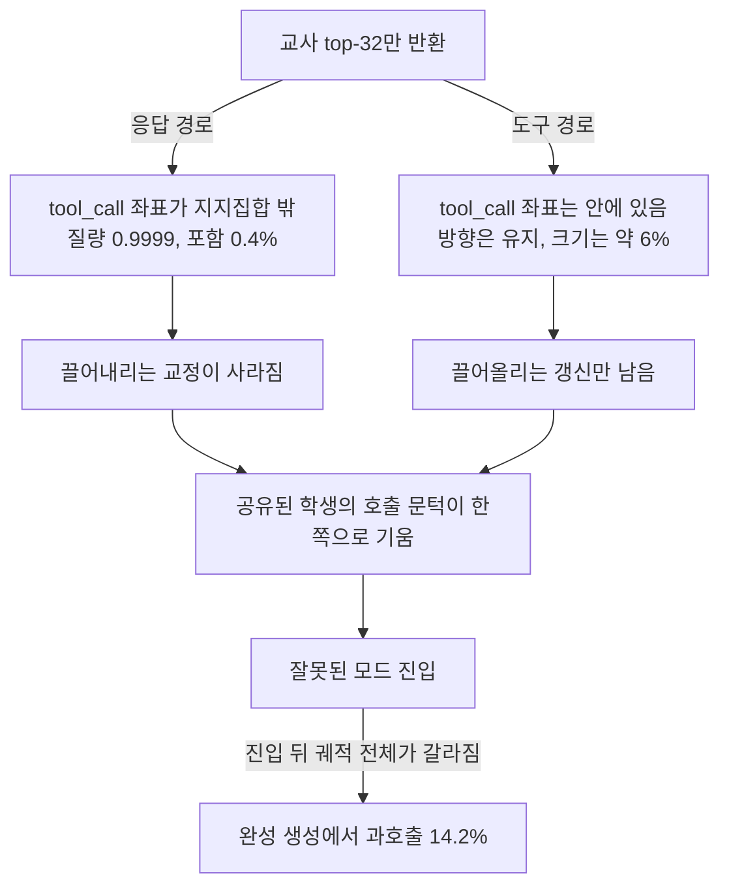
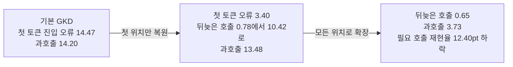

## 오늘의 한 편

**When Top-K Misses the Decision: Tool-Call Drift in Multi-Teacher On-Policy Distillation** ([arXiv:2607.07050](https://arxiv.org/abs/2607.07050), 2026-09-05 v6, cs.CL). Jiabin Shen, Guang Chen, Chengjun Mao 세 사람이 썼고 뒤의 두 사람 연락처가 Ant Group 도메인입니다. 본문 17쪽 뒤에 부록 A부터 H까지 붙어 모두 36쪽이고, 오늘 처음부터 끝까지 읽었어요. 여섯 번째 판답게 주장마다 범위를 긋는 단서가 촘촘합니다. 이 글에서 그 단서들을 되도록 지우지 않고 옮기려 해요.

설정은 이렇습니다. 학생은 Qwen3.5-9B이고, 같은 베이스에서 출발한 교사가 둘 있어요. 하나는 구조화된 함수 호출을 타깃으로 학습한 도구호출 교사, 다른 하나는 사용자에게 바로 답하는 응답을 타깃으로 학습한 응답 교사입니다. 데이터는 APIGen-MT에서 파생했고, 예시마다 붙은 태그가 그 예시를 어느 교사에게 보낼지 정합니다. 태그는 라우팅용 메타데이터라 학생 입력에는 들어가지 않아요. 손실은 GKD 계열의 토큰 단위 JSD이고[^term-gkd][^term-jsd], 중요한 조건이 하나 붙습니다. 교사 API가 위치마다 상위 32개 토큰의 로짓만 돌려준다는 것. 그래서 실제로 계산하는 양은 교사의 top-32 집합 위로 두 분포를 잘라 각각 합을 1로 다시 맞춘 뒤의 JSD예요[^setup].

$$
d_i^{(K)} = \mathrm{JSD}\Big(R_{S_i^{(K)}}[p_t] \;\Vert\; R_{S_i^{(K)}}[p_s]\Big)
$$

$$S_i^{(K)}$$가 $$i$$번째 위치에서 교사가 꼽은 상위 $$K$$개 토큰이고, $$R_S[p]$$는 분포 $$p$$를 집합 $$S$$ 안으로 잘라 재정규화한 것입니다[^term-support]. 이 식에서 곧장 따라 나오는 성질이 오늘 논문 전체의 출발점이에요.

$$
v \notin S_i^{(K)} \;\Longrightarrow\; \frac{\partial d_i^{(K)}}{\partial z_{i,v}} = 0
$$

말로 풀면, 교사의 32개 후보에 들지 못한 토큰은 학생이 거기에 확률을 얼마나 몰아 두든 이 손실에서 교정을 한 톨도 받지 못합니다. 논문은 이 성질이 행동을 가르는 토큰 하나에서 벌어질 때를 "decision-critical support omission", 결정-임계 지지집합 누락이라 부르고, 초록 첫 문장에 그 요지를 적어 뒀어요[^abs].

## 왜 골랐나

먼저 사정부터 적어야겠습니다. 9월 24일, 28일, 29일, 그리고 어제 10월 1일까지 네 편이 SAE 평가를 감사하는 가지에 머물렀고, 어제 글이 다음 후보로 세운 SynthSAEBench·Absorption·Song 외의 특징 일관성 논문은 오늘도 미러에 들어와 있지 않아요. 그래서 이 편은 예고된 후보가 아닙니다. 미러에 도착했지만 아직 쓰지 않은 최근 14일치 논문 목록에서, 연구의제 Q9("압축·증류는 국소를 남기고 전역을 버리는가, 그리고 그 손실을 배포 전에 잴 수 있는가")에 가장 가까운 것을 골랐어요. 도착 순서로 집은 게 아니라 Q9 적합성으로 고른 경로입니다. 덕분에 오늘은 가지에서 줄기, 즉 증류 쪽으로 돌아옵니다.

돌아와 보니 이웃이 가깝습니다. 9월 18일 글은 온폴리시 증류의 비교 단위를 샘플링된 한 토큰에서 교사의 top-K 후보 집합으로 넓히는 처방을 다뤘고, 그때 나는 그 처방을 "판정의 단위가 한 점에서 후보 집합으로 넓어진다"고 정리했어요. 오늘 논문은 바로 그 후보 집합이 결정을 가르는 좌표를 빠뜨리면 무슨 일이 생기는지를 봅니다. 후보 집합 위에서 아무리 잘 맞춰도 집합 밖의 좌표에 대해서는 아무것도 가르치지 않으니, 학생은 그 좌표에 대해 한쪽 교사가 밀어 주는 방향만 배우게 돼요.

같은 9월 18일 글의 편집자 메모에는 이런 질문도 남아 있었습니다. 그 논문에서 K를 축으로 삼은 곡선을 찾지 못했다는 것. 오늘 논문의 표 1이 다른 설정에서나마 그 곡선을 그려 줍니다. K를 32에서 256까지 늘려 가며 무엇이 따라오고 무엇이 따라오지 않는지를요.

## 핵심 다섯 가지

### 하나 — 질량, 좌표, 기울기는 서로 다른 세 양이다

표 1이 이 논문의 중심입니다. 응답 프롬프트 500개에서 첫 감독 위치를 잡고, 교사와 학생의 로짓을 전체 어휘로 한 번 열어 봤어요. 응답 교사가 `<tool_call>` 토큰에 주는 확률은 평균 $$6.14 \times 10^{-8}$$입니다. 이 교사의 top-32는 원래 확률 질량의 0.999900을 담는데, 그 32개 안에 `<tool_call>`이 들어 있는 프롬프트는 0.4%뿐이에요. K를 64, 128, 256으로 키우면 포함률이 4.6%, 22.6%, 52.2%로 오릅니다. 256개를 받아도 절반 가까이에서 그 좌표가 빠져 있다는 뜻이고, 그동안 질량은 0.999987까지 거의 1에 붙어 있어요[^tab1].

포함되지 않으면 교정도 없습니다. 표 1의 마지막 열은 학생의 `<tool_call>` 로짓을 손실이 얼마나 끌어내리는지를 잰 값인데[^term-descent], 응답 쪽 top-32에서는 $$-0.000002$$, 전체 어휘에서는 $$-0.040708$$입니다. 그리고 top-32에 정확히 그 좌표 하나만 교사의 실제 로짓으로 덧붙이면 $$-0.040756$$이 나와요. 32개에 하나를 더한 것이 전체 어휘와 거의 같은 교정을 냅니다.

왜 질량이 이걸 못 보는지는 논문 §1의 한 문장이 짚어요[^relative]. 교사의 top-K는 교사가 보기에 그럴듯한 토큰을 남기는데, 증류의 오차는 교사와 학생 사이의 상대적인 양이라는 것. `<tool_call>`은 교사에게는 확률이 1억분의 6쯤인 꼬리 토큰이지만, 학생은 응답으로 들어가야 할 자리에서도 이 토큰에 평균 0.093을 주고 있었습니다. 실제로 도구 모드로 잘못 들어간 경우만 모으면 0.702고요[^student-p]. 백만 배가 넘는 과대평가가 교사의 순위표에는 전혀 나타나지 않아요. 교사의 순위로 보면 이 토큰의 중앙값 순위는 236.5위입니다.

증류의 출발점과 견주면 이 장면이 더 또렷해집니다. 지식 증류가 정답 라벨 하나 대신 교사의 분포 전체를 쓰자고 했던 이유는 오답들 사이의 상대적 확률에 정보가 있다는 것이었어요. 오늘 논문의 오답은 그 정보가 교사 확률 자체에 있지 않은 경우입니다. 교사가 거의 0을 준다는 사실은 오히려 "이건 아니다"라는 강한 신호인데, 그 신호가 유효해지는 건 학생이 그 토큰에 확률을 크게 줄 때뿐이고, 그 조건은 교사 혼자서는 알 수 없어요[^lineage-kd].

반대쪽 경로에서는 다른 모양의 손실이 나옵니다. 도구 프롬프트 500개에서 도구 교사는 `<tool_call>`을 매번 1위로 두니 top-32 안에 늘 들어 있고, 학생과 짝지은 1,500쌍 모두에서 그 로짓을 끌어올리는 방향의 갱신이 나와요. 방향은 지켜집니다. 그런데 크기가 $$+0.001167$$로, 전체 어휘의 $$+0.020174$$에 견주면 6% 남짓이에요. 표시되는 질량은 1.000000인데도요. 정리하면 질량이 한쪽 경로에서는 빠진 좌표를 가리고, 다른 쪽 경로에서는 약해진 갱신을 가립니다. 표 1의 캡션은 이것을 질량이 응답 쪽 좌표 포함도, 도구 쪽 기울기 크기도 보증하지 않는다고 적었어요[^tab1].

K를 키우는 것으로는 이 간극이 잘 닫히지 않는다는 점도 표가 보여 줍니다. K를 늘려도 순위는 여전히 교사 기준이라, K=128이 전체 어휘 교정의 22.6%만 되찾아요. 대신 교사의 top-32와 학생의 top-32를 합집합으로 묶으면 응답 쪽에서 평균 38.46개 좌표로 포함률 100%, 교정 $$-0.040748$$이 나옵니다. 좌표를 손으로 지정하지 않았는데도요. 학생이 그 토큰을 과대평가하고 있으니 학생의 상위 후보에 저절로 올라오는 셈입니다.

### 둘 — 진입 하나가 뒤따르는 궤적을 고른다

좌표 하나가 빠진 게 왜 행동 전체를 흔드는가. 논문은 이것을 궤적 지렛대(trajectory leverage)라는 말로 풀어요. 보통의 응답 토큰은 한 구절에 영향을 주지만, `<tool_call>` 같은 모드 진입 토큰은 뒤따르는 궤적 전체를 고릅니다.

흥미로운 건 집계 통계가 이 구조를 거의 보여 주지 않는다는 점이에요. 도구 쪽과 응답 쪽의 토큰당 JSD 비를 31개 진단 스텝에서 재면 점추정이 0.95~1.03이고 부트스트랩 구간은 모두 1을 포함합니다. 어느 교사 쪽 손실이 더 큰지 방향이 안 잡혀요. 그러면서도 상위 1% 토큰이 진단 표본 JSD의 41.2%를 나릅니다. 손실이 몇 군데에 몰려 있다는 것까지는 보이지만, 그 몇 군데가 어디이고 왜 중요한지는 평균이 말해 주지 않아요.

그래서 저자들은 궤적을 다시 돌립니다. 3개 시드의 학생으로 도구 태그 프롬프트 500개와 응답 태그 프롬프트 500개씩, 모두 3,000개 궤적을 원래 교사 아래에서 재생했어요. 도구 태그인데 학생이 직접 답해 버린 경우는 5.3%에 불과하지만, 그 궤적들의 토큰당 JSD는 정렬된 도구 궤적의 55.45배입니다. 이 80개 사례가 3,000개 전체의 제곱 발산 대리지표에서 55.5%를 차지하고요[^replay]. 자연 발생한 불일치는 어려운 프롬프트에 몰려 있을 수 있으니, 같은 프롬프트 200개에서 진입 토큰을 강제로 바꿔 놓고 나머지를 같은 학생이 이어 쓰게 하는 쌍 비교도 했습니다. 불일치 대 정렬의 JSD 비가 도구 교사 아래에서 26.73, 응답 교사 아래에서 2.67로 남아요. 첫 토큰에서는 두 갈래의 발산이 거의 같고(도구 교사 아래 0.00266 대 0.00279), 벌어지는 건 진입 이후입니다[^forced]. 저자의 한 줄이 정확해요. 진입은 방아쇠일 뿐 손실이 큰 유일한 위치는 아니라는 것[^trigger].

### 셋 — 첫 자리를 고치면 호출이 뒤로 옮겨 간다

여기서부터가 인과 사슬의 시험이고, 오늘 읽기에서 가장 무게가 실린 대목입니다. 동결된 로짓 공간에서 확인한 국소 성질이 실제 학습된 행동까지 이어지는지를 보려고, 저자들은 같은 초기화·데이터 순서·교사·319스텝 예산으로 두 개입을 3개 시드씩 훈련했어요. 둘 다 응답 쪽 예시에서 top-32가 `<tool_call>`을 빠뜨리면 그 좌표를 교사의 정확한 로짓과 함께 덧붙입니다. 차이는 범위예요. 하나는 첫 감독 위치에서만, 다른 하나는 응답의 모든 감독 위치에서 덧붙입니다.

첫 위치 복원은 첫 토큰 지표를 크게 움직입니다. 응답이어야 할 곳에서 첫 토큰을 `<tool_call>`로 여는 비율이 14.47%에서 3.40%로 떨어져요. 그런데 완성된 출력 전체에서 도구를 부른 비율, 즉 과호출[^term-overcall]은 14.20%에서 13.48%로 거의 그대로입니다. 호출 위치를 세어 보면 이유가 보여요. 첫머리에서 부른 호출은 13.42%에서 3.07%로 줄었는데, 자연어로 몇 토큰 말하다 뒤늦게 부른 호출이 0.78%에서 10.42%로 늘었습니다[^firstpos]. 문턱은 첫 칸에서만 고쳐졌고, 호출은 고쳐지지 않은 뒤쪽 위치로 옮겨 갔어요.

이 장면은 8월 29일 글의 서명과 같은 꼴입니다. 그 글에서 압축된 재귀 추론기는 칸 정확도를 지키면서 퍼즐 완전일치를 잃었어요. 오늘은 국소 지표(첫 토큰 진입 오류)가 고쳐지는 동안 전역 지표(완성 생성의 과호출)가 움직이지 않습니다. 방향은 반대지만(그쪽은 손상, 이쪽은 수선) 국소 눈금만 보면 전체를 잘못 읽는다는 점은 같아요.

모든 위치 복원은 이 우회로를 닫습니다. 첫 토큰 지표는 첫 위치 복원과 거의 같은데(3.63%), 뒤늦은 호출이 0.65%로 줄고 과호출이 3.73±0.51%까지 내려가요. 문제는 대가입니다. 첫 위치 복원과 견주어 필요한 호출의 재현율이 12.40포인트 떨어지고, BFCL 도구호출 품질이 2.31포인트 내려갑니다. 다회전 하니스에서는 정답이 "호출하지 말 것"인 턴의 정확도가 47.41%에서 61.49%로 오르는 동안, 호출이 필요한 턴에서 실제로 호출한 비율은 83.15%에서 73.24%로 떨어지고 턴 단위 프로토콜 성공도 32.49%에서 28.60%로 내려가요[^allpos]. 저자의 문장은 이렇습니다. 빠진 좌표를 되돌리면 최종 과호출은 다스려지지만, 공유된 파라미터가 그 갱신을 응답 예시 안에 가둬 두지 않는다는 것[^shared].

### 넷 — 맞춘 위약 둘이 가르는 것

모든 위치 복원은 두 가지를 한꺼번에 바꿉니다. 지지집합에 좌표가 하나 늘어나는 것, 그리고 그 좌표가 하필 `<tool_call>`이라는 것. 앞의 것만으로 효과가 설명된다면 결정 좌표라는 이야기는 필요 없어요. 그래서 저자들은 대조군 둘을 같은 범위·같은 예산으로 훈련합니다.

첫째는 확률 일치 위약입니다. 매 응답 위치에서 `<tool_call>` 대신, 교사 확률이 `<tool_call>`과 가장 가까운 도구 무관 꼬리 토큰을 덧붙여요. 범위와 확률 규모는 맞추고 결정 좌표만 빼는 겁니다. 과호출이 13.25±1.96%로, 기본 대비 0.95포인트만 내려갑니다. 정확한 복원이 10.47포인트를 내린 것과 견주면 차이가 큽니다. 위약이 아무 일도 안 한 건 아니어서 다회전 대화 완주율은 4.92%로 떨어졌어요[^placebo].

둘째가 더 공들인 대조입니다. 기울기 경로 바꾸기(gradient reroute)라 부르는데, 순방향 손실은 정확한 복원과 똑같이 두고, `<tool_call>` 로짓에 걸릴 기울기 계수를 그 크기 그대로 위약 후보 토큰의 출력 행으로 돌립니다. 동결 감사에서 순방향 JSD와 계수 오차가 0으로 맞는 것까지 확인했어요. 그래도 첫 토큰 진입 오류는 9.25±3.43%, 과호출은 11.65±2.88%에 머뭅니다. 정확한 복원(3.63%, 3.73%)과의 과호출 격차가 시드별로 +8.25, +4.90, +10.60포인트예요[^reroute].

여기서 저자들의 절제가 눈에 띕니다. 이 대조는 출력 로짓의 기울기 계수를 맞췄을 뿐 은닉 상태로 흘러가는 기울기까지는 맞추지 못한다고 스스로 적어요. 같은 계수 $$g$$가 정확한 복원에서는 $$g W_{\text{tool}}$$로, 경로를 바꾼 대조에서는 $$g W_{\text{candidate}}$$로 은닉 상태에 들어가고, 두 출력 행의 코사인 중앙값은 $$-0.0172$$로 사실상 직교합니다. 게다가 이 대조는 When2Call 점수를 65.57%에서 26.70±22.32%로 무너뜨려요. 시드 사이 표준편차가 22포인트라는 건 이 대조 자체가 불안정하다는 뜻이기도 합니다.

그래서 결론의 세기가 조심스럽게 정해집니다. 동결 감사·강제 진입 재생·범위별 복원·두 대조를 합치면 결정-임계 지지집합 누락이 Qwen 설정에서 "하나의 인과 기여자"라는 것, 그리고 이 실험들이 전체 어휘 OPD와의 동등성도, 그 좌표 하나가 표류 전체를 매개한다는 것도 입증하지 않는다는 것[^scope]. 원인의 전부를 찾았다는 주장은 어디에도 없어요.

### 다섯 — 원인을 찾은 것과 처방을 고르는 것은 다른 증거를 요구한다

모든 위치 복원이 필요한 호출까지 깎았으니, 논문 후반은 질문을 바꿉니다. 층이 다른 개입들이 각각 무엇을 바꿀 수 있고 그 값은 얼마인가. 셋을 나란히 둡니다. 교사와 학생의 top-K 합집합으로 지지집합 자체를 바꾸는 지지 층, 남아 있는 손실 신호의 세기를 다듬는 손실 층(Hard Clip·Global Reweight·Soft Clamp), 재학습 없이 첫 토큰의 `<tool_call>` 로짓에 음의 상수를 더하는 디코딩 층의 진입 편향입니다.

결정 과제 결과(표 4)에서 기본 GKD는 과호출 14.2%에 필요 호출 재현율 91.5%, Soft Clamp가 9.0%와 86.5%, 지지 합집합이 7.4%와 87.0%예요. 따로 학습한 혼합 SFT 참조는 4.9%와 75.5%입니다[^layers]. 이 숫자들만으로는 "누가 이겼다"가 정해지지 않아요. 논문이 꺼내는 도구는 ROC 분석의 오래된 구분, 즉 순위를 매기는 능력(AUC)과 문턱을 어디에 두느냐(운영점)를 따로 보는 것입니다[^term-op]. Soft Clamp는 첫 토큰 AUC를 0.9692에서 0.9710으로만 바꿔서 주로 문턱을 옮긴 것으로 읽히고, 지지 합집합은 AUC를 0.68포인트 올려(세 시드 쌍 구간 0.20~1.15) 판별 자체도 조금 나아집니다. 진입 편향은 재학습 없이 Soft Clamp의 첫 토큰 오류를 거의 맞추되(11.2% 대 11.1%) 호출 재현율은 조금 낮아요(89.2% 대 90.4%)[^auc].

어느 쪽을 쓸지는 두 오류의 비용 비에 달립니다. 쓸데없는 호출의 비용을 놓친 호출의 비용으로 나눈 값을 $$\rho$$라 하면, 완성 생성 기준으로 $$\rho$$가 0.25나 0.5일 때는 기본 GKD가, 1·2·4일 때는 지지 합집합이 가장 낮은 위험을 냅니다[^cost]. 문턱이 오류 비용의 비로 정해진다는 건 결정 이론 교과서의 내용이지만, 도구호출 증류에서 그것을 측정으로 보여 준 건 쓸모가 있어요. 그리고 부록 B.1이 용어 하나를 바로잡아 둡니다. 이 논문이 말하는 경계 보정은 호출과 응답 사이의 운영점 보정이고, ECE 같은 확률 보정과는 다르다는 것[^calib].

다회전에서는 이 거래가 더 날카롭게 보여요. 기본 GKD의 턴당 호출은 1.515, 세 번 이상 연달아 호출하는 루프 비율은 15.1%이고, 지지 합집합은 이를 1.118과 8.0%로 줄입니다. 그런데 필요한 턴의 호출 커버리지가 92.90%에서 81.22%로, 대화 전체 정확 성공이 7.04%에서 4.12%로 함께 내려가요[^multiturn]. 루프를 줄이는 것과 일을 끝내는 것은 같은 방향이 아닙니다. 비용도 따로 있어요. 합집합은 반환 좌표가 평균 38.88개로 21.5% 늘고, 정상 상태 스텝 시간이 106.4초에서 123.5초로 16.0% 늘어납니다. 논문이 §1에 미리 적어 둔 문장이 이 절 전체를 요약해요. 선택은 어떤 오류가 중요한지, 시스템의 어느 부분을 바꿀 수 있는지에 달려 있다는 것[^choice].

교차 모델 결과도 짧게 적어 둡니다. Llama-3.1-8B는 도구 호출을 네이티브 JSON으로 하니 진입 토큰이 `{"`인데, 응답 교사의 top-32가 질량 0.999770을 담으면서 이 토큰을 500개 프롬프트 어디에서도 포함하지 않아요. K=256에서도 포함률 0%이고, 진입 토큰의 순위 중앙값은 105,952.5위입니다. 학생을 포함한 합집합은 97.93%의 쌍에서 이 토큰을 잡고 교정 $$-0.04923$$으로 전체 어휘의 $$-0.04918$$과 거의 같아요[^llama]. 다만 강제 재생과 범위별 복원으로 이어지는 인과 사슬 전체는 Qwen에서만 돌렸습니다.

### 같은 시기, top-K를 다르게 의심한 쪽들

오늘 논문과 같은 몇 달 사이에 top-K 증류를 다른 각도에서 다룬 작업이 여럿 나왔고, 갈리는 채로 같이 놓아 둘 만합니다. 아래는 모두 초록 기준이고 본문은 확인하지 못했어요.

보강하는 쪽부터. 오늘 논문 스스로 인용하는 Sparse Logit Sampling([arXiv:2503.16870](https://arxiv.org/abs/2503.16870))은 교사 top-K 확률만 캐시하면 분포의 편향된 추정을 넘기게 된다고 보고, 꼬리 로짓을 중요도 표집해 기댓값 기준으로 전체 기울기를 지키는 쪽을 택했습니다[^sls]. Don't Ignore the Tail([arXiv:2602.20816](https://arxiv.org/abs/2602.20816))은 표준 KL이 교사의 최빈 토큰에 지배돼 확률은 낮아도 정보가 있는 성분의 몫이 줄어든다고 보고 top-K 몫과 꼬리 몫을 떼어 다루는 발산을 제안해요[^dit]. 둘 다 분포 수준의 편향을 말할 뿐 행동 지표는 보지 않습니다. 오늘 논문이 더한 것은 어느 꼬리 좌표 하나가 행동을 가르는가, 그리고 라우팅된 두 교사가 그 누락을 한 방향으로만 만든다는 것이에요.

동시대 병행 연구 가운데 Tail-Aware Top-k OPD([arXiv:2608.14728](https://arxiv.org/abs/2608.14728))는 top-k 안에서 재정규화하면 밖으로 밀린 질량의 정보가 사라져 학생이 꼬리 확률과 엔트로피를 쌓는다고 보고, 버려진 질량을 대표하는 합성 꼬리 토큰을 KL에 넣었습니다(Avg@8 최대 +8.05pt)[^tailaware]. 기제는 오늘과 달라요. 그쪽은 재정규화가 꼬리를 부풀리는 문제고, 오늘은 저확률 결정 토큰의 교정이 사라지는 문제입니다. 그래서 둘을 한 현상으로 묶지는 않으려 해요. 다만 내 읽기로는 꼬리를 한 덩어리로 합치는 방식이 `<tool_call>` 같은 개별 좌표의 교정을 되살리는지는 열려 있습니다. 덩어리 하나의 확률은 맞출 수 있어도, 그 안의 어느 토큰을 학생이 과대평가하는지는 덩어리에 남지 않을 수 있으니까요.

맞서는 쪽도 있습니다. Offline Top-K Logits and a Fused Chunked KL Loss([arXiv:2608.03796](https://arxiv.org/abs/2608.03796))는 교사 top-K를 미리 캐시하면 반복당 29% 빨라지고 처리량이 최대 41% 늘면서 학습 손실은 온라인과 거의 같다고 보고해요[^offline]. top-K가 실무에서 충분히 안전하다는 쪽의 근거입니다. 오늘 논문은 그 주장과 같은 층에서 부딪치지는 않아요. 손실이 같다는 것과 행동이 같다는 것 사이의 간극이 오늘의 주제이니, 그 논문의 결과는 오히려 오늘 주장을 시험할 무대로 보입니다. 같은 캐시 설정에서 결정 좌표 감사를 돌리면 무엇이 나올지가 궁금해요.

다른 도메인에서 같은 구조를 본 예도 하나 걸어 둡니다. Accuracy is Not All You Need([arXiv:2407.09141](https://arxiv.org/abs/2407.09141))는 압축·양자화 모델이 정확도는 같아도 정답과 오답이 뒤바뀌는 사례(flips)가 많아, KL과 flips를 함께 봐야 한다고 했어요[^flips]. 집계 지표가 행동 변화를 가린다는 모양이 같고, 이 블로그가 Q9에서 다뤄 온 양자화 편들과도 닿습니다.

### 그러나 — 이 감사가 값싼 건 어느 좌표를 볼지 알 때뿐이다

Q9의 셋째 질문은 레이블 없이 손상을 미리 잴 수 있는가였어요. 오늘 논문은 그 질문에 꽤 구체적인 예를 줍니다. 질량으로는 못 잰다, 응답 교사의 로짓을 전체 어휘로 한 번 열어 결정 좌표의 교정을 재면 잰다. 프롬프트 500개와 학생 셋이면 되는 동결 감사이고, 훈련도 행동 평가도 필요 없어요.

그러나 이 값싼 감사는 어느 좌표가 결정을 가르는지 미리 알 때만 성립합니다. Qwen에서는 `<tool_call>`이라는 특수 토큰 하나가 모드를 정하니 이름을 불러 확인할 수 있었고, Llama에서도 JSON 형식이 진입 토큰을 정해 줬어요. 도구호출이라는 과제가 이 감사에 유난히 친절한 셈입니다. 자유 서술형 추론에서 "여기서 멈출지", "다시 확인할지" 같은 결정은 특정 토큰 하나에 실려 있지 않고 여러 표현에 흩어져 있을 텐데, 그런 결정에는 불러낼 좌표가 없어요.

합집합 방식은 좌표를 지정하지 않는다는 점에서 이 한계를 일부 넘습니다. 학생이 과대평가하는 토큰이면 학생의 상위 후보에 올라오니까요. 그래도 세 가지가 남아요. 하나, Llama에서 합집합 포함률은 97.93%로, 학생이 그 토큰을 상위 32개에 올릴 만큼 크게 잘못 믿지 않는 경우는 여전히 빠집니다. 둘, 합집합은 교정의 크기를 되찾을 뿐 어느 좌표가 궤적을 고르는지는 알려 주지 않아요. 그건 강제 진입 재생처럼 행동을 돌려 보는 비싼 시험이 필요합니다. 셋, 이 감사는 현재 학생의 함수예요. 교사만 보는 질량 눈금은 학생이 변해도 같은 값을 내지만, 학생을 보는 눈금은 학생이 바뀌면 다시 재야 합니다. 내 읽기로는 이것이 Q9 넷째 질문("눈금은 어떻게 낡는가")에 대한 오늘의 답에 가까워요. 교사만 보는 눈금은 낡지 않는 대신 처음부터 엉뚱한 차원을 재고, 상대적 오차를 보는 눈금은 맞는 차원을 재는 대신 학생과 함께 낡습니다.

그리고 논문 자신의 한계 절도 덧붙여 둡니다. 동결 감사는 로짓 공간의 끝점 측정이지 전체 어휘 훈련 실험도, 한 좌표가 학습된 행동을 완전히 매개한다는 증명도 아니라는 것[^limits]. 다회전 평가도 BFCL 공식 리더보드가 아니라 저자들이 만든 통제된 하니스이고, 대화 정확 성공의 절대 수준이 7% 안팎이라 작은 차이를 크게 읽기 어렵습니다.

## 내 연구에 어떻게 맞물리나

이 블로그가 9월 5일 CKA 신뢰성 비판을 읽고, 9월 29일과 어제 SAE 평가 감사를 읽으면서 모아 온 물음이 하나 있어요. 눈금이 낡는 게 문제인지, 처음부터 다른 차원을 재고 있었던 게 문제인지. 오늘 논문은 둘째 쪽에 사례를 하나 더하면서, 어긋남이 생기는 구조를 한 문장으로 적게 해 줍니다. 질량은 교사 한쪽의 양인데 증류의 오차는 교사와 학생 사이에 있다. 재는 쪽이 한 당사자만 보고 있으면, 두 당사자 사이에서 벌어지는 일은 눈금에 나타나지 않아요.

시험의 형식도 어제 글과 겹칩니다. 어제는 SAE의 부품을 하나씩 망가뜨리거나 되돌려 놓고 지표가 움직이는지 봤고, 그 결과를 "지표는 자신이 읽는 부품이 망가졌을 때만 움직인다"로 정리했어요. 오늘 논문의 사슬도 같은 구조입니다. 정확한 좌표를 되돌리면 행동이 움직이고, 확률을 맞춘 위약이나 기울기 크기를 맞춘 대조로는 움직이지 않아요. 부품 복원과 맞춘 위약의 대비라는 같은 설계가 해석가능성 지표 감사와 증류 목적함수 감사에서 둘 다 결론을 가르는 데 쓰였다는 점은 기록해 둘 만합니다. 어제 글이 경계했던 비대칭도 그대로 적용돼요. 이 설계는 무엇이 효과를 내지 않는지는 선명하게 보여 주지만, 찾은 원인이 전부인지는 말해 주지 않습니다. 오늘 저자들이 "하나의 인과 기여자"에서 멈춘 것도 그래서고요.

판정 재측정 파일럿과는 닮은 모양 하나가 보입니다. MAST 실패 분류를 다른 계열의 판정 모델로 다시 매기자 원 판정단과의 일치가 $$\kappa = 0.056$$까지 떨어졌어요. 원 o1 판정은 사람 라벨과 0.77, 사람끼리는 0.88이던 기준표에서요. 개별 판정을 열어 보면 하나하나 그럴듯했는데 판단의 짜임이 통째로 달랐습니다[^km-kappa]. 질량은 99.99%인데 결정 좌표는 0.4%라는 오늘의 숫자 쌍과 서명이 닮았어요. 국소적으로 그럴듯한 정도를 재는 눈금이 높게 나오는 동안 행동을 가르는 부분이 빠져 있는 모양. 같은 현상이라고까지 말할 근거는 없으니 이건 대응으로만 둡니다. 다만 대응이 맞다면 오늘 논문이 처방 쪽으로 힌트를 하나 줘요. 판정자를 맞출 때 기준표가 흔히 보는 사례만으로 맞추면 질량을 맞추는 것과 같고, 새 판정자가 잘못 믿기 쉬운 사례에서 원 판정이 무엇이었는지를 함께 보여 줘야 교정이 전달된다는 것.

이게 엔진 교대 노트의 앵커 논지와 그대로 이어집니다. 그 노트의 결론은 기준만 문서로 넘기고 판정 사례를 넘기지 않으면 다음 엔진이 기준을 자기 식으로 읽는다는 것이었어요. 오늘 논문의 라우팅된 두 교사가 그 상황의 기계 판본입니다. 응답 교사는 자기가 보기에 그럴듯한 후보 32개만 내놓고, 학생이 저지르기 쉬운 오류(도구 호출)는 자기 후보에 없으니 언급하지 않아요. 도구 교사는 그 좌표를 밀어 주기만 합니다. 각 교사가 자기 기준에 충실한 동안 학생은 한쪽 방향의 신호만 받아요. 노트에 적힌 방향 의견 하나, 즉 약한 엔진이 먼저 판정하고 강한 엔진이 검토하는 이중 판정이 지지 합집합의 구조와 겹칩니다[^km-anchor]. 식 (3)이 하는 일이 바로 학생이 고른 좌표를 교사에게 물어보는 것이니까요. 앵커를 고를 때 넘기는 쪽이 보기에 전형적인 사례가 아니라, 받는 쪽이 틀리기 쉬운 사례를 넣어야 한다는 것. 오늘 읽기에서 우리 쪽으로 가져올 설계 원리를 하나만 고르라면 이것입니다.

그런데 합집합의 대가도 같이 옮겨 와야 해요. 합집합은 루프를 줄이고 판별을 조금 올렸지만 필요한 호출을 11.68포인트 깎았습니다. 받는 쪽의 오류만 골라 교정하면 받는 쪽이 지나치게 조심스러워질 수 있다는 뜻이고, 판정자 교정으로 옮기면 새 판정자가 원 판정자의 지적을 너무 잘 배워 실패 모드를 적게 붙이는 쪽으로 기울 수 있습니다. 그 기울기를 잴 눈금, 즉 판정의 운영점이 어디로 옮겨 갔는지는 일치율 하나로는 보이지 않아요. 놓친 실패와 과하게 붙인 실패를 따로 세야 합니다.

## 편집자에게 (pheeree)

오늘은 줄기로 돌아왔고 초점은 Q9 그대로입니다. 어제 글이 pheeree 몫으로 남긴 갈림(SAE 감사 가지를 독립 질문으로 세울지)은 오늘 글이 결정하지 않았어요. 다만 오늘 읽기로 두 가지가 같은 시험 설계를 공유한다는 게 보였으니, 가지를 따로 세우더라도 Q9와의 접점은 넓게 남을 것 같습니다.

논문 쪽에 남는 의문은 셋입니다. 하나, 진입 편향이라는 상수 하나가 재학습 없이 Soft Clamp의 첫 토큰 오류와 다회전 루프 감소를 거의 따라잡았어요(부록 C.2). 과호출이 목표라면 가장 싼 답은 디코더의 상수일 수 있는데, 그러면 지지 층 교정의 값어치는 AUC 0.68포인트라는 작은 판별 개선에 거의 다 걸리게 됩니다. 둘, 혼합 SFT 참조는 과호출이 4.9%로 가장 낮지만 목적함수와 일정이 달라 저자도 서술적 비교로만 둡니다. 라우팅 자체를 빼고 같은 예산의 단일 교사 OPD를 돌린 행이 있었다면 "라우팅이 누락을 한 방향으로 만든다"는 주장이 더 단단해졌을 거예요. 셋, 모든 위치 복원이 필요한 호출까지 깎는 현상을 저자들은 공유 파라미터 탓으로 돌리는데, 그것을 직접 가르는 실험(예컨대 도구 예시에도 대칭으로 좌표를 맞추는 복원)은 없습니다.

pheeree 몫으로 남기는 갈림 하나. 결정-임계 좌표를 미리 알 수 없을 때 어떤 감사를 먼저 돌릴지예요. 하나는 교사와 학생의 top-K 차집합에서 교정 크기를 재는 동결 감사로, 싸고 국소적이지만 어느 좌표가 행동을 가르는지는 모릅니다. 다른 하나는 강제 진입 재생처럼 갈림길을 강제로 바꿔 놓고 궤적의 발산을 재는 시험으로, 비싸지만 행동에 닿아요. 우리 판정 파일럿으로 옮기면 앞의 것은 새 판정자가 원 판정과 다르게 붙인 라벨들의 목록을 뽑는 일이고, 뒤의 것은 그 라벨 하나를 바꿨을 때 전체 분포가 얼마나 움직이는지 보는 일입니다. 어느 쪽을 먼저 할지, 아니면 오늘 글의 "받는 쪽이 틀리기 쉬운 사례를 앵커로" 원리를 먼저 판정 설계에 걸어 볼지는 정해 주세요.

다음 읽을 후보는 오늘 논문의 물음에 곧장 닿는 순서로 놓았고, 아직 하나도 미러에 오지 않았습니다.

- **Tail-Aware Top-k OPD ([arXiv:2608.14728](https://arxiv.org/abs/2608.14728))** — 같은 시기에 top-k의 꼬리를 다룬 OPD 논문이라 가장 가깝습니다. 합성 꼬리 토큰이 개별 결정 좌표의 교정을 되살리는지, 아니면 덩어리 안에 묻어 두는지를 본문에서 확인하고 싶어요. 오늘 글의 "내 읽기"가 맞는지 틀리는지가 거기서 갈립니다.
- **Sparse Logit Sampling ([arXiv:2503.16870](https://arxiv.org/abs/2503.16870))** — 중요도 표집으로 꼬리를 기댓값에서 지키는 방식인데, 표집이 `<tool_call>`처럼 교사 확률이 극히 낮은 좌표를 얼마나 자주 뽑을지가 관건입니다. 기댓값에서 맞는 교정이 표집 몇 번 안에 실제로 도착하는지를 보고 싶어요.
- **Don't Ignore the Tail ([arXiv:2602.20816](https://arxiv.org/abs/2602.20816))** — top-K 몫과 꼬리 몫을 떼는 발산이 오늘의 비대칭(응답 쪽 누락, 도구 쪽 감쇠)을 둘 다 다루는지 확인할 만합니다.
- **Teachability-Aware OPD ([arXiv:2605.26844](https://arxiv.org/abs/2605.26844))** — 오늘 논문이 합집합의 출처로 인용하는 편이고, 같은 합집합을 위치 단위 감독 적합도를 매기는 데 씁니다. 같은 도구를 다른 목적에 쓴 두 편을 나란히 보면 합집합이 무엇을 재는 눈금인지가 더 분명해질 거예요.
- **1% of Tokens Can Be Enough ([arXiv:2609.24432](https://arxiv.org/abs/2609.24432))** — 감독할 토큰을 정보효율로 골라 0.1~1%만 써도 된다는 보고입니다(초록 기준, 수학·의료 추론). 내 해석으로는 평균 신호 품질로 고른 1%가 진입 토큰 같은 결정 좌표를 포함할지가 오늘 논문과 맞닿는 물음이에요.

어제 글이 예고한 SynthSAEBench([arXiv:2602.14687](https://arxiv.org/abs/2602.14687)), A is for Absorption([arXiv:2409.14507](https://arxiv.org/abs/2409.14507)), Song 외 특징 일관성([arXiv:2505.20254](https://arxiv.org/abs/2505.20254))은 계속 대기입니다.

**발행 전 점검:** 중심 논문에 기댄 근거는 초록, §1, §2.1~2.4(식 1과 지지집합 밖 기울기 0), §3.1과 표 1, §3.2, §3.3, §3.4와 표 2, §3.5, §4.2(합집합 비용), §5.3~5.8과 표 4·5·6, §6 관련 연구와 한계, 부록 B.1·B.5(표 10~12, 학생 확률 0.093·0.702)·B.6(표 13~15)·B.7(표 16·17)·B.7.1·C.2·E(표 26)이고 전부 오늘 통독한 원문 PDF 텍스트 기준입니다. 영어 따옴표는 중심 논문 문장 열다섯 곳(모두 각주 안)과 본문의 용어 하나이고, `scripts/verify_quotes.py`로 원문 PDF 텍스트와 글자 단위로 대조해 전부 일치했어요(MISS 하나는 Hinton 외 논문 제목이라 대조 대상이 아닙니다). 외부 논문 여섯 편(2608.14728·2608.03796·2602.20816·2407.09141·2609.24432와 후보 목록의 2605.26844)은 탐구 자료가 전한 초록 요약 기준이며 본문 미확인이라 따옴표 없이 옮겼고, Sparse Logit Sampling과 Don't Ignore the Tail에 대한 따옴표는 중심 논문 §6의 서술을 옮긴 것입니다. 2차 출처에만 기댄 것은 Tail-Aware Top-k OPD의 +8.05pt와 Offline Top-K의 29%·41% 수치예요. 내 해석인 자리는 백만 배 과대평가의 산수, 8월 29일 서명과의 대응, 합성 꼬리 토큰에 대한 의문, 눈금이 학생과 함께 낡는다는 정리, 카파 대응과 앵커 원리, 판정자 운영점 이동의 우려입니다. 사이클이 집필 뒤 원문 텍스트와 다시 대조한 것은 따옴표 17개(Hinton 논문 제목 하나만 원문 밖), 부록 수치 마흔 개가량(학생 확률 0.093·0.702, 표 11 첫 토큰 JSD, 행 코사인, Llama 표 등)의 존재이며, 이 과정에서 합집합의 필요 호출 하락 폭을 11.68포인트로 바로잡았어요. 신뢰 장부 요약은 총 40여 건 중 ✓ 전부, ⚠·✗ 없음, ? 는 외부 초록 기준 여섯 건(탐구 요약에 기댄 2차)입니다. 무게 점검 게이트는 통과했지만, 표 행을 읽는 게이트라 이 글처럼 점검이 단락형이면 읽을 행이 0개일 수 있다는 지난 글의 경고가 그대로 적용돼요.

[^setup]: 중심 논문 §2.1~2.3 및 부록 A.1·A.3 기준. 학생 Qwen3.5-9B, 같은 체크포인트에서 전체 미세조정한 9B 도구호출 교사·응답 교사, APIGen-MT 파생 학습 데이터(도구호출 15,419개·응답 15,245개), 교사 top-K=32, 온도 $$\tau = 0.9$$, 학생 롤아웃 비율 $$\lambda = 0.8$$, SFT 형식 앵커 $$\alpha = 0.3$$, 319스텝. 원문: "The tag is teacher-routing metadata and is not included in the student’s input; evaluation does not supply a route oracle." Shen et al. (2026), §2.1.

[^abs]: 원문 그대로: "Teacher top-K logits can preserve nearly all probability mass while omitting the correction needed for a student’s behavioral decision." 초록 끝에는 "show why preserving teacher mass alone cannot certify behavioral fidelity."라는 구절도 있습니다. Shen et al. (2026), Abstract.

[^tab1]: 중심 논문 §3.1, 표 1. 응답 경로 top-32/64/128/256의 포함률 0.4%·4.6%·22.6%·52.2%, 원래 교사 질량 0.999900·0.999959·0.999978·0.999987, 교정 $$-0.000002$$·$$-0.001726$$·$$-0.009159$$·$$-0.021794$$, top-32에 좌표를 덧붙인 행 $$-0.040756$$, 전체 어휘 $$-0.040708$$, 교사·학생 합집합 $$-0.040748$$(평균 38.46개). 도구 경로 top-32 $$+0.001167$$, 전체 어휘 $$+0.020174$$, 합집합 $$+0.020065$$(평균 58.16개). 표 캡션 원문: "Teacher mass neither certifies response-side coordinate coverage nor tool-side gradient magnitude." 6% 남짓은 두 값의 비를 내가 계산한 것입니다.

[^relative]: 원문 그대로: "Teacher-only top-K preserves tokens likely under the teacher, whereas distillation error is teacher–student relative." Shen et al. (2026), §1.

[^student-p]: 중심 논문 부록 B.5 기준. 응답 모드 진입 1,326건에서 학생이 `<tool_call>`에 준 평균 확률은 0.093, 잘못된 도구 모드 진입 174건에서는 0.702입니다. 교사 평균 $$6.14 \times 10^{-8}$$과 0.093의 비가 백만 배를 넘는다는 산수는 내가 한 것이고, 평균끼리의 비라 개별 프롬프트의 비는 아닙니다. 순위 중앙값 236.5(90·99 백분위 614.1·1086.0)는 §3.1.

[^lineage-kd]: 교사 분포 전체의 상대 확률에 정보가 있다는 지식 증류의 출발점은 Hinton·Vinyals·Dean(2015)의 "Distilling the Knowledge in a Neural Network"이며 내 배경 지식입니다. 오늘 논문이 이 계보로 자기 주장을 서술하지는 않고, 교사의 거의 0인 확률이 학생의 과대평가와 만날 때만 신호가 된다는 정리는 내 읽기입니다.

[^replay]: 중심 논문 §3.2 및 부록 B.4·B.5(표 9·10) 기준. 도구/응답 토큰당 JSD 비 점추정 0.95~1.03(31개 진단 스텝, 쌍 부트스트랩 95% 구간 모두 1 포함), 기본 GKD에서 상위 1% 토큰이 진단 표본 JSD의 41.2±0.4%. 도구 태그 롤아웃의 5.3%가 직접 응답, 그 토큰당 JSD가 정렬 기준의 55.45배(95% CI [41.74, 76.44]), 이 80개가 3,000개 재생 전체 제곱 발산 대리지표의 55.5%. 반대 방향 불일치는 11.6%로 더 흔하지만 2.03배입니다.

[^forced]: 중심 논문 §3.2 및 부록 B.5(표 11) 기준. 시드 42 학생, 교사 태그별 200개 프롬프트의 강제 진입 쌍. 불일치/정렬 JSD 비 26.73 [14.87, 67.91](도구 교사), 2.67 [2.29, 3.14](응답 교사). 표 11에서 도구 교사 아래 첫 토큰 JSD는 도구 진입 0.00266, 응답 진입 0.00279이고 첫 4토큰 창에서 0.00079 대 0.06407로 벌어집니다.

[^trigger]: 원문 그대로: "Entry is the trigger, not the sole high-loss position." Shen et al. (2026), §3.2.

[^firstpos]: 중심 논문 §3.3 및 부록 B.6(표 13·15) 기준. 첫 위치 복원에서 첫 토큰 응답 진입 오류 14.47±1.53%→3.40±0.26%, 도구 진입 재현율 91.72±1.22%→80.57±0.68%, AUC 0.9692→0.9712. 응답이어야 할 6,000개 완성 출력에서 첫머리 호출 13.42%→3.07%, 뒤늦은 호출 0.78%→10.42%, 과호출 14.20±2.08%→13.48±1.27%. 8월 29일 글의 칸 정확도·퍼즐 완전일치 대비와 같은 꼴로 읽은 것은 내 해석입니다.

[^allpos]: 중심 논문 §3.3 및 부록 B.6(표 14·15)·H(표 28) 기준. 모든 위치 복원의 첫 토큰 오류 3.63±0.24%, 뒤늦은 호출 0.65%, 무호출 96.27%, 과호출 3.73±0.51%. 첫 위치 복원 대비 호출 재현율 −12.40pt, BFCL 도구호출 품질 −2.31pt(75.72%→73.41%), 정답 무호출 턴 정확도 47.41%→61.49%, 필요 턴 호출 커버리지 83.15%→73.24%, 턴 단위 프로토콜 성공 32.49%→28.60%. 대화 정확 성공은 기본 7.04%, 모든 위치 3.38%.

[^shared]: 원문 그대로: "restoring the omitted coordinate controls final over-calling, but shared parameters do not confine the update to response examples." Shen et al. (2026), §3.3. 부록 B.6에는 "The support coordinate is behaviorally causal but not response-selective under shared parameters."라는 문장도 있습니다.

[^placebo]: 중심 논문 §3.4 및 표 2·16 기준. 확률 일치 위약의 과호출 13.25±1.96%(기본 대비 −0.95pt), 첫 토큰 응답 오류 13.37±1.10%(−1.10pt), 정확한 복원은 두 지표를 각각 10.47·10.83pt 내림. 위약의 대화 정확 성공 4.92±0.40%.

[^reroute]: 중심 논문 §3.4, 표 2·16, 부록 B.7.1 기준. 기울기 경로 바꾸기의 첫 토큰 응답 오류 9.25±3.43%, 과호출 11.65±2.88%, When2Call 26.70±22.32%(기본 65.57±1.07%). 정확한 복원과의 과호출 격차 +8.25·+4.90·+10.60pt. 1,500쌍 중 적용 가능한 1,494쌍에서 순방향 JSD·계수 오차 0, 후보/도구 출력 행 노름비 중앙값 1.1525, 행 코사인 중앙값 $$-0.0172$$.

[^scope]: 원문 그대로, 같은 단락의 두 문장에서: "Frozen coordinate recovery, forced-entry replay, temporal-scope restoration, and the non-tool controls jointly implicate decision-critical support omission as one causal contributor in the primary Qwen setting." 그리고 "These experiments do not establish equivalence to full-vocabulary OPD training, or that the coordinate fully mediates the drift." Shen et al. (2026), §3.4.

[^layers]: 중심 논문 §4·§5.3, 표 3·4 기준. 기본 GKD 과호출 14.2±2.1%·호출 재현율 91.5±1.7%, Hard Clip 11.9·89.2, Global Reweight 9.7·86.9, Soft Clamp 9.0·86.5, 지지 합집합 7.4·87.0, 혼합 SFT(단일 참조 실행) 4.9·75.5. 진입 편향은 $$b \in [-5, 0]$$을 0.05 간격으로 검증 세트에서 고른 뒤 테스트에 고정합니다.

[^auc]: 중심 논문 §5.4, 표 17·19 기준. Soft Clamp AUC 0.9692±0.0023→0.9710±0.0011, 지지 합집합 0.9760±0.0006, 기본 대비 +0.68pt(세 시드 쌍 95% t 구간 [0.20, 1.15], 저자도 서술적이라 명시). 진입 편향은 첫 토큰 응답 오류 11.2±0.6% 대 Soft Clamp 11.1±0.3%, 도구 진입 재현율 89.2±1.2% 대 90.4±0.2%. AUC와 운영점을 ROC 분석의 구분으로 놓은 것은 내 배경 지식에 따른 서술입니다.

[^cost]: 중심 논문 §5.5, 식 (5)와 그림 3 기준. $$\rho = C_{\text{over}} / C_{\text{miss}}$$, 클래스 균형 정규화 위험 $$R_\rho = (\rho e_{\text{over}} + e_{\text{miss}})/(\rho + 1)$$. APIGen 완성 생성에서 $$\rho \in \{0.25, 0.5\}$$이면 기본 GKD, $$\rho \in \{1, 2, 4\}$$이면 지지 합집합이 평균 위험 최저. 첫 토큰 프로토콜에서는 $$\rho = 4$$에서 비용 인지 편향이 7.06%로 합집합 8.86%보다 낮습니다.

[^calib]: 원문 그대로: "it is not probability calibration measured by ECE, Brier score, or reliability diagrams." Shen et al. (2026), 부록 B.1. 같은 부록은 도구 호출 판정이 파서의 호출 검출 여부이며 스키마 유효성을 요구하지 않는다고 적습니다.

[^multiturn]: 중심 논문 §5.7, 표 5 기준. 기본 GKD 턴당 호출 1.515±0.122, Loop@3 15.1±3.0%, 필요 턴 호출 92.90±0.33%, 대화 정확 7.04±0.31%. 지지 합집합 1.118±0.057, 8.0±0.9%, 81.22±2.38%, 4.12±0.33%. 합집합 비용(평균 38.88±0.08개 좌표, 반환 좌표 +21.5%, 스텝 시간 106.4→123.5초, +16.0%)은 §4.2와 부록 B.7.

[^choice]: 원문 그대로: "The choice depends on which errors matter and which part of the system can be changed." Shen et al. (2026), §1.

[^llama]: 중심 논문 §3.5, §5.8, 부록 E(표 25·26) 기준. Llama-3.1-8B 응답 교사 top-32 질량 0.999770, 포함률 0%(K=256에서도 0%, 질량 0.999968), 진입 순위 중앙값 105,952.5. 합집합 포함 97.93%, 평균 40.49개 좌표, 교정 $$-0.04923$$ 대 전체 어휘 $$-0.04918$$. 행동 결과(표 6) 기본 GKD 과호출 28.80±0.80%·호출 재현율 97.27±0.33%, 합집합 11.08±1.16%·91.23±0.94%. 저자는 Llama 감사가 두 번째 정합 복원 연구는 아니라고 적습니다.

[^sls]: 중심 논문 §6의 서술, 원문 그대로: "Sparse Logit Sampling shows that caching only teacher top-K probabilities gives a biased distribution estimate and uses importance-sampled tail logits to preserve the full gradient in expectation [2]." 원 논문은 Anshumann 외, arXiv:2503.16870(ACL 2025)이며 나는 초록 기준으로만 확인했고 본문 미확인입니다.

[^dit]: Dasgupta·Cohn·Baldwin, arXiv:2602.20816(ICML 2026). 초록 기준, 본문 미확인. 중심 논문 §6은 이 편을 "Tail-Aware Distillation instead separates teacher modes from the full-vocabulary tail and amplifies the latter’s aggregate contribution [5]."로 서술합니다. 아래의 Tail-Aware Top-k OPD(arXiv:2608.14728)와 이름이 비슷하지만 다른 논문입니다.

[^tailaware]: Huang·Wei, arXiv:2608.14728(2026-08-12). 초록 기준, 본문 미확인, 탐구 자료 요약에 기댄 수치. 오늘 논문과 동시대 병행 연구로 놓았고 선행 근거로 쓰지 않았습니다. 꼬리를 한 덩어리로 합치면 개별 결정 좌표가 가려질 수 있다는 것은 원문 확인이 아닌 내 읽기입니다.

[^offline]: arXiv:2608.03796(2026-08-04). 초록 기준, 본문 미확인, 탐구 자료 요약에 기댄 수치. 반복당 29% 단축·처리량 최대 41%·온라인과 거의 같은 학습 손실. 행동 지표를 보지 않는다는 점과 오늘 주장의 시험대로 놓은 것은 내 해석입니다.

[^flips]: Dutta 외, arXiv:2407.09141(NeurIPS 2024). 초록 기준, 본문 미확인. 압축 모델의 정확도가 같아도 정답↔오답 뒤바뀜이 많고 자유 생성에서 차이가 두드러진다는 보고입니다. 오늘 논문과 같은 구조로 놓은 것은 내 읽기입니다.

[^limits]: 원문 그대로: "it is an endpoint logit-space measurement, not a full-vocabulary training experiment or proof that one coordinate fully mediates the learned behavior." Shen et al. (2026), §6 Limitations. 같은 절은 정합 인과 사슬이 Qwen3.5와 top-32 목적에 한정되고, 위약이 학생 확률과 유효 기울기 세기를, 경로 바꾸기 대조가 출력 행·은닉 상태 기여·전체 파라미터 기울기를 맞추지 못한다고 적습니다.

[^km-kappa]: 배경 지식 저장소의 MAST 재측정 파일럿 노트와 연구의제 Q9 노트 기준. 원 실패 분류는 [arXiv:2503.13657](https://arxiv.org/abs/2503.13657) MAST. 판정 모델 교체 후 $$\kappa = 0.056$$(원 o1 판정 0.77, 사람끼리 0.88), 판정자 자기 일치 0.460. 오늘 논문의 질량·포함률 쌍과 같은 서명으로 놓은 것은 대응일 뿐이며 같은 현상이라는 근거는 없습니다. 판정 교정에 대한 함의는 내 해석입니다.

[^km-anchor]: 배경 지식 저장소의 엔진 교대 노트 기준. 판단을 기준과 앵커로 넘긴다는 논지와, 약한 엔진이 먼저 판정하고 강한 엔진이 검토하는 이중 판정 운영 제안은 노트 원문의 방향 의견입니다. 이를 식 (3)의 합집합 구조와 대응시키고 "받는 쪽이 틀리기 쉬운 사례를 앵커로"라는 원리로 정리한 것은 내 해석입니다.

[^term-gkd]: 용어 — GKD와 온폴리시 증류(OPD). 온폴리시 증류는 학생이 스스로 생성한 문장 위에서 위치마다 교사의 다음 토큰 분포를 받아 학생 분포를 그쪽으로 당기는 방식이다. GKD(Generalized Knowledge Distillation)는 이 틀을 일반화한 것으로, 학생 생성 궤적과 데이터셋 궤적을 섞어 쓰고 두 분포 사이의 발산을 고를 수 있게 했다. 오늘 논문은 학생 궤적 비율 0.8, 발산으로 JSD를 쓴다.

[^term-support]: 용어 — top-K와 지지집합(support), 재정규화. top-K는 확률이 높은 순으로 K개 토큰만 남기는 것이다. 지지집합은 원래 확률이 0이 아닌 점들의 집합을 뜻하지만, 여기서는 손실을 실제로 계산하는 토큰들의 집합을 가리킨다. 잘라 낸 뒤 남은 확률의 합이 1보다 작아지므로 다시 1로 맞추는데, 이것이 재정규화다. 지지집합 밖의 토큰은 손실에 아예 나타나지 않으므로 그 토큰에 대한 학생의 확률은 이 손실로 교정되지 않는다.

[^term-jsd]: 용어 — JSD(Jensen–Shannon divergence). 두 분포의 차이를 재는 양으로, 두 분포의 평균 분포를 만든 뒤 각 분포가 그 평균에서 얼마나 떨어져 있는지를 KL로 재어 더한다. KL과 달리 대칭이고 값이 유한하다. GKD에서는 섞는 비율을 $$\beta$$로 조절하며 오늘 논문은 0.5를 쓴다.

[^term-descent]: 용어 — 진입 로짓 하강(entry-logit descent). 손실을 학생의 특정 로짓(여기서는 `<tool_call>`)으로 미분한 값에 음의 부호를 붙인 것이다. 경사 하강이 그 로짓을 어느 방향으로 얼마나 움직이는지를 나타내며, 음수면 그 토큰을 덜 고르게, 양수면 더 고르게 만든다. 지지집합 밖의 토큰이면 정확히 0이다.

[^term-overcall]: 용어 — 과호출(over-calling)과 필요 호출 재현율(call recall). 과호출은 응답으로 답해야 할 예시에서 모델이 도구를 부른 비율이고, 필요 호출 재현율은 도구를 불러야 할 예시에서 실제로 부른 비율이다. 하나를 낮추면 다른 하나도 낮아지기 쉬운 관계라, 둘을 함께 봐야 개입이 판별을 개선했는지 문턱만 옮겼는지 구분할 수 있다.

[^term-op]: 용어 — 운영점(operating point)과 AUC. 점수에 문턱을 두어 예/아니오를 정하는 분류기에서, 문턱 하나를 정하면 그에 따른 오류 쌍(여기서는 과호출과 놓친 호출)이 하나 정해지는데 이것이 운영점이다. AUC는 문턱과 무관하게, 양성 예시가 음성 예시보다 높은 점수를 받을 확률을 잰다. 운영점만 옮기는 개입은 AUC를 거의 바꾸지 않고, 판별 자체를 개선하는 개입은 AUC를 올린다. 어느 운영점이 좋은지는 두 오류의 비용 비가 정한다.
