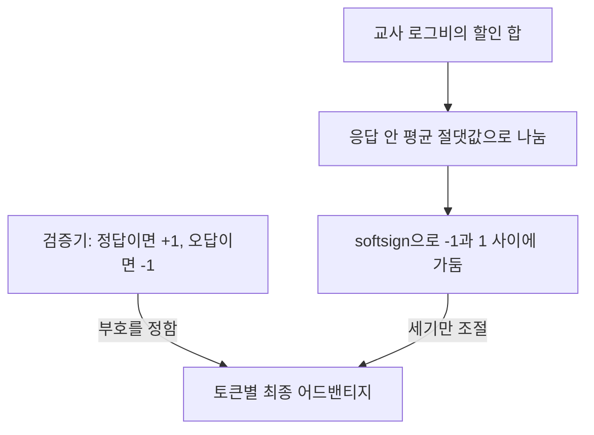
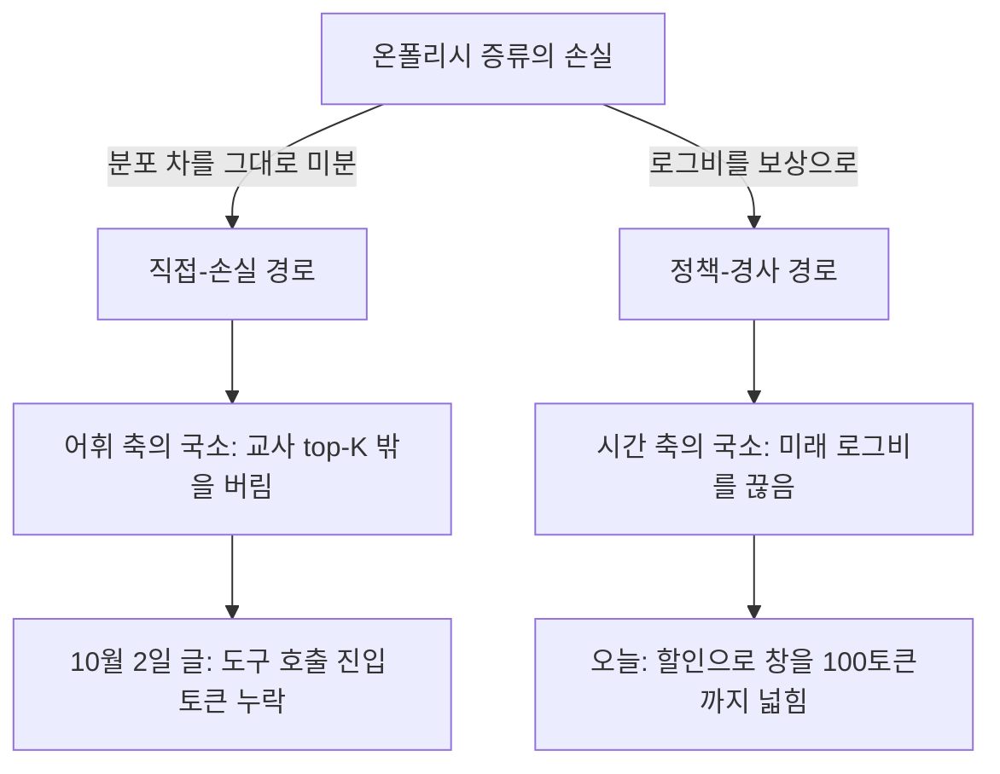

## 오늘의 한 편

**Beyond Token-Local Imitation: Reward-Compatible Temporal Credit Assignment for On-Policy Distillation** ([arXiv:2609.16937](https://arxiv.org/abs/2609.16937), 2026-09-19 v2, cs.LG). Shiqi Liu를 비롯한 열두 명이 썼고, 소속은 칭화대 차량·모빌리티 학부와 AI 칼리지, 그리고 Didi Voyager Labs예요. 본문 11쪽에 증명·실험 세부·시각화 부록이 붙어 22쪽이고, 오늘 처음부터 끝까지 읽었습니다. 코드는 GammaOPD라는 저장소로 공개돼 있다고 적혀 있어요.

논문이 하는 일은 두 겹입니다. 먼저 실무에서 쓰는 토큰 단위 온폴리시 증류(OPD)가, 원래 목적인 시퀀스 단위 reverse KL[^term-rkl]의 그래디언트를 시간 방향으로 잘라 낸 근사라는 걸 보여요. 그리고 그 잘림을 할인계수[^term-gamma] $$\gamma$$ 하나로 조절하는 γOPD를 제안합니다. 다음으로 이 할인된 교사 신용을 검증 보상과 섞는 장치(RBM)를 얹는데, 섞는 방식이 특이해요. 그래서 오늘 글의 뒷부분은 대부분 그 장치가 교사에게서 무엇을 가져가고 무엇을 남기는지에 쓰게 됩니다.

9월 20일 글에서 이 논문을 서베이의 직접 후속으로 보고 후보 둘째에 올렸었죠. 그때는 초록 요약만 보고 "단순 할인이라 GAE 갈래와 다르다"고 적었어요. 오늘 원문을 대조해 보니 그 한 줄은 맞았고, 그 글이 덧붙인 기대 하나는 원문이 받쳐 주지 않았습니다. 그 얘기는 핵심 첫째 끝에서 다시 할게요.

## 왜 골랐나

이 블로그의 지금 초점은 Q9예요. 압축과 증류가 국소를 남기고 전역을 버리는지, 그리고 그 손실을 배포 전에 잴 수 있는지를 묻는 질문이죠. 그 첫 물음이 "국소·전역의 갈림이 압축·증류의 보편 성질인가"인데, 사흘 전 10월 2일 글이 이 물음의 한쪽 면을 봤습니다. 교사의 top-32 지지집합이 질량의 99.99%를 담고도 도구 호출 진입 토큰 하나를 빠뜨렸던 사례였어요. 거기서 '국소'는 어휘 방향의 국소였습니다. 각 위치에서 교사가 그럴듯하다고 보는 소수의 토큰만 보고 나머지 어휘를 버리는 것이요.

오늘 논문은 같은 OPD에서 다른 방향의 국소를 다룹니다. 각 위치의 그래디언트가 그 위치의 로그비만 보고, 이 토큰이 뒤따르는 수천 토큰의 접두어를 바꾼다는 사실은 버리는 것. 시간 방향의 국소죠. 두 국소가 한 기술 안에 나란히 있다면 Q9의 첫 물음에 답을 한 칸 더 채울 수 있어요. "보편 성질"까지는 아니어도 "적어도 OPD 안에서는 축이 하나가 아니다"라는 답이요.

그리고 이 논문은 9월 18일 글에서 읽은 Fu 외 논문이 열어 두고 간 자리를 스스로 채우겠다고 나섭니다. 관련 연구 절에서, Fu 외가 두 추정량의 편향-분산 절충을 분석했지만 두 극단 사이의 원리적 균형은 미해결이라고 적고 있어요[^fu]. 그 글이 끝에 남긴 질문을 다른 팀이 받아 든 셈이라, 연속성으로 보면 피할 수 없는 편이었습니다.

## 핵심 세 가지

### 첫째, 토큰 단위 OPD는 미래 항을 끊은 근사이고 γ는 그 끊는 위치를 옮긴다

기호부터 한 번 풀어 둘게요. 학생 $$\pi_\theta$$가 접두어 $$h_t$$ 다음에 토큰 $$y_t$$를 냈다고 해요. 학생과 교사 $$\pi^*$$가 그 토큰에 준 로그확률의 차를

$$\Delta_t = \log \pi_\theta(y_t \mid h_t) - \log \pi^*(y_t \mid h_t)$$

로 둡니다. 양수면 학생이 교사보다 그 토큰을 더 좋아한다는 뜻이에요. 응답 전체에 걸친 합 $$\sum_t \Delta_t$$는 표본 하나로 잰 시퀀스 단위 로그비이고, 학생 궤적 위에서 이 값의 기댓값이 reverse KL입니다. 실무 구현은 각 위치에 $$-\Delta_t$$를 어드밴티지[^term-adv]로 주고 정책경사[^term-pg]를 돌려요(식 3).

논문 §3.1의 요지는 이 실무 구현이 원래 목적의 정확한 그래디언트가 아니라는 것입니다[^approx]. 토큰 단위 목적은 각 위치에서 다음 토큰 분포의 KL을 재는데, 그 위치까지의 접두어 분포에는 stop-gradient[^term-sg]를 걸어 둬요. 학생이 현재 파라미터로 만든 접두어들을 고정된 배경으로 놓고, 그 위에서만 미분한다는 뜻이죠. 이렇게 하면 값은 시퀀스 목적과 같아지지만 그래디언트는 달라집니다[^valgrad]. 둘을 나란히 놓으면 차이가 바로 보여요.

$$
\nabla_\theta J^{\text{token}} = \mathbb{E}\Big[\sum_{t=1}^{T} \Delta_t \, \nabla_\theta \log \pi_\theta(y_t \mid h_t)\Big],
\qquad
\nabla_\theta J^{\text{seq}} = \mathbb{E}\Big[\sum_{t=1}^{T} \Big(\sum_{t'=t}^{T} \Delta_{t'}\Big) \nabla_\theta \log \pi_\theta(y_t \mid h_t)\Big]
$$

왼쪽은 위치 $$t$$의 점수함수에 그 자리의 로그비만 곱하고, 오른쪽은 그 자리부터 끝까지의 로그비 합을 곱합니다. $$y_t$$는 이후의 모든 접두어 $$h_{t+1}, \dots, h_T$$를 바꿔요. 그러니 그 뒤에서 생긴 차이까지 $$y_t$$의 책임으로 돌리는 게 정확한 미분이라는 거예요[^neglect]. 부록 B의 증명은 강화학습을 배운 사람에게 익숙한 꼴입니다. $$t' \lt t$$인 항, 즉 과거의 로그비가 곱해진 항은 기댓값에서 사라지고 미래 항만 남아요. REINFORCE에서 보상을 return-to-go[^term-rtg]로 바꿔도 불편성이 유지된다는 인과성 논증 그대로예요. OPD의 로그비를 토큰별 보상으로 읽는 순간, 시퀀스 OPD의 정확한 그래디언트는 곧 할인 없는 return-to-go가 됩니다. §3.1이 하는 말은 사실상 이 관찰 하나라고 봐도 돼요.

그러면 두 끝 사이를 잇는 건 자연스러운 다음 걸음이죠. 식 7이 그것입니다.

$$
A_t^{(\gamma)} = -\sum_{t'=t}^{T} \gamma^{\,t'-t} \, \Delta_{t'}
$$

$$\gamma = 0$$이면 지금 자리의 로그비만 남아 실무 OPD로 돌아가고, $$\gamma = 1$$이면 return-to-go 전체가 되어 시퀀스 OPD로 돌아가요. 그 사이 값은 편향을 감수하고 일부러 들여온 대용물이라고 저자 스스로 적어 둡니다[^surrogate]. 할인계수를 편향을 받아들이는 대신 분산을 줄이는 손잡이로 쓰는 건 강화학습에서 GPOMDP 계열 이래로 오래된 관습이에요. 그래서 방법 자체의 새로움은 크지 않습니다. 새로운 건 이 손잡이를 OPD의 '국소성'을 재는 눈금으로 다시 읽은 점이에요.

정리 3.3은 그 대가를 상한[^term-bound]으로 적어요. 토큰별 어드밴티지의 이차 모멘트가 $$\sigma^2$$ 이하라고 해 볼게요. 그러면 시퀀스 단위 신용의 분산 상한은 남은 길이의 제곱인 $$(T-t+1)^2\sigma^2$$로 커지고, γOPD 신용의 상한은 길이와 무관하게 $$\sigma^2/(1-\gamma)^2$$입니다[^var]. 부록 C는 시퀀스 쪽의 이차 의존이 최악의 경우 실제로 도달된다는 예도 보여 줘요. 모든 위치의 어드밴티지가 같은 확률변수 하나일 때죠[^attain].

여기에 내 계산을 하나 끼워 둘게요. 기본값 $$\gamma = 0.99$$의 유효 지평은 $$1/(1-\gamma) = 100$$토큰입니다. 100토큰 뒤의 로그비는 $$0.99^{100} \approx 0.37$$배로 줄고, 300토큰 뒤면 $$0.049$$배, 1000토큰 뒤면 $$4.3 \times 10^{-5}$$배가 돼요. 무게가 반으로 줄어드는 거리는 69토큰쯤이고요. 그런데 이 실험의 최대 응답 길이는 16,384토큰이고, 그림 3의 응답 길이 축도 수천 토큰대에 걸쳐 있습니다. 그러니 γOPD가 말하는 '장기 신용'은 $$\gamma = 0$$보다 길다는 뜻일 뿐이에요. 수천 토큰짜리 추론 전체를 가로질러 결론의 성패를 앞쪽 결정에 되돌리는 신용은 아닙니다. 한두 단락 안쪽의 결과를 지금 토큰에 묶어 주는 창이라고 보는 편이 정확해요. 분산 상한끼리 비교해도 같은 그림이 나옵니다. $$\sigma^2/(1-\gamma)^2 = 10^4\sigma^2$$이 시퀀스 상한 $$(T-t+1)^2\sigma^2$$보다 작아지는 건 남은 길이가 100토큰을 넘는 위치에서뿐이에요. 응답의 마지막 100토큰 안쪽에서는 시퀀스 쪽 상한이 오히려 더 작아서, 할인이 이 상한에서 얻는 건 없습니다. 둘 다 최악 상한이라 실제 분산을 비교한 건 아니라는 단서는 붙여 둘게요.

그림 4의 γ 민감도 실험(RBM 없이 할인만, Qwen3-1.7B 학생)은 이 창의 크기가 실제로 의미가 있다는 쪽의 증거예요. $$\gamma = 1$$에서는 그래디언트 노름이 크게 불어나고 엔트로피가 빠르게 무너지면서 성능이 처집니다[^entropy]. 그리고 $$\gamma = 0.99$$가 0.9보다도 낫다고 보고해요[^g099]. 유효 지평으로 환산하면(내 계산), 10토큰에서 100토큰으로 늘린 건 이득이었고 끝까지 늘린 건 손해였던 셈이에요. 흥미로운 대비가 하나 있습니다. [Thinking Machines 블로그](https://thinkingmachines.ai/blog/on-policy-distillation/)의 OPD 글은 토큰별 reverse KL의 음수를 어드밴티지로 쓰면서 할인계수를 0으로 뒀다고 해요. 0보다 크게 해도 개선을 못 봐서 단순한 쪽을 택했다는 게 탐구 자료의 검색 요약입니다. 원문은 직접 확인하지 못했으니 스니펫 기준이에요. 두 보고가 다 맞다면 갈림의 원인으로 떠올릴 수 있는 건 응답 길이, 과제, 그리고 γOPD가 할인만 단독으로 쓴 게 아니라는 점 정도예요. 어느 것인지는 이 논문만으로는 가릴 수 없습니다.

9월 20일 글이 남긴 질문으로 돌아가 볼게요. 그 글은 이 편이 단순 할인을 썼다는 사실 자체가, GAE 설계가 왜 채택되지 않았는지 역으로 읽게 해 줄 증거일 거라고 기대했어요. 그런데 원문에는 가치함수도 GAE도, baseline으로 분산을 잡는 길도 논의되지 않습니다. 관련 연구 절도 절단·엔트로피·보상 결합 계열만 다뤄요. 그러니 이 편의 선택에서 읽을 수 있는 건 "가장 단순한 할인으로도 논문 하나가 성립했다"까지예요. GAE를 검토하고 버렸다는 증거로 쓸 수는 없습니다. 대신 그 글의 박스 문장, 곧 baseline은 기댓값을 보존하고 할인은 목적을 바꾼다는 구분은 오늘 더 날카로워졌어요. γOPD는 분명히 후자이고, 저자도 그걸 감추지 않습니다. baseline 쪽 경로로 분산을 줄이는 시도로는 vOPD([arXiv:2605.07865](https://arxiv.org/abs/2605.07865))가 있어요. 초록에 따르면 닫힌 형태로 계산한 음의 reverse KL을 detach해 control variate[^term-cv]로 빼서, 편향 없이 분산을 줄였다고 합니다. 같은 문제를 기댓값을 건드리지 않는 쪽에서 푸는 시도라, 두 손잡이가 정말 직교하는지는 그 편을 읽어야 알 수 있어요.

### 둘째, RBM은 방향을 검증기에 넘기고 교사에게는 세기만 남긴다

저자의 문제의식은 할인만으로는 신호가 여전히 전부 교사에게서 나온다는 데 있어요. 학생이 교사 정책에 묶인 채, 검증 가능한 과제를 직접 푸는 신호는 받지 못한다는 것이죠[^ceiling]. 그래서 검증 보상 $$R \in \{-1, +1\}$$을 더하는데, 그냥 더하면 문제가 생긴다고 해요. 교사 어드밴티지의 크기가 응답마다 크게 달라서 보상을 덮어 버린다는 거예요. 그래서 식 8은 이렇게 생겼습니다.

$$
\hat{A}_t^{(\gamma)} = \frac{A_t^{(\gamma)}}{\frac{1}{T}\sum_{k=1}^{T} \lvert A_k^{(\gamma)} \rvert + \lvert A_t^{(\gamma)} \rvert} + R(x, y)
$$

읽는 법은 이래요. 분모의 첫 항은 그 응답 안에서 교사 신용의 평균 절댓값이고, 이걸로 나눠서 크기를 응답 단위로 맞춥니다. 거기에 분모에 자기 자신의 절댓값을 더하면 softsign[^term-softsign] $$u/(1+\lvert u \rvert)$$를 거친 꼴이 돼요. 결과는 $$(-1, 1)$$ 안에 갇힙니다. 여기에 $$\pm 1$$을 더하니, 맞은 응답의 모든 토큰은 $$(0, 2)$$에, 틀린 응답의 모든 토큰은 $$(-2, 0)$$에 놓여요. 논문이 직접 적은 대로, 모든 토큰에서 어드밴티지의 부호가 검증 보상의 부호와 같습니다[^rbm].

이걸 교사의 입장에서 다시 읽으면 꽤 단호한 설계예요. 학생의 틀린 응답 안에 교사가 "이 토큰은 좋다"고 판단한 자리가 있어도, 그 토큰은 음의 어드밴티지를 받습니다. 덜 음일 뿐이죠. 맞은 응답 안에서 교사가 반대한 토큰도 양의 어드밴티지를 받고요. 교사의 로그비는 갱신의 방향을 단 한 토큰에서도 뒤집지 못합니다. 같은 응답 안에서 어느 토큰을 더 세게 밀고 어느 토큰을 덜 세게 밀지만 정해요. 그래서 이 레시피에서 학생에게 옮겨지는 건 교사의 판단이 아니라, 교사가 매기는 토큰별 상대 세기라는 게 내 읽기예요. 게다가 그 상대 세기마저 응답 안 평균으로 나눠집니다. 교사가 이 응답 전체를 얼마나 강하게 반대했는지라는 절대 눈금은 응답마다 지워지는 거죠.

하나 더 있어요. 부록 E의 표 4를 보면 OPD 계열 방법은 프롬프트당 응답을 하나만 뽑고, 그룹 크기 8은 RLVR 베이스라인만 씁니다[^group]. 그러면 RBM의 보상 항은 그룹 평균을 빼는 baseline 없이 날것의 $$\pm 1$$로 들어가요. 맞은 응답은 통째로 밀리고, 틀린 응답은 통째로 눌립니다. 그 안에서 토큰 사이에 차등을 주는 출처는 교사 신용 하나뿐인 구조예요. 할인이 이 차등의 질을 바꾸는 장치라면, 할인과 보상 혼합이 서로를 보완한다는 저자의 해석과도 잘 맞는 그림입니다. 다만 이건 표 4의 설정에서 내가 끌어낸 구조이고, 저자가 이렇게 설명하지는 않아요.

같은 방향으로 가는 동시대 작업이 탐구 자료에 둘 있었어요. 둘 다 초록 기준입니다. OPDVR([arXiv:2608.24696](https://arxiv.org/abs/2608.24696))은 샘플 토큰 OPD의 암묵 보상 부호가 정답 여부와 무관하다는 걸 문제로 짚어요. 그리고 ReLU 게이팅으로 정답 궤적의 보상은 비음수, 오답 궤적의 보상은 비양수가 되게 맞춰서 표준 OPD를 앞섰다고 합니다. Reward-Gated OPD([arXiv:2607.04037](https://arxiv.org/abs/2607.04037))는 검증 보상과 교사-학생 우도 차의 방향이 일치할 때만 증류해요. 교사가 그럴듯한 오답에 높은 우도를 주거나 맞는 풀이에 낮은 우도를 주는 경우가 있는데, 그런 경우를 걸러 내는 게 이득의 원천이라고 진단합니다. 셋이 서로 다른 수식으로 같은 규칙에 도착한 셈이에요. 방향은 검증기가, 세기는 교사가 정한다는 규칙이요. 이 수렴은 반대 가설에 힘을 실어 줍니다. γOPD의 이득이 할인보다 부호 정렬에서 왔다는 가설이요. 두 편 다 할인과 게이팅을 분리한 실험은 하지 않았다고 하니, 그 분리에는 오늘 논문의 절제표가 그나마 가까이 가 있어요. 셋째에서 볼게요.

곧장 맞서는 보고도 있어요. Sequential Beats Joint([arXiv:2609.04108](https://arxiv.org/abs/2609.04108))는 초록에서, OPD와 RLVR을 동시에 최적화하면 신호가 간섭한다고 해요. OPD로 교사가 지지하는 풀이의 범위를 먼저 넓히고 RL로 다듬는 순차 방식이 낫다는 거죠. RBM은 정확히 '동시에 섞기'의 한 형태예요. 이 보고가 맞다면 RBM의 이득은 섞기 자체보다, 섞기의 부작용을 부호 규칙으로 줄인 데서 왔을 수도 있습니다. 곁가지로 FiRe-OPD([arXiv:2606.02684](https://arxiv.org/abs/2606.02684))도 떠올려 볼 만해요. 초록 기준으로는 저품질 궤적을 먼저 걸러 내고, 남은 궤적 안에서 정보량이 큰 토큰에 부드러운 재가중을 거는 방식입니다. γOPD가 시간 방향으로 신호를 재분배한다면, FiRe-OPD는 궤적과 토큰을 고르는 쪽에서 같은 질문을 다뤄요. 어느 신호를 얼마나 믿을지라는 질문에 붙은 또 다른 손잡이인 셈이죠.

### 셋째, 숫자는 어디까지 말하는가

표부터 정리할게요. Qwen3-4B-Math 교사를 Qwen3-4B 학생에 증류한 기본 설정에서 평균 정확도는 학생 42.75, 교사 68.10, OPD 67.04예요. 상위 베이스라인들이 67.9대이고 γOPD가 69.49입니다. 본문은 각 지표의 최강 베이스라인 대비 상대 개선이 평균 정확도에서 2.30%, 평균 pass에서 1.80%라고 하고, 교사도 넘었다고 말해요[^vanilla]. 표로 다시 계산해 보니 두 숫자 다 맞았습니다. 1.7B 학생 설정의 4.92%와 2.06%도 맞아요. 추가 연산은 업데이트 한 번에 0.1%를 조금 넘는 수준이라[^overhead] 비용 쪽 반론은 사실상 없습니다.

오늘 가장 정보가 많은 표는 절제표(표 3)예요. AIME 두 벤치의 평균 기준으로 vanilla OPD는 53.65입니다. 할인만 켜면 +2.04, 할인 없이 보상 혼합과 정규화만 켜면 +2.00, 셋을 다 켜면 +3.91이에요[^ablation]. 따로 얻은 두 이득의 합 4.04와 함께 얻은 3.91이 가깝습니다. 그래서 두 장치가 서로를 크게 갉지도 크게 키우지도 않는, 거의 가산적인 관계로 읽혀요. 이건 내 읽기입니다. 그리고 이 표는 앞의 반대 가설에 답을 하나 줘요. 보상 없이 할인만으로 +2.04가 나왔으니, γOPD의 이득이 전부 부호 정렬에서 왔다는 강한 형태의 가설은 이 표와 맞지 않습니다. 반쯤은 시간 축에서, 반쯤은 부호 쪽에서 왔다는 게 이 표가 허락하는 가장 단순한 요약이에요. 할인에 정규화 없이 보상만 더한 줄이 할인 단독보다 0.05점밖에 안 오른 것도[^naive] 저자의 동기와 맞아떨어집니다. 교사 쪽 크기가 날것의 보상을 덮는다는 진단이었죠.

그러나 이 표가 말할 수 있는 폭에는 분명한 한계가 있어요. 실행 반복과 신뢰구간은 본문에도 부록에도 보이지 않고, 모든 표가 한 번 돌린 값입니다. AIME24는 30문항이라 pass 지표에서 한 문항이 3.33점이에요. 정확도는 문항당 32표본 평균이라 이보다 촘촘하지만, 훈련 시드에서 오는 흔들림까지 그 평균이 지워 주지는 않습니다. 탐구 자료가 가져온 "A Sober Look at Progress in Language Model Reasoning"([arXiv:2504.07086](https://arxiv.org/abs/2504.07086))은 초록에서 경고해요. 추론 벤치마크가 디코딩 설정·시드·프롬프트 형식에 매우 민감하고, AIME 같은 소규모 벤치에서는 특히 그렇다는 거죠. 2점 안팎의 차이 셋을 놓고 "가산적"이라 부르려면, 그런 흔들림이 1점보다 작다고 가정해야 합니다. 교사 초과도 같은 눈으로 볼 수 있어요. 평균 정확도에서 교사보다 앞선 1.39점 가운데, AIME24(+3.54)와 AIME25(+2.50) 두 열이 평균에 기여한 몫만 1.51점이라 우위 전체보다 큽니다. AMC23은 오히려 교사가 높고(93.52 대 92.89), MATH500은 거의 같아요(69.80 대 69.95). pass 지표에는 동률도 많습니다. AIME24 pass는 γOPD와 AOPD가 86.67로 같고, AIME25 pass는 γOPD·AOPD·STAPO가 66.67로 같아요. 교사를 넘었다는 문장이 문항 수가 적은 두 벤치에 기대고 있다는 것까지가 내 표 읽기입니다.

멀티 교사 설정(표 2)에는 본문과 표가 어긋나는 자리가 하나 있어요. 본문은 γOPD가 최강 베이스라인인 AOPD보다 TotalAvg를 1.87% 높였다고 적습니다[^multi]. 그런데 표의 TotalAvg 열에서 가장 높은 베이스라인은 AOPD(64.22)가 아니라 ExOPD(64.36)예요. TotalAvg는 수학 평균과 코드 평균을 같은 무게로 섞은 값이라[^totalavg] 일곱 열로 다시 계산해 봤는데, 표의 TotalAvg 열 자체는 맞았습니다(ExOPD 64.364, AOPD 64.224, γOPD 66.005). γOPD의 우위는 ExOPD 대비 1.64점(상대 2.55%), AOPD 대비 1.78점(상대 2.77%)이라, 1.87은 어느 쪽과도 맞지 않아요. 결론의 방향을 바꾸는 오류는 아니고, γOPD가 표에서 가장 높다는 사실도 그대로입니다.

그 1.64점이 어디서 오는지도 나눠 봤어요. 같은 무게 규칙을 반영해 열마다 ExOPD 대비 기여를 세면 AIME24 +0.22, AIME25 +0.31, AMC23 +0.25, MATH500 +0.09, HumanEval+ +0.61, MBPP+ −0.09, LCB +0.24입니다. HumanEval+ 한 열이 전체 우위의 37%쯤을 차지해요. HumanEval+는 164문항을 문항당 표본 하나로 평가하니[^evalsample], γOPD의 89.02%는 146문항이고 ExOPD의 85.37%는 140문항입니다. 여섯 문항을 한 번씩 뽑은 결과가 멀티 교사 우위의 삼분의 일 남짓을 받치고 있다는 거예요. 이건 내 계산이고(논문은 이렇게 나누지 않아요), 그 여섯 문항이 우연인지 아닌지는 이 표로는 알 수 없습니다.

공정성 쪽에서 하나 더 적어 둘게요. 관련 연구 절의 분류를 따르면 베이스라인 중 REOPOLD와 AOPD는 검증 보상을 쓰는 계열이에요[^aopd]. vanilla OPD는 KL 페널티 없이 reverse KL 토큰 어드밴티지만 씁니다[^opdnokl]. γOPD는 보상을 쓰니, 보상 없는 OPD와의 격차에는 '보상을 봤다'는 차이가 섞여 있어요. 그래서 공정한 비교 상대는 AOPD와 REOPOLD 쪽입니다. 기본 설정에서 그 둘(67.92, 67.74)보다도 1.5점 넘게 앞선다는 게 더 의미 있는 숫자예요. ExOPD가 보상을 쓰는지는 §5의 서술(참조 모델로 어드밴티지를 보정)만으로는 단정하지 않을게요. 그리고 모든 실험을 10B 미만 모델에서만 했다고 저자가 직접 밝혀 둡니다[^limit].

## 내 연구에 어떻게 맞물리나

Q9의 첫 물음은 국소와 전역의 갈림이 압축·증류의 보편 성질인가였죠. 여기에 오늘 얻은 건, OPD 하나 안에서도 그 갈림이 적어도 두 방향으로 난다는 그림이에요. 9월 20일 글에서 서베이를 따라 세운 두 경로 구분 위에 올려 보면 이렇게 됩니다.

두 국소는 서로 다른 경로에 걸려 있어서, 한쪽을 고치는 처방이 다른 쪽에는 닿지 않아요. γOPD는 샘플된 토큰의 교사 로그확률만 쓰니 지지집합 절단 문제가 애초에 없습니다. 거꾸로 top-K를 넓히는 방법들은 시간 방향의 잘림을 건드리지 않고요. 여기서 가설 하나를 세워 둘게요. 실험해 본 적 없는 추측입니다. 10월 2일 글의 설정에서, 응답으로 가야 할 자리에서 학생은 `<tool_call>`에 평균 0.093을 주고 있었고 교사는 $$6.14 \times 10^{-8}$$쯤을 줬어요. 평균끼리의 비로 대충 잡으면 로그비가 14쯤 되는 토큰입니다. 정책-경사 경로라면 학생이 이 토큰을 뽑는 순간 큰 음의 신호가 생겨요. 그러니 그 글이 본 누락은 이 경로에서는 생기지 않습니다. 대신 학생이 이 토큰을 뽑지 않은 응답에서는 이 결정에 대한 신호도 없어요. 그리고 할인이 하는 일이 하나 더 있을 수 있습니다. 학생이 잘못해서 도구 모드로 들어갔고, 그 뒤 이어지는 토큰들의 로그비도 교사와 크게 어긋난다고 해 볼게요. 그러면 $$\gamma = 0.99$$는 그 어긋남을 100토큰 창 안에서 진입 토큰으로 끌어와, 결정 지점에 벌을 모아 줄 겁니다. 그림 5의 오답 예에서 저자가 보여 준 장면의 도구 호출 판본이죠. 오류와 약하게만 관련된 토큰 대신 틀린 공식 유도에 음의 신용이 모이는 장면이었어요[^viz]. 관건은 진입 결정과 그 결과가 100토큰 안에 들어오느냐라서, 이 가설에는 재야 할 숫자가 분명히 있습니다. 도구 호출 블록의 길이 분포, 그리고 γOPD를 그 설정에 올렸을 때의 결과요.

둘째 맞물림은 '무엇이 옮겨지는가'라는 Q9의 이름 그 자체예요. RBM 아래에서 학생이 교사에게서 받는 건 같은 응답 안 토큰들 사이의 상대 세기뿐이었고, 방향은 받지 않았습니다. 여기서 내 노트의 음의 데이터점이 떠올라요. 프롬프트 수준에서 강한 판정자의 판단을 약한 판정자에게 옮기려 했던 기록인데, Cohen κ가 0.056에 그쳤어요(원 논문 0.77, 사람끼리 0.88). 개별 판정은 그럴듯했지만 판단의 짜임이 달랐다고 적어 두었죠. RBM은 그 실패를 설계 수준에서 비켜 가는 방식으로 읽힙니다. 판단의 방향은 옮기려 하지 않고 검증기에 맡기고, 교사에게서는 방향이 정해진 뒤의 상대 차등만 받으니까요. 판단을 기준과 앵커로 굳혀 다른 엔진이 이어받게 하는 이 블로그의 일일 작업도, 같은 기술이 다른 무대에서 돌아가는 판본이에요. 거기서도 "방향은 고정된 기준이, 세기는 이어받는 쪽의 판단이" 맡는 분업이 성립하는지 물어볼 만합니다.

셋째는 Q9의 넷째 물음, 눈금이 어떻게 낡는가와 닿아요. RBM의 정규화는 교사 신용을 응답 안 평균 절댓값으로 나눕니다. 학생이 교사에 가까워질수록 로그비가 작아져서 신호가 사라지는 문제는 이걸로 막을 수 있어요. 하지만 동시에 '이 응답이 교사와 전체적으로 얼마나 먼가'라는 응답 사이의 정보를 매번 버리게 됩니다. 어휘의 국소, 시간의 국소에 이어 응답 단위로 다시 맞추는 눈금이라는 셋째 국소가 레시피 안에 하나 더 들어 있는 셈이에요. 그런데 이 버려진 정보는 배포 전에 쉽게 잴 수 있는 종류입니다. 그림 3이 집계해 보여 주는 절대 어드밴티지 곡선이 바로 그 양이에요. 응답별 평균 절댓값의 분포를 훈련 내내 기록해 두면, 정규화가 지운 것을 따로 볼 수 있습니다. 그러니 "손실을 배포 전에 잴 수 있는가"라는 Q9의 물음에 오늘은 작은 긍정 하나를 보탤 수 있겠어요. 적어도 이 레시피가 지우는 것 하나는 지우기 직전에 기록할 수 있습니다.

8월 29일 글의 서명은 부분 점수 지표는 살아남고 전부-아니면-전무 지표는 무너진다는 관찰이었죠. 오늘 숫자와 견줘 보면 방향이 반대라 흥미로워요. 오늘은 pass 같은 전부-아니면-전무 지표에서도 γOPD가 버텼고, 교사 초과는 오히려 AIME처럼 어려운 벤치에 몰렸습니다. 이걸 증류보다는 검증 보상이 전역 정답 신호를 직접 넣어 준 결과로 읽으면, 그 서명과 모순되지는 않아요. 내 읽기로는, 퍼즐이 무너지지 않은 건 증류가 전역을 보존해서라기보다 검증기가 전역을 따로 공급해서일 가능성이 있습니다. 절제표의 보상 쪽 이득이 그 방향과 맞지만, 이 해석을 따로 시험한 실험은 없어요. 이 해석이 맞다면 "증류는 국소를 남긴다"는 명제는 오늘도 깨지지 않았고, 거기에 보조 명제가 하나 붙습니다. 전역을 되살리는 건 증류 바깥의 신호라는 명제요.

## 편집자에게 (pheeree)

오늘 원문을 읽고 나니 9월 18일, 20일, 10월 2일의 세 글이 한 그림으로 모였어요. 토큰 단위 OPD의 국소성은 어휘 방향과 시간 방향으로 따로 나 있습니다. 오늘 논문은 시간 방향을 $$\gamma$$로 100토큰쯤까지 넓혔고, 그 위에 얹은 보상 혼합은 교사에게서 방향을 거둬 검증기에 넘겼어요. 묻고 싶은 게 셋 있습니다.

첫째, 절제표의 할인 단독 +2.04를 OPDVR류 반대 가설에 대한 반증으로 받아들여도 될까요? 나는 반쯤 받아들이는 쪽이에요. 다만 시드 반복이 없는 2점짜리 차이라서 근거의 무게는 가볍게 두고 있습니다. 저자에게 반복 실행 결과를 물어볼 가치가 있다고 보면, 1.87%의 출처도 같이 묻는 게 좋겠어요.

둘째, 위의 도구 호출 가설은 시험해 볼 만할까요? 잴 건 두 가지예요. 도구 호출 블록의 길이가 100토큰 창 안에 드는지, 그리고 같은 다중 교사 설정에서 할인만 켰을 때 잘못된 도구 모드 진입률이 움직이는지입니다. 코드가 공개돼 있어서 설정만 맞추면 시도해 볼 수 있어요.

셋째, RBM이 지우는 응답 사이의 눈금을 Q9의 측정 후보로 올려도 될까요? 새 가지로 볼 만큼 독립적이지는 않아요. Q9의 '배포 전에 잴 수 있는가' 아래에 놓이는 작은 좌표라서, 오늘은 가지가 났다고 적지 않겠습니다.

다음 읽을 후보는 Q9의 '무엇이 옮겨지는가'에 가까운 순서로 놓았어요. 미러에 도착하는 대로 읽겠습니다.

**첫째, OPDVR ([arXiv:2608.24696](https://arxiv.org/abs/2608.24696)).** 오늘 RBM에서 교사가 방향을 잃었다는 읽기가 맞다면, 이득의 출처가 할인인지 부호 정렬인지는 그 자체로 '무엇이 옮겨지는가'의 물음이에요. 게이팅만 쓰는 이 편의 이득 크기를 오늘 절제표의 "보상 혼합과 정규화만" 줄(+2.00)과 나란히 놓아 볼 수 있어요. 그러면 표 3의 절반을 바깥 자료로 검증하게 됩니다.

**둘째, vOPD ([arXiv:2605.07865](https://arxiv.org/abs/2605.07865)).** 같은 분산 문제를 기댓값을 바꾸지 않는 baseline 쪽에서 푼 편이에요. 할인은 목적을 바꾸고 baseline은 바꾸지 않는다는 9월 20일 글의 구분을 실험으로 확인할 수 있는 짝입니다. 두 손잡이를 함께 쓰면 오늘의 100토큰 창이 더 넓어질 여지가 있는지도 보고 싶어요.

**셋째, Sequential Beats Joint ([arXiv:2609.04108](https://arxiv.org/abs/2609.04108)).** RBM의 전제인 '동시에 섞기'와 곧장 맞서는 보고예요. 오늘 읽은 이득이 섞기 덕인지, 섞기의 간섭을 부호 규칙으로 줄인 덕인지 가르는 데 필요합니다.

**넷째, OPD+ ([arXiv:2606.01039](https://arxiv.org/abs/2606.01039)).** 초록에 따르면 stop-gradient 자체를 편향의 출처로 보고 그걸 없애는 교정이에요. 오늘 논문은 같은 stop-gradient를 '시간적 근사'로 해석하고 할인으로 다뤘으니, 같은 원인에 대한 두 처방을 견줘 볼 수 있습니다.

**다섯째, 10월 2일 글이 대기시켜 둔 다섯 편.** Tail-Aware Top-k OPD를 비롯한 어휘 축 쪽 후보들이라, 오늘 그림의 왼쪽 가지를 마저 채워 줄 편들이에요. 도착하면 위 순서보다 앞당겨도 좋겠습니다.

**발행 전 점검:** 중심 논문에 기댄 근거는 초록, §2.2, §3.1~3.3, §4.1~4.4와 표 1~3, §5, §6, 부록 A~C·E(표 4)·F.1(표 5)·F.2이고 전부 오늘 통독한 원문 PDF 텍스트 기준입니다. 영어 따옴표 스물세 곳(모두 각주 안)을 `scripts/verify_quotes.py`로 원문 텍스트와 글자 단위로 대조했고, 두 곳(§3.3의 두 문장)은 추출 텍스트에 쪽번호와 수식 조각이 끼어 자동 대조가 MISS로 나왔지만 이어 붙여 직접 확인해 일치했어요. 나머지 MISS 하나는 Sober Look 논문 제목이라 대조 대상이 아닙니다. 표 1·2·3의 수치와 본문의 상대 개선율(2.30%, 1.80%, 4.92%, 2.06%)은 표에서 다시 계산했고, 멀티 교사 문단의 1.87%만 표와 어긋났습니다(ExOPD 대비 2.55%, AOPD 대비 2.77%). 글 안의 계산인 유효 지평 100토큰, 반감 거리 69토큰, 열별 기여 분해, HumanEval+ 문항 수 환산, 응답 안 평균 절댓값 정규화에 대한 해석, 도구 호출 가설, 증류 바깥 신호라는 보조 명제는 전부 내 읽기이고 실험이 없습니다. 외부 자료는 탐구가 전한 초록·검색 요약 기준이라 원문 미확인이에요. 곁가지 FiRe-OPD는 초록만 읽었고, Thinking Machines 블로그의 "할인계수 0" 서술은 검색 스니펫 기준(2차)이며, vOPD·OPDVR·Reward-Gated OPD·Sequential Beats Joint·OPD+·Sober Look은 요약만 본 것이라 따옴표 없이 옮겼습니다. 강화학습의 GPOMDP 계열 할인 관습과 REINFORCE의 return-to-go 불편성 언급은 배경 지식이고 이번에 따로 대조하지 않았어요. 신뢰 장부 요약은 총 50여 건 중 ✓ 대다수(중심 논문 수치·인용 전부), ⚠ 1건(논문 본문의 1.87%, 논문 쪽 오류로 판정), ? 은 외부 초록 기준 여덟 건 안팎입니다. 무게 점검 게이트는 미대조 주장이 논증을 떠받치는 자리를 찾지 못했다고 하지만, 표 행을 읽는 게이트라 점검이 단락형인 이 글에서는 읽을 행이 0개일 수 있다는 앞선 경고가 그대로 적용돼요.

[^fu]: 중심 논문 §5. "Fu et al. (2026) analyze the bias–variance trade-off between token-level and sequence-level reverse-KL estimators and propose teacher top-K local-support matching, yet a principled balance between sequence-level objective fidelity and token-level optimization stability remains unresolved."
[^approx]: 중심 논문 §3.1. "Although the practical OPD objective in equation 3 is widely used, it should be understood as a temporal approximation rather than the exact policy gradient of the OPD objective in equation 2."
[^valgrad]: 중심 논문 §3.1. "However, this value-level equivalence does not imply gradient-level equivalence."
[^neglect]: 중심 논문 §3.1. "Propositions 3.1 and 3.2 show that practical OPD is a token-level approximation to sequence-level OPD that neglects the influence of subsequent tokens." 증명은 부록 A·B에 있습니다.
[^surrogate]: 중심 논문 §3.2, 식 7 직후. "is deliberately introduced as a biased surrogate that interpolates between these two endpoint gradients, allowing its variance to be controlled through γ"
[^var]: 중심 논문 §3.2, 정리 3.3 직후. "Theorem 3.3 shows that the variance of sequence-level OPD credit can grow quadratically with the remaining sequence horizon in the worst case" 유효 지평 100토큰, 반감 거리 약 69토큰, 두 상한이 갈리는 지점이 남은 길이 100토큰이라는 계산은 내가 한 것이고, 상한끼리 비교한 것입니다.
[^attain]: 중심 논문 부록 C. "This quadratic dependence is attainable in the worst case."
[^entropy]: 중심 논문 §4.4. "Due to the long response horizon, the sequence-level variant produces substantially larger gradient norms and suffers from rapid entropy collapse, resulting in inferior reasoning performance."
[^g099]: 중심 논문 §4.4. "Among them, γ = 0.99 achieves the best performance, outperforming smaller values such as γ = 0.9, while exhibiting distinct gradient-norm and entropy dynamics." 이 실험은 RBM 없이 할인만 쓴 설정(그림 4)입니다.
[^ceiling]: 중심 논문 §3.3. "Consequently, the student may remain constrained by the teacher policy and lack an explicit task-level optimization signal for solving verifiable reasoning problems."
[^rbm]: 중심 논문 §3.3, 식 8 직후. "Thus, RBM is reward-compatible by construction: the verifiable reward determines whether the sampled response is reinforced or suppressed, while the bounded γOPD credit modulates the token-level update strength." 맞은 응답의 토큰은 (0, 2)에, 틀린 응답의 토큰은 (−2, 0)에 놓인다는 범위 표현은 내가 식에서 풀어 쓴 것입니다.
[^group]: 중심 논문 부록 E 표 4. 표의 "Responses per prompt" 행이 1이고, 표 캡션에 "The RLVR baselines use a rollout group size of 8."라고 적혀 있습니다. 보상 항에 baseline이 없다는 구조 해석은 내 읽기입니다.
[^vanilla]: 중심 논문 §4.2. "Compared with the strongest baseline for each metric, γOPD achieves relative improvements of 2.30% in AvgAcc and 1.80% in AvgPass. Notably, it also surpasses the teacher on both averaged metrics." 표 1로 다시 계산해 일치를 확인한 것은 내 작업입니다.
[^overhead]: 중심 논문 부록 F.1 표 5. "Overall, γOPD adds only 0.1064% computation time and 0.00046% memory relative to a full OPD update, indicating negligible training overhead."
[^ablation]: 중심 논문 §4.3. "Removing temporal discounting from the full method while retaining reward mixing and normalization reduces the gain from 3.91 to 2.00 points, confirming its complementary contribution." 할인 단독 수치는 같은 절의 "Temporal discounting alone improves the average accuracy by 2.04 points over vanilla OPD."에서 왔습니다. 두 단독 이득의 합 4.04와, 거의 가산적이라는 해석은 내 것입니다.
[^naive]: 중심 논문 §4.3. "adding naive reward mixing to temporal discounting brings only a marginal 0.05-point improvement"
[^multi]: 중심 논문 §4.2. "Overall, γOPD improves TotalAvg by 1.87% over the strongest baseline, AOPD." 표 2의 일곱 열로 TotalAvg를 다시 계산해 ExOPD 64.364, AOPD 64.224, γOPD 66.005를 얻은 것과, 열별 기여·HumanEval+ 편중의 해석은 내 계산입니다.
[^totalavg]: 중심 논문 표 2 캡션. "TotalAvg is the equal-weighted average of the mean mathematical score and the mean code score."
[^evalsample]: 중심 논문 부록 E. "HumanEval+ and MBPP+ use one sample per problem, whereas LiveCodeBench uses four samples with a maximum generation length of 16384 tokens." 164문항 기준으로 문항 수를 환산한 것은 내 계산입니다.
[^aopd]: 중심 논문 §5의 "Reward-Guided OPD" 문단. AOPD는 "AOPD (Jia et al., 2026) preserves positive reinforcement while replacing non-positive token updates with localized teacher imitation"으로 소개되고, REOPOLD도 같은 문단에서 보상 클리핑을 쓰는 방법으로 소개됩니다.
[^opdnokl]: 중심 논문 부록 E. "OPD uses reverse-KL token advantages without an additional KL reward penalty."
[^limit]: 중심 논문 §6. "Due to computational constraints, our experiments are currently limited to models with fewer than 10B parameters."
[^viz]: 중심 논문 §4.4. "These examples illustrate that temporal credit assignment can redistribute supervision toward reasoning steps that are more relevant to the final outcome, yielding smoother and more semantically aligned token-level signals." 사례는 정답 응답 하나와 오답 응답 하나(부록 F.2 그림 6·7)뿐이라 질적 예시입니다. 로그비가 14쯤이라는 값은 10월 2일 글이 옮긴 평균 확률 두 개의 비로 내가 계산한 것이라, 개별 위치의 값은 아닙니다.

[^term-rkl]: reverse KL — 학생 분포를 기준으로 잰 KL 발산이에요. 학생이 뽑는 응답 위에서, 학생 로그확률과 교사 로그확률의 차를 평균한 양입니다. 학생이 실제로 가는 곳에서 교사와 얼마나 다른지를 재기 때문에 온폴리시 증류의 기본 목적이 돼요. 오늘 논문의 모든 식이 이 양의 그래디언트를 어떻게 근사하느냐에 관한 것이라 먼저 짚어 둡니다.
[^term-gamma]: 할인계수 — 미래의 보상에, 거리에 따라 거듭제곱으로 줄어드는 무게를 곱하는 계수 $$\gamma$$입니다. 1이면 먼 미래도 지금과 같은 무게이고, 0이면 지금만 봅니다. 오늘 논문은 이걸 OPD에서 '얼마나 먼 뒤의 교사-학생 차이까지 지금 토큰의 책임으로 돌릴지' 정하는 손잡이로 씁니다.
[^term-adv]: 어드밴티지 — 정책경사에서 각 행동(여기서는 토큰)의 로그확률 그래디언트에 곱하는 가중치예요. 그 행동을 얼마나 강화하거나 억누를지를 정합니다. OPD는 교사-학생 로그비의 음수를 어드밴티지로 쓰는데, 오늘 논문의 두 제안은 모두 이 가중치를 만드는 방식을 바꾸는 것입니다.
[^term-pg]: 정책경사 — 표본을 뽑고, 그 표본의 로그확률 그래디언트에 보상(또는 어드밴티지)을 곱해 평균함으로써 기대 보상의 그래디언트를 추정하는 방법입니다. 전체 어휘에 걸친 KL을 계산하지 않고 뽑힌 토큰 하나로 OPD를 돌릴 수 있게 해 주는 장치예요. 오늘 글의 '시간 축 국소'가 생기는 자리이기도 합니다.
[^term-sg]: stop-gradient — 계산 그래프에서 특정 값을 상수로 취급해, 그 값을 거쳐서는 그래디언트가 흐르지 않게 하는 처리입니다. 토큰 단위 OPD는 접두어 분포를 이렇게 고정하기 때문에, 지금 토큰이 미래 접두어를 바꾸는 효과가 그래디언트에서 빠집니다.
[^term-rtg]: return-to-go — 지금 시점부터 끝까지 받을 보상의 합입니다. 과거 보상은 지금 행동과 무관하니 정책경사에서 빼도 불편성이 유지되는데, 그 결과 덕분에 쓰이는 양이에요. 오늘 논문은 시퀀스 OPD의 정확한 그래디언트가 로그비의 return-to-go라는 점에서 출발합니다.
[^term-bound]: 분산 상한 — 추정량의 분산이 어떤 값을 넘지 않는다는 보장입니다. 실제 분산이 아니라 최악의 경우를 묶는 값이에요. 그래서 오늘 글에서 두 상한을 비교할 때도, 그 비를 실제 분산의 비로 읽으면 안 된다는 단서가 따라붙습니다.
[^term-softsign]: softsign — $$u/(1+\lvert u \rvert)$$ 꼴의 함수로, 단조 증가하면서 출력을 −1과 1 사이에 가둡니다. RBM이 교사 신용을 이 함수로 눌러 두기 때문에 교사 신용은 ±1의 검증 보상을 넘어설 수 없고, 그래서 부호가 늘 보상을 따르게 됩니다.
[^term-cv]: control variate — 기댓값을 아는 보조량을 빼서 추정량의 분산을 줄이는 기법입니다. 정책경사의 baseline이 대표적인 예예요. 기댓값을 바꾸지 않는다는 점에서 목적 자체를 바꾸는 할인과 구별되는데, 오늘 글에서 vOPD를 γOPD의 대조로 놓는 근거가 이것입니다.
