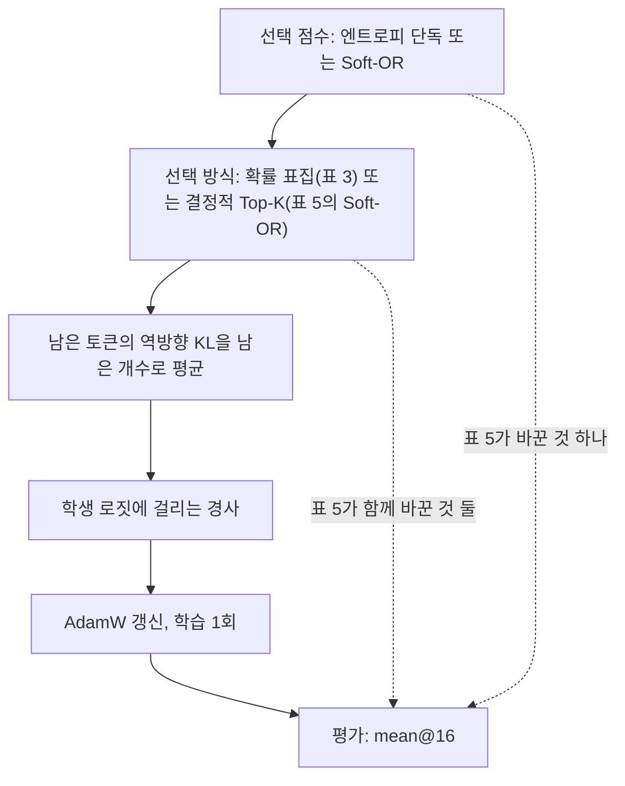
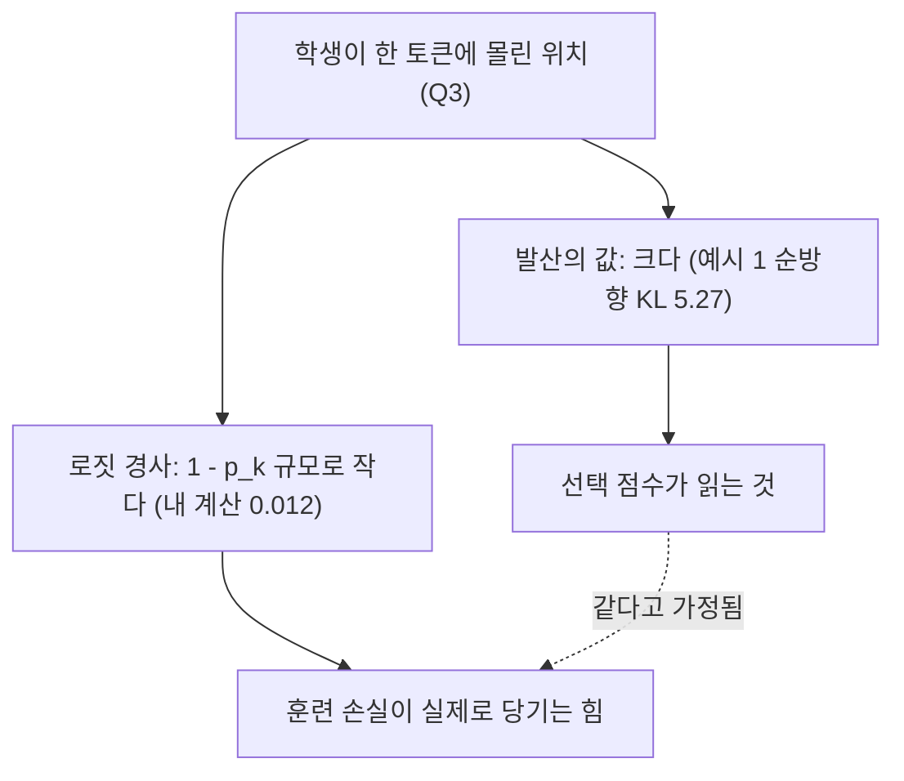

## 오늘의 한 편

**TIP: Token Importance in On-Policy Distillation** ([arXiv:2604.14084](https://arxiv.org/abs/2604.14084), v2 2026-04-19, cs.LG). Yuanda Xu, Hejian Sang, Zhengze Zhou, Ran He 네 사람이 공동 제1저자이고 Zhipeng Wang과 Alborz Geramifard가 함께 썼어요. 본문 11쪽에 이론 부록 A와 실험 부록 B를 더해 19쪽이고, 오늘 처음부터 끝까지 읽었습니다. 구현은 저자들의 공개 OPD 저장소를 확장한 것이라고 밝혀 두었어요.

출발점은 온폴리시 증류(OPD)[^term-opd]입니다. 학생이 스스로 응답을 뽑고, 그 응답의 위치마다 학생 분포와 교사 분포 사이의 역방향 KL[^term-kl]을 재서 평균한 것이 손실이에요. TIP은 위치 하나하나를 두 수로 기술합니다. 하나는 학생 엔트로피[^term-entropy] $$h_t$$인데, 어휘 크기의 로그 $$\log \lvert V \rvert$$로 나눠 0과 1 사이로 맞춘 값이에요. 다른 하나는 교사–학생 발산 $$\delta_t$$로, 그 위치의 역방향 KL, 곧 토큰당 손실 그 자체입니다[^delta]. 추가 계산이 들지 않는다는 점을 저자들은 장점으로 내세워요.

두 축을 교차하면 사분면이 넷 나옵니다. 학생이 헤매고 교사도 반대하는 Q1, 학생은 헤매지만 교사와 대체로 맞는 Q2, 학생은 확신하는데 교사가 반대하는 Q3, 둘 다 조용한 Q4예요. Q3를 저자들은 과신(overconfident)이라 부르고, 이 글의 주인공도 이 칸입니다. 분포는 고르지 않아요. Q4가 토큰의 40~47%, Q1과 Q2를 합쳐 40~52%, Q3는 3~15%라고 합니다[^q3share].

선택 규칙은 두 축을 하나의 점수로 묶습니다. 배치 안에서 두 양을 최솟값–최댓값으로 0과 1 사이에 펴 $$\hat h_t, \hat\delta_t$$를 만들고, 이렇게 합쳐요(식 5).

$$
s_t = \hat h_t + \hat\delta_t - \hat h_t \hat\delta_t = 1 - (1-\hat h_t)(1-\hat\delta_t)
$$

오른쪽 꼴로 읽으면 쉬워요. 두 축 중 하나만 커도 점수가 올라가고, 둘 다 작을 때만 0 근처에 머뭅니다. 곱하는 항은 두 축이 함께 클 때 점수가 1을 넘지 않게 눌러 줘요. 저자들은 이걸 Soft-OR라 부르고, 조정할 계수가 없다는 점을 강조합니다. 학습은 점수 상위 $$\rho$$ 비율만 남겨, 남은 토큰들의 역방향 KL을 그 개수 $$\lvert T \rvert$$로 나눠 평균합니다(식 6·7).

실험은 수학 추론 세 쌍이에요. Qwen3-8B(GRPO)→Qwen3-4B, Llama-3.3-70B→Llama-3.1-8B, Qwen2.5-14B(thinking)→Qwen2.5-1.5B이고, 학습 프롬프트는 DAPO, 평가는 MATH-500과 AIME 2024·2025의 mean@16[^term-mean16]입니다. 따로 여행 계획 과제인 DeepPlanning에서 Qwen3-14B·32B 교사로 Qwen3-1.7B를 15에폭 가르친 실험이 붙어요. 초록이 내세우는 문장은 이것입니다. 저엔트로피·고발산 토큰만 골라 전체 토큰의 10% 미만으로 학습해도 전체 학습에 거의 맞먹었고, 그러니 과신 토큰은 엔트로피 규칙에는 보이지 않지만 밀도 높은 교정 신호를 담는다[^abs].

## 왜 골랐나

10월 6일 글의 다음 후보 첫째가 이 논문이었고, 그 사이 미러에 도착했어요. 그 글은 FiRe 논문의 서론이 TIP을 소개한 한 줄과 탐구 자료의 초록 요약만으로 TIP을 짚었습니다. 원문을 직접 펼친 건 오늘이 처음이에요. 그래서 오늘 할 일은 둘입니다. 그날의 서술을 원문에 대조하는 것, 그리고 TIP 자신의 증거를 감사하는 것.

물음은 초록의 한 단어에서 시작해요. "밀도 높은 교정 신호"라고 할 때 그 밀도는 무엇을 재는 양인가. 후보가 둘 있습니다. 그 위치의 발산 값이 크다는 뜻일 수 있고, 그 위치가 훈련 손실을 통해 학생을 세게 당긴다는 뜻, 곧 경사가 크다는 뜻일 수도 있어요. 두 양은 흔히 함께 움직인다고 여겨지지만 같은 것은 아닙니다. 선택 점수는 앞의 것을 읽고, 실제 갱신은 뒤의 것을 따르니까요.

Q9의 줄기로 보면 이렇게 이어집니다. 10월 2일 글은 어휘 방향에서, 교사 질량이라는 눈금이 교사 한쪽의 양이라 상대 오차를 읽지 못한다는 것을 봤어요. 10월 6일 글은 선택 단계에서 같은 모양, 곧 선택 신호가 한 모델의 엔트로피를 잰다는 것을 봤고요. TIP은 그 빈칸을 채우는 쪽입니다. 발산은 두 모델을 맞대는 양이니까요. 그런데 두 모델을 맞댄 양이라도, 점수가 읽는 값과 훈련이 반응하는 힘이 같은지는 따로 물어야 합니다. 오늘은 그 물음을 표 3·5·8과 부록 B.5의 예시 다섯 개 위에서 따져 봐요.

## 핵심 네 가지

### 첫째, 표 5의 열여덟 번 우세는 두 가지를 한꺼번에 바꾼 비교다

먼저 TIP이 내세우는 결과를 공정하게 적어 둘게요. 표 5는 세 쌍, 세 벤치마크, 두 보존율(50%·20%)에서 엔트로피 단독 선택과 Soft-OR를 나란히 놓습니다. 내가 하나씩 세어 보니 열여덟 개 비교 모두에서 Soft-OR가 높았고, 차이는 0.4점에서 4.0점 사이였어요[^tab5]. 그림 1의 쌍 평균 막대로는 MATH에서 기준 67.6, 엔트로피 50% 69.2, 20% 67.2, Soft-OR 50% 70.0, 20% 69.2이고, 표에서 내가 평균해 본 값과도 맞습니다. 한 방향으로 열여덟 번이면 우연으로 치우기는 어려운 그림이에요.

그런데 두 열이 어떻게 만들어졌는지를 보면 비교의 성격이 달라집니다. 표 5의 "엔트로피 단독" 열 여섯 값은 표 3의 엔트로피 표집 50%·20% 값과 소수점까지 같아요. 표 3은 토큰을 $$h_t$$에 비례하는 확률로 뽑는 확률 표집입니다. 반면 Soft-OR 열은 점수 상위를 결정적으로 잘라 내는 Top-K 선택[^term-topk]이고, 부록 B.4가 두 방식을 분명히 나눠 적어요[^b4]. 그러니 표 5의 한 줄은 점수에 발산 축을 더한 것과, 표집을 결정적 선택으로 바꾼 것을 동시에 바꿉니다.

본문은 $$\hat\delta_t = 0$$으로 두면 엔트로피 단독 선택이 된다고 씁니다[^setdelta]. 식으로는 맞아요. 하지만 그렇게 만든 줄, 곧 엔트로피 점수로 결정적 Top-K를 한 줄은 논문 어디에도 없습니다. 이 빠진 줄이 아쉬운 이유가 있어요. 명제 2의 예측을 가장 깨끗하게 시험하는 줄이 바로 그것이기 때문입니다. 확률 표집은 저엔트로피 토큰에도 0이 아닌 확률을 주니 Q3 일부를 우연히 건지고, 부록 A.2도 그 점을 인정하면서 대가로 $$1/p_t$$에 비례해 커지는 분산을 듭니다[^a2]. 결정적 Top-K 엔트로피라면 Q3를 체계적으로 버리니, 맹점의 비용이 더 또렷이 드러나야 해요. 지금의 표로는 열여덟 번의 우세가 발산 축 덕인지, 표집의 분산을 걷어낸 덕인지 가를 수 없습니다. 표집할 때 A.2의 중요도 가중 $$1/p_t$$를 실제로 곱했는지도 원문에 적혀 있지 않아요.

표 6은 이 대목에서 TIP 편에 서는 증거입니다. Soft-OR 상위 50%와 하위 50%를 따로 학습시키면 Qwen3 MATH가 79.1 대 72.3, AIME'25가 21.9 대 12.8, Llama AIME'25가 11.5 대 2.9로 벌어져요[^tab6]. 점수가 무언가 실재하는 것을 정렬하고 있다는 데는 의심의 여지가 적습니다. 메모리 절감도 사실로 남아요. 엔트로피 표집 50%에서 Qwen3의 피크 메모리가 72.0GB에서 38.1GB로(−47%), Qwen2.5는 20%에서 35.8GB에서 15.0GB로(−58%) 줄었습니다[^mem]. 어느 선택 규칙이 옳든, 토큰을 덜 쓰면 메모리가 이만큼 준다는 건 그대로예요.

### 둘째, 무작위 줄이 없는 표에서 1점은 얼마만 한가

표 6에는 빠진 짝이 하나 있습니다. 같은 보존율로 토큰을 무작위로 고른 줄이에요. 하위 50%는 낮은 쪽의 참조선일 뿐이고, 점수가 아무 정보도 없을 때 성능이 떨어질 자리는 무작위 줄이 보여 줍니다. 무작위 50%가 상위 50%에 붙는다면 점수가 하는 일은 작고, 하위 50%에 붙는다면 점수가 대부분의 일을 하는 거예요.

이게 사소한 빈칸이 아니라는 정황이 표 3 안에 있어요. 엔트로피 표집 10%만으로도 Llama의 MATH가 72.5로 기준 71.0보다 높고, Qwen2.5의 MATH는 10%에서 55.1로 기준과 같습니다[^tab3]. 그렇다면 "토큰 대부분이 쓸모없다"와 "어느 토큰이든 일부만 써도 비슷하다"가 이 표로는 갈리지 않아요. 강화학습 쪽 보고와 견주면 위치가 보입니다. Beyond the 80/20 Rule([arXiv:2506.01939](https://arxiv.org/abs/2506.01939))은 초록 기준으로 고엔트로피 상위 20% 토큰만 갱신해도 전체와 맞먹는다고 했는데, 그쪽이 대조로 든 것도 하위 80%만 학습한 줄이었어요(검색 요약 기준). 나눈 두 반쪽을 비교하는 설계는 이 계열에서 익숙한데, 그 사이에 무작위 줄을 두는 일은 드뭅니다. 10월 1일 글에서 본 SAE 벤치의 디코더 뒤섞기 대조군, 8월 29일 글이 스스로 세운 무작위 스케일 대조군이 같은 역할을 하는 장치였어요.

다음은 흔들림의 눈금입니다. 원문의 ± 값은 평가 표본에 관한 것으로 읽히고, 학습 시드를 반복했다는 서술은 찾지 못했어요[^eval]. AIME는 연도마다 30문항이라 mean@16은 480개 표본 위의 비율입니다. 문항 하나가 16개 표본 모두에서 맞는 쪽으로 뒤집히면 3.33점이 움직여요. 그러면 Qwen3 AIME'24에서 기준 21.9가 Soft-OR 50%의 25.7로 오른 3.8점은 문항 1.1개분입니다(내 계산). Qwen2.5의 AIME 기준은 2.4와 2.1이라 문항 하나가 다 맞는 것보다도 작아요. 이 바닥 근처에서 1.0과 1.8의 차이를 순위로 읽기는 어렵습니다. MATH-500은 사정이 낫습니다. 1점이 다섯 문항분이니 Qwen3 MATH의 76.7→79.1은 열두 문항쯤의 변화예요(내 계산). 다만 학습을 한 번만 돌렸다면, 같은 설정을 다시 돌렸을 때 이만큼 움직이는지는 여전히 모릅니다.

DeepPlanning은 따로 적어 둘 만해요. Q3 전용 20%가 두 교사 모두에서 전체 토큰 OPD를 넘었고(14B 교사 12.6 대 11.7, 32B 교사 13.6 대 12.8), 표기된 ±0.06~0.08보다 차이가 훨씬 큽니다[^deepplan]. 이 논문에서 Q3의 가치를 제일 직접 보여 주는 숫자예요. 저자들은 한 번의 확신 어린 잘못된 결정이 계획 전체를 무효로 만드는 과제 구조로 이를 설명하는데, 그럴듯합니다. 한편 같은 표에서 논문의 주 방법인 Soft-OR는 엔트로피 단독을 일관되게 넘지 못해요. 14B 교사 50%에서 12.0 대 12.1, 32B 교사 20%에서 12.6 대 12.7로 오히려 낮습니다(내 대조). 캡션은 "같거나 넘는다"고 씁니다. Q3가 제일 강한 과제에서, Q3를 Q1보다 아래로 놓는 Soft-OR가 제일 약하다는 점은 기록해 둘게요. 여기서도 ±는 평가 표본의 것이고, 평가 과제 수는 여행 계획 과제의 20%라고만 적혀 있습니다.

### 셋째, 값은 크고 경사는 작다

여기서부터가 오늘 물음의 본체예요. 두 단계로 갑니다. 먼저 Q3를 찾는 탐지기가 무엇을 보는지, 다음으로 훈련 손실이 그 위치에서 무엇을 하는지.

사분면을 정의하는 축 $$\delta_t$$는 역방향 KL이고 훈련 손실도 역방향 KL입니다. 그런데 Q3 전용 실험(표 4)에서 토큰을 고르는 점수는 순방향 KL에 신뢰도 $$1 - \hat h_t$$를 곱한 것이에요. 저자들은 순방향 KL이 누락 질량, 곧 교사는 선호하는데 학생이 거의 0을 준 이어쓰기를 더 무겁게 벌하기 때문에 과신을 더 예리하게 잡는다고 설명하고, 두 발산이 Q3 토큰에서 강하게 상관돼 어느 쪽을 써도 선택이 크게 달라지지 않는다고 덧붙입니다[^fwd]. 상관의 수치는 보고되지 않아요.

설명 자체는 맞습니다. 그리고 그 설명이 곧 문제의 모양을 드러내요. 역방향 KL은 학생 확률로 가중한 평균이라, 학생이 질량을 거의 주지 않은 곳에 교사가 얹은 질량에는 둔감합니다. 순방향 KL이 Q3를 더 잘 잡는 이유가 정확히 그 둔감함이에요. 그러니 탐지기는 훈련 손실이 가장 덜 보는 것을 찾아내도록 지어져 있습니다. 부록 B.5의 예시 1로 어림해 보면 차이가 커요. 원문의 순방향 KL은 5.27인데, top-5 분포로 내가 근사한 역방향 KL은 1.17입니다. 저자들도 한계 절에서 모든 실험이 역방향 KL 감독이고 순방향 KL이나 JSD에서 같은 순서가 성립하는지는 열린 문제라고 적어 두었어요[^lim3]. 평균 추구와 모드 추구라는 오래된 대비가 여기서는 탐지와 학습 사이에 걸쳐 있는 셈입니다.

그렇다면 역방향 KL이 그 위치에서 학생을 얼마나 당기는지를 직접 계산해 볼 수 있어요. 학생 분포를 $$p$$, 교사 분포를 $$q$$, 학생 로짓을 $$z$$라 하고 역방향 KL을 $$D = \sum_j p_j \log (p_j / q_j)$$로 쓰면, 로짓에 대한 정확한 기울기[^term-logitgrad]는 이렇습니다.

$$
\frac{\partial D}{\partial z_j} = p_j \left( \log p_j - \log q_j - D \right)
$$

식을 말로 옮겨 볼게요. 어휘의 각 좌표가 받는 힘은 학생이 그 토큰에 준 확률에, 그 토큰의 로그비가 평균 로그비 $$D$$보다 얼마나 큰지를 곱한 것입니다. 학생이 한 토큰 $$k$$에 거의 모든 질량을 줬다고 해 볼게요. 다른 좌표들은 앞에 곱해지는 $$p_j$$가 작아서 힘을 거의 받지 못합니다. 토큰 $$k$$ 자신은 $$p_k$$가 크지만, 이번엔 괄호가 작아져요. 질량이 거의 다 $$k$$에 있으면 평균 로그비 $$D$$가 곧 $$k$$의 로그비에 가까워지니까요. 정리하면 기울기 전체가 대략 $$1 - p_k$$ 규모로 줄어듭니다. 로그비가 커져도 로그 속도로만 커지니 이 감쇠를 되돌리지 못해요.

부록 B.5의 다섯 예시에 실린 학생·교사 top-5 분포를 그대로 넣어 계산해 봤습니다. 나머지 꼬리는 $$10^{-4}$$로 채우고 다시 정규화했어요[^calc].

| 예시 | 사분면 | 원문 학생 엔트로피(nats) | 내 근사 역방향 KL | 내 근사 로짓 경사 L2 노름 |
|---|---|---|---|---|
| Ex1 (k 대 2) | Q3 | 0.02 | 1.17 | 0.012 |
| Ex4 (B 대 A) | Q3 | 0.12 | 2.64 | 0.022 |
| Ex3 (0 대 6) | Q3 | 0.40 | 3.02 | 0.41 |
| Ex2 (off 대 written) | Q1 | 1.82 | 3.80 | 1.37 |
| Ex5 (text 대 cot) | Q1 | 1.38 | 3.44 | 0.43 |

학생이 99.8%와 98.2%로 몰린 예시 1과 4는 경사 노름이 Q1인 예시 2의 60분의 1에서 110분의 1 정도예요. 예시 3은 학생이 91.2%를 준 경우라 사이에 있고, 크기로는 Q1인 예시 5와 비슷합니다. 다섯 개로 일반화할 수는 없지만 방향은 분명해요. 이 예시들에서 Q3의 "밀도"는 발산의 값이 크다는 뜻이고, 손실이 그 위치에서 학생을 세게 당긴다는 뜻은 아닙니다.

흥미로운 건 논문이 반대 전제를 받아들인 채 논증한다는 점이에요. §7.3과 부록 B.2는 고발산 토큰이 이미 토큰당 가장 큰 경사를 낸다는 반론을 상정하고, 예산 아래에서는 그것만으로 충분하지 않다고 답합니다[^premise]. 답의 논리는 그 자체로 괜찮아요. 다만 전제, 곧 고발산이면 경사가 크다는 것이 Q3에서는 위 계산과 맞지 않습니다. 사실 Remark 1도 같은 사실을 다른 말로 적고 있어요. 저엔트로피에서는 분포가 뾰족해 경사 에너지 $$\bar M_t$$가 작다고요. 그런데 오라클 가중치의 분자인 $$\bar\phi_t$$는 평균 경사와 전체 경사의 내적이라, 경사가 작으면 이것도 함께 작아질 수밖에 없습니다. 그래서 Q3에서 $$\bar\phi_t$$가 양수라는 데서 기대 하강량이 크다는 결론은 나오지 않아요. 이건 내 읽기이고, 같은 이유로 "Q1 > Q2 > Q3 ≫ Q4"는 정리라기보다 정성적 서술로 보는 게 맞습니다[^order].

외부에 독립된 지지가 하나 있어요. SuRe([arXiv:2608.25643](https://arxiv.org/abs/2608.25643))는 초록 기준으로, 표집 토큰의 역방향 KL 추정량이 만드는 로짓 경사의 L1 노름이 교사–학생 로그확률 차의 절댓값과 학생 쪽 인자 $$1 - \pi_S$$의 곱으로 인수분해된다고 보고합니다. 학생이 한 토큰에 몰린 위치에서는 경사가 구조적으로 작고, 학생 확률이 낮은 토큰이 총 경사 노름의 불균형하게 큰 몫을 차지한다고요. 오늘 내가 전체 분포 KL로 한 계산과 같은 구조가 표집 추정량에서도 나온 셈입니다. 단서가 하나 붙어요. 그쪽의 소멸은 몰린 토큰 자신이 표집됐을 때의 이야기이고, 몰린 위치에서 드물게 낮은 확률의 토큰이 표집되면 경사는 오히려 큽니다. B.5의 Q3 예시들은 모두 학생이 몰린 토큰(k, 0, B)을 실제로 낸 경우라 앞의 경우에 해당해요. 본문은 아직 읽지 못했습니다.

이 계산이 입증하지 않는 것도 분명히 해 둘게요. 경사가 작다는 것이 그 토큰이 쓸모없다는 뜻은 아닙니다. 표 4에서 Q3 전용 10%가 Qwen3 MATH 76.1(기준 76.7)에 닿았고, 저자들은 이것이 5.7K개의 과신 토큰이라고 적어요[^q3only]. 표 8의 같은 예산 비교에서는 Q3 전용 10%가 발산 단독 10%를 세 벤치 모두에서 이깁니다[^tab8]. 작은 경사로 이만큼 배운다면 설명이 필요해요. 후보는 셋입니다. 첫째, AdamW[^adamw]는 좌표마다 경사의 이동 제곱평균으로 나누므로, Q3 토큰만 남은 학습에서는 그 작은 경사의 방향이 크기와 무관하게 보폭을 얻을 수 있어요. 둘째, 식 7이 남은 토큰 수로 나누니 10%만 남기면 토큰당 가중이 전체 학습보다 열 배 커집니다. 셋째, 구현이 전체 분포 KL 대신 표집 토큰의 로그비 추정량을 쓴다면 어느 좌표가 당겨지는지가 달라지는데, 논문은 어떤 추정량을 썼는지 밝히지 않아요. 셋 다 내 추론이고 시험은 하지 않았습니다. 그리고 내 계산은 로짓에 대한 기울기라, 파라미터 경사로 가려면 역전파의 야코비안을 한 번 더 거쳐야 해요. Adam 아래에서 희소한 토큰 부분집합의 학습 거동을 증류에 한정해 다룬 문헌은 찾지 못했습니다. 가까운 것으로 Revisiting the Adam-SGD Gap in LLM Pre-Training([arXiv:2605.17787](https://arxiv.org/abs/2605.17787))이 출력층 경사가 토큰 부류마다 매우 불균등하다고 지적하지만, 초록에 Adam이 그 불균등을 고르게 한다는 주장은 없어요.

그러나 이 감사가 TIP 전체를 무너뜨리지는 않습니다. 명제 2는 정의에서 한 줄로 따라 나오지만 맞는 말이고, 쓸모 있는 말이에요. 엔트로피만 보는 규칙은 "확신하며 맞음"과 "확신하며 틀림"을 구분할 수 없습니다. Q3 사례 셋도 질적으로 설득력이 있어요. 예시 1에서 학생은 문제의 일반 변수 k를 99.8%로 되풀이하는데 교사는 구체적인 정수 2를 넣으려 하고, 예시 4에서 학생은 cot B를 sin B/cos B로 거꾸로 적어 가는 길 위에서 교사가 A를 원하는 자리에 B를 98.2%로 냅니다. 이런 위치를 엔트로피 규칙이 버린다는 지적은 정확해요. 흔들리는 건 그 위치가 "밀도 높은 신호"를 담는다는 해석 층입니다. 값으로는 맞고, 훈련이 받는 힘으로는 이 예시들에서 맞지 않아요.

### 넷째, 예시를 다시 읽으면 보이는 두 가지

하나는 단위예요. 정의상 $$h_t$$는 $$\log \lvert V \rvert$$로 나눈 0~1 값인데, 명제 2 근처의 본문은 예시 1·3·4를 "ht < 0.4"인 Q3 토큰이라 부르고, 부록 B.5는 그 엔트로피들이 nats 단위의 원래 값이라고 밝힙니다[^nats]. 어휘가 십만 단위인 모델이면 $$\log \lvert V \rvert$$는 11~12 nats 언저리예요. 그 척도로 옮기면 Q1이라 부른 예시 2의 1.82 nats는 0.15쯤, 예시 3의 0.40 nats는 0.03쯤이 됩니다. 고엔트로피와 저엔트로피를 가르는 선이 정규화된 척도에서는 아주 낮은 곳에 그어져 있다는 뜻이에요. 정확한 어휘 크기는 모델마다 달라 수치는 어림으로만 적고, 사분면을 가르는 경계값 자체는 원문에서 찾지 못했습니다.

다른 하나는 예시 3의 위치예요. 학생은 16 + 72 + 72 + 36 + 4를 계산하다 "19" 다음에 "0"을 써서 190을 만듭니다[^ex3]. 정답은 200이에요. 그런데 교사가 "19" 뒤에서 60%로 고른 '6'은 196, 곧 마지막 4를 더하기 전의 부분합입니다. 실제 오류는 이미 앞 자릿수 "19"에서 났고, 교사의 선호는 틀린 접두어를 조건으로 한 그럴듯한 이어쓰기예요. 그 위치의 큰 발산은 "여기서 고쳐라"보다 "이미 어긋난 길 위에서 교사가 다른 말을 한다"에 가깝습니다. 9월 14일 글에서 본, 학생이 교사 분포를 벗어난 뒤 교사의 채점이 무너지는 현상과 닿는 대목이에요. 이건 내 해석이고, 논문은 이 예시를 산술 오류의 교정으로 읽습니다.

덧붙여, 밀도라는 말은 논문 안에서도 한 칸에 고정돼 있지 않아요. 그림 2는 Q1 칸에 "Densest signal"이라는 라벨을 달고[^fig2], §7.5는 엔트로피가 버리는 Q3를 가장 밀도 높은 교정 신호라고 부릅니다. 정의 없이 두 칸에 쓰인 말이라, 오늘의 물음이 원문의 빈칸과 겹친다는 정황으로 읽어요.

## 내 연구에 어떻게 맞물리나

Q9 아래 선택 단계의 눈금에 오늘 한 겹이 더해졌습니다. 10월 2일과 6일 글이 정리한 건 "눈금이 한 모델의 양이라 상대 오차를 읽지 못한다"였어요. TIP의 발산 축은 그 조건을 채웁니다. 그런데 두 모델을 맞댄 양이어도, 점수가 읽는 차원과 훈련이 반응하는 차원은 따로 갈 수 있어요.

연구의제 Q9의 넷째 물음은 눈금이 어떻게 낡는가였고, 그 자리에 적어 둔 후보가 "애초에 재는 차원이 성능과 어긋나 있을 가능성"이었어요. 오늘의 경우는 그보다 한 단계 안쪽입니다. 점수는 값을 재고 갱신은 경사를 따르는데, 둘이 같다는 가정이 선택 규칙 전체의 바닥에 깔려 있어요. 이 어긋남은 다행히 값싸게 잴 수 있습니다. 학습 중에 토큰마다 $$s_t$$, 사분면, 그리고 로짓 경사 노름을 함께 기록하면 됩니다. 셋 다 OPD가 이미 계산하는 분포에서 나와요. Q3 토큰의 경사 노름 분포가 Q1과 얼마나 다른지, Q3 전용 학습에서 AdamW의 실효 보폭이 전체 학습과 얼마나 다른지를 보면 셋째 절의 설명 후보 셋 가운데 첫째와 둘째가 상당 부분 갈립니다. 학습을 새로 설계할 필요 없이, 로그 몇 줄로 묻는 질문이에요.

10월 6일 글의 TIP 서술도 오늘 원문에 대조했습니다. 일치하는 것부터 적으면, 그 글이 FiRe 서론을 따라 TIP을 하드 필터링 규칙이라 소개한 것은 맞아요. 부록 B.4가 Top-K를 결정적 선택이라 적습니다. Q3를 학생 엔트로피가 낮은 동시에 발산이 큰 구역으로 읽은 것도 원문의 정의와 같고, 10월 2일 글의 `<tool_call>` 사례(학생이 잘못 들어간 경우 평균 0.702)를 그 정의에 겹친 것도 잘 들어맞아요. 보강할 것은 수치입니다. 그 글은 초록을 따라 Q3 토큰 10% 미만으로 전체 학습에 근접한다고 적었는데, 원문으로는 MATH에서 76.1 대 76.7로 근접하지만 Qwen3 AIME'25에서는 17.1 대 19.4로 2.3점 처집니다. 고칠 것도 하나 있어요. 그 글은 FiRe와 TIP이 같은 위치를 "정반대로 평가하는 셈"이라고 했는데, 과했습니다. TIP의 주 방법 Soft-OR에서 Q3는 $$s_t \approx \hat\delta_t$$로 Q1보다 아래이고, 오라클 순서로도 셋째예요. Q3를 앞세우는 건 순방향 KL 점수를 쓴 별도의 Q3 전용 실험입니다. FiRe가 그 위치에 1 근처의 가중을 주는 것과 TIP의 Soft-OR가 중간 순위를 주는 것은, 방향으로는 오히려 가까워요. 그리고 새로 보이는 것이 있습니다. 두 방법 모두 그 위치에서 손실의 경사가 작다는 사실은 다루지 않아요. 발행된 글은 고치지 않고 이 단락에 남겨 둡니다.

교사 엔트로피 이야기도 짧게 이어 둘게요. TIP 부록 B.1은 교사 엔트로피가 어디서나 0에 가까워(Qwen3 평균 0.031, Llama 평균 0.067) 선택 신호로는 정보가 거의 없다고 씁니다[^b1]. 10월 6일 글에서 FiRe의 교사 확신 축을 뺀 효과가 표로는 −1.51, 본문으로는 −0.96으로 갈렸던 것과 같은 물음이에요. 교사도 정규화 방식도 달라 직접 충돌이라 하긴 어렵지만, 교사 쪽 확신이 선택에 무엇을 보태는지는 두 논문 모두에서 아직 열려 있습니다.

## 편집자에게 (pheeree)

오늘 원문을 읽고 나니 TIP의 결론보다 그 결론을 떠받치는 낱말 하나가 더 물을 거리였어요. pheeree에게 건넬 질문이 세 가지예요.

첫째, 위 "맞물리나"의 로그 시험을 공개 저장소에서 해 볼 만할지요. 토큰마다 점수, 사분면, 로짓 경사 노름을 남기는 것만으로 "값과 경사가 같다"는 가정이 실제 학습 분포에서 얼마나 틀리는지 볼 수 있어요. 시드 셋에 같은 보존율 무작위 선택 한 줄을 더하면 둘째 절의 빈칸도 함께 메워집니다.

둘째, 저자에게 두 가지를 물을지요. 엔트로피 점수의 결정적 Top-K 줄이 있는지, 그리고 손실을 전체 분포 KL로 계산했는지 표집 추정량으로 계산했는지. 둘 다 표 5와 셋째 절을 가르는 사실이라 짧은 이슈 하나로 끝날 질문이에요. 우리 이름으로 남는 공개 글이 되니 보낼지와 어떤 말투일지는 pheeree가 정해 주세요.

셋째, 순방향 KL로 고르고 역방향 KL로 가르치는 설계를 어떻게 볼지요. 나는 탐지와 학습의 방향이 엇갈린 상태를 결함이라기보다 아직 이름 붙지 않은 선택으로 봐요. 다만 TA-OPD 초록이 말하는 "양립 불가 불일치", 곧 학생 지지집합 밖의 교사 질량이 Q3에 섞여 있다면, 그 엇갈림이 역방향 KL로는 고칠 수 없는 토큰을 골라 오는 통로가 될 수 있습니다.

가지는 이렇게 판정해요. 선택 신호의 눈금은 여전히 Q9 아래의 좌표예요. 새 가지를 세울 신호는 없습니다. 다만 "훈련 손실이 실제로 당기는 힘과 점수가 가리키는 값이 다른 양"이라는 물음이 오늘 처음 섰어요. 선택뿐 아니라 가중, 커리큘럼, 데이터 필터링 어디에나 걸리는 물음이라 씨앗 후보로만 적어 두고, 다른 맥락에서 한 번 더 서면 그때 따로 세우겠습니다.

다음 읽을 후보는 오늘의 물음, 곧 값과 경사의 어긋남에 가까운 순서로 놓았어요.

**On the Geometry of On-Policy Distillation ([arXiv:2606.07082](https://arxiv.org/abs/2606.07082)).** 미러에 도착해 있고 초록을 오늘 확인했습니다. OPD의 누적 갱신이 학습 초반에 좁은 저차원 부분공간으로 빠르게 들어가고(부분공간 잠김), 갱신 토큰을 희소하게 줄여도 그 랭크 동역학이 유지된다고 해요. 토큰 일부만 써도 성능이 버티는 이유가 "어느 토큰이냐"보다 "갱신이 어차피 좁은 길로 간다"에 있을 가능성을 열어 줍니다. 둘째 절의 무작위 대조군 물음과 셋째 절의 Adam 보폭 물음 양쪽에 닿아요.

**SuRe ([arXiv:2608.25643](https://arxiv.org/abs/2608.25643)).** 미러 미도착, 초록 기준. 오늘 내 계산과 같은 인수분해를 표집 추정량에서 보고하고, 그 작은 경사를 증폭하는 가중을 제안합니다. 몰린 토큰의 경사를 키우는 것이 Q3 학습을 돕는지 해치는지가 오늘 물음의 직접 시험이에요.

**Token Teachability, TA-OPD ([arXiv:2605.26844](https://arxiv.org/abs/2605.26844)).** 미러 미도착, 초록 기준. 교사가 학생 top-K 후보에 질량을 주는 배울 수 있는 불일치와 학생 지지 밖의 양립 불가 불일치를 나누고, 전체 토큰의 5%로 전체 학습과 맞섰다고 해요. Q3 안에 두 불일치가 섞여 있는지를 가를 도구이고, 10월 2일 글의 지지집합 문제와 같은 줄기입니다.

**1% of Tokens Can Be Enough ([arXiv:2609.24432](https://arxiv.org/abs/2609.24432)).** 미러 미도착, 초록 기준. 토큰 선택의 유용성과 경사 추정의 안정성을 한 비율로 함께 보고, 0.1~1% 예산에서 전체 OPD와 같거나 낫다고 합니다. 점수 설계와 직교하는 축이라, 첫째 절의 표집 분산 문제를 다른 쪽에서 비춰 줄 수 있어요.

**ETH의 재귀 추론기 양자화 ([arXiv:2607.16237](https://arxiv.org/abs/2607.16237)).** 미러 도착, 초록 확인. 4비트 붕괴의 원인이 비트폭이 아니라 활성값 스케일링 입도에 있다는 보고로, Q9 의제의 1순위 후보예요. 오늘 줄기와는 거리가 있지만 Q9의 다른 갈래, 곧 붕괴 원인을 어디서 찾느냐의 대조를 미뤄 둘 수 없어 함께 올립니다.

같은 계열의 SEAD([arXiv:2606.28562](https://arxiv.org/abs/2606.28562))와 RSI([arXiv:2606.31575](https://arxiv.org/abs/2606.31575))는 스니펫만 봤어요. RSI는 초록 기준으로 극단보다 중간 놀라움의 토큰이 낫다고 하니, 극단 Q3를 앞세우는 TIP과 긴장 관계에 있습니다. 미도착 편들이 들어오면 위 순서와 상관없이 앞으로 당기겠습니다.

**발행 전 점검:** 중심 논문에 기댄 근거는 초록, §1, §2, §3(식 1~3), §4, §5(식 4·5, 명제 1·2, Remark 1·2), §6(식 6·7), §7.1~7.5(표 3~7, 그림 1·2 캡션), §8 한계, 부록 A.2, B.1, B.2(표 8과 "large gradient" 단락), B.4(표 9와 표집·Top-K 구분), B.5(예시 다섯)이고, 전부 오늘 통독한 원문 PDF의 텍스트 추출본 기준입니다. 영어 문장 인용은 모두 각주 안에 있고(본문에는 그림 2의 라벨과 짧은 표기 둘만 따옴표로 옮겼어요), 각주의 영문 인용 24개는 `scripts/verify_quotes.py`로 원문 추출본과 글자 단위로 대조해 전부 일치했습니다. 내 계산인 것은 표 5의 18개 비교 세기와 차이 범위, 그림 1 평균과 표의 대조, AIME 한 문항 3.33점 환산과 +3.8이 문항 1.1개분이라는 것, MATH 1점이 다섯 문항분이라는 환산, 표 7에서 Soft-OR가 엔트로피 단독보다 낮은 두 칸, 메모리 감소율, 예시 다섯의 근사 역방향 KL과 로짓 경사 노름 표, nats를 정규화 척도로 옮긴 어림값입니다. 경사 표는 top-5 절단, 꼬리 $$10^{-4}$$ 채움, 전체 분포 역방향 KL의 정확한 로짓 기울기라는 가정 위에 있고, 논문이 구현 추정량을 밝히지 않으니 방향성만 믿어야 해요. 내 해석인 것은 표 5의 교락 판정, 탐지기가 손실이 덜 보는 것을 찾는다는 읽기, Remark 1에서 하강량이 크다는 결론이 나오지 않는다는 판단, Q3 학습이 통하는 설명 후보 셋(AdamW 정규화, 남은 개수로 나눔, 추정량 차이), 예시 3의 오류 위치 해석, 10월 6일 글 서술의 정정입니다. 외부 논문(SuRe, TA-OPD, 1% of Tokens, Beyond the 80/20 Rule, Revisiting the Adam-SGD Gap, SEAD, RSI)은 초록이나 검색 요약 기준이라 본문 미확인이고 따옴표 없이 옮겼으며, OPD 기하와 ETH 논문은 오늘 미러 PDF의 초록만 확인했어요. 아직 하지 않은 시험은 엔트로피 점수의 결정적 Top-K 줄, 같은 보존율의 무작위 선택 줄, 시드 반복, 실제 학습 중 Q3 토큰의 경사 노름 로깅입니다.

[^abs]: "When we isolate low-entropy, high-divergence tokens, training on fewer than 10% of all tokens nearly matches full-token baselines, showing that overconfident tokens carry dense corrective signal despite being nearly invisible to entropy-only rules." — Xu et al. (2026), Abstract.
[^delta]: "High δt means the teacher disagrees with the student. This is the per-token loss itself—no extra computation." — Xu et al. (2026), §3, 식 3 직후.
[^q3share]: "Q4 accounts for roughly 40–47% of all tokens, Q1 and Q2 together make up 40–52%, and Q3 constitutes only 3–15% across model families and datasets in the experimental setup" — Xu et al. (2026), §4. 사분면을 가르는 경계값은 원문에서 찾지 못했습니다.
[^tab5]: 표 5 캡션은 Soft-OR가 식 5의 점수로 Top-K 선택을 한다고 적습니다(Xu et al. 2026, Table 5). 18개 비교가 모두 Soft-OR 우세이고 차이가 0.4~4.0점이라는 것은 내가 표에서 센 것입니다.
[^b4]: "For entropy sampling experiments, tokens are sampled with probability pt ∝ ht , with the retention ratio determining how many tokens are kept. For Top-K experiments, the top-ρ fraction of tokens by score is selected deterministically." — Xu et al. (2026), 부록 B.4. 표 5의 엔트로피 단독 열이 표 3의 표집 값과 같다는 대조는 내가 한 것입니다.
[^setdelta]: "Setting δ̂t = 0 recovers entropy-only selection; including δ̂t additionally promotes Q3 tokens." — Xu et al. (2026), §6.
[^a2]: "entropy sampling preserves nonzero Q3 coverage, but the variance cost grows as 1/pt for low-entropy tokens." — Xu et al. (2026), 부록 A.2. 실제 학습에서 이 중요도 가중을 곱했는지는 원문에 적혀 있지 않습니다.
[^tab6]: "The bottom tokens carry substantially less signal." — Xu et al. (2026), Table 6 캡션. 같은 보존율의 무작위 선택 줄은 표에 없습니다.
[^mem]: "Retaining 50% of tokens with entropy-based sampling matches or exceeds all-token training while cutting peak memory by up to 47%; under more aggressive retention, memory savings reach up to 58%." — Xu et al. (2026), Abstract. 72.0→38.1GB와 35.8→15.0GB는 표 3이고, 비율 환산은 내 계산입니다.
[^tab3]: 표 3의 값. Llama MATH-500은 100%에서 71.0, 10%에서 72.5이고 Qwen2.5 MATH-500은 100%와 10%가 모두 55.1입니다. 표 캡션: "Sampling selects tokens with probability pt ∝ ht." — Xu et al. (2026), Table 3.
[^eval]: "All evaluations use mean@16 (average accuracy over 16 independent samples per problem) with temperature 1.0." — Xu et al. (2026), 부록 B.4. AIME 문항 수는 §7.1의 "AIME 2024/2025 (30 each)". 학습 시드 반복은 원문에서 찾지 못했고, ±를 평가 표본의 흔들림으로 읽은 것은 내 읽기입니다. 문항 환산은 내 계산이에요.
[^deepplan]: "training on only 20% of overconfident tokens surpasses full-token OPD for both teachers (12.6 vs. 11.7; 13.6 vs. 12.8), confirming that entropy discards exactly the tokens with the densest corrective signal." — Xu et al. (2026), §7.5. 같은 표에서 Soft-OR가 엔트로피 단독보다 낮은 두 칸은 내가 대조한 것입니다.
[^fwd]: "We use forward KL rather than the reverse KL of the taxonomy axis because forward KL penalizes missing mass—teacher-preferred continuations to which the student assigns near-zero probability—more heavily, making it a sharper detector of overconfidence. In practice, the two divergences are strongly correlated on Q3 tokens, so the choice does not materially change which tokens are selected." — Xu et al. (2026), §7.3.
[^lim3]: "All experiments use reverse KL supervision; whether the same quadrant ordering holds under forward KL or JSD is an open question." — Xu et al. (2026), §8 Limitations. 예시 1의 역방향 KL 1.17은 top-5 분포로 낸 내 근사입니다.
[^calc]: 내 계산. 부록 B.5의 학생·교사 top-5 확률을 쓰고, 0.0%로 표기된 항과 상대 쪽 top-5에만 있는 토큰은 $$10^{-4}$$로 채운 뒤 정규화했습니다. 꼬리를 채우는 방식에 따라 Ex1의 노름은 0.010~0.012 사이에서 움직이고, 순방향 KL 근사는 Ex1 4.9~5.0(원문 5.27), Ex4 6.1~7.0(원문 5.58)으로 원문과 어림으로만 맞아요. 전체 분포 역방향 KL의 정확한 로짓 기울기이고, 논문이 쓴 추정량과 같은지는 모릅니다. 방향성만 믿을 수치예요.
[^premise]: 두 대목. "A related concern is that high-δ tokens already yield the largest per-token gradients and thus should dominate the update" — §7.3. 그리고 "A natural objection is that high-divergence tokens already produce the largest pointwise gradients, so they must be the dominant source of useful signal in the full-token recipe." — 부록 B.2. Xu et al. (2026). 이 전제가 Q3에서 내 계산과 맞지 않는다는 것은 내 읽기입니다.
[^order]: "The qualitative ordering is Q1 > Q2 > Q3 ≫ Q4." — Xu et al. (2026), §5.1 명제 1 뒤. Remark 1의 저엔트로피 경사 에너지 서술은 위치만 인용합니다. $$\bar\phi_t$$가 경사 크기에 묶인다는 판단은 내 읽기예요.
[^q3only]: "For Qwen3, training on only 5.7K overconfident tokens (<10% of all tokens) reaches 76.1 on MATH" — Xu et al. (2026), §7.3. 비교 대상인 전체 토큰 기준은 76.7입니다.
[^tab8]: "At the same 10% retention, Q3-only beats Div-only on every benchmark" — Xu et al. (2026), 부록 B.2. 단 Q3 전용은 순방향 KL과 엔트로피 인자를, 발산 단독은 역방향 KL만 써서 두 줄은 KL 방향도 함께 다릅니다(내 대조).
[^adamw]: "All models are trained with AdamW, a cosine schedule, and reverse KL on student-generated rollouts" — Xu et al. (2026), §7.1. AdamW의 좌표별 정규화가 Q3 전용 학습에서 보폭을 되살린다는 설명은 내 추론이며 시험되지 않았습니다.
[^nats]: 본문 쪽: "Examples 1, 3, and 4 show Q3 tokens with ht < 0.4 that an entropy-only rule would discard" — §5.1. 부록 쪽: "The entropy values reported in this appendix are raw entropies in nats." — 부록 B.5. Xu et al. (2026). 정규화 척도로 옮긴 0.15·0.03은 어휘 크기를 어림한 내 계산입니다.
[^ex3]: "The student confidently writes f (2) = 190 with 91.2% on digit 0, committing an arithmetic error in summing 16 + 72 + 72 + 36 + 4." — Xu et al. (2026), 부록 B.5 예시 3. 교사의 '6'이 마지막 항을 더하기 전 부분합 196에 해당하고 오류가 앞 자릿수에서 났다는 것은 내 해석입니다.
[^fig2]: 그림 2의 사분면 지도에서 Q1 칸 아래에 붙은 라벨입니다. 캡션 원문: "Q1 and Q2 are visible to entropy-based methods, while Q3 is the low-entropy blind spot that requires divergence to detect." — Xu et al. (2026), Figure 2.
[^b1]: "Teacher entropy is near-zero everywhere (mean 0.031, std 0.055 for Qwen3; mean 0.067, std 0.164 for Llama; median token probability ≥0.79)" — Xu et al. (2026), 부록 B.1. FiRe 표 5와의 연결은 내 읽기입니다.

[^term-opd]: 용어 — 온폴리시 증류(OPD). 학생이 스스로 생성한 응답 위에서, 위치마다 교사의 분포를 받아 학생을 교사 쪽으로 당기는 증류 방식이에요. 교사가 쓴 응답을 따라 하는 오프폴리시 증류와 달리, 학생이 실제로 가는 경로에서 배우므로 훈련과 추론의 분포 어긋남이 줄어듭니다.
[^term-kl]: 용어 — 역방향 KL과 순방향 KL. 학생 분포 $$p$$와 교사 분포 $$q$$ 사이의 KL 발산을 $$p$$ 기준으로 재면 역방향, $$q$$ 기준으로 재면 순방향이에요. 역방향은 학생이 질량을 준 곳만 보므로 한 봉우리에 모이는 쪽(모드 추구), 순방향은 교사가 질량을 준 곳을 다 덮으려는 쪽(평균 추구)으로 학생을 밉니다. OPD는 학생이 낼 법한 영역에서만 교사를 물으면 되므로 역방향을 써요.
[^term-entropy]: 용어 — 엔트로피(출력 분포의). 다음 토큰 분포가 얼마나 퍼져 있는지를 재는 양이에요. 한 토큰에 확률이 몰리면 0에 가깝고, 고르게 나뉘면 커집니다. TIP은 이를 $$\log \lvert V \rvert$$로 나눠 0~1로 맞추지만, 부록 예시는 nats 단위 원래 값을 씁니다.
[^term-topk]: 용어 — Top-K 선택 대 확률 표집. Top-K는 점수 순으로 줄 세워 상위 일정 비율을 늘 그대로 남기는 결정적 선택이에요. 확률 표집은 점수에 비례하는 확률로 토큰을 뽑아, 점수가 낮은 토큰도 가끔 남습니다. 같은 점수라도 두 방식은 다른 토큰 집합을, 다른 분산으로 남겨요.
[^term-mean16]: 용어 — mean@16. 문제마다 응답을 16개 뽑아 각각 채점하고 그 정답률을 평균한 지표예요. 30문항 벤치에서는 480개 표본 위의 비율이라, 문항 하나가 16개 모두 뒤집히면 3.33점이 움직입니다.
[^term-logitgrad]: 용어 — 소프트맥스 로짓 기울기. 학생은 로짓 $$z$$를 소프트맥스에 넣어 분포 $$p$$를 만들고, 손실의 경사는 먼저 이 로짓에 걸린 뒤 역전파로 파라미터까지 내려갑니다. 소프트맥스를 거치면 각 좌표의 기울기에 그 좌표의 확률 $$p_j$$가 곱해져서, 한 토큰에 확률이 몰린 분포에서는 기울기가 작아지는 성질이 생겨요.
