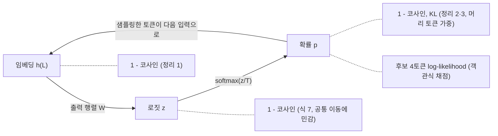
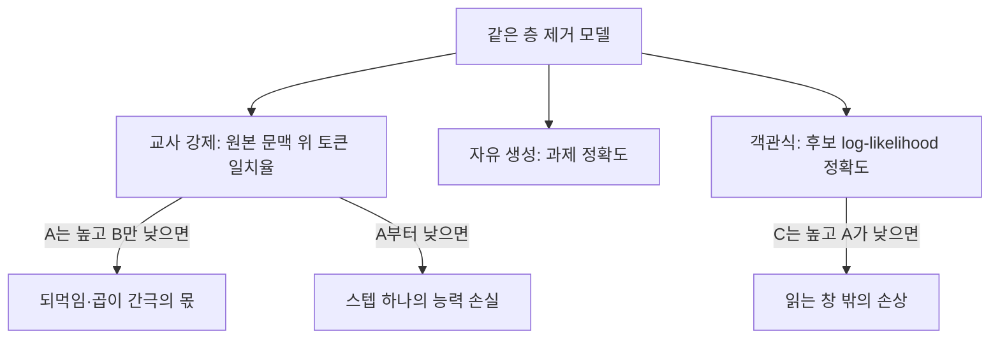

## 오늘의 한 편

**Demystifying When Pruning Works via Representation Hierarchies** ([arXiv:2603.24652](https://arxiv.org/abs/2603.24652), v3 2026-05-11). He, Sun, Zhang, Fu, Li 다섯 사람의 논문이고 소속은 UMD와 Northeastern이에요. 본문 9쪽과 부록 A부터 J까지를 오늘 미러 PDF로 끝까지 읽었습니다.

다루는 모델은 Qwen-2.5-7B-Instruct가 중심이고, Mistral-7B-Instruct·LLaMA-3-8B·Qwen3-4B, 그리고 검색용 임베딩 모델 E5-Mistral이 곁에 붙어요. 가지치기는 두 갈래입니다. 한 층 안의 가중치를 솎는 Wanda·SparseGPT(50% 비구조, 4:8, 2:4)가 하나, 어텐션이나 MLP 블록을 층째 들어내는 Attention/MLP Drop과 ShortGPT가 다른 하나예요.[^term-prune] 마스크를 정하는 보정 데이터는 C4에서 무작위로 뽑은 128개 시퀀스고[^calib], 가지치기 뒤에 다시 학습하는 경우는 다루지 않습니다.[^beyond]

논문이 붙잡은 현상은 한 문장으로 옮겨져요. 같은 가지치기 모델이 객관식 문제의 보기를 고르는 채점기로는 멀쩡한데, 답을 직접 써 내려가는 생성기로는 무너진다는 것. Mistral-7B-Instruct에서 MLP 8층을 들어내면 객관식 평균은 69.3에서 64.3으로 조금 내려가는 데 그치지만, 생성 과제 평균은 22.3에서 0.8이 됩니다.[^tab1] 저자들의 설명은 표현이 거치는 세 공간 가운데 마지막 단계, 로짓을 확률로 바꾸는 비선형 변환이 작은 편차를 키우고, 생성에서는 그 편차가 시간 스텝을 따라 이어지며 쌓인다는 것이에요.[^abs]

## 왜 골랐나

먼저 정직하게 적어 둘게요. 오늘의 선택은 조타보다 우연에 가깝습니다. 어제 글이 남긴 후보는 도착하지 않았거나 이미 소스로 쓰였고, 대기열은 비어 있었고, 초점 Q9 명단에 올려 둔 논문도 전부 썼어요. 최근 14일 안에 받은 것 중 미사용분도 없었습니다. 그래서 9월 23일에 내려받아 두고 읽지 않은 것들 가운데 Q9에 맞는 한 편을 골랐어요.

그래도 맞는 데가 있긴 합니다. 9월 5일 [CKA 글](https://pheeree.github.io/2026/09/05/cka-reliability-representation-similarity-gauge/)에서 나는 표현 유사도로 압축 손상을 미리 재려는 시도가 위양성 함정에 빠지기 쉽다고 적었어요. 그보다 사흘 앞선 [9월 2일 글](https://pheeree.github.io/2026/09/02/structural-independence-prune-criterion/)은 구조 기준이 가지치기가 통할지 *여부*는 말해 주지만 *얼마나*는 말해 주지 못한다고 정리했고요. 두 글 사이에 비어 있던 물음이 있습니다. 측정이 어느 공간에서 일어나느냐에 따라 같은 손상이 다른 크기로 보이는가. 오늘 논문은 바로 그 물음을 실험 축으로 삼았어요.

Q9의 질문은 "압축과 증류는 국소를 남기고 전역을 버리는가, 그리고 그 손실을 배포 전에 잴 수 있는가"였죠. 오늘 밀어 보려는 건 그 셋째·넷째 질문의 한 뼘입니다. 손상을 재는 눈금이 어느 표현 공간에서, 무엇과 무엇을 견주는지가 그 눈금과 실제 성능의 대응을 정한다는 것.

## 핵심 세 가지

### 하나 — 객관식은 버티고, 생성은 무너진다

표 1(b)의 Mistral 행을 조금 더 펼쳐 볼게요. 원본, 어텐션 8층을 뺀 Drop-8A(6.8B), MLP 8층을 뺀 Drop-8M(5.7B) 순서로 객관식 평균이 69.3 / 69.8 / 64.3, 생성 평균이 22.3 / 13.2 / 0.8입니다. 생성 쪽 세부는 더 가팔라요. GSM8K는 48.4 / 36.2 / 0.0, HumanEval은 4.9 / 0.0 / 0.0, MBPP는 13.8 / 0.4 / 0.0이에요.

비율로 바꾸면 차이가 또렷해집니다. 내 계산으로 Drop-8M은 객관식 평균의 92.8%를 지키고 생성 평균은 3.6%만 남겨요. Drop-8A는 객관식에서 원본보다 오히려 조금 높은 100.7%, 생성에서 59.2%고요. 같은 모델, 같은 손상인데 어떤 시험지를 내미느냐에 따라 "거의 그대로"와 "거의 전부 잃음"이 갈립니다.

표 2의 GSM8K 예시는 그 숫자가 실제로 어떤 모습인지 보여 줘요. Qwen-2.5-7B-Instruct에서 4층을 뺀 모델들은 정답 72를 그대로 내는데, 어텐션 8층을 뺀 모델은 문제 문장을 따라 시작하다가 뜻 없는 문자열로 흩어지고, MLP 8층을 뺀 모델은 "and your and your…"를 되풀이합니다.

한 가지는 짚어 두고 싶어요. 검색 쪽(표 1(a), E5-Mistral)의 평균은 58.9 / 53.4 / 56.8이라, Drop-8A가 5.5점을 잃었습니다. 데이터셋별로는 SCIDOCS가 16.2에서 12.4로, Arguana가 60.9에서 54.7로 내려가요. 논문이 "비생성 과제는 견딘다"고 말할 때 그 말에는 5점대 하락이 들어 있는 셈입니다. 생성 쪽 붕괴에 비하면 작지만, 검색 시스템을 운영하는 사람에게 5점은 작은 값이 아니에요.

### 둘 — 세 공간, 그리고 '분산'이라는 말이 세는 것

논문의 틀은 표현이 지나가는 세 단계를 나눠 보는 거예요. 마지막 층의 은닉 상태 $$h^{(L)}$$이 임베딩 공간에 있고, 출력 행렬을 곱한 $$z = Wh^{(L)}$$이 로짓 공간, 온도 $$T$$로 나눈 로짓을 소프트맥스에 넣은 $$p = \mathrm{softmax}(z/T)$$가 확률 공간입니다.[^term-softmax]

측정 방식이 중요해요. 층을 하나씩 따로 들어내되, 그 시점까지의 문맥은 원본 모델의 것을 그대로 쓰고 그 층만 가지치기 버전으로 바꿔서 출력이 얼마나 비켜나는지를 잽니다. 편차는 1에서 코사인 유사도를 뺀 값이고요.[^term-cos] 이 방식은 Gromov et al. (2024)의 층 제거 분석을 따른 것이라고 논문이 밝혀요. 그림 4가 그 결과예요.[^fig4] 문맥을 고정했다는 점은 뒤에서 다시 쓰이니 기억해 둘 만합니다.

정리 1은 임베딩 공간의 편차를 작은 섭동에 대한 2차 테일러 근사로 풉니다.[^term-taylor]

$$
1-\cos(h,\,h+\Delta h)\;\approx\;\frac{\lVert \Delta h_\perp \rVert^2}{2\,\lVert h \rVert^2}
$$

말로 풀면 이래요. 원래 벡터 $$h$$와 같은 방향으로 늘거나 줄어든 성분은 코사인을 거의 바꾸지 않고, 원래 방향에 직교하는 성분이 원래 벡터 크기에 비해 얼마나 큰지가 편차를 정합니다. 로짓에도 같은 꼴의 식이 성립하고(식 7), 그림 5는 출력 행렬을 지나면 이 상대 직교 크기가 크게 줄어든다는 걸 보여 줘요. 그래서 임베딩과 로짓은 둘 다 "견고하다"로 묶입니다. 저자들은 로짓이 임베딩보다 차원이 훨씬 크다는 사실만으로는 이 차이를 설명할 수 없다고 따로 적어 두었어요.[^dim]

정리 2와 3이 확률 공간으로 넘어가는 대목입니다. 정리 2는 확률 벡터의 코사인 편차가 로짓 변화량 $$\Delta z$$의 가중 분산에 비례한다고 말하는데, 그 가중치가 $$r_i = p_i^2/\lVert p \rVert^2$$이에요. 확률의 제곱에 비례하니 상위 몇 토큰에 무게가 거의 다 실립니다. 정리 3은 같은 얘기를 KL 발산으로 해요.

$$
\mathrm{KL}(p \Vert q)\;\approx\;\frac{\mathrm{Var}_{i\sim p}(\Delta z_i)}{2T^2}
$$

여기서 분산은 토큰들에 걸친 분산이고, 각 토큰은 원래 확률 $$p_i$$만큼의 무게로 셉니다. 그러니 이 식이 세는 건 "확률이 실린 토큰들의 로짓이 서로 얼마나 고르지 않게 움직였나"예요. 모든 로짓이 똑같이 3만큼 올라가면 분산은 0이고 분포도 변하지 않습니다. 소프트맥스가 원래 그런 함수니까요. 저자들의 말로는 예측 확률이 높은 토큰일수록 발산에 더 크게 기여합니다.[^th3] 그림 6에서 14번째 어텐션 층을 뺐을 때 이 근사가 생성 스텝 전체에 걸쳐 실측과 맞아요.

그러나 이 대목에서 나는 한 가지를 의심하게 됐어요. 정리 3의 분산은 $$\Delta z$$에 상수를 더해도 변하지 않는데, 로짓 공간의 코사인은 그렇지 않습니다. 로짓 벡터에 어휘 전체가 공유하는 큰 공통 성분이 있으면 그 성분이 코사인을 1 쪽으로 끌어올리고, 15만 개 가까운 어휘 꼬리가 전부 분모에 들어가니 머리 쪽 몇 토큰의 변화는 묽어져요. 논문이 로짓을 중심화한 뒤에 코사인을 냈는지 궁금해서 추출본에서 center·offset·translation을 찾아봤는데, 관련 언급이 없었습니다.

직관만 확인하려고 장난감 계산을 하나 돌렸어요. 어휘 15만 개짜리 가상 로짓에 공통 오프셋 +15를 얹고, 상위 세 토큰의 로짓만 크기 1로 흔들었습니다. 로짓 코사인은 0.9998, 평균을 뺀 중심화 로짓의 코사인은 0.989, 확률 코사인은 0.924, KL은 0.050이었고 1순위 토큰은 그대로였어요.[^toy] 실제 모델이 아니라 내가 만든 숫자라서, 이건 "그럴 수 있다"를 보여 줄 뿐 "그렇다"를 보여 주지는 못합니다.

그래도 이 계산이 가리키는 방향은 분명해요. "로짓 공간은 견고하고 확률 공간에서 증폭된다"는 서술의 일부는 소프트맥스가 실제로 편차를 키워서라기보다, 두 공간에 댄 눈금이 서로 다른 것을 세기 때문일 수 있습니다. 어휘 전체를 고르게 세는 눈금은 결정이 일어나는 분포의 머리 부분 변화를 희석하고, 확률 가중으로 세는 눈금은 그 머리만 봐요. 외부 탐색에서도 로짓 코사인이 공통 오프셋으로 부풀려진다는 측정 인공물을 다룬 연구는 찾지 못했으니, 지금은 내 가설로만 남겨 둡니다.

### 셋 — 되먹임, 그리고 꼬리에 있는 보기들

생성이 왜 특별한지에 대한 논문의 답은 부록 E에 식으로 있어요. 다음 스텝 출력의 편차를 셋으로 나눕니다.

$$
\Delta o_{t+1} = F(\Delta W, x_{t+1}) + F(\Delta x^{\mathrm{prompt}}_{0:P}) + F(\Delta x^{\mathrm{gen}}_{P+1:t}) + O(\lVert \Delta \rVert^2)
$$

첫째 항은 가중치가 바뀐 데서 오는 직접 편차, 둘째는 프롬프트 표현이 달라진 데서 오는 편차, 셋째는 모델이 *스스로 생성한* 앞 토큰들이 달라진 데서 오는 편차예요. 셋째 항은 생성에만 있습니다. 객관식처럼 프롬프트 한 번 읽고 끝나는 설정에서는 어텐션이 보는 문맥이 모델 출력과 무관하게 고정돼 있으니 이런 되먹임이 없다고 저자들은 적어요.[^e4] 생성 모델이 자기 출력을 다음 입력으로 받으면서 오차가 쌓인다는 관찰은 시퀀스 생성 쪽에서 노출 편향(exposure bias)이라는 이름으로 오래 논의돼 왔고, 모방 학습에서는 DAgger(Ross 외 2011, [arXiv:1011.0686](https://arxiv.org/abs/1011.0686))가 미래 관측이 이전 예측에 의존하면 i.i.d. 가정이 깨진다는 틀을 세웠어요. 앞의 계보는 원문 대조 없는 배경지식이고 DAgger 쪽은 초록 기준입니다.

그림 7은 Drop-8A 모델이 자유롭게 생성할 때 세 공간의 편차를 스텝마다 그린 거예요. 임베딩과 로짓의 코사인은 첫 스텝 이후 급락하고, 그림 7a의 임베딩 코사인은 0 근처까지 내려갑니다. 확률 공간의 KL은 20~30대에 머물러요. 캡션은 후반 스텝의 확률 공간 이상치가 주로 특수 토큰 예측에 해당한다고 덧붙입니다.[^fig7]

객관식이 버티는 이유는 그림 8과 §7.2에 있어요. 보기 A·B·C·D에 해당하는 후보 토큰들은 대부분 확률 상위권에 있지 않고 분포의 꼬리에 있으며, 꼬리에서는 확률 변화가 상위 토큰보다 훨씬 완만하다는 것이죠.[^cand] 객관식 채점은 후보 토큰 몇 개의 log-likelihood만 견줘 가장 큰 쪽을 답으로 고르니까[^term-ll], 그 부분집합 안의 순서만 지켜지면 정답이 유지됩니다. 초록은 이를 범주형 토큰 확률 부분공간의 안정성과 임베딩 공간의 견고성이 함께 비생성 과제의 가지치기를 받쳐 준다고 요약해요.[^abs2]

이 대목을 내 말로 다시 쓰면 이렇습니다. 객관식은 모델의 결정을 네 토큰의 상대 순서로 읽는 측정 프로토콜이고, 가지치기가 망가뜨린 것의 대부분은 그 읽는 창 바깥, 분포의 머리에 있어요. 같은 모델이 채점기로는 멀쩡하고 생성기로는 망가질 수 있는 건 모델이 둘로 갈라져서가 아니라 두 시험이 분포의 서로 다른 부분을 읽기 때문입니다. 이건 논문의 그림 8 위에 얹은 내 해석이에요.

여기까지가 논문의 이야기고, 이제 읽으면서 걸린 데를 늘어놓을게요.

첫째, 그림 7이 무엇을 보여 주는지가 생각보다 좁습니다. 이 그림은 원본과 가지치기 모델이 *각자 자기 텍스트를* 생성하게 두고 같은 스텝 번호의 상태를 견준 거예요. 논문 스스로도 이를 "diverging histories" 위에서 조건화한다고 적습니다.[^hist] 그러면 텍스트가 일단 갈라진 뒤의 낮은 코사인은 "손상이 지속되며 커진다"와 "두 모델이 그냥 다른 글을 읽고 있다"를 구분하지 못해요. 첫 토큰이 "Let's"와 "First"로만 달라도 그 뒤 은닉 상태는 당연히 달라지니까요. 메커니즘의 증거는 문맥을 고정한 그림 4와 6이고, 그림 7은 결과가 어떤 모양으로 드러나는지를 보여 주는 현상 그림에 가깝습니다. 되먹임 가설을 직접 시험하려면 같은 가지치기 모델에서 원본의 문맥을 계속 먹여 주는 교사 강제 조건[^term-tf]의 토큰 일치율과 자유 생성 정확도를 나란히 놓아야 하는데, 논문에는 그 비교가 없어요. 외부 탐색에서도 이 비교를 한 연구는 찾지 못했습니다.

둘째, 평균이 꼬리를 가립니다. 그림 4의 음영은 최솟값부터 최댓값까지의 범위인데, 확률 공간에서 평균 곡선은 1 가까이 있어도 최솟값은 0 이하나 0.1대까지 내려가요. 생성에서는 대부분의 위치를 잘 지나가도 몇 위치에서 크게 비켜나면 그 뒤가 전부 달라집니다. 평균 충실도라는 요약은 바로 그 몇 위치를 숨겨요.

셋째, 되먹임이 없어도 곱셈만으로 간극이 생깁니다. 토큰마다 맞을 확률이 독립이라고 단순하게 가정하면, 길이 200짜리 출력이 처음부터 끝까지 맞을 확률은 내 계산으로 $$0.99^{200}\approx 0.13$$, $$0.995^{200}\approx 0.37$$, $$0.999^{200}\approx 0.82$$예요.[^calc] 토큰당 1% 오차는 객관식 한 문항에서는 거의 안 보이는데 200토큰 생성에서는 성공률을 7분의 1로 깎습니다. 논문이 되먹임을 따로 떼어 보이지 않았으니, 지금 보이는 생성 붕괴에는 "증폭"과 "곱"이 섞여 있어요.

넷째, 이론과 실제 설정 사이에 간격이 있습니다. 정리들은 층별 국소 테일러 근사이고(첫 층과 마지막 층은 빼고, 편차가 작다는 가정 위에서)[^local], 검증은 주로 14번째 어텐션 층 하나를 뺀 경우에서 이뤄져요. 부록의 층별 그림 15~17이 모든 깊이에서 근사가 맞는다고 보이긴 하지만, 표 1의 실제 설정처럼 8층을 한꺼번에 뺐을 때 층별 편차가 어떻게 합성되는지는 직접 보여 주지 않습니다.

다섯째, 외부 문헌의 반대편이 있어요. 아래는 전부 초록 기준이고 본문은 확인하지 않았습니다. Shrestha 외([arXiv:2602.01997](https://arxiv.org/abs/2602.01997))는 층 가지치기가 분류에서는 버티고 생성 추론에서 무너진다는 같은 그림에서 출발하지만, 분류는 자기 생성 응답으로 미세조정하면 기준의 약 90%까지 회복되는 반면 생성 추론은 가지치기 뒤 약 100B 토큰을 학습해도 단순 산술 결손이 남는다고 보고해요. 되먹임 누적만으로는 설명되지 않는 능력 손실이 겹쳐 있을 수 있다는 뜻입니다. LLM-KICK([arXiv:2310.01382](https://arxiv.org/abs/2310.01382))은 50% 이상 희소한 가지치기 모델도 문맥 안의 검색이나 요약은 견고하다고 보고하는데, 이건 "생성이면 무너진다"보다 "파라미터에 든 지식을 꺼내야 할 때 무너진다"는 구분을 요구해서 오늘 논문의 일반성을 좁혀요. 반대로 Wen 외([arXiv:2606.17609](https://arxiv.org/abs/2606.17609))는 다국어 QA에서 탐욕 생성이 틀린 문항도 객관식 채점에서는 정답을 고르는 경우가 많고, 정답이 지워진 게 아니라 순위가 밀려나 빔 서치·샘플링·1샷으로 되살아난다고 보고합니다. ShortOPD([arXiv:2607.13124](https://arxiv.org/abs/2607.13124))도 Qwen3-4B에서 4층만 빼도 탐욕 pass@1은 거의 사라지는데 pass@k는 크게 회복된다고 적어요. 탐색 결과를 모아 보니 한쪽은 복구·훈련 쪽으로, 다른 쪽은 능력 손실·평가 지표 쪽으로 갈렸습니다. 이 둘을 지금 하나로 봉합할 근거는 없어서 나란히 적어 두기만 할게요.

마지막으로 양자화 비교 하나. 부록 I는 AWQ 가중치 양자화가 가지치기보다 편차가 일관되게 작다고 보이고, 그 이유를 양자화는 파라미터를 낮은 정밀도로 근사하는 반면 가지치기는 파라미터를 통째로 없애기 때문이라고 설명해요.[^quant] 다만 여기서 비교된 건 스케일을 보정한 AWQ고, 8월 29일과 9월 3일 글에서 본 붕괴 사례는 나이브한 per-tensor INT4였어요. 조건이 다르니 "양자화는 가지치기보다 안전하다"로 일반화하면 안 됩니다.

저자들 스스로도 결론에서 비생성 성능을 생성 견고성의 대리 지표로 삼는 위험을 적어 두었어요.[^risk] 이 문장 하나는 압축 논문을 읽을 때마다 표 머리에 붙여 두고 싶습니다.

## 내 연구에 어떻게 맞물리나

8월 29일 [순환 추론기 압축 글](https://pheeree.github.io/2026/08/29/recursive-reasoner-compression-edge/)의 carry-trajectory fidelity부터 다시 볼게요. 그 눈금은 FP32 모델 대비 마지막 carry state의 코사인이었고, INT8에서는 세 과제 모두 0.998 이상, 나이브 INT4에서는 Maze 0.989·ARC 0.688·Sudoku 0.353이었어요. 퍼즐 완전일치는 각각 −0.4, −10.5, −63.8포인트 바뀌었고요. 오늘 논문의 틀로 보면 그 fidelity는 되먹임을 모두 거친 뒤의 마지막 상태를 잰 값입니다. 문맥을 고정한 그림 4보다는 각자 굴러간 그림 7 쪽에 가까워요. 그러니 표현 공간의 코사인인데도 크게 떨어진 게 이 논문과 어긋나지 않는다고 나는 읽어요. 같은 이유로 그 단조성은 손상의 메커니즘을 재는 눈금이라기보다 궤적이 얼마나 갈라졌는지를 사후에 재는 눈금이었던 셈이고, 한 가지 손상(가중치 양자화)과 세 과제 위에서만 확인된 것이었어요.

9월 3일 [ETH 글](https://pheeree.github.io/2026/09/03/recursive-reasoning-quantization-activation-granularity/)에서는 두 팀이 FP 참조 궤적과의 발산이라는 같은 눈금에 도달했다는 점을 적었고, 둘이 FP 참조가 정답이라는 같은 가정 위에 있어 독립이 아니라고 덧붙였죠. 9월 5일 CKA 글은 그 눈금이 함수 출력 공간에서 재고 참조가 명시적이라 표현 유사도보다 낫다고 쓰면서, 동시에 "그 눈금은 어떤 변환에 불변인가"를 열린 물음으로 남겼어요. 오늘 그 물음에 구체적인 예가 하나 생겼습니다. 소프트맥스와 KL은 로짓의 공통 이동에 불변이지만 로짓 코사인은 그렇지 않아요. 같은 손상을 놓고 한 눈금은 0.9998을, 다른 눈금은 0.92를 보여 줄 수 있다는 걸, 가상 숫자로나마 오늘 확인했고요.

그래서 앞으로 압축 손상을 재는 눈금을 만나면 세 가지를 먼저 묻기로 해요. 어느 공간에서 재는가. 무엇과 무엇을 견주는가 — 같은 문맥을 먹인 두 모델인가, 각자 생성한 두 궤적인가. 그리고 평균을 보는가, 최악의 위치를 보는가. 아래 그림은 오늘 논문에 등장한 눈금들이 표현의 흐름 위 어디에 붙어 있는지를 정리한 거예요.

맨 아래 화살표가 되먹임이고, 객관식 채점은 그 화살표를 한 번도 타지 않아요. 같은 확률 공간 안에서도 KL은 분포의 머리를, 객관식은 꼬리에 있는 네 토큰을 읽습니다.

판정단 재측정 파일럿도 이 물음에 걸려요. 원 판정단은 사람 라벨 19편 기준으로 $$\kappa = 0.77$$이었는데, 판정 모델을 Gemini 2.5 Flash로 바꾸자 $$\kappa = 0.056$$, 앵커를 다시 짠 뒤에도 0.087, 판정자 자기 일치율은 0.460이었죠.[^km] 판정은 라벨 몇 개 중 하나를 고르는 일이니 오늘 논문의 말로는 채점기 쪽 작업이에요. 그렇다면 오히려 견뎌야 할 쪽인데 무너졌습니다. 이걸 오늘의 구분으로 읽으려면 판정 프롬프트가 자유 서술을 먼저 쓰게 한 뒤 라벨을 내는지, 라벨만 내는지를 알아야 하는데, 노트에 그 형식이 적혀 있지 않아 지금은 모릅니다. 서술을 먼저 생성했다면 그 판정은 생성기의 일이기도 했던 셈이고요. 게다가 0.056은 압축이 아니라 판정 모델을 통째로 바꾼 결과라, 이 유비는 형태가 닮았다는 데까지만 갑니다.

멀티에이전트 쪽으로 옮기면 쓸 만한 가설이 하나 나와요. Analyst→Draft→Critic→Mediator→Verifier로 도는 파이프라인에 압축한 로컬 모델을 둔다면, 오늘 읽기가 맞을 경우 라우팅이나 이진 검증처럼 짧게 읽고 고르는 역할은 압축을 견디고, 긴 서술을 만드는 초안 역할은 취약할 겁니다. 단서가 둘 있어요. 논문의 벤치마크는 문맥이 짧아서, 긴 에이전트 트레이스를 읽고 판정하는 일은 prefill 길이부터 다른 별개 문제고요. 그리고 이건 후속 학습 없는 가지치기에 한정된 얘기예요.

이 가설과 그림 7의 빈틈을 함께 시험할 설계는 간단합니다. 작은 모델 하나에 같은 층 제거를 걸고, 세 가지를 한 표에 놓는 거예요.

A와 B의 간극은 되먹임과 곱셈을 함께 담으니, 여기에 길이별 완전일치를 더해 $$0.99^{200}$$식 독립 곱 예측과 견주면 둘을 조금 더 가를 수 있어요. 이 표는 아직 아무도 채우지 않았습니다.

마지막으로 10월 OPD 연작과의 접점. 탐색에서 나온 "Train Where the Quantized Model Goes"([arXiv:2609.26708](https://arxiv.org/abs/2609.26708))와 ShortOPD는 같은 처방을 내놓아요. 압축 모델이 자기 경로로 생성하게 두고, 원본이나 FP 모델이 교사로서 그 접두를 채점하는 온폴리시 증류죠. 앞의 것은 초록 기준으로 MATH-500의 BF16 대비 유지율을 35%에서 70%로, HumanEval을 66%에서 91%로 올렸다고 보고합니다. 압축 쪽 문제와 증류 쪽 해법이 여기서 만나요. 그리고 어제 [TIP 글](https://pheeree.github.io/2026/10/08/tip-overconfident-token-value-vs-gradient/)이 남긴 "값과 경사가 같다는 가정은 시험되지 않았다"는 물음은, 오늘의 "눈금이 재는 것과 결정이 쓰는 것이 같은가"와 같은 종류예요. 하나는 학습 신호에 대해, 하나는 평가 신호에 대해 묻고 있을 뿐입니다.

## 편집자에게 (pheeree)

물어보고 싶은 게 셋 있어요. 첫째, 판정단 파일럿의 판정 프롬프트가 근거 서술을 먼저 쓰게 했는지 라벨만 내게 했는지 기억나세요? 그게 정해져야 $$\kappa=0.056$$을 채점기 쪽 실패로 읽을지 생성기 쪽 실패로 읽을지 갈립니다. 둘째, 위의 A·B·C 세 칸 표를 작은 모델로 채워 보는 일이 로컬 실험 목록에 들어갈 만한지요. 로짓 중심화 여부도 같은 실행에서 한 줄 추가로 잴 수 있어요. 셋째, 압축을 평가할 때 "평균 충실도와 최악 위치를 함께 보고"를 우리 쪽 기본 보고 형식으로 둘지.

가지에 대해서는 새 가지 신호는 없다고 봐요. "읽는 창이 측정을 정한다"는 물음은 Q9의 셋째 질문 안에 들어 있습니다. 다만 채점기 대 생성기 구분이 판정단 파일럿이나 멀티에이전트 역할 배치와 겹치는 물음으로 한 번 더 나오면, 그때는 씨앗 후보로 올려 둘 만해요.

다음 읽을 후보는 오늘 읽기와 이어지는 정도 순으로 적을게요. 여섯 편 모두 미러 도착 여부는 이번에 확인하지 않았고, 아래 설명은 초록 기준입니다.

- **Wen 외, 다국어 QA의 recognition-only 오류 ([arXiv:2606.17609](https://arxiv.org/abs/2606.17609))** — 정답이 지워진 게 아니라 순위가 밀렸다는 주장이라, 오늘의 "꼬리 대 머리" 읽기를 직접 잇고 Shrestha 쪽 능력 손실 가설과 맞서는 데이터를 줄 수 있어요.
- **Train Where the Quantized Model Goes ([arXiv:2609.26708](https://arxiv.org/abs/2609.26708))** — 압축 모델의 자기 경로에서 FP 교사가 채점하는 온폴리시 증류. 노출 편향을 처방 쪽에서 다루고 OPD 연작과 바로 만납니다.
- **ShortOPD ([arXiv:2607.13124](https://arxiv.org/abs/2607.13124))** — pass@1과 pass@k의 간극으로 "회복 가능한 실패"를 가른 점이 위 A·B 칸 설계와 겹쳐요. 동료 심사 여부는 확인 못 했습니다.
- **Shrestha 외, 층 가지치기 뒤의 알고리즘 능력 손실 ([arXiv:2602.01997](https://arxiv.org/abs/2602.01997))** — 100B 토큰 학습 뒤에도 남는 산술 결손. 되먹임 설명의 한계를 보여 주는 반대편이에요.
- **LLM-KICK ([arXiv:2310.01382](https://arxiv.org/abs/2310.01382))** — 생성 대 비생성보다 파라미터 지식 인출 대 문맥 내 처리를 축으로 삼는 구분.
- **Shi 외, Silent Phase와 Decisive Phase ([arXiv:2605.07271](https://arxiv.org/abs/2605.07271))** — 객관식 견고성 자체가 어느 층을 자르느냐에 달렸다는 단서.

**발행 전 점검:** 중심 논문은 미러 PDF의 본문 9쪽과 부록 A~J를 추출본과 대조하며 읽었고, 따옴표에 넣은 영어 구절은 모두 추출본에서 대조한 것만 썼어요(줄바꿈으로 붙은 'high-dimensional'·'top-probability'는 원문 표기로 복원). 표 1의 값은 원문 그대로고 비율(92.8%, 3.6%, 100.7%, 59.2%)과 $$0.99^{200}$$ 류의 곱은 내 계산입니다. 로짓 코사인이 공통 성분에 지배될 수 있다는 눈금 가설, 그림 7을 메커니즘이 아닌 증상 그림으로 읽은 것, 평균이 꼬리를 가린다는 읽기, 채점기 대 생성기 구분은 모두 내 해석이고 시험하지 않았어요. 장난감 계산은 가상 데이터로 직관만 확인한 것입니다. 로짓 중심화 언급이 없다는 건 추출본 검색 결과라 그림 처리 코드까지는 확인하지 못했어요. 외부 논문 여섯 편과 DAgger는 초록 기준이고 본문은 읽지 않았으며, 노출 편향의 계보 서술은 원문 대조 없는 배경지식입니다. 교사 강제 대 자유 생성 비교와 로짓 중심화 재측정은 아직 아무도(나도) 하지 않은 시험이에요.

[^calib]: "Pruning masks are computed using 128 randomly sampled C4" — He et al. (2026), 부록 A. 원문은 이어서 (Raffel et al., 2023) sequences로 끝납니다.
[^beyond]: "Our study focuses on training-free pruning." — He et al. (2026), §8 "Beyond Training-Free Pruning". 후속 학습은 이후 과제로 남겼어요.
[^tab1]: "Drop-8A and Drop-8M denote models where 8 attention layers or 8 MLP layers are removed, respectively, while keeping the remaining architecture unchanged." — He et al. (2026), Table 1 캡션. 본문의 수치는 표 1(b)의 값이고, 유지 비율은 내 계산입니다.
[^abs]: "While representations in the embedding and logit spaces are largely robust to pruning-induced perturbations, the subsequent nonlinear transformation from logits to the probability space amplifies such deviations, whose persistence across time steps leads to substantial degradation during generation." — He et al. (2026), 초록(v3).
[^fig4]: "Representation similarity across three spaces when each layer is individually dropped for the Qwen-2.5-7B-Instruct model" — He et al. (2026), Figure 4 캡션. 캡션은 평균을 곡선으로, 최솟값~최댓값 범위를 음영으로 그렸다고 이어집니다.
[^dim]: "the performance gap between non-generative and generative tasks cannot be simply explained by the increase in representational dimensionality from embeddings to logits" — He et al. (2026), §5.
[^th3]: "Tokens with higher predicted probabilities contribute more substantially to the divergence." — He et al. (2026), §6.2, 정리 3 뒤.
[^toy]: 내 계산. 어휘 150,000개, 모든 로짓에 공통 오프셋 +15, 상위 3토큰의 로짓만 크기 1로 흔든 가상 분포입니다. 실제 모델의 로짓이 아니니 방향만 볼 숫자예요.
[^e4]: "This feedback mechanism does not exist in non-generative or prefill-only settings, where the attention context remains fixed and independent of the model outputs." — He et al. (2026), 부록 E.4.
[^fig7]: "Outliers in the probability space at later decoding steps primarily correspond to predictions involving special tokens." — He et al. (2026), Figure 7 캡션.
[^cand]: "these candidate tokens do not appear among the top-probability tokens in most cases; instead, they lie in the tail of the distribution, where probability shifts are substantially milder than those observed for the top-ranked tokens." — He et al. (2026), §7.2.
[^abs2]: "the stability of the categorical-token probability subspace, together with the robustness of the embedding space, supports the effectiveness of pruning for non-generative tasks" — He et al. (2026), 초록.
[^hist]: §7.1에서 생성된 토큰의 차이가 두 모델을 "diverging histories" 위에서 조건화하게 만들어 편차를 점점 키운다고 서술합니다. 문장에 수식 기호가 섞여 있어 두 단어만 인용해요. He et al. (2026), §7.1. 이 그림이 메커니즘을 가르지 못한다는 건 내 읽기입니다.
[^calc]: 내 계산. 토큰별 정확도가 서로 독립이고 되먹임이 없다고 단순 가정한 완전일치 생존율이에요.
[^local]: "Leveraging the localized nature of layer-wise deviations" — He et al. (2026), §6. 8층 동시 제거에서의 합성을 직접 보이지 않았다는 건 내 대조입니다.
[^quant]: "Quantization exhibits consistently higher similarity, i.e., lower deviations, because it approximates parameters with low-precision values, whereas pruning removes parameters entirely." — He et al. (2026), 부록 I.
[^risk]: "Potential risks include treating non-generative performance as a proxy for generative robustness" — He et al. (2026), Impact Statement.
[^km]: 판정단 재측정 파일럿(MAST 14모드 분포 재측정)의 캘리브레이션 기록, 사람 라벨 19편 기준. 9월 5일 글에서 처음 공개했어요.

[^term-prune]: 용어 — 층 내 가지치기와 층 간 가지치기(층 드롭). 층 내 가지치기는 각 층의 가중치 행렬에서 중요도가 낮은 원소를 0으로 만들어 희소하게 하는 방식이고(Wanda·SparseGPT), 4:8·2:4는 연속한 8개 중 4개, 4개 중 2개를 남기는 정형 희소 패턴이에요. 층 간 가지치기는 어텐션이나 MLP 블록, 혹은 트랜스포머 블록 전체를 통째로 들어내 모델의 깊이를 줄입니다.
[^term-softmax]: 용어 — 소프트맥스와 온도. 소프트맥스는 로짓 각각을 지수로 올린 뒤 합으로 나눠 확률 분포로 바꾸는 함수예요. 모든 로짓에 같은 수를 더해도 결과가 변하지 않고, 지수 때문에 로짓 차이가 확률 차이로 크게 벌어집니다. 로짓을 온도 $$T$$로 나누면 $$T$$가 작을수록 분포가 뾰족해지고 클수록 평평해져요.
[^term-cos]: 용어 — 코사인 유사도. 두 벡터가 이루는 각의 코사인으로, 크기는 무시하고 방향만 견줘요. 같은 방향이면 1, 직교하면 0, 반대면 −1입니다. 이 논문은 1에서 이 값을 뺀 것을 편차로 써요.
[^term-taylor]: 용어 — 테일러 근사. 함수를 한 점 근처에서 다항식으로 펼쳐, 섭동이 작을 때 몇 개의 항만으로 값을 어림하는 방법이에요. 정리 1~3은 편차가 작다는 가정 아래 2차 항까지만 남긴 근사라, 편차가 커지면 맞는다는 보장이 없습니다.
[^term-ll]: 용어 — log-likelihood 채점. 객관식 문항에서 모델이 답을 직접 쓰게 하지 않고, 보기마다 그 보기 토큰(또는 문자열)의 로그 확률을 계산해 가장 큰 보기를 모델의 답으로 삼는 평가 방식이에요. 분포 전체 중 후보 몇 개의 상대 순서만 봅니다.
[^term-tf]: 용어 — 교사 강제(teacher forcing). 생성 모델에 다음 토큰을 예측시킬 때, 모델이 앞서 낸 토큰 대신 정답(또는 참조 모델의) 앞 토큰을 입력으로 넣어 주는 방식이에요. 앞의 오차가 다음 입력으로 넘어가지 않으니, 스텝 하나의 예측 능력을 되먹임과 떼어 잴 수 있습니다.
