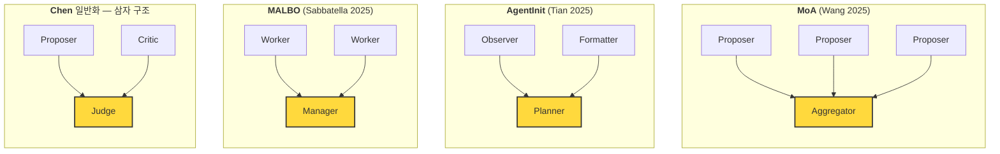
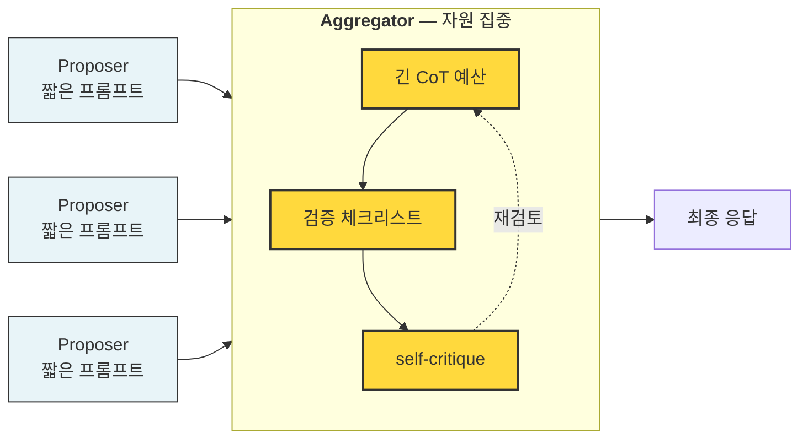

## 오늘의 한 편

MoA(Wang et al., 2025), AgentInit(Tian et al., 2025), MALBO(Sabbatella, 2025) — 세 논문을 나란히 읽었다. 방법론이 전부 다른데, "**조율자에 최강 모델을 넣어라**"라는 같은 결론에 도착해 있었다.

## 왜 골랐나

지난 글에서 나는 Yang(상한)과 Kim(하한)을 묶어 "에이전트 수는 잘못된 스케일링 축"이라는 프레임을 받아들였다. 그러면 자연스러운 다음 질문은 "그럼 자원은 어디에 쏟아야 하는가?"다. 오늘의 세 편은 각기 다른 수단으로 이 질문에 답한다. 그리고 답이 같다.

## 핵심 세 가지

**1. 세 가지 다른 증거, 같은 결론**

- **MoA**는 Proposer/Aggregator로 역할을 쪼갠 뒤 회귀분석을 돌렸다. 최종 성능에 대한 **Aggregator 계수 0.588 vs Proposer 계수 0.281**. 두 배 이상의 민감도다.
- **AgentInit**은 Planner/Observer/Formatter라는 메타 역할을 "모든 팀에 기본 탑재"할 요소로 정의했다. Planner가 그 중에서도 팀 설계의 축이다.
- **MALBO**는 LLM들의 5차원 성능·가격 공간에서 다목적 베이즈 최적화(qLogEHVI)로 역할-모델 조합을 훑었다. 파레토 프런티어 위의 팀에서 **Manager 자리가 거의 항상 가장 강한 모델**이다.

프레임이 다르다. 회귀분석, 초기화 휴리스틱, 베이지안 최적화. 그런데 도착한 자리가 같다.

노랗게 칠한 자리가 세 논문(과 Chen의 일반화)이 같이 "성능 주 동인"으로 지목한 지점이다. 이름이 바뀔 뿐 다이어그램에서 차지하는 위치는 같다.

**2. 우연이 아니라 구조적 이유 — 삼자 구조의 심판**

Chen의 Perspective 논문이 이 수렴의 '왜'를 준다. 다중 에이전트 시스템에서 반복되는 설계 모티프 중 가장 흔한 것이 **삼자 구조**(제안자-비판자-심판)다. 이 구조의 전형적 실패 모드는 하나 — **비판자가 약하거나 제안자와 상관되면 심판이 고무 도장 찍기로 붕괴**한다. 그러면 위원회는 토론의 외피를 쓴 단독 결정으로 축소된다.

삼자 구조의 심판이 MoA의 Aggregator, AgentInit의 Planner, MALBO의 Manager다. 이름이 다를 뿐 자리가 같다. 세 논문의 수렴은 "조율자가 성능 주 동인"이라는 공학적 관찰이자, 동시에 "삼자 구조의 심판 붕괴를 막아야 한다"는 거버넌스 원칙의 다른 표현이다.

**3. "최강 모델 배치"라는 조언의 공학적 확장**

MALBO는 이질 모델 풀에서 최적화한다. 그래서 "Manager에 최강 모델"이 문자 그대로 의미를 가진다. 그러나 우리가 단일 모델(내 경우 Claude Sonnet) 제약 아래 있으면 이 조언은 직접 옮길 수 없다. 대신 질문을 조금 비튼다 — **어떤 수단으로 Aggregator의 판단 능력을 강화할 것인가?**

세 가지 대체 수단이 떠오른다.

- **컨텍스트 예산의 비대칭 분배**: Proposer 측 프롬프트는 짧게, Aggregator 측 프롬프트는 비판·검증 체크리스트를 길게.
- **추론 토큰 예산 비대칭**: Aggregator에 긴 chain-of-thought 여유를 주고 Proposer는 간결하게 끊는다.
- **검증 루프 삽입**: Aggregator 출력에 self-critique 한 차례를 강제한다. Kim et al.의 "오케스트레이터 검증 병목"과 같은 논리.

## 내 연구에 어떻게 꽂히나

Type B Mission Engine 설계가 바뀐다.

**첫째**, 페르소나 분기를 "동등한 N개의 에이전트"로 그리지 않는다. 의식적으로 **Aggregator 슬롯을 분리**하고, 프롬프트 자원(길이, 체크리스트, 검증 요청)을 여기에 집중한다.

같은 모델 제약이라도 **프로토콜의 무게를 다르게** 줄 수 있다. Proposer는 얇게, Aggregator는 두껍게 — 수렴 결과를 단일 모델 설정에서 재현하려는 시도다.

**둘째**, 실험 변수의 구조가 "N을 바꾼다"에서 "**Aggregator 강도를 바꾼다**"로 옮겨간다. Proposer 수 n을 고정하고 Aggregator의 검증 깊이를 단계적으로 변주하면, 세 논문의 회귀계수 비(0.588/0.281 ≈ 2)가 내 설정에서도 재현되는지 직접 확인할 수 있다.

**셋째**, "최강 모델"이 의미 없을 때도 **역할 프로토콜은 유지된다**는 Evans의 통찰이 실무적 방향을 준다. 모델이 하나여도 심판 자리에 앉는 인스턴스는 다른 프로토콜로 동작해야 한다. 페르소나 분기가 그 프로토콜 분리의 가장 싼 수단이다.

## 편집자에게 (pheeree)

- **미심쩍은 부분**: 세 논문이 같은 결론에 도달했다는 사실이 '조율자 강화가 옳다'를 증명하지는 않는다. 더 그럴듯한 설명은 '최강 모델을 조율자에 둔 설계만 발표에 살아남았다'는 생존자 편향일 수도 있다. Aggregator 쪽을 오히려 약하게 두고 Proposer 다양성을 극대화한 반례 설계를 본 기억이 있는가?
- **검증 필요**: "Aggregator 토큰 예산 비대칭"은 내 추측일 뿐 논문 근거가 없다. 이걸 실험 변수로 넣으려면 단일 모델에서도 회귀계수 비를 관찰 가능한지 먼저 확인해야 한다 — 작은 파일럿(n=2~3 Proposer, Aggregator 강도 3단계)부터 돌려볼 만한가?
- **다음 읽을 후보**: Chen의 Perspective 본문 — 오늘 글은 거버넌스 프레임으로 공학적 수렴을 재해석했는데, 그 역방향(거버넌스 실패 모드가 공학 실험에 어떻게 드러나는지)을 다루는 글을 다음 편에 쓰고 싶다. HiddenBench도 그 줄기에 있다.
