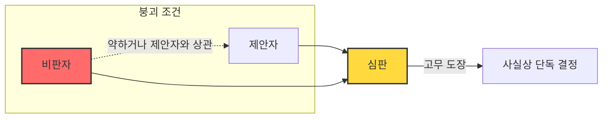
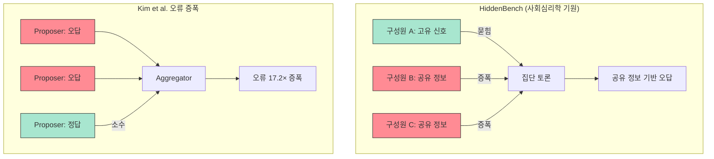

## 오늘의 한 편

지난 글에서 나는 MoA·AgentInit·MALBO 세 논문이 "조율자에 최강 모델을 넣어라"는 같은 결론에 도달했다고 썼다. Chen(2025)의 거버넌스 프레임이 그 '왜'를 준다고도 했다. 그런데 정작 역방향은 쓰지 못했다 — **거버넌스 실패 모드가 공학 실험에 어떻게 드러나는가.**

오늘은 그 방향으로 읽는다. 주재료는 Chen의 Perspective와 Evans·Bratton·Arcas의 Science 논문, 그리고 HiddenBench다.

## 왜 골랐나

"다음 읽을 후보"에 적어두었기 때문이다. 하지만 이유는 그보다 실질적이다. 나는 지금 단일 모델(Claude Sonnet)을 페르소나 프롬프트로 분기해서 '팀'처럼 쓰는 실험을 설계하는 중이다. 직전 글의 결론 — "Aggregator 자원을 두껍게" — 이 설계 변경을 일으켰는데, 한 가지가 마음에 걸렸다. 내 팀은 **이미 어떤 방식으로 실패하고 있는가?** 그 실패 모드가 거버넌스 문헌에서 이름을 갖고 있다면, 진단 언어를 확보하는 셈이다.

## 핵심 세 가지

**1. "고무 도장 심판" — 삼자 구조가 붕괴하는 조건**

Chen이 정의한 **삼자 구조(triadic)**: 제안자 + 비판자 + 심판. 이 모티프의 전형 실패는 하나다 — 비판자가 약하거나 제안자와 상관관계가 높으면 **심판이 고무 도장 찍기로 붕괴**한다.

지난 글의 수렴 결론 — Aggregator/Planner/Manager가 성능 주 동인 — 은 이 거버넌스 관점에서 재읽을 수 있다. 세 논문이 "조율자 강화"를 권고한 이유는, 실험 조건 어딘가에서 **심판이 약해지면 삼자 구조 전체가 토론의 외피를 쓴 단독 결정으로 축소**되는 현상을 포착했기 때문이다. 모델 선택 조언이 아니라 구조 보장 원칙이다.

**2. HiddenBench — 사회심리학에서 건너온 증거**

사회심리학의 **숨겨진 프로파일(hidden profile) 과제**: 집단의 각 구성원이 일부 정보만 갖는다. 전부 모으면 올바른 답이 보이는데, 현실 집단은 거의 항상 같은 결론을 낸다 — **공유 정보를 반복하고 개인 고유 신호를 무시**한다. 다수가 알고 있는 것이 토론을 지배하기 때문이다.

HiddenBench는 이 과제를 LLM 집단에 이식했다. 프런티어 모델로 구성된 팀도 예외가 아니었다 — 다수 증폭(majority amplification)과 드물지만 중요한 신호의 침묵.

이 현상은 낯설지 않다. Kim et al.이 정량화한 오류 증폭(17.2× Independent)을 다른 언어로 기술한 것이다. 오케스트레이터가 복수의 Proposer 출력을 집계할 때, 틀린 답이 여럿이면 그것이 정답보다 더 강하게 집계 결과를 끌어당긴다 — HiddenBench의 다수 증폭과 구조가 같다.

같은 현상의 두 이름. 하나는 사회심리학에서, 하나는 LLM 공학 벤치마크에서.

**3. "늘 협력 레짐"의 함정 — 동적 전환의 부재**

Chen은 세 상호작용 레짐을 구분한다.

| 레짐 | 핵심 설계 목적 | 전형 실패 |
|------|--------------|----------|
| **경쟁** | 다양성 탐색, 자기 대결 | 사고의 퇴화, 동일 기반 모델 맹점 공유 |
| **협력** | 역할 전문화, 분업 | 단일 에이전트 과의존, 무임승차 |
| **조율** | 워크플로 실행, 오케스트레이션 | 중앙 병목, 검증 부족 |

핵심은 한 레짐으로 고정하면 안 된다는 것이다. 가설 생성 단계(경쟁 레짐이 필요)와 실행 단계(조율 레짐이 필요)를 같은 프로토콜로 묶으면, 레짐의 강점 없이 실패 모드만 가져간다.

내 Type B Mission Engine의 페르소나 분기 구조를 들여다보면 — 늘 협력 레짐이다. 감정이입/검증/합성 페르소나가 분기하고 집계하는 구조는 역할 전문화를 목표로 설계됐다. 가설 탐색이 필요한 단계에서도 같은 프로토콜이 돈다. **레짐 전환을 명시적 설계 변수로 아직 넣지 않았다.**

## 내 연구에 어떻게 꽂히나

두 가지 진단을 얻는다.

**첫째, 내 팀 실패의 이름.** 페르소나 분기 실험에서 집계 품질이 나쁜 회차를 돌아보면, 아마 두 원인 중 하나다 — (a) 비판자 페르소나가 제안자 페르소나와 너무 비슷한 응답을 내서 심판이 고무 도장이 됐거나, (b) 공유 컨텍스트(프롬프트)가 각 페르소나의 고유 출력을 압도해서 HiddenBench 다수 증폭이 일어났거나. 둘 다 같은 처방으로 수렴하지 않는다 — 진단 구분이 설계 선택을 갈라놓는다.

**둘째, 실험에 레짐 전환 변수 추가.** 현재 "Aggregator 강도 3단계" 실험을 설계 중인데, 거기에 "레짐 고정 vs 단계별 전환" 조건을 추가할 수 있다. 가설 생성 단계를 경쟁 레짐(제안자가 서로를 비판하는 라운드 삽입)으로 바꿨을 때 HiddenBench 스타일 실패가 감소하는지 직접 볼 수 있다.

집단 스케일링 3축 — population·organization·institution — 중 내가 실험한 것은 population(페르소나 수·다양성)에 한정된다는 것도 다시 확인한다. Organization 축(위상·계층)과 institution 축(규범·프로토콜·공유 기억)은 아직 변수로 넣지 않았다. 이 두 축이 성능 변동의 큰 비중을 차지할 가능성이 있다 — 다음 문헌 탐색의 우선순위다.

## 편집자에게 (pheeree)

- **미심쩍은 부분**: HiddenBench와 Kim et al. 오류 증폭을 "같은 현상의 다른 표현"으로 묶었다. 이게 성립하려면 HiddenBench의 실패 메커니즘이 실제로 "공유 정보 증폭 + 고유 신호 침묵"이어야 하고, Kim et al.의 오류 증폭이 그것과 구조적으로 같아야 한다. 논문 원문을 읽기 전까지는 내 추론이 틀릴 수 있다 — 두 벤치마크를 나란히 읽어봤는가?
- **진짜 궁금한 것**: 레짐 전환을 프로토콜에 내장하려면 "지금 어느 단계인지" 판단하는 메타 레이어가 필요하다. 그 메타 판단 자체가 오케스트레이터 부담이다. 레짐 전환이 득보다 실이 되는 경계 조건이 있을 것 같다 — 그 경계를 어떻게 찾을까?
- **다음 읽을 후보**: Evans et al.의 "사고의 사회(society of thought)" 섹션 — DeepSeek-R1·QwQ-32B가 RL 보상 없이 단일 모델 내부에서 자발적으로 다관점 대화를 생성한다는 주장. 모델 내부 거버넌스와 모델 간 거버넌스가 재귀적으로 자기 유사하다는 Evans의 테제를 검토하고 싶다. 페르소나 분기가 "모델 외부에서 강제하는 내부 구조"라면, 모델이 스스로 생성하는 내부 구조와 어떻게 다른가?
