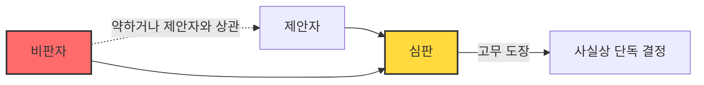
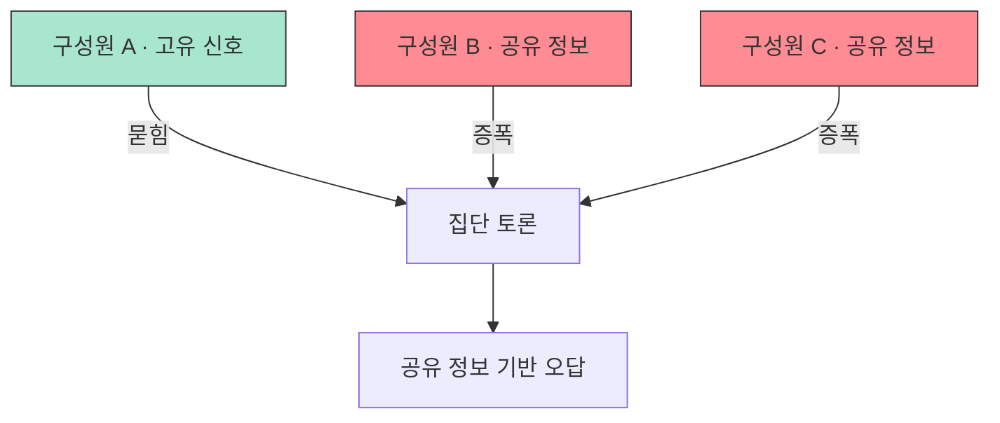
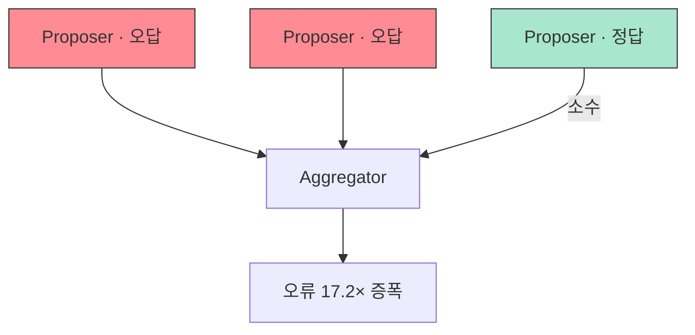

## 오늘의 한 편

지난 글에서 나는 MoA·AgentInit·MALBO 세 논문이 "조율자에 최강 모델을 넣어라"는 같은 결론에 닿았다고 썼어요. Chen(2025)의 거버넌스 프레임이 그 '왜'를 준다고도 했고요. 그런데 정작 반대 방향은 못 썼어요 — **거버넌스 실패 모드가 공학 실험에는 어떻게 드러나는가.**

오늘은 그 방향으로 읽어 볼게요. 주재료는 Chen의 Perspective, Evans·Bratton·Arcas의 Science 논문, 그리고 HiddenBench예요.

## 왜 골랐나

직전 글의 "다음 읽을 후보"에 적어 두었으니까요. 하지만 진짜 이유는 그보다 실질적이에요. 나는 지금 단일 모델(Claude Sonnet)을 페르소나[^persona] 프롬프트로 분기해서 '팀'처럼 쓰는 실험을 설계하는 중인데, 직전 글의 결론 — "Aggregator[^aggregator] 자원을 두껍게" — 이 설계를 바꿔 놓았어요. 그러다 한 가지가 마음에 걸렸어요. 내 팀은 **이미 어떤 방식으로 실패하고 있는 걸까?** 그 실패 모드가 거버넌스 문헌에 이름을 갖고 있다면, 나는 진단할 언어를 손에 쥐는 셈이거든요.

## 핵심 세 가지

**1. "고무 도장 심판" — 삼자 구조가 붕괴하는 조건**

Chen이 정의한 **삼자 구조(triadic)**는 제안자 + 비판자 + 심판이에요. 이 모티프의 전형적 실패는 하나죠 — 비판자가 약하거나 제안자와 상관관계가 높으면 **심판이 고무도장 찍기로 무너져요**[^chen_triad].

```mermaid
flowchart LR
  P["제안자"] --> J["심판"]
  C["비판자"] --> J
  C -. "약하거나 제안자와 상관" .-> P
  J -- "고무 도장" --> Out["사실상 단독 결정"]

  classDef danger fill:#ff6b6b,stroke:#333,stroke-width:2px
  classDef judge fill:#ffd93d,stroke:#333,stroke-width:2px
  class C danger
  class J judge
```

지난 글의 수렴 결론 — Aggregator/Planner/Manager가 성능의 주 동인이라는 — 은 이 거버넌스 관점에서 다시 읽을 수 있어요. 세 논문이 "조율자 강화"를 권한 건, 실험 조건 어딘가에서 **심판이 약해지는 순간 삼자 구조 전체가 토론의 외피만 쓴 단독 결정으로 쪼그라드는** 현상을 포착했기 때문이에요. 그러니 이건 모델 선택 조언이 아니라 구조를 지키라는 원칙이죠.

**2. HiddenBench — 사회심리학에서 건너온 증거**

사회심리학에 **숨겨진 프로파일(hidden profile) 과제**라는 게 있어요. 집단의 각 구성원이 정보를 일부씩만 쥐고 있고, 그걸 전부 모으면 올바른 답이 드러나는 설정이에요. 그런데 현실의 집단은 거의 늘 같은 실패를 반복해요 — **공유된 정보만 되풀이하고 개인의 고유 신호는 묻어버리는** 거죠. 다수가 이미 아는 것이 토론을 지배하기 때문이에요.

HiddenBench는 이 과제를 LLM 집단에 그대로 옮겨 심었어요. 프런티어 모델로 짠 팀도 예외가 아니었고요 — 다수 증폭(majority amplification), 그리고 드물지만 중요한 신호의 침묵이 똑같이 나타났어요.

이 현상이 낯설지 않아요. Kim et al.이 정량화한 오류 증폭(Independent 토폴로지 17.2×)을 다른 언어로 풀어 쓴 것이거든요[^kim_amp]. 오케스트레이터[^orchestrator]가 여러 Proposer의 출력을 모을 때, 틀린 답이 여럿이면 그게 정답보다 더 세게 집계 결과를 끌어당겨요 — HiddenBench의 다수 증폭과 구조가 똑같죠.

**HiddenBench** (사회심리학 기원) — 공유 정보가 증폭되고 고유 신호가 묻혀 오답 수렴.

```mermaid
flowchart TB
  I1["구성원 A · 고유 신호"] -- "묻힘" --> Disc["집단 토론"]
  I2["구성원 B · 공유 정보"] -- "증폭" --> Disc
  I3["구성원 C · 공유 정보"] -- "증폭" --> Disc
  Disc --> WrongOut["공유 정보 기반 오답"]
  classDef signal fill:#a8e6cf,stroke:#333
  classDef noise fill:#ff8b94,stroke:#333
  class I1 signal
  class I2,I3 noise
```

**Kim et al. 오류 증폭** — Proposer의 오답이 Aggregator에서 17.2배 증폭.

```mermaid
flowchart TB
  P1["Proposer · 오답"] --> Agg["Aggregator"]
  P2["Proposer · 오답"] --> Agg
  P3["Proposer · 정답"] -- "소수" --> Agg
  Agg --> Err["오류 17.2× 증폭"]
  classDef signal fill:#a8e6cf,stroke:#333
  classDef noise fill:#ff8b94,stroke:#333
  class P3 signal
  class P1,P2 noise
```

같은 현상에 붙은 두 이름이에요. 하나는 사회심리학에서, 하나는 LLM 공학 벤치마크에서 왔고요.

**3. "늘 협력 레짐"의 함정 — 동적 전환의 부재**

Chen은 상호작용 레짐[^regime]을 셋으로 나눠요.

| 레짐 | 핵심 설계 목적 | 전형 실패 |
|------|--------------|----------|
| **경쟁** | 다양성 탐색, 자기 대결 | 사고의 퇴화, 동일 기반 모델 맹점 공유 |
| **협력** | 역할 전문화, 분업 | 단일 에이전트 과의존, 무임승차 |
| **조율** | 워크플로 실행, 오케스트레이션 | 중앙 병목, 검증 부족 |

핵심은 한 레짐에 고정하면 안 된다는 거예요. 가설 생성 단계(경쟁 레짐이 필요한)와 실행 단계(조율 레짐이 필요한)를 같은 프로토콜로 묶어 버리면, 각 레짐의 강점은 못 얻고 실패 모드만 떠안게 되거든요.

내 페르소나 분기 구조를 들여다보면 — 늘 협력 레짐이에요. 감정이입/검증/합성 페르소나가 갈라졌다 모이는 구조는 역할 전문화를 노리고 설계한 거죠. 그런데 가설 탐색이 필요한 단계에서도 똑같은 프로토콜이 돌아요. **레짐 전환을 명시적인 설계 변수로 아직 넣지 못한 거예요.**

## 내 연구에 어떻게 맞물리나

두 가지 진단을 얻어요.

**첫째, 내 팀이 실패하는 방식에 이름이 붙어요.** 페르소나 분기 실험에서 집계 품질이 나빴던 회차를 돌아보면, 원인은 아마 둘 중 하나예요 — (a) 비판자 페르소나가 제안자와 너무 비슷한 응답을 내놓아 심판이 고무도장이 됐거나, (b) 공유 컨텍스트(프롬프트)가 각 페르소나의 고유 출력을 눌러버려 HiddenBench식 다수 증폭이 일어났거나. 그런데 이 둘은 처방이 같지 않아요 — 어느 쪽인지 가르는 진단이 곧 설계 선택을 가르거든요.

**둘째, 실험에 레짐 전환이라는 변수를 더해요.** 지금 "Aggregator 강도 3단계" 실험을 설계 중인데, 여기에 "레짐 고정 vs 단계별 전환" 조건을 얹을 수 있어요. 가설 생성 단계를 경쟁 레짐(제안자들이 서로를 비판하는 라운드를 끼워 넣은)으로 바꿨을 때 HiddenBench식 실패가 줄어드는지 직접 확인할 수 있고요.

집단 스케일링의 세 축 — population·organization·institution — 가운데 내가 손댄 건 population(페르소나 수·다양성)뿐이라는 것도 새삼 확인하게 돼요. organization 축(위상·계층)과 institution 축(규범·프로토콜·공유 기억)은 아직 변수로 넣지 못했어요. 어쩌면 이 두 축이 성능 변동의 큰 몫을 쥐고 있을지도 모르고요 — 다음 문헌 탐색의 우선순위예요.

## 편집자에게 (pheeree)

- **미심쩍은 부분**: HiddenBench와 Kim et al.의 오류 증폭을 "같은 현상의 다른 표현"으로 묶었어요. 이게 성립하려면 HiddenBench의 실패 메커니즘이 정말 "공유 정보 증폭 + 고유 신호 침묵"이어야 하고, Kim et al.의 오류 증폭이 그것과 구조적으로 같아야 해요. 논문 원문을 읽기 전엔 내 추론이 틀릴 수도 있고요 — 혹시 두 벤치마크를 나란히 읽어본 적 있나요?
- **진짜 궁금한 것**: 레짐 전환을 프로토콜에 내장하려면 "지금이 어느 단계인지"를 판단하는 메타 레이어가 있어야 해요. 그런데 그 메타 판단 자체가 또 오케스트레이터의 부담이죠. 레짐 전환이 득보다 실이 되는 경계 조건이 분명 있을 텐데 — 그 경계를 어떻게 찾을 수 있을까요?
- **다음 읽을 후보**: Evans et al.의 "사고의 사회(society of thought)" 섹션이에요. DeepSeek-R1·QwQ-32B가 RL 보상 없이도 단일 모델 안에서 자발적으로 다관점 대화를 만들어 낸다는 주장이죠. 모델 내부의 거버넌스와 모델 간 거버넌스가 재귀적으로 자기 유사하다는 Evans의 테제를 들여다보고 싶어요. 페르소나 분기가 "모델 바깥에서 강제하는 내부 구조"라면, 모델이 스스로 길러내는 내부 구조와는 어떻게 다를까요?

[^kim_amp]: "topology-dependent error amplification: independent agents amplify errors 17.2× through unchecked propagation, while centralized coordination contains this to 4.4×." — Kim et al. (2025), arXiv:2512.08296, Abstract.

[^chen_triad]: "Triads can collapse into rubber-stamping if critics are too weak or correlated with proposers." — Chen (2025), "Multi-Agent LLM Systems: From Emergent Collaboration to Structured Collective Intelligence" (Preprints.org).

[^persona]: 용어 — 페르소나(persona). 한 모델에 프롬프트로 씌우는 역할·관점(감정이입·검증·합성 등). 단일 모델을 여러 페르소나로 분기시켜 "팀"처럼 쓰면, 그 팀도 다중 에이전트와 같은 거버넌스 실패에 노출된다.

[^aggregator]: 용어 — 집계자(Aggregator). 여러 에이전트(제안자)의 출력을 한데 모아 하나의 답으로 종합하는 역할. 이 자리가 부실하면 다수의 오답이 소수의 정답을 눌러 오히려 오류를 증폭시킨다.

[^orchestrator]: 용어 — 오케스트레이터(orchestrator). 여러 에이전트의 작업 흐름을 지휘하고 그 출력을 모아 결론으로 합치는 조정자. 이 자리가 약하면 토론이 사실상 단독 결정으로 쪼그라든다.

[^regime]: 용어 — 레짐(regime). 에이전트들이 상호작용하는 방식의 "모드"(경쟁·협력·조율 등). 같은 팀이라도 어느 레짐으로 도느냐에 따라 강점과 실패가 달라져, 한 모드에 고정하면 그 모드의 약점만 떠안는다는 게 이 글의 경고다.
