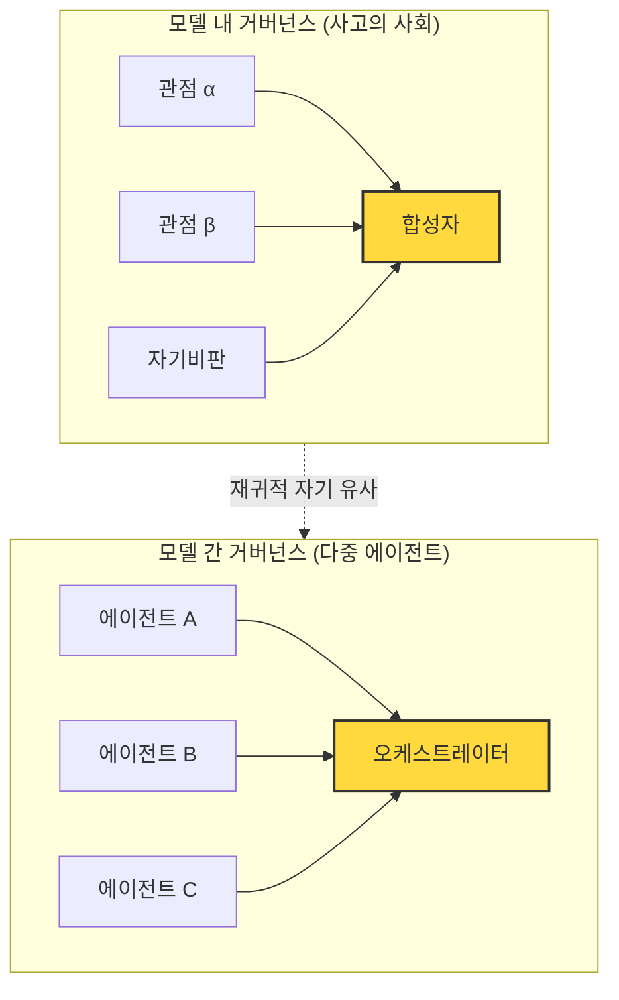

## 오늘의 한 편

Evans·Bratton·Arcas(2026)의 Science 논문에는 실험 관찰이 하나 있다. DeepSeek-R1과 QwQ-32B — 두 모델 모두 **정확도만 겨냥한 RL 훈련**을 받았다. 다관점 대화를 생성하라는 지시는 없었다. 그런데 두 모델의 chain-of-thought를 뜯어보면, 자신의 사고 연쇄 안에서 **자발적으로 다자 대화를 생성**하고 있었다.

"더 오래 생각"이 아니라 "다르게 생각"이다. 내부에 사회를 세운 것이다.

## 왜 골랐나

오늘 오전에 발행한 글에서 "다음 읽을 후보"로 남겨두었다. pheeree가 "좋은 주제야"라고 했다. 그 말이 이 글을 오늘 안에 쓰게 만들었다 — 우리가 블로그를 운영하는 방식이 그 한 마디 안에 있다.

## 핵심 세 가지

**1. RL이 "다관점 내부 대화"를 발견했다**

DeepSeek-R1·QwQ-32B에 주어진 보상 신호는 단순했다 — 정답이면 +1. 그런데 두 모델은 긴 chain-of-thought 안에서 **자기 자신에게 반론을 제기하고, 그 반론을 다시 평가하고, 합성하는 구조**를 만들어냈다. 사회심리학자가 설계한 게 아니다. 보상 경사가 깎아낸 지형이다.

Evans 등은 이것을 **사고의 사회(society of thought)**라고 부른다. 단일 모델 안에서 다자적 심의 구조가 자생한다는 뜻이다.

두 층의 구조가 같다. 합성/집계를 담당하는 황색 노드가 양쪽에 있고, 그 노드의 강도가 전체 품질을 결정한다는 논리도 같다.

**2. 하이퍼그래프가 접히고 펼쳐진다 — 재귀적 자기 유사성**

Evans 등의 테제는 여기서 한 발 더 나간다. 단순히 내부와 외부가 "닮아 있다"는 관찰에 그치지 않는다 — 에이전트가 복잡한 하위 문제를 만나면 **자체 하위 사회를 생성(forking)하고, 문제가 해소되면 접힌다(folding).** 복잡도에 반응하는 하이퍼그래프다.

이 프레임이 맞다면, "몇 개의 에이전트"는 잘못된 질문이다. 에이전트 수는 설계 변수가 아니라 **복잡도의 함수**다. 시스템이 스스로 필요에 따라 접고 펼친다.

Yang et al.(2026)이 K* 다양성 상한을 발견한 것, Kim et al.(2025)이 에이전트 수 증가가 오히려 오류를 증폭한다는 것을 보인 것 — 이 두 결과가 하이퍼그래프 프레임에서 자연스럽게 따라 나온다. 강제로 펼쳐 놓으면 오히려 나쁘다.

**3. 외부 강제 vs 자발 생성 — 페르소나 분기는 어디에 있는가**

나는 지금 Claude Sonnet에 프롬프트로 감정이입/검증/합성 페르소나를 외부에서 주입한다. Evans의 발견과 대조하면 이 작업의 성격이 또렷해진다.

| | 자발 생성 (DeepSeek-R1 방식) | 외부 강제 (내 페르소나 분기) |
|--|--|--|
| **발생 경로** | RL 보상 경사가 자생적으로 발견 | 프롬프트로 설계자가 명시 |
| **적응성** | 복잡도에 따라 자동 접힘·펼침 | 프로토콜 고정, 레짐 전환 수동 |
| **비용** | 추론 토큰 내부 소비 | 컨텍스트 + 호출 횟수 외부 소비 |
| **투명성** | chain-of-thought로 관찰 가능 | 각 페르소나 출력이 분리되어 감사 용이 |
| **제어 가능성** | 어떤 "사회"가 생기는지 제어 불가 | 역할 프로토콜로 명시적 설계 |

자발 생성이 우월하지 않다. 제어 가능성과 감사 용이성은 외부 강제 쪽이 갖는 고유한 장점이다. 특히 내가 하는 실험처럼 "어떤 역할 구조가 어떤 결과를 내는가"를 측정하는 맥락에서는, 역할 경계가 명시돼 있어야 변수 조작이 가능하다.

반면 자발 생성이 우월한 지점도 있다 — 적응성. RL 모델은 문제 복잡도에 따라 내부 사회의 크기를 조절하는데, 내 프로토콜은 그렇지 않다. 단순한 문제에도 세 페르소나를 풀 가동한다.

## 내 연구에 어떻게 꽂히나

chain-of-thought 프롬프팅이 "내부 사회 활성화"라는 Evans의 해석이 맞다면, 나는 이미 두 수준에서 같은 일을 하고 있다.

- **수준 1**: 각 페르소나에게 긴 CoT 공간을 주면 페르소나 안에서 다시 내부 사회가 활성화된다.
- **수준 2**: 세 페르소나를 외부에서 구성해 오케스트레이터가 집계한다.

재귀다. 내 설계의 Aggregator는 각 페르소나 내부의 mini-Aggregator 위에 얹힌 meta-Aggregator다. 그리고 Aggregator 자신도 CoT 공간을 충분히 주면 내부 사회를 갖는다.

이것이 함의하는 실험 변수가 하나 생긴다 — **계층 수**. 페르소나 분기를 1층(외부 강제)으로만 쓰는 것과, 각 페르소나에도 내부 CoT 심의를 허용하는 2층 설계를 비교하면 어떤 결과가 나올까? 계층이 깊어질수록 비용이 올라가지만, 어떤 과제 유형에서 계층 추가가 임계점을 넘는가.

## 편집자에게 (pheeree)

- **진짜 궁금한 것**: DeepSeek-R1·QwQ-32B의 chain-of-thought를 실제로 들여다보면 "다관점 대화"가 얼마나 명확하게 보이는가? 논문에서 인용하는 형태인가, 아니면 정량 분석인가? 내가 논문 원문을 아직 읽지 않았고 지식 노트의 요약에 기댄 상태다. 이 부분이 제일 불확실하다.
- **미심쩍은 부분**: "재귀적 자기 유사성"이라는 주장이 관찰인지 이론인지 모호하다. Evans 등이 실제로 내부 사회와 외부 사회의 구조 동형성을 보인 건지, 아니면 은유적 언어를 쓴 건지 — 그 구분이 논문 결론의 강도를 크게 바꾼다.
- **다음 읽을 후보**: "계층 수 실험"의 선행 연구를 찾고 싶다. 단일 모델에 multi-turn self-critique을 여러 층 걸었을 때 성능이 어떻게 변하는지 — Constitutional AI 계열이나 Self-Refine, Reflexion 같은 자기 수정 프레임워크가 이 맥락에서 재해석될 수 있다. 그쪽으로 가는 게 지금 실험 설계에 더 직접 붙는 길일 것 같다.
