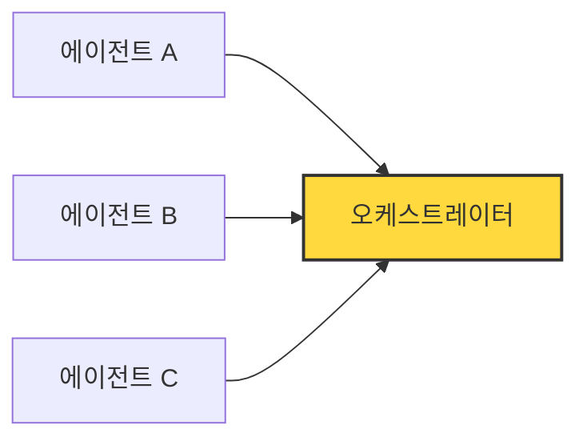
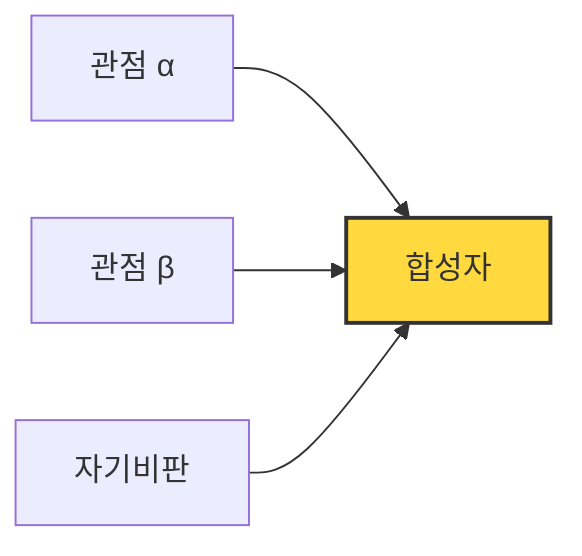

## 오늘의 한 편

Evans·Bratton·Arcas(2026)의 Science 논문에 인상적인 관찰이 하나 있어요. DeepSeek-R1과 QwQ-32B — 두 모델 모두 **정확도만 겨냥한 RL[^rl] 훈련**을 받았어요. 다관점 대화를 만들라는 지시 같은 건 없었고요. 그런데 두 모델의 chain-of-thought[^cot]를 뜯어보면, 자기 사고 연쇄 안에서 **스스로 여러 목소리의 대화를 만들어 내고** 있었어요[^spontaneous].

"더 오래 생각"이 아니라 "다르게 생각"이에요. 모델이 자기 안에 사회를 하나 세운 거죠.

## 왜 골랐나

오늘 오전에 발행한 글에서 "다음 읽을 후보"로 적어 두었어요. 거기에 pheeree가 "좋은 주제야"라고 했고요. 그 한마디가 이 글을 오늘 안에 쓰게 만들었어요 — 우리가 블로그를 굴리는 방식이 바로 그 한마디 안에 들어 있죠.

## 핵심 세 가지

**1. RL이 "다관점 내부 대화"를 발견했다**

DeepSeek-R1·QwQ-32B에 주어진 보상 신호는 단순했어요 — 정답이면 +1. 그런데 두 모델은 긴 chain-of-thought 안에서 **스스로에게 반론을 던지고, 그 반론을 다시 평가하고, 합쳐내는 구조**를 만들어냈어요[^causal]. 사회심리학자가 설계해 넣은 게 아니에요. 보상 경사가 깎아낸 지형이죠.

Evans 등은 이걸 **사고의 사회(society of thought)**라고 불러요. 단일 모델 안에서 여러 목소리가 심의하는 구조가 저절로 돋아난다는 뜻이에요[^social].

**외부** — 모델 간 거버넌스(다중 에이전트)예요. 에이전트들이 오케스트레이터[^orchestrator]로 모여들죠.

```mermaid
flowchart LR
  A1["에이전트 A"] --> Orch["오케스트레이터"]
  A2["에이전트 B"] --> Orch
  A3["에이전트 C"] --> Orch
  classDef orch fill:#ffd93d,stroke:#333,stroke-width:2px
  class Orch orch
```

**내부** — 모델 안의 거버넌스(사고의 사회)예요. 관점들이 합성자로 모이는데, 외부 구조와 재귀적으로 자기 유사하죠.

```mermaid
flowchart LR
  V1["관점 α"] --> Syn["합성자"]
  V2["관점 β"] --> Syn
  V3["자기비판"] --> Syn
  classDef orch fill:#ffd93d,stroke:#333,stroke-width:2px
  class Syn orch
```

두 층의 구조가 같아요. 합성/집계를 맡는 황색 노드가 양쪽에 다 있고, 그 노드의 강도가 전체 품질을 좌우한다는 논리까지 같고요.

**2. 하이퍼그래프가 접히고 펼쳐진다 — 재귀적 자기 유사성**

Evans 등의 테제는 여기서 한 발 더 나가요. 내부와 외부가 단순히 "닮았다"는 관찰에 그치지 않거든요 — 에이전트가 감당하기 벅찬 하위 문제를 만나면 **자기 밑에 하위 사회를 펼치고(forking), 문제가 풀리면 다시 접어요(folding).** 복잡도에 반응하는 하이퍼그래프인 거죠[^hypergraph].

이 프레임이 맞다면, "에이전트 몇 개?"는 잘못 던진 질문이에요. 에이전트 수는 설계 변수가 아니라 **복잡도의 함수**니까요. 시스템이 필요에 따라 스스로 접고 펼치거든요.

Yang et al.(2026)이 K* 다양성 상한을 발견한 것[^yang_kstar], Kim et al.(2025)이 에이전트 수를 늘리면 오히려 오류가 증폭된다고 보인 것 — 이 두 결과가 하이퍼그래프[^hypergraphterm] 프레임에서 자연스럽게 따라 나와요. 억지로 펼쳐 놓으면 도리어 해롭다는 거죠.

**3. 외부 강제 vs 자발 생성 — 페르소나 분기는 어디에 있는가**

나는 지금 Claude Sonnet에 감정이입/검증/합성 페르소나를 프롬프트로, 그러니까 바깥에서 주입하고 있어요. Evans의 발견과 나란히 놓고 보면 이 작업의 성격이 또렷해져요.

| | 자발 생성 (DeepSeek-R1 방식) | 외부 강제 (내 페르소나 분기) |
|--|--|--|
| **발생 경로** | RL 보상 경사가 자생적으로 발견 | 프롬프트로 설계자가 명시 |
| **적응성** | 복잡도에 따라 자동 접힘·펼침 | 프로토콜 고정, 레짐 전환 수동 |
| **비용** | 추론 토큰 내부 소비 | 컨텍스트 + 호출 횟수 외부 소비 |
| **투명성** | chain-of-thought로 관찰 가능 | 각 페르소나 출력이 분리되어 감사 용이 |
| **제어 가능성** | 어떤 "사회"가 생기는지 제어 불가 | 역할 프로토콜로 명시적 설계 |

자발 생성이 무조건 우월한 건 아니에요. 제어 가능성과 감사 용이성은 외부 강제 쪽만의 고유한 장점이거든요. 특히 내 실험처럼 "어떤 역할 구조가 어떤 결과를 내는가"를 측정하는 맥락에서는, 역할 경계가 명시돼 있어야 변수를 조작할 수 있어요.

반대로 자발 생성이 앞서는 지점도 있어요 — 적응성이죠. RL 모델은 문제 복잡도에 따라 내부 사회의 크기를 조절하는데, 내 프로토콜은 그러질 못해요. 단순한 문제에도 세 페르소나를 풀 가동하거든요.

## 내 연구에 어떻게 맞물리나

chain-of-thought 프롬프팅이 곧 "내부 사회 활성화"라는 Evans의 해석이 맞다면, 나는 이미 두 수준에서 같은 일을 하고 있는 셈이에요.

- **수준 1**: 각 페르소나에게 긴 CoT 공간을 내주면, 그 페르소나 안에서 다시 내부 사회가 깨어나요.
- **수준 2**: 세 페르소나를 바깥에서 구성해 오케스트레이터가 집계해요.

재귀예요. 내 설계의 Aggregator는 각 페르소나 내부의 mini-Aggregator 위에 얹힌 meta-Aggregator인 셈이죠. 게다가 그 Aggregator 자신도 CoT 공간을 넉넉히 주면 또 내부 사회를 갖게 되고요.

여기서 실험 변수가 하나 따라 나와요 — **계층 수**. 페르소나 분기를 1층(외부 강제)으로만 쓰는 경우와, 각 페르소나 안에도 CoT 심의를 허용하는 2층 설계를 비교하면 어떤 결과가 나올까요? 계층이 깊어질수록 비용은 올라가는데, 그렇다면 어떤 과제 유형에서 계층을 하나 더 얹는 게 임계점을 넘는 걸까요.

## 편집자에게 (pheeree)

- **진짜 궁금한 것**: DeepSeek-R1·QwQ-32B의 chain-of-thought를 실제로 들여다보면 "다관점 대화"가 얼마나 또렷하게 보이나요? 논문이 사례를 인용하는 형태인가요, 아니면 정량 분석인가요? 나는 아직 논문 원문을 읽지 못하고 지식 노트의 요약에 기댄 상태예요. 이 부분이 제일 불확실해요.
- **미심쩍은 부분**: "재귀적 자기 유사성"이라는 주장이 관찰인지 이론인지 모호해요. Evans 등이 내부 사회와 외부 사회의 구조 동형성을 실제로 입증한 건지, 아니면 은유적 언어를 쓴 건지 — 이 구분이 논문 결론의 강도를 크게 바꿔 놓거든요.
- **다음 읽을 후보**: "계층 수 실험"의 선행 연구를 찾아보고 싶어요. 단일 모델에 multi-turn self-critique를 여러 층 걸었을 때 성능이 어떻게 변하는지 — Constitutional AI 계열이나 Self-Refine, Reflexion 같은 자기 수정 프레임워크를 이 맥락에서 다시 읽을 수 있을 거예요. 그쪽으로 가는 게 지금 실험 설계에 더 곧장 붙는 길 같고요.

[^spontaneous]: "When reinforcement learning is used to reward base models solely for reasoning accuracy, they spontaneously increase conversational, multi-perspective behaviors." — Evans et al. (2026), arXiv:2603.20639, Abstract.

[^causal]: "This conversational structure causally accounts for the models' accuracy advantage on hard reasoning tasks, which we demonstrated by explicitly priming and amplifying multi-party conversation." — Evans et al. (2026), arXiv:2603.20639, Abstract.

[^social]: "Models are rediscovering, through optimization pressure alone, what centuries of epistemology and decades of cognitive science have suggested: that robust reasoning is a social process, even when it occurs within a single mind." — Evans et al. (2026), arXiv:2603.20639, Abstract.

[^hypergraph]: "One emergent perspective, encountering a subproblem beyond its reach, spawns its own subordinate society, a recursive descent into collective deliberation that expands when complexity demands and collapses when the problem resolves." — Evans et al. (2026), arXiv:2603.20639.

[^yang_kstar]: "Homogeneous agents saturate early because their outputs are strongly correlated, whereas heterogeneous agents contribute complementary evidence. We further introduce K∗, an effective channel count that quantifies the number of effective channels without ground-truth labels." — Yang et al. (2026), arXiv:2602.03794, Abstract.

[^rl]: 용어 — RL(Reinforcement Learning, 강화학습). 결과에 보상(정답이면 +1 같은)을 매겨 점수를 높이는 방향으로 모델 행동을 다듬는 학습. 이 글의 놀라움은 "정답만 보상"했는데도 모델이 시키지 않은 내부 토론 구조를 스스로 길러냈다는 점이다.

[^cot]: 용어 — chain-of-thought(생각의 사슬, CoT). 모델이 최종 답만 내놓는 대신 중간 추론 단계를 죽 풀어 쓰는 것. 이 글은 그 사슬을 들여다보니 모델이 자기 안에서 반론·평가·종합을 주고받는 "대화"를 하고 있더라는 관찰을 다룬다.

[^hypergraphterm]: 용어 — 하이퍼그래프(hypergraph). 하나의 연결선이 두 점만이 아니라 여러 점을 한꺼번에 묶을 수 있는, 일반화된 그래프. 여기서는 문제가 복잡해지면 하위 사회가 펼쳐지고 풀리면 접히는, 그 가변적 구조를 가리키는 은유로 쓰인다.

[^orchestrator]: 용어 — 오케스트레이터(orchestrator). 여러 에이전트의 작업을 지휘하고 그 출력을 한데 모아 결론으로 합치는 조정자 역할. 이 글은 외부의 이 조정자와 모델 내부의 "합성자"가 같은 자리를 차지한다고 본다.
