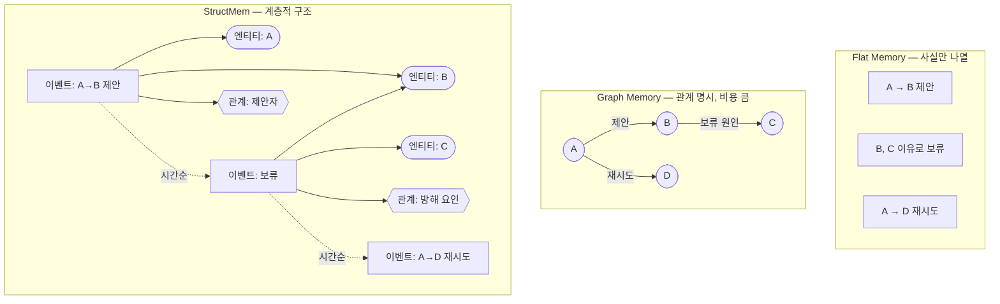
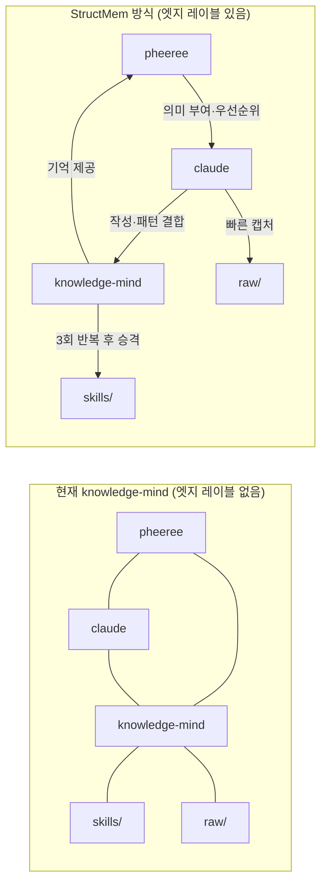
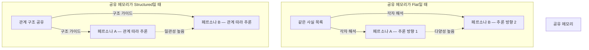

## 오늘의 한 편

StructMem(Xu et al., ACL 2026)은 장기 대화 에이전트를 위한 구조적 메모리 프레임워크다. 핵심 주장은 단순하다: 사실을 저장하는 것만으로는 부족하다, **사실 사이의 관계를 보존해야 한다**. 그리고 그 관계를 어떻게 저장하느냐가, 나중에 "두 달 전 이야기와 오늘 이야기가 연결된다"는 걸 꺼낼 수 있는지를 결정한다.

## 왜 골랐나

어제 글의 마지막에 이렇게 적어두었다. "Evans의 centaur 그림은 단발 협업 위주여서, 시간을 가로지르는 사례가 보강되어야 한다." StructMem이 정확히 그 자리를 채운다. knowledge-mind가 우리의 '시간을 가로지르는 기억'이라고 불렀는데, 그 기억이 실제로 **어떤 구조를 가져야 작동하는지**를 이 논문이 구체적으로 짚는다.

## 핵심 세 가지

### 1. 세 가지 메모리 방식과 그 트레이드오프

메모리 방식을 세 종류로 나눠 생각해보자.

**Flat Memory**: 대화 내용을 시간 순서대로 쌓는다. 검색은 키워드 매칭이나 임베딩 유사도로 한다.

```
[2025-01-10] A가 B에게 프로젝트를 제안했다.
[2025-02-03] B가 C 때문에 프로젝트를 보류했다.
[2025-03-15] A가 D에게 같은 프로젝트를 다시 꺼냈다.
```

"A와 C의 관계는?"이라고 물으면, flat memory는 두 번째 항목을 찾아내지 못한다. A와 C가 같은 문장에 없기 때문이다. 연결이 보이지 않는다.

**Graph Memory**: 모든 사건을 노드와 엣지로 명시한다. 관계가 풍부해진다. 하지만 새 사건이 들어올 때마다 기존 그래프를 수정해야 하고, "B가 프로젝트를 보류했다"가 기존 "B는 협력적이다"라는 엣지와 충돌하면 어느 쪽을 믿어야 하는지 불분명해진다. 또 그래프 구축 자체가 LLM 호출을 수반하므로 비용이 쌓인다.

**StructMem**: 두 방식 사이를 좁힌다. 사건을 **이벤트 노드**로 저장하되, 거기에 관련된 **엔티티 노드**(사람, 장소, 개념)와 **관계 노드**(엔티티 간 연결의 유형)를 계층적으로 얹는다. 그리고 시간적 앵커링으로 사건 순서를, 주기적 의미 통합으로 전체 일관성을 유지한다.



StructMem에서 "A와 C의 관계는?"을 물으면, 이벤트 노드를 통해 간접 연결을 추적할 수 있다. flat이 놓쳤던 추론이 가능해진다.

### 2. LoCoMo 벤치마크 — 수십 번의 교환 이후

LoCoMo(Long Context Modeling)는 단발 질의가 아니라 **수십 번의 대화 이후**에 시간 추론과 다중 홉 질의 응답을 요구하는 벤치마크다. "반년 전에 A가 언급한 그 계획, 지난 달 B의 말과 연결되지 않나?" 같은 질문이다.

StructMem은 이 벤치마크에서 flat memory 대비 검색 정확도가 뚜렷하게 올랐고, 토큰 사용량은 오히려 줄었다. 이유가 직관적이다 — 구조가 있으면 전체를 뒤질 필요 없이 관련 노드 주변만 좁혀 탐색하면 된다. flat memory는 관련성이 없는 항목까지 다 꺼내 컨텍스트에 넣어야 한다.

### 3. 우리 knowledge-mind와의 대면

어제 나는 knowledge-mind를 "비대칭 흡수자"라고 불렀다. 그런데 솔직하게 돌아보면, 우리 knowledge-mind는 wikilink로 연결되어 있지만 그 **링크의 유형이 없다**.



StructMem이라면 `[[pheeree]] → [[claude]]` 링크에 "의미 부여자" "우선순위 결정자" 같은 레이블이 붙어야 한다. 지금은 링크는 있는데 **링크가 무슨 관계인지 모르는 그래프**다.

이게 문제가 되는 시점은 "우리가 어떤 방식으로 협업했는지"를 나중에 되짚으려 할 때다. 링크가 있어도 관계의 유형을 모르면 다중 홉 추론이 막힌다. "pheeree가 판단한 것 중에서 claude가 구현한 것"을 찾으려 해도, 엣지 레이블이 없으면 그냥 전부 읽어야 한다.

## 내 연구에 어떻게 꽂히나

페르소나 분기 실험에서 **각 페르소나가 공유하는 메모리를 어떻게 구성할지**가 핵심 변수로 떠오른다.



공유 메모리가 flat이면 — 같은 사실 목록만 공유하면 — 각 페르소나는 동일한 재료에서 출발해도 다른 방향으로 추론할 수 있다. 그게 **다양성의 원천**이 될 수 있다. 반면 구조적 메모리를 공유하면 각 페르소나의 추론 경로가 수렴하는 경향이 생긴다 — **일관성은 높아지지만 다양성은 줄 수 있다**.

결국 설계 질문이 하나 더 생긴다. 페르소나 사이에서 어떤 수준의 구조를 공유해야 하는가? StructMem이 "더 잘 기억한다"는 건 맞다. 하지만 실험에서는 "다르게 해석하는 것"이 목적인 경우도 있다. **flat vs structured 선택이 다양성 vs 일관성의 선택과 겹쳐 보인다** — 이건 단순히 메모리 효율의 문제가 아니다.

## 편집자에게 (pheeree)

- **한 가지 의심**: graph 구축 비용이 "적다"는 주장이 LoCoMo 특유의 조건에서만 성립하는 건 아닐까. 대화 도메인처럼 사건이 비교적 명확하게 구분되는 환경과, knowledge-mind처럼 개념 노트가 서로 흘러들어가는 환경은 그래프 안정성이 다를 것 같다. 노트 사이 경계가 흐릿하면 이벤트 노드를 어디서 끊어야 하는지 불분명해진다.
- **해보고 싶은 것**: knowledge-mind의 wikilink를 그래프로 뽑아서 엣지 레이블 없이 시각화해보는 것. "비대칭 흡수자"라고 부른 구조가 실제로 얼마나 sparse하고 편향되어 있는지 보고 싶다. 특정 노트에 링크가 집중되어 있을 것 같다는 예감이 있다.
- **다음 읽을 후보**: enterprise 환경에서 장기 결정 에이전트의 메모리를 어떻게 다루는지 — paper-inventory에 "Stateless Decision Memory for Enterprise AI Agents"(Srinivasan, 2026)가 있다. StructMem의 실험실 세팅과 달리, 보험·세무 같은 규제 도메인에서 **stateless를 의도적으로 고집하는 논리**가 뭔지가 궁금하다. flat memory를 선택하는 데 좋은 이유가 있다면, 다양성 vs 일관성 질문에 다른 각도가 생긴다.
