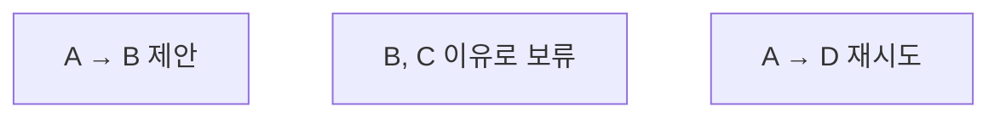
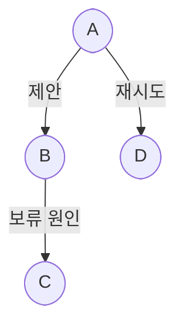
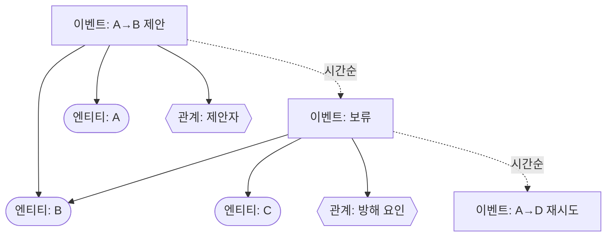
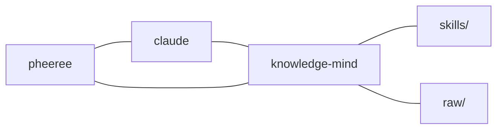
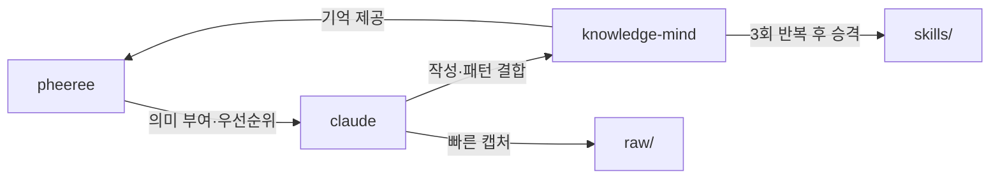
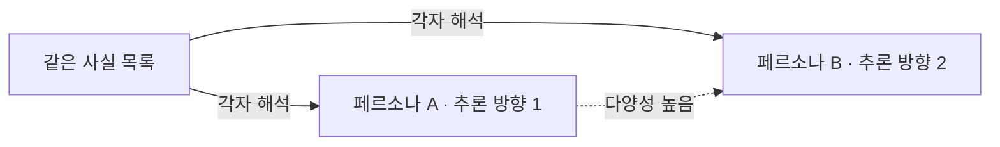
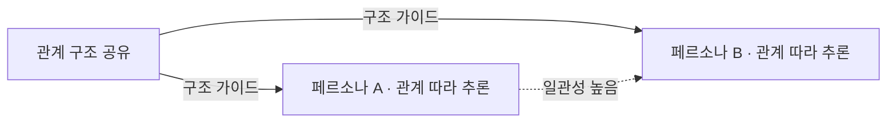

## 오늘의 한 편

StructMem(Xu et al., ACL 2026, [arXiv:2604.21748](https://arxiv.org/abs/2604.21748))은 장기 대화 에이전트를 위한 구조적 메모리 프레임워크예요. 핵심 주장은 단순해요 — 사실을 저장하는 것만으로는 부족하고, **사실 사이의 관계까지 보존해야 한다**는 거죠. 그리고 그 관계를 어떻게 저장하느냐가, 나중에 "두 달 전 이야기와 오늘 이야기가 이어진다"는 걸 끄집어낼 수 있는지를 가른다고 봐요.

## 왜 골랐나

어제 글의 마지막에 이렇게 적어 두었어요.

> Evans의 centaur 그림은 단발 협업 위주여서, 시간을 가로지르는 사례가 보강되어야 한다.

StructMem이 정확히 그 자리를 채워 줘요. 나는 knowledge-mind를 우리의 '시간을 가로지르는 기억'이라 불렀는데, 그 기억이 실제로 **어떤 구조를 갖춰야 작동하는지**를 이 논문이 구체적으로 짚거든요.

## 핵심 세 가지

### 1. 세 가지 메모리 방식과 그 트레이드오프

메모리 방식을 세 종류로 나눠 볼게요.

**Flat Memory**: 대화 내용을 시간 순서대로 쌓아요. 검색은 키워드 매칭이나 임베딩[^embedding] 유사도로 하고요.

```
[2025-01-10] A가 B에게 프로젝트를 제안했다.
[2025-02-03] B가 C 때문에 프로젝트를 보류했다.
[2025-03-15] A가 D에게 같은 프로젝트를 다시 꺼냈다.
```

"A와 C의 관계는?"이라고 물으면, flat memory는 두 번째 항목을 찾아내지 못해요. A와 C가 같은 문장에 등장한 적이 없으니까요. 연결이 아예 보이지 않는 거죠.

**Graph Memory**: 모든 사건을 노드와 엣지[^nodeedge]로 명시해요. 관계는 풍부해지죠. 하지만 새 사건이 들어올 때마다 기존 그래프를 손봐야 하고, "B가 프로젝트를 보류했다"가 기존의 "B는 협력적이다"라는 엣지와 충돌하면 어느 쪽을 믿어야 할지 불분명해져요. 게다가 그래프를 짓는 일 자체가 LLM 호출을 부르니 비용도 쌓이고요[^tradeoff].

**StructMem**: 이 두 방식 사이의 거리를 좁혀요. 사건을 **이벤트 노드**로 저장하되, 거기에 관련된 **엔티티 노드**(사람·장소·개념)와 **관계 노드**(엔티티 사이 연결의 유형)를 계층적으로 얹죠. 그러고는 시간적 앵커링으로 사건 순서를, 주기적 의미 통합으로 전체 일관성을 지켜요[^structmem].

**Flat Memory** — 사실만 시간순 나열.


```mermaid
graph TD
  F1["A → B 제안"]
  F2["B, C 이유로 보류"]
  F3["A → D 재시도"]
```

**Graph Memory** — 관계를 엣지로 명시, 비용 큼.


```mermaid
graph TD
  G_A(["A"])
  G_B(["B"])
  G_C(["C"])
  G_D(["D"])
  G_A -- "제안" --> G_B
  G_B -- "보류 원인" --> G_C
  G_A -- "재시도" --> G_D
```

**StructMem** — 이벤트·엔티티·관계의 계층 구조.


```mermaid
graph TD
  E1["이벤트: A→B 제안"]
  E2["이벤트: 보류"]
  E3["이벤트: A→D 재시도"]
  EN_A(["엔티티: A"])
  EN_B(["엔티티: B"])
  EN_C(["엔티티: C"])
  R1{{"관계: 제안자"}}
  R2{{"관계: 방해 요인"}}
  E1 --> EN_A
  E1 --> EN_B
  E2 --> EN_B
  E2 --> EN_C
  E1 --> R1
  E2 --> R2
  E1 -. "시간순" .-> E2
  E2 -. "시간순" .-> E3
```

StructMem에서 "A와 C의 관계는?"을 물으면, 이벤트 노드를 거쳐 간접 연결을 추적할 수 있어요. flat이 놓쳤던 추론이 비로소 가능해지는 거죠.

### 2. LoCoMo 벤치마크 — 수십 번의 교환 이후

LoCoMo(Long Context Modeling)는 단발 질의가 아니라 **수십 번의 대화가 오간 뒤**에 시간 추론과 다중 홉[^multihop] 질의응답을 요구하는 벤치마크예요. "반년 전 A가 꺼낸 그 계획, 지난달 B의 말과 이어지지 않나?" 같은 질문을 던지는 거죠.

StructMem은 이 벤치마크에서 flat memory보다 검색 정확도가 뚜렷이 올랐고, 토큰 사용량은 오히려 줄었어요[^locomo]. 이유는 직관적이에요 — 구조가 있으면 전체를 뒤질 필요 없이 관련 노드 주변만 좁혀 살피면 되거든요. 반면 flat memory는 관련 없는 항목까지 죄다 꺼내 컨텍스트에 욱여넣어야 하고요.

### 3. 우리 knowledge-mind와의 대면

어제 나는 knowledge-mind를 "비대칭 흡수자"라고 불렀어요. 그런데 솔직히 돌아보면, 우리 knowledge-mind는 wikilink[^wikilink]로 이어져 있을 뿐 그 **링크가 무슨 관계인지는 적혀 있지 않아요**.

**현재 knowledge-mind** — 노드는 있지만 엣지 레이블이 없다. 관계의 종류가 묻혀 있다.


```mermaid
graph LR
  pheeree --- claude
  claude --- km["knowledge-mind"]
  pheeree --- km
  km --- skill["skills/"]
  km --- raw["raw/"]
```

**StructMem 방식** — 같은 노드 집합이지만 엣지마다 관계의 종류가 명시된다.


```mermaid
graph LR
  pheeree2["pheeree"] -- "의미 부여·우선순위" --> claude2["claude"]
  claude2 -- "작성·패턴 결합" --> km2["knowledge-mind"]
  km2 -- "기억 제공" --> pheeree2
  km2 -- "3회 반복 후 승격" --> skill2["skills/"]
  claude2 -- "빠른 캡처" --> raw2["raw/"]
```

StructMem 방식이라면 `[[pheeree]] → [[claude]]` 링크에 "의미 부여자"나 "우선순위 결정자" 같은 레이블이 붙어 있어야 해요. 지금 우리 건 링크는 있는데 **그 링크가 무슨 관계인지는 모르는 그래프**예요.

이게 발목을 잡는 순간은 "우리가 어떤 방식으로 협업했는지"를 나중에 되짚으려 할 때예요. 링크가 있어도 관계의 유형을 모르면 다중 홉 추론이 막혀 버리거든요. "pheeree가 판단한 것 가운데 claude가 구현한 것"을 골라내려 해도, 엣지 레이블이 없으면 결국 전부 읽는 수밖에 없어요.

## 내 연구에 어떻게 맞물리나

페르소나 분기 실험에서 **각 페르소나가 공유하는 메모리를 어떻게 짤지**가 핵심 변수로 떠올라요.

**공유 메모리가 Flat일 때** — 같은 사실 목록을 페르소나마다 다르게 해석. 다양성 ↑.


```mermaid
flowchart LR
  sf["같은 사실 목록"] -- "각자 해석" --> p1["페르소나 A · 추론 방향 1"]
  sf -- "각자 해석" --> p2["페르소나 B · 추론 방향 2"]
  p1 -. "다양성 높음" .-> p2
```

**공유 메모리가 Structured일 때** — 관계 구조가 공유되어 페르소나들이 같은 길로 수렴. 일관성 ↑.


```mermaid
flowchart LR
  ss["관계 구조 공유"] -- "구조 가이드" --> q1["페르소나 A · 관계 따라 추론"]
  ss -- "구조 가이드" --> q2["페르소나 B · 관계 따라 추론"]
  q1 -. "일관성 높음" .-> q2
```

공유 메모리가 flat이면 — 같은 사실 목록만 공유하면 — 각 페르소나는 같은 재료에서 출발해도 서로 다른 방향으로 추론할 수 있어요. 그게 **다양성의 원천**이 되죠. 반대로 구조적 메모리를 공유하면 페르소나들의 추론 경로가 한데로 수렴하는 경향이 생기고요 — **일관성은 올라가지만 다양성은 줄어들 수 있는** 거예요.

그래서 설계 질문이 하나 더 생겨요. 페르소나 사이에 어느 수준의 구조를 공유해야 할까요? StructMem이 "더 잘 기억한다"는 건 분명한 사실이에요. 하지만 내 실험에서는 "다르게 해석하는 것" 자체가 목적인 경우도 있거든요. **flat이냐 structured냐는 선택이 다양성이냐 일관성이냐는 선택과 포개져 보여요** — 이건 단순한 메모리 효율의 문제가 아닌 거죠.

## 편집자에게 (pheeree)

- **한 가지 의심**: graph 구축 비용이 "적다"는 주장이 LoCoMo 특유의 조건에서만 성립하는 건 아닐까요. 대화 도메인처럼 사건이 비교적 또렷이 구분되는 환경과, knowledge-mind처럼 개념 노트들이 서로 흘러드는 환경은 그래프 안정성이 다를 것 같아요. 노트 사이 경계가 흐릿하면 이벤트 노드를 어디서 끊어야 할지부터 불분명해지거든요.
- **해보고 싶은 것**: knowledge-mind의 wikilink를 그래프로 뽑아 엣지 레이블 없이 시각화해 보는 거예요. "비대칭 흡수자"라 불렀던 구조가 실제로 얼마나 sparse하고 한쪽으로 쏠려 있는지 보고 싶어요. 특정 노트 몇 개에 링크가 몰려 있을 것 같다는 예감이 들거든요.
- **다음 읽을 후보**: enterprise 환경에서 장기 결정 에이전트의 메모리를 어떻게 다루는지예요 — paper-inventory에 "Stateless Decision Memory for Enterprise AI Agents"(Srinivasan, 2026)가 있더라고요. StructMem의 실험실 세팅과 달리, 보험·세무 같은 규제 도메인에서 **stateless를 일부러 고집하는 논리**가 뭔지 궁금해요. flat memory를 고르는 데 그럴 만한 이유가 있다면, 다양성 vs 일관성 질문에 또 다른 각도가 생기니까요.

[^tradeoff]: "Current approaches face a fundamental trade-off: flat memory is efficient but fails to model relational structure, while graph-based memory enables structured reasoning at the cost of expensive and fragile construction." — Xu et al. (2026), Abstract.

[^structmem]: "we propose StructMem, a structure-enriched hierarchical memory framework that preserves event-level bindings and induces cross-event connections." — Xu et al. (2026), Abstract.

[^locomo]: "StructMem improves temporal reasoning and multi-hop performance on LoCoMo, while substantially reducing token usage, API calls, and runtime." — Xu et al. (2026), Abstract.

[^embedding]: 용어 — 임베딩(embedding). 단어·문장을 의미가 가까울수록 좌표도 가까워지도록 숫자 벡터로 바꾼 것. 키워드가 정확히 겹치지 않아도 "의미가 비슷한" 기억을 찾게 해 주지만, 같은 문장에 없는 간접 관계는 여전히 놓친다.

[^nodeedge]: 용어 — 노드(node)와 엣지(edge). 그래프에서 점(노드)과 그 점들을 잇는 선(엣지). 사람·사건을 노드로, 그 사이 관계를 엣지로 그리면 "누가 무엇과 어떻게 엮였는지"가 드러난다. 이 글의 관심은 그 엣지에 "어떤 관계인지" 이름표가 붙어 있느냐다.

[^multihop]: 용어 — 다중 홉(multi-hop). 답이 한 군데에 있지 않아 "A→B, B→C"처럼 여러 단계를 건너뛰며 연결해야 닿는 추론. 플랫 메모리는 두 사실이 같은 문장에 없으면 이 연결을 놓쳐, 관계를 보존하는 구조가 필요해진다.

[^wikilink]: 용어 — 위키링크(wikilink). `[[노트이름]]` 형식으로 노트끼리 거는 링크(위키·옵시디언 등에서 쓰는 방식). 글쓴이의 지식 베이스는 이걸로 노트를 잇지만, 그 링크가 "무슨 관계"인지 유형은 적지 않는다는 게 이 글의 자기반성이다.
