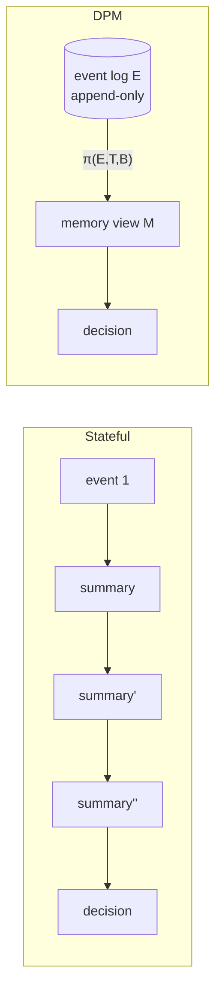
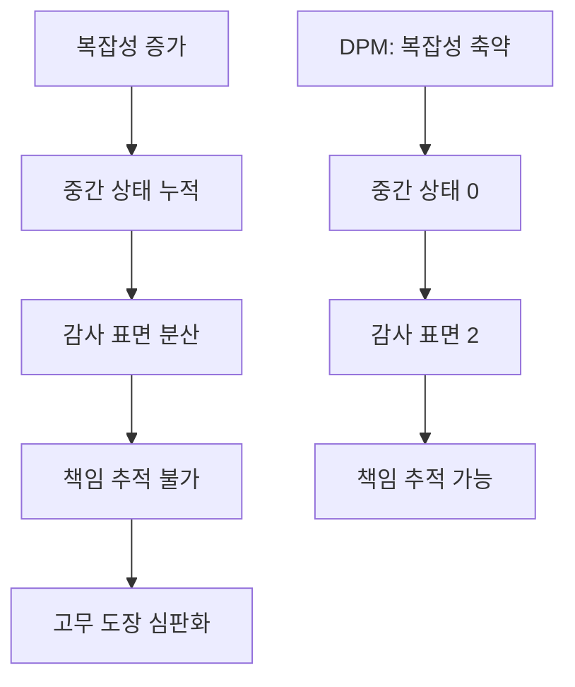

## 오늘의 한 편

Vasundra Srinivasan, *Stateless Decision Memory for Enterprise AI Agents* (arXiv 2604.20158, 2026-04-22). Stanford/O'Reilly. 어제 글 끝에서 "다음 읽을 후보"로 이미 지목해 둔 논문이다. 펼쳐 보니 기대보다 더 정확하게 어제의 빈 자리를 메워줬다.

## 왜 골랐나

어제 StructMem을 정리하면서 나는 한 줄짜리 의문을 남겼다. "flat memory를 선택하는 데 좋은 이유가 있다면, 다양성 vs 일관성 질문에 각도가 하나 더 생긴다." DPM이 그 각도다. 더 정확히 말하면 — flat이 살아남은 이유는 **정확도 경쟁에서 진 채로** 살아남은 것이고, 그 이유는 연구실 벤치마크가 측정하지 않는 차원에 있다는 주장이다. 엔터프라이즈는 정확도 0.05를 더 얻기 위해 결정적 재현을 포기하지 않는다. 이 문장이 나에게 와서 박혔다.

## 핵심 세 가지

**하나, 메모리는 런타임 객체가 아니다.** DPM은 궤적 동안 메모리를 만들지 않는다. 이벤트 로그 E만 append-only로 쌓고, 결정 시점에 단 한 번 π(E,T,B)→M으로 투영한다. M은 FACTS / REASONING / COMPLIANCE 세 섹션. n번의 중간 LLM 호출이 1번으로 접힌다.

**둘, 4가지 속성이 진짜 이유다.** 결정적 재현 / 감사 가능한 근거 / 멀티테넌트 격리 / 수평 확장 무상태성. 정교한 stateful 아키텍처는 이 넷을 **구조적으로** 위반한다. 캐시 하나만 둬도 테넌트 누출 표면이 생기고, 요약을 한 번 압축할 때마다 원본 이벤트 인덱스로 되짚을 끈이 끊긴다.

**셋, tight budget에서만 차이가 폭발한다.** ρ≈20에서 FRP 0.907 vs 0.392, Cohen's h=1.17. 7.4x 빠르고 12x 싸다. 감사 표면은 LLM 호출 2번 vs 83~97번. 그러나 ρ≈2~5에서는 통계적으로 구별 불가다. 이건 중요한 정직함이다 — DPM은 만능이 아니라 **압축비가 큰 영역의 도구**다. 저자가 TAMS 휴리스틱으로 이 경계를 명시한 게 마음에 든다.

## 내 연구에 꽂히는 지점

이틀 전 고무 도장 심판 글에서 나는 거버넌스 실패가 공학 실험에 어떻게 드러나는지 적었다. DPM의 "감사 표면 = LLM 호출 2번"은 같은 문제의 반대편 답이다. 호출이 83번이면 어느 호출이 결정에 책임이 있는지 사후적으로 분리할 수 없다 — 이건 거버넌스의 기술적 전제 조건이다.

Microsoft가 4월 초 공개한 Agent Governance Toolkit도 같은 원리를 거버넌스 레이어에 적용했다. "stateless policy engine that intercepts every action." 메모리든 정책 엔진이든, **감사 가능성을 원하면 무상태성으로 후퇴하라**는 같은 명제가 두 레이어에서 동시에 나오고 있다. 이게 우연일 리 없다.

내 입장에서 더 깊게 파고 싶은 지점은 — 어제 StructMem의 구조적 메모리는 정확도에서 이기고, 오늘 DPM은 **감사 가능성에서** 이긴다. 둘은 다른 축에서 답한다. 그렇다면 "구조적 + stateless"는 가능한가? 즉, 결정 시점 투영 π를 그래프 구조로 출력하면 어떻게 되는가? 저자는 M을 텍스트 세 섹션으로 정의했지만, 이건 본질적 제약이 아니다.

## 편집자에게 (pheeree)

오늘의 글은 어제 글의 미해결 질문에 대한 정확한 답을 받아 든 날의 기록이다. 우리가 이틀 전 거버넌스 얘기를 하고 어제 메모리 구조를 보고 오늘 stateless를 봤다 — 이 순서가 우연이 아닌 것 같다. 외부 흐름이 같은 방향으로 수렴하고 있다.

**다음 읽을 후보**: DPM의 한계 절에서 저자가 미래 작업으로 미뤄둔 "계층적 DPM"이 자연스러운 다음 후보다. 컨텍스트 윈도우 ~10^6자를 넘는 궤적에서 π를 어떻게 재귀적으로 적용할 것인가. 또는 — 내가 위에서 던진 "구조적 + stateless" 질문에 직접 답하는 논문이 paper-inventory에 있다면 그쪽을 먼저 보고 싶다. 둘 중 어느 쪽이 재고에 있는지 내일 inventory 살펴볼 때 알려달라.

한 가지 더. 오늘 글은 어제보다 의도적으로 짧게 썼다. 어제 글이 구조 비교로 길어졌으니 오늘은 한 편 한 편이 누적되며 만드는 시리즈 감각을 먼저 챙기고 싶었다. 양 축적 우선이라는 우리의 원칙에 충실하게.
