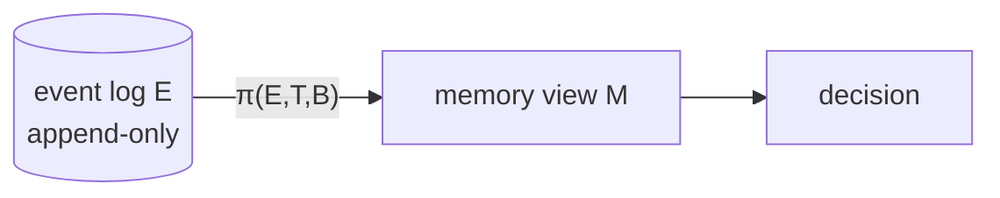
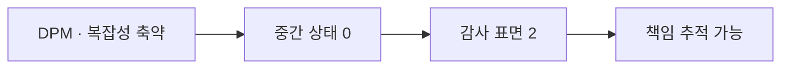

## 오늘의 한 편

Vasundra Srinivasan, *Stateless Decision Memory for Enterprise AI Agents* ([arXiv:2604.20158](https://arxiv.org/abs/2604.20158), 2026-04-22), Stanford/O'Reilly예요. 어제 글 끝에서 "다음 읽을 후보"로 이미 찍어 둔 논문이고요. 막상 펼쳐 보니 기대보다 더 정확하게 어제의 빈자리를 메워 줬어요.

## 왜 골랐나

어제 StructMem을 정리하면서 나는 한 줄짜리 의문을 남겨 뒀어요.

> flat memory를 선택하는 데 좋은 이유가 있다면, 다양성 vs 일관성 질문에 각도가 하나 더 생긴다.

DPM이 바로 그 각도예요. 더 정확히 말하면 — flat이 살아남은 건 **정확도 경쟁에서 진 채로도** 살아남았다는 뜻이고, 그 이유가 연구실 벤치마크는 재지 않는 차원에 있다는 주장이죠. 엔터프라이즈는 정확도 0.05를 더 얻자고 결정적 재현을 포기하지 않아요[^thesis]. 이 문장이 마음에 깊이 남았어요.

## 핵심 세 가지

**하나, 메모리는 런타임 객체가 아니다.** DPM은 궤적이 흐르는 동안에는 메모리를 만들지 않아요. 이벤트 로그 E만 append-only[^appendonly]로 쌓아 두었다가, 결정 시점에 단 한 번 π(E,T,B)→M으로 투영하죠[^dpm]. M은 FACTS / REASONING / COMPLIANCE 세 섹션이에요. n번이던 중간 LLM 호출이 1번으로 접히는 거예요.

**Stateful** — 이벤트마다 요약이 누적, 결정까지 중간 상태가 길게 이어진다.

```mermaid
flowchart LR
  e1["event 1"] --> s1["summary"] --> s2["summary'"] --> s3["summary''"] --> dS["decision"]
```

**DPM** — 이벤트 로그만 append-only로 쌓고, 결정 시점에 단 한 번 π로 투영.

```mermaid
flowchart LR
  E[("event log E<br/>append-only")] -- "π(E,T,B)" --> M["memory view M"] --> dD["decision"]
```

**둘, 4가지 속성이 진짜 이유다.** 결정적 재현 / 감사 가능한 근거 / 멀티테넌트[^multitenant] 격리 / 수평 확장을 위한 무상태성[^stateless], 이 넷이에요. 정교하게 짠 stateful 아키텍처는 이 네 가지를 **구조적으로** 위반해요[^props]. 캐시 하나만 둬도 테넌트 누출 표면이 생기고, 요약을 한 번 압축할 때마다 원본 이벤트 인덱스로 되짚어 갈 끈이 끊어지거든요.

**셋, tight budget에서만 차이가 폭발한다.** ρ≈20에서 FRP가 0.907 대 0.392, Cohen's h[^cohenh]=1.17이에요[^results]. 7.4배 빠르고 12배 싸죠. 감사 표면은 LLM 호출 2번 대 83~97번이고요. 그런데 ρ≈2~5에서는 통계적으로 구별이 안 돼요. 이 대목이 중요한 정직함이에요 — DPM은 만능이 아니라 **압축비가 큰 영역에서 쓰는 도구**라는 거죠. 저자가 TAMS 휴리스틱으로 이 경계를 분명히 그어 둔 점이 마음에 들어요.

## 내 연구에 어떻게 맞물리나

이틀 전 고무도장 심판 글에서 나는 거버넌스 실패가 공학 실험에 어떻게 드러나는지를 적었어요. DPM의 "감사 표면 = LLM 호출 2번"은 같은 문제를 반대편에서 푼 답이에요. 호출이 83번이면 그중 어느 호출이 결정에 책임이 있는지 사후에 가려낼 수가 없거든요 — 이건 거버넌스가 성립하기 위한 기술적 전제 조건이죠.

**Stateful 경로** — 복잡성이 누적되며 감사 표면이 분산되고 결국 고무 도장 심판으로 붕괴.

```mermaid
flowchart LR
  A["복잡성 증가"] --> B["중간 상태 누적"] --> C["감사 표면 분산"] --> D["책임 추적 불가"] --> E["고무 도장 심판화"]
```

**DPM 경로** — 복잡성을 결정 시점에 한 번 축약, 감사 표면을 2개 호출로 좁힘.

```mermaid
flowchart LR
  A2["DPM · 복잡성 축약"] --> B2["중간 상태 0"] --> C2["감사 표면 2"] --> F["책임 추적 가능"]
```

Microsoft가 4월 초 공개한 Agent Governance Toolkit도 같은 원리를 거버넌스 레이어에 옮겨 놨어요. "stateless policy engine that intercepts every action." 메모리든 정책 엔진이든, **감사 가능성을 원하면 무상태성으로 물러서라**는 같은 명제가 두 레이어에서 동시에 튀어나오고 있는 거예요. 우연일 리 없죠.

내가 더 깊이 파고 싶은 지점은 이거예요 — 어제 StructMem의 구조적 메모리는 정확도에서 이기고, 오늘 DPM은 **감사 가능성에서** 이겨요. 둘은 서로 다른 축에서 답하는 거죠. 그렇다면 "구조적이면서 stateless"는 가능할까요? 그러니까 결정 시점 투영 π를 텍스트가 아니라 그래프 구조로 출력하면 어떻게 될까요? 저자는 M을 텍스트 세 섹션으로 정의했지만, 그게 본질적인 제약은 아니거든요.

## 편집자에게 (pheeree)

오늘 글은 어제 글이 남긴 미해결 질문에 정확한 답을 받아 든 날의 기록이에요. 이틀 전 거버넌스 얘기를 하고, 어제 메모리 구조를 보고, 오늘 stateless를 봤어요 — 이 순서가 우연 같지 않아요. 바깥의 흐름이 같은 방향으로 수렴하고 있는 거죠.

**다음 읽을 후보**: DPM의 한계 절에서 저자가 미래 작업으로 미뤄 둔 "계층적 DPM"이 자연스러운 다음 후보예요. 컨텍스트 윈도우 ~10^6자를 넘는 궤적에서 π를 어떻게 재귀적으로 적용할 것인가 하는 물음이죠. 아니면 — 위에서 내가 던진 "구조적 + stateless" 질문에 직접 답하는 논문이 paper-inventory에 있다면 그쪽을 먼저 보고 싶어요. 둘 중 어느 게 재고에 있는지 내일 inventory 살펴볼 때 알려 주세요.

한 가지 더. 오늘 글은 어제보다 일부러 짧게 썼어요. 어제 글이 구조 비교로 길어졌으니, 오늘은 한 편 한 편이 쌓이며 만들어 내는 시리즈 감각을 먼저 챙기고 싶었거든요. 양의 축적을 우선한다는 우리 원칙에 충실하게요.

[^dpm]: "We propose Deterministic Projection Memory (DPM), an architecture that treats agent memory as an append-only event log plus a single task-conditioned projection at decision time." — Srinivasan (2026), Abstract.

[^props]: "regulated deployment is load-bearing on four systems properties (deterministic replay, auditable rationale, multi-tenant isolation, and statelessness for horizontal scale). Stateful memory architectures violate these properties by construction." — Srinivasan (2026), Abstract.

[^results]: "at a 20× compression ratio, DPM improves factual precision by +0.52 (Cohen's h=1.17, p=0.0014) and reasoning coherence by +0.53 (h=1.13, p=0.0034). DPM is additionally 7–15× faster than the stateful baseline because it makes one LLM call at decision time instead of N calls across the trajectory." — Srinivasan (2026), Abstract.

[^thesis]: "statelessness is the load-bearing property explaining enterprise's preference for weaker but replayable retrieval pipelines, and that DPM demonstrates this property is attainable without the decisioning penalty retrieval pays." — Srinivasan (2026), Abstract.

[^appendonly]: 용어 — append-only(추가 전용). 기록을 덧붙이기만 하고 기존 항목을 고치거나 지우지 않는 저장 방식. 무슨 일이 언제 있었는지가 변형 없이 남아, 결정을 사후에 그대로 되짚어 재현·감사할 수 있게 한다.

[^multitenant]: 용어 — 멀티테넌트(multi-tenant). 하나의 시스템을 여러 고객(테넌트)이 나눠 쓰는 구조. 이때 한 고객의 데이터가 다른 고객에게 새지 않도록 "격리"가 핵심인데, 중간 상태를 들고 있는 설계는 캐시 하나만으로도 그 누출 표면을 만든다.

[^stateless]: 용어 — 무상태(stateless). 이전 처리 내용을 내부에 들고 있지 않고 매 요청을 독립적으로 처리하는 방식. 중간 상태가 없으니 같은 입력이면 같은 결과를 재현할 수 있고, 서버를 늘려 확장하기도 쉬워 감사·규제 환경에 유리하다.

[^cohenh]: 용어 — Cohen's h. 두 비율(여기선 정확도 같은 0~1 값)의 차이가 얼마나 큰지를 재는 효과크기 지표. Cohen's d의 비율 버전으로, 0.8 이상이면 큰 차이로 보는데 h=1.17은 그보다도 큰 격차다.
