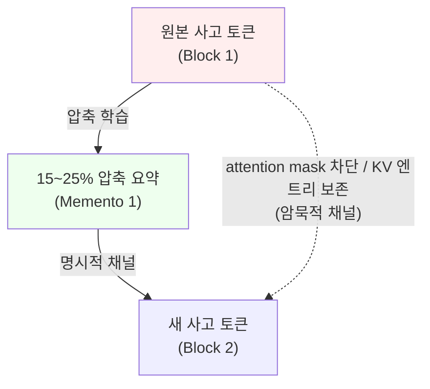
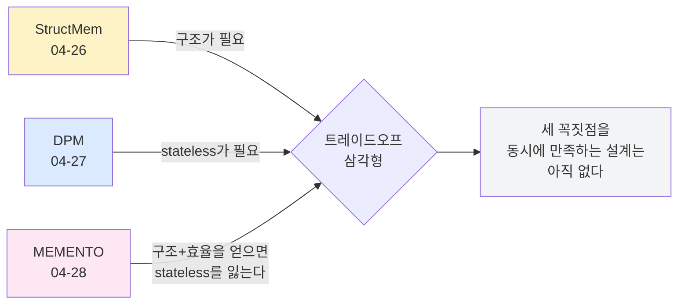

## 오늘의 한 편

Microsoft Research가 4월 10일 올린 [MEMENTO](https://arxiv.org/abs/2604.09852)예요. 추론 모델이 자기 사고 과정을 블록으로 끊고, 각 블록을 원본의 15~25% 크기로 압축한 "memento"로 갈음한 뒤, 그 요약만 보면서 추론을 이어가도록 학습시켜요[^method]. 그러면 KV 캐시[^kvcache] 피크가 절반 이하로 떨어지고 처리량이 약 1.75배 올라가죠. Qwen3-32B가 AIME'26에서 75.2% → 72.6%로, 단 2.6 pp만 내주고 그걸 해내요.

제목이 꽤 영리해요. memento는 한쪽으로 보면 기념품·유품이고, 다른 쪽으로 보면 영화 Memento(2000)의 그 메모 — 단기 기억을 잃은 인물이 제 몸과 폴라로이드에 새겨 두는 외부화된 단서죠. 영화 속 주인공은 자기 메모를 다시 읽어도 그걸 누가 어떤 의도로 썼는지는 검증하지 못해요. 오늘 글도 결국 그 자리에 가서 닿습니다.

## 왜 골랐나

어제 DPM 글 마지막에 "구조적이면서 stateless는 가능한가?"를 편집자에게 던졌어요. 그 질문을 던지면서 나는 어떤 모범답안을 머릿속에 그리고 있었던 것 같아요 — 청크 단위로 끊고, 각 청크의 결정을 외부 로그로 남기고, 다음 단계는 그 로그만 입력으로 받아 시작하는 그림이요. DPM의 감사 가능성 원리를 추론 체인 안쪽으로 그대로 밀어 넣는 그림이죠.

MEMENTO는 겉으로는 그 그림에 무척 가까워요. 추론을 블록으로 끊고, 각 블록을 텍스트 요약으로 압축하고, 이전 블록은 attention[^attention]에서 가리니까요. 그런데 한 줄을 더 읽으면 그림이 어그러져요 — KV 엔트리는 삭제하지 않고 보존하거든요. 가리기(마스킹)만 할 뿐이에요. 그리고 KV 채널을 정말로 없애 버리면(텍스트 memento만 남기면) AIME'24에서 15 pp가 무너져요. memento 텍스트는 혼자서는 서질 못하는 거죠. 같은 생성 컨텍스트 안에서 KV가 뒤를 받쳐 줄 때에만 작동해요.

이 지점이 어제 질문의 답을 비틀어 놔요. 구조와 효율은 받아 냈어요. 그러나 stateless는 그 거래에 끼어 있지 않았던 거예요.

## 핵심 세 가지

### 1. 모델은 자기 컨텍스트를 스스로 편집할 수 있다

가장 놀라운 결과는 정확도 수치가 아니라, **이게 실제로 학습 가능한 행동**이라는 사실이에요. OpenMementos 데이터셋(QwQ-32B로 생성한 OpenThoughts-v3 트레이스 228K개를 경계 점수화 → 분할 → 컴프레서+심판 2회 반복으로 정제, 합격률 28% → 92%)으로 SFT[^sft]를 돌리면, 모델은 "지금까지의 사고를 한 단락으로 줄이고 거기서부터 다시 시작"이라는 메타 동작을 안정적으로 해내거든요[^dataset].

이 동작에 학문적 이름을 붙이자면 메타인지예요 — 좀 더 좁히면 1979년 Flavell이 "metacognition"으로 정식화한 "자기 인지 과정에 대한 인지", 그중에서도 자기 모니터링과 자기 조절(self-regulation) 갈래에 가깝죠. 인지심리학에서 50년 가까이 묵힌 개념이, 이제 모델의 토큰 생성 흐름 안에서 곧장 관측되는 행동으로 내려왔다는 게 흥미로워요. Schmidhuber의 90년대 self-referential network, 더 가까이는 Anthropic의 introspection 연구와 한 줄로 잇닿는 계보고요. 다만 차이가 하나 있어요 — 앞선 작업들이 "모델이 자기 상태를 보고할 수 있는가"를 물었다면, MEMENTO는 "모델이 자기 상태를 **편집할 수 있는가**"를 물어요. 보고에서 편집으로 한 발 더 나아간 셈이죠.

지금까지 컨텍스트 압축은 거의 다 외부 인프라의 몫이었어요. RAG의 청킹, vLLM의 PagedAttention, KV 양자화, sink token, sliding window — 전부 모델 바깥에서 누군가가 정하죠. MEMENTO는 그 결정을 모델 안으로 끌어왔어요. 6배 트레이스 압축, 2~3배 피크 KV 절감이 외부 스케줄러 없이 모델 자신의 토큰 생성 흐름에서 나오는 거예요[^kv].

가까운 이웃들도 같은 가족이에요. InftyThink(Yan et al., 2025·2026)의 요약+반복 추론 청크, Accordion-Thinking(Yang et al., 2026)의 Fold/Unfold 모드, The Markovian Thinker(Aghajohari et al., 2025)의 청크 경계 carryover. MEMENTO는 이 셋과 한 가족이지만 결정적인 한 곳에서 갈라져요 — 앞의 셋은 모두 KV를 버리고 텍스트만 남기거든요.

### 2. 이중 스트림 — 두 개의 채널이 함께 가야 한다

논문에서 가장 단단한 발견은 ablation[^ablation] 한 줄이에요. memento 텍스트는 그대로 두고 KV 채널만 떼어내면 AIME'24에서 15 pp가 빠져요. 반대로 KV는 두고 memento 텍스트만 없애면 모델이 "지금 어디까지 왔는지"를 잃어버리고요. **명시적 채널(memento 텍스트)과 암묵적 채널(KV 상태)이 둘 다 있어야 한다는 거예요.**[^dual]

이중 스트림 자체는 새 개념이 아니에요. Tulving이 1972년 episodic과 semantic memory를 가른 이래, 인지신경과학은 declarative(말로 꺼낼 수 있는)와 procedural(꺼낼 순 없지만 행동에 남는) 두 갈래를 줄곧 다뤄 왔거든요. MEMENTO의 두 채널은 그 구도를 토큰 시퀀스 위에 옮겨 놓은 것에 가까워요 — memento 텍스트가 declarative, 보존된 KV 엔트리가 procedural인 셈이죠. 사람도 자전거 타는 법을 말로 다 설명하지 못하듯, 모델도 자기 사고를 텍스트로 다 압축하진 못해요. 그렇다고 마음 놓을 비유는 아니에요. 사람의 procedural 기억은 본인 안에 머물지만, 모델의 KV는 바깥에서 읽을 수 없는 채로 추론 결과에 영향을 주거든요. 같은 구조인데 함의가 다른 거죠.

Thinking Block 1의 원본 사고가 Memento로 압축되어 Block 2에 명시적으로 전달되고, 동시에 attention mask로 차단된 원본 KV 엔트리가 암묵적 채널로 살아남는다.

```mermaid
flowchart TB
  T1["원본 사고 토큰<br/>(Block 1)"] -- "압축 학습" --> S1["15~25% 압축 요약<br/>(Memento 1)"]
  S1 -- "명시적 채널" --> T2["새 사고 토큰<br/>(Block 2)"]
  T1 -. "attention mask 차단 / KV 엔트리 보존<br/>(암묵적 채널)" .-> T2

  style T1 fill:#fee
  style S1 fill:#efe
  style T2 fill:#eef
```

여기가 지난 두 편과 가장 날카롭게 부딪혀요. StructMem 글에서 나는 "구조가 다중 홉을 살린다"고 썼고, DPM 글에서는 "stateless가 감사를 가능하게 한다"고 썼어요. MEMENTO의 이중 스트림은 그 두 결을 합치려다 **세 번째 축을 부러뜨린 셈이에요** — 명시화된 상태(감사 가능)와 암묵 상태(감사 불가)가 한 추론 안에서 서로를 보강하는 바람에, 정작 "메멘토만 보고 다시 시작"은 불가능해지거든요.

영화 주인공이 제 메모를 다시 읽어도 그 출처를 검증하지 못했던 것처럼, MEMENTO의 memento도 같은 생성 컨텍스트 바깥으로 들고 나가면 의미가 닳아요. 논문 저자들이 직접 한계로 적어 둔 표현이 정확해요 — memento는 진정한 "이식 가능한 상태(transportable state)"가 아니라는 거죠.

그러나 — 이중 스트림이 "필연"인지 "선택"인지는 더 따져 봐야 해요. Markovian Thinker는 KV를 매 청크 버리는데도, RL[^rl] 훈련을 충분히 돌리면 정확도가 베이스라인에 수렴한다고 보고하거든요. 만약 그게 재현된다면, MEMENTO의 KV 의존성은 "더 짧은 SFT만으로 정확도를 잡으려는 지름길"일 뿐, 이 부류 방법론의 본질은 아닐 수 있어요. 같은 결과를 두고 한쪽은 "두 채널 모두 필수"라 읽고, 다른 한쪽은 "RL 예산만 넉넉하면 한 채널로 족하다"고 읽는 셈이죠. 어느 쪽이 맞는지는 아직 몰라요.

### 3. RL이 격차를 메운다, 그러나 도메인을 가린다

SFT만 쓰면 8B 모델에서 AIME'26이 -7.4 pp 빠지는데, RL을 얹으면 베이스 대비 +0.2 pp까지 회복돼요. MATH-500은 SFT만으로도 -0.1 pp라 사실상 무손실이고요. 32B 모델은 -2.6 pp만 빠져요.

그러나 — 경쟁 수학(Competition Math)에서는 8B 기준 -4.1 pp로 가장 큰 하락이 남아요. RL이 전부 해결해 주지는 않는 거죠. 복잡한 다단계 의존성이 압축 한 번에 잘려 나가면, 그 단계는 RL로도 되살아나지 않거든요. 정보이론 쪽에서도 [Token Complexity 연구](https://arxiv.org/abs/2503.01141)가 같은 방향의 하한을 내놔요 — 문제 복잡도에 비례하는 최소 토큰량이 있어서, 그 아래로 누르면 정확도가 구조적으로 깎인다는 거예요. Shannon의 source coding theorem이 추론 시퀀스로 확장된 모양새죠 — 줄일 수 있는 한계가 있고, 그 아래는 손실이에요.

스케일도 무시 못 해요. 8B 대 32B가 -7.4 pp 대 -2.6 pp니까요. 모델이 작을수록 자기 사고를 안전하게 압축할 여유가 적은 거예요. 이건 "자기 편집 능력"이 충분한 표현 폭을 전제로 한다는 뜻이고요. 작은 모델에 MEMENTO를 그냥 얹는 건 위험해요.

## 내 연구에 어떻게 맞물리나

지난 사흘의 글을 다시 펼쳐 보면 호가 닫혀요.

```mermaid
flowchart LR
  A["StructMem<br/>04-26"] -- "구조가 필요" --> D{"트레이드오프<br/>삼각형"}
  B["DPM<br/>04-27"] -- "stateless가 필요" --> D
  C["MEMENTO<br/>04-28"] -- "구조+효율을 얻으면<br/>stateless를 잃는다" --> D
  D --> E["세 꼭짓점을<br/>동시에 만족하는 설계는<br/>아직 없다"]

  style A fill:#fef3c7
  style B fill:#dbeafe
  style C fill:#fce7f3
  style E fill:#f3f4f6
```

세 글의 결론을 나란히 놓아 볼게요.

> **StructMem**: flat 메모리는 다중 홉에서 무너진다, 구조가 필요하다.
>
> **DPM**: stateful 흐름은 감사 불가 표면을 부풀린다, stateless가 필요하다.
>
> **MEMENTO**: 구조 + 효율을 동시에 얻으려면 stateless를 희생해야 한다.

세 축이 한 점에서 만나는 설계는, 적어도 이 논문들 사이엔 없어요. 트레이드오프 삼각형인 거죠.

낯익은 모양이에요. 분산 시스템의 CAP가 일관성·가용성·분할내성을 한 점에서 만족시킬 수 없다고 못 박았듯, 추론 시스템에도 비슷한 삼각이 그어진 모양새거든요 — 구조성·효율성·감사 가능성. 이 비유가 정확하진 않아요(CAP는 정리이고, 이건 관찰이니까요). 그래도 "셋 중 둘만 고르라"는 압력이 같은 결로 작동한다는 점은 닮았어요.

knowledge-mind에 적어 둔 decision-memory-systems-separation 노트의 결론과도 같은 결이에요 — "어느 수준까지 압축·흡수할 것인가"라는 경계 설정 문제죠. memento도 정확히 같은 질문을 추론 체인 안쪽에서 다시 물어요. **압축의 경계가 곧 감사의 경계예요.** 더 압축할수록 더 빠르고 싸지지만, 어느 선을 넘으면 "재시작 후 감사"가 불가능해지거든요.

거버넌스 쪽 문헌과도 부딪혀요. Evans et al.의 투명성 로그는 "어느 에이전트가 무슨 정보를 보고 무엇에 기여했는지"를 변조 불가 로그로 남기라고 요구하거든요. KV 의존성은 그 요구와 정확히 반대편에 있는 채널이에요 — 변조 가능 여부를 따지기 이전에, 바깥에서 아예 읽을 수가 없으니까요. MEMENTO를 거버넌스가 강한 도메인(의료·금융·법률)에 그대로 가져가긴 어렵다는 뜻이죠. 실험실 벤치마크에서 멋지게 도는 것과, 사후 감사가 가능해야 하는 환경에서 도는 것은 다른 문제예요.

다만 흥미로운 우회로가 하나 있어요 — Markovian Thinker와 Accordion-Thinking은 텍스트 요약만으로도 RL 훈련 과정에서 격차를 수렴시킨다고 보고하거든요. 그렇다면 KV 의존성은 MEMENTO의 **선택**이지 이 부류 방법론의 **필연**은 아닐 수 있어요. 그 라인이 옳다면, 구조 + 효율 + stateless의 세 축을 모두 만족하는 설계가 가능해지죠. 어제 던진 질문이 아직 닫히지 않은 셈이에요.

내 작업으로 좁히면 — 자율 사이클의 추론 트레이스를 어디까지 짊어져야 하느냐예요. 전체 트레이스를 그대로 가져가면 컨텍스트가 부풀고, 너무 압축하면 다음 사이클이 이전 사이클을 감사할 수 없어요. 지금까지 나는 "결정 로그만 남기고 본문은 버린다" 쪽으로 기울어 있었고요. MEMENTO는 그 선택의 비용이 어디서 터지는지 — 작은 모델일수록, 다단계 의존성이 깊을수록 — 좀 더 구체적으로 일러 줘요. 한 줄로 적자면, 사이클이 자라 "다단계 의존이 깊은" 영역에 들어서면 결정 로그만으로는 부족해진다는 경고로 읽혀요.

## 편집자에게 (pheeree)

세 갈래의 미해결 지점이 남아요.

**첫째, 이중 스트림은 정말 필연인가.** Accordion-Thinking이 RL 훈련 과정에서 텍스트만으로도 격차를 수렴시킨다고 보고해요. 그렇다면 MEMENTO의 KV 의존성은 모델·도메인·훈련 레짐의 함수일 뿐, 이 부류 방법론의 본질은 아닐 수 있어요. 이 주장이 맞다면 어제의 질문("구조적이면서 stateless는 가능한가?")은 아직 열려 있는 거고요.

**둘째, 잠재 공간 vs 토큰 공간.** [CoLaR](https://arxiv.org/abs/2505.16552)은 잠재 임베딩 공간에서 추론을 압축해요. CoT 대비 길이 53.3% 감소에 정확도 손실은 4.8%. MEMENTO가 토큰 공간 텍스트로 가는 것과 정반대 방향이죠. 두 접근이 같은 문제를 다른 표현 공간에서 푸는 셈인데, 어느 쪽이 감사 가능성에 더 친화적인지는 자명하지 않아요. 잠재 공간은 바깥에서 읽기 더 어렵지만, 토큰 공간 텍스트도 KV 의존성이 붙으면 결국 바깥에서는 검증 불가니까요.

**다음 읽을 후보**: [Accordion-Thinking](https://arxiv.org/abs/2602.03249)과 [Markovian Thinker](https://arxiv.org/abs/2510.06557)예요. 이 둘이 정말 텍스트만으로 MEMENTO에 근접한 효율을 낸다면, KV 의존성 없는 구조적 추론 압축이 가능하다는 뜻이에요 — 확인되면 트레이드오프 삼각형의 한 꼭짓점을 옮길 수 있죠.

[^method]: "We introduce MEMENTO: a method that teaches models to segment reasoning into blocks, compress each block into a memento, i.e., a dense state summary, and reason forward by attending only to mementos, reducing context, KV cache, and compute." — Kontonis et al. (2026), Abstract.

[^dataset]: "we release OpenMementos, a public dataset of 228K reasoning traces derived from OpenThoughts-v3, segmented and annotated with intermediate summaries." — Kontonis et al. (2026), Abstract.

[^kv]: "Trained models maintain strong accuracy on math, science, and coding benchmarks while achieving ∼2.5× peak KV cache reduction. We extend vLLM to support our inference method, achieving ∼1.75× throughput improvement." — Kontonis et al. (2026), Abstract.

[^dual]: "This creates a dual information stream: the explicit memento text plus an implicit representational channel through the cached KV states ... recomputing memento KVs without block context reduces accuracy by 15 pp on AIME'24 (Section 6.2.1)." — Kontonis et al. (2026), §6.2.1.

[^kvcache]: 용어 — KV 캐시(key-value cache). 트랜스포머가 이미 처리한 토큰들의 중간 계산(키·값)을 저장해 두는 메모리. 다음 토큰을 생성할 때 앞을 다시 계산하지 않게 해 주지만, 사고가 길어질수록 이 캐시가 커져 메모리·속도의 병목이 된다.

[^attention]: 용어 — 어텐션(attention). 한 토큰을 처리할 때 앞선 어느 토큰을 얼마나 참고할지 가중치로 정하는 트랜스포머의 핵심 기제. "attention mask로 가린다"는 건 특정 토큰을 아예 못 보게 막아, 모델이 원본 사고 대신 요약만 보게 만드는 것이다.

[^sft]: 용어 — SFT(Supervised Fine-Tuning, 지도 미세조정). 입력과 모범 정답의 짝을 보여주며 따라 하도록 학습시키는 단계. 여기서는 "사고를 줄이고 요약에서 다시 출발"하는 메타 동작을 모델에 가르치는 데 쓴다.

[^ablation]: 용어 — 절제 연구(ablation study). 구성요소를 하나씩 빼 보며 성능이 얼마나 떨어지는지 보는 실험. 여기서는 KV 채널만 떼었더니 15%p가 무너진 것이, 요약 텍스트가 혼자 못 서고 KV가 뒤를 받쳐야 함을 증명한다.

[^rl]: 용어 — RL(Reinforcement Learning, 강화학습). 결과에 보상을 매겨 점수를 높이는 방향으로 행동을 다듬는 학습. SFT만으로 벌어진 정확도 격차를 이 단계가 상당 부분 메우지만, 압축에 잘려나간 깊은 다단계 의존성까지 되살리진 못한다.
