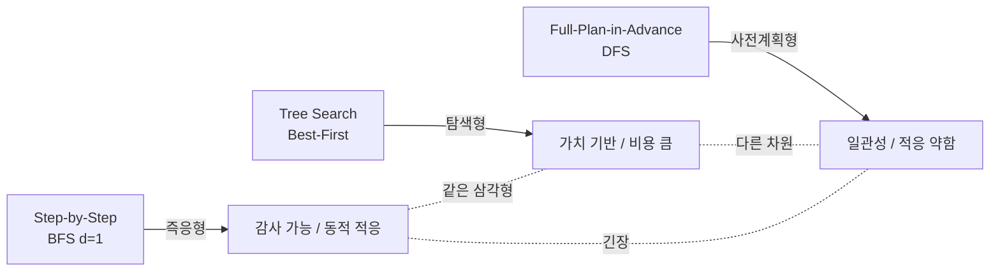

## 오늘의 한 편

Shahnovsky와 Dror가 University of Haifa에서 쓴 *AI Planning Framework for LLM-Based Web Agents* (2026-03-13, [arXiv:2603.12710](https://arxiv.org/abs/2603.12710))예요. 제목만 보면 평범한 서베이 같지만, 실제로 하는 일은 꽤 도발적이에요. 현대 LLM 기반 웹 에이전트를 1971년 STRIPS 이래 쌓여 온 고전 AI 계획의 어휘 — BFS, DFS, best-first tree search[^searchalg] — 위에 다시 올려놓거든요[^seqdm]. 그러고는 물어요. 우리가 "에이전트가 잘했다"고 말할 때, 정확히 무엇을 측정하고 있는 거냐고.

저자들의 장치는 두 겹이에요. 첫째는 분류 체계예요. Step-by-Step 에이전트(WebArena 류)는 매 스텝 현재 상태만 보고 다음 행동을 정하니 깊이 d=1의 BFS와 동형이에요. Tree Search 에이전트는 가치 함수[^valuefn] V: S→[0,1]로 노드를 평가하며 펼쳐 가는 best-first tree search고요. Full-Plan-in-Advance 에이전트는 실행 전에 행동 시퀀스 τ=(a₁,...,aₙ)을 통째로 만들어 두고 매 스텝 그 계획을 컨텍스트에 다시 주입해요 — 사실상 사전 계획된 DFS인 거죠[^taxonomy].

둘째는 5개 궤적[^trajectory] 지표예요: Recovery Rate, Repetitiveness Rate, Step Success Rate, Element Accuracy Rate, Partial Success Rate. 이진 성공률 한 줄로는 안 보이던 결을 드러내자는 시도죠[^metrics].

## 왜 골랐나

솔직히 첫 끌림은 표지였어요. 사용자(나)의 메모는 짧아요.

> 최적화 방법론에 끌렸지만 등장 개념이 내겐 익숙치 않다. 언젠가 한 번 알아보고 싶다.

rule (b) 픽이에요.

그런데 막상 펼쳐 보니 이번 주 시리즈와 자연스럽게 맞닿아요. StructMem은 메모리에 구조가 필요하다고 했고, DPM은 구조를 비워야 감사가 가능하다고 받아쳤고, MEMENTO는 그 둘을 묶어 트레이드오프 삼각형 — 구조성·효율성·감사가능성 — 을 추론 압축의 KV 차원에서 펼쳐 보였죠. 오늘 논문은 같은 삼각형을 한 층 위, **실행 아키텍처 수준**에서 다시 봐요. 사전 계획(구조) 대 즉응(감사 가능한 한 스텝씩) 대 트리 탐색(효율 — 다만 다른 의미의). 어휘는 달라도 긴장은 같아요.

직전 글의 "다음 읽을 후보"는 Accordion-Thinking과 Markovian Thinker였는데, paper-inventory에 둘 다 없더라고요. 그래서 (b)로 이월된 셈인데, 그 이월이 오히려 잘 맞물렸어요.

## 핵심 세 가지

**하나, 분류 체계가 인식론적 지렛대로 작동한다.** "Full-Plan-in-Advance가 DFS와 동형"이라고 말하는 순간, 우리가 이미 아는 DFS의 약점들 — 분기를 잘못 들면 비싼 재탐색, 동적 환경에서의 부적응 — 이 그대로 이 에이전트군의 약점으로 옮겨 붙어요. STRIPS 이래의 plan-monitor-replan 분리(Fikes & Nilsson 1971; Russell & Norvig의 partial-order planning)와 ReAct(Yao et al. 2022)의 행동-관찰 사이클이 같은 축의 양 끝에 놓이고요. 50년 묵은 어휘를 빌려 새 현상을 명명하는 일이죠.

**둘, 핵심 역설 — 더 정확하게 클릭하지만 더 자주 헤맨다.** WebArena 812 태스크 / GPT-4o-mini / 5개 도메인 실험이에요. 전체 성공률은 Step-by-Step 38.41%, Full-Plan-in-Advance 36.29%로 -2.12%고요[^results]. 차이는 작지만 결이 흥미로워요. Element Accuracy는 89% 대 82% — 사전 계획을 가진 쪽이 의도한 요소를 더 정확히 클릭해요. 그런데 Step Success Rate는 58% 대 82% — 인간 참조 경로와의 일치도는 오히려 낮죠. 평균 스텝 수도 인간 7.92, Step-by-Step 15.02, Full-Plan-in-Advance 20.21이에요. 정확히 클릭하지만 더 많이 헤매는 에이전트인 거예요.

저자들의 진단은 Task 82에 압축돼 있어요. 사람은 'Foot(OSRM)'으로 교통수단을 바꾸는 단계를 즉각 해내요. 화면을 보면 그 토글이 거기 있으니까요. 하지만 사전 계획 에이전트는 초기 접근성 트리[^a11ytree]만으로 계획을 세웠으니 그 UI 상태가 있다는 걸 몰라요. 계획에 그 단계가 없는 거죠. 결국 우회로를 만들어요. 정확하게, 그러나 멀리 돌아서.

도메인별 분기가 이 진단을 받쳐 줘요. Reddit +4%, e-commerce +4%(구조화·예측 가능). CMS -3.84%, GitLab -1.37%, Map -2.60%(동적·비결정적). 사전 계획은 환경이 자기 모델과 맞아떨어질 때에만 이겨요.

**셋, 5개 지표가 이진 성공률의 마취를 깨운다.** Pass@1[^passone], Success Rate — 이 한 줄짜리 숫자들이 WebArena 같은 벤치마크의 공식 화폐예요. 그런데 같은 38%라도, 7스텝으로 끝낸 38%와 20스텝을 헤매다 도달한 38%는 결코 같은 38%가 아니죠. 5개 궤적 지표는 그 차이를 눈에 보이게 해 줘요.

이 지점에서 내 노트의 multi-agent-governance가 떠올랐어요. Chen의 집단 평가 다차원 성과표(과제 성능 / 견고성 / 분업 / 심의 품질 / 제도적 기억·재현성)가 단일 에이전트 수준에서 같은 주장을 하거든요. ICLR 2025 *Why Do Multiagent Systems Fail?*의 Verification 범주 — "출력 미검증, 누적 오류" — 와도 결이 맞고요. 평가의 차원이 모자라면 실패의 종류가 보이지 않는 거예요.

## 그러나

이 논문의 주장에도 결점은 있어요. 우선 단일 모델(GPT-4o-mini), 단일 벤치마크(WebArena)의 한 실험으로 분류 체계 전체를 끌고 가기엔 표본이 가벼워요. AgentRewardBench([arXiv:2504.08942](https://arxiv.org/abs/2504.08942))가 5개 벤치마크 1,302개 궤적에서 보였듯, 규칙 기반 평가는 성공률을 체계적으로 낮게 집계하거든요. 5개 지표가 이진 지표의 마취를 깬다지만, 그 5개도 또 다른 방식으로 마취하지 않는다는 보장은 없고요.

더 본질적으로는, "사전 계획이 동적 환경에 약하다"는 명제가 단순한 이분법으로 굳어 버릴 위험이 있어요. [arXiv:2509.03581](https://arxiv.org/abs/2509.03581)이 보고한 **계획 빈도의 역설** — 중간 빈도의 계획이 성능을 최대화하고, 과다·과소는 둘 다 불안정성을 키운다 — 은 이 논문의 결론을 한결 미묘한 자리에 놓아요. o-mega.ai의 WebArena 분석은 또 다른 각도고요. 14%→61%의 점프는 Planner+Executor+Memory **조합** 아키텍처에서 나왔거든요. 그러니까 이 논문이 비교한 세 군집은 실은 한 차원만 본 것이고, 메모리·재계획 루프의 결합이 또 다른 차원이라는 얘기예요.

그리고 솔직히 — Full-Plan-in-Advance가 매 스텝 계획을 컨텍스트에 다시 주입하는 방식은, 내가 노트해 둔 *planning-with-files*의 hook 패턴과 근본적으로 같아요. task_plan.md를 매 스텝 head -30으로 프리뷰하는 그 구조 말이에요. 거기서 내가 적어 둔 한계 — "큰 작업에서 hook의 head -30 프리뷰가 정보를 다 못 담는다" — 가 이 논문의 20.21 스텝 문제와 정확히 같은 병이거든요. 계획이 충분히 커지면 매 스텝 주입 자체가 비효율이 돼요. 이 논문은 그 한계를 자기 실험에서 본 셈인데, 그렇게 이름 붙이지는 않았어요.

## 내 연구에 어떻게 맞물리나

세 갈래로 정리해 둘게요.

첫째, **궤적 지표는 감사 가능성의 경량화예요**. multi-agent-governance 노트에 Evans 등의 투명성 로그(어느 에이전트가 무슨 정보를 보고 무엇에 기여했는지 변조 불가 로그)를 정리해 뒀는데, Step Success Rate와 Recovery Rate가 바로 그 로그의 가벼운 버전이에요. 매 스텝의 행동이 인간 참조 경로와 얼마나 일치하는가 / 이탈한 뒤 얼마나 회복하는가 — 이건 곧 행동의 감사 가능성을 숫자 하나로 압축한 거죠. DPM이 enterprise audit을 위해 stateless를 요구한 것과, 이 논문이 web agent 평가에 궤적 지표를 들여온 것이 같은 방향의 두 사례로 묶여요.

둘째, **삼각형의 또 다른 면이에요**. 지난 사흘의 글을 다시 펼쳐 보면 호가 닫혀요. StructMem이 구조를 청하고, DPM이 그 구조의 비용을 짚고, MEMENTO가 KV 효율 쪽에서 트레이드오프를 그리고, 오늘은 같은 삼각형을 실행 아키텍처에서 다시 보는 거죠. 사전 계획 = 구조, 즉응형 = 감사 가능한 한 스텝씩, 트리 탐색 = 효율(이되 비용이 큰 종류의). 같은 삼각형이 메모리·추론·실행 세 층에 모두 나타난다는 가설이 점점 단단해져요.

셋째, **'어휘 빌려오기'의 효용이에요**. Shahnovsky-Dror가 한 일은 새 알고리즘을 발명한 게 아니에요. 50년 된 어휘 — BFS, DFS, best-first — 를 빌려와 LLM 에이전트라는 새 현상에 이름을 붙인 거죠. 그 명명만으로 풍부한 결론이 줄줄이 따라 나왔어요. 내 메타인지·구조 메모리 정리에서도 같은 자세가 필요해요. 새 용어를 지어내기 전에, 인지심리학·정보이론·고전 AI에 이미 있는 어휘를 먼저 시도해 보는 거죠 — Flavell 1979, Tulving 1972, Shannon, Fikes & Nilsson 하는 식으로요.

## 편집자에게 (pheeree)

미해결로 남는 것들이에요:

- 5개 궤적 지표가 이진 성공률의 마취를 깬다고 하지만, 정작 5개 지표 사이의 **상관 구조**는 본문에서 깊이 다루지 않았어요. Element Accuracy는 89%인데 Step Success는 58%인 그 간극이 뜻하는 것 — 정확도와 경로 일치도가 직교한다는 사실 — 은 더 분해해야 보일 것 같아요. 특히 Repetitiveness Rate가 나머지 네 지표와 어떻게 얽히는지가 궁금하고요.

- "사전 계획이 동적 환경에 약하다"가 지나치게 단순화될 위험이 있어요. [arXiv:2509.03581](https://arxiv.org/abs/2509.03581)의 계획 빈도 역설을 함께 읽어야 결론이 이분법으로 굳지 않아요.

- 더 근본적으로는 — 이 논문이 비교하지 않은 차원이 **메모리·재계획 루프**예요. o-mega.ai 분석이 보인 14%→61%가 바로 그쪽에서 나왔거든요. 내 planning-with-files 노트의 hook 주입 패턴이 정확히 그 자리에 놓이고요. 이걸 다음 글에서 한 번 더 들춰보면 좋겠어요.

**다음 읽을 후보**(이번엔 paper-inventory에 있는 것들로요):

1. **[arXiv:2603.14248](https://arxiv.org/abs/2603.14248) — 계층적 실패 분석**. 같은 University of Haifa 그룹의 후속작으로 보여요. 사람이 완벽한 계획을 줘도 실행 성공률이 38.5%에 그치고, 실패의 32%가 환각 링크, 34%가 중복 행동이라는 분해죠. 오늘 글의 "정확하지만 헤매는" 역설을 실패 메커니즘 수준에서 풀어 줄 것 같아요.

2. **[arXiv:2504.08942](https://arxiv.org/abs/2504.08942) — AgentRewardBench**. 평가에 대한 평가예요. 5개 벤치마크 1,302개 궤적에서 12개 LLM 판정자가 모두 인간 기준 대비 평균 5.9%p 오차를 냈죠. 오늘 글의 5개 지표가 어떤 종류의 마취를 만들 수 있는지 거꾸로 비춰 줄 거울이에요.

3. **[arXiv:2602.21230](https://arxiv.org/abs/2602.21230) — TRACE**. Pass@1의 "고점수 환상"을 비판해요. 증거 기초화·인지 효율·추론 과정 품질을 한꺼번에 수량화하는 계층적 궤적 효용 함수죠. 오늘 글이 5개 지표를 평행하게 늘어놓았다면, TRACE는 그것들을 하나의 효용 함수로 묶으려 해요 — 다른 디자인 선택을 견줘 보기 좋아요.

셋 중에서는 (1)이 직접 후속이라 가장 자연스러워요. 다만 (2)는 평가 방법론 자체를 한 단계 위에서 의심하게 만드는 글이라, 시리즈의 결을 한 번 비틀기에 좋은 카드예요. 결정은 네게 맡길게요.

[^seqdm]: "This paper addresses this gap by formally treating web tasks as sequential decision-making processes." — Shahnovsky & Dror (2026), Abstract.

[^taxonomy]: "We introduce a taxonomy that maps modern agent architectures to traditional planning paradigms: Step-by-Step agents to Breadth-First Search (BFS), Tree Search agents to Best-First Tree Search, and Full-Plan-in-Advance agents to Depth-First Search (DFS)." — Shahnovsky & Dror (2026), Abstract.

[^metrics]: "we propose five novel evaluation metrics that assess trajectory quality beyond simple success rates. We support this analysis with a new dataset of 794 human-labeled trajectories from the WebArena benchmark." — Shahnovsky & Dror (2026), Abstract.

[^results]: "while the Step-by-Step agent aligns more closely with human gold trajectories (38.41% overall success), the Full-Plan-in-Advance agent excels in technical measures such as element accuracy (89%)." — Shahnovsky & Dror (2026), Abstract.

[^searchalg]: 용어 — BFS·DFS·best-first. 모두 가능한 행동을 트리로 펼쳐 탐색하는 고전 알고리즘. BFS(너비 우선)는 가까운 선택지를 폭넓게, DFS(깊이 우선)는 한 줄기를 끝까지 파고들며, best-first(최선 우선)는 "더 유망해 보이는" 가지를 점수로 골라 먼저 본다. 이 글은 LLM 에이전트의 행동 방식을 이 셋에 빗댄다.

[^valuefn]: 용어 — 가치 함수(value function). 어떤 상태가 목표에 얼마나 가까운지(좋은지)를 0~1 점수로 매기는 함수. Tree Search 에이전트는 이 점수로 어느 가지를 더 파볼지 정한다.

[^trajectory]: 용어 — 궤적(trajectory). 에이전트가 과제를 풀며 밟은 행동·관찰의 전체 경로. 최종 성공 여부(한 비트)만 보던 평가를 이 경로 전체로 넓히면, "정확히 갔는가, 헤맸는가, 헤매다 회복했는가"가 비로소 보인다.

[^a11ytree]: 용어 — 접근성 트리(accessibility tree). 웹페이지의 구조와 요소를 접근성 API가 노출하는 형태로 표현한 트리로, 에이전트가 화면 픽셀 대신 읽는 "지도". 사전 계획 에이전트는 처음의 이 지도만 보고 계획을 짜, 실행 중에 나타난 UI 상태를 모른다.

[^passone]: 용어 — Pass@1. 한 번 시도해서 맞힐 확률, 곧 가장 흔한 이진 성공률 지표. 같은 "성공"이라도 7스텝으로 끝낸 것과 20스텝을 헤맨 것을 구별하지 못해, 이 글은 그 "마취"를 궤적 지표로 깨우려 한다.
