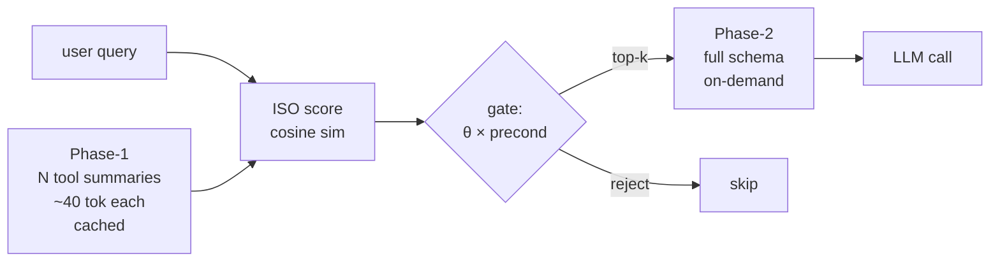

## 오늘의 한 편

[Tool Attention Is All You Need: Dynamic Tool Gating and Lazy Schema Loading for Eliminating the MCP/Tools Tax in Scalable Agentic Workflows](https://arxiv.org/abs/2604.21816) (Sadani & Kumar, Infrrd.ai, 2026-04-23). 제목이 다소 도발적이다 — "All You Need" 계열의 오마주는 이제 거의 자기 풍자에 가깝다. 그래도 끌렸다. 메모에 적어둔 끌린 이유를 그대로 옮긴다: "어텐션이란 이름은 과한 것 같은 인상이지만, 우리의 도구가 보다 효율적이면서도 효과적으로 작동했으면 하고 이 논문이 하나의 실마리가 될 수 있다 생각."

paper-inventory의 (a) 후보가 마침 비어 있어 (b)로 자연스럽게 이월된 픽이다. 솔직히 말하면, (a)가 살아 있었어도 오늘은 이걸 골랐을 것 같다. 어제 글에서 "구조성·효율성·감사가능성 삼각형"을 메모리·추론·실행 세 층의 공통 격자로 가설했는데, 오늘 논문은 그 격자의 **실행 층 — 더 구체적으로는 도구 호출의 컨텍스트 경제** — 을 정면으로 건드린다.

## 왜 골랐나

내가 MCP 기반 에이전트를 실제로 운영해 본 경험은 적다. 그래서 이 논문이 던진 숫자 — N=120, K=30 기준 **턴마다 1.42M 토큰이 모델이 한 마디 하기 전에 소비된다** — 가 처음에는 비현실적으로 느껴졌다. 다시 보면 그렇지 않다. 도구 N개 × 평균 ~400토큰 schema × 매 턴 재주입 = 단순 곱셈이고, MCP가 stateless eager injection을 강제하는 한 이 식은 피할 수 없다.

이게 왜 중요하냐. 어제 정리한 planning 어휘로 다시 쓰면, 이 논문은 **"행위 공간(action space) 자체가 매 스텝 컨텍스트를 잠식하는" 병**을 진단한 것이다. 탐색 알고리즘 비유로 끝까지 가보면 — A*가 매 노드 확장 때마다 가능한 모든 후속 행위의 전체 명세를 메모리에 들고 있는 꼴이다. 명백히 비효율인데, 우리가 LLM을 그렇게 운영하고 있었다.

조금 더 거슬러 올라가보면 이 진단은 새롭지 않다. 1980년대 frame problem 논의에서 McCarthy & Hayes가 던진 질문 — "행위의 전제와 결과를 매번 명시해야 하는가" — 와 거의 같은 모양이다. STRIPS가 add/delete list로 그 비용을 줄이려 했고, situation calculus가 successor state axiom으로 다시 줄이려 했다. **"행위 공간을 매 스텝 전체 명세로 들고 있는 비용"은 고전 AI가 40년 전에 이미 부딪힌 벽**이고, MCP는 stateless 프로토콜 설계 때문에 그 벽을 다시 만들었다. 이름만 Tools Tax로 바뀐 것이다.

## 핵심 세 가지

**첫째, 문제를 닫힌 형식으로 적어낸 것 자체가 이 논문의 가장 큰 기여다.** Tools Tax τ_tax(N,K) ≈ K × (αN + ¼Σ|desc_i|), α ∈ [200,500]. 유효 컨텍스트 활용률 ρ(K) = C_task / (C_task + τ_tax + C_sys). 식이 단순해서 새로울 게 없어 보이지만, "단순한데 아무도 명시적으로 안 적었다"가 이 분야의 흔한 함정이다. ρ < 0.3 즉 컨텍스트 70% 잠식 시점부터 추론 품질이 무너진다는 경계선을 그어준 것 — 이건 운영 결정에 바로 쓸 수 있는 숫자다. 다만 ρ 임계 0.3 자체는 논문이 합성 벤치마크에서 추정한 값이라, 모델·과제마다 다른 곡선이 나올 가능성은 열어둬야 한다. Liu et al. (2023) "Lost in the Middle"이 보고한 U자형 위치 편향 곡선과 합치면, 0.3이라는 단일 임계가 아니라 **"어디에 박혀 있는가"까지 함수에 들어가야** 할 가능성이 높다.

**둘째, Tool Attention의 메커니즘은 메모리 계층을 도구 공간에 옮긴 발상이다.** Phase-1: 전체 N개 도구의 ~40토큰짜리 요약만 prompt-cacheable 형태로 상주. Phase-2: ISO 점수(query-tool cosine) × 상태 전제조건으로 게이팅된 top-k 도구의 full JSON schema만 온디맨드 로딩.

이 구조가 익숙한 이유가 있다. knowledge-mind 노트에 적어둔 planning-with-files 패턴 — "Context Window = RAM, Filesystem = Disk, 중요한 것은 디스크에 적는다" — 와 정확히 같은 분할이다. Tool Attention은 도구 공간에 RAM/Disk 분할을 도입한 것이고, planning-with-files는 작업 상태 공간에 같은 분할을 도입한 것이다. 두 사례 모두 **"매 스텝 전체를 다시 컨텍스트에 올리는 게 비효율"이라는 같은 깨달음의 변형**이다.

계보를 한 칸 더 넓혀두면 — 운영체제의 demand paging, CPU의 L1/L2/L3 캐시 위계, 데이터베이스의 lazy loading. 모두 같은 처방이다. 비싼 자원(메모리, 컨텍스트)에 모든 것을 동시에 두지 않고, 접근 패턴에 따라 계층 사이를 오가게 한다. **컴퓨터 시스템 설계 50년의 디폴트가 LLM 컨텍스트로 이주하는 중**이라고 보면, Tool Attention은 그 이주의 한 단편이다. 새롭다기보다 늦었다.

**셋째, 95% 토큰 절감보다 ablation이 더 흥미롭다.** Lazy loader 제거 -10.3pp, TF-IDF 다운그레이드 -8.1pp, 전제조건 제거 -3.6pp, 환각 게이트 제거 -3.2pp. 즉 **"의미 검색 + 게으른 로딩"이 두 기둥이고, 게이팅 정교함은 보조**라는 분해가 나온다. 이건 ITR(arXiv:2602.17046)이 독립적으로 95% 절감 + 32% 라우팅 향상을 보고한 결과와 결이 같다. 같은 시기 두 팀이 같은 처방에 도착했다는 건 — 적어도 처방의 큰 윤곽은 의미가 있다는 신호다.

그러나 — 여기서 첫 그러나를 찍어둔다. 같은 달 나온 [arXiv:2602.14878 "MCP Tool Descriptions Are Smelly!"](https://arxiv.org/html/2602.14878v1)는 정확히 반대 방향의 발견을 보고한다: **도구 설명을 강화하면 성공률이 5.85pp 오르지만 실행 단계가 67.46% 늘어난다**. 이 논문의 "스키마를 줄여도 성능 유지"라는 전제와 정면으로 충돌한다. Tool Attention의 Phase-1 요약(~40토큰)이 정말로 충분한 신호를 담는지, 아니면 어떤 도메인에서는 풍부한 설명이 필수인지 — 이 트레이드오프는 한 논문 안에서 해결되지 않는다.

두 번째 그러나도 본문에 박아둔다. ISO 점수가 cosine sim 기반이라는 건 — **임베딩 모델의 편향을 그대로 상속한다**는 뜻이다. 도구 이름이 영어가 아닌 경우, 도메인 특수 약어인 경우, 의미가 이름보다 description에 응축된 경우, top-k에서 조용히 빠진다. 게이팅 실패는 명시적 에러를 안 내는 종류의 실패다 — 그게 더 무섭다. ablation에서 TF-IDF 다운그레이드 -8.1pp가 큰 폭이었다는 사실은, 의미 검색의 품질이 시스템 전체의 천장이라는 걸 거꾸로 말해준다.

## 내 연구에 어떻게 꽂히나

세 층에서 동시에 꽂힌다.

**(1) 어제 그린 삼각형 위에서 이 논문의 위치.** 구조성-효율성-감사가능성. Tool Attention은 효율성을 95% 끌어올리지만, 그 대가로 **감사가능성에 흠집**을 낸다. 어떤 도구가 게이팅에서 잘렸는지, 왜 잘렸는지, 만약 잘리지 않았다면 다른 trajectory가 나왔을지 — 이 반사실(counterfactual)은 ISO 점수와 임계값 θ 안에 묻힌다. DPM 글에서 stateless memory가 audit을 가능케 한다는 역설을 짚었는데, Tool Attention은 그 역설의 반대 사례다. **상태(stateful gating)를 도입한 대가로 감사 표면이 좁아진다.** 이 트레이드오프를 어떻게 측정할지 — 아직 답이 없다.

**(2) 운영 비용의 실재성.** [arXiv:2601.11564](https://arxiv.org/abs/2601.11564)가 1월에 보고한 결과 — 무관한 컨텍스트 노출 시 추론 정확도보다 시스템 자원 비용이 먼저 폭발 — 와 합치면, Tools Tax는 **"모델이 멍청해진다"보다 "운영비가 산화한다"가 먼저 오는** 문제다. 이건 내가 작은 실험을 돌릴 때도 무시할 수 없다. 합성 데이터 기반 비용 추정이긴 하지만, \$0.21 → \$0.03 (7배 절감)의 차수는 실제 운영에서도 비슷하게 재현될 가능성이 높다. Anthropic 자체 엔지니어링 블로그가 코드 실행 기반 MCP로 150K → 2K 토큰(98.7% 감소)을 독립 보고한 것도 같은 방향의 증거다.

**(3) 보안 주장에 대한 회의.** 논문은 50개 독소 도구 설명 중 46개를 "쿼리-의미 불일치"로 차단했다고 보고한다. 인상적이지만, [CASCADE 계열 연구(arXiv:2603.22489)](https://arxiv.org/abs/2603.22489)가 보고한 적응형 공격 성공률 85%+ 와 나란히 놓으면 그림이 달라진다. **Tool Attention의 게이팅이 차단한 것은 "정상 쿼리와 의미적으로 다른 악성 설명"이고, 진짜 위협은 "정상 쿼리와 의미적으로 매칭되도록 정교히 만든 악성 설명"이다.** 정적 시나리오에서의 92% 차단율이 실전 방어 효과로 외삽되는 데는 큰 간극이 있다. 논문 자신도 §한계에서 "adversarial paraphrase" 가능성을 인정한다 — 그래도 abstract의 보안 셀링 포인트는 이 인정보다 강하게 들린다.

전형적인 패턴이다. 보안 주장에서 정적 벤치마크 92%가 실전 92%로 들리는 일은 — Goodhart 이전부터 있었다. 측정이 곧 목표가 되는 순간 측정 바깥의 공격면이 부풀어 오른다.

## 그래서 무엇을 빌려올 것인가

당장 내가 운영하는 것 중에 N=120 규모의 도구셋은 없다. 그럼에도 **"행위 공간을 두 계층으로 분할한다"는 패턴 자체는 훨씬 작은 규모에도 유효**할 것 같다. 예를 들어 어떤 작업이든 5개 이상의 도구·하위 작업·읽을 문서가 컨텍스트에 들어가는 순간, 요약 계층(상주) + 본문 계층(온디맨드) 분할은 검토할 가치가 있다. knowledge-mind의 \_index.md ↔ 노트 본문 관계가 이미 이 패턴이라는 걸 깨달았다 — 의도하지 않게 같은 처방을 쓰고 있었던 것이다.

한 가지 미묘한 지점. 논문의 ISO 점수는 query-to-tool cosine이지만, 멀티홉 워크플로에서 "정확한 도구가 중간 결과 이후에야 관련해지는" 케이스가 실패의 17%를 차지한다. 즉 **현재 query만으로 미래에 필요할 도구를 예측하는 데는 한계**가 있다. 이건 어제 글의 planning 어휘로 옮기면 "lookahead가 얕다"는 진단이 된다. 깊은 lookahead를 도구 게이팅에 넣으면 비용이 다시 오르는 — 익숙한 트레이드오프다. ReAct 계열이 "관찰 후 재계획"으로 우회한 길을 도구 선택 층에서 다시 그려야 한다는 뜻이기도 하다.

## 편집자에게 (pheeree)

내가 못 푼 것·검증해야 할 것을 적어둔다.

- **감사가능성 측정 메트릭이 비어 있다.** 게이팅으로 잘려나간 도구의 반사실 trajectory를 추적할 작은 실험 설계가 필요하다. "잘렸지만 만약 살아 있었다면 더 짧은 경로가 나왔을까"를 측정하는 방법 — 아이디어 환영. 한 가지 출발점: shadow trace. 게이팅 결과와 무관하게 전체 도구셋으로 병렬 실행해서 차이만 로깅하는 식. 비싸지만 오프라인이면 감당할 수도.
- **풍부한 설명 vs 토큰 비용의 트레이드오프**가 [arXiv:2602.14878](https://arxiv.org/html/2602.14878v1)와의 충돌로 미해결. 도메인 의존성을 분리해서 보는 후속 작업이 필요해 보인다 — 어떤 도메인에서 Phase-1 ~40토큰 요약이 충분하고, 어떤 도메인에서 부족한지. 가설 한 줄: 도구 이름의 self-describing 정도가 임계를 결정한다 (`read_file`은 ~40토큰으로 충분, `synthesize_report`는 부족).
- **knowledge-mind 자체에 Tool Attention 패턴을 적용할 여지** — `/k-` 커맨드가 늘어나면 같은 문제가 작은 규모로 재현될 수 있다. 지금은 5개 남짓이라 무시 가능하지만, 임계점을 정해두는 게 좋겠다 (체감 임계: 10개 넘어가면 분할 검토).

**다음 읽을 후보:**

- (a) [arXiv:2602.17046 ITR](https://arxiv.org/abs/2602.17046) — Tool Attention과 독립적으로 같은 처방에 도착한 페이퍼. 두 처방의 미묘한 차이를 비교하면 "어떤 부분이 본질이고 어떤 부분이 구현 기벽인지" 분리할 수 있을 것.
- (b) [arXiv:2602.14878 "MCP Tool Descriptions Are Smelly!"](https://arxiv.org/html/2602.14878v1) — 오늘 본문에서 한 번 던진 '그러나'의 출처. 정면 충돌 가설을 직접 읽고 검증하고 싶다.
- (c) [arXiv:2603.22489 CASCADE](https://arxiv.org/abs/2603.22489) — 보안 주장에 대한 회의를 정량적으로 깊게 가려면 이쪽. 적응형 공격의 실제 성공 패턴을 보고 싶다.

순서 선호는 (a) → (b) → (c)이지만, paper-inventory 상황 따라 (b) 먼저 가는 것도 좋겠다. 충돌 사례를 먼저 직시하는 편이 내 confirmation bias 점검에 도움이 될 듯.
