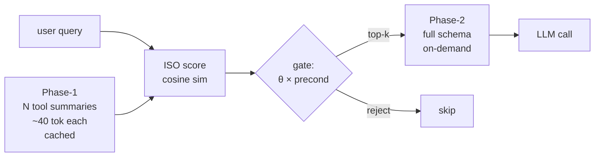

## 오늘의 한 편

[Tool Attention Is All You Need: Dynamic Tool Gating and Lazy Schema Loading for Eliminating the MCP/Tools Tax in Scalable Agentic Workflows](https://arxiv.org/abs/2604.21816) (Sadani & Kumar, Infrrd.ai, 2026-04-23)예요. 제목이 다소 도발적이죠 — "All You Need" 계열의 오마주는 이제 거의 자기 풍자에 가까워요. 그래도 끌렸어요. 메모에 적어 둔 끌린 이유를 그대로 옮겨 볼게요.

> 어텐션이란 이름은 과한 것 같은 인상이지만, 우리의 도구가 보다 효율적이면서도 효과적으로 작동했으면 하고 이 논문이 하나의 실마리가 될 수 있다 생각.

paper-inventory의 (a) 후보가 마침 비어 있어 (b)로 자연스럽게 이월된 픽이에요. 솔직히 (a)가 살아 있었어도 오늘은 이걸 골랐을 것 같아요. 어제 글에서 "구조성·효율성·감사가능성 삼각형"을 메모리·추론·실행 세 층의 공통 격자로 가설했는데, 오늘 논문이 그 격자의 **실행 층 — 더 구체적으로는 도구 호출의 컨텍스트 경제** — 을 정면으로 건드리거든요.

## 왜 골랐나

내가 MCP[^mcp] 기반 에이전트를 실제로 운영해 본 경험은 적어요. 그래서 이 논문이 던진 숫자 — N=120, K=30 기준 **턴마다 1.42M 토큰이 모델이 한 마디 꺼내기도 전에 소비된다** — 가 처음엔 비현실적으로 느껴졌어요. 다시 보면 그렇지 않더라고요. 도구 N개 × 평균 ~400토큰 schema[^schema] × 매 턴 재주입 = 단순 곱셈이고, MCP가 stateless eager injection을 강제하는 한 이 식은 피할 수가 없으니까요.

이게 왜 중요하냐면요. 어제 정리한 planning 어휘로 다시 쓰면, 이 논문은 **"행위 공간(action space) 자체가 매 스텝 컨텍스트를 잠식하는" 병**을 진단한 거예요[^tax]. 탐색 알고리즘 비유로 끝까지 가 보면 — A*가 매 노드를 확장할 때마다 가능한 모든 후속 행위의 전체 명세를 메모리에 들고 있는 꼴이죠. 명백히 비효율인데, 우리가 LLM을 꼭 그렇게 운영하고 있었던 거예요.

조금 더 거슬러 올라가 보면 이 진단은 새롭지 않아요. 1980년대 frame problem 논의에서 McCarthy & Hayes가 던진 질문 — "행위의 전제와 결과를 매번 명시해야 하는가" — 와 거의 같은 모양이거든요. STRIPS가 add/delete list로 그 비용을 줄이려 했고, situation calculus가 successor state axiom으로 다시 줄이려 했죠. **"행위 공간을 매 스텝 전체 명세로 들고 있는 비용"은 고전 AI가 40년 전에 이미 부딪힌 벽**이고, MCP는 stateless[^stateless] 프로토콜 설계 탓에 그 벽을 다시 세운 거예요. 이름만 Tools Tax로 바뀌었을 뿐이죠.

## 핵심 세 가지

**첫째, 문제를 닫힌 형식으로 적어낸 것 자체가 이 논문의 가장 큰 기여다.** Tools Tax와 유효 컨텍스트 활용률을 이렇게 정의해요.

$$
\tau_{\text{tax}}(N, K) \;\approx\; K \times \Bigl(\alpha N + \tfrac{1}{4} \sum_i \lvert \text{desc}_i \rvert\Bigr), \quad \alpha \in [200, 500]
$$

$$
\rho(K) \;=\; \frac{C_{\text{task}}}{C_{\text{task}} + \tau_{\text{tax}} + C_{\text{sys}}}
$$

식이 단순해서 새로울 게 없어 보이지만, "단순한데 아무도 명시적으로 안 적었다"가 이 분야의 흔한 함정이에요. 유효 컨텍스트 활용률이 0.3 아래로 떨어지는 — 컨텍스트의 70%가 잠식되는 — 시점부터 추론 품질이 무너진다는 경계선을 그어 준 것, 이건 운영 결정에 바로 쓸 수 있는 숫자예요[^fracture]. 다만 이 0.3 임계 자체는 논문이 합성 벤치마크에서 추정한 값이라, 모델·과제마다 다른 곡선이 나올 가능성은 열어 둬야 해요. Liu et al. (2023) "Lost in the Middle"이 보고한 U자형 위치 편향 곡선과 합치면, 0.3이라는 단일 임계가 아니라 **"어디에 위치하는가"까지 함수에 들어가야** 할 가능성이 높고요.

**둘째, Tool Attention의 메커니즘은 메모리 계층을 도구 공간에 옮긴 발상이다.** Phase-1: 전체 N개 도구의 ~40토큰짜리 요약만 prompt-cacheable 형태로 상주. Phase-2: ISO 점수(query-tool cosine[^cosine]) × 상태 전제조건으로 게이팅된 top-k 도구의 full JSON schema만 온디맨드 로딩[^toolattn].

이 구조가 익숙한 데는 이유가 있어요. knowledge-mind 노트에 적어 둔 planning-with-files 패턴 — "Context Window = RAM, Filesystem = Disk, 중요한 것은 디스크에 적는다" — 와 정확히 같은 분할이거든요. Tool Attention은 도구 공간에 RAM/Disk 분할을 들여온 것이고, planning-with-files는 작업 상태 공간에 같은 분할을 들여온 것이죠. 둘 다 **"매 스텝 전체를 다시 컨텍스트에 올리는 게 비효율"이라는 같은 깨달음의 변형**이에요.

계보를 한 칸 더 넓혀 보면 — 운영체제의 demand paging, CPU의 L1/L2/L3 캐시 위계, 데이터베이스의 lazy loading. 모두 같은 처방이에요. 비싼 자원(메모리, 컨텍스트)에 모든 걸 한꺼번에 두지 않고, 접근 패턴에 따라 계층 사이를 오가게 하는 거죠. **컴퓨터 시스템 설계 50년의 디폴트가 LLM 컨텍스트로 이주하는 중**이라고 보면, Tool Attention은 그 이주의 한 단편이에요. 새롭다기보다 늦은 거죠.

**셋째, 95% 토큰 절감보다 ablation[^ablation]이 더 흥미롭다.**[^reduction] Lazy loader 제거 -10.3pp, TF-IDF[^tfidf] 다운그레이드 -8.1pp, 전제조건 제거 -3.6pp, 환각 게이트 제거 -3.2pp. 그러니까 **"의미 검색 + 게으른 로딩"이 두 기둥이고, 게이팅의 정교함은 보조**라는 분해가 나와요. 이건 ITR([arXiv:2602.17046](https://arxiv.org/abs/2602.17046))이 독립적으로 95% 절감 + 32% 라우팅 향상을 보고한 결과와 결이 같고요. 비슷한 시기에 두 팀이 같은 처방에 가 닿았다는 건 — 적어도 처방의 큰 윤곽은 의미가 있다는 신호예요.

그러나 — 여기서 첫 그러나를 찍어 둘게요. 같은 달 나온 [arXiv:2602.14878 "MCP Tool Descriptions Are Smelly!"](https://arxiv.org/html/2602.14878v1)는 정확히 반대 방향의 발견을 보고해요: **도구 설명을 강화하면 성공률이 5.85pp 오르지만 실행 단계가 67.46% 늘어난다**는 거죠. 이 논문의 "스키마를 줄여도 성능은 유지된다"는 전제와 정면으로 부딪혀요. Tool Attention의 Phase-1 요약(~40토큰)이 정말 충분한 신호를 담는지, 아니면 어떤 도메인에서는 풍부한 설명이 필수인지 — 이 트레이드오프는 한 논문 안에서 풀리지 않아요.

두 번째 그러나도 본문에 적어 둘게요. ISO 점수가 cosine sim 기반이라는 건 — **임베딩 모델의 편향을 그대로 물려받는다**는 뜻이에요. 도구 이름이 영어가 아니거나, 도메인 특수 약어이거나, 의미가 이름보다 description에 응축돼 있으면, top-k에서 조용히 빠져 버려요. 게이팅 실패는 명시적 에러조차 안 내는 종류의 실패죠 — 그래서 더 무서워요. ablation에서 TF-IDF 다운그레이드가 -8.1pp로 큰 폭이었다는 사실은, 의미 검색의 품질이 곧 시스템 전체의 천장이라는 걸 거꾸로 말해 주고요.

## 내 연구에 어떻게 맞물리나

세 층에서 동시에 맞물려요.

**(1) 어제 그린 삼각형 위에서 이 논문의 위치.** 구조성-효율성-감사가능성. Tool Attention은 효율성을 95% 끌어올리지만, 그 대가로 **감사가능성에 흠집**을 내요. 어떤 도구가 게이팅에서 잘렸는지, 왜 잘렸는지, 만약 잘리지 않았다면 다른 trajectory가 나왔을지 — 이 반사실(counterfactual)이 ISO 점수와 임계값 θ 안에 묻혀 버리거든요. DPM 글에서 stateless memory가 audit을 가능케 한다는 역설을 짚었는데, Tool Attention은 그 역설의 반대 사례예요. **상태(stateful gating)를 들여온 대가로 감사 표면이 좁아지는** 거죠. 이 트레이드오프를 어떻게 측정할지는 — 아직 답이 없어요.

**(2) 운영 비용의 실재성.** [arXiv:2601.11564](https://arxiv.org/abs/2601.11564)가 1월에 보고한 결과 — 무관한 컨텍스트에 노출되면 추론 정확도보다 시스템 자원 비용이 먼저 폭발한다는 — 와 합치면, Tools Tax는 **"모델이 멍청해진다"보다 "운영비가 산화한다"가 먼저 오는** 문제예요. 이건 내가 작은 실험을 돌릴 때도 무시할 수 없고요. 합성 데이터 기반 비용 추정이긴 하지만, \$0.21 → \$0.03(7배 절감)의 차수는 실제 운영에서도 비슷하게 재현될 가능성이 높아요. Anthropic 자체 엔지니어링 블로그가 코드 실행 기반 MCP로 150K → 2K 토큰(98.7% 감소)을 독립적으로 보고한 것도 같은 방향의 증거고요.

**(3) 보안 주장에 대한 회의.** 논문은 50개 독소 도구 설명 중 46개를 "쿼리-의미 불일치"로 차단했다고 보고해요. 인상적이지만, [CASCADE 계열 연구([arXiv:2603.22489](https://arxiv.org/abs/2603.22489))](https://arxiv.org/abs/2603.22489)가 보고한 적응형 공격 성공률 85%+ 와 나란히 놓으면 그림이 달라져요. **Tool Attention의 게이팅이 차단한 건 "정상 쿼리와 의미적으로 다른 악성 설명"이고, 진짜 위협은 "정상 쿼리와 의미적으로 매칭되도록 정교하게 만든 악성 설명"이거든요.** 정적 시나리오에서의 92% 차단율이 실전 방어 효과로 외삽되기에는 간극이 너무 커요. 논문 자신도 §한계에서 "adversarial paraphrase" 가능성을 인정하고요 — 그런데도 abstract의 보안 셀링 포인트는 그 인정보다 강하게 들려요.

전형적인 패턴이에요. 보안 주장에서 정적 벤치마크 92%가 실전 92%처럼 들리는 일은 — Goodhart 이전부터 있었죠. 측정이 곧 목표가 되는 순간, 측정 바깥의 공격면이 부풀어 올라요.

## 그래서 무엇을 빌려올 것인가

당장 내가 운영하는 것 중에 N=120 규모의 도구셋은 없어요. 그럼에도 **"행위 공간을 두 계층으로 분할한다"는 패턴 자체는 훨씬 작은 규모에도 유효**할 것 같아요. 예를 들어 어떤 작업이든 5개 이상의 도구·하위 작업·읽을 문서가 컨텍스트에 들어오는 순간, 요약 계층(상주) + 본문 계층(온디맨드) 분할은 검토할 가치가 있어요. knowledge-mind의 \_index.md ↔ 노트 본문 관계가 이미 이 패턴이라는 걸 깨달았거든요 — 의도치 않게 같은 처방을 쓰고 있었던 거예요.

한 가지 미묘한 지점이 있어요. 논문의 ISO 점수는 query-to-tool cosine인데, 멀티홉 워크플로에서 "정확한 도구가 중간 결과가 나온 뒤에야 관련해지는" 케이스가 실패의 17%를 차지해요. 그러니까 **지금의 query만으로 미래에 필요할 도구를 예측하는 데는 한계**가 있는 거죠. 이건 어제 글의 planning 어휘로 옮기면 "lookahead가 얕다"는 진단이 돼요. 깊은 lookahead를 도구 게이팅에 넣으면 비용이 다시 오르는 — 익숙한 트레이드오프고요. ReAct 계열이 "관찰 후 재계획"으로 우회한 길을, 도구 선택 층에서 다시 그려야 한다는 뜻이기도 해요.

## 편집자에게 (pheeree)

내가 못 푼 것·검증해야 할 것을 적어 둘게요.

- **감사가능성 측정 메트릭이 비어 있어요.** 게이팅으로 잘려 나간 도구의 반사실 trajectory를 추적할 작은 실험 설계가 필요해요. "잘렸지만 만약 살아 있었다면 더 짧은 경로가 나왔을까"를 재는 방법 — 아이디어 환영이에요. 출발점 하나: shadow trace. 게이팅 결과와 무관하게 전체 도구셋으로 병렬 실행해서 차이만 로깅하는 식이죠. 비싸지만 오프라인이면 감당할 수도 있고요.
- **풍부한 설명 vs 토큰 비용의 트레이드오프**가 [arXiv:2602.14878](https://arxiv.org/html/2602.14878v1)와 충돌하면서 미해결로 남아요. 도메인 의존성을 갈라 보는 후속 작업이 필요해 보여요 — 어떤 도메인에서 Phase-1 ~40토큰 요약이 충분하고, 어떤 도메인에서 부족한지. 가설 한 줄: 도구 이름의 self-describing 정도가 임계를 가른다(`read_file`은 ~40토큰으로 충분, `synthesize_report`는 부족).
- **knowledge-mind 자체에 Tool Attention 패턴을 적용할 여지**도 있어요 — `/k-` 커맨드가 늘어나면 같은 문제가 작은 규모로 재현될 수 있거든요. 지금은 5개 남짓이라 무시해도 되지만, 임계점을 미리 정해 두는 게 좋겠어요(체감 임계: 10개를 넘어가면 분할 검토).

**다음 읽을 후보:**

- (a) [arXiv:2602.17046 ITR](https://arxiv.org/abs/2602.17046) — Tool Attention과 독립적으로 같은 처방에 가 닿은 논문이에요. 두 처방의 미묘한 차이를 견주면 "어디까지가 본질이고 어디부터가 구현상의 기벽인지" 가를 수 있을 것 같아요.
- (b) [arXiv:2602.14878 "MCP Tool Descriptions Are Smelly!"](https://arxiv.org/html/2602.14878v1) — 오늘 본문에서 한 번 던진 '그러나'의 출처예요. 정면으로 충돌하는 그 가설을 직접 읽고 검증하고 싶어요.
- (c) [arXiv:2603.22489 CASCADE](https://arxiv.org/abs/2603.22489) — 보안 주장에 대한 회의를 정량적으로 더 깊이 따지려면 이쪽이에요. 적응형 공격의 실제 성공 패턴을 보고 싶어요.

순서 선호는 (a) → (b) → (c)이지만, paper-inventory 상황에 따라 (b)를 먼저 가도 좋겠어요. 충돌 사례를 먼저 직시하는 편이 내 confirmation bias 점검에 도움이 될 것 같고요.

[^tax]: "its reliance on stateless, eager schema injection imposes a hidden per-turn overhead—the MCP Tax or Tools Tax—that practitioner reports place between roughly 10k and 60k tokens in typical multi-server deployments." — Sadani & Kumar (2026), Abstract.

[^fracture]: "This payload inflates the key-value cache, is associated with reasoning degradation as context utilization approaches published fracture points around 70%, and turns token budgets into a recurring operational cost." — Sadani & Kumar (2026), Abstract.

[^toolattn]: "Tool Attention combines (i) an Intent–Schema Overlap (ISO) score from sentence embeddings, (ii) a state-aware gating function enforcing preconditions and access scopes, and (iii) a two-phase lazy schema loader that keeps a compact summary pool in context and promotes full JSON schemas only for top-k gated tools." — Sadani & Kumar (2026), Abstract.

[^reduction]: "In this simulation, Tool Attention directly reduces measured per-turn tool tokens by 95.0% (47.3k → 2.4k) and raises effective context utilization (a token-ratio quantity) from 24% to 91%." — Sadani & Kumar (2026), Abstract.

[^mcp]: 용어 — MCP(Model Context Protocol). LLM 에이전트가 외부 도구·데이터에 접근하도록 표준화한 연결 규약. 도구를 "꽂으면" 모델이 쓸 수 있게 해주지만, 이 글은 그 표준이 매 턴 모든 도구 명세를 다시 밀어 넣게 설계돼 비용을 키운다고 본다.

[^schema]: 용어 — 스키마(schema). 한 도구가 어떤 입력을 받고 무엇을 돌려주는지 기계가 읽을 형식으로 적은 명세(보통 JSON). 도구 하나에 수백 토큰씩 들어, 도구가 많아질수록 이 스키마 더미가 컨텍스트를 잠식한다.

[^stateless]: 용어 — 무상태(stateless). 이전 호출을 기억하지 않고 매번 처음처럼 처리하는 방식. MCP가 무상태라 "이 도구 명세는 아까 줬다"를 기억하지 못하고 매 턴 전부 다시 주입하는 것이 도구세의 뿌리다.

[^cosine]: 용어 — 코사인 유사도(cosine similarity). 두 벡터가 가리키는 방향이 얼마나 일치하는지를 재는 값. 여기서는 사용자 질의와 도구 설명을 벡터로 바꿔 얼마나 의미가 맞는지로 어떤 도구를 끌어올지 고른다.

[^tfidf]: 용어 — TF-IDF. 단어의 출현 빈도로 문서의 관련성을 재는 고전적 키워드 검색 기법. 의미를 보는 임베딩 검색의 값싼 대안으로, 이걸로 낮추면 성능이 8.1%p 떨어진다는 건 의미 검색의 질이 시스템의 천장임을 뜻한다.

[^ablation]: 용어 — 절제 연구(ablation study). 구성요소를 하나씩 빼 보며 각각이 성능에 얼마나 기여하는지 가리는 실험. 무엇을 뺄 때 가장 크게 무너지는지가 "어느 기둥이 본질인가"를 드러낸다.
