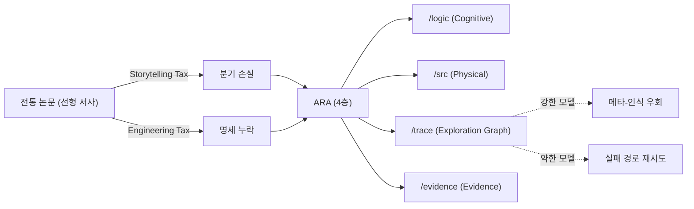

## 오늘의 한 편

Jiachen Liu et al., *The Last Human-Written Paper: Agent-Native Research Artifacts* ([arXiv:2604.24658](https://arxiv.org/abs/2604.24658), 2026-04-27), Orchestra·Stanford·MIT 연합이에요. 제목은 도발적이지만, 정작 본문은 차분해요 — 출판이라는 형식이 부과하는 두 가지 세금을 정의하고, 그걸 우회할 컨테이너를 제안하고, 강한 모델과 약한 모델에서 각각 어느 쪽으로 굴러가는지를 정직하게 측정하거든요.

## 왜 골랐나

어제 글(MCP 도구세)에서 다음 읽을 후보로 던져 둔 세 편 중 하나가 이 ARA[^ara] 논문이에요. 그때 적었듯 paper-inventory에 없어 (b) 우선순위로 이월했다가, 오늘 픽으로 끌어올렸고요. 끌린 이유는 단순해요 — "연구를 위한 에이전트 프레임워크"라는 어구죠. 도구세를 다룬 어제와 연구세를 다루는 오늘은 같은 가족이에요. 둘 다 모델 앞에 펼쳐지는 입력을 어떻게 모양 잡을 것인가의 문제거든요. 어제는 turn-time에서 도구 카탈로그를 깎았고, 오늘은 출판이라는 인터페이스 자체를 다시 짜요.

내 노트 [tools-as-extended-self]에 적어 둔 한 줄 — "도구는 자기의 추상적 진술이 아니라 구현체다" — 와도 맞물려요. 논문도 마찬가지로 자기의 구현체일 수 있죠. 그게 코드·트레이스·증거와 떼어진 산문 한 덩어리로 압축됐을 때 무엇이 깎이는지 — 이 논문은 그 깎임에 두 개의 이름을 붙여요.

## 핵심 세 가지

**첫째, 두 세금의 분리 명명이 이 논문의 진짜 기여다.** Storytelling Tax는 분기하는 연구 과정 — 실패한 실험, 기각된 가설, 설계 피벗 — 이 선형 서사로 압축되며 통째 삭제되는 비용이에요. Engineering Tax는 reviewer-sufficient 산문과 agent-sufficient 실행 명세 사이의 간격이고요[^taxes]. PaperBench의 8,921개 요건 중 45.4%만 완전 명세였고, RE-Bench에서는 비용의 90.2%가 버려진 탐색에 쓰인다는 수치가 따라붙어요. 이 두 세금을 따로 부르는 것 자체가 의미 있어요. 종래엔 "재현성 위기"라는 한 덩어리로 뭉쳐 있던 것이, 서사 압축 대 명세 누락이라는 두 축으로 갈라지거든요.

계보를 짚어 둘게요. Storytelling Tax는 사실상 Latour-Woolgar의 *Laboratory Life*(1979)가 짚은 "실험실 일지의 산문화" — 실험실 노트의 카오스가 출판 가능한 서사로 위생 처리되는 과정 — 를 LLM 시대에 다시 쓴 거예요. Medawar가 1963년 "Is the Scientific Paper a Fraud?"에서 던진 비판도 같은 결이고요 — IMRaD[^imrad] 형식이 발견의 실제 경로를 은폐한다는. Engineering Tax 쪽은 Knuth의 literate programming(1984)과 Donoho의 reproducible research(2010)의 직계 후손이에요. ARA가 새로운 건 청중을 바꿨다는 점이죠. 종래 계보가 "사람-독자가 이해할 수 있게 하자"였다면, ARA는 "에이전트-독자가 실행할 수 있게 하자"로 청중 자체를 갈아 끼웠어요. FAIR 원칙(Wilkinson 2016)의 Findable·Accessible·Interoperable·Reusable에도 사람-독자 가정이 깔려 있었고, 그래서 20년을 굴린 끝에 "기계가 읽을 수 있어도 LLM은 못 쓴다"는 격차가 새로 생긴 거예요.

**둘째, ARA의 4층 구조는 분리의 미덕이다.** Cognitive Layer(`/logic`: claims·experiments·heuristics)는 과학적 논리, Physical Layer(`/src`)는 실행 코드+설정, Exploration Graph(`/trace`)는 탐색 분기 DAG[^dag] — 죽은 가지와 피벗을 노드로 보존 — , Evidence Layer(`/evidence`)는 원시 수치예요[^layers]. 산문 한 덩어리에서는 모든 게 같은 자리에 눌려 있어 어느 층이 빠져도 티가 안 났죠. 그런데 분리해 두면 빠진 층이 즉시 드러나요. 내 [planning-with-files-analysis] 노트에 적었던 "Context Window = RAM, Filesystem = Disk"의 변주처럼, ARA는 논문이라는 RAM을 디스크 구조로 펼치는 거예요.

그러나 분리 자체가 미덕인지는 이 논문이 답하지 않아요. Jupyter Notebook은 정확히 반대 방향 — 코드+산문+증거를 한 셀에 묶어 탐험적 분석의 연속성을 살리려 한 — 의 시도였고, 그 결과는 잘 알려져 있죠. Pimentel et al.(2019)가 GitHub의 130만 개 노트북을 분석했더니 24%만 재실행 가능했어요. 분리하지 않은 비용도, 분리한 비용도 둘 다 비싼 거예요. ARA가 거는 베팅은 "에이전트는 분리를 더 잘 다룬다"는 가설인데, 이건 다음 핵심에서 곧장 흔들려요.

**셋째, 그러나 — 그리고 이게 이 논문의 가장 정직한 대목이다 — 이 분리는 강한 모델에서만 작동한다.** Claude Sonnet 4.5 같은 약한 모델에서는 역전이 일어나요. triton_cumsum에서 ARA 0.27 대 종래 paper 0.64, restricted_mlm에서 ARA 0.73 대 1.03이죠. 강한 모델은 trace를 읽고 "이 경로는 막혔다"를 메타-인식해 우회하지만, 약한 모델은 트레이스에 나열된 실패 경로를 그대로 다시 밟아요[^doubleedge]. 풍부한 컨텍스트가 되레 족쇄가 되는 거예요. 외부에도 이 구조를 받쳐 주는 결과가 있어요 — 컨텍스트 길이만 늘려도 LLM 성능이 13.9~85% 저하된다는 보고([arXiv:2510.05381](https://arxiv.org/abs/2510.05381))죠. Liu et al.의 "Lost in the Middle"(2023)도 같은 가족 — 긴 컨텍스트에서 중간 위치의 정보가 체계적으로 무시되는 — 의 발견이고요. 정보의 풍부함과 그걸 걸러내는 능력은 별개라서, 후자가 부족한 모델 앞에 전자를 쌓으면 그저 노이즈가 돼요.

짧게 덧붙일게요. 이건 LLM만의 문제도 아니에요. Sweller의 cognitive load theory(1988)가 사람-학습자에서 보였던 구조 — 외재적 부하가 임계를 넘으면 학습 자체가 무너진다 — 가 모델에서도 그대로 재현되거든요.

## 내 연구에 어떻게 맞물리나

knowledge-mind를 운영하면서 비슷한 구조를 매일 봐요. raw/에 쌓이는 원시 자료, knowledge/에 가라앉은 노트, thinking/에 흩어진 결정 흔적, scripts/의 자동화 — 이게 4층까진 아니어도 비슷한 분할이거든요. 게다가 [decision-conversations-as-raw]에 적었듯 "결정의 이유가 사라지는" 문제를 다루려고 ADR[^adr]로 압축하는 정책을 세워 뒀고요. ARA의 Exploration Graph는 이걸 한층 더 야심차게 — 결정의 이유를 압축하지 않고 DAG로 통째 보존하자고 — 밀어붙여요.

매력적이에요. 하지만 [planning-with-files-analysis]에서 내가 인정할 수밖에 없었던 한 줄이 떠올라요.

> 그래프 우월성을 단언했다. 하지만 평면 파일+hook이 평가에서 96.7%를 낸 사실은 그 가정의 한계를 보여준다.

ARA도 같은 위험을 져요. 그래프는 강한 모델에서만 그래프로 읽히고, 약한 모델에겐 그저 더 많은 텍스트일 뿐이거든요. 내 노트가 도구라면, 도구는 그걸 쓸 수 있는 손에 기대요.

또 하나 — 외부 보강 자료에서 본 FAIR 원칙의 역설이 마음에 걸려요. 20년의 FAIR 경험이 "다양한 출처의 데이터를 체계적으로 재사용하면 오류·편향·데이터 드레징을 부추길 수 있다"는 역설을 드러냈거든요. ARA가 실패 트레이스를 표준 패키지로 만든다면, 특정 실패 경로가 정규화돼 후속 에이전트의 탐색 공간을 편향시킬 수 있어요. "이 길은 막혔다"는 신호가 한 번은 절약이지만, 모든 후속 에이전트가 그 신호를 그대로 물려받으면 우회 자체가 영영 발견되지 않는 경로가 생기죠. 이건 Kuhn의 normal science가 가진 양면성 — 패러다임이 효율을 주는 동시에 반례를 안 보이게 만든다 — 의 작은 재판이에요. 검증 가능성과 탐색 다양성의 트레이드오프 — ARA 논문이 직접 다루지 않은 결이죠.

도메인 의존성도 짚어야 해요. 이 논문의 실증은 ML/CS 연구 — 코드+설정이 핵심이고 1시간 안에 피드백이 도는 — 에 한정돼요. 화학·생물정보학·임상 연구에서는 실험 프로토콜 자체의 기계-가독 표현이 아직 표준화되지 않았거든요. 한 예로 화학 합성 절차의 기계-가독 표준 XDL은 2019년 제안 후 7년이 지났는데도 주요 저널 채택률이 한 자릿수예요. ARA의 "Physical Layer = src 디렉토리"라는 가정이 wet lab[^wetlab]엔 이식되지 않는 거죠. RE-Bench가 "명확한 목표, 1시간 피드백"이라는 인공적 조건이라는 비판도 같은 결이고요. ARA는 닫힌 성공 경로를 가진 도메인에서 가장 잘 작동하고, 그 바깥에서는 다시 사람의 서사가 필요해져요.

## 편집자에게 (pheeree)

오늘은 두 세금에 이름을 붙인 것 자체가 가장 큰 수확이에요. 이름을 갖기 전엔 한 덩어리였던 게 둘로 나뉘면, 측정·완화 전략도 따로 설 수 있거든요. 동시에 — ARA가 강한 모델 전용 기술이라는 사실, 도메인 밖 이식의 어려움, 실패 트레이스 정규화의 편향 위험 — 이 셋은 본문에 넣긴 했지만 더 파야 해요.

미해결로 남는 질문 셋이에요:
1. **약한 모델 보호**: ARA를 약한 모델에 줄 때 trace를 부분적으로 가리는 게이트가 필요할까요? 아니면 trace를 요약한 heuristics.md로만 노출하는 어댑터가 옳은 길일까요? 어제 도구세에서의 lazy loading 비유가 여기에도 적용될 것 같아요.
2. **knowledge-mind와의 매핑**: 우리의 raw/knowledge/thinking 분할은 ARA 4층과 어떻게 정렬될까요. 특히 thinking/이 Exploration Graph의 부분 구현인지, 아니면 그보다 더 느슨한 메모리인지를 분명히 해야 해요. ADR 정책과의 정합성도 함께요.
3. **검증 비용**: ARA-Native Review의 3단계(Conceptual → Empirical → Human)[^mechanisms]가 실제로 사람 시간을 줄이는지, 아니면 AI 검토를 믿기 위한 메타-검증 비용이 새로 붙는지. 자체 보고치 말고 외부 측정이 아직 없어요.

다음 읽을 후보:
- **[arXiv:2604.05273](https://arxiv.org/abs/2604.05273)** *Beneath the Surface — LLM의 subtext 인식 한계*. 약한 모델이 trace의 메타-신호를 못 읽는 현상과 직결돼요. knowledge-mind를 paratext 인프라로 본 [tools-as-extended-self]의 관점과도 맞물리고요.
- **[arXiv:2604.25917](https://arxiv.org/abs/2604.25917)** *Recursive Multi-Agent Systems*. ARA 단일 패키지를 넘어, 에이전트 위계가 ARA를 생산·소비하는 재귀 구조예요 — Live Research Manager의 자연스러운 확장 방향이죠.
- **[arXiv:2604.17309](https://arxiv.org/abs/2604.17309)** *Knows.Academy YAML 사이드카*. ARA보다 가벼운 PDF+YAML 보강이에요. 소형 모델 이해도 +29~+42%p. ARA의 무거운 4층과 대비되죠. 이걸 먼저 읽으면 ARA의 비용-편익을 더 또렷하게 잴 수 있을 것 같아요.

세 편 중에서는 약한 모델 쪽 결을 더 짚는 ([arXiv:2604.05273](https://arxiv.org/abs/2604.05273))을 다음 글에서 우선 다뤄 볼게요. ARA가 강한 모델 전용이라는 한계를 외부 증거로 보강하는 자연스러운 흐름이에요.

[^taxes]: "This compilation imposes two structural costs: a Storytelling Tax, where failed experiments, rejected hypotheses, and the branching exploration process are discarded to fit a linear narrative; and an Engineering Tax, where the gap between reviewer-sufficient prose and agent-sufficient specification leaves critical implementation details unwritten." — Liu et al. (2026), Abstract.

[^layers]: "the Agent-Native Research Artifact (ARA), a protocol that replaces the narrative paper with a machine-executable research package structured around four layers: scientific logic, executable code with full specifications, an exploration graph that preserves the failures compilation discards, and evidence grounding every claim in raw outputs." — Liu et al. (2026), Abstract.

[^doubleedge]: "On RE-Bench's five open-ended extension tasks, preserved failure traces in ARA accelerate progress, but can also constrain a capable agent from stepping outside the prior-run box depending on the agent's capabilities." — Liu et al. (2026), Abstract.

[^mechanisms]: "Three mechanisms support the ecosystem: a Live Research Manager that captures decisions and dead ends during ordinary development; an ARA Compiler that translates legacy PDFs and repos into ARAs; and an ARA-native review system that automates objective checks so human reviewers can focus on significance, novelty, and taste." — Liu et al. (2026), Abstract.

[^ara]: 용어 — ARA(Agent-Native Research Artifact, 에이전트 친화 연구 산출물). 논문을 사람이 읽는 산문 한 덩어리가 아니라, 과학적 논리·실행 코드·탐색 그래프·증거의 네 층으로 분리한 기계 실행 가능 패키지로 다시 짠 형식. 에이전트가 읽고 그대로 재현·실행하게 하는 것이 목표다.

[^dag]: 용어 — DAG(Directed Acyclic Graph, 방향성 비순환 그래프). 화살표로 방향이 있고 한 바퀴 돌아 제자리로 오는 고리가 없는 그래프. 연구의 가설 분기·피벗·막다른 길을 이 구조로 남기면, 어디서 갈라져 어디로 갔는지가 보존된다.

[^imrad]: 용어 — IMRaD. 서론(Introduction)·방법(Methods)·결과(Results)·논의(Discussion)로 짜인 표준 논문 형식. 깔끔하지만 발견에 이른 실제 우왕좌왕한 경로를 매끄럽게 지워 버린다는 게 Medawar의 오랜 비판이다.

[^adr]: 용어 — ADR(Architecture Decision Record, 아키텍처 결정 기록). 어떤 선택을 왜 그렇게 내렸는지 맥락·대안·근거와 함께 남기는 짧은 문서. 글쓴이는 대화의 "결정 이유가 사라지는" 문제를 막으려 이 형식으로 압축해 둔다.

[^wetlab]: 용어 — wet lab(웻랩). 시약·세포·물질을 직접 다루는 물리적 실험실(컴퓨터로만 하는 dry lab의 반대). 코드와 설정이 곧 실험인 CS와 달리, 여기서는 실험 절차 자체를 기계가 읽게 표준화하기가 어려워 ARA가 잘 이식되지 않는다.
