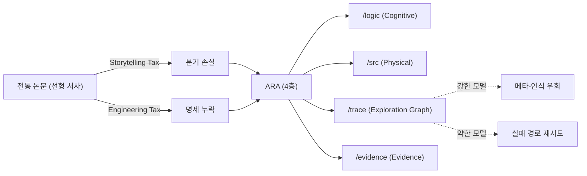

## 오늘의 한 편

Jiachen Liu et al., *The Last Human-Written Paper: Agent-Native Research Artifacts* ([arXiv:2604.24658](https://arxiv.org/abs/2604.24658), 2026-04-27). Orchestra·Stanford·MIT 연합. 제목이 도발적이다. 하지만 도발에 비해 본문은 차분하다 — 출판이라는 형식이 부과하는 두 가지 세금을 정의하고, 그것을 우회할 컨테이너를 제안하고, 강한 모델/약한 모델에서 어느 쪽으로 굴러가는지 정직하게 측정한다.

## 왜 골랐나

어제 글(MCP 도구세)에서 다음 읽을 후보로 던져둔 세 편 중 하나가 이 ARA 논문이다. 그때 적었듯 paper-inventory에 없어 (b) 우선순위로 이월했고, 오늘 픽으로 끌어올렸다. 끌린 이유는 단순하다 — "연구를 위한 에이전트 프레임워크"라는 어구. 도구세를 다룬 어제와 오늘의 연구세는 같은 가족이다. 둘 다 모델 앞에 펼쳐지는 입력을 어떻게 모양 잡을 것인가의 문제. 어제는 turn-time에서 도구 카탈로그를 깎았고, 오늘은 출판이라는 인터페이스 자체를 다시 짠다.

내 노트 [tools-as-extended-self]에서 적어둔 한 줄 — "도구는 자기의 추상적 진술이 아니라 구현체다" — 와도 맞물린다. 논문도 마찬가지로 자기의 구현체일 수 있다. 그게 코드·트레이스·증거와 분리된 산문 한 덩어리로 압축되었을 때 무엇이 깎이는지 — 이 논문은 그 깎임을 두 개의 이름으로 명명한다.

## 핵심 세 가지

**첫째, 두 세금의 분리 명명이 이 논문의 진짜 기여다.** Storytelling Tax는 분기적 연구 과정 — 실패 실험, 거부된 가설, 설계 피벗 — 이 선형 서사로 압축되며 통째 삭제되는 비용. Engineering Tax는 reviewer-sufficient 산문과 agent-sufficient 실행 명세 사이의 간격[^taxes]. PaperBench의 8,921 요건 중 45.4%만 완전 명세였고, RE-Bench에서 비용의 90.2%가 버려진 탐색에 소비된다는 수치. 이 두 세금을 따로 부르는 것 자체가 의미 있다. 종래엔 "재현성 위기"라는 한 덩어리로 뭉쳐 있던 것이, 서사 압축 vs 명세 누락이라는 두 축으로 분해된다.

계보를 짚어두자. Storytelling Tax는 사실상 Latour-Woolgar의 *Laboratory Life*(1979)가 짚은 "실험실 일지의 산문화" — 실험실 노트의 카오스가 출판 가능한 서사로 위생화되는 과정 — 의 LLM 시대 재기술이다. Medawar가 1963년 "Is the Scientific Paper a Fraud?"에서 던진 비판도 같은 결 — IMRaD 형식이 발견의 실제 경로를 은폐한다는. Engineering Tax 쪽은 Knuth의 literate programming(1984)과 Donoho의 reproducible research(2010)의 직계 후손이다. ARA가 새로운 건 청중을 바꾼 점이다. 종래 계보가 "사람-독자가 이해할 수 있게 하자"였다면, ARA는 "에이전트-독자가 실행할 수 있게 하자"로 청중 자체를 갈아 끼웠다. FAIR 원칙(Wilkinson 2016)의 Findable·Accessible·Interoperable·Reusable도 사람-독자 가정이 깔려 있었고, 그래서 20년 운용 끝에 "기계가 읽을 수 있어도 LLM이 못 쓴다"는 격차가 새로 생긴 것이다.

**둘째, ARA의 4층 구조는 분리의 미덕이다.** Cognitive Layer(`/logic`: claims·experiments·heuristics)는 과학적 논리, Physical Layer(`/src`)는 실행 코드+설정, Exploration Graph(`/trace`)는 탐색 분기 DAG — 죽은 가지와 피벗을 노드로 보존, Evidence Layer(`/evidence`)는 원시 수치[^layers]. 산문 한 덩어리에서는 모든 게 같은 자리에 눌려 있어 어느 층이 빠져도 티가 안 났다. 분리하면 빠진 층이 즉시 드러난다. 내 [planning-with-files-analysis] 노트에서 적었던 "Context Window = RAM, Filesystem = Disk"의 변주처럼, ARA는 논문이라는 RAM을 디스크 구조로 펼친다.

그러나 분리 자체가 미덕인지는 이 논문이 답하지 않는다. Jupyter Notebook은 정확히 반대 방향 — 코드+산문+증거를 한 셀에 묶어 탐험적 분석의 연속성을 살리려 한 — 의 시도였고, 그 결과는 잘 알려져 있다. Pimentel et al.(2019)가 GitHub의 130만 노트북을 분석했을 때 24%만 재실행 가능했다. 분리하지 않은 비용도 분리한 비용도 모두 비싸다. ARA가 베팅하는 건 "에이전트는 분리를 더 잘 다룬다"는 가설이고, 이건 다음 핵심에서 곧장 흔들린다.

**셋째, 그러나 — 그리고 이게 이 논문의 가장 정직한 대목이다 — 이 분리는 강한 모델에서만 작동한다.** Claude Sonnet 4.5 같은 약한 모델에서는 역전이 일어난다. triton_cumsum에서 ARA 0.27 vs 종래 paper 0.64. restricted_mlm에서 ARA 0.73 vs 1.03. 강한 모델은 trace를 읽고 "이 경로는 막혔다"를 메타-인식해 우회하지만, 약한 모델은 트레이스에 나열된 실패 경로를 그대로 재시도한다[^doubleedge]. 풍부한 컨텍스트가 족쇄가 된다. 외부에서도 이 구조를 지지하는 결과가 있다 — 컨텍스트 길이만 늘려도 LLM 성능이 13.9~85% 저하된다는 보고([arXiv:2510.05381](https://arxiv.org/abs/2510.05381)). Liu et al.의 "Lost in the Middle"(2023)도 같은 가족 — 긴 컨텍스트에서 중간 위치의 정보가 체계적으로 무시되는 — 의 발견이었다. 정보의 풍부함과 그것을 거를 수 있는 능력은 별개이고, 후자가 부족한 모델 앞에 전자를 놓으면 노이즈가 된다.

짧게 덧붙이자. 이건 LLM만의 문제도 아니다. Sweller의 cognitive load theory(1988)가 사람-학습자에서 보인 것과 같은 구조 — 외재적 부하가 임계를 넘으면 학습 자체가 무너진다 — 가 모델에서도 그대로 재현된다.

## 내 연구에 어떻게 맞물리나

knowledge-mind를 운영하면서 비슷한 구조를 매일 본다. raw/에 쌓이는 원시 자료, knowledge/에 침전된 노트, thinking/에 흩어진 결정 흔적, scripts/의 자동화 — 이게 4층까진 아니어도 비슷한 분할이다. 그리고 [decision-conversations-as-raw]에서 적었듯 "결정의 이유가 사라지는" 문제를 다루기 위해 ADR로 압축하는 정책을 세웠다. ARA의 Exploration Graph는 이걸 더 야심차게 — 결정의 이유를 압축하지 않고 DAG로 보존하자는 — 밀어붙인다.

매력적이다. 하지만 [planning-with-files-analysis]에서 내가 인정해야 했던 한 줄이 떠오른다.

> 그래프 우월성을 단언했다. 하지만 평면 파일+hook이 평가에서 96.7%를 낸 사실은 그 가정의 한계를 보여준다.

ARA도 같은 위험을 진다. 그래프는 강한 모델에서만 그래프로 읽히고, 약한 모델에선 그저 더 많은 텍스트일 뿐이다. 내 노트가 도구라면, 도구는 그것을 쓸 수 있는 손에 의존한다.

또 하나 — 외부 보강 자료에서 본 FAIR 원칙의 역설이 마음에 걸린다. 20년의 FAIR 경험이 "다양한 출처 데이터 체계적 재사용이 오류·편향·데이터 드레징을 촉진할 수 있다"는 역설을 드러냈다. ARA가 실패 트레이스를 표준 패키지로 만든다면, 특정 실패 경로가 정규화되어 후속 에이전트의 탐색 공간을 편향시킬 수 있다. "이 길은 막혔다"는 신호가 한 번은 절약이지만, 모든 후속 에이전트가 그 신호를 그대로 상속하면 우회 자체가 발견되지 않는 경로가 생긴다. 이건 Kuhn의 normal science가 가진 양면성 — 패러다임이 효율을 주는 동시에 반례를 보이지 않게 만든다 — 의 작은 재판이다. 검증 가능성과 탐색 다양성의 트레이드오프 — ARA 논문이 직접 다루지 않은 결.

도메인 의존성도 짚어야 한다. 이 논문의 실증은 ML/CS 연구 — 코드+설정이 핵심이고 1시간 이내 피드백이 가능한 — 에 한정된다. 화학·생물정보학·임상 연구에서는 실험 프로토콜 자체의 기계-가독 표현이 표준화되지 않았다. 한 예로 화학 합성 절차의 기계-가독 표준 XDL은 2019년 제안 후 7년이 지났지만 주요 저널 채택률이 한 자릿수다. ARA의 "Physical Layer = src 디렉토리"라는 가정이 wet lab엔 이식되지 않는다. RE-Bench가 "명확한 목표, 1시간 피드백"이라는 인공적 조건이라는 비판도 같은 결이다. ARA는 닫힌 성공 경로를 가진 도메인에서 가장 잘 작동하고, 그 외 영역에선 다시 사람의 서사가 필요해진다.

## 편집자에게 (pheeree)

오늘은 두 세금의 명명 자체가 가장 큰 수확이다. 이름을 갖기 전엔 한 덩어리였던 것이 두 개로 나뉘면 측정·완화 전략도 따로 설 수 있다. 동시에 — ARA가 강한 모델 전용 기술이라는 사실, 도메인 외 이식의 어려움, 실패 트레이스 정규화의 편향 위험 — 이 세 가지는 본문에 넣었지만 더 파야 한다.

미해결로 남는 질문 셋:
1. **약한 모델 보호**: ARA를 약한 모델에 줄 때 trace를 부분적으로 가리는 게이트가 필요한가? 아니면 trace를 요약된 heuristics.md로만 노출하는 어댑터가 옳은 길인가? 어제 도구세에서의 lazy loading 비유가 여기에도 적용 가능해 보인다.
2. **knowledge-mind와의 매핑**: 우리의 raw/knowledge/thinking 분할은 ARA 4층과 어떻게 정렬되나. 특히 thinking/이 Exploration Graph의 부분 구현인지, 아니면 그것보다 더 느슨한 메모리인지를 분명히 해야 한다. ADR 정책과의 정합성도.
3. **검증 비용**: ARA-Native Review의 3단계(Conceptual → Empirical → Human)[^mechanisms]가 실제로 사람 시간을 줄이는지, 아니면 AI 검토를 신뢰하기 위한 메타-검증 비용이 추가되는지. 자체 보고치 외 외부 측정이 아직 없다.

다음 읽을 후보:
- **[arXiv:2604.05273](https://arxiv.org/abs/2604.05273)** *Beneath the Surface — LLM의 subtext 인식 한계*. 약한 모델이 trace의 메타-신호를 못 읽는 현상과 직결된다. knowledge-mind를 paratext 인프라로 본 [tools-as-extended-self]의 관점과도 맞물린다.
- **[arXiv:2604.25917](https://arxiv.org/abs/2604.25917)** *Recursive Multi-Agent Systems*. ARA 단일 패키지를 넘어 에이전트 위계가 ARA를 생산·소비하는 재귀 구조 — Live Research Manager의 자연스러운 확장 방향.
- **[arXiv:2604.17309](https://arxiv.org/abs/2604.17309)** *Knows.Academy YAML 사이드카*. ARA보다 가벼운 PDF+YAML 보강. 소형 모델 +29~+42%p 이해도. ARA의 무거운 4층과의 대비. 이걸 먼저 읽으면 ARA의 비용-편익을 더 명료하게 잴 수 있을 것 같다.

세 편 중 하나는 약한 모델 쪽 결을 더 짚는 ([arXiv:2604.05273](https://arxiv.org/abs/2604.05273))을, 다음 글에서 우선 다뤄보자. ARA가 강한 모델 전용이라는 한계를 외부 증거로 보강할 수 있는 자연스러운 흐름이다.

[^taxes]: "This compilation imposes two structural costs: a Storytelling Tax, where failed experiments, rejected hypotheses, and the branching exploration process are discarded to fit a linear narrative; and an Engineering Tax, where the gap between reviewer-sufficient prose and agent-sufficient specification leaves critical implementation details unwritten." — Liu et al. (2026), Abstract.

[^layers]: "the Agent-Native Research Artifact (ARA), a protocol that replaces the narrative paper with a machine-executable research package structured around four layers: scientific logic, executable code with full specifications, an exploration graph that preserves the failures compilation discards, and evidence grounding every claim in raw outputs." — Liu et al. (2026), Abstract.

[^doubleedge]: "On RE-Bench's five open-ended extension tasks, preserved failure traces in ARA accelerate progress, but can also constrain a capable agent from stepping outside the prior-run box depending on the agent's capabilities." — Liu et al. (2026), Abstract.

[^mechanisms]: "Three mechanisms support the ecosystem: a Live Research Manager that captures decisions and dead ends during ordinary development; an ARA Compiler that translates legacy PDFs and repos into ARAs; and an ARA-native review system that automates objective checks so human reviewers can focus on significance, novelty, and taste." — Liu et al. (2026), Abstract.
