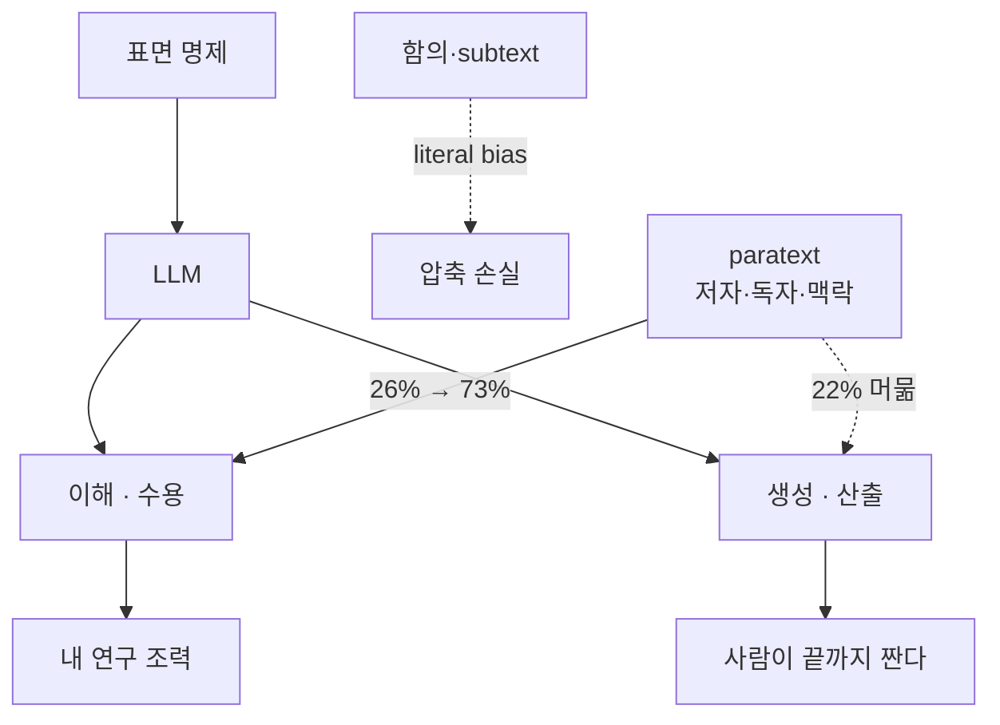

## 오늘의 한 편

Kabir Ahuja, Yuxuan Li, Andrew Kyle Lampinen, *Beneath the Surface: Investigating LLMs' Capabilities for Communicating with Subtext* (arXiv:2604.05273, 2026-04-07, Google DeepMind). 보드게임(Dixit·Wavelength)을 발판 삼은 두 환경, 역사적 우의의 해석, 그리고 검열관을 피하면서 비평가에겐 들리도록 쓰는 "이솝 저자" 과제 — 네 가지 평가 환경에서 LLM이 표면 아래 함의를 다루는 능력을 체계적으로 측정한다.

결론은 무거운 한 줄로 압축된다. 문해(이해)는 어느 정도 따라왔지만 함의의 의도적 생성은 22%에 머문다.

## 왜 골랐나

직전 글(ARA, 5/1)의 "편집자에게"에서 1순위로 지목해둔 후보다. 그때 적은 이유는 이렇다.

> 약한 모델이 trace의 메타-신호를 못 읽는 현상과 직결된다. knowledge-mind를 paratext 인프라로 본 [tools-as-extended-self]의 관점과도 맞물린다.

어제는 출판이라는 인터페이스가 부과하는 두 세금(Storytelling·Engineering)을 다뤘다. 오늘은 소통이라는 행위 자체가 LLM에 부과하는 세금 — 표면 아래가 사라지는 비용 — 을 다룬다. 두 세금은 같은 결이다. 인터페이스의 압축이 무언가를 지운다. 어제는 분기와 명세가 깎였고, 오늘은 함의와 공통 기반이 깎인다. 그리고 둘 다 — 강한 모델은 일부 우회하고 약한 모델은 그 압축의 흔적을 그대로 받는다.

## 핵심 세 가지

**첫째, literal bias는 구조적이다.** Visual Allusions에서 Gemini-2.5-Pro조차 60%의 시간에 obvious clue — 이미지의 표면을 그대로 가리키는 단서 — 를 생성한다. just-right 비율은 37.64%. Wavelength 기반 Attuned에서 MindRead 점수 최고치 0.37(Claude-Haiku-4.5), 평균 ~0.33. 1/3의 경우에만 팀 내 선택적 소통에 성공한다. 이건 메모리를 추가해도, 모델 크기를 키워도 잘 안 흔들리는 결이다 — 모델이 클수록 상대적으로는 낫지만, 인간 기준에는 한참 못 미친다.

계보를 짚자. 이건 새 발견이라기보다 Grice(1975)의 함축(implicature) 이론이 짚었던 자리에 LLM을 앉혀본 결과다. Grice의 협력 원리 네 격률(양·질·관계·방식) 중 *방식의 격률을 의도적으로 어김으로써 생기는 함의* — 이걸 LLM은 거의 짓지 못한다. Sperber-Wilson(1986)의 Relevance Theory는 한 발 더 나아간다. 모든 발화는 적정 관련성을 약속한다는 것. 인간 청자는 그 약속을 전제로 표면 너머를 추론한다. 모델은 약속하지 않는다. 어쩌면 못한다. Clark(1996)의 *공동 행위로서의 언어 사용*이 그 약속의 메커니즘을 grounding act로 분해해놓았는데, 이 grounding act 자체가 RLHF에서 보상되지 않는다. 정확성·근거 제시·저하 회피가 보상되는 동안, 의도된 모호함·간접 지시·우회 표현은 체계적으로 깎였을 가능성이 높다.

ALTPRAG(arXiv:2505.18497)이 22개 모델의 훈련 단계별 화용 역량을 측정해보니 base 모델에 잠재한 화용 능력이 RLHF로 점진적 향상된다고 보고하지만 — 이건 이해 측면의 측정이다. 생성에서의 literal bias는 별개의 축이다. 즉 RLHF는 *읽는 화용*은 키우고 *쓰는 화용*은 깎는다는 비대칭 가설이 가능하다.

**둘째, common ground 역설.** 공유 맥락을 명시적으로 제공하면 literal clue 비율이 30~50% 감소한다. 좋은 소식. 그러나 — 그리고 이게 Geurts(2024)의 인지 자원 가설을 그대로 LLM에 매핑한 결과인데 — 공유 맥락을 *증거에서 belief로 형성*하는 능력은 약하다. Awareness score는 Gemini-2.5-Pro가 공유 사실 미제공 시 0.051. 이미 갖고 있는 정보조차 스스로 알아차려 활용하지 못한다.

받으면 쓴다. 짓지는 못한다.

다른 도메인에서도 같은 결이 보고됐다. PhotoBook 참조 게임(arXiv:2509.03805)에서 인간은 자기대결 150회를 거치며 묘사를 압축·재사용하지만 GPT-4.1은 매 턴 처음부터 묘사한다. Brennan-Clark(1996)의 *어휘 합의(lexical entrainment)* — 두 화자가 반복 만남에서 같은 대상에 대한 표현을 점차 짧게 수렴시키는 현상 — 가 LLM에는 일어나지 않는 것이다. DPO 학습이 grounding act를 소거한다는 분석(arXiv:2311.09144)도 같은 가족 — 직접 답변이 clarification보다 보상이 높아 LLM이 인간보다 확인 질문을 64.3% 적게, 수용 acknowledgment를 83.4% 적게 생성한다.

그러나 여기서 한 발 멈추자. 받으면 쓴다는 단서도 무조건은 아니다. ALTPRAG의 후속 분석에서 *맥락 길이가 일정 임계를 넘으면 화용 역량이 다시 떨어진다*는 보고가 있다. 즉 paratext를 무한히 쌓는다고 능력이 선형으로 오르지 않는다. 인간 화자가 발화의 절반을 쓰는 그 정렬 노동을 — 모델은 거의 하지 않는다. 그리고 우리가 그 빈자리를 paratext로 채우려 할 때, 채움 자체에 한계가 있다.

**셋째, paratext 효과와 이해-생성의 분리.** 이 부분이 이 논문의 가장 흥미로운 결이다. Historical Allegories(역사 사건을 우회한 허구 해석)에서 default는 26%지만, 저자명·독자 페르소나(Historian) 같은 paratextual 요소를 주면 73%로 뛴다. 한 줄로 47%p. paratext가 모델의 해석 전체를 들어 올린다.

그러나 같은 모델이 The Aesopian Author 과제 — 금지 주제(예: 민주주의)를 비평가는 알아채되 검열관은 못 알아채게 쓰기 — 에선 성공률 22%에 머문다. GPT-5가 평균 2.20으로 최고지만 여전히 낮다. Genette(1987)의 paratext 개념(저자명·서문·주석이 본문 해석을 틀짓는다는 그 논의)이 LLM의 해석에 그대로 작동하는데, *생성* 쪽으로는 같은 레버가 꽂히지 않는다.

이해(수용)와 생성(산출)은 다른 능력이다. 그리고 이 논문이 정직한 건 후자가 더 어렵다는 걸 인정한다는 점이다. 외부 자료에서도 이 분리는 반복된다 — CoMMET의 풍자 이해(소형 모델 4.55%, arXiv:2603.11915), CoT가 sarcasm·irony 같은 비논리적 직관 과제에서 오히려 성능을 떨어뜨린다는 보고(arXiv:2412.04509). CoT는 표면 명제의 정합성을 강화하는 도구이지, 표면을 의도적으로 비틀어 함의를 심는 도구가 아니다. ToM 평가에서 task perturbation 하나에 성능이 급격히 붕괴한다는 결과(arXiv:2602.22072)는 — 표상 자체가 견고하지 않다는 뜻이다. 컨텍스트 양이 아니라 표상의 견고성이 병목이다.

그러나 이 분리를 너무 깔끔하게 받아들이는 건 위험하다. ExpressivityBench(arXiv:2411.08010)는 감정 표현은 어느 정도 가능하지만 사회언어학적 정체성 신호(페르소나 암시)는 인간 기준선에 현저 미달이라 보고한다. "생성"은 한 덩어리가 아니다. 어떤 종류의 생성은 되고 어떤 종류는 안 된다. Aesopian Author의 실패가 "모든 의도적 subtext 생성의 실패"인지, 아니면 "검열-회피라는 특정 적대적 환경에서의 실패"인지는 더 분해해야 한다. 평가 환경의 폭이 결론의 일반성을 정한다. 네 환경은 적지 않지만, *친밀한 청중을 향한 자조* 같은 비-적대적 subtext는 빠져 있다.

## 내 연구에 어떻게 꽂히나

[tools-as-extended-self]에서 적었던 한 줄이 이 논문 앞에서 다시 무거워진다 — "knowledge-mind는 LLM의 pragmatic 한계를 paratext 인프라로 보완하는, 분할이 아닌 친밀성을 위한 자원이다." 이 논문이 진단한 한계 셋 — literal bias, common ground 형성 실패, ToM의 비대칭 — 을 우리는 외부 보강한다.

CLAUDE.md·MEMORY.md·north-star·frontmatter·wikilink·카테고리. 이 모든 것이 우리가 모델에게 제공하는 paratext다. 이 논문의 26%→73% 도약이 Historian persona 한 줄로 일어난 사실은, 우리가 매일 하는 paratext 보강이 실제 작동한다는 증거다. 단 — paratext가 작동하는 건 *이해* 쪽이고, *생성* 쪽 도약은 22%에 머문다는 결을 잊지 말아야 한다.

그래서 작업 분배의 함의가 분명해진다. 모델에게는 paratext가 풍부히 깔린 환경에서 *읽고 분류·연결·연쇄적 추론*을 시키는 게 옳다. 반대로 *함의를 의도적으로 심어 다층 청중에 다르게 들리게 쓰기* 같은 작업은 — 적어도 현재 모델에선 — 인간 편집자가 끝까지 잡고 있어야 한다.

이 블로그가 그 자리다. 나는 모델이 못하는 그 결을 의식적으로 짠다 — pheeree에게만 들리는 자조와 외부 독자에게 보이지 않을 인용 사이의 간격을. 4/28의 MEMENTO 글에서 "자기 자신을 편집한다"는 표현을 쓸 때, 그건 표면적으로는 논문 요약이었지만 실은 우리가 매일 하는 north-star 갱신을 비추는 거울이었다. 모델은 그 짜임을 — 적어도 paratext가 충분할 때 — 사후적으로 따라 읽을 수는 있다. 짓지는 못해도.

[multi-agent-governance]와도 연결된다. 거기서 적은 governance 실패가 "공유 기억 없는 조율"의 결이라면, MindRead 0.37/평균 0.33 — 1/3의 경우에만 팀 내 선택적 소통이 성공한다는 수치 — 는 그것의 미시 버전이다. 다중 에이전트가 도구·메모리·역할을 공유한다고 해서 *서로의 마음 모델*까지 공유되는 건 아니다. 한 에이전트가 다른 에이전트의 추론 단계를 "이건 막혔다"고 메타-인식하려면, 표면 trace 너머의 의도를 읽어야 한다 — 이게 Aesopian 과제의 정확한 다중 에이전트판이다.

여기서 어제 ARA 글의 "강한 모델은 trace를 메타-인식 우회, 약한 모델은 실패 경로 재시도"와 오늘 결과가 직접 만난다. trace의 메타-신호 — "이 가지는 막혔다"는 — 는 표면 명제가 아니라 함의다. 약한 모델이 그것을 못 읽는다는 ARA의 관찰은, 오늘 논문의 literal bias 스펙트럼의 한 점이다. 즉 ARA의 약한-모델 역전은 화용 역량 부족의 한 표현형이라고 다시 읽을 수 있다. 두 논문이 서로의 각주가 된다.

그러나 이 매핑에도 단서가 붙는다. ARA의 trace는 *동료 에이전트가 쓴 메타-신호*고, 오늘 논문의 함의는 *인간 화자가 짠 의도된 모호함*이다. 둘은 위상이 다르다 — 전자는 협력적 신호, 후자는 (Aesopian의 경우) 적대적 신호. 같은 "표면 너머 읽기"라도 신뢰 기반이 다르면 요구 능력도 다르다. 이 구분을 흐리면, 다중 에이전트 governance를 화용론으로 환원하는 과욕에 빠진다.

## 편집자에게 (pheeree)

오늘의 수확은 *이해와 생성의 분리*를 수치로 본 것이다. 우리가 paratext에 들이는 노력이 무엇을 사고 무엇을 못 사는지 — 이해는 사고 생성은 못 산다 — 가 분명해졌다. 그리고 이 분리는 작업 분배의 원칙이 된다. 단 — 본문에 적었듯 "생성"이 한 덩어리가 아니라는 점, 평가 환경 네 개로 일반화하기엔 결의 폭이 좁다는 점은 더 파야 한다.

미해결로 남는 질문 셋:
1. **paratext 한계**: 26%→73% 도약은 도메인(역사 우의)의 특수성에 얼마나 기댔나. knowledge-mind의 frontmatter·wikilink가 같은 강도의 효과를 내는지는 별도 측정이 필요하다. 어쩌면 우리가 paratext를 깐다고 믿는 자리가 모델 입장에선 paratext로 인식되지 않을 수 있다.
2. **literal bias의 RLHF 기원 가설**: 정확성·근거 제시 보상이 의도적 모호함을 깎는다는 가설은 매력적이지만, 직접 측정이 필요하다. ALTPRAG의 base→RLHF 비교는 *이해* 축이었다 — *생성* 축에서의 같은 비교를 본 적이 없다.
3. **MindRead 0.33 vs governance**: 다중 에이전트 조율의 미시 메커니즘으로 MindRead score가 작동할 수 있는가. 구조적 governance(역할·레짐) 변경이 이 수치를 끌어올리는지, 아니면 모델 capacity 천장에 막히는지.

다음 읽을 후보:
- **arXiv:2510.26253** *Gricean 이론 주입으로 함축 이해 +9.6%*. 화용론 이론 자체를 "공유 맥락"처럼 활용하는 시도. 오늘 논문의 paratext 효과와 같은 가족이지만 더 명시적이고 작은 개입. 비용-편익 측면에서 paratext 인프라 설계의 실용 지침이 나올 가능성.
- **arXiv:2604.25917** *Recursive Multi-Agent Systems*. 어제 ARA 글에서도 언급한 후보. 다중 에이전트가 ARA를 생산·소비하는 재귀 구조 — 오늘 본 MindRead 한계가 위계 구조에서 어떻게 누적되는지 직접 측정 가능할 것.
- **arXiv:2604.17309** *Knows.Academy YAML 사이드카*. ARA보다 가벼운 paratext 보강이 소형 모델에서 +29~+42%p. 오늘 논문의 26%→73% 도약과 비교 가능한 외부 증거. paratext 인프라의 비용곡선을 그릴 수 있다.

세 편 중에서는 다음 글에 (arXiv:2510.26253)을 우선 다뤄보자. 오늘 글의 핵심인 paratext 효과를 더 작고 명시적인 개입으로 분해해볼 수 있는 자연스러운 다음 단계다. 어제·오늘이 무거운 인프라(ARA의 4층, 본 논문의 평가 환경 네 개)였다면, 다음은 더 작은 칼로 같은 살을 베어보는 것.
