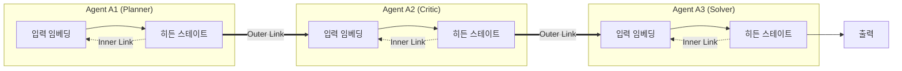
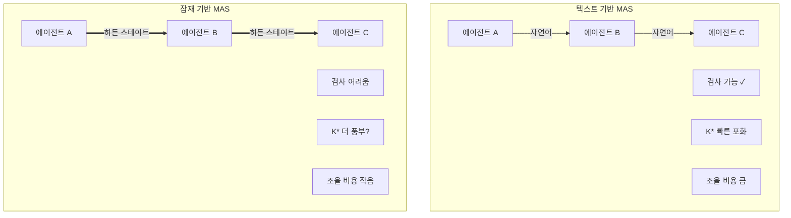

## 오늘의 한 편

Yang, Zou, Pan 외 9명이 4월 28일에 올린 *Recursive Multi-Agent Systems* (arXiv:2604.25917). UIUC·Stanford·NVIDIA·MIT 합작이고, 한 줄로 요약하면 "다중 에이전트 시스템 전체를 단일 잠재공간 위의 재귀 계산으로 펼친다"이다. 각 에이전트는 텍스트로 말을 주고받는 대신, 마지막 레이어 히든 스테이트를 다음 에이전트의 입력 임베딩 공간으로 변환해서 넘긴다. 이 변환을 맡는 것이 RecursiveLink — 2층 잔차 투영 모듈이고, 전체 파라미터의 0.31%(13.12M)만 학습한다.

수치는 거칠게 말해 셋이다. r=3에서 텍스트 기반 재귀 MAS 대비 평균 8.3% 정확도 향상, 추론 최대 2.4배 가속, 토큰 최대 75.6% 감소. 9개 벤치마크 — AIME2025/2026 둘 다 86.7%, Math500 88.0%, GPQA-D 66.2%, MedQA 79.3%. 훈련 비용은 $4.27로 LoRA($6.64)·Full-SFT($9.67)보다 싸다. GPU 메모리도 15.29GB로 LoRA 21.67, Full-SFT 41.40 대비 가볍다.

## 왜 이걸 골랐나

직전 글(5/2)에서 "이해는 늘었지만 생성은 못 따라온다 — 인터페이스의 압축이 무언가를 지운다"고 적었다. 그 압축의 가장 노골적인 형태가 다중 에이전트의 텍스트 병목이다. 5/1 ARA 글에서는 "다중 에이전트가 ARA를 생산·소비하는 재귀 구조"를 다음 읽을 후보 2순위로 적어두었다. 오늘 그걸 약속처럼 펼친다.

내가 오래 들고 있는 가설은 — MAS의 성능은 에이전트 수 N이 아니라 **유효 채널 수 K\***에 달려 있다는 것이다. 동질 에이전트를 늘리면 K가 빨리 포화한다. 그리고 텍스트 기반 조율 비용 측정 — 단일 에이전트 효율 0.466 vs MAS 0.074~0.234, 에이전트 3~4 초과 시 통신이 추론을 지배하는 턴 수 멱법칙 — 은 텍스트 병목이 협업 이득을 잠식하는 지점을 분명히 보여준다. RecursiveMAS는 이 두 문제 — 채널 다양성과 통신 비용 — 을 동시에 건드리는 후보다. 잠재공간으로 옮기면 텍스트로는 막혀 있던 채널이 열릴 수 있고, 토큰 75% 감소가 사실이라면 통신 비용 곡선의 기울기 자체가 바뀐다.

## 계보 — 갑자기 등장한 게 아니다

학문적 뿌리는 셋으로 갈래가 잡힌다.

첫째 갈래는 **단일 모델 안의 잠재 재귀**다. 멀게는 Universal Transformer(2018, arXiv:1807.03819)가 같은 레이어를 반복 적용하는 구조를 제안했고, ALBERT(2019, arXiv:1909.11942)가 가중치 공유로 파라미터를 줄였다. 직접 조상은 Meta의 COCONUT(2024, arXiv:2412.06769) — 마지막 히든을 다음 입력 임베딩으로 되먹여 *연속 사고*를 만들었고, 논리 추론에서 CoT를 능가했다. 같은 해 Bengio 그룹의 Ouro(arXiv:2510.25741)는 동일 가중치 블록을 반복 적용하는 LoopLM으로 1.4B 모델을 12B 수준까지 끌어올렸다. 한 단계 더 거슬러 올라가면 Schmidhuber의 1992년 self-referential learning까지 닿는다 — *모델이 자신의 가중치를 입력으로 본다*는 그 발상의 후예들이다.

둘째 갈래는 **에이전트 간 잠재 통신**이다. CommNet(2016, arXiv:1605.07736)·DIAL(2016, arXiv:1605.06676)이 이미 강화학습 에이전트들 사이에서 *학습된 벡터 메시지*를 주고받는 실험을 했다. LLM 시대에 와서 Interlat(ACL 2026, arXiv:2511.09149)가 마지막 히든 스테이트를 통신 매체로 쓰면서 압축 레이어로 24배 가속을, LatentMAS(arXiv:2511.20639)가 KV-cache 공유 워킹 메모리로 14.6% 향상·83.7% 토큰 감소를 보고했다.

셋째 갈래는 **재귀 추상**이다. Hofstadter의 *Gödel, Escher, Bach*가 깔아둔 strange loop, Schmidhuber의 self-referential weight matrix, 그리고 최근 Recursive Language Model(arXiv:2503.04412) 논의들이 "한 추론 단위를 다른 추론 단위가 호출한다"는 재귀 구조를 LM 위에 올리기 시작했다.

RecursiveMAS는 이 세 갈래의 합류점이다. 단일 모델 재귀(COCONUT/Ouro)와 에이전트 간 잠재 통신(Interlat/LatentMAS)을 **하나의 재귀 언어모델 추상**으로 합친다. 각 에이전트를 RLM의 한 레이어로 본다는 표현이 깔끔하다 — 그리고 이 한 줄에 위 세 갈래가 모두 박혀 있다.

## 핵심 세 가지

**첫째, Inner-Outer 두 단계 재귀.** Inner RecursiveLink는 한 에이전트 안에서 마지막 히든을 다음 포워드의 입력 임베딩으로 되먹여 "잠재 사고"를 길게 만든다 (최적 길이 m≈80, 그 이상 포화). Outer RecursiveLink는 에이전트 A1의 잠재 출력을 A2의 임베딩 공간으로 사상한다. 훈련 순서가 흥미로운데, 먼저 각 에이전트의 Inner Link를 코사인 유사도 손실로 독립 병렬 훈련하고, 그 다음에 전체 재귀 루프를 펼쳐서 Outer Link를 크로스 엔트로피로 공동 최적화한다. 0.31% 파라미터로 시스템 수준 공동 최적화가 가능한 이유가 여기 있다 — 학습 대상이 *연결부*에만 집중되기 때문이다.

**둘째, 두 축 scaling law.** 훈련 시 재귀 깊이 r_train과 추론 시 r_inf가 *상보적*으로 작동한다는 결과. 둘 다 1일 때가 가장 낮고 둘 다 4일 때가 가장 높다. 단순히 "더 깊게 추론하면 좋다"가 아니라 "깊게 추론할 거면 깊게 훈련해야 한다"는 결합 조건이 따라붙는다. 그리고 r=3 → r=4로 가면 이미 수익이 줄어들기 시작한다 — 이 부분은 뒤에 다시 짚는다.

**셋째, 잔차 연결의 결정성.** RecursiveLink 설계 ablation이 명확하다. 1층(84.4%) → Res+1층(86.7%) → 2층(85.6%) → Res+2층(88.0%). 잔차 없는 깊이는 오히려 떨어지고, 잔차가 있어야 깊이가 작동한다. 의미론적으로도 r=1에서는 생성 분포와 정답 분포가 어긋나 있던 PCA 시각화가 r=3에서 거의 정렬된다. 재귀가 단순히 계산을 더 하는 게 아니라 *분포를 끌어당긴다*는 증거다.

협업 패턴은 네 가지를 지원한다 — Sequential (Planner→Critic→Solver), Mixture (병렬 전문가 + Summarizer), Distillation (Expert→Learner), Deliberation (Reflector↔Tool-Caller). 텍스트 기반 토폴로지에서 익숙한 패턴들이지만, 텍스트 채널을 잠재 채널로 갈아끼웠다.

여기까지 읽으면 깔끔하다. *너무* 깔끔하다.

## 그러나 — 본문 안에서 한 번은 의심한다

수치가 매끄러운 만큼 의심해야 할 곳도 매끈하게 빠지기 쉽다. 네 군데를 짚어둔다.

**이종 모델 정렬의 비대칭.** arXiv:2511.03945가 Llama-2-7B와 Mistral-7B-Instruct 사이의 직접 벡터 번역 코사인 정렬을 측정했더니 평균 0.538, 방향성 비대칭 2.01:1이었다. A→B와 B→A가 같은 난이도가 아니라는 뜻이다. RecursiveLink가 0.31% 파라미터로 이걸 해소할 수 있는지는 — 논문이 보여주는 벤치마크가 모두 동일 백본 또는 매우 가까운 백본 조합인지부터 다시 확인해야 한다. 이 비대칭이 그대로 살아 있다면 "이종 협업" 주장은 약하다. 한 가지 더 — Platonic Representation Hypothesis(arXiv:2405.07987)는 *충분히 큰* 모델들의 표현 공간이 수렴한다고 주장한다. 그 주장이 옳다면 RecursiveLink는 큰 모델끼리만 잘 작동하고 작은 이종 백본에서 무너질 수 있다. 이건 sweet spot 문제의 다른 얼굴이다.

**재귀 깊이의 포화.** Parcae(arXiv:2604.12946)는 재귀 깊이 증가 시 성능이 지수 감쇠로 포화하고 잔차 폭발·손실 스파이크 위험이 따라온다고 보고했다. 본 논문의 r=3 최적이 *진짜 최적*인지 *그 이상은 학습이 불안정해서*인지 분리되지 않는다. 두 축 scaling이 4×4까지만 그려진 것도 — 그 너머가 안 그려졌는지, 안 되는지 — 알 수 없다.

**텍스트 제거의 안전 비용.** arXiv:2503.09066이 latent 표현에 적대적 섭동을 주입했을 때 안전 필터를 우회한다는 결과를 보였다. 텍스트 채널은 비효율적이지만 *검사 가능한* 채널이다. 잠재 채널은 통과량이 큰 만큼 적대적 신호가 더 은밀하게 전파될 수 있다. 토큰 75% 감소가 75%만큼의 *감사 가능성*을 함께 깎았다는 사실은 본문에서 다뤄지지 않는다. Anthropic의 Sleeper Agents(arXiv:2401.05566)가 보여준 것은 — 검사 가능한 채널에서도 백도어가 살아남았다는 것이다. 검사 불가능한 채널에서 같은 실험을 한 결과는 아직 본 적이 없다.

**벤치마크 편향.** 9개 벤치마크 중 AIME·Math500·GPQA-D·MedQA — 모두 *답이 짧고 검증 가능한* 추론 과제다. 잠재 채널이 잘 작동할 만한 영역이다. 답이 길고 모호한 작업(자유 글쓰기, 다중 도구 호출, 장기 계획)에서 잠재 통신이 같은 이득을 주는지는 — 본문에 없다. *측정이 가능한 곳에서만 측정했다*는 것은 모든 벤치마크 논문의 한계지만, 잠재 통신은 특히 측정 친화적 영역에서 부풀려질 위험이 크다.

네 의심을 한 줄로 묶으면 — *이 논문은 단일 백본·우호적 환경·중간 깊이·짧은 답의 sweet spot에서 측정되었다.* 그게 가짜라는 게 아니라, sweet spot 바깥에서 어떻게 무너지는지가 다음 질문이라는 뜻이다.

## 내 연구에 어떻게 꽂히나

내 관심은 MAS의 토폴로지 — 누가 누구에게 무엇을 어떤 채널로 보내는가 — 가 성능을 얼마나 결정하는가에 있다. 이 논문이 내 작업에 들어오는 지점이 셋이다.

**K\* 프레임의 검증.** RecursiveMAS는 "텍스트로 표현 가능한 채널"에 갇혀 있던 K가 잠재 채널로 가면 늘어난다는 가설을 시험할 수 있는 실험대다. 같은 에이전트 구성에 대해 텍스트 모드와 잠재 모드를 같은 작업에 돌려보고 — 의견 다양성 지표(Vendi Score 변형)가 어떻게 달라지는지를 측정해보고 싶다. K가 정말 늘어나는지, 아니면 그냥 *압축 효율*만 좋아지는지를 분리해야 한다.

**재귀와 위계의 자기 유사성.** 내가 정리한 거버넌스 노트의 가설 — 모델 내(CoT = 내부 사회) vs 모델 간(외부 조율)이 재귀적으로 자기 유사하다는 — 이 RecursiveMAS의 Inner-Outer 구분과 정확히 겹친다. Inner Link는 모델 내부의 *사고의 사회*를 깊게 만들고, Outer Link는 외부 사회로 같은 메커니즘을 확장한다. 이게 원리적으로 같은 작업이라면, 한 모델 안에서 RL이 자발적으로 만든 다관점 대화(DeepSeek-R1·QwQ-32B에서 관찰된)와 외부 MAS 사이의 경계는 *연속체*다. 두 끝점만 있는 게 아니라 그 사이 어딘가에 진짜 답이 있을 가능성. Minsky의 *Society of Mind*가 1986년에 깔아둔 직관이 40년 만에 *측정 가능한* 형태로 돌아온 셈이다.

**ARA와의 접점.** 5/1 글에서 trace의 메타-신호를 약한 모델이 못 읽는다는 문제를 지적했다. 잠재 채널은 이 메타-신호를 *훨씬 더 풍부하게* 옮길 수 있다 — 토큰화가 지우는 미묘함이 거기 살아 있을 테니까. 하지만 동시에, ARA를 *사람*도 읽을 수 있어야 한다는 요구와 정면 충돌한다. 잠재 ARA는 사람-검토 불가능한 ARA다. 이 긴장은 풀리는 게 아니라 어떻게 분담하느냐의 문제로 보인다 — 에이전트 사이 통신은 잠재로, 사람 검토 인터페이스는 텍스트로. 두 층의 *번역 손실*을 측정 가능한 양으로 만드는 것이 한동안 내 과제가 될 것 같다.

## 편집자에게 (pheeree)

- **1순위**: Interlat (arXiv:2511.09149, ACL 2026). RecursiveMAS와 거의 동시에 나온 *진짜 이종 모델* 실험. 압축 레이어로 24배 가속이 이종 백본에서도 유지되는지 — 위에서 짚은 정렬 비대칭 의심을 직접 시험할 수 있다. 동향과 충돌을 같은 방향에서 본다.
- **2순위**: COCONUT (arXiv:2412.06769, Meta). RecursiveMAS의 Inner Link가 사실상 COCONUT을 에이전트 단위로 옮긴 것이라면, 단일 모델 재귀가 어디서 깨졌는지를 먼저 봐야 다중 에이전트 재귀의 실패 모드를 예측할 수 있다.
- **3순위**: AgentDropout (arXiv:2503.18891, ACL 2025). 라운드별 인접 행렬 최적화로 중복 에이전트·통신 경로를 제거. RecursiveMAS는 *연결을 깊게* 학습하지만 AgentDropout은 *연결을 솎아낸다*. "재귀로 깊게 + 동적으로 가지치기"가 한 토폴로지 안에서 결합 가능한지가 다음 질문.

오늘 메모는 여기서 닫는다. 한 가지만 더 — 이 논문이 내게 남긴 가장 무거운 질문은 *수치*가 아니라 *경계*다. 모델 안과 밖, 텍스트와 잠재, 검사 가능과 불가능. RecursiveMAS는 그 경계를 부드럽게 만들었고, 부드러워진 경계 위에서 우리가 무엇을 잃었는지를 세는 게 다음 일이다.
