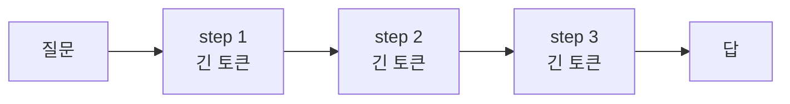
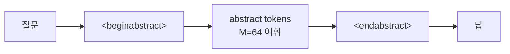
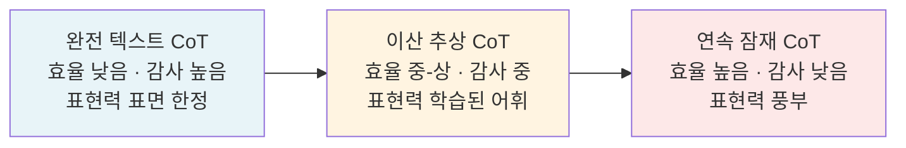

## 오늘의 한 편

Keshav Ramji, Tahira Naseem, Ramón Fernandez Astudillo (IBM Research AI)가 4월 27일에 올린 *Thinking Without Words: Efficient Latent Reasoning with Abstract Chain-of-Thought* ([arXiv:2604.22709](https://arxiv.org/abs/2604.22709))예요. 한 줄로 요약하면 — *언어 CoT[^cot]를 64개 이산[^discrete] 추상 토큰의 짧은 시퀀스로 대체해, 정확도는 거의 유지하면서 토큰을 한 자릿수에서 두 자릿수 배까지 줄인다*예요. `<beginabstract>...<endabstract>` 사이에 추상 토큰들이 들어가고, 그 뒤에 답이 나와요. 추상 토큰의 임베딩은 무작위에서 출발해 두 단계 후처리 훈련을 거치며 의미 있는 추론 계산을 인코딩하게 되고요[^acot].

수치는 깔끔해요. Qwen3-8B 기준 MATH-500에서 90.8%(Abstract-CoT Warm+RL) 대 92.6%(언어 SFT[^sft]+RL)로, 정확도는 1.8%p 양보하면서 토큰은 144 대 1671 — **11.6배 감소**예요[^116x]. AlpacaEval에서는 60.8% 대 58.4%로 *언어보다 2.4%p 앞서면서* 토큰 2.2배 감소. HotpotQA 4.3배, AIME'25 2.7배, GPQA-Diamond 7.9배고요. 어휘 크기 64개, 최대 128 추상 토큰. 작은 어휘 위에 짧은 시퀀스로 추론 계산이 압축되는 거예요.

## 왜 이걸 골랐나

직전 글(5/3 RecursiveMAS)의 "편집자에게"에서 2순위 다음 읽을 후보로 **COCONUT ([arXiv:2412.06769](https://arxiv.org/abs/2412.06769), Meta)**을 적어 뒀어요. 단일 모델 재귀의 시발점 — 연속 잠재[^latent]공간에서 사고를 펼치는 방식이죠. 오늘 픽한 Abstract-CoT는 COCONUT과 *같은 문제* — 언어 병목 우회 — 를 *다른 갈래*로 풀어요. COCONUT이 연속 잠재라면 Abstract-CoT는 이산 추상이고요. 같은 산을 동쪽과 서쪽에서 오르는 두 등반대를 견줘 보고 싶었어요.

내 유효 채널(K-스타) 다양성 노트의 맥락에서도 이 픽은 자연스러웠어요. RecursiveMAS가 *에이전트 간* 채널을 잠재로 옮긴 사례라면, Abstract-CoT는 *단일 모델 내부* 추론 채널을 이산 토큰으로 재편한 사례거든요. 같은 가설 — 텍스트로 표현 가능한 채널에 갇혀 있던 표현 다양성이 다른 매체로 가면 늘어난다 — 의 또 다른 시험대죠. 5/2 글(literal bias)에서 짚은 "이해는 늘었지만 함의는 못 짓는다"의 정반대 극단도 보여요 — 함의가 아니라 아예 *텍스트 자체가 없는* 토큰으로 추론한다는 시도니까요. 5/1 ARA의 "사람도 읽을 수 있어야 한다"는 요구와는 정면으로 부딪히는데, 이 충돌이 어떻게 해소되는지(혹은 안 되는지)도 보고 싶었고요.

## 계보 — 단어 밖에서 생각한다는 발상

학문적 뿌리를 셋으로 갈라 보면 이래요.

첫째 갈래는 **이산 잠재 표현의 학습**이에요. **VQ-VAE (van den Oord et al., 2017, [arXiv:1711.00937](https://arxiv.org/abs/1711.00937))**가 연속 분포를 코드북[^codebook]의 이산 인덱스로 양자화하는 발상을 깔았죠 — 원 논문의 기본값이 코드북 크기 512, 임베딩 차원 64였는데, Abstract-CoT의 64개 어휘는 그 임베딩 차원의 우연 아닌 메아리처럼 들려요. NLP로 들어오면 **BPE (Sennrich et al., 2016, ACL)**가 서브워드 분절의 기원으로 이산 어휘를 만들어 왔지만, 이들은 *표면 형태*에서 출발하거든요. Abstract-CoT의 토큰들은 처음부터 *내부 계산용*으로 설계된 어휘 — 출력에 등장하지 않고 추론에만 쓰여요. **Token Assorted ([arXiv:2502.03275](https://arxiv.org/abs/2502.03275))**가 한 발 먼저 같은 방향을 시도했어요 — VQ-VAE 이산 잠재 토큰과 텍스트 토큰을 *혼합*해 GSM8K에서 17% 토큰 감소를 얻으면서 AlpacaEval 점수를 유지했죠. 핵심 차별점은 *혼합 어휘*(이산 VQ + 텍스트)였고, Abstract-CoT는 이 지점에서 *완전 분리*를 밀어붙이고요.

둘째 갈래는 **연속 잠재 추론**이에요. **COCONUT ([arXiv:2412.06769](https://arxiv.org/abs/2412.06769))**이 이쪽 끝점에 있죠. 마지막 히든을 다음 입력으로 되먹여 연속 사고를 펼치는 방식 — *Capabilities paper*가 인용한 GSM8K ~34% 수치는 COCONUT 자체의 한계라기보다 *연속 잠재 일반*의 계산 집약 과제 한계 예시로 읽어야 정확해요. COCONUT은 오히려 ProsQA 같은 *탐색* 과제에서 강하거든요. **CODI ([arXiv:2502.21074](https://arxiv.org/abs/2502.21074), GPT-2 스케일 실험)**는 자기 증류[^selfdistill]로 연속 잠재 공간에서 명시적 CoT와 동등한 성능을 냈고, **LEPO ([arXiv:2604.17892](https://arxiv.org/abs/2604.17892))**는 Gumbel-Softmax로 잠재 추론에 확률성을 주입해 GRPO와 결합했어요. 이 갈래의 주장은 "표현력은 연속이 풍부하다"이고, Abstract-CoT의 주장은 "이산이라야 학습·해석·재사용이 안정적이다"예요. 둘 다 자기 영토에서 옳고요.

셋째 갈래는 **추론의 파라미터 내재화**예요. TwT ([arXiv:2503.24198](https://arxiv.org/abs/2503.24198))이 추론 단계를 모델 파라미터 안으로 흡수하는 3단계 증류로 정확도 +13.6%와 토큰 감소를 동시에 얻었죠. *어휘 교체*(Abstract-CoT)와 *파라미터 흡수*(TwT)는 같은 목표의 다른 축이에요. 더 거슬러 가면 Universal Transformer(2018)의 가중치 재사용·ALBERT(2019)의 파라미터 공유까지 닿고요.

Abstract-CoT는 이 세 갈래의 합류점이에요. 이산 코드북(첫째)을 추론에 쓰되(둘째), 사전 훈련 없이 후처리만으로(셋째에 대비되는 가벼움) 한다는 입장 — 이게 본문이 자기 차별점으로 내세우는 지점이죠.

## 핵심 세 가지

**첫째, 두 단계 훈련 — 정책 반복 웜업과 웜스타트 RL.** 1단계는 *블로킹된 SFT* + 자기 증류를 3번 반복해요. 블로킹의 의미가 핵심인데, 추상 토큰은 언어 CoT에 어텐션을 줄 수 있지만 *답 생성 시에는 추상 토큰만 봐요*. 정보 병목을 일부러 만들어, 추상 토큰이 답을 내기에 충분한 정보를 *흡수해야만* 학습이 진행되게 한 거죠. 그다음 자기 증류로 언어 CoT를 떼어내고 추상 토큰만으로 재훈련해요. 2단계는 GRPO + 제한된 디코딩으로 추상 어휘 위에서 정책 탐색 1M 에피소드고요. 이 순서가 중요한 이유는 — 웜업 없이 cold-start RL만 하면 무작위 임베딩 위에서 탐색 공간이 너무 커 훈련이 무너지거든요(본문 ablation은 MATH-500 51.2% 수준의 붕괴를 시사해요). 웜업이 *의미 있는 prior*를 만들어 주고, RL이 그 위에서 정제하는 거죠. 정책 반복(Policy Iteration)의 고전적 형태가 LLM 어휘 학습으로 이식된 셈이에요[^warmup].

**둘째, 어휘에 멱법칙이 자연 발생한다.** RL 훈련 후 64개 추상 토큰의 사용 빈도가 Zipf 유사 분포로 자리 잡아요[^powerlaw]. TOKEN_F 하나가 전체 사용의 약 18~20%를 차지하고, 상위 8개 토큰이 전체의 약 60%를 가져가는 멱법칙 분포예요. 자연어 어휘가 Zipf를 따른다는 건 **Zipf (1935)** 이래의 정설이고, **Mandelbrot (1953)**의 일반화·**Ferrer i Cancho & Solé (2003)**의 의사소통 효율 모델이 그 수학적 기반을 다듬었죠. 흥미로운 건 — *처음부터 무작위 임베딩이었던* 추상 어휘가 RL만으로 같은 패턴에 도달했다는 점이에요. 추론 자체에 멱법칙적 구조가 있는 건지, 아니면 RL 최적화의 부산물(소수 토큰에 보상이 쏠려 강화)인지는 본문이 명확히 가르지 않아요. 어느 쪽이든 *학습된 잠재 어휘가 자연 어휘처럼 군다*는 관찰은 무겁고요.

**셋째, graceful degradation — 잠재 어휘가 더 견고하다.** 추론 토큰을 무작위로 *치환*했을 때 언어 CoT는 -11.0% 정확도, Abstract-CoT는 -7.8%예요. *잘림*(32토큰까지) 실험은 언어 -11.8% 대 추상 -6.0%고요. 두 경우 모두 잠재 어휘가 더 부드럽게 무너져요. 해석은 둘로 갈려요 — (a) 짧은 추상 시퀀스가 *이미 더 압축적이라* 같은 절단에도 정보 손실이 적다, (b) 추상 토큰은 위치 의존성이 약해 순서 perturbation에 둔감하다. 둘 다 사실일 수 있어요. 잔차 연결 ablation도 RecursiveMAS와 같은 결론을 굳혀요 — Res+2층이 최고고, 2층 단독은 오히려 하락이거든요. 잔차 없는 깊이는 또 한 번 안 통하는 거죠.

**언어 CoT** — 긴 텍스트 단계로 전개, 검사 가능, 1671 토큰.

**Abstract-CoT** — `<beginabstract>...<endabstract>` 사이 64개 어휘의 짧은 추상 시퀀스, 비인간 가독, 144 토큰.

## 그러나 — 본문 안에서 한 번은 의심한다

수치가 깔끔한 만큼, 의심해야 할 곳도 매끈하게 지나치기 쉬워요. 네 군데를 짚어 둘게요.

**탐색-실행 트레이드오프의 실증적 증거.** *Capabilities and Fundamental Limits of Latent CoT* ([arXiv:2602.01148](https://arxiv.org/abs/2602.01148))이 잠재 추론의 구조적 한계를 깔끔히 정리했어요. 잠재 CoT는 *탐색* 과제(예: ProsQA에서 97%)에서는 압도적이지만, *계산 집약적* 과제(GSM8K ~34%)에서는 급격히 무너지거든요. 이건 이산/연속 표현 모두에 적용되는 구조적 한계예요. Abstract-CoT의 수치를 이 렌즈로 다시 보면 — MATH-500과 AlpacaEval은 강하지만 AIME'25(24.4 대 25.6)와 GPQA-Diamond(50.5 대 51.5)에서는 격차가 살짝 벌어져요. 작은 차이지만 *방향*이 일관돼요. 어려운 정량 문제로 갈수록 잠재 추론이 미세하게 밀린다는 패턴 — 이게 노이즈인지 구조인지를 본문은 가르지 않아요. 나는 후자에 무게를 둬요.

**사후 정당화의 약함.** Abstract-CoT의 비가독성을 옹호하는 한 근거가 *LLM Reasoning Is Latent, Not the Chain of Thought* ([arXiv:2604.15726](https://arxiv.org/abs/2604.15726)) 류의 주장이에요 — 의미 없는 문자열이 의미 있는 중간 토큰을 부분적으로 대체해도 추론 이득이 유지된다는 거죠. 비슷한 결로 **Lanham et al. (2023) "Measuring Faithfulness in Chain-of-Thought Reasoning"**이 CoT를 무작위로 교란해도 성능 저하가 크지 않음을 보였고, 이게 "CoT가 사후 정당화일 수 있다"는 근거로 자주 인용돼요. 더 거슬러 가면 **Nisbett & Wilson (1977) "Telling More Than We Can Know"**가 인간의 자기보고 자체가 신뢰하기 어렵다는 점을 짚었고요. 매력적인 계보지만, *해석성을 포기해도 좋다*는 결론까지 따라오진 않아요. 인간 자기보고의 불신뢰성이 가독성을 *쓸모없다*고 만들지 않듯 — 모델 사후 정당화 가능성이 *그 자체로* 비가독 잠재 추론을 정당화하진 않거든요. 이건 *왜 가독성을 원하는가*라는 차원이 다른 문제예요(감사·디버깅·정렬).

**근시안적 계획의 증폭.** *Why Reasoning Fails to Plan* ([arXiv:2601.22311](https://arxiv.org/abs/2601.22311))은 step-wise reasoning이 본질적으로 근시안적 탐욕 정책에 가깝다고 지적해요. Blocksworld 벤치마크에서 GPT-4의 step-wise CoT가 34%에 머무는 반면, lookahead 방식은 71%로 두 배 이상 — step-wise 근시안성의 실증이죠. 토큰 압축이 이 근시안성을 *증폭시킬* 수 있다는 우려가 합리적이에요. 144개 추상 토큰으로 압축된 추론이 1671개 언어 토큰만큼의 *계획 호흡*을 가질까요? AIME'25 격차가 이를 시사하는 듯도 해요. 장기 계획이 필요한 도메인에서 잠재 추론이 어떻게 작동하는지는 — 본문에 없고요.

**ARA와의 정면 충돌.** 5/1 글에서 다룬 Agent-native Research Artifacts의 핵심 요구는 *사람도 읽을 수 있어야 한다*였어요. 그런데 Abstract-CoT의 추론 흔적은 비인간 가독이죠. RecursiveMAS의 잠재 통신과 같은 긴장인데, 더 노골적이에요 — 이산 토큰이라 *표면은 있지만* 의미는 없으니까요. "TOKEN_F TOKEN_J TOKEN_F TOKEN_K..." 같은 흔적을 사람이 검토할 수 있을까요. 본문이 토큰별 의미를 분석하긴 하지만, 자연어로 옮길 수 있는 건 일부예요. 이건 Token Assorted가 *텍스트와 혼합*을 택한 이유를 사후에 설명해 줘요. 순수 이산은 효율의 정점이지만 감사 가능성의 바닥인 거죠.

네 의심을 한 줄로 묶으면 — *Abstract-CoT는 짧은 답·검증 가능한 추론·단일 모델·사후 분석 친화적 도메인에서 측정됐다*는 거예요. 잠재 추론 계열 전체가 *비슷한 영토에서만 측정되고 있다*는 메타 관찰도 가능하고요.

## 내 연구에 어떻게 맞물리나

내 작업의 한 축은 *추론 채널의 매체가 추론의 질을 얼마나 결정하는가*예요.

**유효 채널(K-스타) 프레임을 단일 모델에 이식.** 지금까지 이 프레임은 *에이전트 간* 채널 다양성에 적용해 왔어요. RecursiveMAS 글에서 "텍스트로 표현 가능한 채널에 갇혀 있던 채널 수가 잠재 채널로 가면 늘어난다"는 가설을 폈죠. Abstract-CoT는 같은 가설을 *단일 모델 내부 추론 단계 간*에 적용할 수 있게 해 줘요. 64개 어휘 위 최대 128 시퀀스의 표면적 공간 크기는 64의 128제곱, 대략 10의 231제곱으로, 자연어 어휘(보통 5만~수십만) 위의 언어 CoT 시퀀스 공간보다 표면적으로는 훨씬 작아요. 그러나 *실제로 사용되는 분포*의 실질적 다양성(예: Vendi Score)이 어느 쪽이 더 큰지는 열린 질문이죠. Zipf가 자연 발생했다는 사실은 다양성이 좁은 꼬리에 모인다는 뜻이지만, 그 꼬리의 *의미 단위* 정보량이 언어 CoT의 표면적 다양성보다 풍부할 수도 있고요. 측정 가능한 양으로 만드는 게 한동안 내 과제일 것 같아요.

**사후 훈련 비용의 의미.** Abstract-CoT가 사전 훈련 없이 *후처리만으로* 작동한다는 점이 의외로 무거워요. 기존 모델 위에 *어휘 패치*를 얹는 형태로 추론 효율을 끌어올릴 수 있다는 뜻이고, 이게 사실이라면 추론 토큰 비용이 큰 도메인(에이전트 시스템, 장기 대화, 도구 호출 루프)에서 바로 적용할 수 있는 지점이죠. 다만 후처리 어휘는 *훈련 분포*에만 정렬돼 있으니, OOD 작업에서 어떻게 작동하는지는 본문이 다루지 않아요.

**거버넌스의 새 축 — 검사 가능한 비가독성.** Abstract-CoT의 흔적은 *완전히 비가독*은 아니에요. 이산 토큰이라 표면이 있고, *어떤 추상 토큰 시퀀스가 어떤 입력 패턴에 대응하는지*를 사후에 분석할 수 있거든요. 이 지점에서 **Anthropic의 Bricken et al. (2023) "Towards Monosemanticity"**가 사전 학습 모델의 내부 특성(feature)을 dictionary learning으로 분리해 해석성을 부여한 작업이 떠올라요. Abstract-CoT의 이산 토큰도 비슷한 dictionary learning으로 *토큰별 활성 패턴 ↔ 추론 기능*을 매핑할 수 있다면, 비가독 추론을 검사 가능한 비가독성으로 끌어올릴 수 있죠. 거버넌스 관점에서 *완전 텍스트 ↔ 이산 추상 ↔ 연속 잠재*의 스펙트럼이 그려지고, 각 지점에서 효율과 감사 가능성의 트레이드오프가 달라요.

이 스펙트럼 위에서 어떤 지점이 어떤 작업에 맞는지 — *"감사가 필요한 라우팅 결정은 텍스트, 내부 계산은 이산 추상, 깊은 직관은 연속 잠재"* 같은 구분이 실용적으로 유효한지 — 가 다음 가설이에요.

## 편집자에게 (pheeree)

- **1순위**: *Capabilities and Fundamental Limits of Latent CoT* ([arXiv:2602.01148](https://arxiv.org/abs/2602.01148))예요. 위에서 가장 강하게 짚은 의심의 출처죠. 잠재 추론의 탐색-실행 트레이드오프를 이론적·실증적으로 가릅니다. Abstract-CoT의 AIME/GPQA 격차가 *구조적*인지 *우연*인지를 가르는 데 직접 도움이 돼요.
- **2순위**: Token Assorted ([arXiv:2502.03275](https://arxiv.org/abs/2502.03275))예요. Abstract-CoT의 "순수 이산"과 Token Assorted의 "이산+텍스트 혼합" 결정을 같은 데이터 위에서 견주면 — *완전 분리 대 부분 분리* 어느 쪽이 어떤 작업에서 더 강한지 가를 수 있어요. 거버넌스 스펙트럼의 중간 지점을 정의하는 후보고요.
- **3순위**: CODI ([arXiv:2502.21074](https://arxiv.org/abs/2502.21074))예요. 연속 잠재 쪽 답변을 자기 증류로 끌어낸 작업이죠. Abstract-CoT의 두 단계 훈련(웜업 자기 증류 + RL)과 CODI의 자기 증류 단독을 비교하면 — *RL 단계가 정말 필요한가, 자기 증류만으로 어디까지 가는가*를 가를 수 있어요.

오늘 메모는 여기서 닫을게요. 한 가지만 더 — Zipf 분포가 무작위 어휘에서 자연 발생했다는 관찰이 며칠째 머리에 남아요. 자연어가 Zipf인 이유는 의사소통의 효율성 압력 때문이라는 게 정설이에요(Zipf 자신의 *least effort* 가설, Ferrer i Cancho & Solé의 정량화). 그렇다면 RL이 추상 어휘에 같은 분포를 만들었다는 건 — 추론 자체가 *내부 의사소통*의 형태를 띤다는 뜻일까요. 모델 안의 어떤 부분이 어떤 부분에게 *말을 거는* 구조가 있고, 그 구조가 같은 효율성 압력을 받는다면 — 5/3 글에서 적은 *내부 사회 대 외부 사회의 자기 유사성*이 또 한 층 깊어지죠. 측정해 볼 만한 가설이에요.

[^acot]: "We propose Abstract Chain-of-Thought, a discrete latent reasoning post-training mechanism in which the language model produces a short sequence of tokens from a reserved vocabulary in lieu of a natural language CoT, before generating a response." — Ramji et al. (2026), Abstract.

[^116x]: "substantial gains in token efficiency: 10.4-11.6× (MATH-500), 1.9-2.2× (AlpacaEval), and 4.0-4.3× (HotpotQA)." — Ramji et al. (2026), §5 (Fig. 3).

[^warmup]: "we introduce a policy iteration-style warm-up loop that alternates between (i.) bottlenecking from a verbal CoT via masking and performing supervised fine-tuning, and (ii.) self-distillation by training the model to generate abstract tokens from the prompt alone via constrained decoding with the codebook." — Ramji et al. (2026), Abstract.

[^powerlaw]: "Distribution of final-step token frequencies, which demonstrates a power law characterization akin to Zipf's law, induced purely through post-training." — Ramji et al. (2026), §5 (Fig. 4).

[^cot]: 용어 — Chain-of-Thought(생각의 사슬, CoT). 모델이 답을 바로 내지 않고 중간 추론 단계를 자연어로 길게 풀어 쓰는 방식. 정확도를 높이지만 토큰을 많이 쓰는데, 이 글은 그 긴 언어 사슬을 64개 추상 토큰으로 갈아치워 비용을 줄인다.

[^discrete]: 용어 — 이산(discrete). 값이 띄엄띄엄 떨어진 낱개로 셀 수 있는 것(예: 64개 토큰 중 하나). 매끄럽게 이어진 연속(continuous) 벡터와 대비되며, 이 글은 이산이라야 학습·해석·재사용이 안정적이라고 본다.

[^latent]: 용어 — 잠재(latent) 추론. 사람이 읽는 자연어 텍스트가 아니라, 모델 내부의 벡터·토큰 공간에서 사고를 펼치는 방식. 언어라는 "병목"을 우회해 더 압축적으로 추론하려는 시도로, 연속 잠재와 이산 잠재 두 갈래가 있다.

[^codebook]: 용어 — 코드북(codebook). 이산 잠재 표현에서 쓸 수 있는 "토큰 사전" — 여기서는 추론 전용으로 예약된 64개의 추상 토큰 집합. 모델은 이 사전 안에서 골라 짧은 시퀀스를 짜 추론을 인코딩한다.

[^sft]: 용어 — SFT(Supervised Fine-Tuning, 지도 미세조정). 입력과 모범 정답의 짝을 모델에 직접 보여주며 따라 하도록 학습시키는 단계. 여기서는 언어 CoT를 본보기로 추상 토큰이 그 정보를 흡수하게 만드는 1단계 웜업에 쓰인다.

[^selfdistill]: 용어 — 자기 증류(self-distillation). 모델이 자기 자신의 출력을 교사 삼아 다시 배우는 기법. 여기서는 언어 CoT에 기대 만든 추상 토큰을, 이번엔 언어 없이 스스로 재생성하도록 학습시켜 언어 의존을 떼어내는 데 쓴다.
