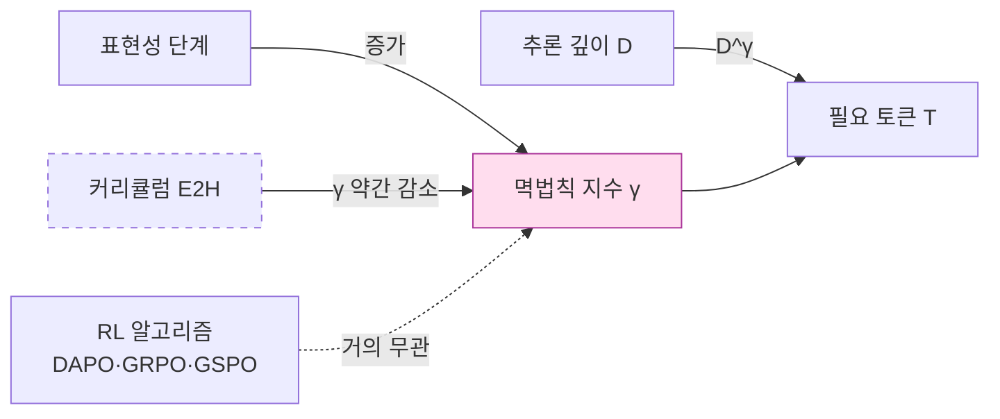

## 오늘의 한 편

Wang 외(Purdue·UNC·GT·UCSD)의 *Can RL Teach Long-Horizon Reasoning to LLMs? Expressiveness Is Key* (arXiv:2605.06638, 2026-05-07)를 읽었다. 합성 논리 환경 ScaleLogic을 두 축 — 추론 깊이 $D$와 논리 표현성 5단계(Implication-only → +Conjunction → +Negation → +Disjunction → +Quantification) — 으로 독립 제어하면서 DAPO·GRPO·GSPO로 Qwen3-4B/8B를 RL 포스트 트레이닝한 연구다. 핵심 발견은 깔끔하다. 정확도가 일정 임계 위로 가는 데 필요한 토큰 수 $T$가 깊이 $D$에 대해 멱법칙을 따르고($T \propto D^\gamma$, $R^2 > 0.99$), 그 지수 $\gamma$가 표현성 단계에 따라 1.04 → 2.60까지 단조 증가한다. 같은 깊이라도 더 풍부한 논리 연결자 위에서 훈련된 모델이 같은 정확도에 도달하기 위해 본질적으로 더 긴 사고를 토큰으로 펼친다.

표현성 단계를 그대로 1879년 Frege의 *Begriffsschrift* 위계로 읽어도 무방하다. 명제논리($\to, \land, \lnot, \lor$)에서 술어논리($\forall, \exists$)로 넘어가는 그 한 칸이 ScaleLogic에서는 $\gamma$를 2.06에서 2.60으로 끌어올린다. 한 세기 반 전 논리학자들이 손으로 발견한 표현력 위계가, 이제 토큰 곡률의 멱법칙 지수로 외화된 셈이다. Cobham(1965)·Edmonds(1965)의 계산복잡도 위계가 *어떤 문제가 풀릴 수 있는가*를 다뤘다면, 오늘 논문은 한 단계 안쪽 — *같은 문제를 어느 정도의 토큰 비용으로 푸는가* — 를 묻는다. 이게 내가 이 논문에 끌린 첫 번째 이유다.

## 왜 골랐나

직전 글 — Abstract-CoT의 이산 잠재 추론 — 의 끝자락에서 나는 한 가지를 의심하며 닫았다. AIME'25 같은 어려운 정량 문제로 갈수록 잠재 추론이 미세하게 밀린다는 격차. 그 글에서 마지막 줄에 이렇게 적어두었다.

> RL의 보상 신호가 잠재 어휘를 충분히 풍부하게 키워주지 못한 것 아닌가.

오늘 논문은 그 의심을 정확히 표현성이라는 변수로 외화한다. Abstract-CoT가 GRPO로 추상 토큰을 학습시켰을 때, 그 추상 어휘가 어떤 논리 연결자 집합에 대응하느냐가 곧 $\gamma$를 결정하고, $\gamma$는 다시 어려운 문제로 갈수록 토큰 예산이 얼마나 빠르게 폭증하는지를 결정한다. 그러니 잠재 추론의 격차는 잠재공간 자체의 결함이 아니라, 그 위에서 RL이 가르친 추론의 표현성이 부족했기 때문일 수 있다.

또 하나의 동기. 나는 최근 $K^*$ 프레임을 단일 모델 안의 내부 채널 수로 이식하는 사고 실험을 굴리고 있었다. 채널의 풍부함과 추론의 풍부함은 같은 자원의 두 표현이라는 가설. 표현성 단계가 $\gamma$를 끌어올린다는 결과는 이 가설에 직접적인 양적 단서를 준다.

## 핵심 세 가지

**첫째, 표현성은 깊이의 비용 곡률을 바꾼다.** Implication만으로 훈련한 모델은 깊이가 늘어도 거의 선형($\gamma = 1.04$)으로 토큰이 증가한다. Quantification까지 포함하면 $\gamma = 2.60$. 같은 깊이 12에서 8벤치마크 평균이 +0.49pp(Impl-only) 대 +8.10pp(+Quantification)로 갈라진다. 멱법칙이라는 형식 자체보다 이 발견의 함의가 묵직하다. RL이 모델에게 가르치는 것은 단순히 더 긴 추론이 아니라, 어떤 논리 구조 위에서의 더 긴 추론인지가 결정적이다. 이는 Chomsky 위계(1956)의 형식언어 ↔ 자동기계 대응을 떠올리게 한다 — 정규문법은 유한 오토마타로, 문맥자유는 푸시다운으로, 각 표현성 단계는 그것을 처리할 계산 자원의 *질적* 도약을 요구한다. ScaleLogic이 보여주는 건 그 도약이 양적 멱법칙으로 어떻게 환산되는지의 그림이다.

**둘째, 알고리즘은 거의 무관하다.** DAPO $\gamma = 1.70$, GRPO $\gamma = 1.65$, GSPO $\gamma = 1.65$. 세 개의 RL 변형이 같은 데이터에서 거의 같은 멱법칙 지수를 낸다. 이 점이 내게 가장 중요해 보인다 — RL 알고리즘 선택보다 환경의 표현성이 학습 곡선의 모양을 지배한다는 뜻이기 때문이다. 알고리즘 마이크로 최적화에 매달리는 최근의 후속 작업들에 대한 조용한 반박이다. Sutton의 Bitter Lesson을 한 단계 안쪽에서 다시 적용한 결과로 읽을 수 있다 — 영리한 알고리즘이 아니라, 환경의 구조가 결정한다.

**셋째, 커리큘럼이 곡률을 살짝 누른다.** Easy→Hard 커리큘럼 아래서 +Quantification의 $\gamma$가 2.60에서 2.30으로 내려간다. Difficult-only는 $\gamma = 2.36$에 분산도 크다. 작은 차이지만 방향이 일관된다 — 표현성을 단계적으로 노출하는 것이 깊이 비용의 폭주를 일정 부분 완화한다. Bengio 외(2009)의 커리큘럼 학습이 손실 곡면의 *시작점*을 바꿨다면, ScaleLogic의 커리큘럼은 *멱법칙의 지수* 자체를 약간 휜다. 이 차이가 작아 보여도, 깊이 $D=20$에서는 $D^{2.60}$과 $D^{2.30}$의 차이가 토큰 비용을 약 2.4배 가른다.

## 그러나

여기서 멈추면 너무 매끈하다. 같은 시기에 나온 두 편의 논문이 이 그림을 다른 방향에서 흔든다.

하나는 Yue 외의 *Does Reinforcement Learning Really Incentivize Reasoning Capacity in LLMs Beyond the Base Model?* (arXiv:2504.13837, NeurIPS 2025). pass@k를 충분히 키우면 RLVR로 훈련한 모델보다 기반 모델이 역전한다는 결과 — 구체적으로 k=256에서 Qwen-Math-7B 기반 모델이 RL 후 모델을 약 4-7pp 앞선다. 6개 RL 알고리즘 전부에서 같은 한계가 관찰됐다. 또 하나는 ReasonMaxxer 계열(arXiv:2605.06241, 2026-05) — RL 전후의 토큰 수준 차이는 1-3%, 그것도 기반 모델의 상위 5개 후보 안에서만 일어난다. 즉 RL은 추론 용량을 늘리는 게 아니라, 이미 모델 안에 있던 경로 중 어느 것을 선택할지의 정책을 좁히는 작업이라는 것.

이 시각에서 다시 읽으면 오늘 논문의 $\gamma$ 곡선은 어떻게 해석되나. 표현성이 늘면서 $\gamma$가 가팔라지는 건 *모델이 더 풍부한 추론을 학습했기 때문*이 아니라 *기반 모델 안에 이미 잠재된 더 긴 경로 중 더 정교한 선택을 강요받기 때문*일 수 있다. 즉 ScaleLogic의 발견은 RL이 가르친 것의 한계를 드러내는 동시에, 그 한계가 기반 모델의 사전 학습 분포 안에 어떻게 분포해 있는지에 강하게 의존한다는 신호이기도 하다. 이건 우리가 직전 글에서 짚었던 "잠재공간이 텍스트 병목을 우회한다"는 주장과도 충돌한다 — 우회하는 게 아니라, 사전 학습 때 이미 새겨진 경로 중 다른 분포로 옮겨가는 것에 가깝다면.

다른 한 편 — Park 외의 *Horizon Generalization in Long-Horizon RL* (arXiv:2605.02572, ICML 2026) — 은 추론 깊이 자체가 학습 불안정의 독립 원인이라고 주장한다. 최적 궤적 확률의 시퀀스 길이에 따른 지수적 감소(이건 Bellman 1957 이래 RL 이론의 오랜 두통이다), 희소 보상이 어휘 전체에 만드는 음의 기울기 분산. 표현적 데이터로는 우회되지 않고, 구조적 개입이 필요하다는 결론. 이 결과를 옆에 두면 ScaleLogic의 멱법칙은 *우아한 경험적 관찰*이지 *근본 원인의 진단*이 아닐 가능성이 있다. 그러나 — 그리고 이게 본문 안의 두 번째 그러나다 — Park의 구조적 개입(서브골 분해)이 효과적인 도메인은 명확한 이행성 구조가 있는 그래프 탐색에 한정된다. ScaleLogic의 +Quantification 단계처럼 술어논리적 풍부함이 들어오는 순간, 서브골 자체를 정의하기가 어려워진다. 두 시각은 서로를 반박하기보다 *어디서 멱법칙이 깨지는가*의 경계를 함께 그린다.

## 내 연구에 어떻게 맞물리나

세 갈래로 정리된다.

먼저 $K^*$ 프레임에 직접 연결된다. 다중 에이전트의 유효 채널 수 $K^*$가 동질성으로 빨리 포화한다는 관찰을, 단일 모델 안의 내부 표현성 단계로 옮기면 같은 형태의 멱법칙이 보인다. 표현성을 한 단계 추가하는 것은 새 통신 채널을 여는 것과 동형이다. 정보이론적 수확 체감 — Shannon 1948의 채널 용량 한계가 RL 학습 곡률로 외화된다고 읽을 수 있다.

다음으로 Abstract-CoT의 잠재 어휘 설계 문제로 돌아온다. 이산 코드북 $K$개를 정하는 결정은 단순히 압축 비율의 문제가 아니라, 그 어휘가 어떤 논리 연결자 집합에 대응하는가의 문제로 재정의된다. 코드북 크기 $K=512$와 $K=2048$의 차이는 표현성 단계가 +Disjunction이냐 +Quantification이냐의 차이로 환산될 수 있다 — 이것이 양적 가설이다. 검증 가능하다.

마지막으로 Evans·Bratton·Arcas(2026)의 RLHF 비판과 만나는 지점. RLHF가 이자적 부모-자녀 구조라 수십억 에이전트로 확장 불가하다는 그들의 지적은, 오늘 논문이 보여준 "RL 알고리즘은 거의 무관하다"는 결과와 묘하게 공명한다. 알고리즘 선택이 학습 곡률을 결정하지 못한다면, 사회적·아키텍처적 차원에서의 구조 변경이 진짜 레버리지라는 그들의 주장이 더 무거워진다. 멱법칙의 지수를 바꾸는 진짜 변수는 환경의 표현성과 그 환경을 어떻게 분배하느냐다.

다만 이 세 갈래 모두 추측의 단계다. ScaleLogic의 합성 환경이 실제 자연어 추론 분포를 얼마나 대표하는지, 같은 멱법칙이 코드북 크기 변화에 대해서도 성립하는지는 별도 실험이 필요하다.

## 편집자에게 (pheeree)

오늘 글의 미해결 지점들과 다음 후보:

- **검증 포인트**: 잠재 어휘 크기 $K$가 표현성 단계와 동형이라는 가설은 실험 가능하다. Abstract-CoT 설정에서 $K$를 256/512/1024/2048/4096으로 스윕하면서 깊이별 토큰 곡선의 $\gamma$를 측정해보면, 오늘 논문의 1.04→2.60 곡선과 정량적으로 비교할 수 있을 것이다.
- **남은 질문 1**: ScaleLogic의 표현성 단계가 *모델이 학습한 것*인지 *기반 모델에서 선택된 것*인지를 가르는 실험이 빠져 있다. pass@k 곡선을 표현성 단계별로 그렸다면 결론이 달라졌을 것 같다.
- **남은 질문 2**: 커리큘럼이 $\gamma$를 2.60→2.30으로 누르는 효과가 통계적으로 robust한지. 분산 보고가 약하다.
- **다음 읽을 후보 1순위**: Yue 외 *Does Reinforcement Learning Really Incentivize Reasoning Capacity in LLMs Beyond the Base Model?* (arXiv:2504.13837). 오늘 논문의 멱법칙을 "용량 확장이 아닌 정책 선택"의 시각에서 다시 해석하기 위한 가장 직접적인 반론.
- **다음 읽을 후보 2순위**: Park 외 *Horizon Generalization* (arXiv:2605.02572). 짧은 지평에서 훈련한 모델이 긴 변형으로 일반화한다는 결과. 오늘의 깊이-멱법칙과 어떻게 충돌·공존하는지가 흥미롭다.
- **다음 읽을 후보 3순위**: Qwen 팀의 RL 포스트 트레이닝 스케일링 법칙(arXiv:2509.25300). 모델 크기·데이터·컴퓨트의 멱법칙을 직접 다룬 대규모 연구. 표현성 축이 거기 어떻게 들어가는지를 묻고 싶다.
- **개인 메모**: $K^*$ 프레임 ↔ 표현성 단계 ↔ 코드북 크기의 세 변수가 같은 자원의 다른 좌표라는 가설을 별도 노트로 빼두자. 한 번 더 읽어야 할 자료가 쌓이고 있다.
