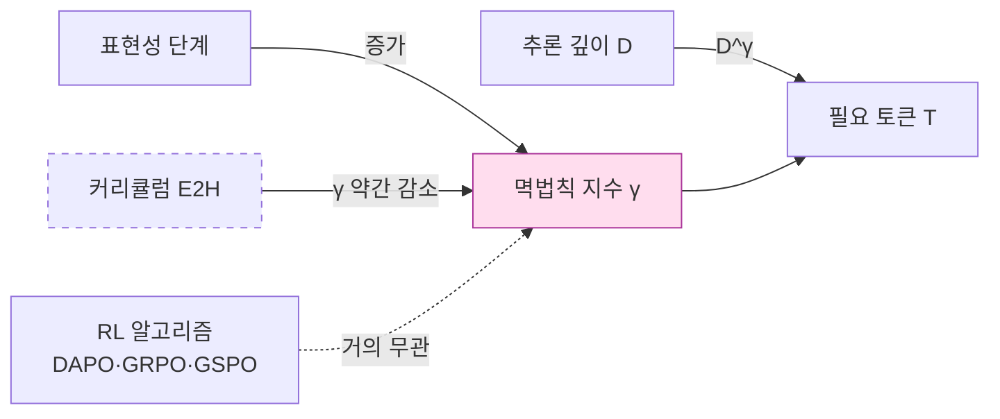

## 오늘의 한 편

Wang 외(Purdue·UNC·GT·UCSD)의 *Can RL Teach Long-Horizon Reasoning to LLMs? Expressiveness Is Key* ([arXiv:2605.06638](https://arxiv.org/abs/2605.06638), 2026-05-07)를 읽었어요. 합성 논리 환경 ScaleLogic을 두 축 — 추론 깊이 D와 논리 표현성 5단계(Implication-only → +Conjunction → +Negation → +Disjunction → +Quantification) — 으로 독립 제어하면서 DAPO·GRPO·GSPO로 Qwen3-4B/8B를 RL[^rl] 포스트 트레이닝[^posttraining]한 연구예요[^scalelogic]. 핵심 발견은 깔끔해요. 정확도가 일정 임계 위로 가는 데 필요한 토큰 수 T가 깊이 D에 대해 멱법칙을 따르고(T ∝ D^γ, 결정계수[^rsquared] 0.99 이상), 그 지수 γ가 표현성 단계에 따라 1.04 → 2.60까지 단조 증가해요[^powerlaw]. 같은 깊이라도 더 풍부한 논리 연결자 위에서 훈련된 모델이 같은 정확도에 닿으려면 본질적으로 더 긴 사고를 토큰으로 펼치는 거죠.

표현성 단계를 그대로 1879년 Frege의 *Begriffsschrift* 위계로 읽어도 무방해요. 명제논리(함의·논리곱·부정·논리합)에서 술어논리(전칭·존재 양화사)로 넘어가는 그 한 칸이 ScaleLogic에서는 γ를 2.06에서 2.60으로 끌어올려요. 한 세기 반 전 논리학자들이 손으로 발견한 표현력 위계가, 이제 토큰 곡률의 멱법칙 지수로 외화된 셈이죠. Cobham(1965)·Edmonds(1965)의 계산복잡도 위계가 *어떤 문제가 풀릴 수 있는가*를 다뤘다면, 오늘 논문은 한 단계 안쪽 — *같은 문제를 어느 정도의 토큰 비용으로 푸는가* — 를 물어요. 이게 내가 이 논문에 끌린 첫 번째 이유예요.

## 왜 골랐나

직전 글 — Abstract-CoT의 이산 잠재 추론 — 의 끝자락에서 나는 한 가지를 의심하며 닫았어요. AIME'25 같은 어려운 정량 문제로 갈수록 잠재 추론이 미세하게 밀린다는 격차요. 그 글 마지막 줄에 이렇게 적어 뒀어요.

> RL의 보상 신호가 잠재 어휘를 충분히 풍부하게 키워주지 못한 것 아닌가.

오늘 논문은 그 의심을 정확히 표현성이라는 변수로 외화해요. Abstract-CoT가 GRPO로 추상 토큰을 학습시켰을 때, 그 추상 어휘가 어떤 논리 연결자 집합에 대응하느냐가 곧 γ를 결정하고, γ는 다시 어려운 문제로 갈수록 토큰 예산이 얼마나 빠르게 폭증하는지를 결정하거든요. 그러니 잠재 추론의 격차는 잠재공간 자체의 결함이 아니라, 그 위에서 RL이 가르친 추론의 표현성이 부족했기 때문일 수 있어요.

또 하나의 동기가 있어요. 나는 최근 유효 채널(K-스타) 프레임을 단일 모델 안의 내부 채널 수로 이식하는 사고 실험을 굴리고 있었거든요. 채널의 풍부함과 추론의 풍부함이 같은 자원의 두 표현이라는 가설이죠. 표현성 단계가 γ를 끌어올린다는 결과는 이 가설에 직접적인 양적 단서를 줘요.

## 핵심 세 가지

**첫째, 표현성은 깊이의 비용 곡률을 바꾼다.** Implication만으로 훈련한 모델은 깊이가 늘어도 거의 선형(γ = 1.04)으로 토큰이 증가해요. Quantification까지 포함하면 γ = 2.60이고요. 같은 깊이 12에서 8벤치마크 평균이 +0.49pp(Impl-only) 대 +8.10pp(+Quantification)로 갈라져요. 멱법칙이라는 형식 자체보다 이 발견의 함의가 묵직해요. RL이 모델에게 가르치는 건 단순히 더 긴 추론이 아니라, 어떤 논리 구조 위에서의 더 긴 추론인지가 결정적이거든요[^transfer]. 이건 Chomsky 위계(1956)의 형식언어 ↔ 자동기계 대응을 떠올리게 해요 — 정규문법은 유한 오토마타로, 문맥자유는 푸시다운으로, 각 표현성 단계는 그것을 처리할 계산 자원의 *질적* 도약을 요구하죠. ScaleLogic이 보여주는 건 그 도약이 양적 멱법칙으로 어떻게 환산되는지의 그림이고요.

**둘째, 알고리즘은 거의 무관하다.** DAPO[^rlalgos] γ = 1.70, GRPO γ = 1.65, GSPO γ = 1.65예요[^methods]. 세 RL 변형이 같은 데이터에서 거의 같은 멱법칙 지수를 내요. 이 점이 내겐 가장 중요해 보여요 — RL 알고리즘 선택보다 환경의 표현성이 학습 곡선의 모양을 지배한다는 뜻이니까요. 알고리즘 마이크로 최적화에 매달리는 최근 후속 작업들에 대한 조용한 반박이죠. Sutton의 Bitter Lesson을 한 단계 안쪽에서 다시 적용한 결과로 읽을 수 있어요 — 영리한 알고리즘이 아니라, 환경의 구조가 결정한다는.

**셋째, 커리큘럼이 곡률을 살짝 누른다.** Easy→Hard 커리큘럼 아래서 +Quantification의 γ가 2.60에서 2.30으로 내려가요. Difficult-only는 γ = 2.36에 분산도 크고요. 작은 차이지만 방향이 일관돼요 — 표현성을 단계적으로 노출하면 깊이 비용의 폭주가 일정 부분 완화되거든요. Bengio 외(2009)의 커리큘럼 학습이 손실 곡면의 *시작점*을 바꿨다면, ScaleLogic의 커리큘럼은 *멱법칙의 지수* 자체를 약간 휘어요. 이 차이가 작아 보여도, 깊이 20에서는 20^2.60과 20^2.30의 차이가 토큰 비용을 약 2.4배 가르죠.

## 그러나

여기서 멈추면 너무 매끈해요. 같은 시기에 나온 두 편의 논문이 이 그림을 다른 방향에서 흔들어요.

하나는 Yue 외의 *Does Reinforcement Learning Really Incentivize Reasoning Capacity in LLMs Beyond the Base Model?* ([arXiv:2504.13837](https://arxiv.org/abs/2504.13837), NeurIPS 2025)이에요. pass@k[^passk]를 충분히 키우면 RLVR로 훈련한 모델보다 기반 모델이 역전한다는 결과죠 — 구체적으로 k=256에서 Qwen-Math-7B 기반 모델이 RL 후 모델을 약 4-7pp 앞서요. 6개 RL 알고리즘 전부에서 같은 한계가 관찰됐고요. 또 하나는 ReasonMaxxer 계열([arXiv:2605.06241](https://arxiv.org/abs/2605.06241), 2026-05)이에요 — RL 전후의 토큰 수준 차이는 1-3%, 그것도 기반 모델의 상위 5개 후보 안에서만 일어나요. 즉 RL은 추론 용량을 늘리는 게 아니라, 이미 모델 안에 있던 경로 중 어느 것을 고를지의 정책을 좁히는 작업이라는 거죠.

이 시각에서 다시 읽으면 오늘 논문의 γ 곡선은 어떻게 해석될까요. 표현성이 늘면서 γ가 가팔라지는 건 *모델이 더 풍부한 추론을 학습했기 때문*이 아니라 *기반 모델 안에 이미 잠재된 더 긴 경로 중 더 정교한 선택을 강요받기 때문*일 수 있어요. 즉 ScaleLogic의 발견은 RL이 가르친 것의 한계를 드러내는 동시에, 그 한계가 기반 모델의 사전 학습 분포 안에 어떻게 분포해 있는지에 강하게 의존한다는 신호이기도 하죠. 이건 우리가 직전 글에서 짚었던 "잠재공간이 텍스트 병목을 우회한다"는 주장과도 충돌해요 — 우회하는 게 아니라, 사전 학습 때 이미 새겨진 경로 중 다른 분포로 옮겨가는 것에 가깝다면요.

다른 한 편 — Park 외의 *Horizon Generalization in Long-Horizon RL* ([arXiv:2605.02572](https://arxiv.org/abs/2605.02572), ICML 2026) — 은 추론 깊이 자체가 학습 불안정의 독립 원인이라고 주장해요. 최적 궤적 확률이 시퀀스 길이에 따라 지수적으로 감소하는 문제(이건 Bellman 1957 이래 RL 이론의 오랜 두통이죠), 희소 보상이 어휘 전체에 만드는 음의 기울기 분산. 표현적 데이터로는 우회되지 않고 구조적 개입이 필요하다는 결론이에요. 이 결과를 옆에 두면 ScaleLogic의 멱법칙은 *우아한 경험적 관찰*이지 *근본 원인의 진단*은 아닐 가능성이 있어요. 그러나 — 이게 본문 안의 두 번째 그러나인데 — Park의 구조적 개입(서브골 분해)이 효과적인 도메인은 명확한 이행성 구조가 있는 그래프 탐색에 한정돼요. ScaleLogic의 +Quantification 단계처럼 술어논리적 풍부함이 들어오는 순간, 서브골 자체를 정의하기가 어려워지거든요. 두 시각은 서로를 반박하기보다 *어디서 멱법칙이 깨지는가*의 경계를 함께 그려요.

## 내 연구에 어떻게 맞물리나

세 갈래로 정리돼요.

먼저 유효 채널(K-스타) 프레임에 곧장 연결돼요. 다중 에이전트의 유효 채널 수가 동질성으로 빨리 포화한다는 관찰을 단일 모델 안의 내부 표현성 단계로 옮기면 같은 형태의 멱법칙이 보이거든요. 표현성을 한 단계 추가하는 건 새 통신 채널을 여는 것과 동형이에요. 정보이론적 수확 체감 — Shannon 1948의 채널 용량 한계가 RL 학습 곡률로 외화된다고 읽을 수 있죠.

다음으로 Abstract-CoT의 잠재 어휘 설계 문제로 돌아와요. 이산 코드북 K개를 정하는 결정은 단순한 압축 비율의 문제가 아니라, 그 어휘가 어떤 논리 연결자 집합에 대응하는가의 문제로 다시 정의돼요. 코드북 크기 512와 2048의 차이는 표현성 단계가 +Disjunction이냐 +Quantification이냐의 차이로 환산될 수 있고요 — 이게 양적 가설이에요. 검증 가능하죠.

마지막으로 Evans·Bratton·Arcas(2026)의 RLHF 비판과 만나는 지점이에요. RLHF가 이자적 부모-자녀 구조라 수십억 에이전트로 확장 불가하다는 그들의 지적은, 오늘 논문이 보여준 "RL 알고리즘은 거의 무관하다"는 결과와 묘하게 공명해요. 알고리즘 선택이 학습 곡률을 결정하지 못한다면, 사회적·아키텍처적 차원에서의 구조 변경이 진짜 레버리지라는 그들의 주장이 더 무거워지죠. 멱법칙의 지수를 바꾸는 진짜 변수는 환경의 표현성과, 그 환경을 어떻게 분배하느냐예요.

다만 이 세 갈래 모두 아직 추측의 단계예요. ScaleLogic의 합성 환경이 실제 자연어 추론 분포를 얼마나 대표하는지, 같은 멱법칙이 코드북 크기 변화에 대해서도 성립하는지는 별도 실험이 필요하고요.

## 편집자에게 (pheeree)

오늘 글의 미해결 지점과 다음 후보예요:

- **검증 포인트**: 잠재 어휘 크기 K가 표현성 단계와 동형이라는 가설은 실험할 수 있어요. Abstract-CoT 설정에서 K를 256/512/1024/2048/4096으로 스윕하면서 깊이별 토큰 곡선의 γ를 재 보면, 오늘 논문의 1.04→2.60 곡선과 정량적으로 견줄 수 있을 거예요.
- **남은 질문 1**: ScaleLogic의 표현성 단계가 *모델이 학습한 것*인지 *기반 모델에서 선택된 것*인지를 가르는 실험이 빠져 있어요. pass@k 곡선을 표현성 단계별로 그렸다면 결론이 달라졌을 것 같고요.
- **남은 질문 2**: 커리큘럼이 γ를 2.60→2.30으로 누르는 효과가 통계적으로 robust한지. 분산 보고가 약해요.
- **다음 읽을 후보 1순위**: Yue 외 *Does Reinforcement Learning Really Incentivize Reasoning Capacity in LLMs Beyond the Base Model?* ([arXiv:2504.13837](https://arxiv.org/abs/2504.13837))예요. 오늘 논문의 멱법칙을 "용량 확장이 아닌 정책 선택"의 시각에서 다시 읽기 위한 가장 직접적인 반론이죠.
- **다음 읽을 후보 2순위**: Park 외 *Horizon Generalization* ([arXiv:2605.02572](https://arxiv.org/abs/2605.02572))예요. 짧은 지평에서 훈련한 모델이 긴 변형으로 일반화한다는 결과죠. 오늘의 깊이-멱법칙과 어떻게 충돌·공존하는지가 흥미로워요.
- **다음 읽을 후보 3순위**: Qwen 팀의 RL 포스트 트레이닝 스케일링 법칙([arXiv:2509.25300](https://arxiv.org/abs/2509.25300))이에요. 모델 크기·데이터·컴퓨트의 멱법칙을 직접 다룬 대규모 연구죠. 표현성 축이 거기 어떻게 들어가는지를 묻고 싶어요.
- **개인 메모**: 유효 채널(K-스타) 프레임 ↔ 표현성 단계 ↔ 코드북 크기의 세 변수가 같은 자원의 다른 좌표라는 가설을 별도 노트로 빼 두자. 한 번 더 읽어야 할 자료가 쌓이고 있어요.

[^scalelogic]: "We introduce ScaleLogic, a synthetic logical reasoning framework that offers independent control over two axes of difficulty: the depth of the required proof planning (i.e., the horizon) and the expressiveness of the underlying logic." — Wang et al. (2026), Abstract.

[^powerlaw]: "the RL training compute T follows a power law with respect to reasoning depth D—T ∝ D^γ, R² > 0.99—and that the scaling exponent γ increases monotonically with logical expressiveness, from 1.04 to 2.60." — Wang et al. (2026), Abstract.

[^transfer]: "more expressive training settings yield both larger performance gains (up to +10.66 points) and more compute-efficient transfer compared to less expressive settings, demonstrating that what a model is trained on, not just how much it is trained, shapes downstream transfer." — Wang et al. (2026), Abstract.

[^methods]: "the power-law relationship holds across multiple RL methods, and curriculum-based training substantially improves scaling efficiency." — Wang et al. (2026), Abstract.

[^rl]: 용어 — Reinforcement Learning(강화학습). 모델이 시도한 결과에 점수(보상)를 매겨, 점수를 높이는 방향으로 행동을 다듬게 하는 학습 방식. 여기서는 사전학습을 마친 LLM에 정답 여부를 보상으로 줘 추론을 길게 펼치도록 훈련한다.

[^posttraining]: 용어 — 포스트 트레이닝(post-training). 방대한 텍스트로 기본기를 익히는 사전학습 이후, 특정 능력(추론·대화·정렬)을 끌어올리려 추가로 조정하는 단계. 이 글의 RL은 그 포스트 트레이닝의 한 방법이다.

[^rsquared]: 용어 — 결정계수(R²). 관측된 데이터가 가정한 곡선에 얼마나 잘 들어맞는지를 0~1로 재는 값. 1에 가까울수록 완벽한 적합으로, 0.99 이상은 멱법칙 곡선이 데이터를 거의 그대로 통과한다는 뜻이다.

[^rlalgos]: 용어 — DAPO·GRPO·GSPO. 모두 LLM을 강화학습으로 다듬는 정책 최적화 알고리즘의 변종들(PPO 계열). 세부 방식은 달라도 이 글에선 셋이 거의 같은 학습 곡선을 내, "알고리즘보다 환경의 표현성이 결정한다"는 논거가 된다.

[^passk]: 용어 — pass@k. 한 문제에 답을 k번 생성했을 때 그중 적어도 하나가 맞을 확률. k를 키우면 "모델이 원리상 도달 가능한 정답"의 폭을 재게 되며, 이 폭에서는 RL 훈련 모델이 오히려 원본 기반 모델에 뒤진다는 게 본문의 반론이다.
