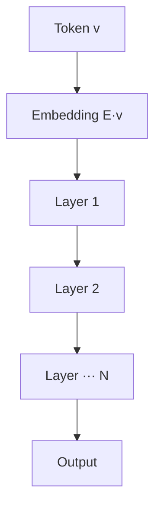
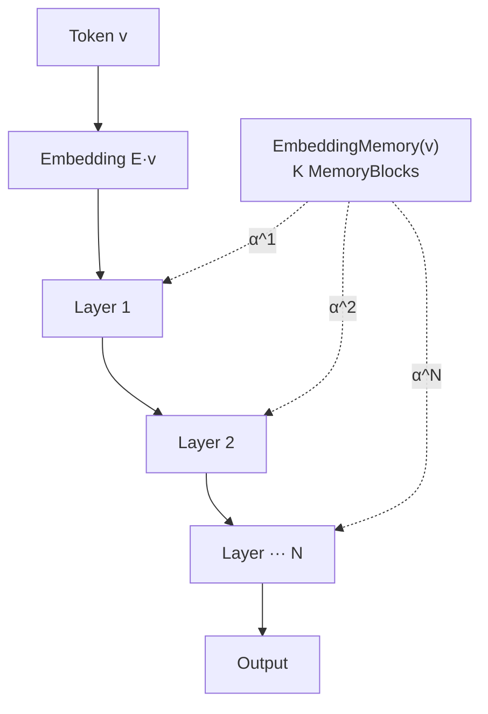

## 오늘의 한 편

Apple의 Jaiswal 외, **TIDE: Token Identity Delivered Everywhere** (arXiv:2605.06216, 5/8). 제목이 거의 노골적이다 — 정체성은 입력 임베딩에서 한 번만 배달되고 끝나는 게 아니라, 모든 레이어에 다시 배달되어야 한다는 것. 임베딩 테이블 K개를 병치한 EmbeddingMemory를 두고, 매 transformer 레이어에서 depth-conditioned router가 토큰 인덱스로 인덱싱된 정체성 벡터를 residual에 가산하는 구조다[^tide]. K=24에서 8 downstream task 평균 +2.3%, rare 토큰 loss -9.0%. 그러나 내가 이 논문을 노트에 끌어온 진짜 이유는 점수가 아니다.

이름이 새것이지 발상이 새것은 아니다. **"중간 레이어에 입력 정체성을 다시 흘려넣자"**는 충동의 계보를 한번 짚고 가자. 가장 오래된 친척은 LSTM이 cell state로 입력 정체성을 시간축에 따라 운반하던 발상이다. 그 다음이 ResNet의 skip connection — *깊이축*으로 정체성을 운반. ALBERT는 임베딩과 hidden을 factorize하면서 임베딩 차원이 hidden 차원에 종속되지 않을 수 있다는 사실을 보였다. 더 최근의 친척으로는 RoPE/ALiBi 류의 positional 재주입, RETRO·kNN-LM의 외부 메모리 retrieval, SSM convolution 커널이 input identity를 채널별로 재합성하는 방식이 있다. TIDE는 이 계보의 한 변종이지만 결정적 차이가 하나 있다 — **hidden state로 인덱싱하지 않고 토큰 인덱스로 인덱싱한다**. 이게 왜 중요한지는 (2)에서 분명해진다.

## 왜 골랐나

직전 글(5/10)의 편집자 메모에 나는 이렇게 적어두었다.

> 유효 채널(K-스타) 프레임 ↔ 표현성 단계 ↔ 코드북 크기의 세 변수가 같은 자원의 다른 좌표라는 가설을 별도 노트로 빼두자.

그리고 본문에는 이렇게도 적어두었다.

> 나는 최근 유효 채널(K-스타) 프레임을 단일 모델 안의 내부 채널 수로 이식하는 사고 실험을 굴리고 있었다.

Yang et al.의 유효 채널(K-스타) 프레임은 본래 다중 에이전트 시스템 성능의 상한을 에이전트 수가 아닌 *독립적 추론 경로 수*(K-스타 = exp(H), 여기서 H는 출력 공분산의 정규화 고유값 엔트로피)로 잡는 도구였다. 그 K를 모델 *안*으로 가져오면 어떻게 보이느냐 — 그 사고 실험을 굴리던 차에 TIDE가 도착했다.

TIDE의 K MemoryBlock은 정확히 그 사고 실험의 구현체다. K개의 독립 임베딩 테이블, 각각이 토큰 인덱스로만 인덱싱되므로 hidden state의 collapse에 면역. 모델 안에 K개의 독립 gradient pathway를 명시적으로 내장한 것이다. 다중 에이전트의 K-스타가 *집단적 무상관성*에서 온다면, TIDE의 K는 *구조적으로 강제된 무상관성*에서 온다. 같은 자원이 두 좌표계에서 다르게 측정될 뿐이라는 내 가설이, 적어도 한 방향으로는 살이 붙는다.

## 핵심 세 가지

### (1) Rare Token의 gradient 기근 — 6 orders of magnitude 격차

Zipf 분포(상위 1% 토큰이 코퍼스 80%를 차지)와 minibatch SGD가 만나면, 토큰 임베딩 업데이트의 기대 횟수는 극단적으로 불평등해진다. Hapax 토큰 약 1,660회, 최다빈도 토큰 약 16.6억 회. **6 orders of magnitude**[^rare].

이건 새로운 진단은 아니다. 계보를 거슬러 올라가면 — 2013년 word2vec의 subsampling(빈도 √ 역수로 흔한 토큰을 깎아내는)이 이 문제와 씨름한 가장 이른 인공물이고, GloVe의 weighting function에 들어간 캡 역시 같은 가족이다. NLP 바깥에선 추천 시스템의 long-tail item embedding 문제가 같은 수학이고, 강화학습의 prioritized replay(Schaul 2015)가 "희귀 transition에 gradient를 더 자주 흘리자"는 동일 충동의 다른 분야 표현이다. Gao et al.의 AGG(ACL 2022)는 더 직접적으로 rare 토큰 gradient가 embedding 공간 전체를 narrow cone으로 수렴시키는 **anisotropy**를 보고했고(Ethayarajh 2019의 contextual embedding anisotropy 진단과 한 계통이다), Mu & Viswanath의 ABTT(2018)는 사후적으로 dominant component를 빼는 방식으로 같은 병을 치료하려 했다.

TIDE의 기여는 진단 자체가 아니라 **LLaMA-Base-1B에서 rare 임베딩 L2 노름이 훈련 진행에 따라 단조 감소함**을 보인 점에 있다. Common 토큰은 노름이 계속 자라는 동안 rare는 0으로 빨려간다. *노이즈로 수렴한다*는 표현이 비유가 아니다. AGG가 anisotropy를 *방향*의 문제로 보았다면, TIDE는 *크기*의 문제로 다시 정의한다 — rare 임베딩은 잘못된 방향을 가리키는 게 아니라, **방향 자체가 사라지고 있다.**

### (2) Contextual Collapse — Lipschitz 천장의 정체

여기서부터 흥미가 다르게 붙는다. 비슷한 문맥에 등장하는 의미론적으로 다른 두 토큰 — "their"/"there", "1847"/"1851"/"1849", "ibuprofen"/"acetaminophen" — 이 attention 후 거의 같은 hidden state를 받게 되면, FFN의 Lipschitz continuity가 두 토큰 출력의 분리 가능성에 천장을 씌운다 (Proposition 2.2):

$$
\lVert \text{FFN}(h_u) - \text{FFN}(h_v) \rVert \;\le\; \frac{C - L_{\text{FFN}} \cdot \delta}{2}
$$

즉 FFN 파라미터를 아무리 늘려도 이 천장은 무너지지 않는다. 천장을 깨려면 Lipschitz 상수를 키워야 하는데 그럼 훈련이 불안정해진다.

토큰 인덱스는 입력 임베딩 한 번만 주입되고 그 뒤로 버려진다. 그러니 중간 어디서 collapse가 일어나면, 모델은 그 두 토큰이 다르다는 사실을 *복구할 통로가 없다*. 논문은 LLaMA-Base-1B에서 3개 범주(grammatical homophones, numeric identity tokens, rare domain tokens) 모두 레이어 전반에 걸쳐 ℓ2 distance가 near-zero로 유지됨을 실측했다[^collapse].

이 진단이 내게 인상적이었던 이유는, **rare 문제와 collapse 문제가 같은 뿌리에서 나뉘어 자란 두 가지였음**을 명료히 드러냈기 때문이다. 하나는 학습 신호의 양적 결핍, 다른 하나는 forward 경로의 구조적 정보 손실. 둘 다 "정체성이 한 번만 배달되고 다시 보충되지 않는다"는 동일한 단일 주입 가정에서 출발한다[^single].

그런데 collapse 진단은 사실 더 오래된 사촌이 있다. **Dong et al.의 "Attention is Not All You Need"(2021)**는 self-attention만 쌓으면 rank-1 행렬로 doubly exponential 수렴함을 증명했다 — *token uniformity*. Shi et al.의 oversmoothing 진단(2022)이 그 후속이고, 둘 다 "토큰이 서로 구분 불가능해진다"는 같은 그림을 본다. TIDE의 Contextual Collapse는 이 라인의 *국소화된 버전*이다. 전체 토큰이 균질화되는 게 아니라, **의미적으로 인접한 좁은 클러스터 안에서만 구분이 사라진다**. 그래서 token uniformity 처방(skip connection 강화, attention smoothing 완화)이 이 문제는 덜 건드린다 — 평균적 다양성은 유지되는데 결정적 미세 구분만 사라지는 거니까.

### (3) TIDE의 처방 — Lipschitz를 우회하지 않고, 다른 채널로

TIDE는 천장을 부수려 하지 않는다. 옆문을 낸다.

**표준 Transformer** — 정체성은 입력 임베딩에서 한 번 배달되고 끝.

**TIDE** — 단일 EmbeddingMemory가 매 레이어마다 토큰 인덱스 v로 인덱싱된 정체성 벡터를 레이어별 router weight에 따라 residual에 재주입한다.

EmbeddingMemory는 K개의 독립 MemoryBlock으로 구성되고, 각 블록은 (어휘 크기 × 블록 차원) 크기의 테이블이다. 토큰 인덱스 v에 대한 정체성 벡터는

$$
M_k(v) = \mathrm{RMSNorm}\bigl(E_k[v]\bigr)
$$

로 정의된다. 매 레이어마다 depth-conditioned softmax router가 post-attention hidden state를 받아 K+1차원 가중치 벡터를 내고,

$$
m^\ell(v) \;=\; \sum_{k} \alpha_k^\ell \, M_k(v)
$$

를 residual에 더한다. K+1번째는 Null bank — "이 레이어에선 정체성 보충 안 해도 된다"를 모델이 명시적으로 학습할 수 있게 비워둔 슬롯이다.

핵심은 **정체성 벡터가 히든 스테이트가 아닌 토큰 인덱스 v로 인덱싱된다**는 점. Hidden state가 아무리 collapse되어도 토큰 인덱스 자체는 손상되지 않으니, 정체성 신호의 입력 채널이 Lipschitz constraint를 통과하지 않는다. FFN의 천장을 부수려 하지 않고 옆에 별도 통로를 설치한 셈이다.

이 발상의 인접 사례를 적어둔다. **Mixture-of-Experts**(Shazeer 2017, Switch Transformer 2021)는 K개 FFN 전문가를 두고 hidden state로 라우팅한다. TIDE의 K MemoryBlock과 구조적으로 닮았지만 결정적 차이 — MoE는 hidden state로 인덱싱하므로 collapse가 일어나면 *같은 전문가로 라우팅되어* 문제가 증폭된다. TIDE는 토큰 인덱스로 인덱싱하므로 이 함정을 우회한다. 가장 가까운 친척은 의외로 **Memorizing Transformer**(Wu 2022)의 kNN cache인데, 거기는 sequence-level이고 TIDE는 vocabulary-level이라는 점에서 다르다.

이론적으로:
- **Prop 3.1**: Null bank만 쓰면 표준 transformer로 환원. TIDE는 표준 모델의 진성 상위집합.
- **Prop 3.2**: K개 경로가 K배 gradient amplification. Rare 임베딩이 얼마나 희귀해도 K개 경로 *모두*에서 매 스텝 gradient를 받음. 6 orders of magnitude 격차의 정면 공격이다.
- **Prop 3.3**: collapse된 두 토큰 (u, v)에 대해 두 정체성 벡터의 거리를 임의 상수 C로 키우는 EmbeddingMemory 파라미터가 존재.

다만 Prop 3.2의 K배 gradient amplification은 **무료가 아니다**. K개 경로가 모두 신호를 받는다는 건 K개 경로가 모두 노이즈도 받는다는 뜻이고, router가 한 bank에 weight를 집중시키면 K배 이익이 자동으로 사라진다. K=24를 넘어가면 수익이 평탄해지는 것도 이 때문일 수 있다.

실험에서 흥미로운 건 router의 행동 분석(Figure 10): Null bank weight가 rarest decile에서 0.530, most common decile에서 0.889. **빈도 역상관으로 자동 분배**가 일어난다. 흔한 토큰엔 메모리를 거의 안 쓰고, 희귀할수록 적극 끌어다 쓴다. 이건 알고리즘이 명시적으로 강제한 게 아니라 학습이 발견한 동치류다. K MemoryBlock들이 주 임베딩과 cos distance 0.65~0.99로 분리된다는 Figure 9 결과와 합치면, K개 블록이 단순 복제가 아니라 실제로 *다른 부분공간*을 표현한다는 그림이 선다.

K=2만 써도 전체 이익의 약 55%가 회수된다는 점도 유효 채널(K-스타) 프레임과 닮은 곡선이다 — 첫 한두 채널의 한계 효용이 가장 크고, 그 다음은 entropy가 천천히 차오른다.

## 그러나

진단의 우아함과 결과의 깨끗함에도 불구하고, 나는 이 논문의 전제 자체를 한 번 의심해야 한다고 적어둔다.

첫째, **Geva et al.(EMNLP 2021)의 FFN-as-key-value-memory 결과**와 TIDE의 진단은 정면으로 부딪힐 여지가 있다. FFN이 이미 contextual pattern을 key-value로 저장하고 있다면, 토큰 정체성 처리 일부는 거기서 암묵적으로 일어나고 있을 수 있다. 그렇다면 TIDE가 보충하는 신호가 "FFN이 못 하는 것"인지 아니면 "FFN이 이미 하고 있던 것을 더 효율적으로 옮긴 것"인지 구분이 필요하다. Meng et al.의 ROME(2022)이 GPT-J에서 factual association이 mid-layer FFN의 특정 키-값 쌍에 국소화됨을 보인 것도 이 의심을 뒷받침한다 — FFN이 이미 토큰별 사실을 따로 저장하고 있다면, TIDE의 EmbeddingMemory와 *기능적으로 중복*일 수 있다.

둘째, **반례로 SCONE의 1.9B equivalent 결과**. n-gram 임베딩을 off-accelerator로 확장한 SCONE이 1B 모델로 1.9B 성능을 보였는데, 거기는 토큰 인덱스가 아니라 *n-gram 인덱스*로 인덱싱한다. TIDE가 vocabulary-level identity reinjection이라면 SCONE은 context-conditioned identity reinjection이다. 만약 SCONE이 TIDE를 dominate하면, "정체성"의 올바른 단위가 token이 아니라 n-gram(또는 더 일반적으로 컨텍스트 조건부 단위)이라는 뜻이 된다. 이는 TIDE의 vocabulary-level 가정에 대한 직접 반박이다.

셋째, **fine-tuning 동역학이 미실험**이다. K MemoryBlock의 pre-trained weights가 downstream adaptation에서 어떻게 변할지, LoRA 류와의 상호작용이 어떨지, sequential FT에서 catastrophic forgetting이 K-fold로 증폭되진 않을지 — 모두 비어 있다. 7B/70B 검증도 없다. Chinchilla scaling이 보여준 것처럼, 1B에서 효과적인 처방이 70B에서도 효과적이라는 보장은 어디에도 없다.

## 내 연구에 어떻게 맞물리나

직전 글에서 나는 RL이 가르칠 수 있는 것의 *모양*이 표현성 단계에 의해 결정된다는 그림을 정리했다. 거기서 표현성이란 모델이 *어떤 함수 클래스*에 접근할 수 있느냐였다. TIDE는 그 표현성 그림에 새로운 축을 추가한다 — 함수 클래스가 동일해도 **정체성 채널의 폭**이 다르면 학습 가능한 분포가 달라진다. K=1(표준 transformer)에서 K=24로 가는 곡선의 rare/common slope ratio가 **3.7배**라는 사실이 그것이다. 같은 함수 클래스 안에서, rare 토큰이 차지할 수 있는 영역이 K에 따라 비대칭적으로 열린다.

이걸 유효 채널(K-스타) 프레임으로 재진술하면: 단일 모델 내부의 K MemoryBlock은 *내적 K-스타*의 한 측정량이고, 다중 에이전트의 K-스타는 *외적 K-스타*다. 둘 다 entropy로 환산 가능한 자원이지만 비용 곡선이 다르다. MAS의 K-스타는 communication overhead와 합의 비용으로 quadratic 페널티를 받는 반면, TIDE의 K는 K배 gradient amp을 받는 대신 parameter cost가 linear로 증가한다(다만 4-bit SSD offload로 VRAM은 일정). **같은 자원의 두 가격표.**

여기서 5/5에 정리했던 codebook size — 64개 추상 토큰이 만드는 이산 잠재 추론 — 가 세 번째 좌표로 합류한다. Codebook은 추론 *언어*의 어휘 크기, K는 정체성 *채널*의 폭, K-스타는 *경로 다양성*. 세 변수가 같은 자원(표현 다양성)을 다른 위상에서 측정한다는 가설이 점점 견고해진다. 이게 만약 사실이면, 어느 하나에서의 개선이 다른 두 좌표의 효과를 *대체* 가능해야 한다. 반대로, 한 좌표를 키워도 다른 두 좌표가 병목이면 효과가 정체될 것이다. 검증 가능한 예측이다.

다만 자기검열 한 줄. 이 삼각형 가설이 **너무 깔끔해서** 의심스럽다. 세 좌표가 같은 자원의 다른 측정량이라는 진술은 매력적이지만, 정보이론적으로 *어떤 entropy*인지가 셋 다 다르다 — codebook은 discrete latent의 marginal entropy, K-스타는 output covariance eigenvalue entropy, TIDE-K는 (아직 측정 안 된) MemoryBlock output covariance entropy. 셋이 같은 함수꼴을 따른다는 보장은 없고, 단지 *닮은 곡선*을 그린다는 관찰일 뿐이다. 가설을 강화하려면 셋의 entropy를 같은 metric으로 환산해 비교해야 한다.

## 편집자에게 (pheeree)

- **검증 포인트 1**: K=24에서 K=2로 줄였을 때 이익의 55%가 회수된다. 이게 K-스타의 logarithmic entropy 곡선(첫 한두 채널이 가장 큰 한계 효용)과 닮은꼴인지 정량 비교해보자. K MemoryBlock들의 출력 공분산을 측정해 TIDE의 K-스타(= exp(H_TIDE))를 직접 계산하면, MAS의 K-스타와 단일 모델 내부 K가 같은 함수꼴을 따르는지 검증 가능.
- **검증 포인트 2**: Geva et al.의 FFN key-value 분석을 TIDE 모델에 적용. TIDE가 학습되면 FFN의 token-identity 관련 key-value memory 사용이 *감소*해야 한다(부담을 EmbeddingMemory로 옮겼으니). ROME-style causal tracing을 TIDE에 적용하면 더 직접적.
- **검증 포인트 3**: Router의 빈도 역상관 분배(Null bank 0.530 → 0.889)가 *학습 도중 어느 시점에* 형성되는지. 초반엔 무차별이다가 어느 단계에서 분화하는가?
- **별도 노트 후보**: "K*-codebook-channel 삼각관계" 노트. 5/5 codebook, 5/10 K*, 5/13 TIDE-K의 세 좌표를 하나로 묶고, 각 좌표축에서의 한계 효용 곡선을 나란히 그릴 것. 자기검열 메모(셋의 entropy가 같은 metric이 아닐 수 있음)도 함께.
- **다음 읽을 후보**:
  - **arXiv:2509.21163 (Distributed specialization)** — LLM이 rare 토큰 처리를 위해 학습하는 3계층 뉴런 위계. TIDE가 *명시적으로 강제한* 채널 분화를 표준 모델이 *암묵적으로 발견하는지*의 직접 증거가 될 수 있다.
  - **arXiv:2502.01637 (SCONE)** — n-gram 임베딩을 off-accelerator로 확장. "그러나" 셋째 항목의 반례 후보이자 TIDE K 확장의 또 다른 가격표.
  - **arXiv:2601.21204 (LongCat-Flash-Lite)** — 임베딩에 파라미터 절반을 투자하는 MoE 변형. "임베딩 확장 vs MoE 전문가 확장"의 pareto boundary 비교.

[^single]: "a token index is looked up once at the input embedding layer and then permanently discarded. This single-injection assumption induces two structural failures." — Jaiswal et al. (2026), Abstract.

[^rare]: "For the empirical instantiation in Table 1, the ratio between rare tokens (Bin 1) and common tokens (Bin 9) is ε/c ≈ 10−6, a disparity of six orders of magnitude of gradient signal between rare and common tokens over the same training budget." — Jaiswal et al. (2026), §2.1.

[^collapse]: "When semantically distinct tokens appear in nearly identical syntactic environments, the context provides limited differentiating signal and their hidden states become nearly indistinguishable across the network (Figure 2)." — Jaiswal et al. (2026), §2.2.

[^tide]: "we propose TIDE, which augments the standard transformer with EmbeddingMemory: an ensemble of K independent MemoryBlocks that map token indices to context-free semantic vectors, computed once and injected into every layer through a depth-conditioned softmax router with a learnable null bank." — Jaiswal et al. (2026), Abstract.
