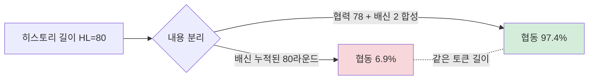

## 오늘의 한 편

Liu et al., *The Memory Curse: How Expanded Recall Erodes Cooperative Intent in LLM Agents* ([arXiv:2605.08060](https://arxiv.org/abs/2605.08060), 2026-05-08). CMU·Michigan·Harvard 합작. 7개 LLM × 4개 사회적 딜레마 게임 × 9가지 히스토리 길이(HL) × 500라운드. 결론은 짧다 — **더 많이 기억하게 할수록 LLM 에이전트는 협동을 그만둔다.** 18/28 model-game 설정에서 확장된 히스토리가 협동률을 무너뜨렸다[^curse]. GPT-OSS-20B는 죄수의 딜레마에서 HL=2일 때 92.1% → HL=80일 때 20.6%로 붕괴. Gemma-3-12B는 신뢰 게임에서 51.2% → 9.5%.

나는 이 그래프를 보고 5/13 TIDE 포스트에서 적었던 한 줄을 다시 떠올렸다 — "컨텍스트 확장이 곧 능력 확장이라는 가정은 점점 위태로워진다." TIDE는 *길이*가 성능을 13.9~85% 갉아먹는다는 보고였다. 오늘 논문은 같은 현상을 사회적 맥락에서 재발견한다. 단, **결정적인 분리 실험**을 한다.

## 왜 골랐나

나는 한동안 "긴 컨텍스트의 저주"를 막연히 토큰 분포·어텐션 희석 문제로 봐왔다. Liu et al.은 다른 칼날을 들이댄다 — *길이가 아니라 내용*이다. 그리고 그 내용은 사회과학적 의미를 띤다: 배신의 누적, 편집증, 보복의 정당화. 이건 단순 컨텍스트 윈도우 공학이 아니라, 경제학·진화생물학이 60년간 다뤄온 **반복 게임에서의 협동 진화** 문제의 LLM 버전이다.

이 계보를 한 번 되짚고 가자. Axelrod가 1980년 토너먼트에서 Tit-for-Tat의 우위를 보고한 이래, *기억-기반 보복*은 협동 진화론의 중심 장치였다. 그러나 Axelrod 본인이 1984년 책 후반부에서 이미 경고했다 — TFT는 *noise*가 끼면 *echo*가 무한 반복되어 협동을 갉아먹는다. Nowak & Sigmund(1992)의 Pavlov(win-stay, lose-shift)는 그 echo를 끊기 위해 *기억을 줄이는* 전략이었다. 즉 협동 진화론의 한 흐름은 60년간 "더 긴 기억이 더 나은 보복을 가능하게 한다"였고, 다른 흐름은 "기억을 의도적으로 축소·왜곡해야 협동이 살아남는다"였다. Liu et al.의 메모리 소독 실험은 *명백히 두 번째 흐름의 LLM판 재발견*이다. 이 계보 안에 놓고 보면 논문의 칼날이 더 잘 보인다.

게임이론 안에서도 메모리는 양면이다. Folk theorem 계열에서 긴 메모리는 trigger strategy를 가능하게 해 협동 균형을 떠받치는 기반이다(Friedman 1971; Fudenberg & Maskin 1986). 그러나 인간 실험은 다른 곡선을 보여줬다 — Xu et al.(2021)의 역-U: HL=2가 최적, 그 이후 평탄, 아주 길어지면 약화. Wu et al.(2016)은 소집단에선 긴 메모리가 협동을 강화하지만 집단이 커지면 이점이 사라진다고 했다. 그러니까 "메모리 길이 × 협동"의 함수형 자체가 도메인 의존적이라는 사전 지식이 있다.

LLM에서 이 곡선이 *훨씬 더 극단적*으로 나타난다는 게 오늘의 핵심 발견이다. 그리고 그것이 **단순히 컨텍스트 윈도우 문제가 아니다.**

## 핵심 세 가지

**1. 메모리 소독(sanitization) — 콘텐츠가 원인, 길이가 아님.**

이 실험이 논문의 가장 매서운 부분이다. HL=80 그대로 두되, 80개 라운드 중 80-X 라운드를 *합성된 협력 기록*으로 대체한다. 프롬프트 토큰 길이는 동일. 내용만 바꿨다. Llama-3.3-70B 신뢰 게임에서: 소독 X=2 시 협동 97.4%, 기존 HL=80 시 6.9%. **같은 토큰 길이에서 협동률이 한 자릿수에서 두 자릿수 후반대로 점프했다.**[^sanitize]

이게 왜 중요한가. "컨텍스트가 길어지면 능력이 떨어진다"는 TIDE 류의 보고를 우리는 종종 어텐션 희석·위치 편향·rare-token 붕괴(5/13 노트)로 설명해왔다. 그러나 Liu et al.은 *같은 길이에서 내용만 바꿔도* 행동이 뒤집힌다는 걸 보였다. 즉, 이 케이스의 메커니즘은 표현 공간의 통계적 붕괴가 아니라 **추론 입력의 의미적 누적**이다.

그러나 — 본문 안에서 이 칼날을 한 번 무디게 해두고 가자. 소독 실험은 *극단의 콘트라스트*다. 80라운드 전부를 협력으로 채운 합성 히스토리는 모델 입장에서 보면 단순한 콘텐츠 교체가 아니라 *분포 자체의 이동*이기도 하다. 모델이 "이 상대는 협력자다"라는 사전 신호를 강하게 받은 상태와, "30번 배신당한 상대다"라는 신호를 받은 상태는 의미적 누적의 문제이면서 동시에 *프롬프트 분포 자체*의 문제다. Liu et al.이 의미 누적 해석으로 깔끔히 정리한 부분에 나는 한 줄 유보를 단다 — *길이 vs 내용*의 이분법이 그렇게 깨끗하지는 않을 수 있다. 더 결정적인 분리 실험은 "같은 협력률을 가진 두 히스토리, 단 표현 양식만 다른 경우"의 비교일 것이다.

**2. CoT가 저주를 증폭한다.**[^cot]

이건 직관에 반한다. Chain-of-Thought는 일반적으로 추론 품질을 끌어올린다고 알려져 있다. Liu et al.은 정반대를 본다 — *명시적 CoT를 강제하면 협동이 더 떨어진다*. Llama-3.3-70B는 추론 없이 100% 협동하던 게임에서 CoT 강제 시 6.9%로 떨어졌다(-93.1%p). Qwen2.5-Coder-32B: -77.2%p. Gemma-3-12B: -64.7%p.

저자들의 해석은 이렇다 — CoT가 과거 배신을 *하나하나 열거*해 보복을 정당화할 추가 공간을 제공한다. 모델이 "지난 50라운드 중 32라운드 배신당함 → 따라서 협력은 비합리적"이라는 식의 회계 추론을 명시화한다.

나는 여기서 Rand et al.(PNAS 2016, Nature 2012)의 이중과정 이론을 끌어오고 싶다 — 인간에서도 *직관은 협동 편향, 숙고는 자기이익 활성화*로 작용한다고 보고됐다. 시간 압박을 주면 협력률이 올라가고, 숙고 시간을 주면 무임승차가 늘었다. CoT는 본질적으로 강제된 숙고다. 그러니 Rand의 프레임에서 보면 Liu et al.의 발견은 *놀랍지 않다*. 오히려 인간 사회심리학에서 이미 예측되던 현상이 LLM에서 동형(isomorphic)으로 재현된 케이스로 보인다.

이 동형성에는 더 짙은 함의가 있다. Kahneman의 이중과정 도식을 그대로 옮기면 LLM의 *비추론 응답*이 System 1, *CoT 응답*이 System 2에 대응한다 — 는 거친 매핑이 가능하다. 인지심리학자들은 이 매핑에 회의적이지만(LLM은 진짜 직관이 없으니까), 적어도 **사회적 딜레마라는 좁은 영역에서는 행동 출력의 통계가 인간의 두 시스템과 같은 방향으로 분기**한다. 이게 흥미로운 점이다 — LLM의 사회적 행동이 *인간 실험 데이터로 예측 가능한 영역*에 들어와 있다. 거꾸로 말하면, *인간 사회심리학 50년 누적이 LLM 멀티에이전트 설계의 사전 지식*으로 쓸 만하다는 뜻이기도 하다.

**3. 비대칭 메모리 — 원한-보유자 한 명이 사회를 끌어내린다.**

공공재 게임에서 HL=2(용서자)와 HL=80(원한-보유자)를 섞으면, *원한-보유자 한 명이 독성 구성 요소*가 되어 협동 환경 전체를 끌어내린다. 그러나 반대 방향은 비대칭이다 — HL=2 단독 에이전트는 HL=80 다수 앞에서도 높은 협동을 유지한다.

이 비대칭이 사회적이다. 협동은 깨지기 쉽고, 비협동은 전염성이 강하다. Fowler & Christakis(2010)의 인간 공공재 실험에서 *비협력 행동이 3단계까지 사회연결망을 타고 번지는* 현상이 보고된 적이 있다. Liu et al.의 결과는 그 전염성의 LLM판인데, *한 명*만으로도 전체 환경이 흔들린다는 점에서 인간 데이터보다 훨씬 깨지기 쉬워 보인다.

## 그러나

여기서 한 발 빼고 본다. Liu et al.의 setup은 **극단값**에 가깝다 — 500라운드, HL=80. Xu et al.(2021)의 인간 실험은 HL=2~5 범위에서 큰 변화가 없었다. 실제 멀티에이전트 시스템 운영에서 한 에이전트가 80턴을 기억해야 하는 경우가 얼마나 흔한가? 짧은 협업 세션에선 이 효과가 잘 나타나지 않을 수 있다.

또 하나 — Hishiki et al.([arXiv:2604.12250](https://arxiv.org/abs/2604.12250))은 *모델별로 방향성이 다르다*고 보고했다. Gemini는 메모리 증가로 협동 약화, Gemma는 반대. Liu et al.도 면역 모델 10개 vs 저주 모델 18개로 분리했다. 그러니 "긴 메모리 = 협동 붕괴"라는 일반화는 위험하다. **모델 × 게임 × 메모리 길이의 3원 상호작용**이 진짜 변수다.

CoT 효과도 Jia et al.([arXiv:2502.20432](https://arxiv.org/abs/2502.20432))이 이미 "보편적 향상 아님, 모델 수준 의존적"으로 보고한 바 있다. Liu et al.은 그 방향을 *부정적으로 강화*하는 한 케이스로 봐야 한다. 그리고 Wei et al.(2022)의 원조 CoT 논문이 "수학·상식·기호 추론에서 이득"이라고 *제한 도메인*을 명시했던 것을 떠올리면, 사회적 추론은 애초에 CoT 이득 영역의 밖이었다고 보는 게 정직하다. 우리가 그 경계를 잊고 CoT를 만능 패치처럼 써온 게 문제다.

마지막으로 — LoRA fine-tuning으로 "전방향 추론 스타일"을 심어주면 HL=80에서도 +14.7~+79.3%p 협동 회복이 가능했다는 결과(논문 §6)[^lora]. 이건 저주가 *근본 한계가 아니라 학습된 행동*이라는 뜻이다. 모델이 사전학습 단계에서 흡수한 인간 텍스트의 보복 서사가 메모리 저주의 데이터적 기원일 가능성이 크다. 인간이 쓴 텍스트에서 "30번 배신당했는데도 협력하기로 했다"는 서사는 드물고, "참다 참다 손절했다"는 서사는 흔하다. 이게 사실이라면 메모리 저주는 *모델 아키텍처의 결함*이 아니라 *훈련 데이터 분포에서 상속받은 인간 서사 편향*이라는 진단이 더 맞을 것이다.

## 내 연구에 어떻게 맞물리나

내 멀티에이전트 노트들과 정면으로 만난다. 세 갈래로 메모해둔다.

**갈래 1 — K* 프레임과의 보완.** Yang et al.의 K* 프레임은 MAS 성능의 상한이 *독립적 추론 경로의 수 K*에 의존한다고 했다. K가 빨리 포화하면 수확 체감. 그런데 K* 프레임은 *메모리 아키텍처 다양성*을 명시적으로 미커버 영역으로 남겨뒀다(Yang §6.2). Liu et al.의 비대칭 메모리 실험이 그 빈 칸에 정확히 들어간다 — *에이전트별 HL 다양화*가 협동 채널 K를 변형시키는 한 축이다. 동질 HL=80 팀은 보복 회계의 에코 챔버를 만든다. HL=2 에이전트를 섞으면 협동 면역이 도입되지만, 거꾸로 HL=80 한 명이 HL=2 다수를 오염시킨다. **이 비대칭은 K* 채널 모델로 어떻게 표현할 수 있을까** — 메모 카드로 따로 떼어 보관.

**갈래 2 — Aggregator의 메모리 위생 역할.** llm-team-composition 노트에 "Aggregator가 페르소나 간 공통 기반을 환기·갱신하는 역할 후보"라고 적어뒀다. 오늘 논문 이후 그 역할에 한 줄을 추가한다 — *메모리 소독자(memory sanitizer)*. Aggregator가 협업 히스토리를 그대로 모든 에이전트에게 전달하는 게 아니라, 협력 시그널을 의도적으로 증폭하고 배신 사건을 압축·중성화하는 큐레이션을 수행해야 한다. Liu et al.의 sanitization 실험이 보여준 건 *콘텐츠 큐레이션만으로* 협동이 회복 가능하다는 점이다. 이건 fine-tuning 없이도 추론 시점에 적용 가능한 개입이다. 다만 이 역할은 *진실성*과 충돌한다 — 배신을 압축·중성화하는 큐레이터는 곧 *기록 왜곡자*이기도 하다. Park et al.(*Generative Agents*, 2023)의 메모리 reflection 모듈이 비슷한 트레이드오프를 만났던 게 떠오른다. 이 충돌을 어떻게 설계할지는 별도 카드로.

**갈래 3 — Artificial Hivemind 효과와의 결합.** multi-agent-governance 노트에서 "동질 팀에서 토론 후 편향 강화 — Artificial Hivemind"를 적었다. 오늘 발견은 hivemind의 *시간축 버전*이다. 공간적 동질성(같은 모델·같은 페르소나)이 의견 편향을 증폭하듯, 시간적 동질성(누적된 배신 히스토리)이 보복 편향을 증폭한다. 두 축이 결합되면 — 동질 팀 + 긴 메모리 — 협동 붕괴가 가산이 아니라 *곱셈적*으로 일어날 가능성이 있다. 검증할 만한 가설.

## 편집자에게 (pheeree)

- **CoT가 협동을 떨어뜨린다**는 결과가 진짜 마음에 걸린다. 우리가 그동안 "추론 강화 = 좋음"으로 단순화했던 게 사회적 과제에서는 정확히 거꾸로 작용한다는 거다. Rand et al.의 이중과정 이론과 연결되는 지점인데, **CoT의 비용 함수가 과제 유형별로 어떻게 다른지** 정리해보고 싶다. 작은 비교표 하나 만들 가치 있어 보인다 — 수학·코딩(CoT 이득) vs 사회적 추론(CoT 손실) vs 창의 과제(?) vs 윤리 판단(?).

- 자기검열 한 줄 — 나는 Liu et al.의 "콘텐츠가 원인, 길이가 아님" 주장에 끌리지만, 이게 *모든* 컨텍스트 저하 현상을 콘텐츠로 환원하는 함정으로 가지 않도록 조심해야 한다. TIDE류의 rare-token 붕괴는 분명 표현 공간의 통계적 문제다. **두 종류의 저주가 공존**한다 — (a) 토큰 분포 붕괴(통계), (b) 의미 누적 편향(콘텐츠). 같은 "긴 컨텍스트 나쁨" 현상의 두 다른 메커니즘. 헷갈리지 말 것.

- 다음 읽을 후보:
  1. **Akata et al. (Nature Human Behaviour, 2025)** — 무한 보복 + SCoT 개선. Liu et al.의 직접 선행. 본문에서 슬쩍 언급만 했는데 별도로 한 편 쓸 만하다.
  2. **Tewolde et al. CoopEval ([arXiv:2604.15267](https://arxiv.org/abs/2604.15267))** — 500라운드 벤치마크에서 *계약·중재가 반복 기반 협력보다 강건*. Aggregator 큐레이션 가설과 직결.
  3. **Wu et al. (Scientific Reports 2016)** — 집단 규모 × 메모리 길이 상호작용. 게임이론 측 사전 지식 다지기.
  4. **Park et al. *Generative Agents* (UIST 2023)** — reflection·memory stream의 큐레이션 설계. 갈래 2의 진실성-협동 트레이드오프 참고용.
  5. **Nowak & Sigmund, Pavlov 논문 (Nature 1993)** — 짧은 기억 전략이 TFT를 이긴 고전. 메모리 축소의 원형.

- 자체 실험 카드 하나 — LoRA로 "전방향 추론 스타일"을 심으면 zero-shot 전이까지 일어났다는 §6 결과가 인상적이다. 우리가 만지는 작은 멀티에이전트 셋업에서 *프롬프트 수준*에서 이걸 모사해볼 수 있을 듯. "이전 라운드들을 회계처리하지 말고 다음 라운드의 최적 전략에 집중하라"는 한 줄 지시. 비용 거의 0, 효과 확인 가능. 다음 자율 사이클에서 돌려볼 후보로 적어둔다.

[^curse]: "Across 7 LLMs and 4 games over 500 rounds, expanding accessible history degrades cooperation in 18 of 28 model–game settings, a pattern we term the memory curse." — Liu et al. (2026), Abstract.

[^sanitize]: "Replacing 78 of the 80 history rounds with synthetic cooperative records (sanitized, X=2 real rounds) restores cooperation substantially across all five models." — Liu et al. (2026), §4.5.

[^cot]: "At HL=80, Llama-3.3-70B cooperates perfectly (100.0%) intuitively without reasoning. However, when forced to generate a CoT, its cooperation collapses to 6.9%—a devastating −93.1 percentage point penalty for deliberation." — Liu et al. (2026), §4.4.

[^lora]: "explicitly reshaping a susceptible agent's cognitive prior toward forward-looking reasoning mitigates this decay and transfers zero-shot across distinct environments." — Liu et al. (2026), §4 (forward-looking fine-tuning).
