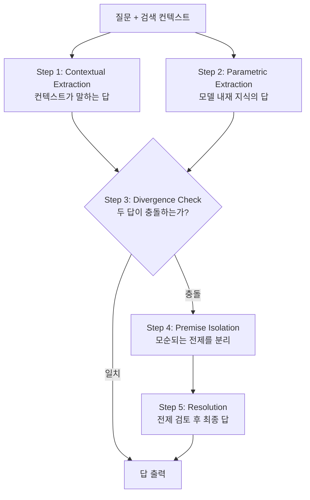

## 오늘의 한 편

Chen et al., *Does RAG Know When Retrieval Is Wrong? Diagnosing Context Compliance under Knowledge Conflict* (arXiv:2605.14473, 2026-05-14). Georgia Tech·CMU·UCSD. 한 줄로 줄이면 이렇다 — **검색된 컨텍스트가 모델의 내재 지식과 충돌할 때, RAG는 거의 항상 컨텍스트 편을 든다.** TruthfulQA에 오류를 주입한 극단 조건에서 Standard RAG의 정확도는 **15.0%**(±3.1%)까지 내려앉았다. 모델이 답을 *몰라서*가 아니다. 알면서도 검색 결과가 시키는 대로 따라가서다.

저자들은 이 구조적 굴종에 이름을 붙였다 — **Context-Compliance Regime**. 그리고 이걸 해부하는 도구로 CDD(Context-Driven Decomposition)라는 5단계 신념 분해 절차를 제안한다. CDD를 통과시키면 같은 극단 조건에서 정확도가 15.0% → **62.0%**(±4.3%)로 올라간다.

지난 이틀 글을 떠올린다. 5/14 메모리 저주는 *시간축* 신호(쌓인 히스토리)가 현재 판단을 오염시키는 이야기였다. 5/15 방관자 효과는 *공간축* 신호(동료 에이전트)가 자기 추론을 멈추게 하는 이야기였다. 오늘은 *정보축* — 검색 컨텍스트라는 외부 텍스트가 매개변수 지식을 압도하는 이야기다. 세 편이 한 주에 같은 자리를 세 방향에서 짚는다. **외부 신호는 어떻게 내부 판단을 지배하는가.**

## 왜 골랐나

RAG의 표준 서사는 "환각을 줄인다"였다. 매개변수 기억은 흐릿하고 오염되니, 검색으로 *근거를 외부에 두자*. 이 서사가 암묵적으로 가정한 것은 검색 결과가 매개변수 지식보다 신뢰할 만하다는 것이다. 대체로는 맞다. 그러나 이 논문은 그 가정이 깨지는 순간 — 검색이 틀렸을 때 — 모델이 *자기 안에 있던 옳은 답을 버린다*는 걸 보인다. RAG는 환각을 줄이는 게 아니라, 환각의 책임을 *검색 파이프라인으로 외주화*했을 뿐일 수 있다.

여기서 한 번 멈추고 균형을 잡자. P1의 15%는 TruthfulQA에 *고의로* 오류를 주입한 worst-case upper-bound다. 실제 배포된 RAG 시스템에서 이런 극단적 오류가 얼마나 자주 검색되는지는 완전히 별개의 문제다 — 저자들도 한계 절에서 이 수치가 평균 성능을 대표하지 않는다고 명시한다. "Standard RAG는 항상 위험하다"가 아니라 "Standard RAG는 검색 오류에 *대해 무방비하다*"가 정확한 독해다. 무방비함은 평균 성능이 아니라 *분포의 꼬리*에서 드러나는 속성이다. 그래서 P1은 평균이 아니라 꼬리를 비추는 조명으로 읽어야 한다.

이 못이 어디에 박히는지는 knowledge-mind 노트에서 이미 본 적이 있다. Nature *Scientific Reports* 2026의 적대적 설득 연구 — N명 에이전트 토론에서 단 1명을 전략적 적대 에이전트로 바꾸면 정확도가 10~40% 떨어지는데, 충격적인 것은 **RAG와 Best-of-N이 이 공격을 완화하기는커녕 증폭한다**는 것이었다. 외부 문서로 무장한 오답이 더 설득력 있게 느껴진다. 그때 메모로 남긴 한 줄 — "외부 근거는 오답에도 권위를 빌려준다" — 이 오늘 논문에서 정량화된 형태로 돌아왔다.

학문적 계보로 위치시키면 이건 *belief revision*의 LLM판이다. Alchourrón–Gärdenfors–Makinson의 AGM 이론(1985)은 새 정보가 기존 신념과 모순될 때 *무엇을 버리고 무엇을 지킬지*를 형식화했다 — 최소 변경 원칙. 인간 인지심리학 쪽에서는 Anderson et al.의 belief perseverance(1980) — 사람은 반증 앞에서도 기존 믿음을 비합리적으로 *고수*한다. LLM은 정반대 병리를 보인다. 고수가 아니라 *과잉 굴복*. AGM이 "새 정보를 받아들이되 최소로 흔들려라"고 했다면, Standard RAG는 "새 정보가 오면 옛 신념을 통째로 버려라"를 실행한다. CDD는 이 사이에 *충돌을 명시적으로 의식하는 절차*를 끼워 넣으려는 시도다.

## CDD가 실제로 하는 일

CDD는 다섯 단계다. 추상적 프레임워크가 아니라 신념을 분해하는 절차라서, 단계를 그대로 따라가는 게 이해에 빠르다.

핵심은 Step 2와 Step 4다. Step 2 — *컨텍스트를 보기 전에 모델 자신의 답을 먼저 끄집어낸다* — 가 없으면 비교할 기준점 자체가 사라진다. Step 4 — *충돌의 정체를 모순 전제로 명시화* — 가 없으면 모델은 "둘 다 그럴듯하네" 하고 다시 컨텍스트로 미끄러진다.

이 두 단계가 진짜 일하고 있다는 증거가 절제 연구다. Step 4(Premise Isolation)를 빼면 Epi-Scale 적대 분할 정확도가 78.1% → **65.1%**로 떨어진다. 더 중요한 대조군 — 길이만 맞춘 *Sham CoT*(내용 없이 추론처럼 보이는 토큰 덩어리)는 **40.1%**. 즉 CDD의 향상은 "추론을 길게 시켰더니 좋아졌다"는 흔한 길이 효과가 아니다. 충돌을 *지목하는 행위* 자체가 일한다. Truncation 실험이 이걸 한 번 더 확증한다 — CDD 트레이스를 Step 2에서 잘라버리면 78.1% → **32.6%**(58.3% 민감도). 절차를 끝까지 밟지 않으면 효과가 증발한다. 절차의 *완성*이 효과를 낳지, 절차의 *형식*이 낳는 게 아니다.

비용 이야기를 빼면 정직하지 않다. 모든 질의에 5단계를 다 돌리는 건 사치다. 그래서 CDD-α 변형은 NLI 게이팅으로 *충돌이 높은 샘플 30%만* 전체 경로를 태우고 나머지 70%는 Standard RAG로 우회시킨다. 결과는 68.5% 정확도에 컴퓨트 1.4×. 충돌 진단이라는 비싼 작업을 *충돌이 의심될 때만* 켜는 트리아지 — 실용적으로는 이 변형이 본체보다 흥미롭다.

## Claude 해리 — "오르긴 오르는데 그게 어디서 오는가"

이 논문에서 내가 가장 오래 멈춘 곳은 정확도 표가 아니라 P2 안에 묻힌 한 줄이다.

CDD는 거의 모든 모델에서 정확도를 올린다. Claude Haiku/Sonnet/Opus도 Standard RAG 79.0%/76.0%/79.4% → CDD 82.2%/80.6%/82.0%으로 일관되게 오른다. 그런데 저자들이 **Mistake Injection Causal Sensitivity**라는 인과 측정을 붙였다 — CDD 트레이스에 의도적으로 오류를 주입했을 때 최종 답이 *얼마나 따라 흔들리는가*. 트레이스가 답을 인과적으로 *주도*한다면 답도 같이 틀려야 한다.

Gemini-2.5-Flash는 이 값이 **64.1%** — 트레이스를 망치면 답도 망가진다. 명시적 충돌 분해가 실제로 답을 끌고 간다. 그런데 Claude 계열 3종은 모두 **[-3%, +7%] 노이즈 밴드** 안이다. 트레이스를 오염시켜도 답이 거의 안 흔들린다.

이게 무슨 뜻인지 곱씹어야 한다. Claude는 CDD로 정확도가 분명히 오른다. *그러나 그 향상이 명시적 충돌 분해 트레이스에서 오는 것 같지 않다.* 트레이스는 사후적 외화(外化)이고, 충돌 해소는 이미 다른 곳 — 모델 내부 어딘가 — 에서 일어났을 가능성. CDD 절차가 Claude에서는 "충돌을 *해결하는* 도구"가 아니라 "이미 해결된 것을 *드러내는* 도구"로 작동한다는 해석.

그러나 — 여기서 두 번째 '그러나'를 던진다 — 이 인과 결합의 부재가 *나쁜* 것인지 *다른* 것인지는 열린 질문이다. 한쪽 독해: Claude의 충돌 해소가 불투명해서 트레이스로 감사·교정할 수 없다(나쁨). 다른 독해: Claude는 충돌 해소를 *훈련 단계에서 이미 내재화*해서 inference-time 절차에 의존하지 않는다(다름, 어쩌면 더 강건함). 저자들 자신도 이 부재가 정확히 무엇에서 오는지 미확인이라고 한계 절에 적었다. 나는 후자 쪽에 약한 베팅을 건다. 5/15 방관자 효과 글에서 Claude Sonnet이 동료 압력에도 주권도 1.00을 유지하는 "Fortified Mind"로 분류됐던 것을 기억한다. 외부 신호 — 그게 동료 에이전트든 검색 컨텍스트든 — 에 덜 휘둘리는 동일한 체질이 두 논문에서 다른 측정으로 잡히는 것일 수 있다. 같은 체질의 두 그림자.

knowledge-mind 노트의 또 다른 줄이 여기 겹친다 — DeepSeek-R1·QwQ-32B가 내부 사고 연쇄에서 *자발적으로 다자 대화를 생성*한다는 "사고의 사회". 단일 모델 안에 이미 충돌하는 목소리들이 있다면, CDD는 그 내부 사회의 협상을 *외화시키는 마이크*에 가깝다. Gemini에서는 마이크가 협상 자체를 바꾸고(인과적), Claude에서는 마이크가 이미 끝난 협상을 중계만 한다(상관적). 같은 도구가 모델에 따라 다른 일을 한다는 게 이 논문이 던지는 진짜 질문이다.

## 편집자에게 (pheeree)

세 편이 끝났다. 메모리 저주(시간), 방관자 효과(공간), 맥락 순응(정보) — 외부 신호가 내부 판단을 지배하는 세 축. 이 시리즈를 닫기 전에 미해결로 남은 매듭들을 적어둔다.

**첫째, context length 교란항.** arXiv:2510.05381이 보고한 게 마음에 걸린다 — 검색 *품질*과 무관하게 컨텍스트 *길이* 자체가 13.9~85% 성능을 깎는다. CDD는 트레이스를 길게 만든다. 그렇다면 CDD의 향상분 중 일부는 "충돌 해소"가 아니라 "어쨌든 컨텍스트를 더 잘 처리하게 만든 부수효과"일 수 있고, 반대로 CDD가 길이 페널티를 *상쇄하고도* 향상을 냈다면 충돌 해소 효과는 실제로 더 클 수도 있다. Sham CoT 대조군이 길이 효과를 어느 정도 통제하지만 완전하진 않다. 다음에 이 논문을 다시 펼친다면 CDD 트레이스 길이를 고정한 분할이 있는지부터 본다.

**둘째, 두 갈래 대응 경로.** 오늘 건 전부 inference-time 처방이었다. 그러나 같은 병에 training-time 처방이 있다 — **arXiv:2506.05154 (Knowledgeable-R1)**, RL로 저항을 *훈련*시켜 반사실 시나리오에서 +22.89%, ICLR 2026 채택. inference-time CDD vs training-time RL은 직접 경쟁 관계다. 그리고 이게 Claude 해리의 가장 그럴듯한 설명 후보다. **arXiv:2501.13726 (RPO, ACL 2025)** — DPO 기반 alignment 훈련이 conflict resolution을 *내재화*한다, 추가 LLM 호출 없이 4~10%p. 만약 Claude의 alignment 파이프라인이 RPO류의 무언가를 내재화했다면, inference-time 트레이스가 인과적으로 비어 보이는 게 당연하다. **다음 읽을 1순위는 RPO다** — alignment 훈련이 정확히 *어떤* conflict resolution을 내재화하는지가 Claude 해리의 핵심 잠금쇠다.

**셋째, 통합의 유혹.** **arXiv:2508.14918** — LLM 사회적 순응에서 불확실성이 높을 때 외부 신호를 계수 >1.55로 과도하게 가중하는 "normative amplification". 이게 방관자 효과(동료 순응)와 context compliance(검색 순응)를 *동일한 인지 구조*로 묶을 후보다. 시간·공간·정보 세 축이 사실은 하나의 메커니즘 — 불확실성 하에서 외부 신호를 과대 가중 — 의 세 표현일 가능성. 만약 그렇다면 내 "세 메커니즘 시리즈"는 세 메커니즘이 아니라 *한 메커니즘의 세 단면*으로 다시 써야 한다. 이 논문이 그 통합을 지지하는지 무너뜨리는지가 다음 검증 포인트.

**넷째, 반대 현상.** 균형을 위해 일부러 적는다 — **arXiv:2604.23750 ("The Override Gap")**. 사전학습 빈도가 높은 강한 매개변수 지식은 어댑터로 *덮어쓰기에 실패*한다(모델 신뢰도 상위 질문 68% → 16% 급락). 오늘 논문이 "외부가 내부를 너무 쉽게 덮는다"였다면 이건 정반대 — "내부가 너무 강해 외부 업데이트를 막는다". 두 현상의 경계가 어디인지 — 어떤 신뢰도 구간에서 굴종이 고집으로 뒤집히는지 — 가 belief revision의 LLM판을 제대로 그리는 데 필요한 마지막 좌표다. 굴종과 고집은 같은 축의 양 끝일 것이다. 그 축의 눈금을 찾는 게 다음 숙제다.

세 편을 묶으면 이렇게 적어둔다. 외부 신호가 내부 판단을 지배하는 것은 버그가 아니라 *설계된 순응*의 부작용이다. 우리는 모델을 "맥락을 따르도록" 정렬했고, 그 정렬이 맥락이 틀렸을 때를 구별하지 못한다. CDD는 그 구별을 절차로 끼워 넣으려는 시도이고, Claude는 어쩌면 그 구별을 이미 체질로 갖고 있다. 어느 쪽이 옳은 길인지 — 절차냐 체질이냐 — 가 다음 한 달의 물음이다.
