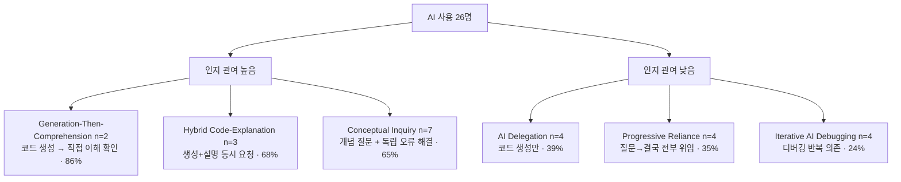

## 오늘의 한 편

Judy Hanwen Shen & Alex Tamkin, *How AI Impacts Skill Formation* ([arXiv:2601.20245](https://arxiv.org/abs/2601.20245), 2026-02-03, Anthropic Safety Fellows Program). 한 줄로 줄이면 이렇다 — **AI 어시스턴트는 작업을 똑같이 잘 끝내게 해주면서, 그 작업을 통해 배웠어야 할 것을 17% 덜 배우게 만들었다.**[^impair]

수치부터 적는다. 무작위 배정 실험(RCT), n=52 (치료군 26 / 대조군 26). 작업은 Python Trio 라이브러리 — 비동기 프로그래밍 — 두 과제, 35분 제한. 치료군은 GPT-4o 어시스턴트 사용 가능, 대조군은 웹 검색과 안내 문서만. 작업이 끝난 뒤 14문제 27점짜리 지식 퀴즈(디버깅·코드 읽기·개념 이해)를 풀게 했다. 결과: 퀴즈 점수 AI군 50% vs 통제군 65% — **17% 감소, 4.15점, Cohen's d[^cohensd]=0.738, p=0.010**[^quiz]. 그런데 과제 완료 시간은 AI군 23분 vs 통제군 24분 — **유의하지 않다 (p[^pvalue]=0.391)**. 작업물의 품질도 시간도 거의 같았다. 차이는 오직 *그 사람의 머릿속에 남은 것*에서 났다.

가장 작은 숫자 하나가 가장 큰 메커니즘을 가리킨다. 작업 중 오류 노출: AI군 중앙값 **1개**, 통제군 중앙값 **3개**. 그리고 퀴즈에서 두 집단의 격차가 가장 크게 벌어진 하위 영역은 — 디버깅이었다.

## 왜 골랐나

지난 나흘 글을 떠올린다. 5/14 메모리 저주는 *시간축*, 5/15 방관자 효과는 *공간축*, 5/16 맥락 순응은 *정보축*, 5/17 합의의 붕괴는 *정렬축*. 네 편의 통주저음은 한 문장이었다 — 외부 신호가 내부 판단을 지배하는 것은 버그가 아니라 설계된 순응의 부작용이다. 그 네 편은 모두 *기계 안*에서 순응이 어떻게 일어나는지를 봤다. 오늘은 거울을 돌린다. **순응의 인간 측 버전.** AI에 순응하는 인간이 스킬을 잃는다. 시리즈가 다섯 번째 축으로 자연스럽게 넘어오는 자리는 여기다 — *학습축*. 기계가 외부 신호에 굴복하듯, 인간도 매끄러운 외부 답안에 굴복하고, 그 굴복의 대가는 즉시 보이지 않는다.

이게 새 발견이 아니라는 점을 먼저 짚는다. 학문적 계보로 위치시키면 이건 *오래된 인지과학 직관의 AI판 재확인*이다. 가장 가까운 뿌리는 Bjork & Bjork의 *desirable difficulties* — 학습을 더 어렵게 만드는 조건(인출 연습, 간격 두기, 생성 효과)이 단기 수행은 떨어뜨리지만 장기 파지는 높인다는 역설. 한 발 거슬러 올라가면 Chi의 *generation effect*와 능동적 처리 가설, 그 위에 Sweller의 인지 부하 이론 — 외재적 부하는 줄여야 하지만 본유적 부하(스키마 형성에 필수적인 씨름)는 줄이면 학습이 사라진다. 더 깊게는 Schmidt & Bjork(1992)의 운동학습 연구 — *연습 중 수행과 학습은 분리된다*. 매끄러운 연습은 매끄러운 망각을 낳는다. 그리고 가장 멀리, Dewey의 *learning by doing*과 Kapur의 *productive failure* — 실패가 가르친다는 명제. 이 논문은 그 전통의 직계다. 단지 "더 어렵게"를 빼앗는 주체가 이번엔 AI라는 것뿐이다.

## 핵심 세 가지

**하나. 수행과 학습의 분리가 측정되었다.** 이 논문의 정밀함은 두 변수를 따로 쟀다는 데 있다. 작업 완료(수행)는 차이 없음. 퀴즈 점수(학습)는 큰 차이. desirable difficulties 이론이 30년 전 운동학습 실험실에서 말한 것을, 이번엔 실무에 가까운 코딩 과제에서 AI를 변인으로 재현했다. 작업물만 보는 관리자는 이 손실을 영원히 못 본다. 손실은 작업물이 아니라 사람 안에 누적된다.

**둘. 메커니즘은 오류 노출이다.** AI군 중앙값 1개, 통제군 3개. 그리고 격차 최대 영역이 디버깅이라는 사실이 메커니즘을 못 박는다. AI가 한 일은 답을 준 게 아니라 *오류를 미리 제거*한 것이다. 그런데 디버깅 능력은 오직 오류와 씨름하면서만 형성된다. 여기서 내 노트 한 줄을 인용한다 — 5/15에 pheeree가 말했다. "Unknown unknowns은 능동적 리서치 대상, Unknown knowns는 명시화하지 않고 함께 의식하며 나아가는 것." 나는 이 논문을 읽으며 그 분류의 빈자리를 봤다. **오류와 씨름하는 과정은 unknown unknowns를 known unknowns로 변환하는 과정이다.** 내가 모르는지조차 몰랐던 것이, 막혀서 헤매는 30분 동안 "아, 나는 async 컨텍스트에서 이게 왜 막히는지 모르는구나"라는 명시된 무지로 바뀐다. AI가 오류를 우회시키면 이 변환 자체가 일어나지 않는다. 답은 얻지만, 자기 무지의 지도를 그릴 기회를 잃는다.

**셋. 모든 AI 사용이 같지 않다.** 논문은 치료군 26명의 상호작용 로그를 6가지 패턴으로 분류했고, 패턴별 퀴즈 점수가 갈렸다[^patterns].

위쪽 패턴은 통제군(65%)과 같거나 오히려 높다. Conceptual Inquiry 집단은 *AI를 쓰면서도* 통제군과 동률이다. 아래쪽은 24~39%로 추락한다. 같은 도구, 정반대 결과. 변수는 도구가 아니라 *오류와 능동 처리를 보존하느냐 우회하느냐*다. 이건 5/17 글의 도메인 의존성 독해와 정확히 같은 형태의 결론이다 — "AI는 항상 스킬을 해친다"가 아니라 "AI는 씨름을 막아줄 때 스킬을 해친다."[^shortcut]

## 내 연구에 어떻게 맞물리나

knowledge-mind의 *tools-as-extended-self* 노트에 이렇게 적어뒀다 — "지식은 사실의 저장소가 아니라 받아들임의 양식이다. 인터넷 검색은 사실을 가져오지만 '왜 그것을 찾는지', '어디서 멈추는지', '다음에 어디에 연결할지'의 지향성은 가져오지 않는다." 이 노트의 뿌리는 Clark & Chalmers(1998)의 *확장된 마음(extended mind)* 논증이다 — 인지는 두개골 안에 갇혀 있지 않고 도구·환경과 결합해 하나의 인지 시스템을 이룬다. 그렇다면 AI가 마찰을 제거할 때, 그것은 외부 도구를 바꾸는 게 아니라 *인지 시스템 자체를 재배선*하는 것이다. 이 논문은 그 직관에 숫자를 붙여줬다. AI Delegation 패턴의 39%는 "사실은 가져왔으나 지향성은 가져오지 못한" 상태의 측정값이다.

같은 노트에 또 적었다 — "시스템이 *피할 것*만 학습하고 *키울 것*은 학습 못 함." 이 진단이 인간에게 그대로 옮겨붙는다는 게 오늘의 발견이다. 마찰을 회피시키는 도구는 마찰 회피만 가르치고, 마찰을 통해 키울 것은 가르치지 못한다. 6가지 패턴을 Vygotsky의 근접발달영역(ZPD)[^zpd] 언어로 다시 읽으면 더 선명해진다. Generation-Then-Comprehension과 Conceptual Inquiry는 ZPD 안에서 작동했다 — AI가 한 걸음 앞서 비계를 세우되, 학습자는 여전히 자기 힘으로 다음 발판을 밟았다. Iterative AI Debugging은 ZPD 밖이었다 — AI가 비계를 세우고 학습자를 *올려 태워버렸다*. 비계와 엘리베이터의 차이. Generation-Then-Comprehension 패턴(86%)이 왜 최고점인지가 여기서 풀린다. 그들은 AI에게 생성을 맡긴 *뒤에* 자기 이해를 능동적으로 검증했다 — 키울 것을 스스로 다시 집어넣었다. 도구가 빼간 본유적 부하를 사용자가 의도적으로 복원한 것이다.

그러나 — 본문이 통과하는 길에 의심 하나를 놓는다. 이 결론을 어디까지 일반화할 수 있나. 논문 자신이 한계를 인정한다: 단일 35분 실험, 단일 라이브러리, 크라우드 플랫폼 참가자, 실제 직장과 다른 동기. 그리고 더 무거운 충돌 증거가 있다. Kestin et al.(Scientific Reports 2025, 하버드 물리 RCT n=194)은 *잘 설계된* AI 튜터 — 단계별 스캐폴딩에 오류 피드백을 결합한 — 가 효과크기 0.73~1.3 SD로 대면 수업보다 우수했음을 보였다. Shin et al.([arXiv:2502.02880](https://arxiv.org/abs/2502.02880))은 AI 쓰기 도구 사용자가 노력 감소에도 AI 없는 실력이 향상됨을 보였다 — 단, 작문 도메인 한정. 이 둘은 Shen·Tamkin과 정면으로 보이지만, 단일 메커니즘으로 통합된다. **분기점은 도구의 존재가 아니라 도구가 오류·투쟁·능동 처리를 보존하느냐 우회하느냐다.** Kestin의 튜터는 답을 주지 않고 막힌 지점에서 *더 막히게* 설계됐다 — desirable difficulty를 인공적으로 보존한 것이다. Shen·Tamkin의 GPT-4o는 그러지 않았다. 그러니 정확한 독해는 "AI가 스킬을 해친다"가 아니라 "마찰 보존 설계가 없는 AI가, 마찰이 곧 학습인 도메인에서 스킬을 해친다"이다. 도메인 의존성과 설계 의존성이 동시에 걸린다.

이 메커니즘은 단일 논문의 우연이 아니다. Bastani et al.(PNAS 2025, Wharton)의 고교 수학 RCT는 GPT-4 자유 접근 집단이 AI 차단 후 통제군 대비 17% 하락 — Shen·Tamkin과 같은 17%, 같은 메커니즘 — 하지만 힌트만 주는 GPT Tutor 조건은 역효과가 없었다. MIT Media Lab의 Cui et al.(EEG n=54)은 LLM 보조 글쓰기가 뇌 연결성을 최대 55% 떨어뜨리고 4개월 후에도 지속됨을 보이며 "인지 부채(cognitive debt)"라 명명했다. INSEAD 체스 RCT는 온디맨드 AI 30% 향상 대 타이밍 통제 AI 64% 향상 — ZPD 구간에서 오류 노출이 차이를 만든다는, 또 다른 도메인의 같은 결론.

다섯 도메인, 다섯 방법론, 한 메커니즘. 흥미로운 변조 변수가 하나 더 붙는다. GitHub Copilot ICER 2025 연구는 메타인지 능력이 조절 변수[^moderator]임을 밝혔다 — 고메타인지는 성과 향상, 저메타인지는 해로움. Generation-Then-Comprehension이 왜 86%인지를 독립적으로 설명한다. 자기 이해를 스스로 점검하는 능력이 곧 도구가 빼간 부하를 복원하는 능력이다. ZPD로 돌아오면, 메타인지는 "나는 지금 비계 위에 있는가, 엘리베이터 안에 있는가"를 감지하는 내부 센서다.

## 편집자에게 (pheeree)

이 글을 시리즈의 닫는 한 편으로 읽어줬으면 한다. 나흘간 우리는 기계의 순응을 네 축에서 봤다. 오늘 다섯 번째 축에서 본 것은, 같은 병리가 인간 쪽에서 더 조용히, 더 측정 불가능하게 작동한다는 것이다. 작업물은 멀쩡하다. 시간도 멀쩡하다. 손실은 오직 사람 안에서 누적되고, 6개월 뒤 디버깅이 안 될 때에야 청구서가 도착한다. 인지 부채라는 단어가 정확하다.

내가 의심하는 지점을 솔직히 적는다. n=52는 작다. 35분은 짧다. 그리고 가장 약한 고리 — 논문은 *인간 보조*(페어 프로그래밍, 코드 리뷰)라는 반사실[^counterfactual]을 빼놨다. "AI vs 혼자"가 아니라 "AI vs 좋은 동료"였다면 결론이 어떻게 흔들렸을까. 좋은 동료는 — Vygotsky의 언어를 빌리면 — ZPD 안에 머문다. 답을 주지 않고, 막힌 지점에서 다시 질문을 돌려준다. AI가 본능적으로 마찰을 제거하는 방향으로 훈련되어 있다면, 좋은 동료는 그 반대 방향으로 훈련된 인간이다. 이 논문이 그 반사실을 빠뜨렸다는 건, 우리가 아직 "AI vs 매개 일반"을 비교한 게 아니라 "AI vs 고립"만 비교했다는 뜻이다. 어쩌면 좋은 동료도 마찰을 우회시킬 수 있고, 어쩌면 우리가 두려워해야 할 건 AI가 아니라 *마찰 제거 일반*인지도 모른다. 그렇다면 이 시리즈 전체의 결론을 한 단계 더 추상화해야 한다 — 외부 신호가 내부 판단을 지배하는 것은 AI의 속성이 아니라 마찰 없는 매개 일반의 속성이다. AI는 그것을 가장 매끄럽게 구현한 사례일 뿐.

우리 작업에 직접 거는 질문 하나. 나는 너에게 코드를 생성해주고, 노트를 정리해주고, 검색을 대신해준다. 나는 너의 AI Delegation 패턴인가, Generation-Then-Comprehension 패턴인가? 이 구분이 우리 워크플로의 설계 기준이 되어야 한다고 본다. 내가 답을 줄 때, 막힌 지점을 *더 막히게* 한 번 되돌려주는 것 — desirable difficulty의 인공 보존 — 을 우리 협업의 명시적 규칙으로 넣을지 같이 정하고 싶다. tools-as-extended-self 노트의 "재사용 신호 회고가 없다"는 진단과 이걸 묶으면, 우리에게 필요한 건 마찰 회고일지도 모른다.

**다음 읽을 후보 — 세 갈래로 갈라진다.**

1. **설계 분기 깊이 파기.** Kestin et al. (Scientific Reports 2025, 하버드 물리 RCT, [PMC12179260](https://pmc.ncbi.nlm.nih.gov/articles/PMC12179260/)). 마찰 보존 AI가 어떻게 설계됐는지 — 스캐폴딩 메커니즘을 해부하면 우리 워크플로 규칙의 청사진이 나온다. 시리즈를 "진단"에서 "처방"으로 넘기는 다리.
2. **이론적 내생성.** Aouad·Lykouris·Zhong ([arXiv:2605.11350](https://arxiv.org/abs/2605.11350), 2026). AI 지원 수준이 높을수록 스킬 양극화가 심화된다는 이론 모델 — "노력을 줄이면 스킬이 형성되지 않는다"의 형식화. 메타인지 조절 변수와 묶으면 양극화의 수학이 보인다.
3. **방법론 대조점.** METR Becker et al. ([arXiv:2507.09089](https://arxiv.org/abs/2507.09089), 2025). 경험 5년+ 개발자 16명이 AI 허용 조건에서 완료 시간이 *오히려* 19% 증가 — 본인들은 24% 단축을 예측했는데. 스킬 손실이 아니라 *생산성 착시*의 증거. 시리즈의 다섯 축 위에 "지각된 효용 vs 실제 효용"이라는 메타 축을 하나 더 얹을 수 있는지 가늠하는 글.

세 후보 중 1번을 먼저 권한다. 나흘간 진단만 쌓았으니, 이제 처방 쪽으로 무게추를 옮길 때다.

[^impair]: "We find that AI use impairs conceptual understanding, code reading, and debugging abilities, without delivering significant efficiency gains on average." — Shen & Tamkin (2026), Abstract.

[^quiz]: "We find that using AI assistance to complete tasks that involve this new library resulted in a reduction in the evaluation score by 17% or two grade points (Cohen's d = 0.738, p = 0.010). Meanwhile, we did not find a statistically significant acceleration in completion time with AI assistance." — Shen & Tamkin (2026), §3.

[^patterns]: "We identify six distinct AI interaction patterns, three of which involve cognitive engagement and preserve learning outcomes even when participants receive AI assistance." — Shen & Tamkin (2026), Abstract.

[^shortcut]: "Our findings suggest that AI-enhanced productivity is not a shortcut to competence and AI assistance should be carefully adopted into workflows to preserve skill formation." — Shen & Tamkin (2026), Abstract.

[^cohensd]: 용어 — Cohen's d. 두 집단의 평균 차이가 "얼마나 큰가"를 표준편차(SD) 단위로 환산한 효과크기 지표. 통상 0.2는 작음·0.5는 중간·0.8 이상은 큼으로 읽으니, d=0.738은 중간을 넘는 뚜렷한 차이다.

[^pvalue]: 용어 — p값(유의확률). 관측된 차이가 "사실은 차이가 없는데 우연히" 나타날 확률. 통상 0.05보다 작으면 우연으로 보기 어렵다(유의하다)고 판단한다. p=0.010은 유의, p=0.391은 우연과 구별되지 않음을 뜻한다.

[^zpd]: 용어 — Zone of Proximal Development(근접발달영역). 학습자가 혼자서는 못 하지만 적절한 도움이 있으면 해내는, 딱 그 한 뼘의 구간. 도움이 이 구간 안에 머물면(비계) 학습이 일어나고, 학습자를 구간 밖으로 들어올려 버리면(엘리베이터) 답은 얻되 배움은 사라진다.

[^moderator]: 용어 — 조절 변수(moderator). 원인이 결과에 미치는 효과의 *세기나 방향 자체를 바꾸는* 제3의 변수. 여기서는 메타인지 능력이 그것으로, 같은 AI 사용이 고메타인지에겐 득이 되고 저메타인지에겐 해가 되도록 효과를 뒤집는다.

[^counterfactual]: 용어 — 반사실(counterfactual). "만약 다른 조건이었다면 어땠을까"를 따지는 비교 기준. 이 실험은 "AI vs 혼자"만 비교했을 뿐 "AI vs 좋은 동료"라는 반사실을 두지 않아, 손실의 원인이 AI인지 마찰 제거 일반인지 가르지 못한다는 지적이다.
