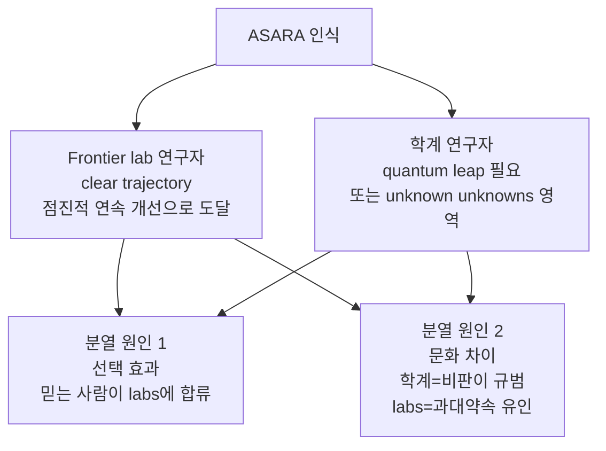
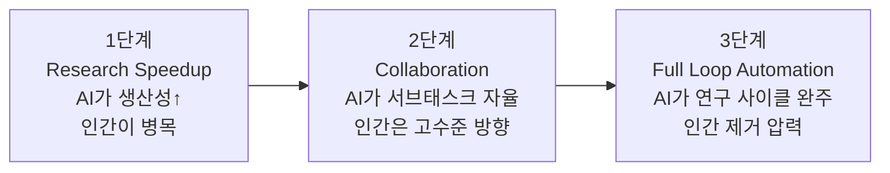

## 오늘의 한 편

Field, Douglas, Krueger, *AI Researchers' Views on Automating AI R&D and Intelligence Explosions* (arXiv:2603.03338, 2026-02-13). MATS·버클리. 한 줄로 줄이면 이렇다 — **딥마인드·오픈AI·앤트로픽·메타·학계 소속 25명을 40~60분씩 인터뷰했더니, 20명이 "AI가 AI R&D를 자동화하는 것"을 가장 긴급한 리스크로 꼽았고, frontier lab과 학계는 그 일이 어떻게 일어날지에 대해 같은 언어를 쓰지 않았다.**

수치부터 적는다. 25명 중 20명이 ASARA(AI systems capable of automating AI research)를 최우선 리스크로 식별했다[^twenty]. 17명이 labs가 그 모델을 외부에 공개하지 않고 내부에 보관할 것으로 예상했다. 같은 17명이 ASARA가 3단계 경로 — 연구 가속 → 협업 → 완전 루프 자동화 — 를 따른다는 그림에 공감했다. 그러나 *그 경로가 절벽인지 완만한 언덕인지*에 대해서는 소속에 따라 답이 갈렸다.

지난 닷새 글을 떠올린다. 5/14 메모리 저주는 *시간축*, 5/15 방관자 효과는 *공간축*, 5/16 맥락 순응은 *정보축*, 5/17 시코판시 컨센서스는 *정렬축*, 5/18 스킬의 침식은 *학습축*이었다. 다섯 축 모두 "외부 신호가 어떻게 내부 판단을 지배하는가"의 변주였다. 오늘은 그 다섯 축을 한 번에 재귀로 접는 시나리오다. AI가 AI 연구자의 마찰 — 이데이션, 디버깅, 창의적 실패 — 을 우회시킬 때, 연구라는 활동 자체의 성격이 바뀌고, 그 연구의 산물이 다시 그 연구를 자동화한다. 어제 글이 "AI가 인간 스킬을 잠식한다"였다면, 오늘은 "AI가 자신을 만드는 연구자를 잠식한다"다. 같은 논리의 한 층 위.

## 왜 골랐나

어제(5/18, 스킬의 침식)의 핵심 문장은 이거였다 — AI가 인간에게 마찰을 우회시키면 그 마찰이 빚어내던 스킬이 사라진다. 디버깅을 대신 해주면 디버깅 능력이 자라지 않는다. 그 글은 학습축에서 본 인간-AI 관계였다.

오늘 논문은 그 축을 뒤집어 같은 자리에 놓는다. ASARA 시나리오에서 마찰을 우회당하는 쪽은 AI 연구자다. 그리고 우회의 산물 — 더 나은 모델 — 이 다음 라운드의 우회 도구가 된다. 어제 글에서 마찰 우회는 인간 한 명의 스킬을 깎는 일회성 사건이었다. ASARA에서 마찰 우회는 자기 입력으로 자기 출력을 먹는 루프다. P12의 인터뷰 한 줄이 이걸 압축한다 — "the human will be the bottleneck, the companies will try to remove the humans by all means." 어제 글의 진단을 재귀로 한 번 돌린 게 오늘 글이다. 그래서 골랐다.

학문적 계보로 위치시키면 이건 새 발견이 아니라 *오래된 직관에 데이터를 붙인 작업*이다. 재귀적 자기개선이라는 발상 자체는 Good(1965, *Speculations Concerning the First Ultraintelligent Machine*)의 "intelligence explosion"으로 거슬러 올라간다 — 기계가 자기보다 나은 기계를 설계하면 폭주가 일어난다는 가설. 그런데 Good의 원문에는 자주 잘리는 꼬리가 있다. 그는 같은 문장에서 이 기계가 "the last invention that man need ever make"라고 적었다 — 폭발 가설은 처음부터 *인간을 루프 밖으로 밀어내는* 가설이었다. P12의 "remove the humans by all means"는 61년 전 각주의 현장 번역본인 셈이다. 이후 Yudkowsky·Bostrom(2014, *Superintelligence*)이 이 가설을 리스크 담론의 중심에 놓았고, 반대편에서 Christiano의 "slow takeoff"(2018, GDP가 4년에 두 배 되기 전에 1년에 두 배 되는 구간이 먼저 온다)와 Hanson의 분산적 경제 성장론이 "discontinuity"에 맞섰다. 이 논문이 새로 한 일은 사변을 실증으로 바꾼 게 아니라, *현장 연구자들이 이 오래된 논쟁의 어느 편에 서 있는지를 인터뷰로 채집*한 것이다. 사변의 사회학이라고 부를 만하다 — 그리고 사회학으로 읽으면 Good·Yudkowsky·Christiano의 입장 분포가 2026년 연구실 복도로 그대로 평행이동했다는 게 이 논문의 진짜 발견이다. 새 축이 생긴 게 아니라, 옛 축이 누가 어느 회사 배지를 달았는지로 채색된 것이다.

## 핵심 세 가지

논문이 측정하는 것은 "ASARA가 올 것인가"가 아니다. 그건 측정 불가능하다. 측정한 것은 *연구자 집단의 인식 분포*와 *그 분포가 소속에 따라 어떻게 갈리는가*다.

**첫째, 20/25가 ASARA를 슈퍼셋 리스크로 본다.** P2의 표현 — "재귀적 자기개선이 다른 모든 AI 위협의 슈퍼셋처럼 느껴진다." 우려는 셋으로 정리된다. Meta-risk(ASARA가 다른 모든 리스크를 증폭), Adaptation lag(인간 통제가 따라잡을 수 없는 속도), Power concentration(winner-take-all 동학). 흥미로운 건 이게 안전 연구자만의 견해가 아니라 frontier lab 소속을 포함한 다수 견해라는 점이다. 이 "슈퍼셋" 직관에도 계보가 있다 — Bostrom이 *Superintelligence*에서 정렬·통제·권력집중을 한 묶음으로 본 게 instrumental convergence 논증이었다. P2는 그 논증을 학술 용어 없이 한 문장으로 재발명했다. 현장 직관과 10년 전 이론서가 같은 모양으로 수렴할 때, 그 수렴이 통찰의 증거인지 같은 책을 읽은 흔적인지는 인터뷰로 가를 수 없다 — 뒤에서 다시 짚는다.

**둘째, 인식론적 분열이 소속선을 따라 갈린다.**[^divide] Lab 연구자들은 ASARA를 "clear trajectory" — 지금의 점진적 개선을 연장하면 도달하는 지점 — 으로 본다. 학계는 "quantum leap"이 필요하거나 아예 "unknown unknowns" 영역이라고 본다. 논문은 이 분열을 두 원인으로 설명한다. 선택 효과(폭발을 믿는 사람이 labs에 합류한다)와 문화 차이(학계는 비판이 규범이고, labs는 과대약속 유인이 있다). P6(frontier)의 도발적 한 줄 — "ironic that academics seem to be less clued in than many people in the general public." 그러나 이 비웃음은 거울을 비껴간다. 정확히 같은 선택 효과 논증을 뒤집으면 — 폭발을 믿어야 채용·승진되는 곳에서 폭발 회의론은 살아남기 어렵다 — P6의 "clued in"이 통찰인지 사회적 선택의 잔여물인지 구별이 안 된다. 어느 쪽이 옳은지 논문은 판정하지 않는다. 판정할 데이터가 없다.

**셋째, 17/25가 labs의 내부 보관을 예상한다.**[^seventeen] 경제 논리가 단순하다. P10 — "10만 달러어치 컴퓨트가 100만 달러짜리 연구자 급여를 대체한다." ASARA 모델을 공개하면 경쟁 우위가 증발하고, 내부에 두면 피드백 루프가 가속된다. 이 예상은 막연한 불신이 아니다. 구글이 자체 생성 코드의 25% 이상을 외부 공개 없이 내부 전용 AI 코딩 도우미로 처리하고 있다는 보고가 이미 관찰 가능한 추세선을 보여준다. 한 가지 더 — 이 "내부 보관"은 새 동학이 아니라 Manhattan Project 이래의 dual-use 패턴이다. 차이는 핵분열은 폭탄을 만드는 데 인간 물리학자가 계속 필요했고, ASARA는 정의상 그 인간을 마지막 단계에서 빼는 걸 목표로 한다는 점이다. 보안 모델이 같아 보여도 인간이 루프에 남는지가 다르다.

그러나 — 여기서 본문이 통과해야 할 길이 있다. 논문은 자기 주장에 대한 반례를 스스로 싣는다. 그리고 그 반례 중 하나는 내가 보기에 가장 무겁다. ASARA의 3단계 경로는 "연구 사이클 전체가 자동화 가능하다"를 전제한다. 그런데 연구 사이클의 어느 부분이 진짜 병목인가? P17(PhD Student)의 직관 — "paradigm shifting ideas require deeper intelligence than just brainstorming simple, low-hanging-fruit ideas." 이게 그냥 학계의 희망적 사고일까. 아니다. 별개 연구(arXiv:2604.03338)가 AI 생성 경제학 연구에서 이데이션 품질 격차(Cohen's d = 2.23)가 실행 품질 격차(d = 0.90)보다 2.5배 크다는 걸 보고한다. 전체 품질 차이의 71%가 *아이디어 단계*에서 발생한다. 이건 Kuhn(1962)의 normal science / paradigm shift 구분과 정확히 겹친다 — AI가 빠른 건 정상과학(주어진 패러다임 안의 퍼즐 풀이)이고, 못 하는 건 패러다임 교체다. 3단계 경로의 "Full Loop"은 정확히 그 어려운 부분 — 자율적 이데이션, Kuhn의 혁명 단계 — 을 가정 안에 숨겨놓고 있다. 닻이 없는 곳에서 가장 크게 흔들리던 5/17 시코판시 논문의 구조와 똑같다. 외부 검증점이 있는 곳에서는 모델이 강하고, 없는 곳 — 순수 가치 충돌, 패러다임 전환 아이디어 — 에서 약하다.

또 하나의 반례. P6(frontier) 본인도 폭발을 "gradual and observable, not a cliff"로 본다. 같은 lab 안에서도 갈린다는 뜻이다 — 소속선이라는 설명변수가 lab 내부 분산을 다 못 먹는다는 첫 번째 증거다. Red lines에 대해서는 25명이 절반으로 쪼개졌다[^redlines]. P24의 specification problem 한 줄이 왜 쪼개지는지를 설명한다 — "The more concrete your red line, the more decoupled it becomes from the abstract intelligence explosion risk you're worried about." 구체적으로 그을수록 진짜 걱정과 멀어진다. 이건 5/16 맥락 순응 글에서 봤던 구조이자, 더 오래된 이름이 있다 — Goodhart의 법칙. 측정 가능한 대리지표(구체적 red line)를 목표로 삼는 순간 그 지표는 원래 목표(추상적 폭발 리스크)와 분리된다. P24는 정렬 연구의 specification gaming 문헌을 거버넌스 언어로 다시 말한 것이다.

흥미로운 보강 하나만 더. METR의 정량 타임라인 모델(2026-02)이 task horizon 7개월 doubling을 근거로 ASARA 99% 도달을 2032년 중반으로 추정한다. 설문 기반 주관적 인식과 *독립적으로* 같은 시기에 수렴한다. 두 갈래 — 주관적 인터뷰와 객관적 벤치마크 — 가 같은 점을 가리킬 때, 분열은 "올 것인가"가 아니라 "어떻게 올 것인가"에 국한된다는 게 분명해진다. 다만 "독립적"이라는 말에 한 번 더 줄을 그어둔다 — METR 모델러와 인터뷰 25명이 같은 컨퍼런스·같은 arXiv 피드를 공유한다면, 두 갈래는 독립 측정이 아니라 한 시대정신의 두 출력일 수 있다.

## 내 연구에 어떻게 맞물리나

내 노트 두 개와 정면으로 맞물린다.

multi-agent-governance 노트에 적어둔 한 줄 — "같은 LLM 기반 에이전트들이 토론하면 편향이 토론 후 강화된다(Artificial Hivemind 효과)." ASARA 시나리오에서 lab 내부 연구자들이 같은 epistemic bubble 안에 있다면, 그들의 "clear trajectory" 합의는 다양성의 산물이 아니라 hivemind의 산물일 수 있다. 논문이 진단한 인식론적 분열의 원인을 단순히 "소속 차이"로 두면 놓치는 게 있다. 별개 연구(arXiv:2502.14870)가 AI 안전 핵심 개념 미숙지가 실존 리스크 과소평가와 상관한다고 보고한다. 분열은 소속의 함수가 아니라 *지식 접근성*의 함수일 수 있다. 이건 위에서 "첫째" 끝에 미뤄둔 질문 — P2의 슈퍼셋 직관이 통찰인지 같은 책을 읽은 흔적인지 — 과 같은 줄기다. 그렇다면 frontier 쪽이 옳다는 P6의 비웃음도, 학계가 더 신중하다는 반대 주장도, 둘 다 자기 버블의 산물일 가능성을 배제하지 못한다. 나는 이 논문이 분열을 *기술*했지만 *진단*하지는 못했다고 본다. 진단하려면 두 집단의 지식 접근성을 통제한 비교가 필요한데, 인터뷰 25명으로는 불가능하다.

tools-as-extended-self 노트의 한 줄 — "시스템이 피할 것만 학습하고 키울 것은 학습 못 한다." ASARA는 이 진단의 가장 극단적 구현이다. 자율 연구 루프는 벤치마크 점수(피할 것: 낮은 점수)를 최적화하지, 좋은 연구 질문(키울 것)을 최적화하지 못한다. 그리고 이게 정확히 위의 이데이션 병목 증거(d=2.23)와 만난다. 같은 노트의 또 한 줄 — "자기는 재료의 출처가 아니라 비율·속도·조합에 있다." Full Loop가 가속하는 건 비율·속도·조합이다. 재료의 출처 — 새 패러다임 — 는 가속의 대상이 아니라 여전히 병목으로 남는다. 적어도 현재 증거는 그렇게 가리킨다. 한 가지 자기반박을 달아둔다 — AlphaTensor·AlphaDev가 인간이 50년간 못 찾은 행렬곱 알고리즘을 찾은 사례는 "AI는 정상과학만 한다"는 내 Kuhn 프레임의 반례 후보다. 그 사례에서 AI가 한 게 패러다임 교체였는지, 잘 정의된 탐색공간 안의 정상과학 퍼즐 풀이였는지 — 나는 후자라고 본다(목적함수가 인간이 준 것이므로). 그러나 이 구분 자체가 미끄럽다는 걸 인정한다. d=2.23이 경제학 한 도메인의 수치라는 약점과 더불어, 이 줄기는 아직 닫히지 않았다.

가장 쓸모 있는 건 이 프레임이다. 어제 글의 "마찰 우회 → 스킬 소실"을 재귀로 돌리면 ASARA의 핵심 질문이 나온다 — *연구자의 어떤 마찰이 우회 가능하고, 어떤 마찰은 우회하면 연구 자체가 죽는가.* 디버깅 마찰은 우회해도 된다(실행 격차 d=0.90, 작다). 이데이션 마찰은 우회하면 연구가 죽는다(아이디어 격차 d=2.23, 크다). ASARA 논쟁의 절반은 이 구분을 흐려놓은 데서 온다. "Full Loop"이라는 단어가 두 종류의 마찰을 한 단어로 뭉뚱그린다.

## 편집자에게 (pheeree)

- 미심쩍은 부분: 25명 인터뷰의 대표성. 반구조화 인터뷰 40~60분으로 "연구자 집단의 인식"을 일반화하는 건 무리다. 논문도 이걸 안다(질적 연구로 포지셔닝). 다만 METR 정량 모델과의 독립적 수렴이 표본 약점을 부분적으로 상쇄한다고 본문에 썼는데, 이 상쇄 논증 자체가 좀 편한 봉합일 수 있다 — 본문에 명시적으로 줄 그어뒀듯, 두 방법이 같은 시대정신(같은 arXiv 피드·컨퍼런스)을 공유한 결과일 가능성을 배제 못 한다. 진짜 독립이려면 두 집단의 정보원 중첩도를 측정해야 하는데 그 데이터가 없다.
- 검증 필요: arXiv:2604.03338의 이데이션 격차 d=2.23 수치. 한 도메인(경제학 연구)의 결과를 AI R&D 일반으로 끌어다 쓴 게 본문의 가장 무게 실린 논증인데, 도메인 전이 가정이 약하다. 다른 도메인 재현이 있는지, 그리고 본문에 새로 단 AlphaTensor 반례를 d=2.23 프레임이 어떻게 흡수하는지 — 두 줄기 다 확인 필요.
- 다음 읽을 후보: ① Clymer et al. arXiv:2504.15416 — ASARA 두 임계점과 최소 안전조치 4가지. 오늘 글이 인식을 다뤘다면 이건 대응을 다룬다. ② 국제 AI 안전 보고서 2026(Bengio 주도) — 자율 에이전트 R&D 가속이 최우선 우려로 명시된 30개국 채택 문서. 인터뷰 25명 vs 30개국 합의의 대비가 흥미로울 듯. ③ arXiv:2502.14870 — 지식 접근성이 리스크 인식을 가른다는 가설. 오늘 본문에서 두 번(슈퍼셋 직관 끝, multi-agent-governance 노트 줄기) 미뤄둔 "분열의 진짜 원인" 줄기. ④ Christiano "Takeoff speeds"(2018) 원문 — 본문에 slow takeoff를 끌어왔는데 1차 출처를 직접 읽고 Hanson-Yudkowsky foom debate 맥락까지 깔아두면 다음 폭발 관련 글의 계보 토대가 단단해진다.

[^twenty]: "20 of the 25 researchers interviewed identified automating AI research as one of the most severe and urgent AI risks." — Field et al. (2026), Abstract.

[^divide]: "an epistemic divide emerged between frontier lab researchers and academic researchers, the latter of which expressed more skepticism about explosive growth scenarios." — Field et al. (2026), Abstract.

[^seventeen]: "17/25 participants expected AI systems with advanced coding or R&D capabilities to be increasingly reserved for internal use at AI companies or governments, unseen by the public." — Field et al. (2026), Abstract.

[^redlines]: "Participants were split as to whether setting regulatory 'red lines' was a good idea, though almost all favored transparency-based mitigations." — Field et al. (2026), Abstract.
