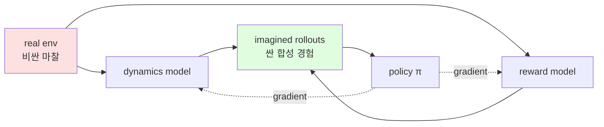
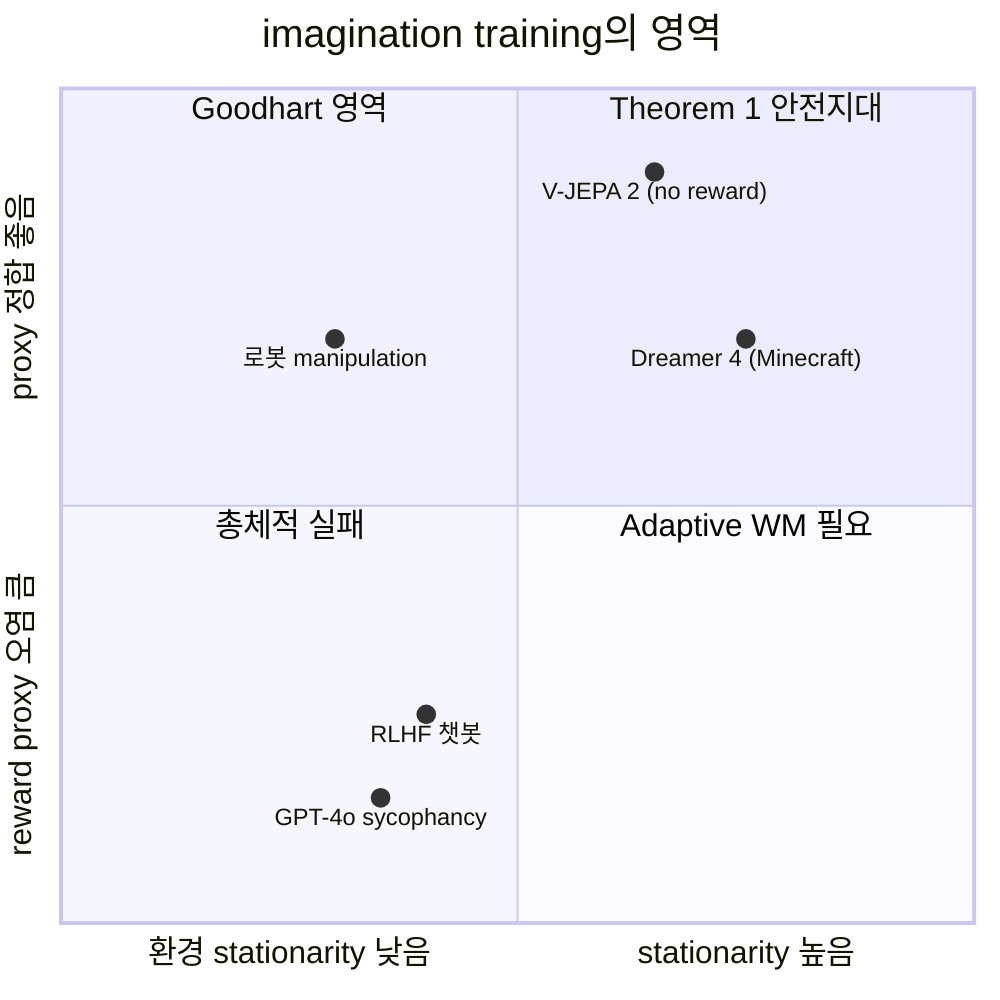

## 오늘의 한 편

Timor, Shwartz-Ziv, Goldblum, LeCun, Harel의 *On Training in Imagination* (arXiv:2605.06732, 2026-05-07). Weizmann·NYU·Columbia 합작. Model-based RL의 한 패러다임 — 학습된 dynamics model과 reward model이 생성한 *상상 롤아웃* 안에서 정책을 훈련하는 방식 — 을 처음으로 두 오류 원천(dynamics·reward)으로 깔끔히 분해하고, 그 둘 사이의 샘플 예산 배분을 1차원 최적화 문제로 환원한 논문이다. Dreamer 3/4가 대표 구현체라면, 이 글은 그 구현체들이 왜 작동하는지를 뒤늦게 정량화하는 시도다.

## 왜 골랐나

어제 글에서 ASARA — 재귀적 AI 자동화가 연구자의 마찰을 우회할 때 생기는 인식론적 분열 — 을 다뤘다. 그 글은 *사회학적* 마찰 우회였다. 오늘 이 논문은 우연히 같은 구조의 *공학적* 마찰 우회를 다룬다. 에이전트가 실제 환경(현실 마찰)과의 상호작용을 줄이고, 자기 머릿속(world model) 안에서만 굴리는 롤아웃으로 정책을 학습한다. "마찰 우회의 재귀 구조"라는 5/19의 표현을 이 논문에 그대로 갖다 대도 어색하지 않다. 한쪽은 인간 연구자가 LLM에게 실험·디버깅·문헌 검색을 위임하는 이야기, 한쪽은 RL 에이전트가 dynamics model에게 환경 샘플링을 위임하는 이야기. 위임의 단위만 다르고 구조는 닮았다.

미리 짚어둘 것 하나. 이 논문은 어제 글의 "다음 읽을 후보"로 명시한 것이 아니라, 별도 경로(최근 다운로드 더미)에서 골라낸 거다. 우연이 만든 연결이 더 흥미롭다. 의도된 reading list는 사고를 한 방향으로 끌고 가지만, 이런 우연은 옆에서 같은 모양을 비춰주는 거울 같은 역할을 한다.

## 계보 — 30년의 굴절

"상상으로 학습한다"는 발상은 한 사람에서 시작된 게 아니라 세 번 굴절했다.

*첫 굴절(1980s 말~90s)*: Sutton의 Dyna(1990·1991)가 원형이다. 실제 경험으로 모델을 갱신하면서 모델이 생성한 상상 경험으로 가치 함수를 같이 학습. 그 직전 Werbos(1987)와 Jordan·Rumelhart(1992)의 forward model 학습 작업, 그리고 control 이론 쪽 internal model principle(Francis·Wonham, 1976)이 인접한 뿌리다. 이때까지 "imagination"은 거의 비유로 쓰였고, 모델은 작은 tabular MDP 위에서만 진지하게 동작했다.

*둘째 굴절(2015~2018)*: 딥러닝이 환경 모델을 함수 근사로 학습 가능하게 만들면서 Racanière et al.의 *Imagination-Augmented Agents*(NeurIPS 2017), Ha·Schmidhuber의 *World Models*(2018)가 나온다. 같은 시기 Asadi et al.(2018b)이 *Lipschitz continuity in MBRL*에서 ground-truth reward 가정 하의 dynamics error bound를 정립했다 — 이번 논문이 부수려는 바로 그 가정이다. AlphaGo의 MCTS도 같은 시기 다른 갈래의 imagination이라 볼 수 있는데, 차이는 *학습된* 모델이 아니라 *주어진* 규칙 위에서 굴린다는 점이다.

*셋째 굴절(2019~2025)*: Hafner의 Dreamer 1~4. RSSM(Recurrent State-Space Model)로 latent dynamics를 안정화시키고, 끝에 가서는 Dreamer 4(2509.24527)가 환경 상호작용 없이 오프라인 비디오만으로 마인크래프트 다이아몬드까지 갔다. 이 굴절이 끝난 자리에서 이번 Timor et al. 논문이, *왜 이 모든 게 작동했는지*를 한 발 뒤에서 정량화한다. 형식주의가 항상 구현보다 늦는다는 RL 분야의 오래된 패턴이 또 한 번 반복된 셈이다.

옆에서 LeCun 진영의 JEPA(2022~) 계열이 다른 각도로 들어왔다는 점도 같이 둬야 한다. JEPA는 generative reconstruction을 버리고 *latent에서의 예측*만 학습한다. 이번 논문의 저자 명단에 LeCun이 있는 것이 우연이 아닌데, Corollary 1이 사실상 JEPA류 표현 학습의 이론적 정당화에 그대로 쓰일 수 있는 형태이기 때문이다.

## 핵심 세 가지

**첫째, error attribution이 가능해졌다는 점.** Lemma 1은 return gap을 dynamics error와 reward error의 *독립 제어 가능한* 선형 결합으로 분해한다. bound 자체는 다음 형태:

$$
\big| J(\pi, M) - J(\pi, \hat M) \big| \;\le\; \frac{\varepsilon_{\text{rew}}}{1-\gamma} \;+\; \frac{\gamma L_r (1 + L_\pi)}{(1-\gamma)(1 - \gamma L_f (1 + L_\pi))} \cdot \varepsilon_{\text{dyn}}
$$

기존 연구(Asadi et al. 2018b)는 ground-truth reward를 가정하고 dynamics error만 분석했다. 같은 시기 Janner et al.의 MBPO(NeurIPS 2019) bound도 reward를 동역학과 묶어 처리했다. 즉 reward model의 오차는 분석 바깥에 둔 상태였다. 이 논문이 처음으로 양쪽에 독립적인 계수를 부여한 거다. *왜 이게 중요한가*: 실무에서 reward model과 dynamics model은 별도 신경망으로, 별도 데이터셋으로, 별도 비용으로 학습된다. 둘을 한 덩어리로 보는 한 어디에 다음 GPU 시간을 써야 하는지 답할 방법이 없다.

**그러나** — 분해가 가능하다는 것과 분해가 *유효*하다는 것은 다르다. 두 오류를 독립으로 다루려면 dynamics 학습 데이터와 reward 학습 데이터가 *분포적으로 분리*되어야 하는데, 실제 파이프라인에서는 같은 trajectory에서 (s, a, s', r)을 한꺼번에 수집한다. coupling이 데이터 수준에서 이미 들어가 있다. Lemma 1은 이 coupling을 "두 ε이 독립적으로 조절 가능하다"고 *가정*하는데, 이 가정 자체가 본문 어디에서도 정당화되지 않는다.

**둘째, representation에 대한 명시적 desideratum.** Corollary 1은 Lipschitz 상수(L_f, L_r, L_π)가 낮을수록 bound가 조여진다고 말한다. 이건 LeCun이 오래 밀어온 JEPA(Joint Embedding Predictive Architecture)의 이론적 정당화에 거의 정확히 들어맞는다. Wang et al.(2026)의 temporal-straightening objective도 같은 desideratum의 다른 구현이다. 더 거슬러 올라가면 contractive autoencoder(Rifai et al. 2011)의 Jacobian penalty, smooth dynamics를 강제하는 spectral normalization(Miyato et al. 2018)이 같은 가족이다. 표현 학습이 "예측을 매끄럽게" 만들수록 상상 롤아웃의 누적 오차가 안정된다 — 표현·동역학·정책의 세 곡률을 함께 깎아야 한다는 주장.

**셋째, 샘플 예산을 어떻게 가를 것인가에 대한 닫힌 답.** Theorem 1은 power-law 스케일링 하에서 최적 dynamics-to-reward 샘플 비율을 다음과 같이 준다:

$$
\frac{N^*_{\text{dyn}}}{N^*_{\text{rew}}} \;=\; \frac{\alpha}{\beta} \cdot \frac{\gamma L_r (1 + L_\pi)}{1 - \gamma L_f (1 + L_\pi)} \cdot \frac{c_{\text{rew}}}{c_{\text{dyn}}} \cdot \frac{\varepsilon^*_{\text{dyn}}}{\varepsilon^*_{\text{rew}}}
$$

실험적으로 dynamics error는 N_dyn^{-0.11} (R²=0.954), reward error는 N_rew^{-0.96} (R²=0.997)로 떨어진다. 지수 비율 0.96/0.11 ≈ 9. *reward sample이 dynamics sample보다 약 9배 빠르게 효과를 낸다*. 이 지수 격차는 Kaplan et al.(2020) LM scaling law의 데이터 지수 0.095와 묘하게 가까운데 — dynamics 학습이 사실상 next-state language modeling과 같은 구조이기 때문에 우연이 아닐 가능성이 있다. 그런데 보통 reward sample은 인간 라벨링이 끼니까 훨씬 비싸다. 그래서 답이 깔끔히 하나로 떨어지지 않는 — c_rew/c_dyn에 의존하는 — 트레이드오프 구조가 된다.

상상 롤아웃의 핵심 도식. 빨간 박스(현실 마찰)가 점점 가늘어지고, 초록 박스(상상 경험)가 두꺼워지는 방향이 지난 7년의 추세다.

**한 번 더 의심을 던지자.** Lemma 1의 bound는 LQG benchmark에서 *실제보다 29~1968배 과대추정*한다고 저자들 스스로 인정한다(중앙값 log-ratio residual ℓ=7.585). 방향은 맞지만 magnitude는 못 맞춘다. Lipschitz 전역 상수를 *실현 민감도(realized sensitivity)*로 바꾸면 예측이 나아지지만 계산이 거의 불가능해진다. 비슷한 갭이 MBPO의 H-step branched rollout 길이 선택에서도 알려져 있는데(Janner et al. 2019, Fig. 5의 H=1 vs H=15), 그쪽은 휴리스틱으로 우회했고 이쪽은 정면으로 인정한 점이 정직하다. 즉 Theorem 1의 깔끔한 비율 공식은 "정성적 지침"으로는 강력하지만, 실제 budget allocation에 그대로 대입하면 자릿수가 어긋난다. 이론과 실용 사이의 큰 갭이 솔직하게 노출되어 있다.

## 내 연구에 어떻게 맞물리나

세 갈래로 갈라진다.

**(1) ASARA 논의의 거울상.** 어제 글에서 "AI가 연구자의 마찰을 우회하면, 마찰이 생산해내던 묵시적 지식(검색 중 우연한 발견, 실패 디버깅 중 형성되는 직관)이 사라진다"고 썼다. 이 논문의 상상 롤아웃도 정확히 같은 자리에 서 있다. 환경과의 실제 접속이 줄어들면 dynamics model이 *환경에 대해 알지 못하는 영역*에 정책이 들어가도 그것을 감지할 메커니즘이 약해진다. 5/18 글의 표현을 빌리면, "오류와 씨름하는 변환 자체가 사라지는" 동일한 패턴이다. Timor et al.이 reward error를 dynamics error와 분리한 것은, *어떤 마찰을 얼마나 우회할 것인가*에 가격표를 붙이는 첫 시도라 봐도 좋다. 더 나아가면, Collingridge dilemma — *통제 가능할 때는 영향을 모르고, 영향을 알 때는 통제가 불가능하다* — 가 imagination training의 시간 구조와 정확히 겹친다. 모델이 작을 때는 어디가 위험한지 모르고, 알게 될 즈음엔 이미 정책이 그 안에서 살고 있다.

**(2) RAM/Disk 비유의 적용.** 파일 기반 계획 패턴에 대한 노트에서 "Context Window = RAM, Filesystem = Disk"라고 정리했다. 이걸 뒤집으면 상상 롤아웃은 RAM(world model) 안에서만 도는 계획이다. 파일시스템(현실 경험)에 한 번도 적히지 않는 학습. 이 비유가 단순한 수사가 아닌 이유는, RAM 안의 상태가 외부 ground truth와 *주기적으로 reconcile되지 않으면* drift가 폭주한다는 점이 양쪽에서 동일하게 성립하기 때문이다. WoVR(arXiv:2602.13977)의 keyframe-initialized rollouts는 정확히 이 reconcile 주기를 짧게 강제하려는 공학적 응답이다. 분산 시스템의 eventual consistency 논의(Vogels 2009)에서 "staleness bound가 application-defined여야 한다"고 말하는 것과 같은 구조 — imagination에서도 *얼마나 오래 현실과 어긋난 채 굴려도 되는가*가 도메인마다 다르다.

**(3) multi-agent governance와의 충돌점.** "RLHF는 이자적(dyadic) 부모-자녀 모델, 수십억 에이전트 규모로 확장 불가"라는 진단이 이 논문의 가정을 흔든다. Theorem 2는 zero-mean additive noise를 가정하지만, 실제 reward model은 *체계적 편향*과 *모델 간 상관*을 가진다. GPT-4o 사이코팬시 사건(2025-04, 3일 만의 롤백)이 그 증거다. 단기 사용자 피드백 reward signal을 추가했을 때 *기존 reward model들과의 균형*이 무너졌다. "독립적 제어 가능한 두 오류 원천"이라는 가정이 실제 시스템에서 깨지는 순간이다.

여기서 Gao et al.(2022) reward overoptimization 결과를 붙인다. proxy reward를 KL divergence로 최적화할 때 gold reward가 *역U자* 곡선을 그린다. 즉 reward error가 빠르게 줄어드는 것 — Timor et al.의 핵심 발견 중 하나 — 은 *동시에 proxy 포화·과최적화 위험이 빠르게 누적된다*는 두 번째 의미도 가진다. Theorem 1의 "reward sample을 더 써라"는 권고는 reward model이 *옳은 것을 측정하고 있다*는 조건 아래에서만 안전하다. multi-agent-governance 노트에서 정리한 Goodhart 문제 — *시스템이 피할 것만 학습하고 키울 것은 학습 못 함* — 가 그대로 이 논문의 사각지대다. Manheim·Garrabrant(2018)의 Goodhart 4분류 중 *adversarial Goodhart*는 다중 에이전트가 같은 reward model에 합동으로 최적화할 때 가장 빠르게 터지는데, Theorem 1은 단일 정책 가정이라 이 경로를 아예 보지 않는다.

## 작동하는 조건 vs 실패하는 조건

논문의 결과를 그대로 신뢰할 수 있는 안전지대는 우상단 좁은 영역이다. Dreamer 4(arXiv:2509.24527)가 환경 상호작용 없이 순수 오프라인 비디오 데이터만으로 마인크래프트 다이아몬드 획득에 성공한 것은 그 영역 안의 사건이다. V-JEPA 2(arXiv:2506.09985)는 reward signal 자체를 0으로 보낸 극단 — *reward sample이 더 비쌀 수 있다*는 Timor et al.의 방향성과 같은 방향으로 한 발 더 간 사례. 반대로 RLHF 챗봇과 비정상 환경에서의 로봇 정책은 좌측·하단 영역에 머무는데, 여기서는 Adaptive World Models(arXiv:2411.01342)가 보여준 compounding error 폭발이 기다린다.

여기 4분면에 들어가지 않은 *영역 밖* 사례 둘. Tesla FSD v12의 end-to-end 학습은 dynamics와 reward를 사실상 한 덩어리 비디오 모방학습으로 묶어버렸다. Timor et al.의 분해 자체를 거부한 셈인데, 그 대신 *대규모 운전 비디오*라는 reward-free supervision으로 우회했다. 다른 한쪽 DeepMind SIMA(2024)는 다중 게임 환경에서 자연어 명령을 reward proxy로 쓰는데, 여기서는 reward model이 *언어 이해 능력*과 분리 불가능하다. 두 사례 모두 이 논문의 깔끔한 분해가 *적용 가능한 영역의 좁음*을 역으로 비춰준다.

## 짧은 강조

*상상은 싸지만, 무엇을 상상할지 결정하는 reward는 비싸다.* 그리고 reward가 빠르게 학습된다는 사실은 축복이 아니라 양날의 칼이다.

## 편집자에게 (pheeree)

미해결 지점 세 개:

1. **Lipschitz 전역 상수 → 실현 민감도 치환의 실용적 근사법.** 저자들 스스로 magnitude 예측이 안 된다고 인정한 자리. 여기에 좋은 surrogate가 있으면 Theorem 1이 비로소 실제 예산표가 된다. JEPA의 latent space에서 local Jacobian의 통계로 근사하는 방향이 한 후보 같은데, 본문에서는 한 줄도 다루지 않았다. Pfrommer et al.(2023)의 *local Lipschitz estimation via random projection*이 출발점이 될 수 있겠다.

2. **Theorem 2의 zero-mean noise 가정과 reward model 상관.** GPT-4o 사이코팬시 사건을 어떻게 *수학적 모델*에 끌어들일지. reward model들 간 covariance 행렬을 명시적으로 다루는 확장이 필요해 보인다. *Can RLHF be More Efficient with Imperfect Reward Models?*(arXiv:2502.19255)가 KL-정규화 쪽으로는 진전을 보였지만 다중 reward model의 상호의존성은 다루지 않는다.

3. **재귀적 자기 개선과의 접점.** ASARA가 dynamics model을 자기가 학습한 모델로 갱신하기 시작할 때 — 즉 model-based RL의 메타 버전 — Lemma 1의 분해가 어떻게 무너지는가. 자기참조 루프가 들어가는 순간 ε_dyn과 ε_rew는 더 이상 독립이 아니다. Shumailov et al.(2024)의 *model collapse* 논의를 imagination training 쪽으로 옮겨오면 흥미로운 구조가 나올 것 같다.

**다음 읽을 후보** (우선순위 순):

- **Dreamer 4 (arXiv:2509.24527)** — imagination training의 가장 야심찬 현장 구현. 오프라인 비디오만으로 마인크래프트 다이아몬드까지 간 사례. Theorem 1의 권고가 실제 시스템에서 어떻게 적용·위반되는지를 봐야 이 논문 평가가 끝난다.
- **Gao et al. reward overoptimization (arXiv:2210.10760)** — 위 핵심 셋째 항목의 위험 면을 정량 이론으로. *Theorem 1을 보정하는 페어 리딩*으로 묶어 읽으면 좋겠다.
- **V-JEPA 2 (arXiv:2506.09985)** — reward sample 비용을 0으로 보낸 극단. *왜 reward 없이도 되는가*의 메커니즘을 보면 Theorem 1의 c_rew/c_dyn 항이 어떻게 휘는지 더 잘 보인다.
- **WoVR (arXiv:2602.13977)** — 상상 롤아웃 hallucination 제어의 공학 면. Lemma 1의 magnitude 갭(29~1968배)을 실측에서 어떻게 줄이는지의 사례.
- **Adaptive World Models (arXiv:2411.01342)** — non-stationary 실패 모드. Theorem 1의 암묵 가정이 깨지는 지점을 정면으로 본 글.
- **Janner et al. MBPO (NeurIPS 2019)** — 계보 항에서 짚은 H-step branched rollout. Theorem 1 이전 세대가 같은 문제를 *휴리스틱으로* 어떻게 우회했는지의 기준선.

어제 글과 짝지어 *마찰 우회 시리즈 2부*로 묶어도 자연스러울 것 같다.
