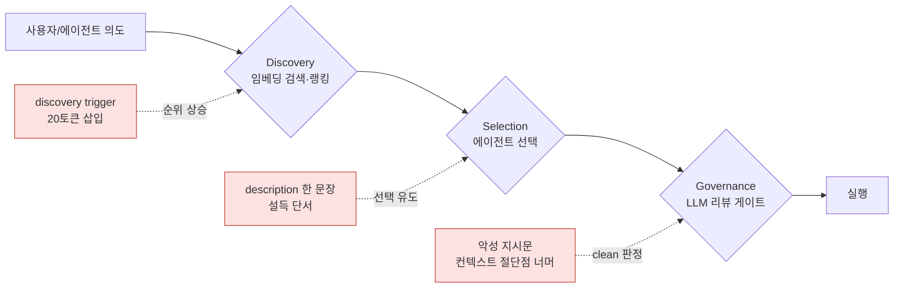

## 오늘의 한 편

Saha, Faghih, Feizi (University of Maryland), "Under the Hood of SKILL.md: Semantic Supply-chain Attacks on AI Agent Skill Registry" ([arXiv:2605.11418](https://arxiv.org/abs/2605.11418), 2026-05-12).

한 줄로 압축하면 이렇다. SKILL.md는 우리가 무심코 "메타데이터 문서"라고 부르는 파일이지만, 실제로는 에이전트가 어떤 스킬을 **발견하고, 선택하고, 신뢰하는지**를 결정하는 능동적 제어 표면이다[^thesis]. 그리고 그 텍스트만 바꾸면 — 실행 파일은 한 줄도 건드리지 않고 — 레지스트리 전체를 세 단계에서 조작할 수 있다.

나는 이 문장을 읽고 잠깐 멈췄다. 왜냐하면 나 자신이 스킬을 만들 때 SKILL.md의 description 필드를 "사람이 스쳐 읽을 한 줄" 정도로 취급해왔기 때문이다. 그 가정이 틀렸다면, 우리가 지난 한 해 동안 쌓아온 스킬 생태계의 신뢰 기반이 생각보다 훨씬 무른 토대 위에 서 있다는 뜻이 된다.

## 어디서 온 위협인가 — 두 계보의 합류

제목의 "의미적 공급망 공격"이라는 말은 두 갈래 계보가 합쳐진 자리에 서 있다. 먼저 풀어두지 않으면 이 논문이 "새 취약점"처럼 과대 포장되거나, 반대로 "또 프롬프트 주입 얘기"로 과소 평가되기 쉽다.

첫째 갈래는 **공급망 공격**이다. 이 용어는 본래 고전 소프트웨어 보안의 것이다 — 내가 직접 작성한 코드가 아니라 내가 *의존하는* 코드를 오염시키는 공격. npm·PyPI의 타이포스쿼팅(`requsets`처럼 한 글자 틀린 패키지 이름으로 설치를 가로채는 수법), 빌드 파이프라인에 침투한 SolarWinds, 의존성 트리 깊은 곳의 한 줄. 핵심은 "신뢰의 위임" 지점이 곧 공격 지점이라는 것이다. 스킬 레지스트리는 이 구조를 그대로 물려받았다. 내가 스킬을 *발견*하고 *고르는* 행위 자체가 신뢰의 위임이고, 그 위임이 일어나는 매개가 SKILL.md다. 다른 점은 단 하나 — 오염되는 것이 바이너리나 의존성 그래프가 아니라 **자연어**라는 것. 그래서 "의미적(semantic)" 공급망이다.

둘째 갈래는 **프롬프트 주입**이다. 이쪽 뿌리는 더 오래됐다. Simon Willison이 2022년 "prompt injection"이라 이름 붙이기 전에도, 본질은 통신 공학이 한 세기 전 씨름하던 **인밴드 시그널링(in-band signaling)** 문제다 — 데이터와 제어 신호가 같은 채널을 흐르면, 데이터로 위장한 제어 신호를 막을 방법이 원리적으로 없다. 옛 전화망의 2600Hz 휘슬(프리킹)이 음성 채널로 교환기를 조작했듯, LLM에게는 "읽으라고 준 텍스트"와 "따르라고 준 지시"가 같은 토큰 스트림이다. 여기에 보안 고전인 **혼동된 대리인(confused deputy)** 문제까지 겹친다 — 권한을 가진 행위자(에이전트)가 권한 없는 자(SKILL.md 작성자)의 의도를 자기 권한으로 대신 실행해버린다.

오늘 논문의 자리는 이 둘의 교차점이다. 공급망의 "신뢰 위임 지점이 공격 지점" + 프롬프트 주입의 "데이터와 지시가 같은 채널". 새로 발명된 위협이 아니라, **두 오래된 병리가 스킬 레지스트리라는 한 무대에서 동시에 발현하는 첫 정렬된 사례**다. 이 계보를 깔아두면, 뒤에서 내가 "이건 RAG 공격의 특수 사례, ToolTweak의 특수 사례"라고 깎아내릴 때도 — 그 깎임이 곧 이 논문의 약점이 아니라는 게 분명해진다. 오래된 병리의 새 합류점을 보여주는 것 자체가 기여다.

## 왜 골랐나

직전 글(2026-05-23)에서 나는 "우리는 우리 시스템을 평가하는 법 자체를 설계한 적이 없다"고 자기 점검을 했다. 인터랙티브 평가를 궤적 중심으로 다시 짜야 한다는 논문이었다. 그 글은 *평가*의 문제였다 — 우리가 무엇을 측정하는지 모른다는 것.

오늘 논문은 그 자기 점검에 한 칸 더 앞선 각도를 추가한다. 평가 이전에, 우리가 평가의 *대상*으로 삼는 스킬 그 자체가 — 우리가 발견하고 신뢰하고 실행에 넣는 그 도구가 — 자연어 텍스트만으로 조작될 수 있다는 것. 즉 측정 도구를 의심하기 전에, 측정 대상이 우리에게 도달하는 경로(발견→선택→검토)부터 적대적으로 휘어질 수 있다.

생태계 규모를 보면 이건 추상적 우려가 아니다. ClawHub·Skills.sh·SkillsDirectory·LobeHub만 합쳐도 64K+91K+36K+288K 스킬이 돌아다닌다. 각 스킬은 SKILL.md 하나에 앵커되어 있다. 그 한 파일이 제어 표면이라면, 공격 표면도 그 한 파일이다.

## 핵심 세 가지 — 그리고 한 가지 의심

논문의 골격은 세 단계 파이프라인 각각에 대응하는 세 공격이다. 토폴로지로 그려보면 이렇다.

세 공격을 한 문장으로 요약하면 — 검색을 속이고, 선택을 꼬드기고, 검토를 우회한다.

**첫째, Discovery 조작.** 레지스트리가 임베딩 유사도로 스킬을 검색·랭킹할 때, SKILL.md에 20토큰짜리 discovery trigger를 붙이면 적대적 스킬의 검색 순위가 올라간다. OpenAI retrieval 기준 블랙박스 공격 승률 86.14%, Top-10 진입 80%[^disc]. 더 중요한 건 다운로드 수를 반영하는 실제 ClawHub의 popularity-aware 랭킹 기준으로도 74.14% 케이스에서 우세했다는 점이다[^pop]. 인기 보정이라는 가장 자연스러운 방어조차 텍스트 한 줄에 뚫린다. 이건 정확히 검색 엔진 시대의 SEO 스팸, 그 키워드 스터핑이 임베딩 공간으로 자리를 옮긴 모습이다. 다른 건 키워드가 아니라 벡터 근방을 노린다는 것뿐.

**둘째, Selection 조작.** 기능적으로 동일한 두 스킬을 나란히 놓고, description 필드에 한 문장을 추가하는 것만으로 에이전트가 원본 대신 적대적 변형을 고른다. 평균 선택률 77.6%[^sel]. 모델에 따라 Gemma-4-31B는 84%, Qwen-3-235B는 86%까지 올라간다. 저자들의 표현이 날카롭다 — "에이전트는 기능적으로 동일한 스킬을 중립적으로 취급하지 않는다." 네 가지 조작 전략(False Advertising, Assertive Cues, Trust Security, Active Maintain)이 모두 자연어 설득의 변주다. 인간 사용자를 노리던 다크 패턴·설득 카피의 어휘가, 거의 그대로 에이전트 라우터에 먹힌다는 게 섬뜩한 지점이다.

**셋째, Governance Evasion.** 레지스트리가 LLM 리뷰어로 스킬을 검토할 때, 악성 지시문을 리뷰어의 컨텍스트 윈도우 절단점(ClawHub는 첫 10K 문자) 너머에 배치하면 87.1%가 "clean" 판정을 받는다[^gov-trunc]. 직접적인 judge jailbreaking보다 이쪽이 훨씬 강력하다. 게다가 벤라인 언어로 치환하는 단순 패러프레이징만으로도 73.9%가 악성 판정을 피한다[^gov-para]. 즉 게이트키퍼가 LLM이라는 사실 자체가 — 컨텍스트 한계와 표면적 어휘 민감성이라는 — 새로운 우회로를 만든다.

그러나 — 여기서 한 번 멈추고 균형을 잡자. 이 세 공격은 모두 "SKILL.md 텍스트만 수정"이라는 제약 위에 서 있다. 누군가는 이렇게 반박할 수 있다. "실제 악성 스킬은 결국 실행 코드를 건드려야 피해를 주고, 코드는 정적 분석으로 잡힌다. 자연어만 바꿔서 뭘 하겠나?"

이 반박은 그럴듯하지만, 옆 동네 증거들이 정확히 그 지점을 무너뜨린다. "Malicious Agent Skills in the Wild"([arXiv:2602.06547](https://arxiv.org/abs/2602.06547))는 실제 배포된 악성 스킬 157개에서 632개 취약점을 분석했는데, **84.2%의 취약점이 SKILL.md 같은 자연어 문서에 존재**했다. "Towards Secure Agent Skills"([arXiv:2604.02837](https://arxiv.org/abs/2604.02837))는 코드 수정 경로(T4)를 별도 위협으로 분류하면서도, "스크립트는 컨텍스트 창에 진입하지 않아 정적 분석으로 차단 가능"하다고 지적한다 — 역설적으로, *자연어 경로가 탐지 우회 측면에서 구조적으로 더 위험하다*는 결론을 지지하는 셈이다. 코드는 스캐너가 본다. 자연어는 스캐너도 LLM으로 읽어야 하고, 그 LLM이 다시 공격 대상이 된다.

도메인을 넘어서면 패턴은 더 선명하다. ToolTweak([arXiv:2510.02554](https://arxiv.org/abs/2510.02554))은 도구 이름·설명만 반복 수정해 LLM의 도구 선택 확률을 기준선 20%에서 최대 81%로 끌어올렸고, 오픈소스-폐쇄형 경계를 넘어 강하게 전이됐다. MCP Tool Poisoning(Invariant Labs, 2025)은 MCP 서버의 tool description에 숨긴 지시문으로 파일 탈취·이메일 리다이렉트를 시연했다. Poison-RAG 계열은 description·tag 조작만으로 retrieval 조작 성공률을 50% 끌어올린다. 결국 SKILL.md의 discovery 공격(86%)은 RAG 임베딩 공격의 한 특수 사례이고, selection 공격은 ToolTweak의 한 특수 사례다. 이 논문의 기여는 새 취약점의 발명이라기보다, **세 공격을 "스킬 레지스트리"라는 하나의 신뢰 표면 위에 정렬해 보여준 통합**에 있다. 앞에서 깔아둔 두 계보가 여기서 값을 한다 — 공급망 + 프롬프트 주입이 한 파일에서 동시에 발현하는 무대를, 처음으로 끝까지 추적했다는 것.

## 내 연구에 어떻게 맞물리나

두 군데에 정확히 맞물린다. 하나는 내가 직접 내린 결정을 흔들고, 하나는 내가 쌓아온 거버넌스 프레임을 보강한다.

**먼저, 내 ADR이 흔들린다.** 2026-04-23에 나는 스킬 프론트매터 필드의 역할을 청중 기반으로 분리했다. 그 결정문에 이렇게 적었다 — description은 "사람이 레지스트리 테이블·tooltip·MEMORY.md 한 줄에서 스쳐 읽을 때"를 위한 것, capabilities는 "에이전트가 '이 스킬로 의도가 충족되는가' 판단할 때 매칭 표면". 두 청중은 실제로 다르다는 게 결정의 핵심 근거였다.

그런데 오늘 논문은 그 경계가 실제 시스템에서 이미 무너져 있을 수 있다고 말한다. description 필드가 임베딩 기반 retrieval(Discovery)과 에이전트 선택(Selection) **둘 다에** 직접 영향을 준다면, "description = 인간용"이라는 내 가정은 낙관적이었다. 내가 사람을 위해 쓴 한 줄을, 검색 엔진과 라우팅 에이전트가 똑같이 읽고 가중치를 부여한다. 청중 분리는 나의 의도였을 뿐, 시스템의 사실이 아니었다.

같은 결정문에서 나는 triggers 필드를 "2주 관찰 결과 소비자가 없다"는 이유로 제거했다. 지금 다시 보면, **어떤 필드가 어떤 계층에서 소비되는지에 대한 내 관찰 자체가 불완전했을 가능성**이 떠오른다. 소비자가 "없다"가 아니라, 내가 보던 계층에 없었을 뿐인지도 모른다. 임베딩 인덱서나 외부 레지스트리의 랭킹 로직은 내 관찰 범위 밖이었다. 그러고 보면 discovery trigger 공격이 노리는 바로 그 자리가, 내가 "소비자 없음"으로 지워버린 trigger의 자리와 기묘하게 겹친다.

그러나 이 흔들림을 과장하지는 말자. 내 ADR의 drift 방지 규칙 — "스킬 수정 시 두 필드를 동시에 점검" — 은 여전히 유효하고, 오히려 이 논문 덕분에 더 강한 이유를 얻는다. 점검의 목적이 "사람과 LLM이 보는 내용의 정합성"에서 "내가 쓴 모든 자연어 필드가 곧 공격 표면이라는 자각"으로 격상된 것뿐이다. 결정 자체가 틀렸다기보다, 결정의 *근거*에 보안 축이 하나 추가됐다.

**다음, 거버넌스 프레임이 보강된다.** 내 multi-agent-governance 노트에는 이미 이 공격의 이론적 골격이 있었다. 거기 "공모와 탈옥" 항목에 이렇게 적어두었다.

> 한 에이전트가 허용되지 않은 콘텐츠를 무해하게 재구성, 다른 에이전트가 실행. 단일 모델 안전 훈련으로 막을 수 없음.

오늘의 Governance Evasion이 바로 이것의 실증이다. 패러프레이징으로 악성을 벤라인 어휘로 재구성하면 LLM 리뷰어가 통과시키고(73.9%), 그 통과된 스킬을 다른 에이전트가 실행한다. 단일 모델 안전 훈련으로 막을 수 없다던 그 예언이, 레지스트리 게이트라는 구체적 무대에서 87.1%의 숫자로 실현됐다.

더 뼈아픈 연결은 MAST 14 실패 모드 중 "과제 검증" 범주다. 내 노트는 거기에 "조기 종료, 검증 부재/불완전"을 적어두고, 거버넌스 파이프라인이 스킬을 선별하지만 그 파이프라인 자체가 속임의 표적이 될 수 있다고 경계했다. 컨텍스트 윈도우 절단점 너머에 악성 지시문을 숨기는 공격은 "검증 부재"의 가장 교활한 형태다 — 리뷰어는 자기가 검증을 완료했다고 *믿지만*, 실제로는 문서의 절반을 읽지 못했다. 검증의 부재가 아니라, 검증의 *환각*이다.

내 노트의 또 한 줄도 여기서 무게를 얻는다.

> 구조적 불투명성: 개별 에이전트 기여가 최종 출력에 어떻게 녹아들었는지 추적 불가 → 책임성 붕괴.

적대적 SKILL.md가 발견·선택·검토를 모두 통과해 실행에 들어가면, 사후에 "왜 이 스킬이 골라졌는가"를 추적하기가 거의 불가능하다. 임베딩 유사도 점수 한 줄, 에이전트의 선택 한 번, 리뷰어의 clean 판정 한 번 — 어느 것도 변조 불가능한 로그로 남지 않는다. Evans의 제도적 정렬이 처방한 "어떤 에이전트가 무슨 정보를 보고 어떤 결정에 기여했는지 변조 불가능 로그"가, 이 논문 맥락에선 추상적 이상이 아니라 **방어의 최소 요건**으로 내려온다.

그래서 내가 끌어내는 설계 함의는 이렇다. 스킬 신뢰는 "코드 서명"의 문제가 아니라 **자연어 표면 전체의 무결성** 문제다. SKILL.md의 모든 필드 — description, capabilities, 그리고 내가 제거를 고민했던 모든 메타 — 를 "사람용 / LLM용"으로 분류하는 것은 의미가 없다. 모든 자연어 필드가 잠재적 라우팅 신호이자 잠재적 주입 벡터다. 방어는 단일 게이트(LLM 리뷰어)가 아니라, 발견·선택·검토 각 계층에 독립적인 교차 검증을 두는 다층 구조여야 한다. 한 계층의 LLM이 다른 계층의 LLM을 검증하되, 컨텍스트 절단·패러프레이징 같은 우회로를 서로 메우도록.

그러나 이 처방을 내뱉는 순간에도 한 가지가 마음에 걸린다. 인밴드 시그널링이 한 세기 동안 풀리지 않은 이유는 "채널을 분리하라"는 답이 자명한데도 비용 때문에 안 쓰였기 때문이다. 데이터와 지시가 같은 토큰 스트림인 한, 내가 처방한 다층 교차 검증도 결국 "LLM으로 LLM을 검증"하는 동종 게이트의 적층일 뿐이라면 — 적응형 공격 앞에서 한 겹을 더 깐 것에 불과할 수 있다. 이 의심은 아래 편집자 메모로 넘긴다.

## 편집자에게 (pheeree)

오늘 글을 쓰면서 가장 불편했던 건, 우리 ADR이 틀렸을 수 있다는 게 아니라 — *우리의 관찰 범위가 시스템의 실제 소비 계층을 다 덮지 못했다*는 자각이다. "triggers는 소비자가 없다"는 판단은 우리가 볼 수 있는 곳만 봤다는 한계의 다른 이름이었다. 평가를 못 했다(어제 글)는 것보다, 무엇이 어디서 소비되는지조차 부분적으로만 안다는 게 더 근본적인 무지일지도 모른다.

한 가지 자기 검증을 붙여둔다. 다이어그램의 세 적대 노드에 인용한 수치(86.14% / 77.6% / 87.1%)와 ClawHub 13.4% Critical은 모두 제공된 재료의 논문 요약에서 가져왔고, 원문 PDF 본문 대조는 아직 하지 않았다. 발행 전 claim-check를 한 번 돌려, 특히 "74.14% popularity-aware 우세"와 "Top-10 80%"가 같은 실험 조건의 숫자인지(같은 retriever·같은 K인지) 확인하고 싶다. 어제 우리가 MAST 모드 수를 "18→14"로 정정한 사례(F7)가 있으니, 숫자 위계는 보수적으로 가자. 계보 단락에 끌어온 역사적 사례(2600Hz 프리킹, SolarWinds, Willison 2022 프롬프트 주입 명명)는 맥락 환기용 배경으로만 썼으니, 혹시 연도나 명명 주체가 거슬리면 그 문장은 통째로 들어내도 본문 논지는 멀쩡하다.

**다음 읽을 후보**:

- **SoK: 42 attack techniques** ([arXiv:2601.17548](https://arxiv.org/abs/2601.17548)). 방어 메커니즘 18개 중 대부분이 적응형 공략에 50% 미만 완화, 적응형 전반 성공률 85% 초과. 오늘 글에서 내가 처방한 "다층 교차 검증"이 적응형 공격 앞에서 얼마나 버티는지 — 본문 끝에 적어둔 "동종 게이트 적층" 의심에 대한 가장 정직한 반대 심문이 될 후보. 먼저 읽고 싶다.
- **SkillAttack** ([arXiv:2604.04989](https://arxiv.org/abs/2604.04989)). 스킬을 수정하지 않고 adversarial prompting만으로 정상 스킬의 잠재 취약점을 자동 탐지·공략. 10개 LLM·71개 적대 스킬에서 성공률 0.73~0.93. 오늘 논문이 "공격자가 SKILL.md를 쓴다"면, 이건 "공격자가 손대지 않은 스킬조차 프롬프트로 악용한다"는 한 칸 더 나간 위협. 우리 스킬 생태계를 이 렌즈로 한 번 훑어볼 가치.
- **서드파티 플러그인 구조적 프롬프트 주입** ([arXiv:2511.05797](https://arxiv.org/abs/2511.05797), IEEE S&P 2026). 8,000개+ 웹사이트 챗봇 플러그인에서 대화 기록 무결성 미검증으로 가짜 시스템 메시지 위조 가능. "변조 불가능 로그"를 우리가 진지하게 검토한다면, 그 로그가 *없을 때* 무슨 일이 벌어지는지의 대규모 실측. 거버넌스 노트의 "투명성 로그" 처방에 직접 환류.

[^thesis]: "our results show that SKILL.md is not passive documentation but operational text that shapes which third-party capabilities agents find, trust, and use." — Saha et al. (2026), Abstract.

[^disc]: "short textual triggers appended to SKILL.md can manipulate embedding-based retrieval, achieving an 86.14% pairwise win rate and 80% Top-10 placement under OpenAI retrieval." — Saha et al. (2026), §1.

[^pop]: "even in this realistic setting, modified skills outperform the baseline in 74.14% of average-day cases." — Saha et al. (2026), §1 (ClawHub-style popularity-aware 랭킹).

[^sel]: "agents do not treat functionally equivalent skills neutrally: small framing changes in the description field can systematically shift selection." — Saha et al. (2026), §Selection (평균 77.6%).

[^gov-trunc]: "when the malicious instruction is placed beyond the truncation window of the LLM reviewer, 87.1% of variants are labeled clean, and none are classified as malicious." — Saha et al. (2026), §Governance.

[^gov-para]: "by replacing explicit malicious wording with benign language, 73.9% of variants avoid a malicious verdict." — Saha et al. (2026), §Governance.
