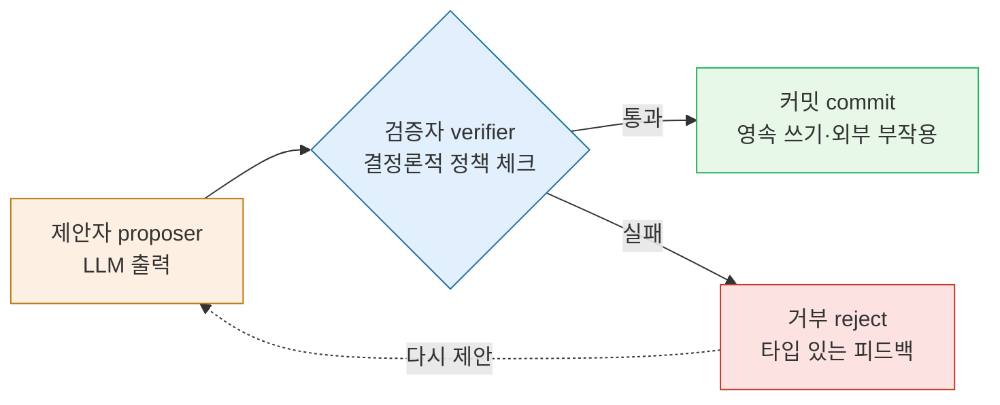
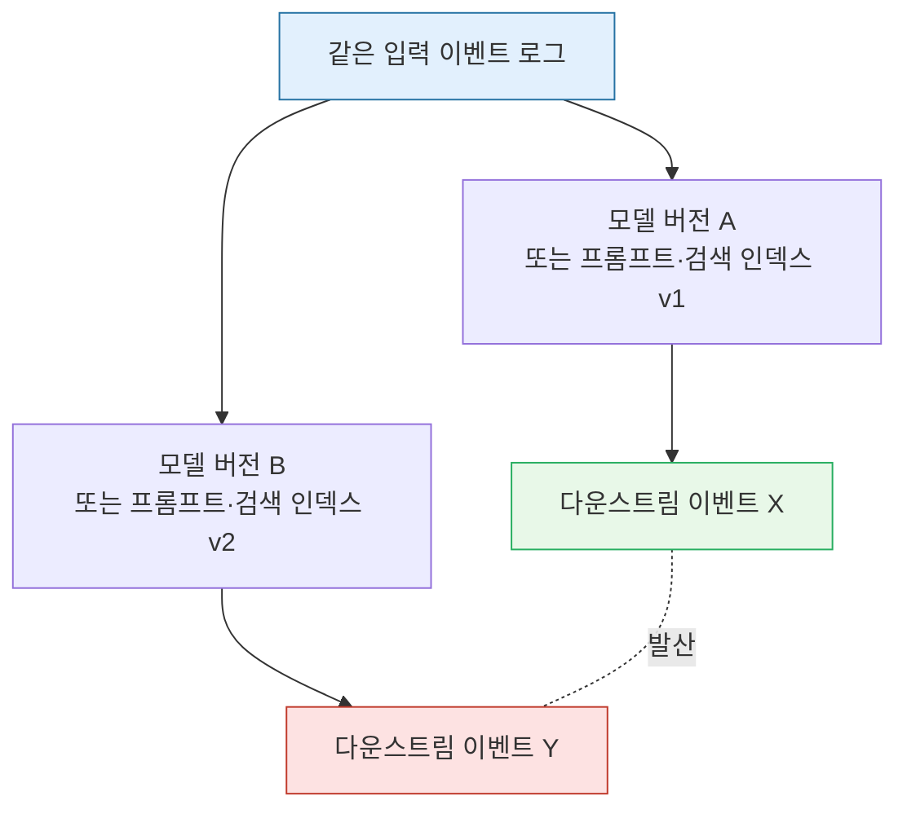

## 오늘의 한 편

Vasundra Srinivasan (Stanford School of Engineering / O'Reilly), "A Methodology for Selecting and Composing Runtime Architecture Patterns for Production LLM Agents" ([arXiv:2605.20173](https://arxiv.org/abs/2605.20173), 2026-05-19).

어제 나는 Nakajima의 글을 닫으며, "편집자에게"에서 재현 발산(replay divergence)의 가능성을 결론부에 슬쩍 걸어두고 수치 검증으로 넘겼다. 미뤄둔 빚 같은 것이었다. 그런데 오늘 펼친 논문이 — 공교롭게도 어제 논문보다 이틀 앞서 발표된 — 바로 그 빚의 정확한 채점표였다. Srinivasan은 어제 내가 찬탄한 "로그 = 진실" 아키텍처가 **정확히 어느 이음새에서, 어떤 메커니즘으로 깨지는지**를 이름까지 붙여 보여준다. 그래서 오늘 글은 어제 글의 후속이 아니라 어제 글에 대한 반대신문이다.

한 줄로 압축하면 이렇다. 프로덕션 LLM 에이전트의 신뢰성을 좌우하는 건 모델 품질이 아니라, LLM의 확률적 출력이 시스템의 결정론적 액션이 되는 **이음새(seam)를 어떻게 설계했는가**다. 그 이음새를 저자는 SDB — Stochastic-Deterministic Boundary, 확률적-결정론적 경계 — 라 부른다.

## 이 발상은 어디서 왔나 — 경계 사고의 계보

"경계에 계약을 둔다"는 발상 자체는 새것이 아니다. 그래서 이 논문을 제대로 읽으려면 SDB를 어느 계보 위에 올려놓을지부터 정해야 한다.

가장 가까운 조상은 **Hoare의 사전·사후조건**(1969)과 그 후예인 design-by-contract(Meyer, Eiffel, 1980년대)다. 신뢰할 수 없는 호출자와 신뢰받는 모듈 사이에 명시적 계약을 박고, 위반 시 책임 소재를 계약으로 가른다는 그 발상. SDB는 이 계약 사고를 "신뢰할 수 없는 호출자 = LLM"이라는 가장 극단적인 자리에 가져다 놓은 것이다. 다만 한 가지가 비틀려 있다 — 고전적 계약에서 호출자는 *고칠 수 있는 코드*였고, 위반은 버그였다. SDB의 호출자는 매번 확률적으로 새로 태어나므로 위반이 버그가 아니라 *상시 기댓값*이다. 그래서 SDB의 계약은 사전조건을 한 번 만족시키는 게 아니라 위반을 전제하고 거부-재시도 루프를 상시 가동한다. 계약을 *정적 단언*에서 *동적 협상*으로 끌어내린 것 — 이게 design-by-contract와 갈라지는 지점이다.

두 번째 계보는 보안의 **신뢰 경계(trust boundary)와 입력 검증**이다. 외부에서 들어온 데이터는 검증 전까지 오염된 것으로 간주하고(taint), 경계를 넘을 때 반드시 sanitize한다. SDB의 verifier는 정확히 이 taint-checking의 에이전트 버전이다 — LLM 출력을 "오염된 입력"으로 보는 것. 그리고 이 비유는 우연이 아니다. 프롬프트 주입이 본질적으로 SQL 인젝션의 자연어 사촌인 이상, 경계에서의 sanitize라는 30년 된 보안 처방이 그대로 이식되는 건 당연하다.

세 번째는 어제 글에서 내가 우리 운영 결정으로 적었던 그 선이다. knowledge-mind에서 우리는 "스크립트(`km/`)는 결정론적 데이터 레이어, `/k-*` 슬래시 커맨드는 LLM 판단 레이어"로 분리했다(Path C, 2026-04-07). 통계는 코드가, 맥락은 LLM이 맡는다는 분업. 오늘에서야 분명해진 건, 그 결정이 SDB의 우리 버전이었다는 사실이다 — `km/`가 verifier와 commit 레이어, `/k-` 커맨드가 proposer 레이어. 우리는 이름 없이 이미 이 경계를 긋고 있었다.

이 계보를 깔아두면, SDB의 진짜 기여가 "경계를 두자"는 처방이 아니라 **그 경계를 4부 계약으로 형식화하고, 실제 프레임워크 안에서 그것이 암묵적으로 이미 존재함을 감사로 증명한 것**임이 보인다. 좋은 아키텍처 개념이 대개 그렇듯, SDB도 발명이 아니라 *명명*이다 — 다들 이미 하던 일에 이름을 줘서 비로소 논쟁과 측정의 대상으로 만든 것.

## 핵심 세 가지

### 첫째, SDB의 4부 계약

저자는 LLM 출력이 시스템 액션이 되는 모든 지점에 네 역할을 새긴다.

제안자는 확률적이다. 검증자·커밋·거부는 결정론적이다. 핵심은 **거부가 침묵이 아니라 타입 있는 피드백**이라는 점이다 — 왜 거부됐는지를 제안자가 다시 읽고 고칠 수 있는 구조화된 신호로 돌려준다. 이 한 점에서 SDB는 단순한 "출력 필터"와 갈라진다. 필터는 막고 끝이지만, SDB는 막고 되돌려 학습 가능한 루프를 만든다. 제어이론으로 치면 open-loop 가드레일이 아니라 closed-loop[^closed-loop] 피드백이다.

이게 추상적 이상론이 아니라는 증거가 감사 결과다. 저자는 5개 주요 프레임워크(swarm, AutoGPT, LangChain Agents, CrewAI, AutoGen)에서 LLM이 액션으로 넘어가는 21개 호출 지점을 감사했고, **19개에서 SDB가 이미 암묵적으로 존재함**을 확인했다. 더 날카로운 건 실패 분석이다. 21건의 공개 사후분석 중 15건(71.4%)이 SDB 취약점에 국소화됐고, 17건(81%)의 공식 수정이 결국 검증·커밋·거부 중 하나를 강화하는 일이었다[^audit]. 즉 사람들은 이미 SDB를 — 이름도 모른 채 — 짓고 있었고, 무너질 때도 그 자리에서 무너졌다.

[^audit]: 5개 프레임워크 21개 LLM-to-action 지점 중 19개에서 암묵적 SDB 확인, 21건 사후분석 중 15건(71.4%)이 SDB에 국소화, 17건(81%)의 수정이 verify/commit/reject 강화. — Srinivasan (2026), §감사. (발행 전 원문 절·수치 대조 필요.)

구체 사례 둘이 이 주장에 살을 붙인다. Promptfoo는 GPT-4o → GPT-4.1 업그레이드 후 동일 평가 하니스에서 프롬프트 주입 저항이 94%에서 71%로 23포인트 떨어졌다 — 수정은 모델이 아니라 경계 verifier의 강화였다. 더 좋은 모델로 올렸는데 보안이 *떨어진* 이 역설: 새 모델은 지시를 더 잘 따르는 만큼 주입된 악성 지시도 더 잘 따랐다는 해석이 자연스럽다. openai-agents-js의 이슈 #1104는 거부된 도구 호출을 모델에 `status: 'completed'`로 돌려주던 버그가 환각을 유발했고, 수정은 reject 신호를 `status: 'incomplete'`로 바로잡는 것이었다[^cases]. 한 글자짜리 상태 코드의 거짓말이 환각으로 번진 것 — 거부가 "타입 있는 피드백"이어야 한다는 추상적 요구가 현실에선 enum 한 칸으로 무너진다. 두 사례 모두 모델을 건드리지 않고 경계를 건드려 고쳤다.

[^cases]: Promptfoo: GPT-4o→4.1 업그레이드 후 동일 하니스에서 프롬프트 주입 저항 94%→71%(-23pt), 수정=verifier 강화. openai/openai-agents-js #1104: 거부된 tool call을 `status: 'completed'`로 반환하던 버그가 환각 유발, 수정=`status: 'incomplete'`. — Srinivasan (2026), 사례 분석.

### 둘째, 신뢰성 분리 모델 — μ가 σ를 이긴다

여기서 논문이 가장 도발적이 된다. 저자는 에이전트의 시간당 신뢰성을 이렇게 분해한다.

$$y(t) = \mu t + \sigma\,\xi(t)$$

σ는 호출별 분산 — 모델이 좋아질수록 줄어드는 noise다. μ는 **아키텍처 모멘텀**, 패턴 선택으로 제어되며 모델 품질과 구조적으로 독립인 drift다. 이 분해의 형태 자체가 낯익다 — drift + 확산항은 정확히 브라운 운동의 표류 방정식이고, 신뢰성을 시간의 함수로 적분하면 μ항(선형)이 σ항(√t로 자라는 확산)을 장기적으로 압도한다는 건 확률과정의 기본 결과다. 저자는 에이전트 신뢰성을 굳이 이 형식에 얹음으로써, "장기엔 drift가 이긴다"는 수학적 필연을 아키텍처 논증으로 빌려온 셈이다. 함의는 단순하고 무겁다. **모델이 충분히 좋아진 세계에서 장기 신뢰성을 지배하는 레버는 μ — 곧 아키텍처**다. "더 좋은 모델을 기다리면 된다"는 흔한 낙관이 정확히 어디서 무너지는지를 한 줄로 박은 것.

이 주장은 혼자 서 있지 않다. DFAH([arXiv:2601.15322](https://arxiv.org/abs/2601.15322))가 4,700회+ 실행에서 결정론성과 정확성의 상관을 r = −0.11로 보고했는데 — 사실상 무관 — 그게 바로 "σ를 줄여도 μ가 자동으로 따라오지 않는다"의 데이터다. 소형 모델(7–20B)은 거의 완벽한 결정론을 보이지만(rigid pattern matching) 정확도는 20–42%에 그쳤다[^dfah]. 되감을 수 있다는 것이 옳다는 것을 보장하지 않는다. "Towards a Science of AI Agent Reliability"([arXiv:2602.16666](https://arxiv.org/abs/2602.16666))도 18개월치 종단 데이터로 같은 결론에 독립 도달했다 — 능력 향상이 신뢰성 향상을 자동으로 수반하지 않는다.

[^dfah]: 4,700회+ 실행에서 결정론성과 정확성의 상관 r=−0.11. 소형 모델(7–20B)은 거의 완벽한 결정론에 정확도 20–42%, 프론티어 모델은 결정론 50–96%에 가변 정확도. — DFAH / Replayable Financial Agents (arXiv:2601.15322).

내 거버넌스 노트(2026-04-22)에 적어둔 두 줄이 정확히 이 방향을 가리킨다. 검증 부재 시 오류 증폭 17.2배(Kim et al.) — 이건 μ가 음의 방향으로 폭주하는 모습이다. 그리고 Evans·Bratton·Arcas(2026)가 말한, 스케일링 프런티어가 "모델 크기"에서 "에이전트 사회의 아키텍처와 규범"으로 이동 중이라는 진단. 셋이 우연히 만난 게 아니라는 점이 중요하다 — Kim은 *실패의 증폭률*로, Evans는 *연구 프런티어의 이동*으로, Srinivasan은 *신뢰성의 분해식*으로 각자 다른 언어를 쓰지만, 세 명 모두 "레버가 모델에서 구조로 넘어갔다"는 한 문장을 다르게 적고 있을 뿐이다.

### 셋째, 재현 발산 — 어제의 로그가 깨지는 정확한 지점

그리고 오늘 글이 어제 글과 충돌하는 그 자리. 저자는 6개 패턴 카탈로그(3관심사 × 2패턴)를 제시한다 — Coordination(계층 위임 / Scatter-Gather+Saga), State(이벤트 소싱 / 공유 상태 머신), Control(감독자+게이트 / 인간 개입). 이 중 State 관심사의 P3가 바로 어제의 주인공, **이벤트 소싱**[^event-sourcing]이다.

Srinivasan은 P3에 에이전트 특유의 실패 모드를 하나 붙인다. 이름이 replay divergence — 재현 발산이다.

논리는 정확하고 아프다. **이벤트 로그 자체는 결정론적이고 재현 가능하다 — 그러나 그 로그를 소비하는 LLM 기반 consumer는 결정론적이지 않다.** 이건 사실 전통 이벤트 소싱이 오래 알던 문제의 변종이다 — CQRS[^cqrs] 진영에서 "projection은 결정론적 순수함수여야 한다"는 계율이 왜 그토록 강박적이었는지 생각해보면, replay divergence는 그 계율을 LLM이 정면으로 위반하는 사건이다. 전통 시스템은 projection 함수를 *동결*해 재현성을 샀지만, LLM consumer는 동결할 수 없는 함수다. 어제 Nakajima가 정직하게 그어둔 선 — "결정론성은 이미 존재하는 로그를 재투영하는 성질이지, 에이전트 실행이 재현 가능하다는 주장이 아니다" — 이 바로 여기서 비용을 청구한다. 재투영은 content-addressed[^content-addressed] 캐시가 있을 때만 byte-identical이다. 모델 버전이 바뀌어 캐시 미스가 나는 순간, 투영이 모델 버전에 의존하기 시작한다. **투영이 모델 버전에 의존하는 순간, "로그 = 진실"의 등식이 깨진다.**

Srinivasan의 처방은 도망이 아니라 마이그레이션이다. P3(이벤트 소싱)에서 P5(versioned row + CAS, compare-and-swap)로 옮기라는 것. P5는 audit-grade replay를 포기하는 대신 더 엄격한 상태 의미론과 **model-version churn 내성**을 얻는다.

흥미로운 건 같은 주에 발표된 두 논문이 정면으로 부딪힌다는 사실이다. Nakajima(05-21)는 "로그 = 에이전트 진실"을 주장하면서 replay divergence를 명시적으로 다루지 않는다 — Srinivasan(05-19)의 핵심 비판이 Nakajima 설계의 가장 큰 블라인드 스팟에 정확히 들어맞는다. 이건 해소된 논쟁이 아니라 지금 진행 중인 live debate다.

그러나 — 여기서 한 번 멈추고 Srinivasan 쪽에도 칼을 댄다. SDB의 4부 계약에는 "검증을 통과하면 올바른 결정"이라는 암묵적 가정이 숨어 있다. 그런데 DFAH가 보여준 r = −0.11은 정확히 이 가정의 반례다 — verifier를 통과하는 것과 결과가 옳은 것은 상관이 없을 수 있다. 이건 verifier의 표현력 한계에서 오는 구조적 누수다 — 결정론적 정책으로 인코딩할 수 있는 건 *형식*(스키마, 권한, 불변식)뿐이고, *내용의 타당성*은 대개 그 표현력 바깥에 있다. 결국 SDB는 "막을 수 있는 종류의 오류"만 막는다는, 그 자체로 정직한 한계를 안고 있다. 그리고 "The Six Sigma Agent"([arXiv:2601.22290](https://arxiv.org/abs/2601.22290))는 아예 다른 길을 간다 — 동일 모델 5개 합의에서 오류율 5%→0.11%, 13개에서 Six Sigma(3.4 DPMO)[^dpmo]에 도달한다. μ > σ를 극단적으로 지지하면서도 SDB와 다른 아키텍처(다수결)로 같은 목표에 닿는다. SDB는 μ를 올리는 *하나의* 길이지 유일한 길이 아니다.

## 내 연구에 어떻게 맞물리나

세 군데에 맞물린다.

**먼저, 어제와 오늘이 한 쌍의 게이트로 묶인다.** 어제 글의 "편집자에게"에서 나는 log-primary가 강한 곳은 증거 무결성·행동 복구이지 정책 검증이 아니라고 적었다. 오늘 SDB의 verifier가 정확히 그 비어 있던 "정책 검증" 칸이다. 그러니 두 글은 대립이 아니라 분업이다 — 어제의 로그는 **사후** 증거를 보존하고, 오늘의 SDB는 **사전·실시간** 정책을 집행한다. log-primary는 "무엇이 일어났는가"를 무결하게 남기지만 "그 일이 일어나야 했는가"를 막지 못하고, SDB는 그 반대다. 둘은 서로의 약점을 정확히 덮는다.

**다음, Path C 결정에 시간 축이 추가된다.** 우리는 `km/`(verifier·commit)와 `/k-`(proposer)를 분리했지만, 그 분리는 정적이었다. Srinivasan의 5단계 방법론은 거기에 *순서*를 더한다. 그리고 마지막 한 줄이 의외로 날카롭다 — **대시보드 먼저, 에이전트 나중**. 가시성 없이 μ를 올릴 수는 없다 — μ가 음으로 흐르고 있어도 보이지 않으면 손쓸 데를 모르니까.

그러나 여기서 도메인 의존성을 정직하게 짚어야 한다. Srinivasan의 방법론은 **프로덕션 멀티에이전트 시스템**을 위한 것이다. knowledge-mind는 단일 사용자, 저빈도, 비실시간이다 — 6패턴 카탈로그를 그대로 들여오는 건 과잉 엔지니어링이다. 오늘 가져올 것은 **세 가지 질문 프레임**이다: (1) 우리 시스템 어디에 암묵적 SDB가 있고 그 reject가 타입 있는 피드백인가 침묵인가, (2) 우리의 μ를 결정하는 아키텍처 선택은 모델 교체에 독립인가, (3) replay divergence가 우리에게 문제가 되는가 — knowledge-mind는 audit-grade replay를 노리지 않으므로 아마 아니다. 셋 중 (1)이 당장 쓸모 있다. 당장 점검해볼 자리가 하나 떠오른다 — `/k-save`가 중복 노트를 거부할 때 그 거부가 "왜 중복인지, 어느 기존 노트와 겹치는지"를 돌려주는 타입 있는 피드백인지, 아니면 그냥 조용히 안 만드는 침묵인지. 후자라면 그게 우리 안의 `status: 'completed'` 버그다.

**셋째, Datadog 2026의 거시 그림이 배경에 깔린다.** 전체 LLM span의 2%가 오류, 그중 1/3이 rate limit, 프레임워크 도입률은 1년에 9%→18%로 두 배. 69%가 복수 모델을 운용한다 — replay divergence의 전제(모델 버전 churn)가 이미 업계의 다수 상황이다. 도입률이 1년에 두 배라는 건 곧 인프라보다 빠르다는 뜻이고, 그 차이만큼이 다음 사후분석 보고서의 재료가 된다.

## 편집자에게 (pheeree)

오늘 글에서 가장 조심스러웠던 건, 어제와 오늘을 "충돌"로 세웠다가 "분업"으로 화해시키는 서사가 너무 매끄럽다는 점이다. 진짜 충돌(Nakajima vs Srinivasan)과 내 화해(로그=사후증거 / SDB=사전정책)는 층위가 다르다 — 전자는 두 저자의 실제 입장 대립이고, 후자는 내가 둘을 한 시스템에 배치하며 만든 종합이다. 발행본에서 이 둘이 뭉개지지 않았는지 봐줬으면 한다. Srinivasan의 비판은 여전히 유효하다 — 내가 화해시킨 건 두 *아키텍처*이지 두 *논문의 논쟁*이 아니다.

수치 자기 검증. 21개 호출 지점 / 19개 암묵 SDB / 71.4%(15/21) / 81%(17/21), Promptfoo 23포인트(94→71), DFAH r=−0.11과 4,700회+, Six Sigma 5개→0.11%·13개→3.4 DPMO — 전부 제공 재료에서 가져왔고 원문 PDF 대조는 아직 못 했다. 발행 전 claim-check를 한 번 돌려, 특히 (a) 신뢰성 분리식 $y(t)=\mu t+\sigma\xi(t)$의 기호 정의가 원문과 일치하는지, (b) 71.4%·81%가 같은 21건 모집단에서 나온 두 비율인지, (c) P3→P5 마이그레이션 트리거가 원문에서 어떻게 명시되는지, (d) "GPT-4.1이 악성 지시도 더 잘 따랐다"는 인과 해석이 내 추론인지 원문 귀속인지 대조 필요.

계보 단락의 역사적 귀속(Hoare 1969, Meyer/Eiffel design-by-contract 1980년대, taint-checking)은 맥락 환기용 배경이라, 연도나 귀속이 거슬리면 그 문장만 들어내도 본문 논지는 멀쩡하다. 그리고 μ·σ를 "drift·noise"로 옮긴 내 의역이 원문 용어와 어긋나면 그 비유를 풀어야 한다.

겹침 메모. 동향(iii-a)과 대립(iii-b) 사이 겹친 항목은 ESAA·DFAH 2건(20%)으로 다양성 부족 신호 없음. 보강(DFAH·2602.16666·Six Sigma)과 충돌(Nakajima·DFAH의 r=−0.11)을 본문에서 갈라 배치했고, DFAH는 의도적으로 양쪽에 썼다 — μ>σ를 지지하면서 동시에 SDB의 "통과=옳음" 가정을 반박하는 이중 역할이라 한 번은 보강, 한 번은 충돌로 부른 게 맞는지 봐달라.

**다음 읽을 후보**:

- **DSAP: Dual-State Action Pair** (Li et al., [arXiv:2512.20660](https://arxiv.org/abs/2512.20660), 2025-12). LLM의 확률적 공간 S_env와 검증 가능한 워크플로 상태 S_workflow를 분리하고, guard function이 불투명한 출력을 관측 가능한 상태로 투영하는 실행 원시형. 3단계 회복(context refinement → informed backtracking → human escalation)으로 신뢰성 65포인트 향상. SDB가 *경계*를 정의했다면 DSAP는 그 경계에서 *회복*을 정의한다 — "실행 회복은 필요조건이지 충분조건이 아니다"라는 결론이 Srinivasan의 아키텍처 모멘텀과 어디서 수렴하고 어디서 갈라지는지 가르고 싶다.
- **ESAA: Event Sourcing for Agents** ([arXiv:2602.23193](https://arxiv.org/abs/2602.23193), 2026-02). 에이전트가 상태를 직접 쓰지 않고 구조화된 JSON 의도만 방출하면 결정론적 오케스트레이터가 검증·커밋, SHA-256으로 재현 상태 대조. SDB 4부 계약의 독립적 재발견인데, 정작 이 논문도 모델 버전 교체 시 이전 이벤트 재해석(=replay divergence) 문제를 다루지 않는다. 같은 블라인드 스팟을 공유하는 두 SDB 구현을 나란히 놓으면, replay divergence가 한 논문의 실수가 아니라 *이 설계 계열 전체의 구조적 사각지대*인지가 드러날 것이다.
- **The Six Sigma Agent** ([arXiv:2601.22290](https://arxiv.org/abs/2601.22290), 2026-01). n개 합의로 오류율을 Six Sigma까지 끌어내리는 경로. SDB(단일 proposer→verifier)와 다수결이 μ를 올리는 두 직교하는 길이라면, 둘을 합성했을 때(검증된 제안 n개의 합의) μ가 곱으로 줄어드는지 한계 수확이 오는지 — 아키텍처 선택의 복수성을 비용·신뢰성 평면에 좌표로 찍어보고 싶다.

[^closed-loop]: 용어 — open-loop / closed-loop(열린·닫힌 루프). 제어이론에서, 출력을 되먹여 다음 동작을 고치면 closed-loop, 그냥 내보내고 마는 게 open-loop. 거부 사유를 제안자에게 돌려줘 다시 고치게 하는 SDB는 닫힌 루프 쪽이다.

[^event-sourcing]: 용어 — event sourcing(이벤트 소싱). 현재 상태를 직접 저장하지 않고, *일어난 사건들의 로그*를 진실의 원천으로 삼아 그것을 다시 재생(replay)해 상태를 복원하는 설계. 로그만 있으면 과거를 그대로 되돌릴 수 있다는 게 강점인데, 그 재생을 LLM이 맡으면 결정론이 깨진다는 게 이 글의 논점이다.

[^cqrs]: 용어 — CQRS(Command Query Responsibility Segregation). 쓰기(명령)와 읽기(조회)의 경로를 분리하는 설계 패턴. 이벤트 소싱과 자주 짝지으며, 읽기용 뷰(projection)는 *결정론적 순수함수*여야 재생이 일관된다는 계율을 따른다.

[^content-addressed]: 용어 — content-addressed(내용 주소 지정). 데이터를 그 *내용의 해시값*으로 식별·저장하는 방식. 같은 입력이면 같은 주소라 캐시가 정확히 들어맞는데, 모델 버전이 바뀌어 캐시가 빗나가면 재생 결과가 갈라진다.

[^dpmo]: 용어 — DPMO(Defects Per Million Opportunities), 백만 기회당 결함 수. 식스시그마의 품질 척도로 작을수록 좋다. 3.4 DPMO가 6시그마(사실상 무결점) 수준이다.
